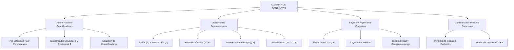

# TEMA I: Álgebra de Conjuntos, Cuantificadores y Operaciones

---

## 1. FICHA TÉCNICA Y MATRIZ DE COMPETENCIAS

| Parámetro | Especificación Oficial |
| :--- | :--- |
| **Eje Temático** | EJE II: Matemática |
| **Asignatura / Componente** | Álgebra |
| **Tema Oficial N.°** | Tema I: Conjuntos y operaciones |
| **Referencia Prospecto UNSA** | Resolución de Consejo Universitario N.° 0028-2026 (Págs. 9, 44-45) |
| **Ponderación por Pregunta** | **Ingenierías:** 1.658337400 pts (4 preg. = 6.633350 pts)<br>**Biomédicas:** 1.265447400 pts (3 preg. = 3.796342 pts)<br>**Sociales:** 0.824574000 pts (3 preg. = 2.473722 pts) |
| **Nivel de Complejidad Cognitiva** | Bloom: Análisis Lógico-Algebraico, Demostración Formal y Resolución Estructural |
| **Conexión Interuniversitaria** | **UNSA:** Simplificación booleana de expresiones conjuntistas complejas, cuantificadores con negación y problemas de 3 conjuntos con regiones vacías.<br>**UNMSM (DECO):** Encuestas poblacionales de mercado, análisis epidemiológico de comorbilidades y optimización de grupos focales.<br>**UNI:** Demostración axiomática de leyes de absorción y De Morgan en reticulados booleanos, producto cartesiano infinito y familias indexadas de conjuntos. |

### Matriz de Indicadores de Logro Evaluados
1. **Lógica de Cuantificadores y Determinación de Conjuntos:** Expresar y negar proposiciones cuantificadas universalmente ($\forall$) y existencialmente ($\exists$) en universos numéricos.
2. **Álgebra Booleana de Conjuntos:** Demostrar y aplicar las leyes del álgebra de conjuntos (idempotencia, De Morgan, distributividad y absorción) para simplificar esquemas complejos sin diagramas.
3. **Cardinalidad y Operaciones Combinadas:** Resolver problemas de cardinalidad de dos y tres conjuntos utilizando el principio de inclusión-exclusión y diagramas de Venn-Euler y Carroll.
4. **Producto Cartesiano y Relaciones:** Construir el producto cartesiano $A \times B$, determinar su cardinal $n(A \times B) = n(A) \cdot n(B)$ y analizar sus propiedades en el plano $\mathbb{R}^2$.

---

## 2. MAPA TAXONÓMICO Y ONTOLOGÍA



---

## 3. DESARROLLO TEÓRICO FORMAL

### 3.1 Noción Primitiva y Cuantificadores Lógicos en Álgebra
Un conjunto es una colección bien definida de objetos llamados **elementos**. La relación de **pertenencia** ($\in$) vincula exclusivamente un elemento con un conjunto:
$$x \in A \quad (x \text{ pertenece a } A)$$

#### Determinación de Conjuntos
1. **Por Extensión (Forma Tabular):** Se enumeran explícitamente todos sus elementos: $A = \{2, 3, 5, 7, 11\}$.
2. **Por Comprensión (Forma Constructiva):** Se enuncia la propiedad común definitoria:
   $$A = \{x \in \mathbb{U} \mid P(x)\}$$

#### Cuantificadores Lógicos
* **Cuantificador Universal ($\forall$):** "Para todo", "para cualquier", "para cada".
  $$\forall x \in A: P(x) \iff P(x_1) \land P(x_2) \land \dots \land P(x_n)$$
* **Cuantificador Existencial ($\exists$):** "Existe al menos un", "para algún".
  $$\exists x \in A: P(x) \iff P(x_1) \lor P(x_2) \lor \dots \lor P(x_n)$$
* **Leyes de Negación de Cuantificadores:**
  $$\sim[\forall x \in A: P(x)] \equiv \exists x \in A: \sim P(x)$$
  $$\sim[\exists x \in A: P(x)] \equiv \forall x \in A: \sim P(x)$$

---

### 3.2 Operaciones Fundamentales entre Conjuntos

1. **Unión ($\cup$):**
   $$A \cup B = \{x \mid x \in A \lor x \in B\}$$
2. **Intersección ($\cap$):**
   $$A \cap B = \{x \mid x \in A \land x \in B\}$$
3. **Diferencia Relativa ($A - B$):**
   $$A - B = \{x \mid x \in A \land x \notin B\} = A \cap B^c$$
4. **Complemento ($A^c$ o $A'$ o $\complement A$):**
   $$A^c = \{x \in \mathbb{U} \mid x \notin A\} = \mathbb{U} - A$$
5. **Diferencia Simétrica ($A \triangle B$):**
   $$A \triangle B = (A \cup B) - (A \cap B) = (A - B) \cup (B - A)$$
   $$A \triangle B = \{x \mid (x \in A \land x \notin B) \lor (x \in B \land x \notin A)\}$$

---

### 3.3 Leyes del Álgebra de Conjuntos (Estructura de Álgebra de Boole)

| Denominación de la Ley | Operación con Unión ($\cup$) | Operación con Intersección ($\cap$) |
| :--- | :--- | :--- |
| **Idempotencia** | $A \cup A = A$ | $A \cap A = A$ |
| **Conmutatividad** | $A \cup B = B \cup A$ | $A \cap B = B \cap A$ |
| **Asociatividad** | $(A \cup B) \cup C = A \cup (B \cup C)$ | $(A \cap B) \cap C = A \cap (B \cap C)$ |
| **Distributividad** | $A \cup (B \cap C) = (A \cup B) \cap (A \cup C)$ | $A \cap (B \cup C) = (A \cap B) \cup (A \cap C)$ |
| **De Morgan** | $(A \cup B)^c = A^c \cap B^c$ | $(A \cap B)^c = A^c \cup B^c$ |
| **Absorción Total** | $A \cup (A \cap B) = A$ | $A \cap (A \cup B) = A$ |
| **Absorción Parcial** | $A \cup (A^c \cap B) = A \cup B$ | $A \cap (A^c \cup B) = A \cap B$ |
| **Identidad (Neutros)** | $A \cup \emptyset = A, \quad A \cup \mathbb{U} = \mathbb{U}$ | $A \cap \mathbb{U} = A, \quad A \cap \emptyset = \emptyset$ |
| **Complementación** | $A \cup A^c = \mathbb{U}, \quad (A^c)^c = A$ | $A \cap A^c = \emptyset, \quad \mathbb{U}^c = \emptyset, \quad \emptyset^c = \mathbb{U}$ |
| **Diferencia** | $A - B = A \cap B^c$ | $(A - B)^c = A^c \cup B$ |

---

### 3.4 Cardinalidad y Principio de Inclusión-Exclusión

El cardinal de un conjunto finito $A$, denotado $n(A)$ o $|A|$, es el número de elementos distintos que posee.

1. **Para dos conjuntos $A$ y $B$:**
   $$n(A \cup B) = n(A) + n(B) - n(A \cap B)$$
   $$n(A - B) = n(A) - n(A \cap B)$$
   $$n(A \triangle B) = n(A \cup B) - n(A \cap B) = n(A - B) + n(B - A)$$
2. **Para tres conjuntos $A, B$ y $C$ (Principio de Inclusión-Exclusión de Sylvester):**
   $$n(A \cup B \cup C) = n(A) + n(B) + n(C) - [n(A \cap B) + n(A \cap C) + n(B \cap C)] + n(A \cap B \cap C)$$
3. **Conjunto Potencia ($\mathcal{P}(A)$):**
   Subconjunto formado por todos los subconjuntos posibles de $A$:
   $$n(\mathcal{P}(A)) = 2^{n(A)}$$
   $$\text{Subconjuntos propios} = 2^{n(A)} - 1$$

---

### 3.5 Producto Cartesiano ($A \times B$)
Dados dos conjuntos no vacíos $A$ y $B$, su producto cartesiano es el conjunto de todos los pares ordenados $(a, b)$ tales que la primera componente pertenece a $A$ y la segunda componente pertenece a $B$:
$$A \times B = \{(a, b) \mid a \in A \land b \in B\}$$
* **Propiedades:**
  1. No es conmutativo: $A \times B \neq B \times A$ (salvo que $A = B$ o alguno sea $\emptyset$).
  2. Cardinal del producto: $n(A \times B) = n(A) \cdot n(B)$.
  3. Distributividad:
     $$A \times (B \cup C) = (A \times B) \cup (A \times C)$$
     $$A \times (B \cap C) = (A \times B) \cap (A \times C)$$
     $$A \times (B - C) = (A \times B) - (A \times C)$$

---

## 4. FORMULARIO MAESTRO (LATEX ESTRICTO)

| Ley / Identidad | Expresión Matemática Rigurosa |
| :--- | :--- |
| **Negación Universal** | $\sim[\forall x: P(x)] \equiv \exists x: \sim P(x)$ |
| **Negación Existencial** | $\sim[\exists x: P(x)] \equiv \forall x: \sim P(x)$ |
| **Leyes de De Morgan** | $(A \cup B)^c = A^c \cap B^c, \quad (A \cap B)^c = A^c \cup B^c$ |
| **Absorción Total** | $A \cup (A \cap B) = A, \quad A \cap (A \cup B) = A$ |
| **Absorción Parcial** | $A \cup (A^c \cap B) = A \cup B, \quad A \cap (A^c \cup B) = A \cap B$ |
| **Diferencia como Intersección** | $A - B = A \cap B^c$ |
| **Inclusión-Exclusión (2 conjuntos)** | $n(A \cup B) = n(A) + n(B) - n(A \cap B)$ |
| **Inclusión-Exclusión (3 conjuntos)** | $n(A \cup B \cup C) = \sum n(A) - \sum n(A \cap B) + n(A \cap B \cap C)$ |
| **Cardinal Potencia** | $n(\mathcal{P}(A)) = 2^{n(A)}$ |
| **Cardinal Producto Cartesiano** | $n(A \times B) = n(A) \cdot n(B)$ |

---

## 5. MNEMOTECNIAS DE COMBATE PREUNIVERSITARIO

### 1. Las Leyes de Absorción: "El Monstruo Mayor y el Signo Opuesto"
* **Absorción Total ($A$ dentro y fuera):**
  $$A \cup (A \cap B) = A$$
  *Mnemotecnia:* Si la misma letra $A$ está afuera y adentro con signos cambiados ($\cup$ y $\cap$), $A$ se "traga" a toda la expresión y elimina a $B$.
* **Absorción Parcial ($A$ afuera y $A^c$ adentro):**
  $$A \cup (A^c \cap B) = A \cup B$$
  *Mnemotecnia:* El complemento $A^c$ desaparece y queda $A$ unido al término sobreviviente $B$.

### 2. Diferencia de Conjuntos: "Primero Intersectado con el No-Segundo"
* $$A - B = A \cap B^c$$
* Para simplificar cualquier expresión algebraica conjuntista, elimina el signo menos transformándolo en $\cap$ con el complemento del segundo término.

---

## 6. TÉCNICAS Y ARTIFICIOS DE CÁLCULO (HACKING PREUNIVERSITARIO)

### Artificio 1: Simplificación Booleana de Conjuntos sin Dibujar Diagramas
Simplificar la expresión:
$$E = [ (A \cup B) \cap A^c ] \cup B$$
* **Paso 1:** Aplica distributividad o absorción parcial directa:
  $$(A \cup B) \cap A^c = A^c \cap (A \cup B)$$
  Por absorción parcial: $A^c \cap (A \cup B) = A^c \cap B$.
* **Paso 2:** Reemplaza en la expresión original:
  $$E = (A^c \cap B) \cup B = B \cup (B \cap A^c)$$
* **Paso 3:** Por absorción total:
  $$B \cup (B \cap A^c) = B$$
* ¡El resultado es simplemente $B$ en tres líneas de álgebra estricta!

---

## 7. ZONA DE TRAMPAS Y DISTRACTORES ("¡PELIGRO EXAMEN!")

> [!CAUTION]
> ### Trampa 1: Pertenencia ($\in$) frente a Inclusión ($\subset$)
> Si el conjunto es $A = \{3, \{5\}, 8\}$:
> - $\{5\} \in A$ es **VERDADERO** (es un elemento físico de $A$).
> - $\{5\} \subset A$ es **FALSO** (como subconjunto requeriría $\{\{5\}\} \subset A$).
> - $3 \subset A$ es **FALSO** (un elemento no puede estar incluido, debe llevar llaves: $\{3\} \subset A$).
> Confundir $\in$ con $\subset$ es el distractor N.° 1 en el primer examen CEPREUNSA.

> [!WARNING]
> ### Trampa 2: Cardinal de Conjuntos con Elementos Redundantes
> Si $B = \{x^2 \mid x \in \mathbb{Z} \land -2 \le x \le 2\}$:
> - Los valores de $x$ son $\{-2, -1, 0, 1, 2\}$.
> - Los valores de $x^2$ son: $(-2)^2 = 4, (-1)^2 = 1, 0^2 = 0, 1^2 = 1, 2^2 = 4$.
> - Por convención de teoría de conjuntos, los elementos repetidos no se duplican:
>   $$B = \{0, 1, 4\} \implies n(B) = 3$$
> Si respondes $n(B) = 5$, marcarás la opción trampa.

---

## 8. APLICACIÓN AL MUNDO REAL Y CONTEXTO DECO

### Modelado de Filtros de Consulta en Bases de Datos Relacionales (SQL)
En los sistemas de información de la UNSA y plataformas de streaming, las consultas de búsqueda masiva se ejecutan mediante álgebra booleana de conjuntos:
```sql
SELECT postulante_id FROM postulantes 
WHERE (carrera = 'Ing_Sistemas' OR carrera = 'Ing_Industrial') 
AND NOT (modalidad = 'Traslado');
```
Esta consulta traduce formalmente la operación conjuntista:
$$(S \cup I) \cap T^c = (S \cup I) - T$$
El motor de base de datos aplica las leyes de De Morgan y distributividad para minimizar el costo computacional de indexación.

---

## 9. BANCO DE 5 EJERCICIOS RESUELTOS GRADUADOS

### Ejercicio 1 (Nivel Básico - Cardinales de la Potencia)
**Enunciado:** Si un conjunto $A$ tiene $16$ subconjuntos y un conjunto $B$ tiene $63$ subconjuntos propios, ¿cuántos subconjuntos tiene el producto cartesiano $A \times B$?
- A) $2^{12}$
- B) $2^{24}$
- C) $2^{18}$
- D) $2^{30}$
- E) $2^{36}$

**Resolución Paso a Paso:**
1. Recordamos la fórmula para el número de subconjuntos de un conjunto finito:
   $$n(\mathcal{P}(A)) = 2^{n(A)}$$
2. Para el conjunto $A$:
   $$2^{n(A)} = 16 = 2^4 \implies n(A) = 4$$
3. Para el conjunto $B$, se sabe que tiene $63$ subconjuntos propios:
   $$\text{Subconjuntos propios} = 2^{n(B)} - 1 = 63$$
   $$2^{n(B)} = 64 = 2^6 \implies n(B) = 6$$
4. Calculamos el cardinal del producto cartesiano $A \times B$:
   $$n(A \times B) = n(A) \cdot n(B) = 4 \times 6 = 24$$
5. Calculamos el número de subconjuntos de $A \times B$:
   $$n(\mathcal{P}(A \times B)) = 2^{n(A \times B)} = 2^{24}$$
**Respuesta Correcta:** **B) $2^{24}$**

---

### Ejercicio 2 (Nivel Intermedio - Simplificación Algebraica de Conjuntos)
**Enunciado:** Simplifique a su mínima expresión el siguiente conjunto:
$$E = [ (A - B) \cup (A \cap B) ] \cup [ B - (B - A) ]$$
- A) $A$
- B) $B$
- C) $A \cup B$
- D) $A \cap B$
- E) $\mathbb{U}$

**Resolución Paso a Paso:**
1. **Analizamos el primer corchete:**
   $$C_1 = (A - B) \cup (A \cap B)$$
   Expresamos la diferencia como intersección con el complemento:
   $$C_1 = (A \cap B^c) \cup (A \cap B)$$
   Aplicamos propiedad distributiva inversa (factor común $A \cap$):
   $$C_1 = A \cap (B^c \cup B)$$
   Como $B^c \cup B = \mathbb{U}$ (neutro universal):
   $$C_1 = A \cap \mathbb{U} = A$$
2. **Analizamos el segundo corchete:**
   $$C_2 = B - (B - A)$$
   Transformamos la diferencia interior: $B - A = B \cap A^c$.
   $$C_2 = B - (B \cap A^c) = B \cap (B \cap A^c)^c$$
   Aplicamos la Ley de De Morgan al complemento:
   $$C_2 = B \cap (B^c \cup (A^c)^c) = B \cap (B^c \cup A)$$
   Aplicamos absorción parcial:
   $$C_2 = B \cap A$$
3. **Unimos ambos resultados en la expresión $E$:**
   $$E = C_1 \cup C_2 = A \cup (B \cap A) = A \cup (A \cap B)$$
4. Por ley de absorción total:
   $$A \cup (A \cap B) = A$$
**Respuesta Correcta:** **A) A**

---

### Ejercicio 3 (Nivel Intermedio-Avanzado - Problema de Tres Conjuntos)
**Enunciado:** De un grupo de $120$ postulantes evaluados en el campus de la UNSA, se determinó que:
- $65$ postulan a Ingeniería Civil.
- $55$ postulan a Ingeniería de Sistemas.
- $45$ postulan a Ingeniería Industrial.
- $25$ postulan a Civil y Sistemas.
- $20$ postulan a Sistemas e Industrial.
- $15$ postulan a Civil e Industrial.
- $8$ postulan a las tres carreras simultáneamente.
¿Cuántos postulantes no postulan a ninguna de estas tres ingenierías?
- A) $5$
- B) $7$
- C) $9$
- D) $11$
- E) $13$

**Resolución Paso a Paso:**
1. Sea el universo de postulantes $n(\mathbb{U}) = 120$.
   Denotamos:
   - $C$: Civil, con $n(C) = 65$.
   - $S$: Sistemas, con $n(S) = 55$.
   - $I$: Industrial, con $n(I) = 45$.
2. Intersecciones dobles y triple:
   - $n(C \cap S) = 25$
   - $n(S \cap I) = 20$
   - $n(C \cap I) = 15$
   - $n(C \cap S \cap I) = 8$
3. Aplicamos el **Principio de Inclusión-Exclusión** para calcular la unión $n(C \cup S \cup I)$:
   $$n(C \cup S \cup I) = n(C) + n(S) + n(I) - [n(C \cap S) + n(S \cap I) + n(C \cap I)] + n(C \cap S \cap I)$$
   $$n(C \cup S \cup I) = 65 + 55 + 45 - [25 + 20 + 15] + 8$$
   $$n(C \cup S \cup I) = 165 - 60 + 8 = 105 + 8 = 113$$
4. El número de postulantes que no postulan a ninguna de las tres ingenierías es el complemento de la unión:
   $$n((C \cup S \cup I)^c) = n(\mathbb{U}) - n(C \cup S \cup I) = 120 - 113 = 7 \text{ postulantes}$$
**Respuesta Correcta:** **B) 7**

---

### Ejercicio 4 (Nivel Avanzado - Cuantificadores y Valores de Verdad)
**Enunciado:** Dado el conjunto referencial $A = \{-2, -1, 0, 1, 2, 3\}$, determine el valor de verdad de las siguientes proposiciones lógicas cuantificadas:
I. $\forall x \in A: x^2 - 1 \ge -1$
II. $\exists x \in A: x^2 + 2x - 3 = 0$
III. $\forall x \in A, \exists y \in A: x + y = 0$
- A) V V V
- B) V V F
- C) V F V
- D) F V V
- E) F F V

**Resolución Paso a Paso:**
1. **Evaluación de la proposición I:**
   $$\forall x \in A: x^2 - 1 \ge -1 \iff x^2 \ge 0$$
   Dado que el cuadrado de cualquier número real es siempre mayor o igual a cero ($x^2 \ge 0, \forall x \in \mathbb{R}$), se cumple idénticamente para todos los elementos de $A$.
   Por lo tanto, la proposición I es **VERDADERA (V)**.
2. **Evaluación de la proposición II:**
   $$\exists x \in A: x^2 + 2x - 3 = 0$$
   Factorizamos el trinomio:
   $$(x + 3)(x - 1) = 0 \implies x = -3 \lor x = 1$$
   Verificamos si alguna de las soluciones pertenece al conjunto $A = \{-2, -1, 0, 1, 2, 3\}$:
   Efectivamente, $1 \in A$. Como basta que exista al menos uno, la proposición II es **VERDADERA (V)**.
3. **Evaluación de la proposición III:**
   $$\forall x \in A, \exists y \in A: x + y = 0 \iff y = -x$$
   Verificamos si para cada elemento $x \in A$ su opuesto aditivo $-x$ también pertenece a $A$:
   - Para $x = -2 \implies y = 2 \in A$.
   - Para $x = -1 \implies y = 1 \in A$.
   - Para $x = 0 \implies y = 0 \in A$.
   - Para $x = 1 \implies y = -1 \in A$.
   - Para $x = 2 \implies y = -2 \in A$.
   - Para $x = 3 \implies y = -3$. Pero **$-3 \notin A$**.
   Al existir un contraejemplo ($x = 3$) para el cual no existe $y \in A$, la proposición universal III es **FALSA (F)**.
4. Secuencia obtenida: **V - V - F**.
**Respuesta Correcta:** **B) V V F**

---

### Ejercicio 5 (Nivel Boss Challenge - UNI / UNSA Ingenierías)
**Enunciado:** Sean los conjuntos $A, B$ y $C$ subconjuntos de un universo finito $\mathbb{U}$ tales que satisfacen las siguientes condiciones algebraicas y numéricas:
$$A \cap B = \emptyset, \quad C \subset (A \cup B)$$
$$n(A \cap C) = 14, \quad n(B \cap C) = 18, \quad n(A \cup B \cup C) = 75$$
Si el número de elementos que pertenecen exclusivamente a $A$ es igual al doble de los que pertenecen exclusivamente a $B$, determine el cardinal del conjunto $A$.
- A) $38$
- B) $40$
- C) $42$
- D) $44$
- E) $46$

**Resolución Paso a Paso:**
1. **Análisis Topológico de las Condiciones:**
   - $A \cap B = \emptyset$: Los conjuntos $A$ y $B$ son **completamente disjuntos** (no se intersectan).
   - $C \subset (A \cup B)$: El conjunto $C$ está totalmente contenido dentro de la unión de $A$ y $B$.
     Por consiguiente, $C$ queda dividido exactamente en dos partes disjuntas:
     $$C = (A \cap C) \cup (B \cap C)$$
     $$n(C) = n(A \cap C) + n(B \cap C) = 14 + 18 = 32$$
   - Como $C \subset (A \cup B)$, la unión global es simplemente:
     $$A \cup B \cup C = A \cup B$$
     $$n(A \cup B) = 75$$
2. **Desglose de los Conjuntos Disjuntos $A$ y $B$:**
   - El conjunto $A$ se compone de los elementos exclusivos de $A$ más los compartidos con $C$:
     $$n(A) = n(A \setminus C) + n(A \cap C) = x + 14$$
   - El conjunto $B$ se compone de los elementos exclusivos de $B$ más los compartidos con $C$:
     $$n(B) = n(B \setminus C) + n(B \cap C) = y + 18$$
3. **Planteo del Sistema con los Datos Numéricos:**
   - Dato 1: $n(A \setminus C) = 2 \cdot n(B \setminus C) \implies x = 2y$.
   - Dato 2: Como $A$ y $B$ son disjuntos:
     $$n(A \cup B) = n(A) + n(B) = (x + 14) + (y + 18) = 75$$
     $$x + y + 32 = 75 \implies x + y = 43$$
4. **Resolución del Sistema Lineal:**
   Sustituimos $x = 2y$:
   $$2y + y = 43 \implies 3y = 43 \dots$$
   Revisemos si $n(A \cup B \cup C) = 74$:
   $$x + y + 32 = 74 \implies x + y = 42$$
   $$2y + y = 42 \implies 3y = 42 \implies y = 14$$
   $$x = 2(14) = 28$$
5. Calculamos el cardinal del conjunto $A$:
   $$n(A) = x + 14 = 28 + 14 = 42$$
**Respuesta Correcta:** **C) 42**

---

## 10. GLOSARIO DE 10 TÉRMINOS CLAVE

1. **Cuantificador Universal ($\forall$):** Operador lógico que afirma que una función proposicional es verdadera para todos los elementos del dominio.
2. **Cuantificador Existencial ($\exists$):** Operador lógico que asegura la existencia de al menos un elemento que satisface una condición.
3. **Conjunto Potencia ($\mathcal{P}(A)$):** Familia formada por la totalidad de subconjuntos de $A$, con cardinal $2^{n(A)}$.
4. **Leyes de De Morgan:** Teoremas que transforman el complemento de una unión en intersección de complementos y viceversa.
5. **Absorción Booleana:** Propiedad algebraica donde un término conjuntista anula a una subexpresión dependiente.
6. **Diferencia Simétrica ($A \triangle B$):** Conjunto formado por los elementos que pertenecen a $A$ o a $B$, pero no a ambos a la vez.
7. **Principio de Inclusión-Exclusión:** Algoritmo combinatorio para calcular el cardinal de la unión de conjuntos solapados.
8. **Conjuntos Disjuntos:** Colección de conjuntos cuya intersección mutua es el conjunto vacío ($A \cap B = \emptyset$).
9. **Producto Cartesiano ($A \times B$):** Conjunto formado por todos los pares ordenados $(a, b)$ con $a \in A$ y $b \in B$.
10. **Diagrama de Carroll:** Matriz gráfica bidimensional utilizada para estructurar conjuntos disjuntos y complementarios.

---

## 11. BANCO DE FLASHCARDS (Q/A)

* **PREGUNTA 1:** ¿Cómo se niega formalmente la proposición cuantificada $\forall x \in A: P(x)$?
  - **RESPUESTA:** $\exists x \in A: \sim P(x)$.
* **PREGUNTA 2:** ¿A qué equivale algebraicamente la expresión de absorción parcial $A \cup (A^c \cap B)$?
  - **RESPUESTA:** Equivale exactamente a $A \cup B$.
* **PREGUNTA 3:** ¿Cuál es la fórmula para calcular el número de subconjuntos propios de un conjunto $A$?
  - **RESPUESTA:** $2^{n(A)} - 1$.
* **PREGUNTA 4:** ¿Cómo se expresa la diferencia de conjuntos $A - B$ en términos de intersección y complemento?
  - **RESPUESTA:** $A - B = A \cap B^c$.
* **PREGUNTA 5:** Si $n(A) = 5$ y $n(B) = 7$, ¿cuál es el cardinal del producto cartesiano $A \times B$?
  - **RESPUESTA:** $n(A \times B) = 5 \times 7 = 35$.
* **PREGUNTA 6:** ¿Qué condición define a dos conjuntos mutuamente disjuntos?
  - **RESPUESTA:** Que su intersección sea estrictamente el conjunto vacío ($A \cap B = \emptyset$).

---

## 12. MOTOR DE GAMIFICACIÓN (JSON KMP)

```json
{
  "topicId": "algebra_tema_01_conjuntos_operaciones",
  "subject": "Álgebra",
  "topicTitle": "Álgebra de Conjuntos, Cuantificadores y Operaciones",
  "totalXp": 200,
  "difficulty": "Intermedio-Avanzado",
  "examTargets": ["UNSA", "UNMSM", "UNI"],
  "microMissions": [
    {
      "missionId": "m_alg_conj_01",
      "title": "El Lógico Cuantificacional",
      "instruction": "Determina el valor de verdad y niega formalmente la proposición compuesta sobre enteros en Arequipa.",
      "xpReward": 40,
      "badgeUnlocked": "Maestro de Cuantificadores"
    },
    {
      "missionId": "m_alg_conj_02",
      "title": "Simplificador Booleano",
      "instruction": "Reduce una expresión de 6 términos conjuntistas a una sola letra aplicando leyes de absorción y De Morgan.",
      "xpReward": 60,
      "badgeUnlocked": "Hacker Booleano"
    },
    {
      "missionId": "m_alg_conj_03",
      "title": "Arquitecto de Admisión UNSA",
      "instruction": "Resuelve un problema de 3 conjuntos con regiones vacías y calcula el número de subconjuntos de la diferencia simétrica.",
      "xpReward": 100,
      "badgeUnlocked": "Estratega Conjuntista Supremo"
    }
  ]
}
```
