# TEMA II: Sistema de los Números Reales ($\mathbb{R}$), Intervalos y Valor Absoluto

---

## 1. FICHA TÉCNICA Y MATRIZ DE COMPETENCIAS

| Parámetro | Especificación Oficial |
| :--- | :--- |
| **Eje Temático** | EJE II: Matemática |
| **Asignatura / Componente** | Álgebra |
| **Tema Oficial N.°** | Tema II: Números reales ($\mathbb{R}$): recta numérica, intervalos, operaciones, valor absoluto |
| **Referencia Prospecto UNSA** | Resolución de Consejo Universitario N.° 0028-2026 (Págs. 9, 44-45) |
| **Ponderación por Pregunta** | **Ingenierías:** 1.658337400 pts (4 preg. = 6.633350 pts)<br>**Biomédicas:** 1.265447400 pts (3 preg. = 3.796342 pts)<br>**Sociales:** 0.824574000 pts (3 preg. = 2.473722 pts) |
| **Nivel de Complejidad Cognitiva** | Bloom: Análisis Topológico, Modelado Desigual y Demostración en Cuerpos Ordenados |
| **Conexión Interuniversitaria** | **UNSA:** Operaciones con intervalos continuos, ecuaciones e inecuaciones con valor absoluto y axioma del supremo.<br>**UNMSM (DECO):** Tolerancias de manufactura en ingeniería mecánica ($|x - x_0| \le \epsilon$), rangos de calibración térmica y márgenes de error en metrología.<br>**UNI:** Completitud de Dedekind/Cantor, demostración rigurosa de desigualdades de Cauchy-Schwarz y medias geométrica-aritmética en $\mathbb{R}^+$. |

### Matriz de Indicadores de Logro Evaluados
1. **Estructura de Cuerpo Ordenado Completo:** Demostrar y aplicar los axiomas de cuerpo conmutativo, axiomas de orden y axioma del supremo (completitud de $\mathbb{R}$).
2. **Topología de Intervalos en la Recta Real:** Operar algebraicamente intervalos abiertos, cerrados, semiabiertos y no acotados mediante unión, intersección, diferencia y complemento.
3. **Ecuaciones e Inecuaciones con Valor Absoluto:** Resolver analíticamente expresiones modales $|P(x)| = Q(x)$ y $|P(x)| \le Q(x)$ utilizando propiedades y partición en zonas críticas.
4. **Desigualdades Notables:** Aplicar teoremas de positividad, transitividad y la desigualdad de las medias ($MA \ge MG$) para acotar expresiones algebraicas.

---

## 2. MAPA TAXONÓMICO Y ONTOLOGÍA

```mermaid
graph TD
    A["SISTEMA DE LOS NÚMEROS REALES ℝ"] --> B["Axiomática y Recta Real"]
    A --> C["Teoría de Intervalos"]
    A --> D["Valor Absoluto"]
    A --> E["Desigualdades Notables"]

    B --> B1["ℝ = ℚ ∪ 𝕀 (Cuerpo Ordenado Completo)"]
    B --> B2["Axiomas de Adición y Multiplicación"]
    B --> B3["Axiomas de Orden: Tricotomía y Transitividad"]
    B --> B4["Axioma de Completitud: Supremo e Ínfimo"]

    C --> C1["Intervalos Acotados: Abiertos, Cerrados, Mixtos"]
    C --> C2["Intervalos No Acotados: Hacia ±∞"]
    C --> C3["Operaciones: ∪, ∩, -, Complemento"]

    D --> D1["Definición por Ramas: |x|"]
    D --> D2["Teoremas: |x| = b ⇔ b ≥ 0 ∧ (x = b ∨ x = -b)"]
    D --> D3["Inecuaciones: |x| ≤ b y |x| ≥ b"]
    D --> D4["Desigualdad Triangular: |a + b| ≤ |a| + |b|"]

    E --> E1["x + 1/x ≥ 2 (para x > 0)"]
    E --> E2["Media Aritmética ≥ Media Geométrica"]
```



---

## 3. DESARROLLO TEÓRICO FORMAL

### 3.1 Estructura Axiomática de los Números Reales ($\mathbb{R}$)
El conjunto de los números reales $\mathbb{R}$ es la unión disjunta de los números racionales $\mathbb{Q}$ y los irracionales $\mathbb{I}$ ($\mathbb{R} = \mathbb{Q} \cup \mathbb{I}$, $\mathbb{Q} \cap \mathbb{I} = \emptyset$).
El sistema $(\mathbb{R}, +, \cdot, \le)$ se define formalmente como un **cuerpo conmutativo ordenado y completo**.

#### 1. Axiomas de Cuerpo Conmutativo
* **Para la adición ($+$):** Clausura, conmutatividad, asociatividad, elemento neutro aditivo ($0$) y opuesto aditivo ($-a$).
* **Para la multiplicación ($\cdot$):** Clausura, conmutatividad, asociatividad, elemento neutro multiplicativo ($1 \neq 0$) e inverso multiplicativo ($a^{-1} = \frac{1}{a}$ para todo $a \neq 0$).
* **Distributividad:** $a \cdot (b + c) = a \cdot b + a \cdot c$.

#### 2. Axiomas de Orden
Existe un subconjunto no vacío $\mathbb{R}^+ \subset \mathbb{R}$ (reales positivos) tal que:
* Si $a, b \in \mathbb{R}^+ \implies a + b \in \mathbb{R}^+$ y $a \cdot b \in \mathbb{R}^+$.
* **Ley de Tricotomía:** Para todo $a \in \mathbb{R}$, se cumple exactamente una de las siguientes proposiciones:
  $$a \in \mathbb{R}^+ \quad \lor \quad a = 0 \quad \lor \quad -a \in \mathbb{R}^+$$
Se define la relación "$a < b$" como $b - a \in \mathbb{R}^+$.

#### 3. Axioma de Completitud (Axioma del Supremo)
Todo conjunto no vacío de números reales que esté acotado superiormente posee un **supremo** (mínima cota superior) en $\mathbb{R}$.
*Este axioma distingue formalmente a $\mathbb{R}$ de $\mathbb{Q}$ y garantiza que la recta numérica no posea "huecos" o discontinuidades.*

---

### 3.2 Intervalos en la Recta Real y Operatoria
Un intervalo es un subconjunto conexo de $\mathbb{R}$ comprendido entre dos puntos extremos $a$ y $b$ ($a \le b$):

| Tipo de Intervalo | Notación de Conjunto | Notación de Intervalo | Representación Gráfica |
| :--- | :--- | :---: | :---: |
| **Abierto** | $\{x \in \mathbb{R} \mid a < x < b\}$ | $\langle a, b \rangle$ o $(a, b)$ | Extremos sin pintar ($\circ$) |
| **Cerrado** | $\{x \in \mathbb{R} \mid a \le x \le b\}$ | $[a, b]$ | Extremos pintados ($\bullet$) |
| **Semiabierto a la derecha** | $\{x \in \mathbb{R} \mid a \le x < b\}$ | $[a, b\rangle$ | Cerrado en $a$, abierto en $b$ |
| **Semiabierto a la izquierda** | $\{x \in \mathbb{R} \mid a < x \le b\}$ | $\langle a, b]$ | Abierto en $a$, cerrado en $b$ |
| **No acotado superiormente** | $\{x \in \mathbb{R} \mid x \ge a\}$ | $[a, +\infty\rangle$ | Rayo hacia $+\infty$ |
| **No acotado inferiormente** | $\{x \in \mathbb{R} \mid x < b\}$ | $\langle -\infty, b\rangle$ | Rayo hacia $-\infty$ |
| **Toda la recta real** | $\{x \in \mathbb{R}\}$ | $\langle -\infty, +\infty\rangle = \mathbb{R}$ | Recta completa |

---

### 3.3 Valor Absoluto en $\mathbb{R}$
Función denotada por $|\cdot|: \mathbb{R} \to \mathbb{R}_0^+$ definida formalmente por ramas:
$$|x| = \begin{cases} x, & \text{si } x \ge 0 \\ -x, & \text{si } x < 0 \end{cases}$$

#### Teoremas y Propiedades Fundamentales
1. $|x| \ge 0, \quad \forall x \in \mathbb{R}$; y $|x| = 0 \iff x = 0$.
2. $|-x| = |x|$.
3. $|x \cdot y| = |x| \cdot |y|$.
4. $\left|\frac{x}{y}\right| = \frac{|x|}{|y|} \quad (y \neq 0)$.
5. $|x|^2 = |x^2| = x^2 \iff \sqrt{x^2} = |x|$ *(¡Atención crucial de examen!)*.
6. **Desigualdad Triangular:**
   $$|a + b| \le |a| + |b|, \quad \forall a, b \in \mathbb{R}$$
   La igualdad se verifica si y solo si $a \cdot b \ge 0$.
7. $|a - b| \ge ||a| - |b||$.

---

### 3.4 Ecuaciones e Inecuaciones con Valor Absoluto

#### 1. Ecuaciones con Valor Absoluto
* **Forma 1:** $|A| = b$
  $$|A| = b \iff [b \ge 0] \land [A = b \lor A = -b]$$
* **Forma 2:** $|A| = |B|$
  $$|A| = |B| \iff A = B \lor A = -B$$
  *(Alternativa cuadrática: $|A|^2 = |B|^2 \iff A^2 - B^2 = 0 \iff (A - B)(A + B) = 0$)*.

#### 2. Inecuaciones con Valor Absoluto
* **Forma Menor o Igual:** $|A| \le b$
  $$|A| \le b \iff [b \ge 0] \land [-b \le A \le b]$$
* **Forma Mayor o Igual:** $|A| \ge b$
  $$|A| \ge b \iff A \ge b \lor A \le -b$$
* **Forma con Dos Valores Absolutos:** $|A| \le |B|$
  $$|A| \le |B| \iff A^2 \le B^2 \iff A^2 - B^2 \le 0 \iff (A - B)(A + B) \le 0$$

---

### 3.5 Desigualdades Notables
1. Para todo número real $x \neq 0$:
   $$x + \frac{1}{x} \ge 2 \quad (\text{si } x > 0)$$
   $$x + \frac{1}{x} \le -2 \quad (\text{si } x < 0)$$
2. **Desigualdad de las Medias (Para reales positivos $a, b > 0$):**
   $$MA \ge MG \ge MH \implies \frac{a + b}{2} \ge \sqrt{ab} \ge \frac{2ab}{a + b}$$
   La igualdad $MA = MG$ se cumple si y solo si $a = b$.
3. Para todo $a, b \in \mathbb{R}$:
   $$a^2 + b^2 \ge 2ab$$
   $$(a + b)^2 \ge 4ab$$

---

## 4. FORMULARIO MAESTRO (LATEX ESTRICTO)

| Teorema / Identidad | Expresión Matemática Rigurosa |
| :--- | :--- |
| **Identidad Fundamental** | $\sqrt{x^2} = |x|$ |
| **Ecuación $|A| = B$** | $|A| = B \iff B \ge 0 \land (A = B \lor A = -B)$ |
| **Ecuación $|A| = |B|$** | $|A| = |B| \iff (A - B)(A + B) = 0$ |
| **Inecuación $|A| \le B$** | $|A| \le B \iff B \ge 0 \land -B \le A \le B$ |
| **Inecuación $|A| \ge B$** | $|A| \ge B \iff A \ge B \lor A \le -B$ |
| **Inecuación Cuadrática Modal** | $|A| \le |B| \iff (A - B)(A + B) \le 0$ |
| **Desigualdad Triangular** | $|a + b| \le |a| + |b| \quad (\text{Igualdad } \iff ab \ge 0)$ |
| **Desigualdad de Medias** | $\frac{a+b}{2} \ge \sqrt{ab} \quad (a, b > 0)$ |
| **Acotamiento Inverso** | $x + \frac{1}{x} \ge 2 \quad (\forall x > 0)$ |

---

## 5. MNEMOTECNIAS DE COMBATE PREUNIVERSITARIO

### 1. Inecuaciones de Valor Absoluto: "El Menor Encierra, el Mayor Separa"
* **$|x| \le b$ (Menor):** El valor absoluto queda **encerrado en un sándwich**:
  $$-b \le x \le b \quad (\text{Intervalo cerrado único})$$
* **$|x| \ge b$ (Mayor):** La solución se **separa en dos alas infinitas**:
  $$x \le -b \quad \lor \quad x \ge b \quad (\text{Unión de dos rayos disjuntos})$$

### 2. Radical Cuadrático: "La Raíz de un Cuadrado no es la Base, es su Módulo"
* $$\sqrt{x^2} = |x|$$
* ¡Nunca canceles la raíz con el exponente $2$ sin colocar valor absoluto! (Si $x = -5$, $\sqrt{(-5)^2} = \sqrt{25} = 5 = |-5| \neq -5$).

---

## 6. TÉCNICAS Y ARTIFICIOS DE CÁLCULO (HACKING PREUNIVERSITARIO)

### Artificio 1: Elevación al Cuadrado en Comparación de Módulos
Para resolver inecuaciones del tipo:
$$|2x - 3| < |x + 4|$$
* **Peligro Común:** Intentar abrir 4 ramas de signos por zonas críticas (largo y propenso a errores).
* **El Hack Cuadrático Inmediato:** Como ambos miembros son estrictamente no negativos, elevamos al cuadrado:
  $$(2x - 3)^2 < (x + 4)^2$$
  $$(2x - 3)^2 - (x + 4)^2 < 0$$
* Aplicamos **diferencia de cuadrados** $(u - v)(u + v) < 0$:
  $$[(2x - 3) - (x + 4)] \cdot [(2x - 3) + (x + 4)] < 0$$
  $$(x - 7)(3x + 1) < 0$$
* Puntos críticos inmediatos: $x = -\frac{1}{3}$ y $x = 7$.
* Como es $< 0$, tomamos la zona negativa:
  $$x \in \left\langle -\frac{1}{3}, 7 \right\rangle$$
* ¡Resuelto en menos de 20 segundos sin zonas críticas!

---

## 7. ZONA DE TRAMPAS Y DISTRACTORES ("¡PELIGRO EXAMEN!")

> [!CAUTION]
> ### Trampa 1: Olvidar la Condición de Existencia en $|A| = B$
> Si te plantean: $|3x - 5| = 2x - 10$:
> - **El postulado obligatorio es:** $B \ge 0 \implies 2x - 10 \ge 0 \implies x \ge 5$.
> - Si operas ciegamente: $3x - 5 = 2x - 10 \implies x = -5$, o $3x - 5 = -(2x - 10) \implies 5x = 15 \implies x = 3$.
> - Ambas soluciones aparentes ($-5$ y $3$) violan la condición $x \ge 5$.
> - **Conjunto Solución Real:** $S = \emptyset$ (Vacío).
> Si no verificas la condición de no negatividad de $B$, marcarás una opción con raíces espurias.

> [!WARNING]
> ### Trampa 2: Multiplicar Inecuaciones por Variables de Signo Desconocido
> Si tienes $\frac{1}{x} < 2$, **NO puedes multiplicar por $x$** diciendo $1 < 2x$, porque desconoces si $x$ es positivo o negativo.
> **Procedimiento obligatorio:** Pasar todo al primer miembro y aplicar puntos críticos:
> $$\frac{1}{x} - 2 < 0 \implies \frac{1 - 2x}{x} < 0 \implies x \in \langle -\infty, 0 \rangle \cup \left\langle \frac{1}{2}, +\infty \right\rangle$$

---

## 8. APLICACIÓN AL MUNDO REAL Y CONTEXTO DECO

### Tolerancias Dimensionales en Mecánica de Precisión y Minería
En la fabricación de pernos de anclaje para molinos de bolas en minera Cerro Verde, el plano exige un diámetro nominal $D_0 = 50\text{ mm}$ con una tolerancia máxima admisible de $\pm 0.08\text{ mm}$.
La especificación de control de calidad se formaliza como una inecuación con valor absoluto:
$$|D - 50| \le 0.08$$
$$-0.08 \le D - 50 \le 0.08 \implies 49.92\text{ mm} \le D \le 50.08\text{ mm}$$
Toda pieza cuyo diámetro caiga fuera de este intervalo cerrado $[49.92, 50.08]$ se descarta como merma metalúrgica.

---

## 9. BANCO DE 5 EJERCICIOS RESUELTOS GRADUADOS

### Ejercicio 1 (Nivel Básico - Operaciones con Intervalos)
**Enunciado:** Dados los intervalos en la recta real:
$$A = [-4, 5\rangle, \quad B = \langle 1, 8]$$
Determine la suma de todos los valores enteros que pertenecen al conjunto $(A \cap B)' \cap A$.
- A) $-10$
- B) $-9$
- C) $-7$
- D) $-5$
- E) $-4$

**Resolución Paso a Paso:**
1. Determinamos la intersección $A \cap B$:
   $$A \cap B = [-4, 5\rangle \cap \langle 1, 8] = \langle 1, 5\rangle$$
2. Aplicamos la propiedad de diferencia: $(A \cap B)' \cap A = A - (A \cap B) = A - B$.
   $$A - B = [-4, 5\rangle - \langle 1, 8] = [-4, 1]$$
3. Identificamos los números enteros contenidos en el intervalo cerrado $[-4, 1]$:
   $$\text{Enteros} \in \{-4, -3, -2, -1, 0, 1\}$$
4. Calculamos la suma solicitada:
   $$\Sigma = (-4) + (-3) + (-2) + (-1) + 0 + 1 = -9$$
**Respuesta Correcta:** **B) -9**

---

### Ejercicio 2 (Nivel Intermedio - Ecuación con Valor Absoluto)
**Enunciado:** Resuelva la siguiente ecuación en $\mathbb{R}$:
$$|2x - 3| = x + 6$$
Indique la suma de las soluciones reales obtenidas.
- A) $6$
- B) $8$
- C) $10$
- D) $12$
- E) $14$

**Resolución Paso a Paso:**
1. Aplicamos el teorema: $|A| = B \iff B \ge 0 \land (A = B \lor A = -B)$.
2. **Condición de existencia (Universo admisible):**
   $$x + 6 \ge 0 \implies x \ge -6 \implies \mathcal{U} = [-6, +\infty\rangle$$
3. **Caso 1 ($A = B$):**
   $$2x - 3 = x + 6 \implies 2x - x = 6 + 3 \implies x_1 = 9$$
   Verificamos: $9 \ge -6$ (Pertenece al universo $\mathcal{U}$, solución válida).
4. **Caso 2 ($A = -B$):**
   $$2x - 3 = -(x + 6) = -x - 6$$
   $$2x + x = -6 + 3 \implies 3x = -3 \implies x_2 = -1$$
   Verificamos: $-1 \ge -6$ (Pertenece al universo $\mathcal{U}$, solución válida).
5. Conjunto solución: $S = \{-1, 9\}$.
6. Calculamos la suma de soluciones:
   $$\Sigma = 9 + (-1) = 8$$
**Respuesta Correcta:** **B) 8**

---

### Ejercicio 3 (Nivel Intermedio-Avanzado - Inecuación Modal)
**Enunciado:** Determine el conjunto solución de la inecuación:
$$|3x - 4| \le |x + 8|$$
- A) $[-1, 6]$
- B) $\langle -1, 6 \rangle$
- C) $[-2, 6]$
- D) $[0, 6]$
- E) $[-1, 8]$

**Resolución Paso a Paso:**
1. Aplicamos el artificio de elevación al cuadrado (propiedad: $|A| \le |B| \iff (A - B)(A + B) \le 0$):
   $$[(3x - 4) - (x + 8)] \cdot [(3x - 4) + (x + 8)] \le 0$$
2. Simplificamos los factores algebraicos:
   $$[3x - 4 - x - 8] \cdot [3x - 4 + x + 8] \le 0$$
   $$(2x - 12) \cdot (4x + 4) \le 0$$
3. Factorizamos los coeficientes numéricos:
   $$2(x - 6) \cdot 4(x + 1) \le 0$$
   $$8(x - 6)(x + 1) \le 0 \implies (x + 1)(x - 6) \le 0$$
4. Ubicamos los puntos críticos sobre la recta real:
   - Puntos críticos: $x = -1$ y $x = 6$.
   - Como la desigualdad es $\le 0$, tomamos la zona negativa central (cerrada):
     $$x \in [-1, 6]$$
**Respuesta Correcta:** **A) [-1, 6]**

---

### Ejercicio 4 (Nivel Avanzado - Desigualdad de Medias y Mínimo Valor)
**Enunciado:** Si $x$ es un número real estrictamente positivo ($x > 0$), determine el menor valor posible que puede adoptar la expresión algebraica:
$$f(x) = 4x + \frac{9}{x}$$
- A) $6$
- B) $10$
- C) $12$
- D) $14$
- E) $16$

**Resolución Paso a Paso:**
1. Como $x > 0$, ambos términos $a = 4x$ y $b = \frac{9}{x}$ son números reales estrictamente positivos.
2. Aplicamos la **Desigualdad de las Medias (MA $\ge$ MG)**:
   $$\frac{a + b}{2} \ge \sqrt{a \cdot b}$$
   $$\frac{4x + \frac{9}{x}}{2} \ge \sqrt{4x \cdot \frac{9}{x}}$$
3. Notamos que la variable $x$ se cancela exactamente en el producto del radicando:
   $$\frac{4x + \frac{9}{x}}{2} \ge \sqrt{36} = 6$$
4. Multiplicamos por $2$ a ambos miembros:
   $$4x + \frac{9}{x} \ge 12$$
5. El valor mínimo se alcanza cuando $a = b$:
   $$4x = \frac{9}{x} \implies 4x^2 = 9 \implies x^2 = \frac{9}{4} \implies x = \frac{3}{2} = 1.5 > 0$$
   Por ende, el mínimo valor real de la expresión es exactamente **$12$**.
**Respuesta Correcta:** **C) 12**

---

### Ejercicio 5 (Nivel Boss Challenge - UNI / UNSA Ingenierías)
**Enunciado:** Determine la longitud del intervalo solución que satisface simultáneamente el siguiente sistema de inecuaciones con valor absoluto:
$$\begin{cases} |x - 2| + |x + 3| \le 9 \\ |2x - 5| > 3 \end{cases}$$
- A) $4$
- B) $5$
- C) $6$
- D) $7$
- E) $8$

**Resolución Paso a Paso:**
1. **Resolución de la primera inecuación: $|x - 2| + |x + 3| \le 9$**
   Puntos críticos de los valores absolutos: $x = -3$ y $x = 2$.
   - **Zona 1 ($x < -3$):** Ambos son negativos:
     $$-(x - 2) - (x + 3) \le 9 \implies -x + 2 - x - 3 \le 9 \implies -2x - 1 \le 9 \implies -2x \le 10 \implies x \ge -5$$
     Intersección con la zona: $x \in [-5, -3\rangle$.
   - **Zona 2 ($-3 \le x \le 2$):** $(x - 2)$ negativo, $(x + 3)$ positivo:
     $$-(x - 2) + (x + 3) \le 9 \implies -x + 2 + x + 3 \le 9 \implies 5 \le 9$ (Identidad siempre verdadera).
     Intersección con la zona: $x \in [-3, 2]$.
   - **Zona 3 ($x > 2$):** Ambos positivos:
     $$(x - 2) + (x + 3) \le 9 \implies 2x + 1 \le 9 \implies 2x \le 8 \implies x \le 4$$
     Intersección con la zona: $x \in \langle 2, 4]$.
   - **Unión de las tres zonas:**
     $$S_1 = [-5, 4]$$
2. **Resolución de la segunda inecuación: $|2x - 5| > 3$**
   Por propiedad de separación:
   $$2x - 5 > 3 \quad \lor \quad 2x - 5 < -3$$
   $$2x > 8 \implies x > 4 \quad \lor \quad 2x < 2 \implies x < 1$$
   $$S_2 = \langle -\infty, 1 \rangle \cup \langle 4, +\infty \rangle$$
3. **Intersección del sistema ($S = S_1 \cap S_2$):**
   $$S = [-5, 4] \cap (\langle -\infty, 1 \rangle \cup \langle 4, +\infty \rangle)$$
   $$S = [-5, 1\rangle \cup \emptyset = [-5, 1\rangle$$
   *(En $x = 4$, $S_1$ lo contiene pero $S_2$ es abierto, por lo que su intersección es vacía)*.
4. **Cálculo de la longitud del intervalo solución:**
   $$L = \text{Extremo superior} - \text{Extremo inferior} = 1 - (-5) = 1 + 5 = 6$$
**Respuesta Correcta:** **C) 6**

---

## 10. GLOSARIO DE 10 TÉRMINOS CLAVE

1. **Cuerpo Completo:** Estructura algebraica de números reales donde todo conjunto acotado superiormente admite supremo.
2. **Axioma del Supremo:** Propiedad que asegura la continuidad topológica de la recta numérica real sin discontinuidades.
3. **Intervalo Conexo:** Subconjunto continuo de $\mathbb{R}$ tal que para cualesquiera dos puntos suyos, todo valor intermedio también pertenece a él.
4. **Valor Absoluto:** Métrica unidimensional que representa la distancia no negativa de un número real al origen cero.
5. **Punto Crítico:** Valor que anula el argumento de un valor absoluto o de un factor polinomial cambiando de signo.
6. **Desigualdad Triangular:** Teorema métrico que afirma que la longitud de una suma es menor o igual a la suma de longitudes ($|a+b| \le |a|+|b|$).
7. **Raíz Aritmética Principal:** Valor no negativo $\sqrt{x^2} = |x|$ que define la raíz cuadrada en $\mathbb{R}$.
8. **Desigualdad de Cauchy-Schwarz:** Teorema vectorial y algebraico que acota el producto escalar de dos vectores.
9. **Media Armónica ($MH$):** Inverso de la media aritmética de los inversos de un conjunto de datos positivos.
10. **Tolerancia:** Intervalo simétrico alrededor de un valor nominal aceptable en procesos industriales.

---

## 11. BANCO DE FLASHCARDS (Q/A)

* **PREGUNTA 1:** ¿A qué equivale simplificar la expresión $\sqrt{(x - 3)^2}$ en los números reales?
  - **RESPUESTA:** Equivale a $|x - 3|$ (con valor absoluto obligatorio).
* **PREGUNTA 2:** ¿Cuál es la condición obligatoria para que la ecuación $|A| = B$ admita soluciones reales?
  - **RESPUESTA:** Que el segundo miembro sea mayor o igual a cero ($B \ge 0$).
* **PREGUNTA 3:** ¿Cuál es el conjunto solución de la inecuación $|x| < -4$?
  - **RESPUESTA:** El conjunto vacío ($S = \emptyset$), ya que el valor absoluto nunca puede ser negativo.
* **PREGUNTA 4:** ¿Cómo se resuelve de forma directa la inecuación $|A| \le |B|$ sin abrir zonas críticas?
  - **RESPUESTA:** Elevando al cuadrado y factorizando por diferencia de cuadrados: $(A - B)(A + B) \le 0$.
* **PREGUNTA 5:** ¿Qué establece el axioma de tricotomía para cualquier número real $a$?
  - **RESPUESTA:** Que se cumple una y solo una de tres condiciones: $a > 0$, $a = 0$ o $a < 0$.
* **PREGUNTA 6:** Para cualquier $x > 0$, ¿cuál es el valor mínimo de la suma $x + \frac{1}{x}$?
  - **RESPUESTA:** El valor mínimo es exactamente $2$ (ocurre cuando $x = 1$).

---

## 12. MOTOR DE GAMIFICACIÓN (JSON KMP)

```json
{
  "topicId": "algebra_tema_02_numeros_reales_valor_absoluto",
  "subject": "Álgebra",
  "topicTitle": "Sistema de los Números Reales (ℝ), Intervalos y Valor Absoluto",
  "totalXp": 200,
  "difficulty": "Avanzado",
  "examTargets": ["UNSA", "UNMSM", "UNI"],
  "microMissions": [
    {
      "missionId": "m_alg_real_01",
      "title": "Maestro del Intervalo Conexo",
      "instruction": "Halla la intersección y longitud del complemento de tres intervalos con extremos irracionales.",
      "xpReward": 40,
      "badgeUnlocked": "Topólogo de la Recta"
    },
    {
      "missionId": "m_alg_real_02",
      "title": "El Cazador de Raíces Espurias",
      "instruction": "Resuelve una ecuación con doble valor absoluto |3x - 1| = 2x - 5 identificando las soluciones falsas.",
      "xpReward": 60,
      "badgeUnlocked": "Hacker de Ecuaciones Modales"
    },
    {
      "missionId": "m_alg_real_03",
      "title": "Optimizador de Cerro Verde",
      "instruction": "Aplica la desigualdad de las medias para minimizar el costo de un ducto de ventilación minero.",
      "xpReward": 100,
      "badgeUnlocked": "Maestro de Desigualdades Extremas"
    }
  ]
}
```
