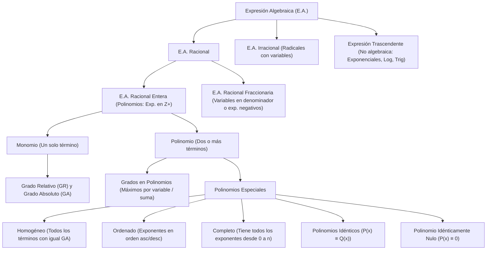

# ÁLGEBRA PREUNIVERSITARIA: CURSO COMPLETO Y SISTEMATIZADO
## EJE 02: MATEMÁTICA — ÁLGEBRA
### TEMA IV: EXPRESIONES ALGEBRAICAS, MONOMIOS Y POLINOMIOS ESPECIALES

---

## 1. FICHA TÉCNICA Y MATRIZ DE COMPETENCIAS

| Parámetro | Detalle Institucional |
| :--- | :--- |
| **Resolución Oficial** | Resolución de Consejo Universitario N° 0028-2026 (Admisión UNSA 2027) |
| **Eje Curricular** | Eje 02: Matemática / Álgebra Superior |
| **Peso Ponderado UNSA** | **Ingenierías:** 1.658337400 pts/preg (4 preg. = 6.63 pts) \| **Biomédicas:** 1.265447400 pts \| **Sociales:** 0.824574000 pts |
| **Frecuencia en Exámenes** | **Crítica / Alta (94%):** Aparece como pregunta directa de polinomios especiales o implícito en simplificaciones y ecuaciones. |
| **Modelos de Examen** | UNSA (Ordinario y CEPREUNSA), UNMSM (Preguntas DECO contextualizadas), UNI (Álgebra analítica rigurosa). |
| **Competencia Cardinal** | Clasificar expresiones matemáticas, operar términos semejantes, calcular grados relativos y absolutos en monomios y polinomios, y resolver sistemas paramétricos aplicando las propiedades de polinomios homogéneos, ordenados, completos e idénticos. |

---

## 2. MAPA TAXONÓMICO Y ONTOLOGÍA DE CONCEPTOS



---

## 3. DESARROLLO TEÓRICO FORMAL (ESTÁNDAR LUMBRERAS / CUZCANO / UNI)

### 3.1. Definición Formal de Expresión Algebraica (E.A.)
Una **Expresión Algebraica** es una combinación finita de constantes (números reales) y variables (letras que representan cantidades indeterminadas), vinculadas exclusivamente mediante un número finito de operaciones fundamentales de adición, sustracción, multiplicación, división, potenciación y radicación.

$$\text{E.A.} = P(x, y, z) = a_1 x^{m_1} y^{n_1} + a_2 x^{m_2} y^{n_2} + \dots + a_k x^{m_k} y^{n_k}$$

#### Clasificación Rigurosa:
1. **Expresión Algebraica Racional (E.A.R.):** Las variables no se encuentran afectadas por el operador de radicación ni actúan como exponentes.
   - **E.A. Racional Entera (E.A.R.E.):** Todos los exponentes de sus variables son números enteros no negativos ($\mathbb{Z}_0^+ = \{0, 1, 2, 3, \dots\}$). Corresponde al concepto formal de **Polinomio**.
     $$P(x, y) = 4x^3 y^2 - \sqrt{7} x y^5 + 9$$ (Nótese que $\sqrt{7}$ es coeficiente real, no variable bajo raíz).
   - **E.A. Racional Fraccionaria (E.A.R.F.):** Al menos una variable presenta exponente entero negativo, o se ubica en el denominador.
     $$Q(x, y) = \frac{5x^2 + 1}{y^3} - 4x^{-2} y$$
2. **Expresión Algebraica Irracional (E.A.I.):** Al menos una variable se encuentra bajo el signo radical o presenta exponente fraccionario irreductible.
   $$R(x, y) = 3\sqrt{x^3 y} + 5x^{2/3} y - 11$$
3. **Expresiones No Algebraicas o Trascendentes:** Aquellas que contienen infinitos términos, variables en los exponentes, o funciones trascendentes (trigonométricas, logarítmicas, hiperbólicas):
   - Exponenciales: $f(x) = 2^x + 5$
   - Logarítmicas: $g(x) = \ln(x^2 + 1)$
   - Trigonométricas: $h(x) = \text{sen}(x) + \cos(2x)$
   - Sumatorias infinitas: $S(x) = 1 + x + x^2 + x^3 + \dots$

---

### 3.2. Término Algebraico y Términos Semejantes
Un **término algebraico** es la mínima unidad de una expresión algebraica donde no intervienen la suma ni la resta entre variables.
Se compone de:
- **Parte Constante (Coeficiente):** Incluye el signo y los números reales que multiplican a las variables.
- **Parte Variable (Parte Literal):** Las variables con sus respectivos exponentes.

$$\underbrace{-12 \sqrt{5}}_{\text{Coeficiente}} \cdot \underbrace{x^4 y^7 z}_{\text{Parte Literal}}$$

#### Términos Semejantes:
Dos o más términos son **semejantes** si y solo si poseen **exactamente las mismas variables afectadas por los mismos exponentes**, sin importar sus coeficientes.
- $T_1(x, y) = (a + 3) x^5 y^{n-2}$ y $T_2(x, y) = (2b - 1) x^m y^8$ son semejantes si:
  $$m = 5 \quad \text{y} \quad n - 2 = 8 \implies n = 10$$
- **Reducción:** Solo los términos semejantes pueden sumarse o restarse algebraicamente sumando sus coeficientes.

---

### 3.3. Teoría de Grados en Monomios y Polinomios

El grado es una característica exclusiva de los polinomios (E.A. Racionales Enteras) relacionada con los exponentes de sus variables.

#### A. En Monomios:
Sea el monomio $M(x, y, z) = c \cdot x^a y^b z^k$, con $c \neq 0$:
1. **Grado Relativo (G.R.):** Es el exponente de la variable en mención.
   $$\text{GR}(x) = a, \quad \text{GR}(y) = b, \quad \text{GR}(z) = k$$
2. **Grado Absoluto (G.A.):** Es la suma de los exponentes de **todas** sus variables.
   $$\text{GA}(M) = a + b + k$$

#### B. En Polinomios de dos o más términos:
Sea $P(x, y) = T_1 + T_2 + \dots + T_k$:
1. **Grado Relativo (G.R.):** Es el **mayor exponente** que presenta dicha variable en todo el polinomio.
   $$\text{GR}(x) = \max\{\text{exp}(x) \text{ en cada término}\}$$
2. **Grado Absoluto (G.A.) o Grado del Polinomio:** Es el **mayor de los grados absolutos** de sus términos constitutivos.
   $$\text{GA}(P) = \max\{\text{GA}(T_1), \text{GA}(T_2), \dots, \text{GA}(T_k)\}$$

---

### 3.4. Polinomios Especiales (Propiedades Fundamentales)

#### 1. Polinomio Homogéneo
Es aquel polinomio en el cual todos sus términos presentan exactamente el mismo Grado Absoluto. Dicho valor común recibe el nombre de **Grado de Homogeneidad**.
$$P(x, y) = \underbrace{5x^7}_{\text{GA}=7} - \underbrace{3x^4 y^3}_{\text{GA}=4+3=7} + \underbrace{\sqrt{2} x y^6}_{\text{GA}=1+6=7} - \underbrace{8y^7}_{\text{GA}=7} \implies \text{Grado de homogeneidad} = 7$$

#### 2. Polinomio Ordenado
Un polinomio está ordenado respecto a una variable si los exponentes de dicha variable van aumentando (**orden ascendente**) o disminuyendo (**orden descendente**) de izquierda a derecha. No requiere poseer todos los exponentes intermedios.
$$P(x) = 2x^{11} - 5x^8 + 3x^4 - x + 9 \quad (\text{Ordenado descendentemente respecto a } x)$$

#### 3. Polinomio Completo
Un polinomio es completo respecto a una variable si contiene **todos** los exponentes de dicha variable, desde el mayor grado hasta el exponente cero (término independiente), sin omitir ninguno.
$$P(x) = 6x^4 - 2x^2 + 5x^3 - x + 7 \quad (\text{Completo de grado 4, aunque desordenado})$$

**Teoremas Cardinales de Polinomios Completos en una variable:**
1. **Número de Términos:** En todo polinomio completo de grado $n$:
   $$\text{N.° de términos} = \text{Grado} + 1 = n + 1$$
2. **Término Independiente ($T.I.$):** Es aquel término que no contiene la variable ($x^0$). Se calcula evaluando el polinomio en cero:
   $$\text{T.I.} = P(0)$$
3. **Suma de Coeficientes ($\sum \text{coef.}$):** Se obtiene evaluando la variable en 1:
   $$\sum \text{coef.} = P(1)$$
4. Si un polinomio es **completo y ordenado** en una variable:
   - La diferencia de los exponentes de dos términos consecutivos es $+1$ (ascendente) o $-1$ (descendente).

#### 4. Polinomios Idénticos ($P(x) \equiv Q(x)$)
Dos polinomios del mismo grado son idénticos si y solo si los coeficientes de sus términos semejantes respectivos son exactamente iguales:
$$a x^2 + b x + c \equiv d x^2 + e x + f \iff a = d, \quad b = e, \quad c = f$$
- **Criterio del Valor Numérico:** Dos polinomios son idénticos si toman el mismo valor numérico para cualquier asignación de valores reales a sus variables:
  $$P(x) \equiv Q(x) \iff P(k) = Q(k), \quad \forall k \in \mathbb{R}$$

#### 5. Polinomio Idénticamente Nulo ($P(x) \equiv 0$)
Es aquel polinomio cuyo valor numérico es siempre cero para cualquier valor real de sus variables. Esto ocurre si y solo si **todos sus coeficientes son iguales a cero**.
$$a x^3 + b x^2 + c x + d \equiv 0 \iff a = 0, \quad b = 0, \quad c = 0, \quad d = 0$$

---

## 4. FORMULARIO MAESTRO (LATEX ESTRICTO)

| Concepto / Teorema | Fórmula Matemática | Condición / Aplicación |
| :--- | :--- | :--- |
| **Grado Absoluto Monomio** | $\text{GA}(c x^a y^b z^k) = a + b + k$ | $c \neq 0$, variables $x, y, z$ |
| **Grado Relativo Monomio** | $\text{GR}_x(M) = a$ | Exponente de $x$ |
| **Grado de Polinomio** | $\text{GA}(P) = \max_i \{\text{GA}(T_i)\}$ | Mayor suma de exp. por término |
| **Suma de Coeficientes** | $\sum \text{coef.} = P(1, 1, \dots, 1)$ | Evaluación en $1$ |
| **Término Independiente** | $\text{T.I.} = P(0, 0, \dots, 0)$ | Evaluación en $0$ |
| **N.° Términos (Completo)** | $N_T = \text{Grado} + 1$ | Polinomio completo de una variable |
| **Polinomio Homogéneo** | $\text{GA}(T_1) = \text{GA}(T_2) = \dots = \text{GA}(T_k) = H$ | $H$: grado de homogeneidad |
| **Polinomios Idénticos** | $P(x) \equiv Q(x) \iff P(\alpha) = Q(\alpha), \ \forall \alpha \in \mathbb{R}$ | Coeficientes homólogos iguales |
| **Polinomio Nulo** | $\sum_{i=0}^n a_i x^i \equiv 0 \iff a_i = 0, \ \forall i$ | Todos los coeficientes se anulan |
| **Términos Semejantes** | $c_1 x^a y^b \sim c_2 x^m y^n \iff a = m \ \land \ b = n$ | Misma parte literal exacta |

---

## 5. MNEMOTECNIAS DE COMBATE PREUNIVERSITARIO

### 1. La Regla del "Cero y Uno" para Coeficientes e Independiente
> **"Con UNO sumas todo, con CERO te quedas solo."**
- **$P(1)$:** Da la **SUMA DE TODOS LOS COEFICIENTES** (el 1 no altera las multiplicaciones).
- **$P(0)$:** Anula todas las variables con exponentes positivos y deja **SOLO AL TÉRMINO INDEPENDIENTE**.

### 2. Clasificación de Expresiones: "R-E-F-I"
- **R-E (Racional Entera):** Exponentes **E**nteros positivos ($\mathbb{Z}^+$). ¡Polinomio!
- **R-F (Racional Fraccionaria):** Variable en la **F**osa (denominador) o exponente negativo.
- **I (Irracional):** Variable en el **I**glú (dentro de un radical o exp. fraccionario).

### 3. Polinomios Especiales: "H-O-C-I-N"
- **H**omogéneo $\to$ **H**ermano gemelo en grado (mismo GA en cada monomio).
- **O**rdenado $\to$ **O**rganizado (los exponentes van en fila india: suben o bajan).
- **C**ompleto $\to$ **C**ompletito (no falta ningún escalón desde el $x^n$ hasta el $x^0$).
- **I**dénticos $\to$ **I**guales coeficientes espejo.
- **N**ulo $\to$ **N**ada queda (todos los coeficientes valen cero).

---

## 6. TÉCNICAS Y ARTIFICIOS DE CÁLCULO (HACKING PREUNIVERSITARIO)

### Artificio 1: El Método de los Puntos Test para Polinomios Idénticos
Cuando un problema indique una identidad del tipo:
$$A(x - 2)(x + 3) + B(x + 1)(x + 3) + C(x - 2)(x + 1) \equiv 5x^2 - 3x + 14$$
**¡Jamás multipliques término a término para igualar coeficientes!** Eso toma 5 minutos y genera errores de signos.
**Hack:** Evalúa en las raíces que anulan los factores:
- Para $x = 2$: Se anulan los términos con $(x - 2)$. Queda:
  $$B(2 + 1)(2 + 3) = 5(2)^2 - 3(2) + 14 \implies 15B = 20 - 6 + 14 = 28 \implies B = \frac{28}{15}$$
- Para $x = -3$: Se anulan los términos con $(x + 3)$. Despejas $C$ en 5 segundos.
- Para $x = -1$: Se anulan los términos con $(x + 1)$. Despejas $A$ en 5 segundos.

### Artificio 2: Reconstrucción Exponencial en Polinomios Completos y Ordenados
Si un polinomio de grado $n$ es **completo y ordenado descendentemente**:
- El exponente del primer término es $n$.
- El exponente del último término es $0$ (término independiente).
- Cada término consecutivo decrece en exactamente $1$: $\text{exp}(k) - \text{exp}(k+1) = 1$.
Esto permite armar un sistema lineal de ecuaciones directas e inmediatas.

---

## 7. ZONA DE TRAMPAS Y DISTRACTORES ("¡PELIGRO EXAMEN!")

> [!WARNING]
> **Trampa 1: Confundir Coeficiente con Variable en Expresiones Racionales**
> En la expresión:
> $$P(x) = \sqrt{3} x^4 - \frac{2}{5} x^2 + \pi x - 7$$
> Muchos postulantes marcan "Expresión Irracional" porque ven $\sqrt{3}$, o "Fraccionaria" porque ven $\frac{2}{5}$. 
> **La regla es clara:** La clasificación depende **única y exclusivamente de las variables**, no de los coeficientes numéricos. Como las variables tienen exponentes $\{4, 2, 1, 0\} \subset \mathbb{Z}_0^+$, es una **E.A. Racional Entera (Polinomio)**.

> [!WARNING]
> **Trampa 2: El Término Independiente en Polinomios Compuestos**
> Si te piden el término independiente de $P(x + 3) = x^2 - 5x + 6$, el postulante novato evalúa $x = 0$ y responde $6$. **¡FATAL ERROR!**
> Para hallar el término independiente del polinomio $P$, se debe lograr que el argumento sea $0$:
> $$x + 3 = 0 \implies x = -3$$
> Luego: $P(0) = (-3)^2 - 5(-3) + 6 = 9 + 15 + 6 = 30$.

> [!CAUTION]
> **Trampa 3: Polinomios Homogéneos con Variables Escondidas**
> Si el polinomio es $P(x, y) = a x^{m+2} y^3 - b x^5 y^n + c z^8 x y^4$:
> ¡Cuidado! Mira la notación funcional $P(x, y)$. La letra $z$ **no es variable**, ¡es una constante o coeficiente! Por ende, el grado de ese término es solo la suma de los exponentes de $x$ e $y$ ($1 + 4 = 5$), no $8 + 1 + 4$.

---

## 8. APLICACIÓN AL MUNDO REAL Y CONTEXTO DECO

### Optimización y Modelado de Señales Acústicas en Arquitectura Arequipeña
En la restauración bioclimática de las bóvedas de sillar de los claustros de la UNSA, la atenuación de presión sonora $P(r, \theta)$ frente a ondas estacionarias se modela mediante polinomios armónicos multivariables donde cada término representa un modo normal de vibración. Para asegurar que la acústica no distorsione frecuencias de la voz humana, el modelo matemático exige que el polinomio de dispersión sea **homogéneo** (para que todas las frecuencias espaciales decaigan a la misma tasa proporcional) y **completo** (para no omitir armónicos pares o impares que generen resonancias indeseadas en el recinto).

---

## 9. BANCO DE 5 EJERCICIOS RESUELTOS GRADUADOS

### Ejercicio 1: Nivel Básico (Reconocimiento y Reducción de Términos Semejantes)
**Enunciado:**
Si los siguientes términos son semejantes:
$$T_1(x, y) = (2a + b) x^{3a - 5} y^{2b + 1}$$
$$T_2(x, y) = (a - 3b) x^{a + 7} y^{5b - 8}$$
Determine el coeficiente del término resultante al sumar $T_1 + T_2$.

**Solución paso a paso:**
1. Por definición de términos semejantes, los exponentes de las mismas variables deben ser rigurosamente iguales:
   - Para la variable $x$:
     $$3a - 5 = a + 7 \implies 2a = 12 \implies a = 6$$
   - Para la variable $y$:
     $$2b + 1 = 5b - 8 \implies 1 + 8 = 5b - 2b \implies 9 = 3b \implies b = 3$$
2. Calculamos los coeficientes de cada término:
   - Coeficiente de $T_1$:
     $$c_1 = 2a + b = 2(6) + 3 = 12 + 3 = 15$$
   - Coeficiente de $T_2$:
     $$c_2 = a - 3b = 6 - 3(3) = 6 - 9 = -3$$
3. Al sumar $T_1 + T_2$, se suman algebraicamente sus coeficientes:
   $$c_{\text{total}} = c_1 + c_2 = 15 + (-3) = 12$$

**Respuesta Final:** El coeficiente resultante es **$12$**.

---

### Ejercicio 2: Nivel Intermedio (Grados en Monomios y Polinomios)
**Enunciado:**
En el polinomio:
$$P(x, y) = 3 x^{m+1} y^{n-2} + 5 x^{m+2} y^{n-1} - 7 x^{m-1} y^{n+2}$$
Se sabe que el Grado Relativo respecto a $x$ es $10$ ($\text{GR}_x = 10$) y el Grado Absoluto del polinomio es $15$ ($\text{GA} = 15$). Halle el valor de $\text{GR}_y$.

**Solución paso a paso:**
1. Identificamos los exponentes de $x$ en cada término:
   $$\{m+1, \ m+2, \ m-1\}$$
   El mayor exponente es $m + 2$. Por dato:
   $$\text{GR}_x = m + 2 = 10 \implies m = 8$$
2. Calculamos el Grado Absoluto de cada término sumando los exponentes de $x$ e $y$:
   - Término 1: $\text{GA}_1 = (m + 1) + (n - 2) = m + n - 1$
   - Término 2: $\text{GA}_2 = (m + 2) + (n - 1) = m + n + 1$
   - Término 3: $\text{GA}_3 = (m - 1) + (n + 2) = m + n + 1$
3. El Grado Absoluto del polinomio es el mayor de ellos:
   $$\text{GA}(P) = m + n + 1 = 15$$
   Sustituyendo $m = 8$:
   $$8 + n + 1 = 15 \implies n + 9 = 15 \implies n = 6$$
4. Determinamos el Grado Relativo respecto a $y$:
   Los exponentes de $y$ son $\{n-2, \ n-1, \ n+2\}$.
   El mayor exponente es $n + 2$:
   $$\text{GR}_y = n + 2 = 6 + 2 = 8$$

**Respuesta Final:** $\text{GR}_y = \mathbf{8}$.

---

### Ejercicio 3: Nivel Avanzado - UNSA Ordinario (Polinomio Completo y Ordenado)
**Enunciado:**
Si el polinomio:
$$P(x) = x^{a+b-2} + 3x^{a-c+1} + 5x^{b-c+4} - 2x^d + \dots$$
es completo y ordenado descendentemente, posee $2a$ términos y su término independiente es $x^{2c - 6}$. Determine el valor de $(a + b + c + d)$ sabiendo que los cuatro términos mostrados son los primeros cuatro términos consecutivos del polinomio.

**Solución paso a paso:**
1. Como el polinomio está ordenado en forma descendente y es completo, los exponentes de términos consecutivos disminuyen de 1 en 1:
   $$\text{exp}_1 - \text{exp}_2 = 1 \implies (a + b - 2) - (a - c + 1) = 1$$
   $$b + c - 3 = 1 \implies b + c = 4 \quad \text{--- (Ec. 1)}$$
   $$\text{exp}_2 - \text{exp}_3 = 1 \implies (a - c + 1) - (b - c + 4) = 1$$
   $$a - b - 3 = 1 \implies a - b = 4 \quad \text{--- (Ec. 2)}$$
   $$\text{exp}_3 - \text{exp}_4 = 1 \implies (b - c + 4) - d = 1 \implies d = b - c + 3 \quad \text{--- (Ec. 3)}$$
2. Por teoría de polinomios completos y ordenados descendentemente:
   - El último término tiene exponente $0$ (término independiente):
     $$\text{exp}_{\text{último}} = 2c - 6 = 0 \implies 2c = 6 \implies c = 3$$
3. Reemplazamos $c = 3$ en las ecuaciones anteriores:
   - En (Ec. 1): $b + 3 = 4 \implies b = 1$
   - En (Ec. 2): $a - 1 = 4 \implies a = 5$
   - En (Ec. 3): $d = 1 - 3 + 3 = 1$
4. Verificamos el número de términos:
   - Grado del polinomio: $\text{exp}_1 = a + b - 2 = 5 + 1 - 2 = 4$.
   - Como tiene grado 4 y es completo, el número de términos es $4 + 1 = 5$.
5. Calculamos la suma pedida:
   $$a + b + c + d = 5 + 1 + 3 + 1 = 10$$

**Respuesta Final:** $\mathbf{10}$.

---

### Ejercicio 4: Nivel San Marcos DECO (Polinomio Homogéneo y Costos de Producción)
**Enunciado:**
Una empresa de tecnología de Arequipa modela la función de ingresos conjuntos por la venta de dos procesadores cuánticos $x$ e $y$ mediante un polinomio homogéneo:
$$I(x, y) = 12 x^{2m - 1} y^n + 4 x^{m + 3} y^{2n - 7} - 9 x^{p} y^{11}$$
Si el grado de homogeneidad del polinomio coincide con el costo marginal constante de $\$23$, determine la cantidad $m + n + p$.

**Solución paso a paso:**
1. Dado que $I(x, y)$ es homogéneo con grado de homogeneidad $23$, la suma de los exponentes en cada monomio debe ser idénticamente igual a $23$:
   - Término 3:
     $$\text{GA}_3 = p + 11 = 23 \implies p = 23 - 11 = 12$$
   - Término 1:
     $$\text{GA}_1 = (2m - 1) + n = 23 \implies 2m + n = 24 \quad \text{--- (Ec. 1)}$$
   - Término 2:
     $$\text{GA}_2 = (m + 3) + (2n - 7) = 23 \implies m + 2n - 4 = 23 \implies m + 2n = 27 \quad \text{--- (Ec. 2)}$$
2. Resolvemos el sistema de ecuaciones lineales para $m$ y $n$:
   - De (Ec. 1): $n = 24 - 2m$.
   - Sustituimos en (Ec. 2):
     $$m + 2(24 - 2m) = 27$$
     $$m + 48 - 4m = 27 \implies 48 - 3m = 27 \implies 3m = 21 \implies m = 7$$
   - Hallamos $n$:
     $$n = 24 - 2(7) = 24 - 14 = 10$$
3. Verificamos exponentes enteros positivos:
   - Término 1: $x^{2(7)-1} y^{10} = x^{13} y^{10} \implies 13 + 10 = 23$.
   - Término 2: $x^{7+3} y^{2(10)-7} = x^{10} y^{13} \implies 10 + 13 = 23$.
   - Término 3: $x^{12} y^{11} \implies 12 + 11 = 23$.
   Todos son enteros positivos perfectos.
4. Calculamos la suma requerida:
   $$m + n + p = 7 + 10 + 12 = 29$$

**Respuesta Final:** La suma es $\mathbf{29}$.

---

### Ejercicio 5: Nivel Boss Challenge - Estilo UNI (Polinomio Idénticamente Nulo)
**Enunciado:**
Si el polinomio:
$$P(x) = (a + b - 5) x^3 + (b + c - 7) x^2 + (c + a - 8) x + (a b c - k)$$
es idénticamente nulo ($P(x) \equiv 0$), determine el valor del parámetro real $k$.

**Solución paso a paso:**
1. Por definición de polinomio idénticamente nulo ($P(x) \equiv 0$), **todos y cada uno de sus coeficientes deben ser iguales a cero simultáneamente**:
   - Coeficiente de $x^3$:
     $$a + b - 5 = 0 \implies a + b = 5 \quad \text{--- (1)}$$
   - Coeficiente de $x^2$:
     $$b + c - 7 = 0 \implies b + c = 7 \quad \text{--- (2)}$$
   - Coeficiente de $x$:
     $$c + a - 8 = 0 \implies c + a = 8 \quad \text{--- (3)}$$
   - Término independiente:
     $$a b c - k = 0 \implies k = a b c \quad \text{--- (4)}$$
2. Sumamos miembro a miembro las ecuaciones (1), (2) y (3):
   $$(a + b) + (b + c) + (c + a) = 5 + 7 + 8$$
   $$2(a + b + c) = 20 \implies a + b + c = 10$$
3. Calculamos individualmente cada variable restando cada ecuación:
   - Restando (2) de la suma:
     $$a + (b + c) = 10 \implies a + 7 = 10 \implies a = 3$$
   - Restando (3) de la suma:
     $$b + (c + a) = 10 \implies b + 8 = 10 \implies b = 2$$
   - Restando (1) de la suma:
     $$c + (a + b) = 10 \implies c + 5 = 10 \implies c = 5$$
4. Verificamos:
   $$a + b = 3 + 2 = 5 \quad \checkmark$$
   $$b + c = 2 + 5 = 7 \quad \checkmark$$
   $$c + a = 5 + 3 = 8 \quad \checkmark$$
5. Calculamos el valor de $k$ usando la relación (4):
   $$k = a \cdot b \cdot c = (3)(2)(5) = 30$$

**Respuesta Final:** El valor del parámetro es $\mathbf{k = 30}$.

---

## 10. GLOSARIO DE 10 TÉRMINOS CLAVE

1. **Expresión Algebraica:** Expresión matemática finita donde constantes y variables se vinculan solo con operaciones algebraicas básicas.
2. **Polinomio:** Expresión algebraica racional entera cuyos exponentes en las variables pertenecen al conjunto $\mathbb{Z}_0^+$.
3. **Monomio:** Expresión algebraica de un solo término con exponentes enteros no negativos.
4. **Grado Relativo (GR):** Mayor exponente de una variable específica en una expresión algebraica o polinomio.
5. **Grado Absoluto (GA):** Suma máxima de exponentes de las variables en los términos de un polinomio.
6. **Términos Semejantes:** Términos que poseen idéntica parte literal (mismas variables con mismos exponentes).
7. **Polinomio Homogéneo:** Polinomio donde todos los términos tienen exactamente el mismo grado absoluto.
8. **Polinomio Completo:** Polinomio que posee todos los exponentes desde el grado principal hasta el término independiente ($x^0$).
9. **Polinomios Idénticos:** Polinomios que toman valores numéricos iguales para cualquier valor real asignado a sus variables.
10. **Polinomio Idénticamente Nulo:** Polinomio cuyos coeficientes son todos cero, anulándose para todo $\mathbb{R}$.

---

## 11. BANCO DE FLASHCARDS (ANVERSO / REVERSO)

- **Flashcard 1:**
  - *Anverso:* ¿Cómo se halla la suma de coeficientes de cualquier polinomio multivariable $P(x, y, z)$?
  - *Reverso:* Evaluando todas las variables en $1$: $\sum \text{coef.} = P(1, 1, 1)$.
- **Flashcard 2:**
  - *Anverso:* ¿Cómo se obtiene el término independiente de un polinomio $P(x)$?
  - *Reverso:* Evaluando la variable en $0$: $\text{T.I.} = P(0)$.
- **Flashcard 3:**
  - *Anverso:* ¿Cuántos términos tiene un polinomio completo de una sola variable de grado $n$?
  - *Reverso:* Posee exactamente $n + 1$ términos.
- **Flashcard 4:**
  - *Anverso:* ¿Qué condición define a dos términos como semejantes?
  - *Reverso:* Deben tener exactamente las mismas variables elevadas a los mismos exponentes respectivos.
- **Flashcard 5:**
  - *Anverso:* ¿Qué caracteriza a un polinomio idénticamente nulo $P(x) \equiv 0$?
  - *Reverso:* Todos sus coeficientes son iguales a cero ($a_i = 0, \ \forall i$).

---

## 12. MOTOR DE GAMIFICACIÓN (JSON PARA KOTLIN MULTIPLATFORM)

```json
{
  "topicId": "alg_04_expresiones_monomios",
  "title": "Expresiones Algebraicas, Monomios y Polinomios Especiales",
  "subject": "algebra",
  "xpReward": 380,
  "level": "INTERMEDIATE",
  "badges": [
    {
      "id": "master_polinomios_especiales",
      "name": "Arquitecto de Polinomios",
      "description": "Dominaste la homogeneidad, orden y completitud algebraica sin fallar trampas."
    }
  ],
  "questions": [
    {
      "id": "q1",
      "statement": "¿Cuál es la suma de coeficientes del polinomio P(x) = (2x - 1)^5 + (x + 1)^3 - 4?",
      "options": ["1", "3", "5", "7"],
      "correctIndex": 2,
      "explanation": "Evaluamos en x = 1: P(1) = (2(1) - 1)^5 + (1 + 1)^3 - 4 = 1^5 + 2^3 - 4 = 1 + 8 - 4 = 5."
    },
    {
      "id": "q2",
      "statement": "Si un polinomio completo y ordenado tiene 15 términos, ¿cuál es su grado absoluto?",
      "options": ["14", "15", "16", "30"],
      "correctIndex": 0,
      "explanation": "En un polinomio completo de una variable: N.° de términos = Grado + 1 => 15 = Grado + 1 => Grado = 14."
    }
  ]
}
```
