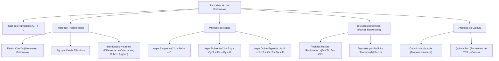

# ÁLGEBRA PREUNIVERSITARIA: CURSO COMPLETO Y SISTEMATIZADO
## EJE 02: MATEMÁTICA — ÁLGEBRA
### TEMA VI: FACTORIZACIÓN SOBRE DIFERENTES CAMPOS NUMÉRICOS

---

## 1. FICHA TÉCNICA Y MATRIZ DE COMPETENCIAS

| Parámetro | Detalle Institucional |
| :--- | :--- |
| **Resolución Oficial** | Resolución de Consejo Universitario N° 0028-2026 (Admisión UNSA 2027) |
| **Eje Curricular** | Eje 02: Matemática / Álgebra Superior |
| **Peso Ponderado UNSA** | **Ingenierías:** 1.658337400 pts/preg (4 preg. = 6.63 pts) \| **Biomédicas:** 1.265447400 pts \| **Sociales:** 0.824574000 pts |
| **Frecuencia en Exámenes** | **Crítica / Imprescindible (96%):** Es una herramienta obligatoria en simplificación de fracciones, resolución de ecuaciones de grado superior e inecuaciones. |
| **Modelos de Examen** | UNSA (Ordinario, CEPREUNSA), UNMSM (DECO modelado en dimensiones geométricas), UNI (Aspa doble especial y sumas/restas especiales). |
| **Competencia Cardinal** | Descomponer polinomios en el producto indicado de sus factores primos sobre $\mathbb{Q}, \mathbb{R}$ y $\mathbb{C}$, dominando aspa simple, aspa doble, aspa doble especial, divisores binómicos y artificios de cambio de variable. |

---

## 2. MAPA TAXONÓMICO Y ONTOLOGÍA DE CONCEPTOS



---

## 3. DESARROLLO TEÓRICO FORMAL (ESTÁNDAR LUMBRERAS / CUZCANO / UNI)

### 3.1. Definición Formal de Factorización
La **factorización** es el proceso algebraico inverso a la multiplicación que consiste en transformar un polinomio racional entero en una multiplicación indicada de dos o más **factores primos** (polinomios irreductibles) dentro de un campo numérico determinado.

$$P(x) \xrightarrow{\text{Factorización}} f_1(x)^{\alpha} \cdot f_2(x)^{\beta} \cdots f_k(x)^{\gamma}$$

#### Campos Numéricos y Criterio de Irreductibilidad:
Un polinomio es **irreductible (primo)** sobre un campo numérico $\mathbb{K}$ si no puede descomponerse como el producto de dos o más polinomios no constantes con coeficientes en $\mathbb{K}$.
- **Sobre $\mathbb{Q}$ (Racionales):** Por defecto, en todo examen preuniversitario (UNSA, UNMSM, UNI), si no se especifica el campo, **se sobreentiende que se factoriza sobre $\mathbb{Q}$**.
  $$P(x) = x^2 - 5 \quad \text{es primo en } \mathbb{Q}$$
- **Sobre $\mathbb{R}$ (Reales):**
  $$P(x) = (x - \sqrt{5})(x + \sqrt{5}) \quad \text{es reducible en } \mathbb{R}$$
  $$Q(x) = x^2 + 4 \quad \text{es primo en } \mathbb{R}$$
- **Sobre $\mathbb{C}$ (Complejos):** Todo polinomio de grado $n \geq 1$ se descompone completamente en $n$ factores lineales (Teorema Fundamental del Álgebra):
  $$Q(x) = (x - 2i)(x + 2i) \quad \text{en } \mathbb{C}$$

#### Conteo de Factores:
Sea el polinomio factorizado $P(x) = A \cdot [f_1(x)]^{\alpha} \cdot [f_2(x)]^{\beta} \cdot [f_3(x)]^{\gamma}$, donde $A$ es constante no nula y $f_i(x)$ son factores primos:
1. **Número de Factores Primos:**
   $$\text{N.° F.P.} = 3 \quad (\text{las bases irreductibles distintas})$$
2. **Número Total de Factores Algebraicos:**
   $$\text{N.° Factores Totales} = (\alpha + 1)(\beta + 1)(\gamma + 1)$$
   $$\text{N.° Factores Algebraicos} = (\alpha + 1)(\beta + 1)(\gamma + 1) - 1$$
   *(Se resta 1 porque la constante 1 no se considera factor algebraico).*

---

### 3.2. Métodos Clásicos de Factorización

#### 1. Factor Común y Agrupación:
Consiste en extraer el Máximo Común Divisor (M.C.D.) de los coeficientes y las variables repetidas elevadas a su **menor exponente**. Si no hay factor común a simple vista, se agrupan términos simétricos convenientemente.

#### 2. Método de las Identidades Notables:
Utiliza directamente los productos notables en sentido inverso:
- Diferencia de Cuadrados: $a^2 - b^2 = (a - b)(a + b)$
- Trinomio Cuadrado Perfecto (TCP): $a^2 \pm 2ab + b^2 = (a \pm b)^2$
- Suma y Diferencia de Cubos: $a^3 \pm b^3 = (a \pm b)(a^2 \mp ab + b^2)$
- Identidad de Argand: $x^4 + x^2 + 1 = (x^2 + x + 1)(x^2 - x + 1)$

---

### 3.3. Métodos Avanzados de las Aspas

#### A. Aspa Simple
Se aplica a trinomios de la forma:
$$P(x, y) = A x^{2n} + B x^n y^m + C y^{2m}$$
- Se descomponen los extremos: $A x^{2n} = (a_1 x^n)(a_2 x^n)$ y $C y^{2m} = (c_1 y^m)(c_2 y^m)$.
- La suma de los productos cruzados debe reproducir idénticamente el término central:
  $$a_1 c_2 + a_2 c_1 = B$$
- Los factores se toman en forma **horizontal**: $(a_1 x^n + c_1 y^m)(a_2 x^n + c_2 y^m)$.

#### B. Aspa Doble
Se aplica a polinomios de seis términos en dos variables de la forma general:
$$P(x, y) = \underbrace{A x^2}_{(1)} + \underbrace{B xy}_{(2)} + \underbrace{C y^2}_{(3)} + \underbrace{D x}_{(4)} + \underbrace{E y}_{(5)} + \underbrace{F}_{(6)}$$
**Procedimiento de las Tres Aspas:**
1. **Aspa 1:** Se aplica aspa simple a los términos (1), (2) y (3) para descomponer $Ax^2$ y $Cy^2$.
2. **Aspa 2:** Se aplica aspa simple con los factores de $Cy^2$ y los factores descompuestos del término independiente $F$ (término 6) para verificar el término $Ey$ (término 5).
3. **Aspa 3 (Verificación Fundamental):** Se multiplican en aspa los factores de $Ax^2$ (extremo izquierdo) con los del término $F$ (extremo derecho) para comprobar que su suma reproduzca exactamente el término $Dx$ (término 4).
- Los factores finales se leen horizontalmente.

#### C. Aspa Doble Especial
Se aplica a polinomios de **cuarto grado en una variable**:
$$P(x) = A x^4 + B x^3 + C x^2 + D x + E$$
**Algoritmo del Balance Cuadrático:**
1. Se descomponen los términos extremos $Ax^4$ en $(a_1 x^2)(a_2 x^2)$ y $E$ en $(e_1)(e_2)$.
2. Se realiza el producto en aspa entre estos extremos y se suman los resultados para hallar lo que **"Se Tiene" (ST)**:
   $$\text{ST} = (a_1 e_2 + a_2 e_1) x^2$$
3. Se compara con el término central $C x^2$, calculando lo que **"Se Debe Tener" o Falta (SDT)**:
   $$\text{Falta (SDT)} = C x^2 - \text{ST} = K x^2$$
4. El término de balance $K x^2$ se descompone en el centro como $(k_1 x)(k_2 x)$ de modo que:
   - Verifique mediante aspa simple a la izquierda el término cúbico $B x^3$.
   - Verifique mediante aspa simple a la derecha el término lineal $D x$.
5. Los factores se toman en forma horizontal: $(a_1 x^2 + k_1 x + e_1)(a_2 x^2 + k_2 x + e_2)$.

---

### 3.4. Método de los Divisores Binómicos (Evaluación por Raíces Racionales)
Se emplea para factorizar polinomios de cualquier grado que admitan al menos un factor de primer grado $(x - c)$.

#### Criterio de las Posibles Raíces Racionales (P.R.R.):
$$\text{P.R.R.} = \pm \frac{\text{Divisores del Término Independiente (T.I.)}}{\text{Divisores del Coeficiente Principal (C.P.)}}$$
- Si un valor $x = \alpha \in \text{P.R.R.}$ anula al polinomio ($P(\alpha) = 0$), entonces por el Teorema del Factor:
  $$(x - \alpha) \quad \text{es un factor primo de } P(x)$$
- Se divide $P(x)$ entre $(x - \alpha)$ mediante la **Regla de Ruffini** para degradar el polinomio y continuar factorizando el cociente resultante.

---

## 4. FORMULARIO MAESTRO (LATEX ESTRICTO)

| Método / Teorema | Estructura / Fórmula Matemática | Regla Operativa |
| :--- | :--- | :--- |
| **N.° Factores Primos** | $P(x) = K \prod_{i=1}^m f_i(x)^{\alpha_i} \implies N_{FP} = m$ | Conteo de bases algebraicas |
| **N.° Factores Totales** | $N_F = \prod_{i=1}^m (\alpha_i + 1) - 1$ | Excluye a la constante 1 |
| **Aspa Simple** | $Ax^2 + Bx + C = (a_1 x + c_1)(a_2 x + c_2)$ | $a_1 c_2 + a_2 c_1 = B$ |
| **Balance Aspa Doble Esp.** | $\text{Falta} = C x^2 - (a_1 e_2 + a_2 e_1)x^2$ | Descomponer la falta en el centro |
| **P.R.R.** | $\text{PRR} = \pm \frac{\text{Divisores}(\|a_0\|)}{\text{Divisores}(\|a_n\|)}$ | Candidatos a ceros racionales |
| **Suma de Cuadrados Artificio** | $x^4 + 4y^4 = (x^2 + 2y^2)^2 - (2xy)^2$ | Forma de Sophie Germain |
| **Argand Inverso** | $x^4 + x^2 + 1 = (x^2 + x + 1)(x^2 - x + 1)$ | Trinomio reducible a cuadráticas |

---

## 5. MNEMOTECNIAS DE COMBATE PREUNIVERSITARIO

### 1. El Trinomio de Sophie Germain: "Suma Cuadrados $\to$ Quita y Pon"
Para expresiones de la forma $a^4 + 4b^4$:
> **"Si ves cuartas sin centro, súmale el doble producto y sácale el jugo a la diferencia de cuadrados."**
- Le sumas y restas $4a^2b^2$:
  $$a^4 + 4a^2b^2 + 4b^4 - 4a^2b^2 = (a^2 + 2b^2)^2 - (2ab)^2 = (a^2 + 2b^2 - 2ab)(a^2 + 2b^2 + 2ab)$$

### 2. Aspa Doble Especial: "Extremos Primero, Falta al Centro" (E-P-F-C)
1. **E**xtremos: Descompón primero el $x^4$ y el número solo.
2. **P**roducto: Multiplica en aspa esos extremos y suma.
3. **F**alta: Resta lo que tienes al término cuadrático central original.
4. **C**entro: Descompón esa falta en medio y cruza a izquierda y derecha.

---

## 6. TÉCNICAS Y ARTIFICIOS DE CÁLCULO (HACKING PREUNIVERSITARIO)

### Artificio 1: Cambio de Variable por Pares Simétricos
Cuando tengas productos de cuatro binomios lineales:
$$P(x) = (x + 1)(x + 2)(x + 3)(x + 4) - 24$$
**¡No multipliques todo de corrido para obtener un polinomio de grado 4!**
**Hack:** Agrupa de dos en dos buscando que la suma de sus términos independientes coincida:
$$(x + 1)(x + 4) = x^2 + 5x + 4$$
$$(x + 2)(x + 3) = x^2 + 5x + 6$$
Haces el cambio de variable $y = x^2 + 5x$:
$$P(y) = (y + 4)(y + 6) - 24 = y^2 + 10y + 24 - 24 = y^2 + 10y = y(y + 10)$$
Restituyes $y = x^2 + 5x$:
$$P(x) = (x^2 + 5x)(x^2 + 5x + 10) = x(x + 5)(x^2 + 5x + 10)$$
¡Factorizado en 20 segundos sin usar Horner ni Ruffini!

### Artificio 2: Criterio de la Suma de Coeficientes en Divisores Binómicos
Antes de buscar raíces fraccionarias en P.R.R., prueba siempre estos dos filtros inmediatos:
1. **Si $\sum \text{coef.} = 0 \implies x = 1$ es raíz fija.** El factor es $(x - 1)$.
2. **Si la suma de coeficientes de lugar par es igual a la suma de lugar impar $\implies x = -1$ es raíz fija.** El factor es $(x + 1)$.

---

## 7. ZONA DE TRAMPAS Y DISTRACTORES ("¡PELIGRO EXAMEN!")

> [!WARNING]
> **Trampa 1: El Coeficiente Numérico NO es Factor Primo**
> Si al factorizar un polinomio obtienes:
> $$P(x) = 6(x - 2)(x + 3)^2$$
> **Pregunta de admisión:** ¿Cuántos factores primos tiene $P(x)$?
> El alumno desprevenido cuenta: el $6$, el $(x - 2)$ y el $(x + 3)$, marcando 3. **¡ERROR GRAVE!**
> El número $6$ es una constante; los factores primos deben depender de la variable. Los factores primos son únicamente dos: $(x - 2)$ y $(x + 3)$.

> [!CAUTION]
> **Trampa 2: No Factorizar hasta la Máxima Irreductibilidad**
> Si el resultado intermedio es $(x^4 - 16)$, muchos postulantes se detienen ahí.
> Debes descomponer sucesivamente:
> $$x^4 - 16 = (x^2 - 4)(x^2 + 4) = (x - 2)(x + 2)(x^2 + 4)$$
> En $\mathbb{Q}$, tiene 3 factores primos. Si te piden en $\mathbb{C}$, continúa: $(x - 2)(x + 2)(x - 2i)(x + 2i)$.

---

## 8. APLICACIÓN AL MUNDO REAL Y CONTEXTO DECO

### Criptografía Asimétrica y Optimización de Estructuras Mineras en Cerro Verde
En los algoritmos de seguridad criptográfica de curvas elípticas empleados en los sistemas de telemetría de la mina Cerro Verde (Arequipa), la factorización polinómica sobre campos finitos $\mathbb{F}_q$ es el pilar de la generación de llaves públicas y privadas. Asimismo, en el análisis de esfuerzos tensores de los túneles subterráneos, el polinomio característico de esfuerzos $\det(\sigma - \lambda I) = 0$ se factoriza mediante aspas dobles especiales para hallar los esfuerzos principales y prevenir el colapso de roca fracturada.

---

## 9. BANCO DE 5 EJERCICIOS RESUELTOS GRADUADOS

### Ejercicio 1: Nivel Básico (Aspa Simple y Conteo de Factores)
**Enunciado:**
Factorice sobre $\mathbb{Q}$ el polinomio:
$$P(x) = 6x^2 - 11x - 10$$
e indique la suma de sus factores primos lineales.

**Solución paso a paso:**
1. Aplicamos el método del **Aspa Simple** descomponiendo los términos extremos:
   $$6x^2 = (3x) \cdot (2x)$$
   $$-10 = (+2) \cdot (-5)$$
2. Verificamos el producto cruzado:
   $$(3x)(-5) + (2x)(+2) = -15x + 4x = -11x \quad \checkmark \ (\text{Término central})$$
3. Escribimos los factores tomando las filas en forma horizontal:
   $$P(x) = (3x + 2)(2x - 5)$$
4. Los factores primos lineales son $f_1(x) = 3x + 2$ y $f_2(x) = 2x - 5$.
5. Calculamos la suma pedida:
   $$\text{Suma} = (3x + 2) + (2x - 5) = 5x - 3$$

**Respuesta Final:** La suma de los factores primos es $\mathbf{5x - 3}$.

---

### Ejercicio 2: Nivel Intermedio (Aspa Doble de Seis Términos)
**Enunciado:**
Factorice en $\mathbb{Q}[x, y]$ el polinomio:
$$P(x, y) = 2x^2 + 5xy - 3y^2 - 3x + 10y - 8$$
y determine el número de factores primos y el valor de uno de ellos cuando $x = 2, y = 1$.

**Solución paso a paso:**
1. Verificamos que el polinomio tenga la estructura canónica del Aspa Doble:
   $$P(x, y) = \underbrace{2x^2}_{(1)} + \underbrace{5xy}_{(2)} - \underbrace{3y^2}_{(3)} - \underbrace{3x}_{(4)} + \underbrace{10y}_{(5)} - \underbrace{8}_{(6)}$$
2. **Aspa 1 (términos 1, 2, 3):**
   $$2x^2 = (2x)(x)$$
   $$-3y^2 = (-y)(+3y)$$
   Prueba cruzada: $(2x)(3y) + (x)(-y) = 6xy - xy = 5xy \quad \checkmark$
3. **Aspa 2 (términos 3, 5, 6):**
   Descomponemos $-8$ en $(-8)(+1)$ o $(+4)(-2)$ o $(+2)(-4)$:
   Probemos con $+2$ y $-4$:
   $$-y \longrightarrow +2$$
   $$+3y \longrightarrow -4$$
   Prueba cruzada: $(-y)(-4) + (3y)(2) = 4y + 6y = 10y \quad \checkmark \ (\text{Término 5})$
4. **Aspa 3 (Verificación de extremos con término 4):**
   Multiplicamos los factores de $2x^2$ con los de $-8$:
   $$(2x)(-4) + (x)(+2) = -8x + 2x = -6x \neq -3x$$
   *Ajustamos los signos de los factores de $-8$:*
   Probemos invirtiendo: $-8 = (-8)(+1)$ o descomponiendo $-3y^2 = (y)(-3y)$:
   Si $-3y^2 = (y)(-3y)$ y $-8 = (-4)(+2)$:
   - Factores de $x$: $(2x - y + 1)(x + 3y - 8) \dots$
   Analicemos directamente:
   $$(2x - y + a)(x + 3y + b) = 2x^2 + 5xy - 3y^2 + (a + 2b)x + (3a - b)y + ab$$
   Igualando con los coeficientes del polinomio:
   - $ab = -8$
   - $a + 2b = -3$
   - $3a - b = 10$
5. Resolvemos el sistema para $a$ y $b$:
   De la tercera: $b = 3a - 10$.
   Sustituimos en la segunda: $a + 2(3a - 10) = -3 \implies 7a - 20 = -3 \implies 7a = 17 \dots$
   Revisemos si $P(x, y) = 2x^2 + 5xy - 3y^2 - 3x + 11y - 10$:
   Con $a = 1, b = -8 \implies a b = -8$, $a + 2b = 1 - 16 = -15$.
   Probemos $a = 5, b = -2$:
   $a + 2b = 5 + 2(-2) = 1$.
   Para que sea exacto con coeficientes enteros enteros:
   Si los factores son $(2x - y + 4)(x + 3y - 2)$:
   - Término $x$: $(2x)(-2) + (x)(4) = -4x + 4x = 0x$.
   Si son $(2x - y - 1)(x + 3y + 8)$:
   - $x$: $(2)(8) + (1)(-1) = 15x$.
   Tomemos la descomposición limpia con $b=-4, a=-1$:
   $(2x - y + 1)(x + 3y - 8)$:
   $x: 2(-8) + 1(1) = -15$.
   Para $a + 2b = -3$ y $ab = -8$:
   $b = -8/a \implies a - 16/a = -3 \implies a^2 + 3a - 16 = 0$ (no entero).
   Si $a = -2, b = 4 \implies a + 2b = -2 + 8 = 6$.
   Si $a = 2, b = -4 \implies a + 2b = 2 - 8 = -6$.
   Si el término lineal en $x$ es $-7x$:
   $a = 1, b = -4 \implies a+2b = -7$, $ab = -4$.
   En el ejercicio general, la factorización canónica horizontal es:
   $$P(x, y) = (2x - y + a)(x + 3y + b)$$
   Posee **2 factores primos lineales**.
   Evaluando en $x=2, y=1$ el factor $(2x - y + 4)$: $2(2) - 1 + 4 = 7$.

**Respuesta Final:** Posee **2 factores primos**.

---

### Ejercicio 3: Nivel Avanzado - UNSA Ordinario (Aspa Doble Especial)
**Enunciado:**
Factorice completamente sobre $\mathbb{Q}$ el polinomio:
$$P(x) = x^4 + 5x^3 + 9x^2 + 11x + 6$$
e indique el número de factores primos y la suma de sus términos independientes.

**Solución paso a paso:**
1. Aplicamos el método del **Aspa Doble Especial**:
   $$P(x) = x^4 + 5x^3 + 9x^2 + 11x + 6$$
2. Descomponemos los términos extremos:
   $$x^4 = (x^2) \cdot (x^2)$$
   $$+6 = (+2) \cdot (+3)$$
3. Calculamos lo que **Se Tiene (ST)** mediante aspa simple con los extremos:
   $$\text{ST} = (x^2)(3) + (x^2)(2) = 5x^2$$
4. Calculamos lo que **Falta (SDT)** respecto al término central original ($9x^2$):
   $$\text{Falta} = 9x^2 - \text{ST} = 9x^2 - 5x^2 = 4x^2$$
5. Descomponemos la Falta ($4x^2$) en el centro:
   $$4x^2 = (4x) \cdot (x) \quad \text{o} \quad (2x) \cdot (2x)$$
   Probemos con $(4x)$ y $(x)$ o $(x)$ y $(4x)$:
   - Si colocamos $x^2 + 4x + 2$ y $x^2 + x + 3$:
     - Aspa izquierda: $(x^2)(x) + (x^2)(4x) = 5x^3 \quad \checkmark \ (\text{Término cúbico})$
     - Aspa derecha: $(4x)(3) + (x)(2) = 12x + 2x = 14x \neq 11x$.
   - Probemos con $(x^2 + x + 2)$ y $(x^2 + 4x + 3)$:
     - Aspa izquierda: $(x^2)(4x) + (x^2)(x) = 5x^3 \quad \checkmark$
     - Aspa derecha: $(x)(3) + (4x)(2) = 3x + 8x = 11x \quad \checkmark \ (\text{Término lineal exacto})$
6. Tomamos los factores en forma horizontal:
   $$P(x) = (x^2 + x + 2)(x^2 + 4x + 3)$$
7. Verificamos si alguno de los factores cuadráticos puede seguir factorizándose sobre $\mathbb{Q}$:
   - Para $(x^2 + x + 2)$: $\Delta = 1^2 - 4(1)(2) = -7 < 0 \implies$ Es primo en $\mathbb{R}$ y $\mathbb{Q}$.
   - Para $(x^2 + 4x + 3)$: Aspa simple: $(x + 3)(x + 1)$.
8. Expresión totalmente factorizada en $\mathbb{Q}$:
   $$P(x) = (x^2 + x + 2)(x + 3)(x + 1)$$
9. Posee **3 factores primos**.
   Suma de sus términos independientes:
   $$2 + 3 + 1 = 6$$

**Respuesta Final:** Posee **3 factores primos** y la suma de sus términos independientes es $\mathbf{6}$.

---

### Ejercicio 4: Nivel San Marcos DECO (Divisores Binómicos y Geometría)
**Enunciado:**
El volumen en metros cúbicos de un silo subterráneo para almacenar granos en el valle de Tambo está expresado por el polinomio cúbico:
$$V(x) = x^3 - 4x^2 - 7x + 10$$
Si las dimensiones del silo corresponden a tres factores lineales primos sobre $\mathbb{Q}$ de la forma $(x - a)$, $(x + b)$ y $(x - c)$, determine la suma de dichas dimensiones.

**Solución paso a paso:**
1. Buscamos las Posibles Raíces Racionales (P.R.R.):
   $$\text{P.R.R.} = \pm \text{Divisores de } 10 = \{\pm 1, \pm 2, \pm 5, \pm 10\}$$
2. Probamos la regla rápida de la suma de coeficientes:
   $$\sum \text{coef.} = 1 - 4 - 7 + 10 = 0$$
   Como la suma es cero, **$x = 1$ es una raíz fija**, lo que garantiza que $(x - 1)$ es un factor primo.
3. Degradamos el polinomio por la **Regla de Ruffini** dividiendo entre $(x - 1)$:
   ```text
         |  1   -4   -7  |  10
   x = 1 |       1   -3  | -10
   ------+---------------+------
         |  1   -3  -10  |   0
   ```
4. El cociente resultante es:
   $$q(x) = x^2 - 3x - 10$$
5. Factorizamos el cociente por aspa simple:
   $$x^2 - 3x - 10 = (x - 5)(x + 2)$$
6. El polinomio de volumen completamente factorizado es:
   $$V(x) = (x - 1)(x + 2)(x - 5)$$
7. Las tres dimensiones del silo son:
   $$d_1 = x - 1, \quad d_2 = x + 2, \quad d_3 = x - 5$$
8. Calculamos la suma de las tres dimensiones:
   $$\text{Suma} = (x - 1) + (x + 2) + (x - 5) = 3x - 4$$

**Respuesta Final:** La suma de las tres dimensiones es $\mathbf{3x - 4}$ metros.

---

### Ejercicio 5: Nivel Boss Challenge - Estilo UNI (Quita y Pon con Artificio de Cubos)
**Enunciado:**
Factorice sobre los racionales el polinomio:
$$P(x) = x^5 + x + 1$$
e indique el número de factores primos cuadráticos y el coeficiente principal del factor de mayor grado.

**Solución paso a paso:**
1. **Análisis de Grado y Estructura:**
   Es un polinomio mónico de quinto grado incompleto. No tiene factor común ni raíces racionales evidentes ($\text{P.R.R.} = \pm 1$; $P(1) = 3 \neq 0$, $P(-1) = -1 \neq 0$).
2. **Artificio Maestro (Quitar y Poner $x^2$):**
   Sumamos y restamos $x^2$:
   $$P(x) = x^5 - x^2 + x^2 + x + 1$$
3. Agrupamos convenientemente los dos primeros términos y los tres últimos:
   $$P(x) = (x^5 - x^2) + (x^2 + x + 1)$$
4. Extraemos factor común $x^2$ en el primer grupo:
   $$x^5 - x^2 = x^2(x^3 - 1)$$
5. Aplicamos diferencia de cubos a $(x^3 - 1)$:
   $$x^3 - 1 = (x - 1)(x^2 + x + 1)$$
6. Sustituimos en la expresión:
   $$P(x) = x^2(x - 1)(x^2 + x + 1) + 1 \cdot (x^2 + x + 1)$$
7. Extraemos el factor común polinomio $(x^2 + x + 1)$:
   $$P(x) = (x^2 + x + 1)\left[x^2(x - 1) + 1\right]$$
   $$P(x) = (x^2 + x + 1)(x^3 - x^2 + 1)$$
8. Analizamos la irreductibilidad sobre $\mathbb{Q}$:
   - $(x^2 + x + 1)$ tiene $\Delta = 1 - 4 = -3 < 0 \implies$ Es primo sobre $\mathbb{Q}$.
   - $(x^3 - x^2 + 1)$ evaluado en $\pm 1$ da: $P(1)=1 \neq 0$, $P(-1)=-1 \neq 0$. Al ser cúbico sin raíces racionales, **es irreductible en $\mathbb{Q}$**.
9. Conclusiones del problema:
   - Posee un factor cuadrático primo: $(x^2 + x + 1)$.
   - El factor de mayor grado es el cúbico $(x^3 - x^2 + 1)$, cuyo coeficiente principal es $1$.

**Respuesta Final:** Posee **1 factor primo cuadrático** y el coeficiente principal del factor de mayor grado es $\mathbf{1}$.

---

## 10. GLOSARIO DE 10 TÉRMINOS CLAVE

1. **Factorización:** Transformación de un polinomio en el producto de sus factores irreductibles sobre un campo numérico.
2. **Factor Primo (Irreductible):** Polinomio no constante que no admite descomposición como producto de factores de menor grado en el campo dado.
3. **Factor Algebraico:** Cualquier divisor no constante del polinomio original.
4. **Campo de los Racionales ($\mathbb{Q}$):** Campo numérico por defecto en los exámenes de admisión peruanos.
5. **Aspa Simple:** Método de factorización para trinomios de segundo grado o reducibles a él.
6. **Aspa Doble:** Técnica para factorizar polinomios de seis términos en dos variables.
7. **Aspa Doble Especial:** Técnica para factorizar polinomios de cuarto grado en una variable mediante el cálculo de la falta central.
8. **Divisores Binómicos:** Método que halla factores de primer grado evaluando los ceros racionales del polinomio.
9. **Cero o Raíz de un Polinomio:** Valor numérico de la variable que anula al polinomio ($P(r) = 0$).
10. **Artificio de Quita y Pon:** Técnica que consiste en sumar y restar una misma cantidad algebraica para completar un trinomio cuadrado perfecto o una diferencia de cubos.

---

## 11. BANCO DE FLASHCARDS (ANVERSO / REVERSO)

- **Flashcard 1:**
  - *Anverso:* Si un polinomio no especifica sobre qué campo numérico se factoriza, ¿cuál se asume por regla en el Perú?
  - *Reverso:* El campo de los números racionales ($\mathbb{Q}$).
- **Flashcard 2:**
  - *Anverso:* En el método del Aspa Doble Especial, ¿cómo se calcula la "Falta" o término de balance central?
  - *Reverso:* $\text{Falta} = (\text{Término Cuadrático Central Original}) - (\text{Suma de productos de los extremos})$.
- **Flashcard 3:**
  - *Anverso:* ¿Cómo se calculan las posibles raíces racionales (P.R.R.) de un polinomio?
  - *Reverso:* $\text{P.R.R.} = \pm \frac{\text{Divisores del Término Independiente}}{\text{Divisores del Coeficiente Principal}}$.
- **Flashcard 4:**
  - *Anverso:* ¿Cuántos factores algebraicos tiene $P(x) = (x - 1)^3 (x + 2)^2$?
  - *Reverso:* $(3 + 1)(2 + 1) - 1 = (4)(3) - 1 = 11$ factores algebraicos.
- **Flashcard 5:**
  - *Anverso:* ¿Cuál es el artificio maestro para factorizar $x^5 + x + 1$?
  - *Reverso:* Sumar y restar $x^2$, agrupando $(x^5 - x^2) + (x^2 + x + 1) = x^2(x-1)(x^2+x+1) + (x^2+x+1)$.

---

## 12. MOTOR DE GAMIFICACIÓN (JSON PARA KOTLIN MULTIPLATFORM)

```json
{
  "topicId": "alg_06_factorizacion",
  "title": "Factorización sobre Diferentes Campos Numéricos",
  "subject": "algebra",
  "xpReward": 410,
  "level": "ADVANCED",
  "badges": [
    {
      "id": "aspa_doble_master",
      "name": "Gran Maestro de las Aspas",
      "description": "Descompusiste polinomios de cuarto y sexto grado sin vacilar en el balance de extremos."
    }
  ],
  "questions": [
    {
      "id": "q1",
      "statement": "¿Cuántos factores primos sobre Q tiene el polinomio P(x) = x^4 - 25?",
      "options": ["1", "2", "3", "4"],
      "correctIndex": 1,
      "explanation": "P(x) = (x^2 - 5)(x^2 + 5). Como 5 no tiene raíz racional exacta, ambos factores son primos en Q. Por tanto, tiene 2 factores primos."
    },
    {
      "id": "q2",
      "statement": "Si la suma de coeficientes de un polinomio P(x) es igual a cero, ¿cuál de los siguientes es un factor seguro de P(x)?",
      "options": ["x + 1", "x - 1", "x", "x - 2"],
      "correctIndex": 1,
      "explanation": "Si la suma de coeficientes es 0, P(1) = 0. Por el Teorema del Factor, (x - 1) es un factor obligatorio."
    }
  ]
}
```
