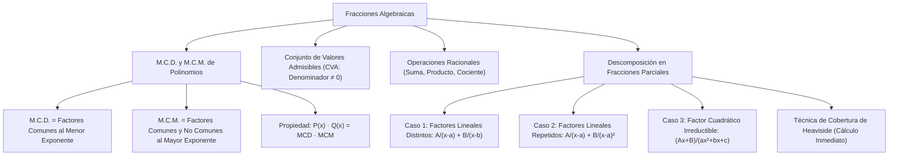

# ÁLGEBRA PREUNIVERSITARIA: CURSO COMPLETO Y SISTEMATIZADO
## EJE 02: MATEMÁTICA — ÁLGEBRA
### TEMA VII: FRACCIONES ALGEBRAICAS, MCD, MCM Y FRACCIONES PARCIALES

---

## 1. FICHA TÉCNICA Y MATRIZ DE COMPETENCIAS

| Parámetro | Detalle Institucional |
| :--- | :--- |
| **Resolución Oficial** | Resolución de Consejo Universitario N° 0028-2026 (Admisión UNSA 2027) |
| **Eje Curricular** | Eje 02: Matemática / Álgebra Superior y Cálculo Previo |
| **Peso Ponderado UNSA** | **Ingenierías:** 1.658337400 pts/preg (4 preg. = 6.63 pts) \| **Biomédicas:** 1.265447400 pts \| **Sociales:** 0.824574000 pts |
| **Frecuencia en Exámenes** | **Alta (88%):** Preguntas directas de simplificación, cálculo de MCD/MCM de polinomios o descomposición en fracciones parciales (puente hacia integrales en la universidad). |
| **Modelos de Examen** | UNSA (Ordinario, CEPREUNSA), UNMSM (DECO de razones de cambio y mezclas), UNI (Fracciones complejas y descomposición en fracciones parciales de casos cuadráticos). |
| **Competencia Cardinal** | Calcular el MCD y MCM de familias de polinomios mediante factorización, simplificar expresiones racionales complejas definiendo su conjunto de valores admisibles (CVA) y descomponer fracciones racionales propias en fracciones parciales. |

---

## 2. MAPA TAXONÓMICO Y ONTOLOGÍA DE CONCEPTOS



---

## 3. DESARROLLO TEÓRICO FORMAL (ESTÁNDAR LUMBRERAS / CUZCANO / UNI)

### 3.1. Definición Formal de Fracción Algebraica
Una **fracción algebraica** es el cociente indicado de dos polinomios racionales enteros $P(x)$ y $Q(x)$, donde el denominador $Q(x)$ es no constante (de grado $\geq 1$):

$$F(x) = \frac{P(x)}{Q(x)}, \quad \text{con } \text{gr}(Q) \geq 1$$

#### Conjunto de Valores Admisibles (C.V.A.):
Es el subconjunto de números reales para los cuales la fracción algebraica está perfectamente definida. Quedan excluidos todos aquellos valores reales que anulan el denominador:

$$\text{C.V.A.} = \{x \in \mathbb{R} \mid Q(x) \neq 0\} = \mathbb{R} \setminus \{x \in \mathbb{R} \mid Q(x) = 0\}$$

#### Fracción Irreductible o Canónica:
Una fracción $\frac{P(x)}{Q(x)}$ es **irreductible** si y solo si sus términos son polinomios primos entre sí (PESI), es decir:
$$\text{MCD}[P(x), Q(x)] = 1$$

---

### 3.2. M.C.D. y M.C.M. de Polinomios

Sean los polinomios factorizados completamente sobre un campo numérico determinado:

1. **Máximo Común Divisor (M.C.D.):**
   Es el polinomio de mayor grado que divide exactamente a cada uno de los polinomios dados.
   - **Regla Práctica:** Se factorizan los polinomios y el M.C.D. se forma multiplicando **únicamente los factores primos comunes elevados a su menor exponente**.

2. **Mínimo Común Múltiplo (M.C.M.):**
   Es el polinomio de menor grado que es divisible exactamente entre cada uno de los polinomios dados.
   - **Regla Práctica:** El M.C.M. se forma multiplicando **todos los factores primos (comunes y no comunes) elevados a su mayor exponente**.

#### Propiedad Fundamental para dos polinomios:
$$\forall P(x), Q(x): \quad P(x) \cdot Q(x) \equiv \text{MCD}[P(x), Q(x)] \cdot \text{MCM}[P(x), Q(x)]$$

---

### 3.3. Descomposición en Fracciones Parciales
Es el proceso inverso a la adición de fracciones algebraicas: permite expresar una **fracción propia** ($\text{gr}(P) < \text{gr}(Q)$) como la suma de fracciones más elementales denominadas **fracciones parciales**.

> [!IMPORTANT]
> **Condición Previa Obligatoria:** Si la fracción es **impropia** ($\text{gr}(P) \geq \text{gr}(Q)$), primero se debe dividir $P(x)$ entre $Q(x)$ mediante el algoritmo de Euclides:
> $$\frac{P(x)}{Q(x)} = C(x) + \frac{R(x)}{Q(x)}$$
> y se descompone únicamente la fracción propia residual $\frac{R(x)}{Q(x)}$.

#### Casos Canónicos:

#### Caso 1: Denominador con factores lineales distintos no repetidos
Si $Q(x) = (x - r_1)(x - r_2)\cdots(x - r_k)$:
$$\frac{P(x)}{Q(x)} = \frac{A_1}{x - r_1} + \frac{A_2}{x - r_2} + \dots + \frac{A_k}{x - r_k}$$

#### Caso 2: Denominador con factores lineales repetidos
Si $Q(x) = (x - r)^k$:
$$\frac{P(x)}{(x - r)^k} = \frac{A_1}{x - r} + \frac{A_2}{(x - r)^2} + \dots + \frac{A_k}{(x - r)^k}$$

#### Caso 3: Denominador con factores cuadráticos irreductibles no repetidos
Si $Q(x)$ contiene un factor cuadrático primo $a x^2 + b x + c$ ($\Delta < 0$):
$$\frac{P(x)}{(ax^2 + bx + c)\cdots} = \frac{Ax + B}{ax^2 + bx + c} + \dots$$

---

## 4. FORMULARIO MAESTRO (LATEX ESTRICTO)

| Concepto / Teorema | Expresión Matemática | Condición Operativa |
| :--- | :--- | :--- |
| **M.C.D. Polinómico** | $\text{MCD} = \prod (f_{\text{comunes}})^{\min(\alpha_i)}$ | Factores comunes al menor exponente |
| **M.C.M. Polinómico** | $\text{MCM} = \prod (f_{\text{todos}})^{\max(\beta_i)}$ | Factores comunes y no comunes al mayor |
| **Producto de Polinomios** | $A(x) \cdot B(x) = \text{MCD} \cdot \text{MCM}$ | Válido para dos polinomios |
| **C.V.A.** | $\text{CVA} = \mathbb{R} \setminus \{x \mid Q(x) = 0\}$ | Dominio de existencia real |
| **Fracción Propia** | $\text{gr}(P) < \text{gr}(Q)$ | Requisito para fracciones parciales |
| **Método de Heaviside** | $A_i = \lim_{x \to r_i} \left[(x - r_i) \frac{P(x)}{Q(x)}\right]$ | Factores lineales simples |
| **División Previa** | $\frac{P(x)}{Q(x)} = q(x) + \frac{R(x)}{Q(x)}$ | Si $\text{gr}(P) \geq \text{gr}(Q)$ (Fracción impropia) |

---

## 5. MNEMOTECNIAS DE COMBATE PREUNIVERSITARIO

### 1. El Método del "Dedo Mágico" (Cobertura de Heaviside)
Para hallar los numeradores $A$ y $B$ de factores lineales simples:
> **"Tápale el hueco al que anulas y reemplaza en lo que queda."**
- Si tienes $\frac{3x + 1}{(x - 2)(x + 5)} = \frac{A}{x - 2} + \frac{B}{x + 5}$:
  - Para hallar $A$: la raíz de su denominador es $x = 2$.
  - Tapas $(x - 2)$ en la fracción original y evalúas $x = 2$:
    $$A = \frac{3(2) + 1}{2 + 5} = \frac{7}{7} = 1$$
  - Para hallar $B$: la raíz es $x = -5$. Tapas $(x + 5)$ y evalúas $x = -5$:
    $$B = \frac{3(-5) + 1}{-5 - 2} = \frac{-14}{-7} = 2$$
¡Resuelto en 5 segundos sin armar sistemas de ecuaciones!

### 2. M.C.D. vs. M.C.M.: "El M.C.D. es Exclusivo, el M.C.M. es Inclusivo"
- **M.C.D. (Exclusivo):** Solo acepta a los **comunes** y encima los minimiza al **menor exponente**.
- **M.C.M. (Inclusivo):** Acepta a **todos** (comunes y no comunes) y los maximiza al **mayor exponente**.

---

## 6. TÉCNICAS Y ARTIFICIOS DE CÁLCULO (HACKING PREUNIVERSITARIO)

### Artificio 1: Simplificación de Fracciones Complejas en Cascada
Cuando tengas una fracción continua (en escalera):
$$F(x) = 1 + \frac{1}{1 + \frac{1}{1 + \frac{1}{x}}}$$
**¡No operes algebraicamente desde abajo hacia arriba escribiendo cinco pasos con denominadores monstruosos!**
**Hack:** Multiplica numerador y denominador de la fracción más interna por $x$, luego por la siguiente expresión lineal, manteniendo un flujo de sumas horizontales directas.

### Artificio 2: Homogeneización de Denominadores Cíclicos
En fracciones de la forma:
$$\frac{1}{(a - b)(a - c)} + \frac{1}{(b - c)(b - a)} + \frac{1}{(c - a)(c - b)}$$
**Hack:** Observa los signos de los factores binómicos. El factor $(b - a) = -(a - b)$, y $(c - b) = -(b - c)$.
Cámbiale de signo al numerador y estandariza al orden cíclico canónico $(a - b)(b - c)(c - a)$. El resultado de estas sumas cíclicas simétricas clásicas es casi siempre **$0$** o **$1$**.

---

## 7. ZONA DE TRAMPAS Y DISTRACTORES ("¡PELIGRO EXAMEN!")

> [!WARNING]
> **Trampa 1: Simplificar sin Registrar el C.V.A. (Pérdida o Ganancia de Soluciones)**
> Si te piden simplificar y evaluar:
> $$f(x) = \frac{x^2 - 9}{x - 3}$$
> El postulante cancela $(x - 3)$ y dice $f(x) = x + 3$. Luego le piden $f(3)$ y responde $3 + 3 = 6$.
> **¡CERO EN LA PREGUNTA!**
> Para $x = 3$, el denominador original es $3 - 3 = 0$, lo cual es una indeterminación matemática. $f(3)$ **NO EXISTE** ($3 \notin \text{C.V.A.}$).

> [!CAUTION]
> **Trampa 2: Descomponer en Fracciones Parciales una Fracción Impropia**
> Si el examen propone:
> $$\frac{x^2 + 5}{x^2 - 1}$$
> y el postulante escribe directamente $\frac{A}{x - 1} + \frac{B}{x + 1}$, el resultado será totalmente falso porque el grado del numerador es igual al del denominador.
> **Paso obligado:** Dividir primero:
> $$\frac{x^2 + 5}{x^2 - 1} = 1 + \frac{6}{x^2 - 1} = 1 + \frac{3}{x - 1} - \frac{3}{x + 1}$$

---

## 8. APLICACIÓN AL MUNDO REAL Y CONTEXTO DECO

### Circuitos Eléctricos y Redes de Impedancia en Alta Tensión (Socabaya, Arequipa)
En la subestación eléctrica de Socabaya (nodo central del Sistema Eléctrico Interconectado Nacional en Arequipa), el cálculo de la impedancia equivalente $Z_{eq}(s)$ en circuitos RLC en paralelo sometidos a corriente alterna se expresa mediante fracciones algebraicas racionales complejas en la variable compleja de Laplace $s$. La descomposición en fracciones parciales de la función de transferencia de voltaje $H(s) = \frac{V_{out}(s)}{V_{in}(s)}$ es indispensable para antitransformar al dominio del tiempo y prevenir armónicos parásitos que puedan disparar los relés de protección térmica de los transformadores.

---

## 9. BANCO DE 5 EJERCICIOS RESUELTOS GRADUADOS

### Ejercicio 1: Nivel Básico (Cálculo Directo de MCD y MCM)
**Enunciado:**
Dados los polinomios completamente factorizados:
$$A(x) = (x - 2)^3 (x + 1)^2 (x - 5)$$
$$B(x) = (x - 2)^2 (x + 1)^4 (x + 3)$$
Determine el cociente $\frac{\text{MCM}[A(x), B(x)]}{\text{MCD}[A(x), B(x)]}$.

**Solución paso a paso:**
1. Calculamos el **M.C.D.** tomando los factores comunes con su menor exponente:
   $$\text{MCD} = (x - 2)^2 (x + 1)^2$$
2. Calculamos el **M.C.M.** tomando los factores comunes y no comunes con su mayor exponente:
   $$\text{MCM} = (x - 2)^3 (x + 1)^4 (x - 5)(x + 3)$$
3. Realizamos el cociente indicado:
   $$\frac{\text{MCM}}{\text{MCD}} = \frac{(x - 2)^3 (x + 1)^4 (x - 5)(x + 3)}{(x - 2)^2 (x + 1)^2}$$
4. Simplificamos los términos semejantes restando los exponentes:
   $$\frac{(x - 2)^3}{(x - 2)^2} = (x - 2)^{3-2} = x - 2$$
   $$\frac{(x + 1)^4}{(x + 1)^2} = (x + 1)^{4-2} = (x + 1)^2$$
5. El cociente final es:
   $$\text{Cociente} = (x - 2)(x + 1)^2 (x - 5)(x + 3)$$

**Respuesta Final:** El cociente simplificado es $\mathbf{(x - 2)(x + 1)^2 (x - 5)(x + 3)}$.

---

### Ejercicio 2: Nivel Intermedio (Simplificación de Fracción Compleja)
**Enunciado:**
Reduzca a su mínima expresión e indique el numerador resultante:
$$E = \frac{1 - \frac{1}{x + 1}}{1 + \frac{1}{x^2 - 1}}$$

**Solución paso a paso:**
1. Operamos el numerador de la fracción principal:
   $$N = 1 - \frac{1}{x + 1} = \frac{(x + 1) - 1}{x + 1} = \frac{x}{x + 1}$$
2. Operamos el denominador de la fracción principal:
   $$D = 1 + \frac{1}{x^2 - 1} = \frac{(x^2 - 1) + 1}{x^2 - 1} = \frac{x^2}{x^2 - 1}$$
3. Sustituimos en la fracción compleja:
   $$E = \frac{\frac{x}{x + 1}}{\frac{x^2}{x^2 - 1}}$$
4. Factorizamos la diferencia de cuadrados en el denominador: $x^2 - 1 = (x - 1)(x + 1)$:
   $$E = \frac{\frac{x}{x + 1}}{\frac{x^2}{(x - 1)(x + 1)}}$$
5. Aplicamos la regla de extremos y medios (producto de extremos sobre producto de medios):
   $$E = \frac{x \cdot (x - 1)(x + 1)}{(x + 1) \cdot x^2}$$
6. Cancelamos los factores comunes no nulos $(x + 1)$ y una $x$:
   $$E = \frac{x - 1}{x}$$
7. El numerador resultante de la fracción simplificada es $x - 1$.

**Respuesta Final:** El numerador resultante es $\mathbf{x - 1}$ (con $x \notin \{-1, 0, 1\}$).

---

### Ejercicio 3: Nivel Avanzado - UNSA Ordinario (MCD y Coeficientes Desconocidos)
**Enunciado:**
Si el Máximo Común Divisor de los polinomios:
$$P(x) = x^3 - 3x^2 + a x - 3$$
$$Q(x) = x^3 - 4x^2 + b x - 4$$
es de segundo grado, determine el valor numérico de $(a + b)$.

**Solución paso a paso:**
1. Si el $\text{MCD}[P, Q]$ es un polinomio cuadrático $M(x)$ de segundo grado, entonces dicho factor divide a cualquier combinación lineal de ellos, en particular a su diferencia $P(x) - Q(x)$:
   $$D(x) = P(x) - Q(x) = (x^3 - 3x^2 + ax - 3) - (x^3 - 4x^2 + bx - 4)$$
   $$D(x) = x^2 + (a - b)x + 1$$
2. Como $D(x)$ es de segundo grado y el $\text{MCD}$ es de segundo grado, **el $\text{MCD}[P, Q]$ debe ser exactamente igual a $D(x)$**:
   $$\text{MCD}[P, Q] = x^2 + (a - b)x + 1$$
3. Por tanto, $P(x)$ debe ser divisible exactamente entre $D(x)$:
   $$x^3 - 3x^2 + ax - 3 = [x^2 + (a - b)x + 1](x - 3)$$
   *(Nótese que el factor lineal debe ser $(x - 3)$ para que el producto de los términos independientes reproduzca $1 \cdot (-3) = -3$).*
4. Desarrollamos el producto de la derecha:
   $$(x^2 + (a - b)x + 1)(x - 3) = x^3 - 3x^2 + (a - b)x^2 - 3(a - b)x + x - 3$$
   $$= x^3 + [(a - b) - 3]x^2 + [1 - 3(a - b)]x - 3$$
5. Igualamos coeficientes con $P(x) = x^3 - 3x^2 + ax - 3$:
   - Para el término cuadrático:
     $$(a - b) - 3 = -3 \implies a - b = 0 \implies a = b$$
   - Para el término lineal:
     $$a = 1 - 3(a - b) = 1 - 3(0) \implies a = 1$$
6. Como $a = b$, tenemos que $b = 1$.
7. Verificamos en $Q(x)$:
   $$Q(x) = x^3 - 4x^2 + x - 4 = x^2(x - 4) + 1(x - 4) = (x^2 + 1)(x - 4)$$
   $$P(x) = x^3 - 3x^2 + x - 3 = x^2(x - 3) + 1(x - 3) = (x^2 + 1)(x - 3)$$
   Efectivamente, el $\text{MCD} = x^2 + 1$ (grado 2).
8. Calculamos $a + b$:
   $$a + b = 1 + 1 = 2$$

**Respuesta Final:** El valor de $(a + b)$ es $\mathbf{2}$.

---

### Ejercicio 4: Nivel San Marcos DECO (Fracciones Parciales y Modelo Económico)
**Enunciado:**
El costo promedio por unidad al fabricar componentes solares en Arequipa sigue la relación:
$$C(x) = \frac{7x + 11}{(x + 1)(x + 3)}$$
donde $x$ es el lote de producción en centenas. Para facilitar el análisis presupuestario, dicha función debe expresarse en la forma de fracciones parciales:
$$C(x) = \frac{A}{x + 1} + \frac{B}{x + 3}$$
Determine el valor del producto de las constantes $A \cdot B$.

**Solución paso a paso:**
1. Planteamos la identidad de fracciones parciales (Caso 1: factores lineales distintos):
   $$\frac{7x + 11}{(x + 1)(x + 3)} \equiv \frac{A}{x + 1} + \frac{B}{x + 3}$$
2. Aplicamos la técnica de cobertura de **Oliver Heaviside** (Método del Dedo Mágico):
   - **Para hallar $A$:** El denominador $(x + 1)$ se anula en $x = -1$.
     Ocultamos el factor $(x + 1)$ en la fracción original y evaluamos en $x = -1$:
     $$A = \left. \frac{7x + 11}{x + 3} \right|_{x = -1} = \frac{7(-1) + 11}{-1 + 3} = \frac{-7 + 11}{2} = \frac{4}{2} = 2$$
   - **Para hallar $B$:** El denominador $(x + 3)$ se anula en $x = -3$.
     Ocultamos el factor $(x + 3)$ en la fracción original y evaluamos en $x = -3$:
     $$B = \left. \frac{7x + 11}{x + 1} \right|_{x = -3} = \frac{7(-3) + 11}{-3 + 1} = \frac{-21 + 11}{-2} = \frac{-10}{-2} = 5$$
3. Verificamos la identidad sumando las fracciones parciales:
   $$\frac{2}{x + 1} + \frac{5}{x + 3} = \frac{2(x + 3) + 5(x + 1)}{(x + 1)(x + 3)} = \frac{2x + 6 + 5x + 5}{(x + 1)(x + 3)} = \frac{7x + 11}{(x + 1)(x + 3)} \quad \checkmark$$
4. Calculamos el producto solicitado:
   $$A \cdot B = 2 \cdot 5 = 10$$

**Respuesta Final:** El producto $A \cdot B$ es $\mathbf{10}$.

---

### Ejercicio 5: Nivel Boss Challenge - Estilo UNI (Fracciones Parciales de Fracción Impropia)
**Enunciado:**
Descomponga en fracciones parciales sobre $\mathbb{R}$ la siguiente fracción algebraica:
$$F(x) = \frac{x^4 - 2x^3 + 3x^2 - x + 1}{x^3 - x^2}$$
e indique la suma de todos los numeradores y coeficientes que componen su descomposición canónica.

**Solución paso a paso:**
1. **Verificación de Fracción Propia o Impropia:**
   - Grado del numerador: $[P] = 4$.
   - Grado del denominador: $[Q] = 3$.
   Como $[P] \geq [Q]$, la fracción es **impropia**. Es obligatorio realizar la división polinómica previa.
2. Dividimos $P(x)$ entre $Q(x)$ por el método clásico o Horner:
   Dividendo: $x^4 - 2x^3 + 3x^2 - x + 1$.
   Divisor: $x^3 - x^2$.
   - $x^4 / x^3 = x$. Multiplicamos y restamos: $(x^4 - 2x^3) - (x^4 - x^3) = -x^3$.
   - $-x^3 / x^3 = -1$. Multiplicamos y restamos: $(-x^3 + 3x^2) - (-x^3 + x^2) = 2x^2$.
   - El cociente es $q(x) = x - 1$.
   - El residuo es $R(x) = 2x^2 - x + 1$.
3. Expresamos la fracción según el algoritmo de la división:
   $$F(x) = (x - 1) + \frac{2x^2 - x + 1}{x^3 - x^2}$$
4. Factorizamos el denominador del término residual:
   $$x^3 - x^2 = x^2(x - 1)$$
   Presenta un factor lineal repetido ($x^2$) y un factor lineal simple $(x - 1)$.
5. Planteamos la descomposición en fracciones parciales de la parte propia:
   $$\frac{2x^2 - x + 1}{x^2(x - 1)} \equiv \frac{A}{x} + \frac{B}{x^2} + \frac{C}{x - 1}$$
6. Determinamos las constantes:
   - Para $C$ (aplicamos Heaviside con $x = 1$ tapando $(x - 1)$):
     $$C = \frac{2(1)^2 - 1 + 1}{1^2} = \frac{2}{1} = 2$$
   - Para $B$ (aplicamos Heaviside en la potencia más alta $x^2$ tapando $x^2$ y evaluando en $x = 0$):
     $$B = \frac{2(0)^2 - 0 + 1}{0 - 1} = \frac{1}{-1} = -1$$
   - Para hallar $A$, evaluamos en un valor cómodo, por ejemplo $x = 2$:
     $$\frac{2(2)^2 - 2 + 1}{2^2(2 - 1)} = \frac{8 - 2 + 1}{4(1)} = \frac{7}{4}$$
     Reemplazamos en la descomposición:
     $$\frac{A}{2} + \frac{-1}{4} + \frac{2}{1} = \frac{7}{4}$$
     $$\frac{A}{2} - \frac{1}{4} + \frac{8}{4} = \frac{7}{4} \implies \frac{A}{2} + \frac{7}{4} = \frac{7}{4} \implies \frac{A}{2} = 0 \implies A = 0$$
7. La descomposición canónica completa de $F(x)$ es:
   $$F(x) = x - 1 - \frac{1}{x^2} + \frac{2}{x - 1}$$
8. Coeficientes y numeradores resultantes:
   - Coeficiente de $x$: $1$
   - Término constante del cociente: $-1$
   - Numerador de $1/x$: $A = 0$
   - Numerador de $1/x^2$: $B = -1$
   - Numerador de $1/(x-1)$: $C = 2$
   Suma solicitada:
   $$\text{Suma} = 1 + (-1) + 0 + (-1) + 2 = 1$$

**Respuesta Final:** La descomposición es $\mathbf{F(x) = x - 1 - \frac{1}{x^2} + \frac{2}{x - 1}}$ y la suma es $\mathbf{1}$.

---

## 10. GLOSARIO DE 10 TÉRMINOS CLAVE

1. **Fracción Algebraica:** Razón indicada entre dos polinomios donde el denominador tiene al menos una variable.
2. **C.V.A. (Conjunto de Valores Admisibles):** Conjunto de números reales para los cuales el denominador no se anula.
3. **Fracción Irreductible:** Aquella cuyos términos son polinomios primos entre sí ($\text{MCD} = 1$).
4. **M.C.D. de Polinomios:** Producto de los factores primos comunes elevados a su menor exponente.
5. **M.C.M. de Polinomios:** Producto de todos los factores primos comunes y no comunes al mayor exponente.
6. **Fracción Propia:** Fracción racional donde el grado del numerador es estrictamente menor que el del denominador.
7. **Fracción Impropia:** Fracción racional donde el grado del numerador es mayor o igual que el del denominador.
8. **Fracciones Parciales:** Expresión de una fracción propia como la suma de fracciones más simples con denominadores irreductibles.
9. **Método de Heaviside:** Técnica de cobertura para hallar los numeradores de fracciones parciales evaluando las raíces que anulan cada denominador.
10. **Factor Cuadrático Irreductible:** Trinomio de segundo grado con discriminante negativo que no admite descomposición en $\mathbb{R}$.

---

## 11. BANCO DE FLASHCARDS (ANVERSO / REVERSO)

- **Flashcard 1:**
  - *Anverso:* ¿Qué condición matemática define a una fracción algebraica propia?
  - *Reverso:* El grado del numerador debe ser estrictamente menor que el grado del denominador: $\text{gr}(P) < \text{gr}(Q)$.
- **Flashcard 2:**
  - *Anverso:* ¿Cuál es la propiedad que relaciona el producto de dos polinomios con su MCD y MCM?
  - *Reverso:* $P(x) \cdot Q(x) = \text{MCD}[P(x), Q(x)] \cdot \text{MCM}[P(x), Q(x)]$.
- **Flashcard 3:**
  - *Anverso:* ¿Qué debe hacerse obligatoriamente antes de descomponer en fracciones parciales una fracción impropia?
  - *Reverso:* Se debe realizar la división algebraica para separar la parte entera polinómica del resto propio: $\frac{P}{Q} = C + \frac{R}{Q}$.
- **Flashcard 4:**
  - *Anverso:* ¿Cómo se estructuran las fracciones parciales de un factor lineal repetido $(x - a)^3$?
  - *Reverso:* $\frac{A}{x - a} + \frac{B}{(x - a)^2} + \frac{C}{(x - a)^3}$.
- **Flashcard 5:**
  - *Anverso:* ¿Qué tipo de numerador se coloca sobre un denominador cuadrático irreductible $(a x^2 + b x + c)$?
  - *Reverso:* Un numerador lineal de primer grado: $(A x + B)$.

---

## 12. MOTOR DE GAMIFICACIÓN (JSON PARA KOTLIN MULTIPLATFORM)

```json
{
  "topicId": "alg_07_fracciones_algebraicas",
  "title": "Fracciones Algebraicas, MCD, MCM y Fracciones Parciales",
  "subject": "algebra",
  "xpReward": 400,
  "level": "ADVANCED",
  "badges": [
    {
      "id": "heaviside_sorcerer",
      "name": "Mago de Heaviside",
      "description": "Descompusiste fracciones algebraicas en fracciones parciales en tiempo récord con la técnica del dedo mágico."
    }
  ],
  "questions": [
    {
      "id": "q1",
      "statement": "¿Para qué valor real de x NO está definida la fracción F(x) = (x^2 - 4) / (2x - 6)?",
      "options": ["2", "-2", "3", "0"],
      "correctIndex": 2,
      "explanation": "El denominador no puede ser cero: 2x - 6 = 0 => 2x = 6 => x = 3."
    },
    {
      "id": "q2",
      "statement": "Si descompone 5 / ((x - 1)(x + 4)) = A / (x - 1) + B / (x + 4), ¿cuál es el valor de A?",
      "options": ["1", "5", "-1", "2"],
      "correctIndex": 0,
      "explanation": "Por Heaviside: A = 5 / (1 + 4) = 5 / 5 = 1."
    }
  ]
}
```
