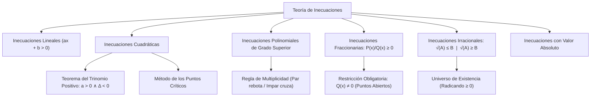

# ÁLGEBRA PREUNIVERSITARIA: CURSO COMPLETO Y SISTEMATIZADO
## EJE 02: MATEMÁTICA — ÁLGEBRA
### TEMA IX: INECUACIONES LINEALES, POLINOMIALES, FRACCIONARIAS E IRRACIONALES

---

## 1. FICHA TÉCNICA Y MATRIZ DE COMPETENCIAS

| Parámetro | Detalle Institucional |
| :--- | :--- |
| **Resolución Oficial** | Resolución de Consejo Universitario N° 0028-2026 (Admisión UNSA 2027) |
| **Eje Curricular** | Eje 02: Matemática / Análisis de Desigualdades e Intervalos |
| **Peso Ponderado UNSA** | **Ingenierías:** 1.658337400 pts/preg (4 preg. = 6.63 pts) \| **Biomédicas:** 1.265447400 pts \| **Sociales:** 0.824574000 pts |
| **Frecuencia en Exámenes** | **Crítica / Alta (95%):** Presente de manera directa en inecuaciones fraccionarias/irracionales y como fundamento del dominio de funciones. |
| **Modelos de Examen** | UNSA (Ordinario, CEPREUNSA), UNMSM (DECO de optimización de costos y restricciones operativas), UNI (Inecuaciones con multiplicidad par y radicales anidados). |
| **Competencia Cardinal** | Determinar el conjunto solución de desigualdades algebraicas mediante el método de los puntos críticos, el Teorema del Trinomio Positivo, la restricción del universo en expresiones fraccionarias e irracionales, y el análisis de valor absoluto. |

---

## 2. MAPA TAXONÓMICO Y ONTOLOGÍA DE CONCEPTOS



---

## 3. DESARROLLO TEÓRICO FORMAL (ESTÁNDAR LUMBRERAS / CUZCANO / UNI)

### 3.1. Axiomas de Orden y Definición de Inecuación
Una **inecuación** es una desigualdad algebraica condicional entre dos expresiones que solo es válida para un conjunto de valores reales, denominado **Conjunto Solución ($C.S.$)**, el cual generalmente se expresa en forma de intervalos continuos o uniones de ellos.

#### Axiomas Cardinales de la Desigualdad:
1. **Ley de Tricotomía:** Dados $a, b \in \mathbb{R}$, se cumple una y solo una: $a < b$, $a = b$, o $a > b$.
2. **Monotonía de la Adición:** Si $a < b \implies a + c < b + c, \ \forall c \in \mathbb{R}$.
3. **Monotonía de la Multiplicación:**
   - Si $c > 0 \land a < b \implies a \cdot c < b \cdot c$ (El sentido se conserva).
   - Si $c < 0 \land a < b \implies a \cdot c > b \cdot c$ (**¡El sentido de la desigualdad se invierte!**).

---

### 3.2. Inecuaciones Cuadráticas y el Teorema del Trinomio Positivo
Forma general canónica:
$$a x^2 + b x + c \gtrless 0, \quad \text{con } a > 0$$

#### Teorema del Trinomio Positivo (Teorema Fundamental del Álgebra Real):
Sea el trinomio cuadrático $P(x) = ax^2 + bx + c$ con coeficientes reales:
$$a x^2 + b x + c > 0, \quad \forall x \in \mathbb{R} \iff a > 0 \quad \land \quad \Delta = b^2 - 4ac < 0$$
- **Consecuencia:** Si un factor cuadrático tiene $a > 0$ y $\Delta < 0$, su valor numérico es siempre estrictamente positivo para cualquier $x \in \mathbb{R}$. Por ende, **se puede eliminar de cualquier inecuación sin alterar el conjunto solución ni el sentido**.

#### Teorema del Trinomio No Negativo:
$$a x^2 + b x + c \geq 0, \quad \forall x \in \mathbb{R} \iff a > 0 \quad \land \quad \Delta \leq 0$$

---

### 3.3. Método de los Puntos Críticos (Inecuaciones Polinomiales y Fraccionarias)
Se emplea para resolver inecuaciones de cualquier grado:
$$P(x) = a_n (x - r_1)^{\alpha_1} (x - r_2)^{\alpha_2} \cdots (x - r_k)^{\alpha_k} \gtrless 0$$

#### Algoritmo Canónico:
1. **Coeficiente Principal Positivo:** Garantizar que todos los factores lineales tengan el coeficiente de $x$ positivo ($+1x$).
2. **Cálculo de Puntos Críticos:** Igualar cada factor lineal a cero: $x = r_1, r_2, \dots, r_k$.
3. **Ubicación en la Recta Real:** Ordenar los puntos críticos en la recta numérica en orden creciente.
4. **Regla de los Signos (Multiplicidad de Raíces):**
   - Se comienza desde la extrema derecha con el signo **$+$**.
   - Al pasar por un punto crítico de **multiplicidad impar** ($\alpha = 1, 3, 5, \dots$), el signo **cambia** ($+ \to -$ o $- \to +$).
   - Al pasar por un punto crítico de **multiplicidad par** ($\alpha = 2, 4, 6, \dots$), el signo **se repite (rebota)** ($+ \to +$ o $- \to -$).
5. **Selección de la Zona Solución:**
   - Si la inecuación reducida es $> 0$ o $\geq 0$, el $C.S.$ está formado por las zonas con signo **$+$**.
   - Si es $< 0$ o $\leq 0$, el $C.S.$ lo forman las zonas con signo **$-$**.
   - En inecuaciones con $\geq$ o $\leq$, los puntos críticos del numerador son cerrados, pero **los puntos críticos provenientes del denominador siempre son rigurosamente abiertos**.

---

### 3.4. Inecuaciones Irracionales (Radicales de Índice Par)
Sean $A$ y $B$ expresiones algebraicas reales:

#### Caso 1: $\sqrt{A} \leq B$
$$\sqrt{A} \leq B \iff A \geq 0 \quad \land \quad B \geq 0 \quad \land \quad A \leq B^2$$

#### Caso 2: $\sqrt{A} \geq B$
$$\sqrt{A} \geq B \iff \left[ A \geq 0 \ \land \ B < 0 \right] \quad \lor \quad \left[ B \geq 0 \ \land \ A \geq B^2 \right]$$

---

### 3.5. Inecuaciones con Valor Absoluto
1. $|x| \leq b \iff b \geq 0 \quad \land \quad -b \leq x \leq b$
2. $|x| \geq b \iff x \geq b \quad \lor \quad x \leq -b$
3. $|x| \leq |y| \iff x^2 \leq y^2 \iff (x - y)(x + y) \leq 0$

---

## 4. FORMULARIO MAESTRO (LATEX ESTRICTO)

| Teorema / Inecuación | Formulación Matemática | Condición / Observación |
| :--- | :--- | :--- |
| **Trinomio Positivo** | $ax^2 + bx + c > 0, \ \forall x \in \mathbb{R} \iff a > 0 \land \Delta < 0$ | Se cancela directamente |
| **Fraccionaria** | $\frac{P(x)}{Q(x)} \geq 0 \iff P(x) \cdot Q(x) \geq 0 \land Q(x) \neq 0$ | Puntos del denominador abiertos |
| **Multiplicidad Par** | $(x - a)^{2n} P(x) \geq 0 \implies P(x) \geq 0 \lor x = a$ | No cambia signo en la recta |
| **Multiplicidad Impar** | $(x - a)^{2n+1} P(x) \geq 0 \iff (x - a) P(x) \geq 0$ | Cambia de signo normalmente |
| **Radical Menor** | $\sqrt{A} \leq B \iff A \geq 0 \land B \geq 0 \land A \leq B^2$ | Tres condiciones simultáneas |
| **Radical Mayor** | $\sqrt{A} \geq B \iff (A \geq 0 \land B < 0) \lor (B \geq 0 \land A \geq B^2)$ | Unión de dos universos |
| **Valores Absolutos** | $\|A\| \leq \|B\| \iff (A - B)(A + B) \leq 0$ | Diferencia de cuadrados directa |

---

## 5. MNEMOTECNIAS DE COMBATE PREUNIVERSITARIO

### 1. La Ley del Rebote en Puntos Críticos: "Par no pasa, Impar impacta"
- **Exponente Par (2, 4, 6...):** Como una pelota que choca en la pared, el signo **rebota** y se queda igual ($+ \to +$).
- **Exponente Impar (1, 3, 5...):** Como una bala que atraviesa un cristal, el signo **cambia** ($+ \to -$).

### 2. Radicales con Mayor: "Si la derecha es negativa, la raíz siempre le gana"
En $\sqrt{A} \geq B$:
- Si $B < 0$, ¡no necesitas elevar al cuadrado! Como la raíz siempre es $\geq 0$, una cantidad no negativa **siempre es mayor que cualquier negativo**. Solo asegúrate de que el radicando exista: $A \geq 0$.

---

## 6. TÉCNICAS Y ARTIFICIOS DE CÁLCULO (HACKING PREUNIVERSITARIO)

### Artificio 1: Cancelación Inmediata de Expresiones Estrictamente Positivas
En inecuaciones racionales complejas como:
$$\frac{(x^2 + 4)(x^2 + x + 5)(x - 3)^3}{(x^2 - 16)(e^x + 1)} \leq 0$$
**¡No ubiques $x^2 + 4$ ni $x^2 + x + 5$ en la recta numérica!**
**Hack:**
- $x^2 + 4 > 0, \forall x$.
- $x^2 + x + 5$ tiene $a=1>0$ y $\Delta = 1 - 20 = -19 < 0 \implies$ Es siempre positivo por el Teorema del Trinomio Positivo.
- $e^x + 1 > 0, \forall x$.
**Táchalos todos de inmediato sin alterar el sentido:**
La inecuación se reduce al instante a:
$$\frac{(x - 3)^3}{(x - 4)(x + 4)} \leq 0 \implies \frac{x - 3}{(x - 4)(x + 4)} \leq 0$$
Puntos críticos: $-4$ (abierto), $3$ (cerrado), $4$ (abierto). Tiempo de resolución: 15 segundos.

### Artificio 2: Elevación al Cuadrado Segura con Valor Absoluto
Si tienes $|2x - 5| \leq |x + 4|$:
**¡Jamás abras la inecuación en 4 zonas con la definición modular de intervalos!**
**Hack:** Como ambos miembros son no negativos, eleva directamente al cuadrado y aplica diferencia de cuadrados:
$$(2x - 5)^2 - (x + 4)^2 \leq 0$$
$$[(2x - 5) - (x + 4)][(2x - 5) + (x + 4)] \leq 0$$
$$(x - 9)(3x - 1) \leq 0 \implies x \in \left[\frac{1}{3}, \ 9\right]$$

---

## 7. ZONA DE TRAMPAS Y DISTRACTORES ("¡PELIGRO EXAMEN!")

> [!WARNING]
> **Trampa 1: El Punto Crítico de Multiplicidad Par en Desigualdades Estrictas**
> Resuelve: $(x - 3)^2 (x + 5) > 0$.
> El postulante cancela $(x - 3)^2$ y pone $x + 5 > 0 \implies x > -5$.
> **¡ERROR!** Si $x = 3$, la expresión da $(0)^2(8) = 0$, pero $0 > 0$ es falso.
> El $C.S.$ correcto es: $\langle -5, \infty\rangle \setminus \{3\}$.

> [!CAUTION]
> **Trampa 2: Cerrar los Puntos del Denominador**
> En la inecuación $\frac{x - 2}{x - 7} \leq 0$:
> Muchos alumnos ven el signo $\leq$ y marcan $C.S. = [2, 7]$.
> **¡GRAVÍSIMO!** En $x = 7$ el denominador se hace cero. La solución correcta es $C.S. = [2, 7\rangle$.

---

## 8. APLICACIÓN AL MUNDO REAL Y CONTEXTO DECO

### Dimensionamiento de Franja de Amortiguamiento Ambiental en la Quebrada de Añashuayco
En el plan de ordenamiento territorial metropolitano de Arequipa, las canteras de sillar de Añashuayco deben mantener un radio de seguridad $x$ en kilómetros respecto a las urbanizaciones adyacentes para mitigar la contaminación por polvo en suspensión. El índice de dispersión atmosférica se modela mediante la inecuación racional $\frac{x^2 - 10x + 16}{x - 1} \leq 0$. Resolver esta desigualdad permite a los ingenieros ambientales de la UNSA delimitar con rigor legal las cotas territoriales donde está terminantemente prohibido autorizar licencias de construcción urbana.

---

## 9. BANCO DE 5 EJERCICIOS RESUELTOS GRADUADOS

### Ejercicio 1: Nivel Básico (Inecuación Cuadrática por Puntos Críticos)
**Enunciado:**
Resuelva en $\mathbb{R}$ la inecuación cuadrática:
$$x^2 - 5x - 14 \leq 0$$
e indique la cantidad de números enteros que forman parte de su conjunto solución.

**Solución paso a paso:**
1. Factorizamos el trinomio por el método del aspa simple:
   $$x^2 - 5x - 14 = (x - 7)(x + 2) \leq 0$$
2. Hallamos los puntos críticos igualando cada factor a cero:
   $$x - 7 = 0 \implies x = 7$$
   $$x + 2 = 0 \implies x = -2$$
3. Trazamos los puntos en la recta real y asignamos signos alternados de derecha a izquierda:
   $$\langle -\infty, -2] \ (+) \quad [-2, 7] \ (-) \quad [7, +\infty\rangle \ (+)$$
4. Como la inecuación es $\leq 0$, seleccionamos la zona con signo negativo:
   $$C.S. = [-2, \ 7]$$
5. Contamos los números enteros contenidos en dicho intervalo cerrado:
   $$\mathbb{Z} \cap C.S. = \{-2, -1, 0, 1, 2, 3, 4, 5, 6, 7\}$$
   $$\text{Cantidad} = 7 - (-2) + 1 = 10 \text{ enteros}$$

**Respuesta Final:** El conjunto solución contiene **$10$** números enteros.

---

### Ejercicio 2: Nivel Intermedio (Inecuación Fraccionaria con Multiplicidad)
**Enunciado:**
Determine el conjunto solución de la inecuación fraccionaria:
$$\frac{(x - 4)^2 (x + 3)}{(x - 1)} \leq 0$$

**Solución paso a paso:**
1. Identificamos los factores y sus multiplicidades:
   - Factor $(x - 4)$ tiene exponente 2 (multiplicidad par: **rebote**).
   - Factor $(x + 3)$ tiene exponente 1 (multiplicidad impar: cruce). Numerador: punto cerrado en $\leq 0$.
   - Factor $(x - 1)$ está en el denominador: **punto estrictamente abierto** ($x \neq 1$).
2. Ubicamos los puntos críticos en la recta numérica: $-3$, $1$, $4$.
3. Distribuimos los signos de derecha a izquierda:
   - A la derecha de 4: zona $(+)$.
   - En $x = 4$ hay multiplicidad par $\implies$ el signo se mantiene: zona $(+)$.
   - En $x = 1$ hay multiplicidad impar $\implies$ el signo cambia a $(-)$.
   - En $x = -3$ hay multiplicidad impar $\implies$ el signo cambia a $(+)$.
4. Dado que buscamos $\leq 0$, tomamos la zona $(-)$ y añadimos los puntos donde el numerador se anula:
   - Zona $(-)$: $[-3, \ 1\rangle$.
   - En $x = 4$, el numerador da $0$, y $0 \leq 0$ es verdadero. Por tanto, el número aislado $4$ pertenece al $C.S.$
5. Escribimos el Conjunto Solución formal:
   $$C.S. = [-3, \ 1\rangle \cup \{4\}$$

**Respuesta Final:** $\mathbf{C.S. = [-3, \ 1\rangle \cup \{4\}}$.

---

### Ejercicio 3: Nivel Avanzado - UNSA Ordinario (Teorema del Trinomio Positivo)
**Enunciado:**
Si la desigualdad cuadrática:
$$(k - 1)x^2 + 2(k - 1)x + 3 > 0$$
se cumple para **todo número real $x$**, halle el intervalo de variación del parámetro real $k$.

**Solución paso a paso:**
1. Por el **Teorema del Trinomio Positivo**, para que un trinomio $A x^2 + B x + C > 0$ sea estrictamente positivo para todo $x \in \mathbb{R}$, se deben cumplir dos condiciones simultáneas:
   $$\text{Condición 1: } A > 0 \implies k - 1 > 0 \implies k > 1 \quad \text{--- (1)}$$
   $$\text{Condición 2: } \Delta < 0 \implies B^2 - 4AC < 0 \quad \text{--- (2)}$$
2. Desarrollamos el discriminante con los coeficientes dados:
   $$A = k - 1, \quad B = 2(k - 1), \quad C = 3$$
   $$\Delta = [2(k - 1)]^2 - 4(k - 1)(3) < 0$$
   $$4(k - 1)^2 - 12(k - 1) < 0$$
3. Dividimos entre 4 y extraemos factor común $(k - 1)$:
   $$(k - 1)[(k - 1) - 3] < 0$$
   $$(k - 1)(k - 4) < 0$$
4. Resolvemos esta inecuación cuadrática en $k$:
   Puntos críticos: $k = 1$ y $k = 4$.
   Zona negativa:
   $$k \in \langle 1, \ 4\rangle \quad \text{--- (Ec. 2)}$$
5. Intersecamos la Condición 1 ($k > 1$) con la Condición 2 ($k \in \langle 1, 4\rangle$):
   $$k \in \langle 1, \ 4\rangle$$
6. Analizamos si $k = 1$ verifica la desigualdad original:
   Si $k = 1$: $(0)x^2 + 2(0)x + 3 > 0 \implies 3 > 0$, ¡lo cual es una verdad matemática absoluta para todo $x \in \mathbb{R}$!
   Por ende, $k = 1$ también satisface la condición del problema.
7. Uniendo las soluciones:
   $$k \in [1, \ 4\rangle$$

**Respuesta Final:** El parámetro $k$ varía en $\mathbf{k \in [1, \ 4\rangle}$.

---

### Ejercicio 4: Nivel San Marcos DECO (Inecuación de Utilidades y Rentabilidad)
**Enunciado:**
Una cooperativa lechera en Majes determina que la ganancia neta diaria en soles por procesar $x$ cientos de litros de leche pasteurizada está dada por $G(x) = \frac{x^2 - 9x + 20}{x - 2}$. Si la directiva exige que la ganancia sea estrictamente positiva para garantizar la viabilidad del turno de noche, determine todos los niveles de producción $x$ que cumplen la exigencia.

**Solución paso a paso:**
1. Planteamos la inecuación según la condición de viabilidad:
   $$G(x) > 0 \implies \frac{x^2 - 9x + 20}{x - 2} > 0$$
2. Factorizamos el numerador por aspa simple:
   $$x^2 - 9x + 20 = (x - 4)(x - 5)$$
   Luego:
   $$\frac{(x - 4)(x - 5)}{x - 2} > 0$$
3. Identificamos los puntos críticos:
   $$x = 2, \quad x = 4, \quad x = 5$$
   Todos son de multiplicidad impar (exponente 1) y todos son abiertos (la desigualdad es estricta $>$).
4. Trazamos los puntos en la recta real y alternamos signos desde la derecha:
   $$\langle -\infty, 2\rangle \ (-) \quad \langle 2, 4\rangle \ (+) \quad \langle 4, 5\rangle \ (-) \quad \langle 5, +\infty\rangle \ (+)$$
5. Seleccionamos las zonas con signo positivo ($+$):
   $$x \in \langle 2, \ 4\rangle \cup \langle 5, \ +\infty\rangle$$
6. Contextualizamos con la variable real de producción ($x > 0$):
   Ambos intervalos son positivos, por lo que la producción es viable si se producen entre $200$ y $400$ litros, o más de $500$ litros al día.

**Respuesta Final:** La condición se cumple para $\mathbf{x \in \langle 2, \ 4\rangle \cup \langle 5, \ +\infty\rangle}$.

---

### Ejercicio 5: Nivel Boss Challenge - Estilo UNI (Inecuación Irracional con Radicales)
**Enunciado:**
Resuelva la inecuación irracional en el campo de los números reales:
$$\sqrt{x + 7} \geq x + 1$$
e indique la suma de todos los números enteros impares que pertenecen a su conjunto solución.

**Solución paso a paso:**
1. Aplicamos la propiedad canónica para inecuaciones de la forma $\sqrt{A} \geq B$:
   $$\sqrt{A} \geq B \iff \underbrace{(A \geq 0 \ \land \ B < 0)}_{\text{Caso I}} \quad \lor \quad \underbrace{(B \geq 0 \ \land \ A \geq B^2)}_{\text{Caso II}}$$
   Donde $A = x + 7$ y $B = x + 1$.
2. **Desarrollo del Caso I:**
   - $A \geq 0 \implies x + 7 \geq 0 \implies x \geq -7$
   - $B < 0 \implies x + 1 < 0 \implies x < -1$
   Intersección del Caso I:
   $$S_I = [-7, \ -1\rangle$$
3. **Desarrollo del Caso II:**
   - $B \geq 0 \implies x + 1 \geq 0 \implies x \geq -1$
   - $A \geq B^2 \implies x + 7 \geq (x + 1)^2$
     $$x + 7 \geq x^2 + 2x + 1$$
     $$0 \geq x^2 + x - 6 \implies x^2 + x - 6 \leq 0$$
     $$(x + 3)(x - 2) \leq 0 \implies x \in [-3, \ 2]$$
   - Intersecamos con $x \geq -1$:
     $$S_{II} = [-1, \ +\infty\rangle \cap [-3, \ 2] = [-1, \ 2]$$
4. **Unión de ambos casos:**
   $$C.S. = S_I \cup S_{II} = [-7, \ -1\rangle \cup [-1, \ 2] = [-7, \ 2]$$
5. Identificamos los números enteros impares en el intervalo $[-7, \ 2]$:
   $$\text{Enteros impares} = \{-7, -5, -3, -1, 1\}$$
6. Sumamos dichos enteros:
   $$\text{Suma} = (-7) + (-5) + (-3) + (-1) + 1 = -15$$

**Respuesta Final:** El conjunto solución es $\mathbf{[-7, \ 2]}$ y la suma de enteros impares es $\mathbf{-15}$.

---

## 10. GLOSARIO DE 10 TÉRMINOS CLAVE

1. **Inecuación:** Desigualdad algebraica condicional que solo se cumple para un subconjunto de números reales.
2. **Conjunto Solución (C.S.):** Intervalo o conjunto de intervalos formados por todos los valores reales que verifican la inecuación.
3. **Puntos Críticos:** Raíces reales obtenidas al igualar a cero cada uno de los factores lineales de la expresión.
4. **Multiplicidad Par:** Punto crítico con exponente par donde el signo de la desigualdad no cambia al cruzarlo en la recta real.
5. **Multiplicidad Impar:** Punto crítico con exponente impar donde el signo se alterna necesariamente.
6. **Teorema del Trinomio Positivo:** Criterio que asegura que $ax^2 + bx + c > 0, \forall x \in \mathbb{R}$ si y solo si $a > 0$ y $\Delta < 0$.
7. **Inecuación Fraccionaria:** Desigualdad con incógnitas en el denominador, cuyos puntos críticos del denominador son siempre abiertos.
8. **Universo de Existencia (CVA):** Restricción previa obligatoria que exige que todo radicando de índice par sea no negativo ($A \geq 0$).
9. **Desigualdad Estricta:** Relación de orden que utiliza los símbolos $>$ o $<$ sin incluir la igualdad.
10. **Tricotomía:** Postulado que afirma que para cualquier par de números reales solo una de tres relaciones es verdadera ($<, =, >$).

---

## 11. BANCO DE FLASHCARDS (ANVERSO / REVERSO)

- **Flashcard 1:**
  - *Anverso:* ¿Qué condiciones garantizan que un trinomio cuadrático $ax^2 + bx + c$ sea positivo para TODO número real?
  - *Reverso:* Coeficiente principal positivo ($a > 0$) y discriminante estrictamente negativo ($\Delta < 0$).
- **Flashcard 2:**
  - *Anverso:* ¿Qué ocurre con los signos en la recta de los puntos críticos al cruzar una raíz de multiplicidad par $(x - r)^{2n}$?
  - *Reverso:* El signo no cambia; se repite (rebota).
- **Flashcard 3:**
  - *Anverso:* En una inecuación fraccionaria con el operador $\leq 0$, ¿qué puntos críticos deben quedar obligatoriamente abiertos?
  - *Reverso:* Todos los puntos críticos provenientes del denominador ($Q(x) \neq 0$).
- **Flashcard 4:**
  - *Anverso:* ¿A qué equivale la inecuación con valor absoluto $|A| \leq B$?
  - *Reverso:* $B \geq 0 \quad \land \quad -B \leq A \leq B$.
- **Flashcard 5:**
  - *Anverso:* Si se multiplica o divide una inecuación por un número negativo, ¿qué ocurre con el sentido de la desigualdad?
  - *Reverso:* El sentido de la desigualdad se invierte obligatoriamente ($< \to >$).

---

## 12. MOTOR DE GAMIFICACIÓN (JSON PARA KOTLIN MULTIPLATFORM)

```json
{
  "topicId": "alg_09_inecuaciones",
  "title": "Inecuaciones Lineales, Polinomiales, Fraccionarias e Irracionales",
  "subject": "algebra",
  "xpReward": 410,
  "level": "ADVANCED",
  "badges": [
    {
      "id": "critical_points_master",
      "name": "Guardián de los Puntos Críticos",
      "description": "Navegaste multiplicidades pares e impares sin caer en las trampas de los extremos abiertos."
    }
  ],
  "questions": [
    {
      "id": "q1",
      "statement": "¿Cuál es el conjunto solución de (x - 2)^2 / (x - 5) <= 0?",
      "options": ["<-inf, 5>", "<-inf, 5> U {2}", "<-inf, 5>", "<-inf, 2]"],
      "correctIndex": 0,
      "explanation": "El denominador exige x < 5. Como (x-2)^2 >= 0 para todo x, el numerador se anula en x = 2 que ya está incluido en x < 5. Por tanto, C.S. = <-inf, 5>."
    },
    {
      "id": "q2",
      "statement": "Si un trinomio cuadrático verifica a > 0 y discriminante < 0, ¿cuál es su conjunto solución frente a la desigualdad P(x) > 0?",
      "options": ["R (todos los reales)", "Vacio (sin solucion)", "R - {0}", "[0, inf>"],
      "correctIndex": 0,
      "explanation": "Por el Teorema del Trinomio Positivo, la expresion es estrictamente positiva para cualquier x perteneciente a R."
    }
  ]
}
```
