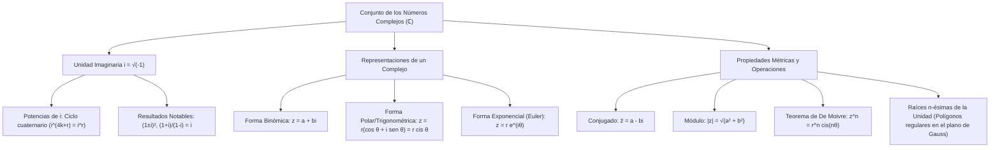

# ÁLGEBRA PREUNIVERSITARIA: CURSO COMPLETO Y SISTEMATIZADO
## EJE 02: MATEMÁTICA — ÁLGEBRA
### TEMA XI: NÚMEROS COMPLEJOS Y FORMAS BINÓMICA, TRIGONOMÉTRICA Y EXPONENCIAL

---

## 1. FICHA TÉCNICA Y MATRIZ DE COMPETENCIAS

| Parámetro | Detalle Institucional |
| :--- | :--- |
| **Resolución Oficial** | Resolución de Consejo Universitario N° 0028-2026 (Admisión UNSA 2027) |
| **Eje Curricular** | Eje 02: Matemática / Sistemas Numéricos Avanzados y Variable Compleja |
| **Peso Ponderado UNSA** | **Ingenierías:** 1.658337400 pts/preg (4 preg. = 6.63 pts) \| **Biomédicas:** 1.265447400 pts \| **Sociales:** 0.824574000 pts |
| **Frecuencia en Exámenes** | **Media / Alta (85%):** Muy frecuente en exámenes de área de Ingenierías y Biomédicas, evaluando potencias de $i$, módulos, conjugados y teorema de De Moivre. |
| **Modelos de Examen** | UNSA (Ordinario, CEPREUNSA), UNMSM (DECO de fasores y corriente alterna), UNI (Raíces enésimas de la unidad y geometría en el plano de Argand-Gauss). |
| **Competencia Cardinal** | Operar algebraicamente números complejos en forma binómica, polar y exponencial de Euler, dominando las propiedades del módulo, conjugado, argumento principal y la potenciación/radicación por el Teorema de De Moivre. |

---

## 2. MAPA TAXONÓMICO Y ONTOLOGÍA DE CONCEPTOS



---

## 3. DESARROLLO TEÓRICO FORMAL (ESTÁNDAR LUMBRERAS / CUZCANO / UNI)

### 3.1. Definición Formal y Unidad Imaginaria
El conjunto de los **números complejos ($\mathbb{C}$)** se define formalmente como el conjunto de pares ordenados de números reales $(a, b) \in \mathbb{R}^2$ dotados de las operaciones de adición y multiplicación:
$$(a, b) + (c, d) = (a + c, \ b + d)$$
$$(a, b) \cdot (c, d) = (ac - bd, \ ad + bc)$$

#### La Unidad Imaginaria ($i$):
Se define como el par ordenado $i = (0, 1)$, que verifica la propiedad fundamental:
$$i^2 = (0, 1) \cdot (0, 1) = (0 - 1, \ 0 + 0) = (-1, 0) \equiv -1$$
$$\mathbf{i = \sqrt{-1} \implies i^2 = -1}$$

#### Propiedad Cuaternaria de las Potencias de $i$:
Las potencias enteras de la unidad imaginaria se repiten en periodos de cuatro:
$$i^1 = i, \quad i^2 = -1, \quad i^3 = -i, \quad i^4 = 1$$
En general, para cualquier $k \in \mathbb{Z}$:
$$i^{4k} = 1, \quad i^{4k+1} = i, \quad i^{4k+2} = -1, \quad i^{4k+3} = -i$$
- **Teorema de la Suma Cuaternaria Consecutiva:**
  $$\sum_{j=1}^{4} i^j = i + i^2 + i^3 + i^4 = i - 1 - i + 1 = 0 \implies \sum_{j=k}^{k+3} i^j = 0$$

---

### 3.2. Forma Binómica (Cartesiana) y Clasificación
Todo número complejo $z$ se expresa como:
$$z = a + bi, \quad \text{con } a, b \in \mathbb{R}$$
- **Parte Real:** $\text{Re}(z) = a$
- **Parte Imaginaria:** $\text{Im}(z) = b$ (Nótese que $\text{Im}(z)$ es un número real, no incluye a la letra $i$).

#### Clasificación Canónica:
1. **Complejo Real o Real Puro:** Si su parte imaginaria es nula: $\text{Im}(z) = 0 \implies z = a$.
2. **Complejo Imaginario Puro:** Si su parte real es nula y su parte imaginaria no: $\text{Re}(z) = 0 \land \text{Im}(z) \neq 0 \implies z = bi$.
3. **Complejo Nulo:** Si ambas partes son simultáneamente cero: $z = 0 + 0i = 0$.

#### Complejos Asociados:
- **Conjugado de $z$ ($\bar{z}$):** Se invierte el signo de la parte imaginaria:
  $$\bar{z} = a - bi$$
- **Opuesto de $z$ ($z^*$ o $-z$):** Se invierten los signos de ambas partes:
  $$-z = -a - bi$$

---

### 3.3. Módulo de un Número Complejo
El módulo (o norma euclidiana) de $z = a + bi$, denotado por $|z|$ o $\rho$, representa la distancia geométrica desde el origen de coordenadas hasta el afijo del complejo en el plano de Argand-Gauss:

$$|z| = \sqrt{a^2 + b^2}, \quad \text{con } |z| \geq 0$$

#### Teoremas Fundamentales del Módulo:
1. $|z| = |\bar{z}| = |-z| = |-\bar{z}|$
2. $z \cdot \bar{z} = |z|^2 = a^2 + b^2$
3. $|z \cdot w| = |z| \cdot |w|$
4. $\left|\frac{z}{w}\right| = \frac{|z|}{|w|}, \quad (w \neq 0)$
5. $|z^n| = |z|^n, \quad \forall n \in \mathbb{Z}$
6. **Desigualdad Triangular:**
   $$||z| - |w|| \leq |z \pm w| \leq |z| + |w|$$

---

### 3.4. Resultados Notables de Examen de Admisión
$$\frac{1 + i}{1 - i} = i, \qquad \frac{1 - i}{1 + i} = -i$$
$$(1 + i)^2 = 2i, \qquad (1 - i)^2 = -2i$$
$$(1 + i)^4 = -4, \qquad (1 - i)^4 = -4$$
$$\frac{1}{i} = -i$$

---

### 3.5. Forma Polar (Trigonométrica) y Teorema de De Moivre
Todo complejo no nulo $z = a + bi$ puede ubicarse en el plano complejo mediante coordenadas polares $(r, \theta)$:

$$z = r(\cos \theta + i \sin \theta) = r \text{ cis } \theta$$
Donde:
- **Módulo:** $r = |z| = \sqrt{a^2 + b^2}$.
- **Argumento Principal ($\text{Arg}(z)$):** Es el ángulo medido en sentido antihorario desde el semieje real positivo hasta el vector posición, restringido al intervalo:
  $$\theta \in \langle -\pi, \ \pi] \quad \text{o} \quad [0, \ 2\pi\rangle$$
  $$\tan \theta = \frac{b}{a}$$ *(tomando en cuenta el cuadrante del afijo $(a, b)$)*.

#### Teorema de Abraham De Moivre:
Para cualquier exponente entero $n \in \mathbb{Z}$:
$$z^n = [r \text{ cis } \theta]^n = r^n [\cos(n\theta) + i \sin(n\theta)] = r^n \text{ cis}(n\theta)$$

#### Forma Exponencial de Leonhard Euler:
$$e^{i\theta} = \cos \theta + i \sin \theta \implies z = r e^{i\theta}$$
- **Identidad de Euler (la fórmula más bella de las matemáticas):**
  $$e^{i\pi} + 1 = 0$$

---

## 4. FORMULARIO MAESTRO (LATEX ESTRICTO)

| Propiedad / Teorema | Fórmula Matemática | Dominio / Aplicación |
| :--- | :--- | :--- |
| **Unidad Imaginaria** | $i^2 = -1, \quad i^3 = -i, \quad i^4 = 1$ | Ciclo periodo 4 |
| **Potencia de $i$** | $i^{4k + r} = i^r$ | $r \in \{0, 1, 2, 3\}$ |
| **Módulo** | $\|z\| = \sqrt{a^2 + b^2}$ | Distancia al origen en Argand |
| **Identidad Métrica** | $z \cdot \bar{z} = \|z\|^2$ | Racionalización de complejos |
| **Cociente Notable** | $\frac{1+i}{1-i} = i \quad \land \quad \frac{1-i}{1+i} = -i$ | Simplificaciones instantáneas |
| **Cuadrados Notables** | $(1 \pm i)^2 = \pm 2i$ | Reducción de potencias altas |
| **Producto Polar** | $r_1 \text{ cis}(\theta_1) \cdot r_2 \text{ cis}(\theta_2) = r_1 r_2 \text{ cis}(\theta_1 + \theta_2)$ | Multiplicación angular |
| **Cociente Polar** | $\frac{r_1 \text{ cis}(\theta_1)}{r_2 \text{ cis}(\theta_2)} = \frac{r_1}{r_2} \text{ cis}(\theta_1 - \theta_2)$ | División angular |
| **De Moivre** | $z^n = r^n \text{ cis}(n\theta)$ | Potenciación trigonométrica |
| **Euler** | $e^{i\theta} = \cos \theta + i \sin \theta$ | Notación exponencial compacta |

---

## 5. MNEMOTECNIAS DE COMBATE PREUNIVERSITARIO

### 1. La Flecha Cuaternaria de Potencias de $i$
> **"Uno, $i$, Menos Uno, Menos $i$" (1, $i$, -1, -$i$)**
- Divide el exponente entre 4 y quédate únicamente con el **residuo**:
  - Residuo 0 $\to 1$
  - Residuo 1 $\to i$
  - Residuo 2 $\to -1$
  - Residuo 3 $\to -i$
- *Ejemplo relámpago:* $i^{2027} = i^{4(506) + 3} = i^3 = -i$.

### 2. Multiplicación y División Polar: "Los Módulos se Operan, los Ángulos se Suman o Restan"
- Si multiplicas: multiplicas los radios y **sumas** los ángulos.
- Si divides: divides los radios y **restas** los ángulos.

---

## 6. TÉCNICAS Y ARTIFICIOS DE CÁLCULO (HACKING PREUNIVERSITARIO)

### Artificio 1: Reducción de Potencias Altas de Binomios Complejos
Si te piden calcular $(1 + i)^{40}$:
**¡Jamás uses el binomio de Newton con 41 términos!**
**Hack:** Eleva primero al cuadrado usando la identidad notable $(1 + i)^2 = 2i$:
$$(1 + i)^{40} = \left[(1 + i)^2\right]^{20} = (2i)^{20} = 2^{20} \cdot i^{20}$$
Como $20$ es múltiplo de $4$, $i^{20} = 1$:
$$(1 + i)^{40} = 2^{20} \cdot 1 = 2^{20} = 1\ 048\ 576$$
¡Resuelto en 5 segundos!

### Artificio 2: El Módulo de un Producto o Cociente Monstruoso
Si te piden hallar el módulo de:
$$Z = \frac{(3 + 4i)^4 \cdot (5 - 12i)^2}{(1 + i)^6 \cdot (\sqrt{3} + i)^8}$$
**¡No multipliques los números complejos!**
**Hack:** Aplica la propiedad de distribución del módulo:
$$|Z| = \frac{|3 + 4i|^4 \cdot |5 - 12i|^2}{|1 + i|^6 \cdot |\sqrt{3} + i|^8}$$
Calculas cada módulo pitagórico elemental:
- $|3 + 4i| = \sqrt{3^2 + 4^2} = 5$
- $|5 - 12i| = \sqrt{5^2 + 12^2} = 13$
- $|1 + i| = \sqrt{1^2 + 1^2} = \sqrt{2}$
- $|\sqrt{3} + i| = \sqrt{3 + 1} = 2$
Sustituyes:
$$|Z| = \frac{5^4 \cdot 13^2}{(\sqrt{2})^6 \cdot 2^8} = \frac{625 \cdot 169}{2^3 \cdot 256} = \frac{105\ 625}{2048}$$

---

## 7. ZONA DE TRAMPAS Y DISTRACTORES ("¡PELIGRO EXAMEN!")

> [!WARNING]
> **Trampa 1: El Falso Producto de Radicales Negativos**
> En los reales se cumple que $\sqrt{a} \cdot \sqrt{b} = \sqrt{ab}$ para $a, b \geq 0$.
> Pero si calculas $\sqrt{-4} \cdot \sqrt{-9}$:
> **El error mortal del postulante:** $\sqrt{(-4)(-9)} = \sqrt{36} = 6$. **¡FATAL ERROR!**
> La regla estricta exige extraer primero la unidad imaginaria $i$:
> $$\sqrt{-4} \cdot \sqrt{-9} = (2i) \cdot (3i) = 6 i^2 = 6(-1) = -6$$

> [!CAUTION]
> **Trampa 2: La Parte Imaginaria NO Incluye la Letra $i$**
> Si $z = 7 - 9i$:
> ¿Cuánto vale $\text{Im}(z)$?
> El distractor clásico en las claves de la UNSA es $-9i$.
> **La respuesta correcta es:** $\text{Im}(z) = -9$. Es un número puramente real.

---

## 8. APLICACIÓN AL MUNDO REAL Y CONTEXTO DECO

### Análisis Fasorial en Sistemas de Potencia Eléctrica en la Central Hidroeléctrica de Charcani V
En la central subterránea de Charcani V (ubicada en las faldas del Misti a orillas del río Chili en Arequipa), los ingenieros electricistas analizan el flujo de potencia alterna trifásica mediante fasores complejos. El voltaje se modela como $V = |V| e^{i\theta}$ y la impedancia de las líneas como $Z = R + iX_L$, donde la resistencia $R$ disipa energía térmica y la reactancia inductiva $X_L$ almacena campo magnético. La multiplicación y división de números complejos en forma polar es la herramienta matemática que permite calcular la potencia reactiva en volt-amperios reactivos (VAR) y evitar caídas de tensión en el alumbrado público de la ciudad blanca.

---

## 9. BANCO DE 5 EJERCICIOS RESUELTOS GRADUADOS

### Ejercicio 1: Nivel Básico (Potencias de la Unidad Imaginaria)
**Enunciado:**
Calcule el valor simplificado de la expresión:
$$E = i^{124} + i^{345} - i^{518} + i^{771}$$

**Solución paso a paso:**
1. Analizamos cada exponente según el criterio de divisibilidad entre 4 (módulo 4):
   - $124$: Sus dos últimas cifras son $24$ (múltiplo de 4) $\implies 124 = \mathring{4} \implies i^{124} = 1$.
   - $345$: $45 = 44 + 1 = \mathring{4} + 1 \implies i^{345} = i^1 = i$.
   - $518$: $18 = 16 + 2 = \mathring{4} + 2 \implies i^{518} = i^2 = -1$.
   - $771$: $71 = 68 + 3 = \mathring{4} + 3 \implies i^{771} = i^3 = -i$.
2. Sustituimos los valores calculados en la expresión $E$:
   $$E = (1) + (i) - (-1) + (-i)$$
3. Operamos algebraicamente:
   $$E = 1 + i + 1 - i = 2$$

**Respuesta Final:** El valor de la expresión es $\mathbf{2}$.

---

### Ejercicio 2: Nivel Intermedio (División y Complejo Real Puro)
**Enunciado:**
Si el número complejo:
$$z = \frac{a + 2i}{3 - 4i}$$
es un **complejo real puro**, determine el valor numérico del parámetro real $a$.

**Solución paso a paso:**
1. Multiplicamos el numerador y el denominador por el conjugado del denominador ($3 + 4i$):
   $$z = \frac{(a + 2i)(3 + 4i)}{(3 - 4i)(3 + 4i)}$$
2. Desarrollamos el denominador utilizando la identidad métrica $z \cdot \bar{z} = a^2 + b^2$:
   $$(3 - 4i)(3 + 4i) = 3^2 + 4^2 = 9 + 16 = 25$$
3. Desarrollamos el numerador mediante distribución:
   $$(a + 2i)(3 + 4i) = 3a + 4ai + 6i + 8i^2 = 3a + (4a + 6)i + 8(-1)$$
   $$= (3a - 8) + (4a + 6)i$$
4. Escribimos el complejo en su forma canónica separando parte real e imaginaria:
   $$z = \frac{3a - 8}{25} + \frac{4a + 6}{25} i$$
5. Por condición del problema, $z$ es un **complejo real puro**, lo que exige que su parte imaginaria sea idénticamente cero:
   $$\text{Im}(z) = \frac{4a + 6}{25} = 0$$
   $$4a + 6 = 0 \implies 4a = -6 \implies a = -\frac{6}{4} = -\frac{3}{2}$$

**Respuesta Final:** El valor de $a$ es $\mathbf{-\frac{3}{2}}$.

---

### Ejercicio 3: Nivel Avanzado - UNSA Ordinario (Módulo de una Ecuación Compleja)
**Enunciado:**
Sea $z$ un número complejo que satisface la ecuación:
$$|z| + z = 8 + 4i$$
Determine el valor del módulo de $z$ ($|z|$) y halle $\text{Re}(z) + \text{Im}(z)$.

**Solución paso a paso:**
1. Sea la forma binómica del complejo $z = x + yi$, donde $x, y \in \mathbb{R}$.
2. Su módulo es un número real no negativo: $|z| = \sqrt{x^2 + y^2}$.
3. Sustituimos en la ecuación dada:
   $$\sqrt{x^2 + y^2} + (x + yi) = 8 + 4i$$
4. Agrupamos la parte real y la parte imaginaria en el primer miembro:
   $$\left(\sqrt{x^2 + y^2} + x\right) + yi = 8 + 4i$$
5. Igualamos componentes reales e imaginarias:
   - Para la parte imaginaria:
     $$y = 4$$
   - Para la parte real:
     $$\sqrt{x^2 + y^2} + x = 8 \implies \sqrt{x^2 + y^2} = 8 - x \quad \text{--- (Ec. 1)}$$
6. Sustituimos $y = 4$ en (Ec. 1):
   $$\sqrt{x^2 + 4^2} = 8 - x \implies \sqrt{x^2 + 16} = 8 - x$$
7. Elevamos al cuadrado ambos miembros (con la condición $8 - x \geq 0 \implies x \leq 8$):
   $$x^2 + 16 = (8 - x)^2$$
   $$x^2 + 16 = 64 - 16x + x^2$$
8. Cancelamos $x^2$:
   $$16 = 64 - 16x \implies 16x = 64 - 16 = 48 \implies x = 3$$
9. Como $x = 3 \leq 8$, la solución es perfectamente válida.
10. Calculamos el complejo y su módulo:
    $$z = 3 + 4i \implies |z| = \sqrt{3^2 + 4^2} = 5$$
11. Calculamos la suma solicitada:
    $$\text{Re}(z) + \text{Im}(z) = 3 + 4 = 7$$

**Respuesta Final:** El módulo es $\mathbf{|z| = 5}$ y la suma es $\mathbf{7}$.

---

### Ejercicio 4: Nivel San Marcos DECO (Impedancia y Fasores en Circuitos)
**Enunciado:**
En un circuito de comunicaciones en Arequipa, dos fuentes de voltaje alterno conectadas en serie generan caídas de potencial expresadas en voltios por los fasores complejos $V_1 = 12\left(\cos \frac{\pi}{6} + i \sin \frac{\pi}{6}\right)$ y $V_2 = 5\left(\cos \frac{\pi}{6} + i \sin \frac{\pi}{6}\right)$. Si se conecta una impedancia de carga $Z_L = 1 + i\sqrt{3}$ ohmios, determine el módulo de la corriente total fasorial $I = \frac{V_1 + V_2}{Z_L}$.

**Solución paso a paso:**
1. Calculamos el voltaje total en serie sumando los fasores $V_1$ y $V_2$:
   Como ambos voltajes tienen el mismo ángulo de fase $\theta = \frac{\pi}{6}$ (están en fase):
   $$V_{\text{total}} = V_1 + V_2 = (12 + 5)\left(\cos \frac{\pi}{6} + i \sin \frac{\pi}{6}\right) = 17 \text{ cis}\left(\frac{\pi}{6}\right)$$
2. El módulo del voltaje total es simplemente:
   $$|V_{\text{total}}| = 17 \text{ voltios}$$
3. Calculamos el módulo de la impedancia de carga $Z_L = 1 + i\sqrt{3}$:
   $$|Z_L| = \sqrt{1^2 + (\sqrt{3})^2} = \sqrt{1 + 3} = \sqrt{4} = 2 \text{ ohmios}$$
4. Por la ley de Ohm para fasores, el módulo de la corriente eléctrica es el cociente de los módulos:
   $$|I| = \left|\frac{V_{\text{total}}}{Z_L}\right| = \frac{|V_{\text{total}}|}{|Z_L|} = \frac{17}{2} = 8.5 \text{ amperios}$$

**Respuesta Final:** El módulo de la corriente total es $\mathbf{8.5}$ A (o $\mathbf{\frac{17}{2}}$ A).

---

### Ejercicio 5: Nivel Boss Challenge - Estilo UNI (Teorema de De Moivre y Raíces Cúbicas)
**Enunciado:**
Determine el valor numérico exacto de la expresión:
$$K = \left(-\frac{1}{2} + \frac{\sqrt{3}}{2}i\right)^{99} + \left(-\frac{1}{2} - \frac{\sqrt{3}}{2}i\right)^{99}$$

**Solución paso a paso:**
1. Reconocemos en los términos las **raíces cúbicas complejas de la unidad** (denotadas clásicamente por $w$ y $w^2$):
   Sea $z_1 = -\frac{1}{2} + \frac{\sqrt{3}}{2}i$.
2. Convertimos $z_1$ a su **forma polar**:
   - Módulo:
     $$r = \sqrt{\left(-\frac{1}{2}\right)^2 + \left(\frac{\sqrt{3}}{2}\right)^2} = \sqrt{\frac{1}{4} + \frac{3}{4}} = \sqrt{1} = 1$$
   - Argumento principal $\theta$:
     Como $\text{Re}(z_1) = -\frac{1}{2} < 0$ y $\text{Im}(z_1) = \frac{\sqrt{3}}{2} > 0$, el afijo se encuentra en el **Segundo Cuadrante**:
     $$\theta = \pi - \frac{\pi}{3} = \frac{2\pi}{3} = 120^\circ$$
   - Por tanto:
     $$z_1 = \cos\left(\frac{2\pi}{3}\right) + i \sin\left(\frac{2\pi}{3}\right) = \text{cis}\left(\frac{2\pi}{3}\right)$$
3. Aplicamos el **Teorema de Abraham De Moivre** para calcular $z_1^{99}$:
   $$z_1^{99} = \left[\text{cis}\left(\frac{2\pi}{3}\right)\right]^{99} = \text{cis}\left(99 \cdot \frac{2\pi}{3}\right)$$
   $$= \text{cis}(33 \cdot 2\pi) = \text{cis}(66\pi)$$
4. Como $66\pi$ es un múltiplo entero par de $\pi$ ($66\pi = 33 \cdot 2\pi$), es congruente con $0$:
   $$\text{cis}(66\pi) = \cos(66\pi) + i \sin(66\pi) = 1 + 0i = 1$$
5. Ahora calculamos el segundo término:
   $$z_2 = -\frac{1}{2} - \frac{\sqrt{3}}{2}i = \bar{z_1}$$
   Por propiedades de conjugación y potenciación:
   $$z_2^{99} = (\bar{z_1})^{99} = \overline{z_1^{99}} = \bar{1} = 1$$
6. Sumamos ambos resultados:
   $$K = z_1^{99} + z_2^{99} = 1 + 1 = 2$$

**Respuesta Final:** El valor de la expresión es $\mathbf{2}$.

---

## 10. GLOSARIO DE 10 TÉRMINOS CLAVE

1. **Número Complejo:** Par ordenado de números reales $(a, b)$ expresado canónicamente como $a + bi$.
2. **Unidad Imaginaria ($i$):** Elemento que satisface $i^2 = -1$.
3. **Parte Real ($\text{Re}$):** Componente escalar $a$ en la expresión $z = a + bi$.
4. **Parte Imaginaria ($\text{Im}$):** Coeficiente escalar real $b$ que acompaña a la unidad imaginaria en $z = a + bi$.
5. **Conjugado ($\bar{z}$):** Complejo simétrico respecto al eje real obtenido cambiando de signo la parte imaginaria ($a - bi$).
6. **Módulo ($|z|$):** Longitud o magnitud euclidiana del vector posicional en el plano complejo ($\sqrt{a^2 + b^2}$).
7. **Argumento Principal:** Ángulo medido en radianes desde el semieje real positivo comprendido en $\langle -\pi, \pi]$.
8. **Plano de Argand-Gauss:** Plano cartesiano donde el eje horizontal es el eje real y el vertical es el eje imaginario.
9. **Teorema de De Moivre:** Regla trigonométrica que simplifica la potenciación y radicación angular de números complejos.
10. **Identidad de Euler:** Expresión que unifica las funciones trigonométricas con la base exponencial natural ($e^{i\theta} = \cos\theta + i\sin\theta$).

---

## 11. BANCO DE FLASHCARDS (ANVERSO / REVERSO)

- **Flashcard 1:**
  - *Anverso:* ¿Cuál es el ciclo periódico de las potencias enteras de la unidad imaginaria $i$?
  - *Reverso:* Periodo de cuatro: $i^1 = i, \ i^2 = -1, \ i^3 = -i, \ i^4 = 1$.
- **Flashcard 2:**
  - *Anverso:* ¿A qué equivale simplificada la fracción compleja $\frac{1 + i}{1 - i}$?
  - *Reverso:* Equivale exactamente a $i$.
- **Flashcard 3:**
  - *Anverso:* ¿Qué resultado se obtiene al multiplicar un número complejo por su conjugado ($z \cdot \bar{z}$)?
  - *Reverso:* El cuadrado de su módulo: $|z|^2 = a^2 + b^2$.
- **Flashcard 4:**
  - *Anverso:* ¿Cómo se multiplican dos números complejos dados en forma polar?
  - *Reverso:* Se multiplican sus módulos y se suman sus argumentos: $r_1 r_2 \text{ cis}(\theta_1 + \theta_2)$.
- **Flashcard 5:**
  - *Anverso:* ¿Qué valor tiene $(1 + i)^2$ y $(1 - i)^2$?
  - *Reverso:* $(1 + i)^2 = 2i$ y $(1 - i)^2 = -2i$.

---

## 12. MOTOR DE GAMIFICACIÓN (JSON PARA KOTLIN MULTIPLATFORM)

```json
{
  "topicId": "alg_11_numeros_complejos",
  "title": "Números Complejos y Formas Binómica, Trigonométrica y Exponencial",
  "subject": "algebra",
  "xpReward": 420,
  "level": "ADVANCED",
  "badges": [
    {
      "id": "euler_initiate",
      "name": "Heredero de Euler",
      "description": "Dominaste la unidad imaginaria y el plano de Gauss resolviendo potencias sin esfuerzo."
    }
  ],
  "questions": [
    {
      "id": "q1",
      "statement": "¿Cuál es el valor simplificado de (1 - i)^4?",
      "options": ["-4", "4", "4i", "-4i"],
      "correctIndex": 0,
      "explanation": "(1 - i)^4 = [(1 - i)^2]^2 = (-2i)^2 = 4(i^2) = 4(-1) = -4."
    },
    {
      "id": "q2",
      "statement": "¿Cuál es el módulo del número complejo z = 6 - 8i?",
      "options": ["14", "10", "48", "2"],
      "correctIndex": 1,
      "explanation": "|z| = sqrt(6^2 + (-8)^2) = sqrt(36 + 64) = sqrt(100) = 10."
    }
  ]
}
```
