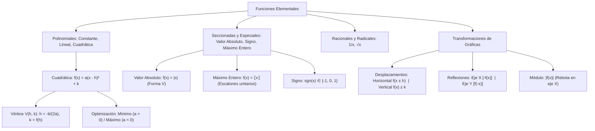

# ÁLGEBRA PREUNIVERSITARIA: CURSO COMPLETO Y SISTEMATIZADO
## EJE 02: MATEMÁTICA — ÁLGEBRA
### TEMA XIII: FUNCIONES ELEMENTALES, GRÁFICAS Y TRANSFORMACIONES

---

## 1. FICHA TÉCNICA Y MATRIZ DE COMPETENCIAS

| Parámetro | Detalle Institucional |
| :--- | :--- |
| **Resolución Oficial** | Resolución de Consejo Universitario N° 0028-2026 (Admisión UNSA 2027) |
| **Eje Curricular** | Eje 02: Matemática / Geometría Analítica de Funciones y Optimización |
| **Peso Ponderado UNSA** | **Ingenierías:** 1.658337400 pts/preg (4 preg. = 6.63 pts) \| **Biomédicas:** 1.265447400 pts \| **Sociales:** 0.824574000 pts |
| **Frecuencia en Exámenes** | **Crítica / Obligatoria (96%):** Aparece como optimización de parábolas (máximo ingreso / mínima pérdida), gráficas con valor absoluto y traslaciones rígidas. |
| **Modelos de Examen** | UNSA (Ordinario, CEPREUNSA), UNMSM (DECO de trayectorias y modelos de costos cuadráticos), UNI (Máximo entero, signo y transformaciones múltiples). |
| **Competencia Cardinal** | Graficar con precisión las funciones elementales (constante, lineal, cuadrática, raíz cuadrada, valor absoluto, máximo entero), calcular vértices analíticos y modelar traslaciones, compresiones y reflexiones geométricas en el plano cartesiano. |

---

## 2. MAPA TAXONÓMICO Y ONTOLOGÍA DE CONCEPTOS



---

## 3. DESARROLLO TEÓRICO FORMAL (ESTÁNDAR LUMBRERAS / CUZCANO / UNI)

### 3.1. Funciones Polinomiales Básicas

#### 1. Función Constante:
$$f(x) = c, \quad c \in \mathbb{R}$$
- $\text{Dom}(f) = \mathbb{R}, \quad \text{Ran}(f) = \{c\}$
- Su gráfica es una recta horizontal paralela al eje $X$ con pendiente $m = 0$.

#### 2. Función Identidad:
$$f(x) = x$$
- $\text{Dom}(f) = \mathbb{R}, \quad \text{Ran}(f) = \mathbb{R}$
- Su gráfica es la bisectriz del primer y tercer cuadrante (recta a $45^\circ$, pendiente $m = 1$).

#### 3. Función Lineal (Afín):
$$f(x) = mx + b, \quad m \neq 0$$
- $\text{Dom}(f) = \mathbb{R}, \quad \text{Ran}(f) = \mathbb{R}$
- $m$: pendiente ($\tan \theta$). Si $m > 0$ es creciente; si $m < 0$ es decreciente.
- $b$: ordenada al origen (corte con el eje $Y$ en $(0, b)$).
- Corte con el eje $X$ en $(-b/m, 0)$.

---

### 3.2. Función Cuadrática y Optimización Analítica
$$f(x) = ax^2 + bx + c, \quad a \neq 0$$
- $\text{Dom}(f) = \mathbb{R}$
- Su gráfica es una **parábola** con eje de simetría vertical $x = h$.

#### Forma Canónica del Vértice:
$$f(x) = a(x - h)^2 + k$$
Donde las coordenadas del vértice $V(h, k)$ son:
$$h = -\frac{b}{2a}, \qquad k = f(h) = c - \frac{b^2}{4a} = \frac{4ac - b^2}{4a}$$

#### Concavidad y Rango (Optimización):
1. **Si $a > 0$:** La parábola se abre hacia **arriba** ($\bigcup$).
   - Posee un **MÍNIMO ABSOLUTO** en el vértice: $y_{\min} = k$.
   - $\text{Ran}(f) = [k, \ +\infty\rangle$.
2. **Si $a < 0$:** La parábola se abre hacia **abajo** ($\bigcap$).
   - Posee un **MÁXIMO ABSOLUTO** en el vértice: $y_{\max} = k$.
   - $\text{Ran}(f) = \langle -\infty, \ k]$.

---

### 3.3. Funciones Especiales con Discontinuidades o Esquinas

#### 1. Función Valor Absoluto:
$$f(x) = |x| = \begin{cases} x, & \text{si } x \geq 0 \\ -x, & \text{si } x < 0 \end{cases}$$
- $\text{Dom}(f) = \mathbb{R}, \quad \text{Ran}(f) = [0, \ +\infty\rangle$
- Su gráfica es una "V" con vértice en el origen $(0, 0)$.
- Forma trasladada: $f(x) = a|x - h| + k$, con vértice en $V(h, k)$.

#### 2. Función Raíz Cuadrada:
$$f(x) = \sqrt{x}$$
- $\text{Dom}(f) = [0, \ +\infty\rangle, \quad \text{Ran}(f) = [0, \ +\infty\rangle$
- Gráfica: semiparábola horizontal que parte desde el origen $(0, 0)$.

#### 3. Función Inverso Proporcional:
$$f(x) = \frac{1}{x}$$
- $\text{Dom}(f) = \mathbb{R} \setminus \{0\}, \quad \text{Ran}(f) = \mathbb{R} \setminus \{0\}$
- Gráfica: hipérbola equilátera con asíntota vertical en $x = 0$ y horizontal en $y = 0$.

#### 4. Función Signo ($\text{sgn}(x)$):
$$\text{sgn}(x) = \begin{cases} 1, & \text{si } x > 0 \\ 0, & \text{si } x = 0 \\ -1, & \text{si } x < 0 \end{cases}$$
- $\text{Dom}(\text{sgn}) = \mathbb{R}, \quad \text{Ran}(\text{sgn}) = \{-1, 0, 1\}$.

#### 5. Función Máximo Entero ($\llbracket x \rrbracket$ o $\lfloor x \rfloor$):
Asigna a cada número real el mayor entero menor o igual que él:
$$\llbracket x \rrbracket = k \iff k \leq x < k + 1, \quad k \in \mathbb{Z}$$
- $\text{Dom}(f) = \mathbb{R}, \quad \text{Ran}(f) = \mathbb{Z}$
- Gráfica: función escalonada con escalones semiabiertos $[k, k+1\rangle$ de longitud 1.
- *Propiedad de traslación entera:* $\llbracket x + m \rrbracket = \llbracket x \rrbracket + m \iff m \in \mathbb{Z}$.

---

### 3.4. Álgebra de Transformaciones Geométricas de Gráficas

Sea $y = f(x)$ una gráfica conocida en el plano cartesiano y $c > 0$:

| Transformación | Ecuación | Efecto Geométrico en el Plano |
| :--- | :--- | :--- |
| **Desplazamiento Vertical** | $y = f(x) + c$ | Se desplaza $c$ unidades hacia **arriba**. |
| **Desplazamiento Vertical** | $y = f(x) - c$ | Se desplaza $c$ unidades hacia **abajo**. |
| **Desplazamiento Horizontal** | $y = f(x - c)$ | Se desplaza $c$ unidades hacia la **derecha** ($X$). |
| **Desplazamiento Horizontal** | $y = f(x + c)$ | Se desplaza $c$ unidades hacia la **izquierda** ($X$). |
| **Reflexión sobre el eje X** | $y = -f(x)$ | Voltea la gráfica de arriba a abajo (espejo horizontal). |
| **Reflexión sobre el eje Y** | $y = f(-x)$ | Voltea la gráfica de izquierda a derecha (espejo vertical). |
| **Valor Absoluto Global** | $y = |f(x)|$ | Toda la porción que está debajo del eje $X$ se refleja hacia arriba. |
| **Valor Absoluto Local** | $y = f(|x|)$ | Se borra la parte izquierda ($x < 0$) y se refleja la derecha como espejo simétrico par. |

---

## 4. FORMULARIO MAESTRO (LATEX ESTRICTO)

| Función / Operación | Regla Analítica | Dominio / Rango |
| :--- | :--- | :--- |
| **Vértice de Parábola** | $h = -\frac{b}{2a}, \quad k = f(h)$ | $V(h, k)$ |
| **Rango Parábola ($a > 0$)** | $\text{Ran}(f) = [k, \ +\infty\rangle$ | Mínimo en $y = k$ |
| **Rango Parábola ($a < 0$)** | $\text{Ran}(f) = \langle -\infty, \ k]$ | Máximo en $y = k$ |
| **Máximo Entero** | $\llbracket x \rrbracket = k \iff k \leq x < k + 1$ | $k \in \mathbb{Z}, \ \text{Ran} = \mathbb{Z}$ |
| **Propiedad Entera** | $\llbracket x + n \rrbracket = \llbracket x \rrbracket + n$ | $n \in \mathbb{Z}$ |
| **Valor Absoluto Vértice** | $f(x) = a\|x - h\| + k$ | Vértice en $(h, k)$ |
| **Traslación Rígida** | $g(x) = f(x - h) + k$ | Centro trasladado a $(h, k)$ |

---

## 5. MNEMOTECNIAS DE COMBATE PREUNIVERSITARIO

### 1. El Signo del Desplazamiento Horizontal: "Al revés del mundo"
- En $f(x \mathbf{-} 3)$, el postulante cree que se va a la izquierda por el menos.
> **"Lo que está DENTRO del paréntesis va AL REVÉS: si dice MENOS, camina a la DERECHA (+); si dice MÁS, camina a la IZQUIERDA (-)."**
- En cambio, lo que está FUERA ($f(x) \pm k$) va directo al grano: si suma sube, si resta baja.

### 2. Concavidad de la Parábola: "La Sonrisa Cuadrática"
- Si $a > 0$ (positivo, alegre) $\implies$ Parábola sonriente ($\bigcup$, abre arriba $\to$ tiene un fondo/mínimo).
- Si $a < 0$ (negativo, triste) $\implies$ Parábola fruncida ($\bigcap$, abre abajo $\to$ tiene una cima/máximo).

---

## 6. TÉCNICAS Y ARTIFICIOS DE CÁLCULO (HACKING PREUNIVERSITARIO)

### Artificio 1: Optimización Cuadrática Instantánea sin Derivadas
Si te dan un problema DECO de ganancias: $G(x) = -2x^2 + 80x - 300$:
**¡No derives ni completes cuadrados con tres líneas de fracciones!**
**Hack:** El óptimo ocurre exactamente en el punto medio del vértice:
$$x_{\text{óptimo}} = -\frac{b}{2a} = -\frac{80}{2(-2)} = \frac{80}{4} = 20$$
La ganancia máxima es simplemente evaluar en $20$:
$$G(20) = -2(20)^2 + 80(20) - 300 = -800 + 1600 - 300 = 500 \text{ soles}$$
¡Resuelto en 10 segundos!

### Artificio 2: Graficación Rápida de Módulo Global $y = |f(x)|$
Cuando tengas que graficar $y = |x^2 - 4|$:
1. Grafica la parábola normal $y = x^2 - 4$ (vértice en $(0, -4)$, pasa por $-2$ y $2$).
2. Todo lo que está por debajo del eje $X$ (el arco entre $-2$ y $2$ con vértice en $-4$) **lo volteas como un espejo hacia arriba**: el vértice salta a $(0, +4)$.
3. La forma final es una "W" apoyada sobre el eje $X$.

---

## 7. ZONA DE TRAMPAS Y DISTRACTORES ("¡PELIGRO EXAMEN!")

> [!WARNING]
> **Trampa 1: El Máximo Entero de Números Negativos**
> ¿Cuánto vale $\llbracket -3.2 \rrbracket$?
> El estudiante novato responde $-3$. **¡ERROR GARRAFAL!**
> Recuerda la definición: es el entero **MENOR O IGUAL**. En la recta numérica, a la izquierda de $-3.2$ está $-4$:
> $$\llbracket -3.2 \rrbracket = -4$$
> ¡Solo para números positivos se trunca la parte decimal!

> [!CAUTION]
> **Trampa 2: La Raíz Cuadrada NO Produce Gráfica Arriba y Abajo**
> Si te piden graficar $y = \sqrt{x}$, muchos dibujan la parábola horizontal completa (con rama superior e inferior).
> **Eso viola el principio de función:** una recta vertical la cortaría dos veces. El radical con signo positivo implícito $\sqrt{x}$ solo abarca la rama **superior no negativa** ($y \geq 0$).

---

## 8. APLICACIÓN AL MUNDO REAL Y CONTEXTO DECO

### Optimización del Rendimiento Fotovoltaico en las Plantas Solares de La Joya
En los parques solares fotovoltaicos del desierto de La Joya (Arequipa), la potencia eléctrica neta suministrada a la red $P(\theta)$ varía en función del ángulo cenital de incidencia solar $\theta$ según una función cuadrática de pérdidas térmicas:
$$P(\theta) = -1.5\theta^2 + 180\theta - 2400 \quad (\text{en kilowatts})$$
La determinación analítica del vértice de la parábola mediante $h = -b/(2a)$ permite a los controladores electrónicos de los seguidores solares orientar los paneles con precisión de fracciones de grado a la hora del cénit solar para alcanzar la máxima transferencia de potencia sin sobrecalentar los inversores trifásicos.

---

## 9. BANCO DE 5 EJERCICIOS RESUELTOS GRADUADOS

### Ejercicio 1: Nivel Básico (Vértice y Rango de Parábola)
**Enunciado:**
Dada la función cuadrática:
$$f(x) = 2x^2 - 8x + 11$$
Determine las coordenadas de su vértice $V(h, k)$ y especifique su rango analítico.

**Solución paso a paso:**
1. Identificamos los coeficientes:
   $$a = 2, \quad b = -8, \quad c = 11$$
2. Calculamos la abscisa del vértice ($h$):
   $$h = -\frac{b}{2a} = -\frac{-8}{2(2)} = \frac{8}{4} = 2$$
3. Calculamos la ordenada del vértice ($k$) evaluando $f(h)$:
   $$k = f(2) = 2(2)^2 - 8(2) + 11 = 2(4) - 16 + 11 = 8 - 16 + 11 = 3$$
4. Por tanto, el vértice es $V(2, 3)$.
5. Como el coeficiente principal es $a = 2 > 0$, la parábola se abre hacia arriba y presenta un **mínimo** en $y = 3$.
6. El rango de la función es:
   $$\text{Ran}(f) = [3, \ +\infty\rangle$$

**Respuesta Final:** El vértice es $\mathbf{V(2, 3)}$ y el rango es $\mathbf{[3, \ +\infty\rangle}$.

---

### Ejercicio 2: Nivel Intermedio (Función Valor Absoluto Trasladada)
**Enunciado:**
Halle el área de la región triangular encerrada por la gráfica de la función $f(x) = 6 - |2x - 4|$ y el eje de las abscisas ($X$).

**Solución paso a paso:**
1. Reescribimos la función factorizando el 2 dentro del valor absoluto:
   $$f(x) = 6 - 2|x - 2|$$
2. Hallamos el vértice de la "V" invertida:
   $$|x - 2| = 0 \implies x = 2$$
   $$y_v = 6 - 2(0) = 6 \implies V(2, \ 6)$$
3. Hallamos los puntos de intersección con el eje $X$ ($f(x) = 0$):
   $$6 - 2|x - 2| = 0 \implies 2|x - 2| = 6 \implies |x - 2| = 3$$
   - Caso 1: $x - 2 = 3 \implies x_1 = 5$
   - Caso 2: $x - 2 = -3 \implies x_2 = -1$
4. Los puntos de corte en el eje horizontal son $A(-1, 0)$ y $B(5, 0)$.
5. Calculamos las dimensiones del triángulo formado:
   - **Base ($b$):** Distancia entre los cortes en $X$:
     $$b = 5 - (-1) = 6 \text{ unidades}$$
   - **Altura ($h$):** Ordenada del vértice:
     $$h = 6 \text{ unidades}$$
6. Calculamos el área del triángulo:
   $$\text{Área} = \frac{b \cdot h}{2} = \frac{6 \cdot 6}{2} = 18 \text{ u}^2$$

**Respuesta Final:** El área encerrada es de $\mathbf{18 \text{ u}^2}$.

---

### Ejercicio 3: Nivel Avanzado - UNSA Ordinario (Ecuación con Máximo Entero)
**Enunciado:**
Resuelva la ecuación que involucra la función máximo entero:
$$\llbracket 2x - 3 \rrbracket = 5$$
e indique la suma del menor y mayor valor entero que puede tomar la expresión $4x$.

**Solución paso a paso:**
1. Aplicamos la definición formal de la función máximo entero:
   $$\llbracket u \rrbracket = k \iff k \leq u < k + 1, \quad k \in \mathbb{Z}$$
   Para $u = 2x - 3$ y $k = 5$:
   $$5 \leq 2x - 3 < 6$$
2. Sumamos $3$ a todos los miembros de la desigualdad:
   $$5 + 3 \leq 2x < 6 + 3$$
   $$8 \leq 2x < 9$$
3. Dividimos entre $2$ para despejar $x$:
   $$4 \leq x < \frac{9}{2}$$
   El conjunto solución es el intervalo continuo $x \in [4, \ 4.5\rangle$.
4. Determinamos el intervalo de variación para la expresión $4x$:
   Multiplicamos la desigualdad $4 \leq x < 4.5$ por $4$:
   $$4(4) \leq 4x < 4(4.5)$$
   $$16 \leq 4x < 18$$
5. Los valores enteros que puede tomar $4x$ en dicho intervalo semiabierto $[16, 18\rangle$ son:
   $$\{16, \ 17\}$$
6. Calculamos la suma pedida:
   $$\text{Suma} = 16 + 17 = 33$$

**Respuesta Final:** El conjunto solución es $\mathbf{[4, \ 4.5\rangle}$ y la suma solicitada es $\mathbf{33}$.

---

### Ejercicio 4: Nivel San Marcos DECO (Optimización de Beneficio Cuadrático)
**Enunciado:**
Un hotel turístico en el valle del Colca cuenta con $80$ habitaciones. Cuando la tarifa es de $\$60$ por noche, todas las habitaciones se ocupan. Por cada incremento de $\$5$ en la tarifa, se desocupa un promedio de $2$ habitaciones. Si el costo de mantenimiento por habitación ocupada es de $\$10$ por noche, determine cuál debe ser la tarifa óptima por noche para maximizar la utilidad diaria total.

**Solución paso a paso:**
1. Definimos la variable de decisión:
   Sea $x$ el número de incrementos de $\$5$ en la tarifa.
2. Expresamos las variables en función de $x$:
   - Tarifa por habitación: $T(x) = 60 + 5x$.
   - Habitaciones ocupadas: $H(x) = 80 - 2x$.
   - Ganancia neta por habitación ocupada:
     $$G(x) = T(x) - \text{Costo} = (60 + 5x) - 10 = 50 + 5x$$
3. Formulamos la función de utilidad total diaria $U(x)$:
   $$U(x) = H(x) \cdot G(x) = (80 - 2x)(50 + 5x)$$
4. Desarrollamos el producto algebraico:
   $$U(x) = 4000 + 400x - 100x - 10x^2$$
   $$U(x) = -10x^2 + 300x + 4000$$
5. Como es una función cuadrática con $a = -10 < 0$, la utilidad máxima se alcanza en el vértice:
   $$x_{\text{vértice}} = -\frac{b}{2a} = -\frac{300}{2(-10)} = \frac{300}{20} = 15$$
6. Determinamos la tarifa óptima sustituyendo $x = 15$:
   $$T_{\text{óptima}} = 60 + 5(15) = 60 + 75 = \$135$$
7. Verificamos habitaciones ocupadas:
   $$H(15) = 80 - 2(15) = 80 - 30 = 50 \text{ habitaciones (físicamente viable)} \quad \checkmark$$

**Respuesta Final:** La tarifa óptima por noche debe ser de **$\$135$**.

---

### Ejercicio 5: Nivel Boss Challenge - Estilo UNI (Composición con Máximo Entero y Signo)
**Enunciado:**
Dadas las funciones especiales:
$$f(x) = \text{sgn}(x^2 - 9) \quad \text{y} \quad g(x) = \llbracket x \rrbracket$$
Determine el valor numérico de la expresión evaluada:
$$E = (f \circ g)(2.8) - (g \circ f)(-2)$$

**Solución paso a paso:**
1. **Cálculo del primer término: $(f \circ g)(2.8) = f(g(2.8))$:**
   - Evaluamos primero la función interna $g(2.8)$:
     $$g(2.8) = \llbracket 2.8 \rrbracket = 2$$
   - Ahora evaluamos la función externa $f$ en $x = 2$:
     $$f(2) = \text{sgn}(2^2 - 9) = \text{sgn}(4 - 9) = \text{sgn}(-5)$$
   - Por definición de la función signo, como el argumento es negativo ($-5 < 0$):
     $$\text{sgn}(-5) = -1$$
   - Por tanto: $(f \circ g)(2.8) = -1$.
2. **Cálculo del segundo término: $(g \circ f)(-2) = g(f(-2))$:**
   - Evaluamos primero la función interna $f(-2)$:
     $$f(-2) = \text{sgn}((-2)^2 - 9) = \text{sgn}(4 - 9) = \text{sgn}(-5) = -1$$
   - Ahora evaluamos la función externa $g$ en $x = -1$:
     $$g(-1) = \llbracket -1 \rrbracket = -1$$
   - Por tanto: $(g \circ f)(-2) = -1$.
3. **Calculamos la resta solicitada:**
   $$E = (f \circ g)(2.8) - (g \circ f)(-2) = (-1) - (-1) = -1 + 1 = 0$$

**Respuesta Final:** El valor de la expresión es $\mathbf{0}$.

---

## 10. GLOSARIO DE 10 TÉRMINOS CLAVE

1. **Función Lineal:** Función polinómica de primer grado cuya gráfica es una línea recta con pendiente no nula.
2. **Función Cuadrática:** Función polinómica de segundo grado cuya representación geométrica es una parábola vertical.
3. **Vértice de la Parábola:** Punto extremo superior (máximo) o inferior (mínimo) de simetría de una parábola.
4. **Función Valor Absoluto:** Función con forma de "V" generada al mapear todo valor real a su magnitud no negativa.
5. **Función Máximo Entero:** Función escalonada que proyecta todo número real al entero inmediato menor o igual.
6. **Función Signo:** Función seccionada que indica si una cantidad real es positiva ($+1$), cero ($0$) o negativa ($-1$).
7. **Desplazamiento Rígido:** Traslación de una gráfica en el plano sin alterar su forma, escala ni orientación.
8. **Reflexión:** Transformación que invierte la gráfica como un espejo respecto al eje horizontal ($X$) o vertical ($Y$).
9. **Asíntota:** Recta a la cual la curva de una función se aproxima indefinidamente sin llegar a tocarla a distancia finita.
10. **Concavidad:** Propiedad geométrica de curvatura que determina si una función se abre hacia arriba o hacia abajo.

---

## 11. BANCO DE FLASHCARDS (ANVERSO / REVERSO)

- **Flashcard 1:**
  - *Anverso:* ¿Cómo se calcula la abscisa $h$ del vértice de una parábola $f(x) = ax^2 + bx + c$?
  - *Reverso:* $h = -\frac{b}{2a}$.
- **Flashcard 2:**
  - *Anverso:* Si la parábola tiene $a < 0$, ¿qué tipo de extremo analítico posee en su vértice?
  - *Reverso:* Posee un Máximo Absoluto en $y = k$.
- **Flashcard 3:**
  - *Anverso:* ¿A qué entero equivale el máximo entero de un número negativo como $\llbracket -4.7 \rrbracket$?
  - *Reverso:* A $-5$ (el entero menor o igual más próximo a la izquierda).
- **Flashcard 4:**
  - *Anverso:* Geométricamente, ¿qué efecto produce transformar $y = f(x)$ en $y = f(x - 4)$?
  - *Reverso:* Desplaza toda la gráfica 4 unidades hacia la derecha en el eje $X$.
- **Flashcard 5:**
  - *Anverso:* ¿Qué transformación gráfica ocurre al aplicar valor absoluto global: $y = |f(x)|$?
  - *Reverso:* Toda la sección de la curva que se encontraba por debajo del eje $X$ se refleja simétricamente hacia arriba.

---

## 12. MOTOR DE GAMIFICACIÓN (JSON PARA KOTLIN MULTIPLATFORM)

```json
{
  "topicId": "alg_13_funciones_elementales",
  "title": "Funciones Elementales, Gráficas y Transformaciones",
  "subject": "algebra",
  "xpReward": 410,
  "level": "ADVANCED",
  "badges": [
    {
      "id": "parabola_master",
      "name": "Conquistador de Vértices",
      "description": "Maximizaste funciones cuadráticas y dominaste las transformaciones rígidas en el plano."
    }
  ],
  "questions": [
    {
      "id": "q1",
      "statement": "¿Cuál es el valor mínimo de la función f(x) = x^2 - 6x + 14?",
      "options": ["3", "5", "14", "-5"],
      "correctIndex": 1,
      "explanation": "h = -(-6) / (2*1) = 3. El mínimo es k = f(3) = 3^2 - 6(3) + 14 = 9 - 18 + 14 = 5."
    },
    {
      "id": "q2",
      "statement": "¿Hacia dónde se desplaza la gráfica de f(x) cuando se transforma en f(x + 5)?",
      "options": ["5 unidades a la derecha", "5 unidades a la izquierda", "5 unidades hacia arriba", "5 unidades hacia abajo"],
      "correctIndex": 1,
      "explanation": "Las transformaciones dentro del argumento x operan en sentido inverso: f(x + 5) traslada la curva 5 unidades a la izquierda."
    }
  ]
}
```
