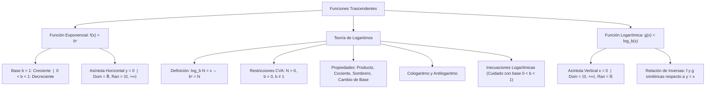

# ÁLGEBRA PREUNIVERSITARIA: CURSO COMPLETO Y SISTEMATIZADO
## EJE 02: MATEMÁTICA — ÁLGEBRA
### TEMA XIV: FUNCIÓN EXPONENCIAL, TEORÍA DE LOGARITMOS Y FUNCIÓN LOGARÍTMICA

---

## 1. FICHA TÉCNICA Y MATRIZ DE COMPETENCIAS

| Parámetro | Detalle Institucional |
| :--- | :--- |
| **Resolución Oficial** | Resolución de Consejo Universitario N° 0028-2026 (Admisión UNSA 2027) |
| **Eje Curricular** | Eje 02: Matemática / Funciones Trascendentes y Álgebra de Logaritmos |
| **Peso Ponderado UNSA** | **Ingenierías:** 1.658337400 pts/preg (4 preg. = 6.63 pts) \| **Biomédicas:** 1.265447400 pts \| **Sociales:** 0.824574000 pts |
| **Frecuencia en Exámenes** | **Crítica / Alta (95%):** Es una de las preguntas fijas en el examen de Admisión UNSA y CEPREUNSA, tanto en cálculo analítico de logaritmos como en problemas DECO de pH, decibeles o desintegración radiactiva. |
| **Modelos de Examen** | UNSA (Ordinario, CEPREUNSA), UNMSM (DECO de escala de Richter, bacterias y capitalización compuesta), UNI (Inecuaciones logarítmicas con base variable). |
| **Competencia Cardinal** | Dominar los teoremas y propiedades del operador logarítmico, resolver ecuaciones e inecuaciones exponenciales y logarítmicas con restricción estricta de valores admisibles, y graficar funciones exponenciales y logarítmicas analizando su naturaleza inversa y sus asíntotas. |

---

## 2. MAPA TAXONÓMICO Y ONTOLOGÍA DE CONCEPTOS



---

## 3. DESARROLLO TEÓRICO FORMAL (ESTÁNDAR LUMBRERAS / CUZCANO / UNI)

### 3.1. Función Exponencial
Sea $b$ una constante real tal que $b > 0$ y $b \neq 1$. La **función exponencial** con base $b$ se define como:

$$f(x) = b^x, \quad x \in \mathbb{R}$$

#### Propiedades Analíticas:
1. **Dominio y Rango:**
   $$\text{Dom}(f) = \mathbb{R}, \qquad \text{Ran}(f) = \mathbb{R}^+ = \langle 0, \ +\infty\rangle$$
2. **Punto de Paso Obligatorio:** Toda curva exponencial corta al eje $Y$ en el punto $(0, 1)$, ya que $b^0 = 1$.
3. **Asíntota Horizontal:** La recta $y = 0$ (eje $X$) es su asíntota horizontal.
4. **Monotonía según la Base:**
   - **Si $b > 1$:** La función es **estrictamente creciente**:
     $$x_1 < x_2 \iff b^{x_1} < b^{x_2}$$
   - **Si $0 < b < 1$:** La función es **estrictamente decreciente**:
     $$x_1 < x_2 \iff b^{x_1} > b^{x_2}$$
5. **Función Exponencial Natural:** Base $e \approx 2.718281828\dots$:
   $$f(x) = e^x$$

---

### 3.2. Definición Formal de Logaritmo
El **logaritmo** de un número real positivo $N$ en una base real positiva y diferente de la unidad $b$, es el exponente $x$ al cual se debe elevar la base $b$ para reproducir dicho número $N$:

$$\mathbf{\log_b N = x \iff b^x = N}$$

#### Condiciones de Existencia (C.V.A. Obligatorio):
Para que $\log_b N$ exista en $\mathbb{R}$, deben cumplirse simultáneamente:
1. **Argumento estrictamente positivo:** $N > 0$.
2. **Base estrictamente positiva:** $b > 0$.
3. **Base diferente de la unidad:** $b \neq 1$.

#### Identidades Fundamentales:
$$b^{\log_b N} = N, \qquad \log_b(b^x) = x$$
$$\log_b 1 = 0, \qquad \log_b b = 1$$

---

### 3.3. Propiedades Cardinales de los Logaritmos
Sean $x, y \in \mathbb{R}^+$, $b > 0, b \neq 1$:

1. **Logaritmo de un Producto:**
   $$\log_b(x \cdot y) = \log_b x + \log_b y$$
2. **Logaritmo de un Cociente:**
   $$\log_b\left(\frac{x}{y}\right) = \log_b x - \log_b y$$
3. **Regla del Sombrero (Exponente en el Argumento):**
   $$\log_b(x^n) = n \cdot \log_b x$$
4. **Exponente en la Base y en el Argumento:**
   $$\log_{b^m}(x^n) = \frac{n}{m} \cdot \log_b x$$
5. **Regla de la Cadena (Producto Cíclico):**
   $$\log_a b \cdot \log_b c \cdot \log_c d = \log_a d$$
6. **Inversión de Base y Argumento:**
   $$\log_b a = \frac{1}{\log_a b}$$
7. **Fórmula del Cambio de Base (hacia base $c > 0, c \neq 1$):**
   $$\log_b x = \frac{\log_c x}{\log_c b} = \frac{\ln x}{\ln b}$$
8. **Permutación de Extremos (Intercambio Base-Argumento en Exponentes):**
   $$x^{\log_b y} = y^{\log_b x}$$

---

### 3.4. Operadores Especiales: Cologaritmo y Antilogaritmo

#### 1. Cologaritmo ($\text{colog}$):
Es el logaritmo del inverso multiplicativo del argumento:
$$\text{colog}_b x = \log_b\left(\frac{1}{x}\right) = -\log_b x$$

#### 2. Antilogaritmo ($\text{antilog}$):
Es la función exponencial inversa:
$$\text{antilog}_b x = b^x$$

#### Propiedades Combinadas:
$$\log_b(\text{antilog}_b x) = x$$
$$\text{antilog}_b(\log_b x) = x, \quad (\text{para } x > 0)$$
$$\text{antilog}_b(\text{colog}_b x) = \frac{1}{x}$$

---

### 3.5. Función Logarítmica y su Gráfica
Es la función inversa de la función exponencial:
$$g(x) = \log_b x, \quad \text{con } b > 0, b \neq 1$$
- $\text{Dom}(g) = \mathbb{R}^+ = \langle 0, \ +\infty\rangle$
- $\text{Ran}(g) = \mathbb{R}$
- Corta al eje $X$ en $(1, 0)$.
- Posee una **asíntota vertical** en la recta $x = 0$ (eje $Y$).
- **Monotonía:**
  - Si $b > 1$: Estrictamente **creciente**.
  - Si $0 < b < 1$: Estrictamente **decreciente**.

---

### 3.6. Inecuaciones Logarítmicas
Para resolver $\log_b A \gtrless \log_b B$:

> [!IMPORTANT]
> **Paso 0 Obligatorio:** Establecer el Universo de Existencia: $A > 0 \land B > 0$.

1. **Si la base es mayor que la unidad ($b > 1$):**
   La función es creciente y **se preserva el sentido de la desigualdad**:
   $$\log_b A < \log_b B \iff 0 < A < B$$
2. **Si la base está entre cero y uno ($0 < b < 1$):**
   La función es decreciente y **el sentido de la desigualdad se invierte obligatoriamente**:
   $$\log_b A < \log_b B \iff A > B > 0$$

---

## 4. FORMULARIO MAESTRO (LATEX ESTRICTO)

| Propiedad / Teorema | Fórmula Matemática | Restricción / Aplicación |
| :--- | :--- | :--- |
| **Definición Logaritmo** | $\log_b N = x \iff b^x = N$ | $N > 0, \ b > 0, \ b \neq 1$ |
| **Identidad Fundamental** | $b^{\log_b N} = N$ | Base idéntica se cancela |
| **Regla del Sombrero** | $\log_{b^m}(x^n) = \frac{n}{m} \log_b x$ | Exponentes salen como fracción |
| **Cambio de Base** | $\log_b a = \frac{\ln a}{\ln b}$ | Conversión a base natural $e$ |
| **Permutación Exponencial** | $a^{\log_b c} = c^{\log_b a}$ | Intercambio de extremos |
| **Cologaritmo** | $\text{colog}_b x = -\log_b x$ | Inverso aditivo del logaritmo |
| **Antilogaritmo** | $\text{antilog}_b x = b^x$ | Operador exponencial puro |
| **Inecuación ($b > 1$)** | $\log_b A < \log_b B \iff 0 < A < B$ | Sentido se conserva |
| **Inecuación ($0 < b < 1$)** | $\log_b A < \log_b B \iff A > B > 0$ | Sentido se invierte |

---

## 5. MNEMOTECNIAS DE COMBATE PREUNIVERSITARIO

### 1. La Ley del Sombrero Fraccionario: "Arriba sale arriba, abajo sale abajo"
$$\log_{b^{\mathbf{m}}}(x^{\mathbf{n}}) = \frac{\mathbf{n}}{\mathbf{m}} \log_b x$$
- El exponente del argumento ($n$) está ARRIBA $\to$ pasa al **numerador**.
- El exponente de la base ($m$) está ABAJO $\to$ pasa al **denominador**.

### 2. Inecuación con Base Chiquita ($0 < b < 1$): "El Espejo Loco"
- Si la base es menor a 1 (fracción entre 0 y 1 como $1/2, 1/3, 0.5$):
> **"Base enana le da la vuelta a la campana."**
- Si la inecuación decía $<$, ¡se da la vuelta a $>$! Pero jamás olvides que el menor de ellos debe ser estrictamente $> 0$.

---

## 6. TÉCNICAS Y ARTIFICIOS DE CÁLCULO (HACKING PREUNIVERSITARIO)

### Artificio 1: El Truco de la Base Decimal y Potencias de 2
Si en un examen te dan $\log 2 \approx 0.30103$ y te piden hallar $\log 5$:
**¡No intentes inventar aproximaciones!**
**Hack:** Usa la identidad del cociente con la base decimal 10:
$$\log 5 = \log\left(\frac{10}{2}\right) = \log 10 - \log 2 = 1 - 0.30103 = 0.69897$$
De igual modo: $\log 20 = \log(2 \cdot 10) = 1 + \log 2 = 1.30103$.

### Artificio 2: Permutación de Extremos para Bajar la Incógnita
Si tienes una ecuación con la variable en el exponente y la base:
$$x^{\log_3 5} + 5^{\log_3 x} = 50$$
**Hack:** Por la propiedad de permutación $a^{\log_b c} = c^{\log_b a}$, el término $x^{\log_3 5}$ es exactamente igual a $5^{\log_3 x}$.
Por tanto:
$$5^{\log_3 x} + 5^{\log_3 x} = 50 \implies 2 \cdot 5^{\log_3 x} = 50 \implies 5^{\log_3 x} = 25 = 5^2$$
Igualando exponentes:
$$\log_3 x = 2 \implies x = 3^2 = 9$$
¡Resuelto en 15 segundos sin usar logaritmos neperianos!

---

## 7. ZONA DE TRAMPAS Y DISTRACTORES ("¡PELIGRO EXAMEN!")

> [!WARNING]
> **Trampa 1: El Falso C.V.A. al Aplicar la Regla del Sombrero**
> Resuelve: $2\log x = \log(3x + 4)$.
> El estudiante pasa el 2 como exponente: $\log(x^2) = \log(3x + 4) \implies x^2 - 3x - 4 = 0 \implies (x - 4)(x + 1) = 0$.
> Da como respuesta: $x = 4$ y $x = -1$.
> **¡GRAVE ERROR!** Para $x = -1$, el término original $2\log(-1)$ **no existe en los reales**.
> El único valor válido es $x = 4$. Siempre restringe el dominio en la **ecuación original**, nunca en la modificada.

> [!CAUTION]
> **Trampa 2: La Base Variable en Inecuaciones**
> Si resuelves $\log_x(x + 2) < 2$:
> No puedes simplemente elevar $x^2$ manteniendo el signo. Como no conoces si $x > 1$ o $0 < x < 1$, **debes abrir dos casos analíticos independientes**.

---

## 8. APLICACIÓN AL MUNDO REAL Y CONTEXTO DECO

### Geofísica y Medición Sísmica en el Cinturón de Fuego de Arequipa
En el monitoreo telúrico del Instituto Geofísico de la Universidad Nacional de San Agustín (UNSA), la magnitud $M$ de los terremotos en la escala sismológica de Richter se define mediante una función logarítmica decimal:
$$M = \log\left(\frac{I}{I_0}\right)$$
donde $I$ es la intensidad de la onda sísmica registrada y $I_0$ es la intensidad umbral de referencia. Como la escala es logarítmica, un incremento de solo 2 unidades de magnitud (por ejemplo, del sismo de Arequipa del 2001 con $M = 8.4$ comparado con un sismo moderado de $M = 6.4$) no significa un aumento del doble de violencia, sino que la energía sísmica liberada por la fractura de la placa de Nazca es:
$$10^{8.4 - 6.4} = 10^2 = 100 \text{ veces mayor en amplitud de onda (y más de 1000 veces mayor en energía pura)}.$$

---

## 9. BANCO DE 5 EJERCICIOS RESUELTOS GRADUADOS

### Ejercicio 1: Nivel Básico (Propiedades Operativas de Logaritmos)
**Enunciado:**
Calcule el valor numérico exacto de la expresión:
$$E = \log_2 24 - \log_2 3 + \log_3 45 - \log_3 5$$

**Solución paso a paso:**
1. Agrupamos los términos con la misma base:
   - Términos en base 2:
     $$E_1 = \log_2 24 - \log_2 3$$
     Por la propiedad del logaritmo de un cociente:
     $$E_1 = \log_2\left(\frac{24}{3}\right) = \log_2 8$$
     Como $8 = 2^3$:
     $$E_1 = \log_2(2^3) = 3$$
   - Términos en base 3:
     $$E_2 = \log_3 45 - \log_3 5$$
     Por la propiedad del logaritmo de un cociente:
     $$E_2 = \log_3\left(\frac{45}{5}\right) = \log_3 9$$
     Como $9 = 3^2$:
     $$E_2 = \log_3(3^2) = 2$$
2. Sumamos ambos resultados:
   $$E = E_1 + E_2 = 3 + 2 = 5$$

**Respuesta Final:** El valor de la expresión es $\mathbf{5}$.

---

### Ejercicio 2: Nivel Intermedio (Cologaritmos y Antilogaritmos)
**Enunciado:**
Simplifique la expresión:
$$M = \text{antilog}_2\left[\log_2 5 + \text{colog}_2 10\right]$$

**Solución paso a paso:**
1. Desarrollamos la expresión dentro del corchete:
   - Por definición de cologaritmo:
     $$\text{colog}_2 10 = -\log_2 10$$
   - Sustituimos en el corchete:
     $$C = \log_2 5 - \log_2 10$$
2. Aplicamos la propiedad de la resta de logaritmos:
   $$C = \log_2\left(\frac{5}{10}\right) = \log_2\left(\frac{1}{2}\right) = \log_2(2^{-1}) = -1$$
3. Ahora aplicamos la función antilogaritmo con base 2 al resultado $C = -1$:
   $$M = \text{antilog}_2(-1) = 2^{-1} = \frac{1}{2}$$

**Respuesta Final:** El valor simplificado es $\mathbf{\frac{1}{2}}$ (o $\mathbf{0.5}$).

---

### Ejercicio 3: Nivel Avanzado - UNSA Ordinario (Ecuación Logarítmica con C.V.A.)
**Enunciado:**
Determine el conjunto solución de la ecuación:
$$\log(x + 2) + \log(x - 1) = 1$$

**Solución paso a paso:**
1. **Paso Obligatorio: Determinación del C.V.A.:**
   Los argumentos deben ser estrictamente mayores que cero:
   $$x + 2 > 0 \implies x > -2$$
   $$x - 1 > 0 \implies x > 1$$
   Intersección del universo:
   $$\text{C.V.A.} = \langle 1, \ +\infty\rangle \quad \text{--- (Condición de oro)}$$
2. **Aplicamos las propiedades de los logaritmos:**
   Como la base no escrita es 10, la suma de logaritmos es el logaritmo del producto:
   $$\log[(x + 2)(x - 1)] = 1$$
3. Aplicamos la definición formal de logaritmo con base 10:
   $$(x + 2)(x - 1) = 10^1 = 10$$
4. Desarrollamos la ecuación cuadrática:
   $$x^2 + x - 2 = 10$$
   $$x^2 + x - 12 = 0$$
5. Factorizamos por aspa simple:
   $$(x + 4)(x - 3) = 0$$
   Las soluciones algebraicas potenciales son:
   $$x_1 = -4, \qquad x_2 = 3$$
6. Contrastamos con el C.V.A. ($x > 1$):
   - $x = -4$ queda **descartado** (haría negativos los argumentos originales).
   - $x = 3 \in \langle 1, +\infty\rangle$ es **válido**.

**Respuesta Final:** El conjunto solución es $\mathbf{C.S. = \{3\}}$.

---

### Ejercicio 4: Nivel San Marcos DECO (Modelo Exponencial de Bacterias)
**Enunciado:**
En el laboratorio de microbiología de la Facultad de Medicina de la UNSA, un cultivo de bacterias causantes de infecciones gástricas crece según el modelo exponencial continuo:
$$N(t) = 500 \cdot e^{0.04 t}$$
donde $N(t)$ es el número de bacterias transcurridos $t$ minutos. Determine en cuántos minutos la población alcanzará las $2000$ bacterias (tome $\ln 2 \approx 0.693$).

**Solución paso a paso:**
1. Planteamos la ecuación con la población objetivo de $2000$ bacterias:
   $$500 \cdot e^{0.04 t} = 2000$$
2. Despejamos el término exponencial dividiendo entre $500$:
   $$e^{0.04 t} = \frac{2000}{500} = 4$$
3. Como $4 = 2^2$:
   $$e^{0.04 t} = 2^2$$
4. Aplicamos logaritmo natural ($\ln$) a ambos miembros:
   $$\ln(e^{0.04 t}) = \ln(2^2)$$
   $$0.04 t = 2 \ln 2$$
5. Despejamos el tiempo $t$:
   $$t = \frac{2 \ln 2}{0.04} = \frac{2 \ln 2}{\frac{4}{100}} = \frac{200 \ln 2}{4} = 50 \ln 2$$
6. Sustituimos el dato numérico $\ln 2 \approx 0.693$:
   $$t = 50(0.693) = 34.65 \text{ minutos}$$

**Respuesta Final:** La población alcanzará las $2000$ bacterias en aproximadamente $\mathbf{34.65}$ minutos (o exactamente $\mathbf{50 \ln 2}$ min).

---

### Ejercicio 5: Nivel Boss Challenge - Estilo UNI (Inecuación Logarítmica con Base Menor a 1)
**Enunciado:**
Resuelva la inecuación logarítmica en $\mathbb{R}$:
$$\log_{0.5}(x^2 - 5x + 7) \geq 0$$
e indique la suma de todos los valores enteros que verifican la desigualdad.

**Solución paso a paso:**
1. **Paso 1: Análisis del C.V.A.:**
   El argumento debe ser estrictamente positivo:
   $$x^2 - 5x + 7 > 0$$
   Analizamos su discriminante:
   $$\Delta = (-5)^2 - 4(1)(7) = 25 - 28 = -3 < 0$$
   Como $a = 1 > 0$ y $\Delta < 0$, por el **Teorema del Trinomio Positivo**, la expresión $x^2 - 5x + 7 > 0$ se cumple para **todo $x \in \mathbb{R}$**.
   $$\text{C.V.A.} = \mathbb{R}$$
2. **Paso 2: Resolución de la inecuación:**
   Expresamos el segundo miembro en base $0.5$:
   $$0 = \log_{0.5} 1$$
   La inecuación queda:
   $$\log_{0.5}(x^2 - 5x + 7) \geq \log_{0.5} 1$$
3. **Paso 3: Análisis de la Base:**
   La base es $b = 0.5 = \frac{1}{2}$.
   Como $0 < b < 1$, la función logarítmica es estrictamente decreciente, lo que **invierte el sentido de la desigualdad**:
   $$x^2 - 5x + 7 \leq 1$$
4. Trasladamos el $1$ al primer miembro:
   $$x^2 - 5x + 6 \leq 0$$
5. Factorizamos por aspa simple:
   $$(x - 2)(x - 3) \leq 0$$
6. Determinamos los puntos críticos: $x = 2$ y $x = 3$.
   Zona negativa (cerrada por $\leq$):
   $$C.S. = [2, \ 3]$$
7. Identificamos los valores enteros pertenecientes al conjunto solución:
   $$\mathbb{Z} \cap C.S. = \{2, \ 3\}$$
8. Calculamos la suma pedida:
   $$\text{Suma} = 2 + 3 = 5$$

**Respuesta Final:** El conjunto solución es $\mathbf{[2, \ 3]}$ y la suma de enteros es $\mathbf{5}$.

---

## 10. GLOSARIO DE 10 TÉRMINOS CLAVE

1. **Función Exponencial:** Función de la forma $f(x) = b^x$ caracterizada por tasa de crecimiento o decaimiento geométrico.
2. **Logaritmo:** Exponente al que debe elevarse una base fija positiva para obtener un número dado.
3. **C.V.A. Logarítmico:** Restricción obligatoria que exige argumento positivo ($N > 0$), base positiva ($b > 0$) y base distinta de uno ($b \neq 1$).
4. **Base Natural ($e$):** Número irracional trascendente $e \approx 2.71828\dots$, base del logaritmo neperiano ($\ln$).
5. **Cologaritmo:** Negativo del logaritmo ordinario: $\text{colog}_b x = -\log_b x$.
6. **Antilogaritmo:** Operación inversa que recupera la potencia: $\text{antilog}_b x = b^x$.
7. **Regla de la Cadena:** Propiedad que permite simplificar productos cíclicos de logaritmos conectando bases y argumentos homólogos.
8. **Asíntota Horizontal:** Recta $y = 0$ que guía la aproximación asintótica de la curva exponencial.
9. **Asíntota Vertical:** Recta $x = 0$ (eje $Y$) que delimita el borde del dominio de la curva logarítmica.
10. **Inversión de Desigualdad:** Propiedad que invierte el sentido de una inecuación logarítmica cuando la base se encuentra en el intervalo $\langle 0, 1\rangle$.

---

## 11. BANCO DE FLASHCARDS (ANVERSO / REVERSO)

- **Flashcard 1:**
  - *Anverso:* ¿Qué condiciones debe cumplir la base $b$ y el argumento $N$ para que $\log_b N$ exista en los reales?
  - *Reverso:* $N > 0, \quad b > 0 \quad \text{y} \quad b \neq 1$.
- **Flashcard 2:**
  - *Anverso:* ¿A qué equivale la expresión exponencial $b^{\log_b N}$?
  - *Reverso:* Equivale exactamente al argumento $N$.
- **Flashcard 3:**
  - *Anverso:* ¿Qué sucede con el sentido de la desigualdad en $\log_b A < \log_b B$ si $0 < b < 1$?
  - *Reverso:* El sentido se invierte obligatoriamente: $A > B > 0$.
- **Flashcard 4:**
  - *Anverso:* ¿Cómo se define el cologaritmo de $x$ en base $b$?
  - *Reverso:* $\text{colog}_b x = -\log_b x = \log_b(1/x)$.
- **Flashcard 5:**
  - *Anverso:* ¿Cuál es el dominio y el rango de la función exponencial elemental $f(x) = b^x$?
  - *Reverso:* $\text{Dom}(f) = \mathbb{R}$ y $\text{Ran}(f) = \langle 0, +\infty\rangle$.

---

## 12. MOTOR DE GAMIFICACIÓN (JSON PARA KOTLIN MULTIPLATFORM)

```json
{
  "topicId": "alg_14_exponencial_logaritmica",
  "title": "Función Exponencial, Teoría de Logaritmos y Función Logarítmica",
  "subject": "algebra",
  "xpReward": 430,
  "level": "ADVANCED",
  "badges": [
    {
      "id": "neper_hero",
      "name": "Titán de los Logaritmos",
      "description": "Despejaste exponentes y argumentos respetando estrictamente el CVA y las bases decrecientes."
    }
  ],
  "questions": [
    {
      "id": "q1",
      "statement": "¿Cuál es el valor de x en la ecuación log_2(x^2 - 1) = 3?",
      "options": ["3 y -3", "3 solamente", "9", "sqrt(7)"],
      "correctIndex": 0,
      "explanation": "x^2 - 1 = 2^3 = 8 => x^2 = 9 => x = 3 o x = -3. Ambos verifican el CVA (x^2 - 1 = 8 > 0)."
    },
    {
      "id": "q2",
      "statement": "¿Cuál es el valor numérico de colog_3 27?",
      "options": ["3", "-3", "1/3", "9"],
      "correctIndex": 1,
      "explanation": "colog_3 27 = -log_3 27 = -log_3(3^3) = -3."
    }
  ]
}
```
