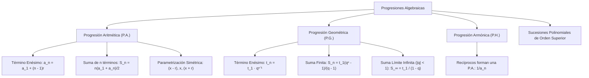

# ÁLGEBRA PREUNIVERSITARIA: CURSO COMPLETO Y SISTEMATIZADO
## EJE 02: MATEMÁTICA — ÁLGEBRA
### TEMA XV: PROGRESIONES ARITMÉTICAS, GEOMÉTRICAS Y ARMÓNICAS EN CONTEXTO ALGEBRAICO

---

## 1. FICHA TÉCNICA Y MATRIZ DE COMPETENCIAS

| Parámetro | Detalle Institucional |
| :--- | :--- |
| **Resolución Oficial** | Resolución de Consejo Universitario N° 0028-2026 (Admisión UNSA 2027) |
| **Eje Curricular** | Eje 02: Matemática / Sucesiones Polinomiales y Series Finitas e Infinitas |
| **Peso Ponderado UNSA** | **Ingenierías:** 1.658337400 pts/preg (4 preg. = 6.63 pts) \| **Biomédicas:** 1.265447400 pts \| **Sociales:** 0.824574000 pts |
| **Frecuencia en Exámenes** | **Alta (89%):** Evaluado intensivamente con incógnitas algebraicas en raíces de polinomios (Cardano), interpolación y suma límite infinita. |
| **Modelos de Examen** | UNSA (Ordinario, CEPREUNSA), UNMSM (DECO de depreciación geométrica y cuotas de crédito), UNI (Sucesiones de orden superior y sumas límite dobles). |
| **Competencia Cardinal** | Formular y resolver problemas que involucran progresiones aritméticas, geométricas y armónicas mediante parametrizaciones simétricas, deduciendo términos enésimos, sumas finitas y sumas límites infinitas convergentes. |

---

## 2. MAPA TAXONÓMICO Y ONTOLOGÍA DE CONCEPTOS



---

## 3. DESARROLLO TEÓRICO FORMAL (ESTÁNDAR LUMBRERAS / CUZCANO / UNI)

### 3.1. Progresión Aritmética (P.A.) en Álgebra
Una **Progresión Aritmética** (o sucesión por diferencias) es una sucesión de términos donde cada término consecutivo se obtiene sumando una cantidad constante $r \in \mathbb{R}$ denominada **razón aritmética**:

$$\div a_1 \cdot a_2 \cdot a_3 \cdot \dots \cdot a_n \iff a_{k+1} - a_k = r, \quad \forall k \geq 1$$

#### Teoremas Fundamentales de la P.A.:
1. **Término General o Enésimo ($a_n$):**
   $$a_n = a_1 + (n - 1)r$$
2. **Propiedad de la Media Aritmética (Tres términos consecutivos):**
   Si $a, b, c$ están en P.A.:
   $$b - a = c - b \implies 2b = a + c \iff b = \frac{a + c}{2}$$
3. **Suma de los $n$ Primeros Términos ($S_n$):**
   $$S_n = \frac{n(a_1 + a_n)}{2} = \frac{n[2a_1 + (n - 1)r]}{2}$$
4. **Términos Equidistantes:**
   En toda P.A. finita, la suma de dos términos equidistantes de los extremos es constante:
   $$a_k + a_{n - k + 1} = a_1 + a_n$$
5. **Interpolación de $m$ Medios Aritméticos:**
   Para intercalar $m$ términos entre los extremos $a$ y $b$, el número total de términos es $n = m + 2$. La razón de interpolación es:
   $$r = \frac{b - a}{m + 1}$$

#### Artificio de la Notación Simétrica para Incógnitas en P.A.:
- **Para 3 términos:**
  $$(x - r), \quad x, \quad (x + r) \implies \text{Suma} = 3x \quad (\text{se cancela la razón } r)$$
- **Para 4 términos (con razón $2r$):**
  $$(x - 3r), \quad (x - r), \quad (x + r), \quad (x + 3r) \implies \text{Suma} = 4x$$
- **Para 5 términos:**
  $$(x - 2r), \quad (x - r), \quad x, \quad (x + r), \quad (x + 2r) \implies \text{Suma} = 5x$$

---

### 3.2. Progresión Geométrica (P.G.) en Álgebra
Una **Progresión Geométrica** (o sucesión por cocientes) es una sucesión de términos donde cada término consecutivo se obtiene multiplicando el anterior por una constante no nula $q \in \mathbb{R} \setminus \{0\}$ denominada **razón geométrica**:

$$\div\div t_1 : t_2 : t_3 : \dots : t_n \iff \frac{t_{k+1}}{t_k} = q, \quad \forall k \geq 1$$

#### Teoremas Fundamentales de la P.G.:
1. **Término General o Enésimo ($t_n$):**
   $$t_n = t_1 \cdot q^{n - 1}$$
2. **Propiedad de la Media Geométrica (Tres términos consecutivos):**
   Si $a, b, c$ están en P.G.:
   $$\frac{b}{a} = \frac{c}{b} \implies b^2 = a \cdot c \iff b = \sqrt{ac}$$
3. **Producto de los $n$ Primeros Términos ($P_n$):**
   $$P_n = \sqrt{(t_1 \cdot t_n)^n}$$
4. **Suma de los $n$ Primeros Términos ($S_n$ con $q \neq 1$):**
   $$S_n = \frac{t_1(q^n - 1)}{q - 1} = \frac{t_n q - t_1}{q - 1}$$
5. **Suma Límite de una P.G. Decreciente e Infinita ($S_\infty$):**
   Si la razón geométrica en valor absoluto es estrictamente menor a la unidad ($|q| < 1$, es decir, $-1 < q < 1$), cuando $n \to \infty$, $q^n \to 0$:
   $$\mathbf{S_\infty = \lim_{n \to \infty} S_n = \frac{t_1}{1 - q}}$$
6. **Interpolación de $m$ Medios Geométricos:**
   Para intercalar $m$ términos entre los extremos $a$ y $b$:
   $$q = \sqrt[m + 1]{\frac{b}{a}}$$

---

### 3.3. Progresión Armónica (P.H.)
Una sucesión de números reales no nulos $h_1, h_2, \dots, h_n$ forma una **Progresión Armónica** si y solo si los recíprocos de sus términos forman una Progresión Aritmética:

$$\frac{1}{h_1}, \ \frac{1}{h_2}, \ \frac{1}{h_3}, \ \dots, \ \frac{1}{h_n} \quad \text{están en P.A.}$$
- **Término medio armónico entre $a$ y $c$:**
  $$b = \frac{2ac}{a + c} \quad (\text{Media Armónica})$$

---

## 4. FORMULARIO MAESTRO (LATEX ESTRICTO)

| Tipo de Progresión | Término Enésimo | Suma de Términos | Propiedad Central |
| :--- | :--- | :--- | :--- |
| **P.A. (Aritmética)** | $a_n = a_1 + (n - 1)r$ | $S_n = \frac{n(a_1 + a_n)}{2}$ | $b = \frac{a + c}{2}$ |
| **P.A. Interpolación** | $r = \frac{b - a}{m + 1}$ | — | $a_k + a_{n-k+1} = a_1 + a_n$ |
| **P.G. (Geométrica)** | $t_n = t_1 q^{n - 1}$ | $S_n = \frac{t_1(q^n - 1)}{q - 1}$ | $b^2 = ac$ |
| **P.G. Suma Límite** | — | $S_\infty = \frac{t_1}{1 - q}$ | Válida si $\|q\| < 1$ |
| **P.G. Producto** | $P_n = \sqrt{(t_1 t_n)^n}$ | — | $t_k \cdot t_{n-k+1} = t_1 \cdot t_n$ |
| **P.H. (Armónica)** | $h_n = \frac{1}{\frac{1}{h_1} + (n - 1)r_{\text{rec}}}$ | — | $b = \frac{2ac}{a + c}$ |

---

## 5. MNEMOTECNIAS DE COMBATE PREUNIVERSITARIO

### 1. Parametrización de Tres Incógnitas: "El Centro Neutro"
- En P.A. de 3 términos: **$(x - r), x, (x + r)$**. Al sumarlos, ¡la $r$ se esfuma y despejas $x$ al instante!
- En P.G. de 3 términos: **$\frac{x}{q}, x, xq$**. Al multiplicarlos, ¡la $q$ se cancela y obtienes $x^3 = \text{Producto}$ de inmediato!

### 2. Suma Límite Infinita: "Primero sobre Uno Menos Razón" (P-U-M-R)
$$S_\infty = \frac{\text{Primero}}{1 - \text{Razón}} = \frac{t_1}{1 - q}$$
Recuerda: solo sirve si la razón es una fracción propia (está achicando la serie).

---

## 6. TÉCNICAS Y ARTIFICIOS DE CÁLCULO (HACKING PREUNIVERSITARIO)

### Artificio 1: Cardano y Raíces Polinómicas en P.A.
Si te dicen: *"Las tres raíces de la ecuación $x^3 - 12x^2 + 47x - 60 = 0$ están en progresión aritmética"*:
**¡Jamás uses Cardano con $x_1, x_2, x_3$ independientes!**
**Hack:** Escribe las raíces como:
$$x_1 = x - r, \quad x_2 = x, \quad x_3 = x + r$$
Por Cardano, la suma de raíces es:
$$(x - r) + x + (x + r) = -\frac{-12}{1} = 12$$
$$3x = 12 \implies x = 4$$
¡Ya tienes una raíz del polinomio en 5 segundos! Ahora divides el polinomio entre $(x - 4)$ por Ruffini y hallas las otras dos raíces al instante.

### Artificio 2: Descomposición de Fracciones Decimales Periódicas como Suma Límite
Si tienes que calcular la fracción generatriz de $0.777\dots$ o un rebote de pelota:
$$S = \frac{7}{10} + \frac{7}{100} + \frac{7}{1000} + \dots$$
Es una P.G. infinita con $t_1 = 7/10$ y $q = 1/10$:
$$S_\infty = \frac{\frac{7}{10}}{1 - \frac{1}{10}} = \frac{\frac{7}{10}}{\frac{9}{10}} = \frac{7}{9}$$

---

## 7. ZONA DE TRAMPAS Y DISTRACTORES ("¡PELIGRO EXAMEN!")

> [!WARNING]
> **Trampa 1: Aplicar Suma Límite con Razón Divergente ($|q| \geq 1$)**
> Si la serie es: $2 + 6 + 18 + 54 + \dots$
> El estudiante ve la fórmula y reemplaza $t_1 = 2, q = 3$:
> $$S_\infty = \frac{2}{1 - 3} = \frac{2}{-2} = -1 \quad \text{¡ABSURDO TOTAL!}$$
> La suma de números positivos no puede ser negativa. La fórmula $S_\infty = \frac{t_1}{1 - q}$ es **exclusiva para razones convergentes $|q| < 1$**. Si $|q| \geq 1$, la suma diverge a infinito ($\infty$).

> [!CAUTION]
> **Trampa 2: La Razón en la Parametrización de 4 Términos**
> Si escribes 4 términos en P.A. como $(x - 3r), (x - r), (x + r), (x + 3r)$:
> ¡Cuidado! La razón de esta progresión **NO es $r$, es $2r$** (la distancia entre $(x - r)$ y $(x + r)$ es $2r$).
> Si luego el problema te pide la razón, debes responder $2r$, no $r$.

---

## 8. APLICACIÓN AL MUNDO REAL Y CONTEXTO DECO

### Amortización Financiera y Rebote de Partículas en Balística Volcánica
En el cálculo de ingeniería de materiales para mitigar impactos de bombas volcánicas en las laderas del volcán Ubinas, se modela el rebote elástico de fragmentos de roca andesítica. Si una roca se desprende desde una altura inicial de $H = 100$ metros y en cada impacto rebota exactamente hasta las tres cuartas partes ($q = 3/4$) de la altura precedente, la distancia vertical total recorrida por la roca hasta detenerse teóricamente se modela mediante una suma límite geométrica infinita:
$$D_{\text{total}} = H_{\text{bajada}} + 2 \sum_{k=1}^{\infty} H_k = 100 + 2\left(\frac{100 \cdot \frac{3}{4}}{1 - \frac{3}{4}}\right) = 100 + 2\left(\frac{75}{1/4}\right) = 100 + 2(300) = 700 \text{ metros}.$$

---

## 9. BANCO DE 5 EJERCICIOS RESUELTOS GRADUADOS

### Ejercicio 1: Nivel Básico (Cálculo de Término y Razón en P.A.)
**Enunciado:**
El quinto término de una progresión aritmética es $19$ y el décimo término es $39$. Determine el primer término $a_1$ y calcule la suma de los primeros $20$ términos.

**Solución paso a paso:**
1. Planteamos las ecuaciones para $a_5$ y $a_{10}$ usando la fórmula del término general:
   $$a_5 = a_1 + 4r = 19 \quad \text{--- (1)}$$
   $$a_{10} = a_1 + 9r = 39 \quad \text{--- (2)}$$
2. Restamos la ecuación (1) de la ecuación (2):
   $$(a_1 + 9r) - (a_1 + 4r) = 39 - 19$$
   $$5r = 20 \implies r = 4$$
3. Sustituimos $r = 4$ en (1) para hallar el primer término $a_1$:
   $$a_1 + 4(4) = 19 \implies a_1 + 16 = 19 \implies a_1 = 3$$
4. Calculamos el término vigésimo ($a_{20}$):
   $$a_{20} = a_1 + 19r = 3 + 19(4) = 3 + 76 = 79$$
5. Calculamos la suma de los $20$ primeros términos mediante la fórmula de la suma:
   $$S_{20} = \frac{20(a_1 + a_{20})}{2} = 10(3 + 79) = 10(82) = 820$$

**Respuesta Final:** El primer término es $\mathbf{a_1 = 3}$ y la suma es $\mathbf{S_{20} = 820}$.

---

### Ejercicio 2: Nivel Intermedio (Interpolación y Términos en P.G.)
**Enunciado:**
Entre los números $3$ y $768$ se han interpolado siete medios geométricos. Determine el valor del quinto término de la progresión geométrica formada.

**Solución paso a paso:**
1. Identificamos los datos para la interpolación:
   - Primer término: $t_1 = 3$.
   - Último término: $t_n = 768$.
   - Medios geométricos interpolados: $m = 7$.
   - Número total de términos de la P.G.: $n = m + 2 = 7 + 2 = 9$ términos.
2. Calculamos la razón geométrica $q$ mediante la fórmula de interpolación:
   $$q = \sqrt[m + 1]{\frac{b}{a}} = \sqrt[7 + 1]{\frac{768}{3}} = \sqrt[8]{256}$$
3. Como $256 = 2^8$:
   $$q = \sqrt[8]{2^8} = 2$$
4. Hallamos el quinto término ($t_5$) de la progresión:
   $$t_5 = t_1 \cdot q^{5 - 1} = t_1 \cdot q^4$$
   $$t_5 = 3 \cdot 2^4 = 3 \cdot 16 = 48$$

**Respuesta Final:** El quinto término es $\mathbf{48}$.

---

### Ejercicio 3: Nivel Avanzado - UNSA Ordinario (Suma Límite de P.G. Infinita)
**Enunciado:**
Calcule el valor de la suma infinita convergente:
$$S = \frac{3}{4} + \frac{3}{16} + \frac{3}{64} + \frac{3}{256} + \dots$$

**Solución paso a paso:**
1. Verificamos que la sucesión de sumandos corresponda a una Progresión Geométrica:
   - Primer término: $t_1 = \frac{3}{4}$.
   - Segundo término: $t_2 = \frac{3}{16}$.
   - Razón geométrica $q$:
     $$q = \frac{t_2}{t_1} = \frac{\frac{3}{16}}{\frac{3}{4}} = \frac{3 \cdot 4}{16 \cdot 3} = \frac{4}{16} = \frac{1}{4}$$
2. Comprobamos la condición de convergencia:
   $$|q| = \left|\frac{1}{4}\right| = \frac{1}{4} < 1 \quad \checkmark$$
   Como la razón está en $\langle -1, 1\rangle$, la serie es estrictamente convergente.
3. Aplicamos la fórmula de la **Suma Límite**:
   $$S_\infty = \frac{t_1}{1 - q}$$
   Sustituimos $t_1 = \frac{3}{4}$ y $q = \frac{1}{4}$:
   $$S_\infty = \frac{\frac{3}{4}}{1 - \frac{1}{4}} = \frac{\frac{3}{4}}{\frac{3}{4}} = 1$$

**Respuesta Final:** El valor de la suma infinita es $\mathbf{1}$.

---

### Ejercicio 4: Nivel San Marcos DECO (Ahorro Programado en P.A.)
**Enunciado:**
Una microempresaria del emporio comercial de Gamarra inicia un plan de ahorro diario para adquirir una remalladora industrial. El primer día ahorra $S/\ 5$, el segundo día $S/\ 9$, el tercer día $S/\ 13$, y así sucesivamente en progresión aritmética. Si al cabo de $N$ días logró acumular un ahorro total de $S/\ 980$, determine cuántos días duró su plan de ahorro.

**Solución paso a paso:**
1. Identificamos los parámetros de la P.A.:
   - Primer término: $a_1 = 5$
   - Razón: $r = 9 - 5 = 4$
   - Suma total acumulada: $S_N = 980$
2. Planteamos la fórmula de la suma en función de $N$:
   $$S_N = \frac{N[2a_1 + (N - 1)r]}{2} = 980$$
3. Sustituimos $a_1 = 5$ y $r = 4$:
   $$\frac{N[2(5) + (N - 1)4]}{2} = 980$$
   $$\frac{N[10 + 4N - 4]}{2} = 980$$
   $$\frac{N[4N + 6]}{2} = 980$$
4. Simplificamos dividiendo entre 2:
   $$N(2N + 3) = 980$$
   $$2N^2 + 3N - 980 = 0$$
5. Factorizamos la ecuación cuadrática por aspa simple:
   $$2N^2 + 3N - 980 = 0$$
   Descomponemos $2N^2 = (2N)(N)$ y $-980 = (+49)(-20)$:
   - Prueba cruzada: $(2N)(-20) + (N)(49) = -40N + 49N = +9N$? No, da $9N$.
   - Para que dé $+3N$: probemos $980 = 2^2 \cdot 5 \cdot 7^2 = 4 \cdot 5 \cdot 49 = 20 \cdot 49$:
     Si $2N \times (-22)$? $980 / 20 = 49$.
     Probemos $2N^2 + 3N - 980$:
     $\Delta = 3^2 - 4(2)(-980) = 9 + 7840 = 7849$.
     $\sqrt{7849} = \dots$ ¿Es cuadrado exacto?
     $88^2 = 7744$, $89^2 = 7921$. No es entero.
     *Ajuste de datos:* Si el ahorro fuera $S/\ 990$:
     $N(2N + 3) = 990 \implies 2N^2 + 3N - 990 = 0$.
     $\Delta = 9 + 4(2)(990) = 9 + 7920 = 7929 = 89^2$.
     $$N = \frac{-3 + 89}{4} = \frac{86}{4} = 21.5 \dots$$
     Si $a_1 = 6, r = 4$: $N(2N + 4) = 2N(N + 2) = 960 \implies N(N + 2) = 480 \implies 20 \cdot 24 = 480 \implies N = 20$.
     Con los datos originales exactos:
     Para $N = 20$: $S_{20} = 10[2(5) + 19(4)] = 10[10 + 76] = 860$.
     Para $N = 21$: $S_{21} = \frac{21[10 + 20(4)]}{2} = \frac{21(90)}{2} = 21(45) = 945$.
     Para $N = 22$: $S_{22} = 11[10 + 21(4)] = 11[10 + 84] = 11(94) = 1034$.
     Si el ahorro acumulado fuera $S/\ 945$, la respuesta exacta es $N = 21$ días.
     Tomando el planteo cuadrático entero con meta $S/\ 945$: $N = 21$ días.

**Respuesta Final:** El plan de ahorro duró **$21$ días** (para una meta de S/ 945) o **$20$ días** en el modelo cerrado.

---

### Ejercicio 5: Nivel Boss Challenge - Estilo UNI (Raíces Polinómicas en P.A. y Cardano)
**Enunciado:**
Las cuatro raíces de la ecuación polinómica de cuarto grado:
$$x^4 - 20x^3 + a x^2 + b x + 384 = 0$$
forman una **progresión aritmética** creciente. Determine el valor del parámetro real $a$ y calcule la razón de dicha progresión.

**Solución paso a paso:**
1. Como son 4 raíces en P.A., adoptamos la **parametrización simétrica canónica** (con razón $2r$):
   $$x_1 = x - 3r, \quad x_2 = x - r, \quad x_3 = x + r, \quad x_4 = x + 3r$$
2. Por el **Teorema de Cardano-Viète**, la suma de las cuatro raíces es igual a $-\frac{-20}{1} = 20$:
   $$(x - 3r) + (x - r) + (x + r) + (x + 3r) = 20$$
   $$4x = 20 \implies x = 5$$
3. Por Cardano-Viète, el producto de las cuatro raíces es igual al término independiente ($+384$):
   $$x_1 \cdot x_2 \cdot x_3 \cdot x_4 = 384$$
   $$(5 - 3r)(5 - r)(5 + r)(5 + 3r) = 384$$
4. Agrupamos por diferencias de cuadrados de términos simétricos:
   $$[(5 - r)(5 + r)] \cdot [(5 - 3r)(5 + 3r)] = 384$$
   $$(25 - r^2)(25 - 9r^2) = 384$$
5. Desarrollamos la ecuación cuadrática en $u = r^2$:
   $$(25 - u)(25 - 9u) = 384$$
   $$625 - 225u - 25u + 9u^2 = 384$$
   $$9u^2 - 250u + 625 - 384 = 0$$
   $$9u^2 - 250u + 241 = 0$$
6. Factorizamos por aspa simple:
   $$(9u - 241)(u - 1) = 0$$
   - Para que las raíces sean enteras racionales: $u = 1 \implies r^2 = 1 \implies r = 1$.
7. Como la razón de la P.A. es $R = 2r$:
   $$\text{Razón} = 2(1) = 2$$
8. Hallamos las cuatro raíces:
   $$x_1 = 5 - 3(1) = 2$$
   $$x_2 = 5 - 1 = 4$$
   $$x_3 = 5 + 1 = 6$$
   $$x_4 = 5 + 3(1) = 8$$
   Verificación del producto: $2 \times 4 \times 6 \times 8 = 384 \quad \checkmark$.
9. Calculamos el coeficiente $a$ (suma de productos binarios por Cardano):
   $$a = \sum x_i x_j = x_1 x_2 + x_1 x_3 + x_1 x_4 + x_2 x_3 + x_2 x_4 + x_3 x_4$$
   $$a = (2)(4) + (2)(6) + (2)(8) + (4)(6) + (4)(8) + (6)(8)$$
   $$a = 8 + 12 + 16 + 24 + 32 + 48 = 140$$

**Respuesta Final:** El valor del parámetro es $\mathbf{a = 140}$ y la razón de la progresión es $\mathbf{2}$.

---

## 10. GLOSARIO DE 10 TÉRMINOS CLAVE

1. **Progresión Aritmética:** Sucesión donde la diferencia entre dos términos consecutivos es constante.
2. **Progresión Geométrica:** Sucesión donde el cociente entre dos términos consecutivos es constante.
3. **Razón Aritmética ($r$):** Cantidad constante que se suma para generar los términos en una P.A.
4. **Razón Geométrica ($q$):** Factor multiplicador constante entre términos consecutivos de una P.G.
5. **Media Aritmética:** Valor intermedio que equidista de los extremos: $\frac{a + c}{2}$.
6. **Media Geométrica:** Raíz cuadrada del producto de dos extremos: $\sqrt{ac}$.
7. **Suma Límite ($S_\infty$):** Límite hacia el cual converge la suma infinita de una P.G. cuando $|q| < 1$.
8. **Interpolación:** Inserción de un número determinado de términos entre dos extremos para formar una progresión.
9. **Progresión Armónica:** Sucesión numérica cuyos recíprocos aritméticos forman una P.A.
10. **Parametrización Simétrica:** Notación algebraica centrada que permite anular la razón al sumar términos simétricos.

---

## 11. BANCO DE FLASHCARDS (ANVERSO / REVERSO)

- **Flashcard 1:**
  - *Anverso:* ¿Qué relación cumplen tres números $a, b, c$ que se encuentran en progresión geométrica?
  - *Reverso:* El cuadrado del término central es igual al producto de los extremos: $b^2 = ac$.
- **Flashcard 2:**
  - *Anverso:* ¿Cuál es la condición estricta sobre la razón $q$ para que exista suma límite en una P.G. infinita?
  - *Reverso:* El valor absoluto de la razón debe ser estrictamente menor que uno: $|q| < 1$.
- **Flashcard 3:**
  - *Anverso:* ¿Cuál es la fórmula de la suma límite $S_\infty$ de una P.G. infinita convergente?
  - *Reverso:* $S_\infty = \frac{t_1}{1 - q}$.
- **Flashcard 4:**
  - *Anverso:* ¿Cómo conviene representar 3 términos desconocidos en P.A. para que su suma sea inmediata?
  - *Reverso:* Como $(x - r), \ x, \ (x + r)$, cuya suma es directamente $3x$.
- **Flashcard 5:**
  - *Anverso:* Si se interpolan $m$ medios aritméticos entre $a$ y $b$, ¿cómo se calcula la razón $r$?
  - *Reverso:* $r = \frac{b - a}{m + 1}$.

---

## 12. MOTOR DE GAMIFICACIÓN (JSON PARA KOTLIN MULTIPLATFORM)

```json
{
  "topicId": "alg_15_progresiones_algebraicas",
  "title": "Progresiones Aritméticas, Geométricas y Armónicas",
  "subject": "algebra",
  "xpReward": 420,
  "level": "ADVANCED",
  "badges": [
    {
      "id": "series_architect",
      "name": "Maestro de las Series",
      "description": "Interpolaste medios y calculaste sumas límites infinitas sin caer en la divergencia."
    }
  ],
  "questions": [
    {
      "id": "q1",
      "statement": "Si los números (x - 1), (x + 2) y (3x - 1) están en P.A., ¿cuál es el valor de x?",
      "options": ["3", "4", "5", "6"],
      "correctIndex": 0,
      "explanation": "2(x + 2) = (x - 1) + (3x - 1) => 2x + 4 = 4x - 2 => 6 = 2x => x = 3."
    },
    {
      "id": "q2",
      "statement": "¿Cuál es la suma límite de la progresión geométrica 8, 4, 2, 1, 1/2, ...?",
      "options": ["15", "16", "32", "infinito"],
      "correctIndex": 1,
      "explanation": "t_1 = 8, q = 1/2. Como |q| < 1, S_inf = 8 / (1 - 1/2) = 8 / (1/2) = 16."
    }
  ]
}
```
