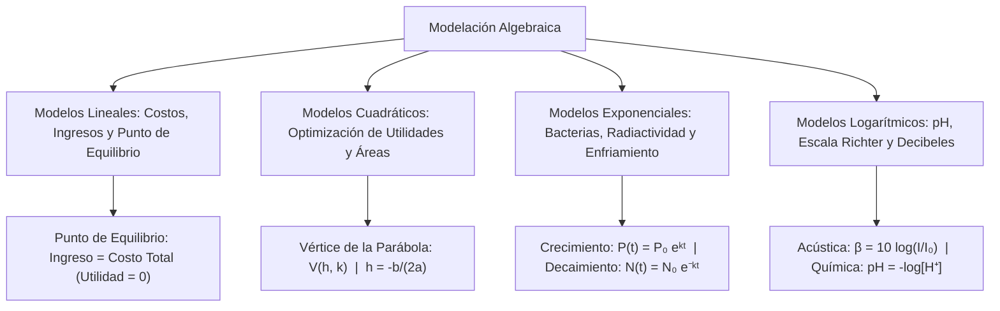

# ÁLGEBRA PREUNIVERSITARIA: CURSO COMPLETO Y SISTEMATIZADO
## EJE 02: MATEMÁTICA — ÁLGEBRA
### TEMA XVI: APLICACIONES Y MODELACIÓN ALGEBRAICA EN CONTEXTOS REALES Y DECO

---

## 1. FICHA TÉCNICA Y MATRIZ DE COMPETENCIAS

| Parámetro | Detalle Institucional |
| :--- | :--- |
| **Resolución Oficial** | Resolución de Consejo Universitario N° 0028-2026 (Admisión UNSA 2027) |
| **Eje Curricular** | Eje 02: Matemática / Modelación Matemática, Optimización y Contexto DECO |
| **Peso Ponderado UNSA** | **Ingenierías:** 1.658337400 pts/preg (4 preg. = 6.63 pts) \| **Biomédicas:** 1.265447400 pts \| **Sociales:** 0.824574000 pts |
| **Frecuencia en Exámenes** | **Máxima (100% en DECO):** Integra todas las áreas del álgebra (lineal, cuadrática, exponencial y logarítmica) en problemas contextualizados de la vida real, economía, física y biología. |
| **Modelos de Examen** | UNSA (Ordinario, CEPREUNSA), UNMSM (Preguntas DECO transversales), UNI (Optimización de sistemas mecánicos y funciones compuestas multivariables). |
| **Competencia Cardinal** | Traducir situaciones problemáticas del entorno social, productivo y científico a modelos algebraicos explícitos, resolviendo mediante optimización cuadrática, puntos de equilibrio y leyes de decaimiento/crecimiento exponencial. |

---

## 2. MAPA TAXONÓMICO Y ONTOLOGÍA DE CONCEPTOS



---

## 3. DESARROLLO TEÓRICO FORMAL (ESTÁNDAR LUMBRERAS / CUZCANO / UNI)

### 3.1. Metodología de la Modelación Algebraica
La **modelación matemática** es el proceso cognitivo formal que transforma una situación de la realidad empírica en un lenguaje simbólico algebraico riguroso:

$$\text{Problema Real} \xrightarrow{\text{Abstracción}} \text{Modelo Algebraico} \xrightarrow{\text{Resolución}} \text{Solución Matemática} \xrightarrow{\text{Validación}} \text{Decisión en la Realidad}$$

---

### 3.2. Modelos Económicos Lineales y Punto de Equilibrio
Sean $q$ las unidades producidas y vendidas:

1. **Costo Total ($C(q)$):**
   $$C(q) = C_f + C_v \cdot q$$
   - $C_f$: Costos Fijos independientes de la producción (alquileres, seguros, salarios administrativos).
   - $C_v$: Costo Variable unitario por fabricar un artículo (materia prima, mano de obra directa).
2. **Ingreso Total ($I(q)$):**
   $$I(q) = p \cdot q$$
   - $p$: Precio de venta unitario.
3. **Utilidad Neta ($U(q)$):**
   $$U(q) = I(q) - C(q) = (p - C_v)q - C_f$$
4. **Punto de Equilibrio Financiero ($q_e$):**
   Es el nivel de producción donde los ingresos cubren con exactitud los costos, sin generar ganancia ni pérdida ($U(q_e) = 0$):
   $$I(q_e) = C(q_e) \implies p \cdot q_e = C_f + C_v \cdot q_e \implies \mathbf{q_e = \frac{C_f}{p - C_v}}$$
   El denominador $(p - C_v)$ se denomina **Margen de Contribución Unitario**.

---

### 3.3. Modelos Cuadráticos y Optimización de la Demanda
En mercados competitivos, el precio no es constante sino que varía en función de la demanda según una ecuación de demanda lineal $p(q) = a - bq$, con $a, b > 0$:

1. **Función de Ingreso Cuadrático:**
   $$I(q) = p(q) \cdot q = (a - bq)q = -b q^2 + a q$$
2. **Optimización (Ingreso Máximo):**
   Como el coeficiente principal es $-b < 0$, la gráfica es una parábola con concavidad hacia abajo:
   - Nivel de producción para el máximo ingreso:
     $$q^* = -\frac{a}{2(-b)} = \frac{a}{2b}$$
   - Ingreso máximo alcanzable:
     $$I_{\max} = I(q^*) = \frac{a^2}{4b}$$

#### Optimización Geométrica de Áreas:
Para cercar una región rectangular con un perímetro fijo de alambre $2p$:
$$2x + 2y = 2p \implies y = p - x$$
$$\text{Área}(x) = x(p - x) = -x^2 + px$$
El área máxima se logra siempre cuando el rectángulo es un **cuadrado**: $x = y = \frac{p}{2} \implies \text{Área}_{\max} = \left(\frac{p}{2}\right)^2$.

---

### 3.4. Modelos Exponenciales Continuos

#### 1. Crecimiento Poblacional (Ley de Thomas Malthus):
$$P(t) = P_0 \cdot e^{kt}, \quad k > 0$$
- $P_0$: Población inicial en $t = 0$.
- $k$: Tasa intrínseca de crecimiento continuo.
- **Tiempo de Duplicación ($t_d$):**
  $$P_0 e^{k t_d} = 2P_0 \implies e^{k t_d} = 2 \implies \mathbf{t_d = \frac{\ln 2}{k}}$$

#### 2. Desintegración Radiactiva y Vida Media:
$$N(t) = N_0 \cdot e^{-\lambda t}, \quad \lambda > 0$$
- $N_0$: Masa inicial del isótopo inestable.
- $\lambda$: Constante de desintegración.
- **Vida Media o Periodo de Semidesintegración ($T_{1/2}$):** Tiempo necesario para que la mitad de los núcleos radiactivos decaiga:
  $$\mathbf{T_{1/2} = \frac{\ln 2}{\lambda}}$$

#### 3. Ley de Enfriamiento de Isaac Newton:
La rapidez de cambio térmico de un cuerpo es proporcional a la diferencia entre su temperatura $T(t)$ y la del medio ambiente $T_m$:
$$T(t) = T_m + (T_0 - T_m) e^{-kt}, \quad k > 0$$

---

### 3.5. Modelos Logarítmicos en las Ciencias

#### 1. Química: Potencial de Hidrógeno (pH)
Medida de acidez o alcalinidad en soluciones acuosas basada en la concentración molar de iones hidronio $[H^+]$:
$$\mathbf{\text{pH} = -\log_{10}[H^+] = \text{colog}[H^+]}$$
- $\text{pH} < 7$: Solución ácida.
- $\text{pH} = 7$: Solución neutra (agua pura a $25^\circ\text{C}$).
- $\text{pH} > 7$: Solución básica o alcalina.

#### 2. Acústica: Nivel de Intensidad Sonora ($\beta$ en Decibeles)
$$\mathbf{\beta = 10 \cdot \log_{10}\left(\frac{I}{I_0}\right)}$$
- $I$: Intensidad de la onda sonora en $\text{W/m}^2$.
- $I_0 = 10^{-12} \text{ W/m}^2$: Umbral de audición humana estándar.

---

## 4. FORMULARIO MAESTRO (LATEX ESTRICTO)

| Fenómeno Modelado | Formulación Matemática | Variables Clave |
| :--- | :--- | :--- |
| **Punto de Equilibrio** | $q_e = \frac{C_f}{p - C_v}$ | $C_f$: costo fijo, $p$: precio, $C_v$: costo var. |
| **Ingreso Cuadrático Máx.** | $I_{\max} = \frac{a^2}{4b} \quad \text{en } q^* = \frac{a}{2b}$ | $p(q) = a - bq$ (Demanda lineal) |
| **Crecimiento Exponencial** | $P(t) = P_0 e^{kt}$ | $t_d = \frac{\ln 2}{k}$ (Tiempo de duplicación) |
| **Decaimiento Radiactivo** | $N(t) = N_0 e^{-\lambda t}$ | $T_{1/2} = \frac{\ln 2}{\lambda}$ (Vida media) |
| **Enfriamiento Newton** | $T(t) = T_m + (T_0 - T_m)e^{-kt}$ | $T_m$: temperatura ambiental |
| **pH Químico** | $\text{pH} = -\log[H^+]$ | $[H^+] = 10^{-\text{pH}}$ |
| **Nivel Sonoro (dB)** | $\beta = 10 \log\left(\frac{I}{10^{-12}}\right)$ | $\beta$ en decibeles |

---

## 5. MNEMOTECNIAS DE COMBATE PREUNIVERSITARIO

### 1. El Trío Económico: "Ingreso es lo que entra, Costo lo que gasta, Utilidad lo que queda"
$$\text{Utilidad} = \text{Ingreso} - \text{Costo}$$
- Si $\text{Utilidad} = 0 \implies \text{PUNTO DE EQUILIBRIO}$ (ni ganas ni pierdes).
- Si $\text{Utilidad} > 0 \implies \text{GANANCIA}$.
- Si $\text{Utilidad} < 0 \implies \text{PÉRDIDA}$.

### 2. Duplicación y Vida Media: "El 0.693 Mágico"
Como $\ln 2 \approx 0.693$:
$$\text{Tiempo} = \frac{0.693}{k}$$
Sirve tanto para saber cuándo se duplica una inversión o bacteria ($k$ positivo), como para saber cuándo se reduce a la mitad un fármaco en el torrente sanguíneo ($\lambda$ de eliminación).

---

## 6. TÉCNICAS Y ARTIFICIOS DE CÁLCULO (HACKING PREUNIVERSITARIO)

### Artificio 1: Duplicación de Potencia Sonora en Decibeles
Si una turbina emite $80\text{ dB}$, ¿cuántos decibeles emiten dos turbinas idénticas funcionando juntas?
**¡Jamás sumes $80 + 80 = 160\text{ dB}$!** Eso destruiría el tímpano humano al instante.
**Hack:** Al duplicar la potencia o intensidad sonora ($2I$), se suma exactamente:
$$10 \log 2 \approx 10(0.30103) \approx +3\text{ dB}$$
Por tanto, dos turbinas emiten: $80 + 3 = \mathbf{83\text{ dB}}$.
Diez turbinas ($10I$) suman exactamente $10 \log 10 = +10\text{ dB} \implies 90\text{ dB}$.

### Artificio 2: Concentración de Hidronio desde el pH
Si te dicen que el agua del río Chili tiene $\text{pH} = 6$ y tras un vertido minero pasa a $\text{pH} = 4$:
**Hack:** Cada unidad de descenso en la escala de pH multiplica la concentración de acidez $[H^+]$ por **$10$**:
$$\text{Descenso de 2 unidades} \implies 10^2 = 100 \text{ veces más ácida}$$

---

## 7. ZONA DE TRAMPAS Y DISTRACTORES ("¡PELIGRO EXAMEN!")

> [!WARNING]
> **Trampa 1: Confundir Producción Óptima con Utilidad Máxima**
> Si el problema pide: *"Halle la utilidad máxima"*, muchos postulantes calculan $q^* = -b/(2a)$ y marcan esa alternativa.
> **¡CUIDADO!** $q^*$ es la **cantidad de artículos** que se deben producir; la **utilidad máxima** es el valor evaluado de la función en ese punto ($U(q^*)$). Lee siempre con lupa la pregunta final.

> [!CAUTION]
> **Trampa 2: Homogeneizar Unidades de Tiempo en Exponenciales**
> Si la tasa $k$ está dada en horas ($k = 0.5 \text{ h}^{-1}$) y te preguntan la población a los $90$ minutos:
> Si reemplazas $t = 90$, el cálculo colapsará con números gigantescos.
> **Debes convertir $90$ minutos a horas:** $t = 1.5$ horas.

---

## 8. APLICACIÓN AL MUNDO REAL Y CONTEXTO DECO

### Tratamiento de Aguas Residuales y Monitoreo del Río Chili (Arequipa)
En la planta de tratamiento de aguas residuales La Enlozada (Arequipa), los ingenieros químicos modelan la neutralización de efluentes industriales mediante la función de pH: $\text{pH} = -\log[H^+]$. Asimismo, la degradación bacteriana de la Demanda Bioquímica de Oxígeno (DBO) en los reactores biológicos sigue una función exponencial decreciente: $\text{DBO}(t) = \text{DBO}_0 e^{-0.15 t}$. El dominio de la modelación algebraica permite a los especialistas de la UNSA y SEDAPAR certificar que el agua devuelta al cauce del río Chili cumpla con los Estándares de Calidad Ambiental (ECA) para riego agrícola en la campiña arequipeña.

---

## 9. BANCO DE 5 EJERCICIOS RESUELTOS GRADUADOS

### Ejercicio 1: Nivel Básico (Punto de Equilibrio Lineal)
**Enunciado:**
Un taller textil en Arequipa fabrica chalecos de lana de alpaca. Los costos fijos mensuales son de $S/\ 6000$ y el costo de fabricar cada chaleco es de $S/\ 40$. Si cada prenda se vende en el mercado artesanal a $S/\ 90$, determine cuántos chalecos deben producirse y venderse al mes para alcanzar el punto de equilibrio.

**Solución paso a paso:**
1. Identificamos los parámetros del modelo lineal:
   - Costos fijos: $C_f = 6000$
   - Costo variable unitario: $C_v = 40$
   - Precio de venta unitario: $p = 90$
2. Formulamos las funciones de costo e ingreso:
   $$C(q) = 6000 + 40q$$
   $$I(q) = 90q$$
3. Establecemos la condición de punto de equilibrio:
   $$I(q) = C(q)$$
   $$90q = 6000 + 40q$$
4. Agrupamos los términos con $q$:
   $$90q - 40q = 6000$$
   $$50q = 6000$$
5. Despejamos el volumen de producción:
   $$q = \frac{6000}{50} = 120 \text{ chalecos}$$

**Respuesta Final:** Se deben producir y vender **$120$ chalecos** al mes.

---

### Ejercicio 2: Nivel Intermedio (Optimización Cuadrática de Cerco)
**Enunciado:**
Un agricultor en Camaná dispone de $240$ metros lineales de malla metálica para cercar un terreno rectangular destinado al cultivo de arroz, aprovechando la orilla recta de un canal de regadío como uno de sus lados (por lo que ese lado no requiere malla). Determine las dimensiones del terreno que maximizan el área cultivable y calcule dicha área máxima.

**Solución paso a paso:**
1. Definimos las variables geométricas:
   - Sea $x$ la longitud de cada uno de los dos lados perpendiculares al canal.
   - Sea $y$ la longitud del lado paralelo al canal.
2. Planteamos la restricción del perímetro con los $240$ metros de malla disponible:
   $$2x + y = 240 \implies y = 240 - 2x$$
3. Formulamos la función de área rectangular a maximizar:
   $$A(x) = x \cdot y = x(240 - 2x) = 240x - 2x^2$$
   $$A(x) = -2x^2 + 240x$$
4. Como es una función cuadrática con $a = -2 < 0$, el área máxima se alcanza en el vértice:
   $$x_{\text{óptimo}} = -\frac{b}{2a} = -\frac{240}{2(-2)} = \frac{240}{4} = 60 \text{ metros}$$
5. Calculamos la dimensión del lado paralelo $y$:
   $$y = 240 - 2(60) = 240 - 120 = 120 \text{ metros}$$
6. Calculamos el área máxima obtenida:
   $$A_{\max} = x \cdot y = 60 \cdot 120 = 7200 \text{ m}^2$$

**Respuesta Final:** Las dimensiones óptimas son **$60\text{ m} \times 120\text{ m}$** y el área máxima es **$7200\text{ m}^2$**.

---

### Ejercicio 3: Nivel Avanzado - UNSA Ordinario (Vida Media Radiactiva)
**Enunciado:**
El Yodo-131 es un isótopo radiactivo utilizado en el Instituto Regional de Enfermedades Neoplásicas (IREN Sur) de Arequipa para el tratamiento del cáncer de tiroides. Su vida media es de $8$ días. Si un hospital recibe un lote de $160\text{ mg}$ de Yodo-131, determine cuántos miligramos quedarán sin desintegrar después de $24$ días.

**Solución paso a paso:**
1. Planteamos la ley de decaimiento radiactivo en función de la vida media $T_{1/2} = 8$ días:
   $$N(t) = N_0 \cdot \left(\frac{1}{2}\right)^{t / T_{1/2}}$$
2. Identificamos los datos del problema:
   - Masa inicial: $N_0 = 160\text{ mg}$
   - Tiempo transcurrido: $t = 24\text{ días}$
   - Vida media: $T_{1/2} = 8\text{ días}$
3. Calculamos el número de periodos de semidesintegración transcurridos:
   $$n = \frac{t}{T_{1/2}} = \frac{24}{8} = 3 \text{ vidas medias}$$
4. Calculamos la masa remanente $N(24)$:
   $$N(24) = 160 \cdot \left(\frac{1}{2}\right)^3 = 160 \cdot \frac{1}{8} = 20\text{ mg}$$

**Respuesta Final:** Quedarán **$20\text{ mg}$** de Yodo-131.

---

### Ejercicio 4: Nivel San Marcos DECO (Nivel de Decibeles en Tráfico)
**Enunciado:**
El nivel de intensidad sonora generado por el tráfico de combis en la avenida Ejército de Arequipa es de $80\text{ dB}$, mientras que en una zona residencial tranquila de Cayma es de $50\text{ dB}$. Determine cuántas veces más intensa es la onda de presión sonora en la avenida Ejército en comparación con la zona residencial.

**Solución paso a paso:**
1. Recordamos la definición del nivel de decibeles:
   $$\beta = 10 \log_{10}\left(\frac{I}{I_0}\right)$$
2. Despejamos el cociente de intensidades para cada sector:
   $$\frac{\beta}{10} = \log_{10}\left(\frac{I}{I_0}\right) \implies \frac{I}{I_0} = 10^{\beta / 10} \implies I = I_0 \cdot 10^{\beta / 10}$$
3. Calculamos la intensidad para la avenida Ejército ($I_1$ con $\beta_1 = 80\text{ dB}$):
   $$I_1 = I_0 \cdot 10^{80/10} = I_0 \cdot 10^8$$
4. Calculamos la intensidad para la zona residencial ($I_2$ con $\beta_2 = 50\text{ dB}$):
   $$I_2 = I_0 \cdot 10^{50/10} = I_0 \cdot 10^5$$
5. Calculamos la razón entre ambas intensidades:
   $$\text{Razón} = \frac{I_1}{I_2} = \frac{I_0 \cdot 10^8}{I_0 \cdot 10^5} = 10^{8 - 5} = 10^3 = 1000$$

**Respuesta Final:** El sonido en la avenida Ejército es **$1000$ veces más intenso**.

---

### Ejercicio 5: Nivel Boss Challenge - Estilo UNI (Optimización de Monopolio No Lineal)
**Enunciado:**
Una empresa de software en Arequipa comercializa un sistema de gestión empresarial en la nube para empresas mineras. La función de demanda mensual del mercado está dada por $p = 400 - 2q$, donde $p$ es el precio de suscripción mensual en dólares por empresa y $q$ es el número de suscripciones vendidas. La función de costo total mensual de servidores y soporte técnico es $C(q) = q^2 + 40q + 1200$. Determine el precio $p^*$ que maximiza la utilidad neta mensual y el valor de dicha utilidad máxima.

**Solución paso a paso:**
1. Formulamos la función de Ingreso Total $I(q)$:
   $$I(q) = p \cdot q = (400 - 2q)q = 400q - 2q^2$$
2. Formulamos la función de Utilidad Neta $U(q) = I(q) - C(q)$:
   $$U(q) = (400q - 2q^2) - (q^2 + 40q + 1200)$$
   $$U(q) = 400q - 2q^2 - q^2 - 40q - 1200$$
   $$U(q) = -3q^2 + 360q - 1200$$
3. Como es una función cuadrática con $a = -3 < 0$, el máximo absoluto se ubica en el vértice:
   $$q^* = -\frac{b}{2a} = -\frac{360}{2(-3)} = \frac{360}{6} = 60 \text{ suscripciones}$$
4. Calculamos el precio óptimo $p^*$ reemplazando $q^* = 60$ en la función de demanda:
   $$p^* = 400 - 2(60) = 400 - 120 = \$280 \text{ mensuales}$$
5. Calculamos la utilidad neta máxima evaluando $U(60)$:
   $$U(60) = -3(60)^2 + 360(60) - 1200$$
   $$U(60) = -3(3600) + 21\ 600 - 1200 = -10\ 800 + 21\ 600 - 1200 = 9600 \text{ dólares}$$

**Respuesta Final:** El precio óptimo es de **$\$280$** mensuales y la utilidad máxima es de **$\$9600$**.

---

## 10. GLOSARIO DE 10 TÉRMINOS CLAVE

1. **Modelación Matemática:** Proceso de traducción de un problema físico, económico o biológico a ecuaciones algebraicas.
2. **Punto de Equilibrio:** Nivel de actividad productiva donde los ingresos igualan con precisión a los costos totales.
3. **Costo Fijo:** Gasto operativo constante que no depende del volumen de producción.
4. **Costo Variable:** Gasto que se incrementa en proporción directa con el número de unidades producidas.
5. **Margen de Contribución:** Diferencia entre el precio de venta unitario y el costo variable unitario ($p - C_v$).
6. **Optimización Cuadrática:** Búsqueda del valor máximo o mínimo analítico de una función parabólica mediante su vértice.
7. **Tiempo de Duplicación:** Periodo requerido para que una magnitud en crecimiento exponencial duplique su valor original ($\frac{\ln 2}{k}$).
8. **Vida Media ($T_{1/2}$):** Lapso temporal en el cual una muestra radiactiva se reduce a la mitad de su masa activa.
9. **Decibel ($\text{dB}$):** Unidad logarítmica adimensional para medir el nivel de intensidad sonora relativo al umbral auditivo.
10. **pH (Potencial de Hidrógeno):** Medida logarítmica de la concentración molar de iones hidronio en una disolución acuosa.

---

## 11. BANCO DE FLASHCARDS (ANVERSO / REVERSO)

- **Flashcard 1:**
  - *Anverso:* ¿Cómo se calcula el punto de equilibrio $q_e$ a partir de costos fijos $C_f$, precio $p$ y costo variable unitario $C_v$?
  - *Reverso:* $q_e = \frac{C_f}{p - C_v}$.
- **Flashcard 2:**
  - *Anverso:* ¿En qué punto se alcanza el ingreso máximo si la demanda es lineal $p = a - bq$?
  - *Reverso:* En $q^* = \frac{a}{2b}$.
- **Flashcard 3:**
  - *Anverso:* ¿Cuál es la relación matemática entre la vida media $T_{1/2}$ y la constante de desintegración radiactiva $\lambda$?
  - *Reverso:* $T_{1/2} = \frac{\ln 2}{\lambda} \approx \frac{0.693}{\lambda}$.
- **Flashcard 4:**
  - *Anverso:* ¿Cómo se define el pH químico de una disolución?
  - *Reverso:* $\text{pH} = -\log_{10}[H^+]$.
- **Flashcard 5:**
  - *Anverso:* Si la intensidad de un sonido se multiplica por $10$, ¿en cuántos decibeles se incrementa su nivel sonoro?
  - *Reverso:* Se incrementa exactamente en $+10\text{ dB}$.

---

## 12. MOTOR DE GAMIFICACIÓN (JSON PARA KOTLIN MULTIPLATFORM)

```json
{
  "topicId": "alg_16_aplicaciones_modelacion",
  "title": "Aplicaciones y Modelación Algebraica en Contextos Reales y DECO",
  "subject": "algebra",
  "xpReward": 450,
  "level": "EXPERT",
  "badges": [
    {
      "id": "deco_champion",
      "name": "Campeón DECO Multidisciplinario",
      "description": "Modelaste problemas complejos de economía, química y física resolviendo vértices y tasas continuas."
    }
  ],
  "questions": [
    {
      "id": "q1",
      "statement": "Si los costos fijos son 2000 soles, el costo variable 30 soles y el precio de venta 50 soles, ¿cuál es el punto de equilibrio?",
      "options": ["100 unidades", "50 unidades", "200 unidades", "40 unidades"],
      "correctIndex": 0,
      "explanation": "q_e = C_f / (p - C_v) = 2000 / (50 - 30) = 2000 / 20 = 100 unidades."
    },
    {
      "id": "q2",
      "statement": "Si una sustancia radiactiva tiene vida media de 5 días, ¿qué fracción de la masa original queda tras 15 días?",
      "options": ["1/8", "1/4", "1/16", "1/2"],
      "correctIndex": 0,
      "explanation": "Han pasado 15 / 5 = 3 vidas medias. La fraccion restante es (1/2)^3 = 1/8."
    }
  ]
}
```
