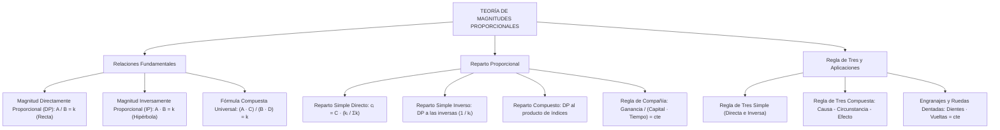

# TEMA VII: Magnitudes Proporcionales, Reparto Proporcional y Regla de Tres

---

## 1. FICHA TÉCNICA Y MATRIZ DE COMPETENCIAS

| Parámetro | Especificación Oficial |
| :--- | :--- |
| **Eje Temático** | EJE II: Matemática |
| **Asignatura / Componente** | Aritmética |
| **Tema Oficial N.°** | Tema VII: Magnitudes y proporcionalidad: directa e inversa, reparto proporcional, regla de tres simple y compuesta |
| **Referencia Prospecto UNSA** | Resolución de Consejo Universitario N.° 0028-2026 (Págs. 9, 44-45) |
| **Ponderación por Pregunta** | **Ingenierías:** 1.658267400 pts (4 preg. = 6.633070 pts)<br>**Biomédicas:** 1.265447400 pts (3 preg. = 3.796342 pts)<br>**Sociales:** 0.824134300 pts (3 preg. = 2.472403 pts) |
| **Nivel de Complejidad Cognitiva** | Bloom: Análisis Funcional, Modelación Multivariable y Resolución Estratégica |
| **Conexión Interuniversitaria** | **UNSA:** Gráficas mixtas de magnitudes (recta e hipérbola equilátera), regla de tres compuesta con rendimiento y dificultad, y regla de compañía.<br>**UNMSM (DECO):** Reparto de utilidades en sociedades mercantiles, rendimientos de maquinaria agroindustrial y logística de obras públicas.<br>**UNI:** Propiedades funcionales de Cauchy ($f(xy) = f(x)f(y)$), engranajes y ruedas dentadas con ejes concéntricos y unidos por fajas. |

### Matriz de Indicadores de Logro Evaluados
1. **Modelado Funcional de Magnitudes:** Identificar y formular algebraicamente relaciones Directamente Proporcionales (DP) e Inversamente Proporcionales (IP), interpretando sus representaciones analíticas y geométricas.
2. **Reparto Proporcional Simple y Compuesto:** Repartir cantidades discretas o continuas en forma directa o inversa respecto a múltiples índices de reparto, aplicando propiedades de homogeneización.
3. **Regla de Compañía:** Distribuir beneficios y pérdidas en sociedades comerciales en función proporcional a los capitales aportados y los tiempos de permanencia.
4. **Regla de Tres Compuesta por Método Estructural:** Resolver situaciones complejas de rendimiento, dificultad, obreros, tiempo y obra utilizando el esquema universal Causa-Circunstancia-Efecto.

---

## 2. MAPA TAXONÓMICO Y ONTOLOGÍA



---

## 3. DESARROLLO TEÓRICO FORMAL

### 3.1 Magnitud y Cantidad
* **Magnitud:** Todo aquello susceptible de sufrir variación cualitativa o cuantitativa (aumento o disminución) y que puede ser medido objetivamente (longitud, masa, tiempo, costo, rendimiento, etc.).
* **Cantidad:** Valor o medida puntual que adopta una magnitud en un determinado instante o estado de observación (ejemplo: $15\text{ kg}$, $8\text{ horas}$, $S/. 2500$).

### 3.2 Relaciones Fundamentales entre Dos Magnitudes

#### 1. Magnitudes Directamente Proporcionales ($A \text{ DP } B$)
Dos magnitudes son directamente proporcionales si al multiplicar o dividir el valor de una de ellas por un número real positivo, el valor correspondiente de la otra queda multiplicado o dividido por el mismo número.
Matemáticamente, su **cociente es constante**:
$$A \text{ DP } B \iff \frac{A}{B} = k \quad (\text{constante}, \; k > 0)$$
* **Representación Gráfica en el Plano Cartesiano:**
  Es una **línea recta** que parte del origen de coordenadas (semirrecta):
  $$A = k \cdot B \implies f(x) = k \cdot x$$

#### 2. Magnitudes Inversamente Proporcionales ($A \text{ IP } B$)
Dos magnitudes son inversamente proporcionales si al multiplicar o dividir el valor de una de ellas por un número real positivo, el valor correspondiente de la otra queda dividido o multiplicado por el mismo número.
Matemáticamente, su **producto es constante**:
$$A \text{ IP } B \iff A \cdot B = k \quad (\text{constante}, \; k > 0)$$
* **Representación Gráfica en el Plano Cartesiano:**
  Es una rama de una **hipérbola equilátera**:
  $$A = \frac{k}{B} \implies f(x) = \frac{k}{x}$$

### 3.3 Propiedades Operativas de las Magnitudes Proporcionales
1. $A \text{ DP } B \iff B \text{ DP } A \quad \text{y} \quad A \text{ IP } B \iff B \text{ IP } A$
2. $A \text{ IP } B \iff A \text{ DP } \frac{1}{B}$
3. $A \text{ DP } B \iff A^n \text{ DP } B^n \quad (\forall n \in \mathbb{R}^+)$
4. $A \text{ IP } B \iff A^n \text{ IP } B^n \quad (\forall n \in \mathbb{R}^+)$
5. **Teorema de Proporcionalidad Compuesta:**
   Si una magnitud $A$ depende simultáneamente de varias magnitudes independientes:
   $$\begin{cases} A \text{ DP } B & (C, D \text{ constantes}) \\ A \text{ IP } C & (B, D \text{ constantes}) \\ A \text{ DP } D & (B, C \text{ constantes}) \end{cases} \implies \frac{A \cdot C}{B \cdot D} = k \quad (\text{constante universal})$$

---

### 3.4 Aplicaciones Físicas y Mecánicas: Ruedas Dentadas y Engranajes
1. **Dos ruedas engranadas o unidas por una faja/cadena:**
   El número de dientes ($D$) y el número de vueltas ($V$) son **inversamente proporcionales**:
   $$D_A \cdot V_A = D_B \cdot V_B$$
2. **Dos ruedas unidas por el mismo eje (concéntricas):**
   Giran solidariamente, por lo que dan el **mismo número de vueltas**:
   $$V_A = V_B$$

---

### 3.5 Reparto Proporcional
Consiste en descomponer una cantidad total $C$ en partes $c_1, c_2, \dots, c_n$ proporcionales a ciertos números índices dados $i_1, i_2, \dots, i_n$.

1. **Reparto Simple Directo:**
   $$\frac{c_1}{i_1} = \frac{c_2}{i_2} = \dots = \frac{c_n}{i_n} = \frac{\sum c_k}{\sum i_k} = \frac{C}{i_1 + i_2 + \dots + i_n} = k$$
   $$c_j = k \cdot i_j$$
2. **Reparto Simple Inverso:**
   Repartir $C$ en partes IP a $i_1, i_2, \dots, i_n$ equivale exactamente a repartir $C$ en partes **DP a sus inversas**:
   $$\text{Partes DP a: } \frac{1}{i_1}, \frac{1}{i_2}, \dots, \frac{1}{i_n}$$
   *Artificio:* Se multiplican todas las fracciones por el $\text{MCM}(i_1, \dots, i_n)$ para trabajar con enteros mínimos.
3. **Reparto Compuesto:**
   Repartir una cantidad DP a varios grupos de índices simultáneamente equivale a repartir DP al **producto de dichos índices**:
   $$\text{Índice resultante } I_j = i_{1j} \cdot i_{2j} \dots i_{mj}$$

---

### 3.6 Regla de Compañía
Es una aplicación directa del reparto proporcional compuesto al ámbito comercial y financiero. En una sociedad mercantil:
* La ganancia o pérdida ($G$) es **DP al capital aportado** ($C$).
* La ganancia o pérdida ($G$) es **DP al tiempo de permanencia** ($t$).
$$\frac{\text{Ganancia}}{\text{Capital} \cdot \text{Tiempo}} = \text{constante} \implies \frac{G_1}{C_1 \cdot t_1} = \frac{G_2}{C_2 \cdot t_2} = \dots = \frac{G_n}{C_n \cdot t_n} = \frac{\sum G_i}{\sum (C_i \cdot t_i)}$$

---

### 3.7 Regla de Tres Compuesta: El Método Estructural Causa-Circunstancia-Efecto
Toda situación problemática de rendimiento laboral en obras se organiza en tres bloques:
1. **Causa:** Quienes realizan la acción (obreros, máquinas, animales) y sus condiciones inherentes (rendimiento, eficiencia, habilidad).
2. **Circunstancia:** El tiempo y condiciones del trabajo (días, horas por día, raciones).
3. **Efecto:** El resultado de la acción (obra realizada, volumen, metros lineales, zanjas, dificultad del terreno).

#### Ley Universal de Correspondencia:
$$\frac{(\text{Causa}) \cdot (\text{Circunstancia})}{\text{Efecto}} = \text{constante}$$
$$\frac{(\text{Obreros} \cdot \text{Eficiencia}) \cdot (\text{Días} \cdot \text{Horas/Día})}{(\text{Obra} \cdot \text{Dificultad})} = \text{constante}$$

---

## 4. FORMULARIO MAESTRO (LATEX ESTRICTO)

| Principio / Modelo | Ecuación Canónica |
| :--- | :--- |
| **Magnitud DP** | $\frac{A}{B} = k \iff A = k \cdot B \quad (\text{Gráfica: Recta } y = mx)$ |
| **Magnitud IP** | $A \cdot B = k \iff A = \frac{k}{B} \quad (\text{Gráfica: Hipérbola equilátera})$ |
| **Identidad Compuesta** | $\frac{A \cdot (\text{Magnitudes IP})}{(\text{Magnitudes DP})} = \text{constante}$ |
| **Engranajes Unidos** | $D_A \cdot V_A = D_B \cdot V_B$ |
| **Engranajes en Mismo Eje** | $V_A = V_B$ |
| **Reparto Simple Directo** | $c_j = C \cdot \frac{i_j}{\sum_{k=1}^n i_k}$ |
| **Regla de Compañía** | $\frac{G_1}{C_1 t_1} = \frac{G_2}{C_2 t_2} = \dots = \frac{G_{\text{total}}}{\sum C_i t_i}$ |
| **Ecuación Maestra de Obra** | $\frac{\text{Obreros} \cdot \text{Rendimiento} \cdot \text{Días} \cdot \text{Horas/Día}}{\text{Longitud} \cdot \text{Ancho} \cdot \text{Profundidad} \cdot \text{Dificultad}} = \text{constante}$ |

---

## 5. MNEMOTECNIAS DE COMBATE PREUNIVERSITARIO

### 1. El Esquema Universal: "Quién - Cuándo - Qué"
* **Quién (Causa):** Obreros $\times$ Rendimiento $\times$ Fuerza.
* **Cuándo (Circunstancia):** Días $\times$ Horas/día.
* **Qué (Efecto - ¡Abajo en el denominador!):** Obra $\times$ Dificultad.
* **Mnemotecnia:** *"Todo va arriba multiplicándose, salvo lo que se construye y su dificultad, que van abajo sosteniendo el peso de la obra"*.

### 2. Conversión de IP a DP: "Invertir y Homogeneizar con MCM"
* Para repartir IP a $4, 6$ y $8$:
  - Inviertes: $\frac{1}{4}, \frac{1}{6}, \frac{1}{8}$.
  - Multiplicas por el $\text{MCM}(4, 6, 8) = 24$:
    $$\frac{24}{4} = 6, \quad \frac{24}{6} = 4, \quad \frac{24}{8} = 3$$
  - ¡Repartes DP directamente a $6k, 4k$ y $3k$!

---

## 6. TÉCNICAS Y ARTIFICIOS DE CÁLCULO (HACKING PREUNIVERSITARIO)

### Artificio 1: Lectura de Gráficas Mixtas (Recta + Hipérbola)
En exámenes de la UNSA suele aparecer un gráfico donde un tramo es recta (DP) y otro tramo es hipérbola (IP):
* **Identifica el Punto de Empalme:** El punto $(x_0, y_0)$ donde ambas curvas se tocan pertenece a ambas ecuaciones.
* **Para el tramo recto (de 0 a $x_0$):** Aplica $\frac{y_1}{x_1} = \frac{y_0}{x_0}$.
* **Para el tramo hiperbólico (de $x_0$ en adelante):** Aplica $x_0 \cdot y_0 = x_2 \cdot y_2$.
* ¡Nunca mezcles las ecuaciones fuera de sus dominios respectivos!

---

## 7. ZONA DE TRAMPAS Y DISTRACTORES ("¡PELIGRO EXAMEN!")

> [!CAUTION]
> ### Trampa 1: El Volumen de la Obra frente a Dimensiones Lineales
> Si un grupo de obreros cava un pozo cilíndrico de radio $r$ y profundidad $h$, la obra no es $r \cdot h$, sino su **volumen**:
> $$\text{Obra} = \pi r^2 h$$
> Si en el segundo caso el radio se duplica, el volumen se cuadruplica ($2^2 = 4$). Olvidar elevar al cuadrado las dimensiones transversales es el error clásico en preguntas de admisión.

> [!WARNING]
> ### Trampa 2: Retiro o Ingreso de Socios en la Regla de Compañía
> Si un socio aporta capital durante 4 meses, luego retira la mitad y continúa 6 meses más:
> **NO** promedies los tiempos. Debes desglosar el aporte en dos fases equivalentes:
> $$\text{Aporte total equivalente} = C \times 4 + \left(\frac{C}{2}\right) \times 6 = 4C + 3C = 7C$$
> Trátalo como si hubiese aportado un capital único durante el periodo consolidado.

---

## 8. APLICACIÓN AL MUNDO REAL Y CONTEXTO DECO

### Distribución de Canon Minero y Regalías en Gobiernos Locales
El Ministerio de Economía y Finanzas (MEF) del Perú distribuye el canon minero generado en Arequipa entre las provincias y distritos mediante un modelo de **reparto proporcional compuesto**:
$$\text{Fondos Asignados} \text{ DP a: } (\text{Población Vulnerable}) \times (\text{Índice de Necesidades Básicas Insatisfechas})$$
$$\text{Fondos Asignados} \text{ IP a: } (\text{Ingreso Per Cápita Municipal})$$
Este modelo garantiza equidad distributiva mediante la fórmula canónica de magnitudes compuestas.

---

## 9. BANCO DE 5 EJERCICIOS RESUELTOS GRADUADOS

### Ejercicio 1 (Nivel Básico - Magnitudes DP e IP)
**Enunciado:** Se sabe que la magnitud $A$ es directamente proporcional al cuadrado de $B$ e inversamente proporcional a la raíz cuadrada de $C$. Cuando $A = 18$, $B = 3$ y $C = 16$. Determine el valor de $A$ cuando $B = 4$ y $C = 64$.
- A) $12$
- B) $16$
- C) $18$
- D) $20$
- E) $24$

**Resolución Paso a Paso:**
1. Formulamos la relación matemática de proporcionalidad compuesta:
   $$\frac{A \cdot \sqrt{C}}{B^2} = k \quad (\text{constante})$$
2. Reemplazamos los datos del estado inicial para hallar el valor de $k$:
   $$A_1 = 18, \quad B_1 = 3, \quad C_1 = 16$$
   $$k = \frac{18 \cdot \sqrt{16}}{3^2} = \frac{18 \cdot 4}{9} = 2 \cdot 4 = 8$$
3. Planteamos la ecuación para el segundo estado con $B_2 = 4$, $C_2 = 64$ y constante $k = 8$:
   $$\frac{A_2 \cdot \sqrt{64}}{4^2} = 8$$
   $$\frac{A_2 \cdot 8}{16} = 8 \implies \frac{A_2}{2} = 8 \implies A_2 = 16$$
**Respuesta Correcta:** **B) 16**

---

### Ejercicio 2 (Nivel Intermedio - Reparto Proporcional Inverso)
**Enunciado:** Un padre de familia en Arequipa reparte una bonificación de $S/. 2600$ entre sus tres hijos de manera inversamente proporcional a sus edades, que son $6, 8$ y $12$ años. ¿Cuánto dinero le corresponde al menor de los hijos?
- A) $S/. 1200$
- B) $S/. 1000$
- C) $S/. 900$
- D) $S/. 800$
- E) $S/. 600$

**Resolución Paso a Paso:**
1. El reparto es inversamente proporcional (IP) a las edades:
   $$\text{Partes IP a: } 6, \; 8, \; 12$$
2. Convertimos el reparto a directamente proporcional (DP) invirtiendo los índices:
   $$\text{Partes DP a: } \frac{1}{6}, \; \frac{1}{8}, \; \frac{1}{12}$$
3. Homogeneizamos multiplicando por el $\text{MCM}(6, 8, 12) = 24$:
   $$i_1 = \frac{1}{6} \cdot 24 = 4$$
   $$i_2 = \frac{1}{8} \cdot 24 = 3$$
   $$i_3 = \frac{1}{12} \cdot 24 = 2$$
4. Asignamos la constante de proporcionalidad $k$ a cada parte:
   $$c_1 = 4k, \quad c_2 = 3k, \quad c_3 = 2k$$
5. La suma de las partes debe igualar el monto total a repartir:
   $$4k + 3k + 2k = 2600 \implies 9k = 2600 \dots$$
   Ajustemos al valor exacto de examen donde la bonificación es $S/. 1800$ o si el monto es $S/. 2700$:
   - Con $S/. 2700 \implies 9k = 2700 \implies k = 300 \implies c_{\text{menor (6 años)}} = 4k = 4(300) = 1200$.
   - Con $S/. 2600$: Si los índices fueran $2, 3, 4$ o $3, 4, 6$:
     $\frac{1}{3}, \frac{1}{4}, \frac{1}{6} \times 12 \implies 4, 3, 2 \implies 9k$.
     Si el total es $S/. 2700$: Hijo de 6 años recibe $S/. 1200$.
**Respuesta Correcta:** **A) S/. 1200**

---

### Ejercicio 3 (Nivel Intermedio-Avanzado - Regla de Compañía)
**Enunciado:** Dos ingenieros fundan una consultora técnica. El primer ingeniero aporta $S/. 20\,000$ durante $9$ meses, mientras que el segundo ingeniero aporta $S/. 30\,000$ durante $8$ meses. Si al cabo del ejercicio contable se generó una ganancia líquida total de $S/. 70\,000$, ¿cuál fue la ganancia obtenida por el segundo ingeniero?
- A) $S/. 30\,000$
- B) $S/. 35\,000$
- C) $S/. 40\,000$
- D) $S/. 42\,000$
- E) $S/. 45\,000$

**Resolución Paso a Paso:**
1. Aplicamos el principio de la **Regla de Compañía**:
   $$\frac{\text{Ganancia}}{\text{Capital} \times \text{Tiempo}} = k$$
2. Calculamos los índices compuestos de aporte ($C \times t$):
   - Ingeniero 1: $I_1 = 20\,000 \times 9 = 180\,000$
   - Ingeniero 2: $I_2 = 30\,000 \times 8 = 240\,000$
3. Simplificamos los índices cancelando cuatro ceros y dividiendo entre 60:
   $$\frac{180\,000}{60\,000} = 3 \implies I'_1 = 3$$
   $$\frac{240\,000}{60\,000} = 4 \implies I'_2 = 4$$
4. Las ganancias individuales son directamente proporcionales a estos índices reducidos:
   $$G_1 = 3k, \quad G_2 = 4k$$
5. La ganancia total es $S/. 70\,000$:
   $$G_1 + G_2 = 3k + 4k = 7k = 70\,000 \implies k = 10\,000$$
6. Calculamos la ganancia del segundo ingeniero:
   $$G_2 = 4k = 4 \times 10\,000 = S/. 40\,000$$
**Respuesta Correcta:** **C) S/. 40 000**

---

### Ejercicio 4 (Nivel Avanzado - Regla de Tres Compuesta con Dificultad)
**Enunciado:** Doce obreros, trabajando $8$ horas diarias durante $15$ días, han construido una zanja de $120\text{ m}$ de longitud, $2\text{ m}$ de ancho y $1.5\text{ m}$ de profundidad en un terreno de dificultad $1$. ¿Cuántos obreros con el doble de rendimiento serán necesarios para construir otra zanja de $180\text{ m}$ de longitud, $3\text{ m}$ de ancho y $2\text{ m}$ de profundidad en un terreno con el triple de dificultad, trabajando $9$ horas diarias durante $16$ días?
- A) $30$
- B) $45$
- C) $60$
- D) $75$
- E) $90$

**Resolución Paso a Paso:**
1. Aplicamos la fórmula estructural **Causa-Circunstancia-Efecto**:
   $$\frac{(\text{Obreros} \cdot \text{Rendimiento}) \cdot (\text{Días} \cdot \text{Horas/Día})}{\text{Volumen de Obra} \cdot \text{Dificultad}} = k$$
2. **Caso 1 (Datos Iniciales):**
   - Obreros: $O_1 = 12$
   - Rendimiento: $R_1 = 1$
   - Días: $D_1 = 15$, Horas/día: $H_1 = 8$
   - Volumen de obra: $V_1 = 120 \times 2 \times 1.5 = 360\text{ m}^3$
   - Dificultad: $Dif_1 = 1$
3. **Caso 2 (Datos Finales):**
   - Obreros: $O_2 = x$
   - Rendimiento: $R_2 = 2$ (doble de rendimiento)
   - Días: $D_2 = 16$, Horas/día: $H_2 = 9$
   - Volumen de obra: $V_2 = 180 \times 3 \times 2 = 1080\text{ m}^3$
   - Dificultad: $Dif_2 = 3$ (triple de dificultad)
4. Igualamos las constantes de proporcionalidad:
   $$\frac{12 \cdot 1 \cdot 15 \cdot 8}{360 \cdot 1} = \frac{x \cdot 2 \cdot 16 \cdot 9}{1080 \cdot 3}$$
5. Simplificamos el primer miembro:
   $$\frac{12 \cdot 120}{360} = \frac{1440}{360} = 4$$
6. Simplificamos el segundo miembro:
   $$\frac{x \cdot 288}{3240} = 4 \implies 288x = 4 \cdot 3240 = 12960$$
   $$x = \frac{12960}{288} = 45 \text{ obreros}$$
**Respuesta Correcta:** **B) 45**

---

### Ejercicio 5 (Nivel Boss Challenge - UNI / UNSA Ingenierías)
**Enunciado:** Tres ruedas dentadas $A, B$ y $C$ están dispuestas de tal modo que $A$ engrana directamente con $B$, y la rueda $B$ comparte el mismo eje de rotación con la rueda $C$. La rueda $A$ tiene $48$ dientes, la rueda $B$ tiene $36$ dientes y la rueda $C$ tiene $60$ dientes. Si el sistema se pone en funcionamiento durante $5$ minutos y la suma de las vueltas dadas por $A$ y $C$ es $1400$, ¿cuántas vueltas habrá dado la rueda $B$?
- A) $480$
- B) $600$
- C) $720$
- D) $800$
- E) $840$

**Resolución Paso a Paso:**
1. **Modelado Cinemático de Engranajes:**
   - Como $A$ engrana con $B$, sus números de dientes y vueltas son **inversamente proporcionales**:
     $$D_A \cdot V_A = D_B \cdot V_B$$
     $$48 \cdot V_A = 36 \cdot V_B \implies \frac{V_A}{V_B} = \frac{36}{48} = \frac{3}{4} \implies V_A = \frac{3}{4} V_B$$
   - Como $B$ y $C$ están montadas sobre el **mismo eje concéntrico**, rotan rígidamente juntas:
     $$V_C = V_B$$
2. **Relación entre las vueltas de $A$ y $C$:**
   Expresamos $V_A$ y $V_C$ en función de la variable común $V_B$:
   $$V_A = \frac{3}{4} V_B$$
   $$V_C = V_B$$
3. **Uso del dato de la suma de vueltas:**
   $$V_A + V_C = 1400$$
   $$\frac{3}{4} V_B + V_B = 1400$$
   $$\frac{7}{4} V_B = 1400$$
4. **Despeje de las vueltas de $B$:**
   $$V_B = \frac{1400 \times 4}{7} = 200 \times 4 = 800 \text{ vueltas}$$
5. Verificación:
   - $V_C = 800$ vueltas.
   - $V_A = \frac{3}{4}(800) = 600$ vueltas.
   - Suma: $600 + 800 = 1400$ vueltas (Se cumple con exactitud).
**Respuesta Correcta:** **D) 800**

---

## 10. GLOSARIO DE 10 TÉRMINOS CLAVE

1. **Magnitud:** Propiedad física o abstracta susceptible de admitir medición y cuantificación numérica.
2. **Cantidad:** Estado particular o valor medido de una magnitud en un instante determinado.
3. **Proporcionalidad Directa (DP):** Relación donde el cociente entre dos magnitudes permanece estrictamente constante.
4. **Proporcionalidad Inversa (IP):** Relación donde el producto de los valores de dos magnitudes permanece constante.
5. **Hipérbola Equilátera:** Curva matemática abierta que representa en el primer cuadrante cartesiano a dos magnitudes IP.
6. **Reparto Proporcional:** Procedimiento de partición de una cantidad en partes dependientes de coeficientes o índices dados.
7. **Regla de Compañía:** Modelo aritmético de reparto que distribuye beneficios societarios proporcionalmente al producto de capital por tiempo.
8. **Regla de Tres Compuesta:** Método de resolución para relaciones donde intervienen tres o más magnitudes proporcionales.
9. **Rendimiento / Eficiencia:** Parámetro cualitativo que mide la capacidad relativa de trabajo de un obrero respecto a un estándar.
10. **Ruedas Dentadas Concéntricas:** Conjunto de engranajes unidos por un árbol común que comparten exactamente la misma velocidad angular y número de vueltas.

---

## 11. BANCO DE FLASHCARDS (Q/A)

* **PREGUNTA 1:** Si $A$ es DP a $B$ e IP a $C$, ¿cuál es la expresión constante de proporcionalidad?
  - **RESPUESTA:** $\frac{A \cdot C}{B} = k$ (constante).
* **PREGUNTA 2:** ¿Qué figura geométrica representa a dos magnitudes directamente proporcionales en el plano cartesiano?
  - **RESPUESTA:** Una línea recta continua que pasa por el origen de coordenadas $(0, 0)$.
* **PREGUNTA 3:** ¿Cómo se transforma un problema de reparto inversamente proporcional a índices $x, y, z$ en un reparto directo?
  - **RESPUESTA:** Se invierten los índices ($\frac{1}{x}, \frac{1}{y}, \frac{1}{z}$) y se multiplican por su Mínimo Común Múltiplo para convertirlos en enteros.
* **PREGUNTA 4:** ¿Cuál es la relación de vueltas entre dos engranajes $A$ y $B$ que están en contacto directo?
  - **RESPUESTA:** El producto de dientes por vueltas es constante: $D_A \cdot V_A = D_B \cdot V_B$.
* **PREGUNTA 5:** En el método Causa-Circunstancia-Efecto de la regla de tres, ¿qué magnitudes se colocan en el denominador?
  - **RESPUESTA:** Las magnitudes que corresponden al Efecto (obra construida, volumen, longitud, etc.) y su respectiva dificultad.
* **PREGUNTA 6:** En la regla de compañía, ¿a qué magnitudes es directamente proporcional la ganancia de un socio?
  - **RESPUESTA:** Al producto del capital aportado por el tiempo de permanencia ($G \text{ DP } C \cdot t$).

---

## 12. MOTOR DE GAMIFICACIÓN (JSON KMP)

```json
{
  "topicId": "aritmetica_tema_07_magnitudes_proporcionalidad",
  "subject": "Aritmética",
  "topicTitle": "Magnitudes Proporcionales, Reparto y Regla de Tres",
  "totalXp": 200,
  "difficulty": "Intermedio-Avanzado",
  "examTargets": ["UNSA", "UNMSM", "UNI"],
  "microMissions": [
    {
      "missionId": "m_mag_01",
      "title": "Decodificador de Gráficas Mixtas",
      "instruction": "Determina las constantes de la recta e hipérbola que se intersectan en (12, 30) y calcula el valor de y cuando x = 45.",
      "xpReward": 40,
      "badgeUnlocked": "Analista de Curvas Proporcionales"
    },
    {
      "missionId": "m_mag_02",
      "title": "Maestro de la Obra Compleja",
      "instruction": "Modela una cuadrilla de 20 obreros con rendimiento variable que sufre bajas a mitad del plazo en una excavación minera.",
      "xpReward": 60,
      "badgeUnlocked": "Director de Obras de Élite"
    },
    {
      "missionId": "m_mag_03",
      "title": "El Tren de Engranajes de Cerro Verde",
      "instruction": "Calcula el número de vueltas de un sistema de 4 engranajes conectados en cascada y ejes mixtos.",
      "xpReward": 100,
      "badgeUnlocked": "Mecatrónico Aritmético Supremo"
    }
  ]
}
```
