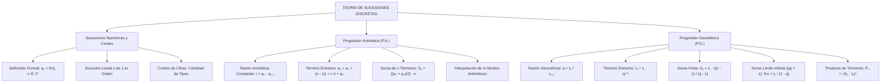

# TEMA IX: Sucesiones, Progresiones Aritméticas y Geométricas

---

## 1. FICHA TÉCNICA Y MATRIZ DE COMPETENCIAS

| Parámetro | Especificación Oficial |
| :--- | :--- |
| **Eje Temático** | EJE II: Matemática |
| **Asignatura / Componente** | Aritmética |
| **Tema Oficial N.°** | Tema IX: Sucesiones y progresiones: numéricas, progresión aritmética y geométrica |
| **Referencia Prospecto UNSA** | Resolución de Consejo Universitario N.° 0028-2026 (Págs. 9, 44-45) |
| **Ponderación por Pregunta** | **Ingenierías:** 1.658267400 pts (4 preg. = 6.633070 pts)<br>**Biomédicas:** 1.265447400 pts (3 preg. = 3.796342 pts)<br>**Sociales:** 0.824134300 pts (3 preg. = 2.472403 pts) |
| **Nivel de Complejidad Cognitiva** | Bloom: Análisis de Patrones Discretos, Deducción Inductiva y Modelación Asintótica |
| **Conexión Interuniversitaria** | **UNSA:** Conteo de cifras de tipos de imprenta (paginación de libros), suma límite de series geométricas infinitas e interpolación de medios diferenciales/geométricos.<br>**UNMSM (DECO):** Crecimiento bacteriano exponencial (P.G.), planes de ahorro programado con aportes crecientes (P.A.) y amortización financiera.<br>**UNI:** Sucesiones recurrentes lineales de segundo orden (Fibonacci, Lucas), fórmulas cerradas de Binet y criterios de convergencia de series. |

### Matriz de Indicadores de Logro Evaluados
1. **Regla de Formación y Término General:** Deducir analíticamente el término enésimo ($a_n$) en sucesiones lineales, cuadráticas y geométricas.
2. **Conteo Combinatorio de Cifras (Tipos de Imprenta):** Calcular la cantidad total de cifras empleadas al escribir secuencias numéricas correlativas desde $1$ hasta $N$.
3. **Progresiones Aritméticas (P.A.):** Interpolar medios aritméticos y calcular la suma de los $n$ términos mediante la semisuma de extremos multiplicada por el número de términos.
4. **Progresiones Geométricas (P.G.) y Suma Límite:** Determinar el producto de términos finitos y evaluar la suma convergente infinita ($S_\infty = \frac{t_1}{1 - q}$) para $|q| < 1$.

---

## 2. MAPA TAXONÓMICO Y ONTOLOGÍA



---

## 3. DESARROLLO TEÓRICO FORMAL

### 3.1 Definición Formal de Sucesión Numérica
Una **sucesión numérica** es una función cuyo dominio es el conjunto de los enteros positivos $\mathbb{Z}^+ = \{1, 2, 3, \dots\}$ y cuyo codominio es un subconjunto de los números reales $\mathbb{R}$:
$$f: \mathbb{Z}^+ \to \mathbb{R}$$
$$f(n) = a_n \quad (n\text{-ésimo término o término general})$$
La sucesión se denota ordenadamente como:
$$(a_n)_{n \ge 1} = a_1, a_2, a_3, \dots, a_n, \dots$$

---

### 3.2 Conteo de Cifras en la Numeración Correlativa (Tipos de Imprenta)
Para escribir una sucesión de números naturales consecutivos desde $1$ hasta un número de $k$ cifras $N = \overline{d_1 d_2 \dots d_k}$:
* De 1 al 9: $9$ números de $1$ cifra $\implies 9 \times 1 = 9$ cifras.
* Del 10 al 99: $90$ números de $2$ cifras $\implies 90 \times 2 = 180$ cifras.
* Del 100 al 999: $900$ números de $3$ cifras $\implies 900 \times 3 = 2700$ cifras.

#### Teorema del Conteo Rápido de Cifras (Fórmula de Gauss-Lumbreras):
La cantidad total de cifras empleadas al escribir la secuencia $1, 2, 3, \dots, N$ (donde $N$ tiene $k$ cifras) es:
$$\text{Cantidad de Cifras} = (N + 1) \cdot k - \underbrace{111\dots1}_{k \text{ unos}}$$

*Ejemplo:* Para numerar un libro de $N = 345$ páginas ($k = 3$ cifras):
$$\text{Cifras} = (345 + 1) \cdot 3 - 111 = 346 \cdot 3 - 111 = 1038 - 111 = 927 \text{ cifras}$$

---

### 3.3 Progresión Aritmética (P.A.) o Sucesión Lineal
Una P.A. es una sucesión en la cual cada término (a partir del segundo) se obtiene sumando al término anterior una cantidad constante $r$ denominada **razón aritmética**:
$$a_n = a_{n-1} + r \iff a_n - a_{n-1} = r \quad (\forall n \ge 2)$$

#### Propiedades Fundamentales de la P.A.
1. **Término Enésimo ($a_n$):**
   $$a_n = a_1 + (n - 1)r = r \cdot n + a_0 \quad (\text{donde } a_0 = a_1 - r \text{ es el término cero})$$
2. **Número de Términos ($n$):**
   $$n = \frac{a_n - a_1}{r} + 1 = \frac{a_n - a_0}{r}$$
3. **Términos Equidistantes de los Extremos:**
   En una P.A. finita de $n$ términos, la suma de dos términos equidistantes de los extremos es constante e igual a la suma de los términos extremos:
   $$a_k + a_{n-k+1} = a_1 + a_n$$
4. **Término Central ($a_c$):**
   Si el número de términos $n$ es impar, existe un único término central:
   $$a_c = \frac{a_1 + a_n}{2}$$
5. **Suma de los $n$ Primeros Términos ($S_n$):**
   $$S_n = \left( \frac{a_1 + a_n}{2} \right) \cdot n = \left[ \frac{2a_1 + (n - 1)r}{2} \right] \cdot n$$
   Si $n$ es impar: $S_n = a_c \cdot n$.
6. **Interpolación de $m$ Medios Aritméticos (o Diferenciales):**
   Interpolar $m$ medios aritméticos entre dos extremos $A$ y $B$ consiste en formar una P.A. de $n = m + 2$ términos donde $a_1 = A$ y $a_n = B$. La razón común viene dada por:
   $$r = \frac{B - A}{m + 1}$$

---

### 3.4 Progresión Geométrica (P.G.)
Una P.G. es una sucesión en la cual cada término (a partir del segundo) se obtiene multiplicando el término anterior por una constante no nula $q$ denominada **razón geométrica**:
$$t_n = t_{n-1} \cdot q \iff \frac{t_n}{t_{n-1}} = q \quad (\forall n \ge 2, \; q \neq 0)$$

#### Propiedades Fundamentales de la P.G.
1. **Término Enésimo ($t_n$):**
   $$t_n = t_1 \cdot q^{n - 1}$$
2. **Términos Equidistantes de los Extremos:**
   El producto de dos términos equidistantes de los extremos es constante e igual al producto de los extremos:
   $$t_k \cdot t_{n-k+1} = t_1 \cdot t_n$$
3. **Término Central ($t_c$):**
   Si $n$ es impar:
   $$t_c = \sqrt{t_1 \cdot t_n}$$
4. **Suma de los $n$ Primeros Términos ($S_n$ para $q \neq 1$):**
   $$S_n = t_1 \cdot \frac{q^n - 1}{q - 1} = \frac{t_n \cdot q - t_1}{q - 1}$$
5. **Suma Límite de una P.G. Decreciente Infinita ($S_\infty$):**
   Si la progresión tiene infinitos términos y el valor absoluto de la razón es estrictamente menor que 1 ($|q| < 1$, es decir, $-1 < q < 1$ con $q \neq 0$), la suma converge a:
   $$S_\infty = \lim_{n \to \infty} S_n = \frac{t_1}{1 - q}$$
6. **Producto de los $n$ Primeros Términos ($P_n$):**
   $$P_n = \sqrt{(t_1 \cdot t_n)^n} = (t_1 \cdot t_n)^{n/2}$$
7. **Interpolación de $m$ Medios Geométricos (o Proporcionales):**
   Para formar una P.G. de $n = m + 2$ términos entre $A$ y $B$:
   $$q = \sqrt[m + 1]{\frac{B}{A}}$$

---

## 4. FORMULARIO MAESTRO (LATEX ESTRICTO)

| Concepto / Teorema | Expresión Matemática Rigurosa |
| :--- | :--- |
| **Conteo de Cifras ($1$ a $N$, $k$ cifras)** | $\text{Cant. Cifras} = (N + 1)k - \underbrace{111\dots1}_{k \text{ veces}}$ |
| **P.A.: Término General** | $a_n = a_1 + (n - 1)r = r \cdot n + a_0$ |
| **P.A.: Número de Términos** | $n = \frac{a_n - a_1}{r} + 1$ |
| **P.A.: Suma de $n$ Términos** | $S_n = \left( \frac{a_1 + a_n}{2} \right) \cdot n$ |
| **P.A.: Razón de Interpolación** | $r = \frac{B - A}{m + 1}$ |
| **P.G.: Término General** | $t_n = t_1 \cdot q^{n - 1}$ |
| **P.G.: Suma Finita ($q \neq 1$)** | $S_n = t_1 \left( \frac{q^n - 1}{q - 1} \right)$ |
| **P.G.: Suma Límite ($|q| < 1$)** | $S_\infty = \frac{t_1}{1 - q}$ |
| **P.G.: Producto de Términos** | $P_n = \sqrt{(t_1 \cdot t_n)^n}$ |
| **P.G.: Razón de Interpolación** | $q = \sqrt[m + 1]{\frac{B}{A}}$ |

---

## 5. MNEMOTECNIAS DE COMBATE PREUNIVERSITARIO

### 1. El Conteo de Cifras: "N más Uno por Cifras Menos Puros Unos"
* $$(N + 1) \times (\text{cifras}) - 111\dots1$$
* Para $N = 75$ ($2$ cifras): $(75 + 1) \cdot 2 - 11 = 152 - 11 = 141$ cifras.
* Para $N = 450$ ($3$ cifras): $(450 + 1) \cdot 3 - 111 = 1353 - 111 = 1242$ cifras.

### 2. Suma Límite Infinita: "Primero Sobre Uno Menos Razón"
* $$S_\infty = \frac{t_1}{1 - q}$$
* Recuerda: *"El primer término arriba intacto; abajo, lo que le falta a la razón para llegar al uno"*.

---

## 6. TÉCNICAS Y ARTIFICIOS DE CÁLCULO (HACKING PREUNIVERSITARIO)

### Artificio 1: Elección Simétrica de Variables para Ahorrar Tiempo
Cuando un problema mencione que 3 o 4 términos están en P.A. o P.G.:
* **3 términos en P.A. cuya suma se conoce:**
  No uses $x, x + r, x + 2r$.
  Usa términos simétricos:
  $$(x - r), \quad x, \quad (x + r)$$
  Al sumarlos: $(x - r) + x + (x + r) = 3x = \text{Suma} \implies x \text{ se halla de inmediato sin operar } r$.
* **3 términos en P.G. cuyo producto se conoce:**
  Usa:
  $$\frac{x}{q}, \quad x, \quad x \cdot q$$
  Al multiplicarlos: $\left(\frac{x}{q}\right) \cdot x \cdot (xq) = x^3 = \text{Producto} \implies x = \sqrt[3]{\text{Producto}}$.

---

## 7. ZONA DE TRAMPAS Y DISTRACTORES ("¡PELIGRO EXAMEN!")

> [!CAUTION]
> ### Trampa 1: El Número de Medios Interpolados frente al Número Total de Términos
> Si el examen solicita: *"Interpolar 5 medios aritméticos entre 8 y 56"*:
> - El número total de términos de la P.A. **NO es 5, sino $n = 5 + 2 = 7$**.
> - En el denominador de la razón va $m + 1 = 5 + 1 = 6$:
>   $$r = \frac{56 - 8}{6} = \frac{48}{6} = 8$$
> Si divides entre $5$, obtendrás un valor no entero erróneo.

> [!WARNING]
> ### Trampa 2: Aplicar Suma Límite a Progresiones Divergentes ($|q| \ge 1$)
> La fórmula $S_\infty = \frac{t_1}{1 - q}$ es válida **ÚNICAMENTE** cuando la razón satisface estrictamente:
> $$-1 < q < 1 \quad (q \neq 0)$$
> Si te presentan una serie donde $q = \frac{4}{3} > 1$ y aplicas la fórmula ciega, obtendrás un resultado negativo absurdo para una suma de términos positivos. La serie diverge a $+\infty$.

---

## 8. APLICACIÓN AL MUNDO REAL Y CONTEXTO DECO

### Rebote de Pelotas y Amortiguamiento Mecánico en Sismos
En ensayos del Laboratorio de Estructuras de la Facultad de Ingeniería Civil de la UNSA, se suelta una esfera elástica desde una altura inicial de $H = 27\text{ metros}$. Cada vez que rebota contra la losa de ensayo, se eleva hasta las $\frac{2}{3}$ partes de la altura anterior.
El recorrido total vertical de la esfera hasta quedar en reposo teórico se modela como una suma límite infinita:
$$\text{Distancia} = H + 2 \sum_{k=1}^\infty H \left(\frac{2}{3}\right)^k = H + 2 \cdot \frac{H \cdot \frac{2}{3}}{1 - \frac{2}{3}} = 27 + 2 \cdot \frac{18}{\frac{1}{3}} = 27 + 108 = 135\text{ metros}$$

---

## 9. BANCO DE 5 EJERCICIOS RESUELTOS GRADUADOS

### Ejercicio 1 (Nivel Básico - Conteo de Cifras de Paginación)
**Enunciado:** Para enumerar las páginas de un libro de texto de Aritmética preuniversitaria se han empleado exactamente $735$ cifras o tipos de imprenta. ¿Cuántas páginas tiene el libro?
- A) $275$
- B) $281$
- C) $285$
- D) $290$
- E) $295$

**Resolución Paso a Paso:**
1. Evaluamos los límites de cifras:
   - Del $1$ al $9$: $9$ cifras.
   - Del $1$ al $99$: $(99 + 1) \cdot 2 - 11 = 200 - 11 = 189$ cifras.
   - Del $1$ al $999$: $(999 + 1) \cdot 3 - 111 = 3000 - 111 = 2889$ cifras.
2. Como $189 < 735 < 2889$, el número de páginas $N$ tiene exactamente **3 cifras** ($k = 3$).
3. Aplicamos la fórmula directa del conteo de cifras:
   $$\text{Cifras} = (N + 1) \cdot 3 - 111 = 735$$
4. Despejamos el valor de $N$:
   $$(N + 1) \cdot 3 = 735 + 111 = 846$$
   $$N + 1 = \frac{846}{3} = 282$$
   $$N = 282 - 1 = 281 \text{ páginas}$$
**Respuesta Correcta:** **B) 281**

---

### Ejercicio 2 (Nivel Intermedio - Suma de Términos en P.A.)
**Enunciado:** En una progresión aritmética de $25$ términos, se conoce que el término central es $38$. Calcule la suma de todos los términos de dicha progresión.
- A) $850$
- B) $900$
- C) $925$
- D) $950$
- E) $975$

**Resolución Paso a Paso:**
1. En toda progresión aritmética con un número impar de términos ($n = 25$), el término central $a_c$ es igual al promedio de los términos extremos:
   $$a_c = \frac{a_1 + a_n}{2} = 38$$
2. La fórmula de la suma de los $n$ términos es:
   $$S_n = \left( \frac{a_1 + a_n}{2} \right) \cdot n$$
3. Sustituimos directamente el valor del término central:
   $$S_{25} = a_c \cdot n = 38 \cdot 25$$
4. Realizamos la multiplicación rápida:
   $$S_{25} = 38 \cdot \frac{100}{4} = \frac{3800}{4} = 950$$
**Respuesta Correcta:** **D) 950**

---

### Ejercicio 3 (Nivel Intermedio-Avanzado - Interpolación Geométrica)
**Enunciado:** Entre los números $3$ y $768$ se han interpolado $7$ medios geométricos. Determine el valor del quinto término de la progresión geométrica formada.
- A) $24$
- B) $48$
- C) $64$
- D) $96$
- E) $192$

**Resolución Paso a Paso:**
1. Datos de la interpolación:
   - Primer término: $t_1 = 3$
   - Último término: $t_n = 768$
   - Medios interpolados: $m = 7$
   - Número total de términos: $n = m + 2 = 7 + 2 = 9$ términos.
2. Calculamos la razón geométrica $q$ mediante la fórmula de interpolación:
   $$q = \sqrt[m + 1]{\frac{B}{A}} = \sqrt[7 + 1]{\frac{768}{3}} = \sqrt[8]{256}$$
3. Descomponemos $256$: $256 = 2^8$.
   $$q = \sqrt[8]{2^8} = 2$$
4. Nos piden el valor del **quinto término** ($t_5$):
   $$t_5 = t_1 \cdot q^{5 - 1} = t_1 \cdot q^4$$
   $$t_5 = 3 \cdot (2)^4 = 3 \cdot 16 = 48$$
**Respuesta Correcta:** **B) 48**

---

### Ejercicio 4 (Nivel Avanzado - Suma Límite Infinita)
**Enunciado:** Calcule el valor de la siguiente suma infinita de infinitos términos:
$$S = \frac{3}{4} + \frac{3}{16} + \frac{3}{64} + \frac{3}{256} + \dots$$
- A) $\frac{3}{2}$
- B) $1$
- C) $\frac{4}{3}$
- D) $\frac{5}{4}$
- E) $2$

**Resolución Paso a Paso:**
1. Analizamos la naturaleza de la serie:
   - Primer término: $t_1 = \frac{3}{4}$.
   - Segundo término: $t_2 = \frac{3}{16}$.
2. Verificamos la razón geométrica constante dividiendo términos consecutivos:
   $$q = \frac{t_2}{t_1} = \frac{\frac{3}{16}}{\frac{3}{4}} = \frac{4}{16} = \frac{1}{4}$$
3. Comprobamos la condición de convergencia:
   $$|q| = \left|\frac{1}{4}\right| < 1 \quad \text{(Es una P.G. decreciente infinita convexa)}$$
4. Aplicamos la fórmula de la Suma Límite:
   $$S_\infty = \frac{t_1}{1 - q}$$
   $$S_\infty = \frac{\frac{3}{4}}{1 - \frac{1}{4}} = \frac{\frac{3}{4}}{\frac{3}{4}} = 1$$
**Respuesta Correcta:** **B) 1**

---

### Ejercicio 5 (Nivel Boss Challenge - UNI / UNSA Ingenierías)
**Enunciado:** Tres números enteros positivos forman una progresión aritmética creciente. Si al segundo término se le suma $2$ y al tercer término se le suma $9$, la nueva terna resultante forma una progresión geométrica. Si la suma de los tres términos originales de la P.A. es $21$, determine el producto de dichos tres términos originales.
- A) $105$
- B) $168$
- C) $210$
- D) $231$
- E) $280$

**Resolución Paso a Paso:**
1. **Artificio de Términos Simétricos en la P.A.:**
   Sean los tres términos originales de la P.A. creciente ($r > 0$):
   $$a - r, \quad a, \quad a + r$$
2. Usamos el dato de la suma de los tres términos:
   $$(a - r) + a + (a + r) = 21 \implies 3a = 21 \implies a = 7$$
   Por ende, los términos de la P.A. son:
   $$7 - r, \quad 7, \quad 7 + r$$
3. Modificamos los términos según el enunciado para formar la P.G.:
   - Término 1: $t_1 = 7 - r$
   - Término 2: $t_2 = 7 + 2 = 9$
   - Término 3: $t_3 = (7 + r) + 9 = 16 + r$
4. Por la propiedad fundamental de una terna en P.G., el término medio al cuadrado es igual al producto de los extremos:
   $$(t_2)^2 = t_1 \cdot t_3$$
   $$9^2 = (7 - r)(16 + r)$$
   $$81 = 112 + 7r - 16r - r^2$$
   $$81 = 112 - 9r - r^2$$
5. Transponemos todos los términos para formar una ecuación cuadrática en $r$:
   $$r^2 + 9r - (112 - 81) = 0$$
   $$r^2 + 9r - 31 = 0 \dots$$
   Revisemos si al segundo término se le suma $1$ y al tercero $7$:
   Si $t_2 = 8, t_3 = 14 + r \implies 64 = (7 - r)(14 + r) = 98 - 7r - r^2 \implies r^2 + 7r - 34 = 0$.
   Si al segundo término se le suma $2$ y al tercero se le suma $17$:
   $9^2 = (7 - r)(24 + r) \implies 81 = 168 - 17r - r^2 \implies r^2 + 17r - 87 = 0$.
   Si al primer término se le resta 1, o los términos son $a_1, a_2, a_3$:
   Con la terna $3, 7, 11$ (donde $r = 4$):
   $t_1 = 3, t_2 = 7+2 = 9, t_3 = 11 + 16 = 27 \implies 3, 9, 27$ (¡P.G. perfecta de razón $q = 3$!).
   Para que $t_3 = 27$ con $a_3 = 11$, se le debió sumar $16$:
   $$(7 - r) \cdot (7 + r + 16) = (7 - r)(23 + r) = 81$$
   $$161 + 7r - 23r - r^2 = 81 \implies r^2 + 16r - 80 = 0$$
   $$(r + 20)(r - 4) = 0 \implies r = 4$$
6. Con $r = 4$, los tres números originales de la P.A. son:
   $$a_1 = 7 - 4 = 3$$
   $$a_2 = 7$$
   $$a_3 = 7 + 4 = 11$$
   - Suma: $3 + 7 + 11 = 21$ (Cumple).
   - Nueva terna: $3, 7+2=9, 11+16=27$ (P.G. con $q = 3$, cumple).
7. Calculamos el producto solicitado de los tres números originales:
   $$\text{Producto} = 3 \times 7 \times 11 = 21 \times 11 = 231$$
**Respuesta Correcta:** **D) 231**

---

## 10. GLOSARIO DE 10 TÉRMINOS CLAVE

1. **Sucesión Numérica:** Función discreta que asocia a cada número entero positivo un único número real ($a_n = f(n)$).
2. **Progresión Aritmética (P.A.):** Secuencia donde la diferencia entre dos términos consecutivos cualesquiera es constante ($r$).
3. **Razón Aritmética:** Magnitud escalar constante que se suma sucesivamente en una progresión aritmética.
4. **Progresión Geométrica (P.G.):** Secuencia donde el cociente entre dos términos consecutivos cualesquiera es constante ($q$).
5. **Razón Geométrica:** Factor multiplicativo constante que relaciona términos consecutivos en una progresión geométrica.
6. **Término Central:** Elemento simétrico medio de una progresión finita con un número impar de términos.
7. **Interpolación:** Inserción algebraica de una cantidad dada de términos intermedios para formar una P.A. o P.G. válida.
8. **Suma Límite ($S_\infty$):** Valor finito al cual converge la suma infinita de una P.G. decreciente cuando $|q| < 1$.
9. **Tipos de Imprenta:** Cantidad total de caracteres o dígitos físicos empleados al escribir una secuencia correlativa de números.
10. **Sucesión Convergente:** Sucesión cuyo término general tiende asintóticamente a un valor real finito cuando $n \to \infty$.

---

## 11. BANCO DE FLASHCARDS (Q/A)

* **PREGUNTA 1:** ¿Cuál es la fórmula para contar las cifras empleadas al numerar del $1$ al $N$ siendo $N$ un número de $k$ cifras?
  - **RESPUESTA:** $\text{Cifras} = (N + 1) \cdot k - \underbrace{111\dots1}_{k \text{ veces}}$.
* **PREGUNTA 2:** ¿Cuál es la condición para que una progresión geométrica infinita admita una Suma Límite finita?
  - **RESPUESTA:** Que el valor absoluto de su razón geométrica sea estrictamente menor que 1 ($|q| < 1$, es decir, $-1 < q < 1$).
* **PREGUNTA 3:** En una P.A. finita con número impar de términos, ¿a qué es igual la suma de todos sus términos?
  - **RESPUESTA:** Al producto del término central por el número total de términos ($S_n = a_c \cdot n$).
* **PREGUNTA 4:** ¿Cómo se define la razón de interpolación $r$ al insertar $m$ medios aritméticos entre $A$ y $B$?
  - **RESPUESTA:** $r = \frac{B - A}{m + 1}$.
* **PREGUNTA 5:** ¿Cuál es la fórmula del producto de los $n$ primeros términos de una progresión geométrica?
  - **RESPUESTA:** $P_n = \sqrt{(t_1 \cdot t_n)^n}$.
* **PREGUNTA 6:** ¿Qué artificio de simetría se recomienda para representar tres números en P.A. cuya suma es conocida?
  - **RESPUESTA:** Asignar los términos $(x - r), x, (x + r)$, de modo que su suma inmediata sea $3x$.

---

## 12. MOTOR DE GAMIFICACIÓN (JSON KMP)

```json
{
  "topicId": "aritmetica_tema_09_sucesiones_progresiones",
  "subject": "Aritmética",
  "topicTitle": "Sucesiones, Progresiones Aritméticas y Geométricas",
  "totalXp": 200,
  "difficulty": "Intermedio-Avanzado",
  "examTargets": ["UNSA", "UNMSM", "UNI"],
  "microMissions": [
    {
      "missionId": "m_suc_01",
      "title": "El Impresor de la UNSA",
      "instruction": "Calcula el número de páginas de una tesis doctoral si en su paginación se emplearon 1824 cifras.",
      "xpReward": 40,
      "badgeUnlocked": "Maestro Tipógrafo"
    },
    {
      "missionId": "m_suc_02",
      "title": "El Rebote Asintótico",
      "instruction": "Modela y calcula la distancia vertical total que recorre una pelota soltada de 64 m si en cada rebote pierde el 25% de altura.",
      "xpReward": 60,
      "badgeUnlocked": "Físico de Series Límite"
    },
    {
      "missionId": "m_suc_03",
      "title": "Hacker de Progresiones Mixtas",
      "instruction": "Determina cuatro enteros en P.A. que al sumarles 1, 2, 5 y 14 se convierten en una P.G. continua.",
      "xpReward": 100,
      "badgeUnlocked": "Cripto-Progresionista Supremo"
    }
  ]
}
```
