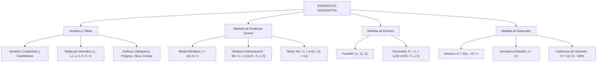

# TEMA XI: Estadística Descriptiva, Medidas de Tendencia Central y Dispersión

---

## 1. FICHA TÉCNICA Y MATRIZ DE COMPETENCIAS

| Parámetro | Especificación Oficial |
| :--- | :--- |
| **Eje Temático** | EJE II: Matemática |
| **Asignatura / Componente** | Aritmética |
| **Tema Oficial N.°** | Tema XI: Estadística descriptiva: recolección y tablas, gráficos, medidas de tendencia central, de posición y de dispersión |
| **Referencia Prospecto UNSA** | Resolución de Consejo Universitario N.° 0028-2026 (Págs. 9, 44-45) |
| **Ponderación por Pregunta** | **Ingenierías:** 1.658267400 pts (4 preg. = 6.633070 pts)<br>**Biomédicas:** 1.265447400 pts (3 preg. = 3.796342 pts)<br>**Sociales:** 0.824134300 pts (3 preg. = 2.472403 pts) |
| **Nivel de Complejidad Cognitiva** | Bloom: Análisis Paramétrico, Interpretación Gráfica y Síntesis Estadística Avanzada |
| **Conexión Interuniversitaria** | **UNSA:** Reconstrucción de tablas de frecuencias con datos faltantes a partir de ojivas o histogramas, cálculo analítico de mediana y moda para datos continuos.<br>**UNMSM (DECO):** Análisis de variabilidad en ensayos clínicos, homogeneidad de lotes farmacéuticos mediante coeficiente de variación y diagramas de Pareto.<br>**UNI:** Varianza de datos transformados linealmente ($y = ax + b$), momentos estadísticos, asimetría de Pearson y percentiles continuos. |

### Matriz de Indicadores de Logro Evaluados
1. **Organización Tabular y Representación Gráfica:** Construir e interpretar tablas de frecuencias unidimensionales (marca de clase $x_i$, $f_i$, $h_i$, $F_i$, $H_i$) e histogramas, polígonos y ojivas.
2. **Medidas de Tendencia Central y Posición:** Calcular con rigor analítico la media ($\bar{x}$), mediana ($Me$), moda ($Mo$) y percentiles ($P_k$) para datos agrupados en intervalos de clase.
3. **Medidas de Variabilidad y Dispersión:** Determinar la varianza ($\sigma^2$), desviación estándar ($s$) y evaluar el grado de homogeneidad de una muestra mediante el Coeficiente de Variación ($CV$).

---

## 2. MAPA TAXONÓMICO Y ONTOLOGÍA



---

## 3. DESARROLLO TEÓRICO FORMAL

### 3.1 Población, Muestra y Clasificación de Variables
* **Población:** Conjunto universal finito o infinito de elementos o unidades de análisis que poseen características observables comunes.
* **Muestra:** Subconjunto representativo y aleatorio seleccionado de la población ($n < N$).
* **Variable Estadística:** Característica o cualidad observable en los elementos de estudio.
  1. **Cualitativa (Categórica):** Expresa atributos no numéricos.
     - *Nominal:* No admite orden jerárquico natural (ej.: grupo sanguíneo, profesión, estado civil).
     - *Ordinal:* Admite ordenación jerárquica intrínseca (ej.: grado militar, nivel socioeconómico, escala de dolor).
  2. **Cuantitativa (Numérica):** Expresa cantidades numéricas medibles.
     - *Discreta:* Toma valores puntuales aislados en $\mathbb{Z}$ (ej.: número de hijos, cantidad de piezas defectuosas).
     - *Continua:* Puede tomar cualquier valor dentro de un intervalo continuo en $\mathbb{R}$ (ej.: estatura, peso, tiempo, voltaje).

---

### 3.2 Tabla de Distribución de Frecuencias para Datos Agrupados
Cuando el tamaño de la muestra es grande y la variable es continua, los datos se agrupan en $k$ intervalos de clase cerrados a la izquierda y abiertos a la derecha:
$$I_i = [L_i, L_s\rangle = [L_i, L_{i+1}\rangle \quad (i = 1, 2, \dots, k)$$
* **Rango o Recorrido ($R$):** $R = x_{\max} - x_{\min}$.
* **Número de Intervalos ($k$):** Determinado usualmente por la **Regla de Sturges**:
  $$k = 1 + 3.322 \log_{10}(n) \quad (k \in \mathbb{Z}^+)$$
* **Ancho de Clase o Amplitud ($w$ o $C$):** Asumiendo intervalos de ancho constante:
  $$w = \frac{R}{k}$$
* **Marca de Clase ($x_i$):** Punto medio del intervalo que actúa como representante representativo:
  $$x_i = \frac{L_i + L_s}{2}$$

#### Tipos de Frecuencias:
1. **Frecuencia Absoluta Simple ($f_i$):** Número de observaciones pertenecientes al intervalo $I_i$.
   $$\sum_{i=1}^k f_i = n \quad (\text{tamaño total de la muestra})$$
2. **Frecuencia Relativa Simple ($h_i$):** Proporción del total que corresponde al intervalo:
   $$h_i = \frac{f_i}{n}, \quad 0 \le h_i \le 1, \quad \sum_{i=1}^k h_i = 1 \quad (\text{o } 100\%)$$
3. **Frecuencia Absoluta Acumulada ($F_i$):**
   $$F_i = \sum_{j=1}^i f_j = f_1 + f_2 + \dots + f_i \quad (F_k = n)$$
4. **Frecuencia Relativa Acumulada ($H_i$):**
   $$H_i = \sum_{j=1}^i h_j = \frac{F_i}{n} \quad (H_k = 1)$$

---

### 3.3 Medidas de Tendencia Central para Datos Agrupados

#### 1. Media Aritmética ($\bar{x}$)
Es el promedio ponderado de las marcas de clase respecto a sus respectivas frecuencias absolutas:
$$\bar{x} = \frac{\sum_{i=1}^k x_i \cdot f_i}{n} = \sum_{i=1}^k x_i \cdot h_i$$

#### 2. Mediana ($Me$)
Es el valor que divide a la distribución ordenada exactamente en dos partes porcentuales iguales ($50\%$ inferior y $50\%$ superior):
* **Paso 1:** Ubicar la clase mediana identificando el primer intervalo cuya frecuencia acumulada satisfaga:
  $$F_i \ge \frac{n}{2}$$
* **Paso 2:** Aplicar la fórmula de interpolación lineal:
  $$Me = L_i + w \cdot \left( \frac{\frac{n}{2} - F_{i-1}}{f_i} \right)$$
  - $L_i$: Límite inferior de la clase mediana.
  - $w$: Ancho de clase.
  - $F_{i-1}$: Frecuencia absoluta acumulada de la clase anterior.
  - $f_i$: Frecuencia absoluta simple de la clase mediana.

#### 3. Moda ($Mo$)
Es el valor alrededor del cual se concentra la mayor densidad de observaciones:
* **Paso 1:** Ubicar la clase modal (el intervalo con la mayor frecuencia absoluta simple $f_i$).
* **Paso 2:** Aplicar la fórmula modal de Czuber:
  $$Mo = L_i + w \cdot \left( \frac{d_1}{d_1 + d_2} \right)$$
  donde:
  $$d_1 = f_i - f_{i-1} \quad (\text{exceso modal anterior})$$
  $$d_2 = f_i - f_{i+1} \quad (\text{exceso modal posterior})$$

---

### 3.4 Medidas de Posición (Cuartiles y Percentiles)
* **Cuartiles ($Q_1, Q_2, Q_3$):** Tres valores que dividen la muestra ordenada en cuatro partes de $25\%$ cada una. ($Q_2 = Me$).
* **Percentil $k$ ($P_k$ para $k = 1, 2, \dots, 99$):** Valor por debajo del cual se encuentra el $k\%$ de las observaciones:
  $$P_k = L_i + w \cdot \left( \frac{\frac{k \cdot n}{100} - F_{i-1}}{f_i} \right)$$

---

### 3.5 Medidas de Dispersión o Variabilidad
Cuantifican el grado de alejamiento o concentración de los datos respecto a la media aritmética.

#### 1. Varianza ($s^2$ o $\sigma^2$)
Promedio de los desvíos cuadráticos respecto a la media:
$$s^2 = \frac{\sum_{i=1}^k f_i (x_i - \bar{x})^2}{n} = \frac{\sum_{i=1}^k f_i x_i^2}{n} - \bar{x}^2$$

#### 2. Desviación Estándar ($s$)
Raíz cuadrada positiva de la varianza (posee las mismas unidades físicas que la variable original):
$$s = \sqrt{s^2}$$

#### 3. Coeficiente de Variación ($CV$)
Medida adimensional de dispersión relativa que evalúa la representatividad de la media y la homogeneidad de la muestra:
$$CV = \left( \frac{s}{\bar{x}} \right) \times 100\%$$
* **Criterio de Homogeneidad:**
  - $CV \le 10\%$: Datos **muy homogéneos** (media altamente confiable).
  - $10\% < CV \le 30\%$: Variabilidad moderada.
  - $CV > 30\%$: Datos **heterogéneos** (alta dispersión, media poco representativa).

---

## 4. FORMULARIO MAESTRO (LATEX ESTRICTO)

| Medida / Parámetro | Ecuación Canónica |
| :--- | :--- |
| **Marca de Clase** | $x_i = \frac{L_i + L_s}{2}$ |
| **Media Agrupada** | $\bar{x} = \frac{1}{n} \sum_{i=1}^k x_i f_i = \sum_{i=1}^k x_i h_i$ |
| **Mediana Agrupada** | $Me = L_i + w \left( \frac{\frac{n}{2} - F_{i-1}}{f_i} \right)$ |
| **Moda Agrupada** | $Mo = L_i + w \left( \frac{f_i - f_{i-1}}{(f_i - f_{i-1}) + (f_i - f_{i+1})} \right)$ |
| **Percentil $k$** | $P_k = L_i + w \left( \frac{\frac{kn}{100} - F_{i-1}}{f_i} \right)$ |
| **Varianza Simplificada** | $s^2 = \frac{\sum x_i^2 f_i}{n} - \bar{x}^2$ |
| **Desviación Estándar** | $s = \sqrt{s^2}$ |
| **Coeficiente de Variación** | $CV = \frac{s}{\bar{x}} \times 100\%$ |
| **Transformación Lineal ($y = ax + b$)** | $\bar{y} = a\bar{x} + b, \quad s_y^2 = a^2 s_x^2, \quad s_y = |a| s_x$ |

---

## 5. MNEMOTECNIAS DE COMBATE PREUNIVERSITARIO

### 1. La Fórmula de la Mediana: "La Mitad Menos lo que Acumulé"
* $$Me = L_i + w \cdot \frac{\frac{n}{2} - F_{i-1}}{f_i}$$
* **Mnemotecnia:** *"Empiezas en el piso ($L_i$), sumas el ancho ($w$), y multiplicas por la fracción: la mitad del pueblo ($\frac{n}{2}$) menos los que ya pasaron ($F_{i-1}$), dividido entre los que están adentro ($f_i$)"*.

### 2. Transformaciones Lineales: "La Varianza Ignora la Suma y Eleva la Escala al Cuadrado"
* Si a todos los datos se les suma una constante ($x + c$): la varianza **no cambia**.
* Si se les multiplica por una constante ($c \cdot x$): la varianza queda multiplicada por **$c^2$**, y la desviación estándar por **$|c|$**.

---

## 6. TÉCNICAS Y ARTIFICIOS DE CÁLCULO (HACKING PREUNIVERSITARIO)

### Artificio 1: Reconstrucción Relámpago de Tablas mediante la Relación $h_i$ y $f_i$
En la UNSA abundan tablas con casilleros vacíos:
* Recuerda siempre que las razones son idénticas:
  $$\frac{f_1}{h_1} = \frac{f_2}{h_2} = \dots = \frac{f_k}{h_k} = n \quad (\text{Muestra total})$$
* Si tienes $f_3 = 18$ y $h_3 = 0.15$:
  $$n = \frac{18}{0.15} = \frac{1800}{15} = 120$$
* ¡Con el valor de $n$, completas inmediatamente toda la columna de $f_i$ multiplicando $120 \times h_i$, y la columna de $h_i$ dividiendo $f_i / 120$!

---

## 7. ZONA DE TRAMPAS Y DISTRACTORES ("¡PELIGRO EXAMEN!")

> [!CAUTION]
> ### Trampa 1: Confundir Frecuencia Absoluta Acumulada ($F_i$) con Simple ($f_i$)
> Al aplicar la fórmula de la mediana o de percentiles, en el denominador va la frecuencia **SIMPLE** de la clase ($f_i$), mientras que en el numerador se resta la **ACUMULADA ANTERIOR** ($F_{i-1}$).
> Colocar la frecuencia acumulada en el denominador es el error más recurrente que conduce a alternativas trampa.

> [!WARNING]
> ### Trampa 2: La Media de un Gráfico Circular no es el Promedio de Ángulos
> En un gráfico de sectores circulares (gráfico de torta), el ángulo $\theta_i$ es proporcional a la frecuencia relativa: $\theta_i = 360^\circ \cdot h_i$.
> Si el examen pregunta por el porcentaje que representa un sector de $54^\circ$:
> $$\% = \frac{54^\circ}{360^\circ} \times 100\% = 15\%$$
> No intentes dividir entre $100$ grados.

---

## 8. APLICACIÓN AL MUNDO REAL Y CONTEXTO DECO

### Control de Calidad Metalúrgica en Fundición de Cobre en Southern Perú
En los laboratorios de control químico de Moquegua y Arequipa, se evalúa la pureza del concentrado de cobre en lotes de exportación. Si dos procesos de flotación tienen la misma ley media ($\bar{x} = 28.5\%$ de Cu), la empresa elegirá el proceso con el menor **Coeficiente de Variación ($CV$)**:
- Proceso $A$: $s = 0.5\% \implies CV_A = \frac{0.5}{28.5} \times 100\% = 1.75\%$ (Altamente confiable y homogéneo).
- Proceso $B$: $s = 2.1\% \implies CV_B = \frac{2.1}{28.5} \times 100\% = 7.37\%$.
El análisis de dispersión previene penalizaciones internacionales por variabilidad en embarques marítimos.

---

## 9. BANCO DE 5 EJERCICIOS RESUELTOS GRADUADOS

### Ejercicio 1 (Nivel Básico - Reconstrucción de Tabla de Frecuencias)
**Enunciado:** La siguiente tabla muestra la distribución del número de horas semanales que un grupo de $50$ postulantes a la UNSA dedica al estudio independiente:

| Horas | $f_i$ | $h_i$ | $F_i$ |
| :---: | :---: | :---: | :---: |
| $[10 - 20\rangle$ | $12$ | $a$ | $12$ |
| $[20 - 30\rangle$ | $b$ | $0.30$ | $c$ |
| $[30 - 40\rangle$ | $15$ | $d$ | $42$ |
| $[40 - 50\rangle$ | $8$ | $0.16$ | $50$ |

Calcule el valor de $a + b + c + d$.
- A) $42.54$
- B) $42.84$
- C) $43.24$
- D) $43.54$
- E) $44.14$

**Resolución Paso a Paso:**
1. El tamaño total de la muestra es $n = 50$.
2. **Cálculo de $a$ ($h_1$):**
   $$a = \frac{f_1}{n} = \frac{12}{50} = 0.24$$
3. **Cálculo de $b$ ($f_2$):**
   $$b = n \cdot h_2 = 50 \cdot 0.30 = 15$$
4. **Cálculo de $c$ ($F_2$):**
   $$c = F_1 + f_2 = 12 + 15 = 27$$
5. **Cálculo de $d$ ($h_3$):**
   $$d = \frac{f_3}{n} = \frac{15}{50} = 0.30$$
6. Realizamos la suma solicitada:
   $$a + b + c + d = 0.24 + 15 + 27 + 0.30 = 42.54$$
**Respuesta Correcta:** **A) 42.54**

---

### Ejercicio 2 (Nivel Intermedio - Media Aritmética en Datos Agrupados)
**Enunciado:** Dada la siguiente distribución de salarios en soles de los trabajadores de una empresa constructora:

| Intervalo de Salarios | $f_i$ |
| :---: | :---: |
| $[1200 - 1600\rangle$ | $8$ |
| $[1600 - 2000\rangle$ | $14$ |
| $[2000 - 2400\rangle$ | $12$ |
| $[2400 - 2800\rangle$ | $6$ |

Calcule el salario medio o media aritmética ($\bar{x}$) de los trabajadores.
- A) $S/. 1850$
- B) $S/. 1900$
- C) $S/. 1920$
- D) $S/. 1940$
- E) $S/. 1960$

**Resolución Paso a Paso:**
1. Calculamos el tamaño total de la muestra ($n$):
   $$n = 8 + 14 + 12 + 6 = 40 \text{ trabajadores}$$
2. Determinamos las marcas de clase ($x_i$) de cada intervalo:
   - $x_1 = \frac{1200 + 1600}{2} = 1400$
   - $x_2 = \frac{1600 + 2000}{2} = 1800$
   - $x_3 = \frac{2000 + 2400}{2} = 2200$
   - $x_4 = \frac{2400 + 2800}{2} = 2600$
3. Calculamos la sumatoria de los productos $x_i \cdot f_i$:
   - $x_1 f_1 = 1400 \cdot 8 = 11\,200$
   - $x_2 f_2 = 1800 \cdot 14 = 25\,200$
   - $x_3 f_3 = 2200 \cdot 12 = 26\,400$
   - $x_4 f_4 = 2600 \cdot 6 = 15\,600$
   $$\sum x_i f_i = 11\,200 + 25\,200 + 26\,400 + 15\,600 = 78\,400$$
4. Calculamos la media aritmética:
   $$\bar{x} = \frac{\sum x_i f_i}{n} = \frac{78\,400}{40} = S/. 1960$$
**Respuesta Correcta:** **E) S/. 1960**

---

### Ejercicio 3 (Nivel Intermedio-Avanzado - Cálculo Analítico de la Mediana)
**Enunciado:** A partir de la tabla del ejercicio anterior, determine el valor exacto de la mediana salarial ($Me$).
- A) $S/. 1942.86$
- B) $S/. 1950.00$
- C) $S/. 1954.28$
- D) $S/. 1965.50$
- E) $S/. 1971.43$

**Resolución Paso a Paso:**
1. Ubicamos la posición de la mediana:
   $$\frac{n}{2} = \frac{40}{2} = 20$$
2. Construimos las frecuencias acumuladas ($F_i$):
   - $F_1 = 8$
   - $F_2 = 8 + 14 = 22$ (Como $22 \ge 20$, la **clase mediana** es el segundo intervalo: $[1600 - 2000\rangle$).
3. Identificamos los parámetros de la clase mediana:
   - Límite inferior: $L_i = 1600$
   - Ancho de clase: $w = 2000 - 1600 = 400$
   - Frecuencia acumulada anterior: $F_{i-1} = F_1 = 8$
   - Frecuencia absoluta de la clase: $f_i = f_2 = 14$
4. Aplicamos la fórmula de interpolación lineal de la mediana:
   $$Me = L_i + w \cdot \left( \frac{\frac{n}{2} - F_{i-1}}{f_i} \right)$$
   $$Me = 1600 + 400 \cdot \left( \frac{20 - 8}{14} \right) = 1600 + 400 \cdot \left( \frac{12}{14} \right)$$
   $$Me = 1600 + 400 \cdot \left( \frac{6}{7} \right) = 1600 + \frac{2400}{7} \approx 1600 + 342.857 = S/. 1942.86$$
**Respuesta Correcta:** **A) S/. 1942.86**

---

### Ejercicio 4 (Nivel Avanzado - Cálculo de la Moda Agrupada)
**Enunciado:** A partir de los mismos datos salariales, calcule el valor de la moda ($Mo$).
- A) $S/. 1850$
- B) $S/. 1875$
- C) $S/. 1900$
- D) $S/. 1925$
- E) $S/. 1950$

**Resolución Paso a Paso:**
1. Identificamos la clase modal (intervalo con la mayor frecuencia simple $f_i$):
   - Frecuencias: $f_1 = 8, f_2 = 14, f_3 = 12, f_4 = 6$.
   - La mayor frecuencia es $f_2 = 14$. Por ende, la **clase modal** es $[1600 - 2000\rangle$.
2. Extraemos los parámetros de cálculo:
   - $L_i = 1600$
   - $w = 400$
   - $d_1 = f_i - f_{i-1} = 14 - 8 = 6$
   - $d_2 = f_i - f_{i+1} = 14 - 12 = 2$
3. Aplicamos la fórmula de Czuber para la moda:
   $$Mo = L_i + w \cdot \left( \frac{d_1}{d_1 + d_2} \right)$$
   $$Mo = 1600 + 400 \cdot \left( \frac{6}{6 + 2} \right) = 1600 + 400 \cdot \left( \frac{6}{8} \right)$$
   $$Mo = 1600 + 400 \cdot (0.75) = 1600 + 300 = S/. 1900$$
**Respuesta Correcta:** **C) S/. 1900**

---

### Ejercicio 5 (Nivel Boss Challenge - UNI / UNSA Ingenierías)
**Enunciado:** En una muestra estadística de $n = 5$ datos discretos, la media aritmética es $12$ y la varianza es $8$. Si a cada dato de la muestra original se le triplica y posteriormente se le resta $5$ unidades, determine la suma de la nueva media aritmética, la nueva varianza y la nueva desviación estándar.
- A) $109.2$
- B) $111.5$
- C) $113.8$
- D) $115.5$
- E) $117.2$

**Resolución Paso a Paso:**
1. **Modelado de Transformaciones Lineales:**
   Sea $X$ la variable aleatoria original con:
   - Media: $\bar{x} = 12$
   - Varianza: $s_x^2 = 8$
   - Desviación estándar: $s_x = \sqrt{8} = 2\sqrt{2} \approx 2.8284$
2. Se define la nueva variable transformada linealmente:
   $$Y = 3X - 5 \quad (\text{forma } Y = aX + b, \text{ con } a = 3, \; b = -5)$$
3. **Cálculo de la Nueva Media ($\bar{y}$):**
   Por la propiedad de linealidad de la esperanza:
   $$\bar{y} = a\bar{x} + b = 3(12) - 5 = 36 - 5 = 31$$
4. **Cálculo de la Nueva Varianza ($s_y^2$):**
   La varianza es invariante ante traslaciones aditivas y sensible al cuadrado de la escala:
   $$s_y^2 = a^2 \cdot s_x^2 = (3)^2 \cdot 8 = 9 \cdot 8 = 72$$
5. **Cálculo de la Nueva Desviación Estándar ($s_y$):**
   $$s_y = \sqrt{s_y^2} = \sqrt{72} = \sqrt{36 \cdot 2} = 6\sqrt{2} \approx 6(1.4142) = 8.4853$$
6. **Suma de los Tres Estadísticos:**
   $$\Sigma = \bar{y} + s_y^2 + s_y = 31 + 72 + 6\sqrt{2} = 103 + 8.4853 = 111.4853 \approx 111.5$$
**Respuesta Correcta:** **B) 111.5**

---

## 10. GLOSARIO DE 10 TÉRMINOS CLAVE

1. **Muestra Representativa:** Subconjunto probabilístico de una población que reproduce fidedignamente sus propiedades métricas.
2. **Variable Cualitativa Ordinal:** Variable no numérica cuyos estados o categorías admiten ordenamiento jerárquico.
3. **Marca de Clase ($x_i$):** Valor representativo medio de un intervalo de clase obtenido mediante su semisuma de límites.
4. **Frecuencia Acumulada ($F_i$):** Cantidad total de observaciones que son menores o iguales al límite superior de un intervalo.
5. **Ojiva Porcentual:** Gráfico poligonal que representa de forma creciente la acumulación de frecuencias relativas.
6. **Mediana ($Me$):** Parámetro de posición central que separa el $50\%$ de los datos inferiores del $50\%$ superior.
7. **Moda ($Mo$):** Valor o intervalo de clase con mayor densidad de frecuencias absolutas.
8. **Varianza ($s^2$):** Esperanza cuadrática de las desviaciones de los datos respecto a su media aritmética.
9. **Desviación Estándar ($s$):** Medida de dispersión absoluta en la misma unidad de escala que la variable estudiada.
10. **Coeficiente de Variación ($CV$):** Medida porcentual adimensional de dispersión relativa respecto a la media.

---

## 11. BANCO DE FLASHCARDS (Q/A)

* **PREGUNTA 1:** ¿Cómo se calcula la marca de clase $x_i$ de un intervalo $[L_i, L_s\rangle$?
  - **RESPUESTA:** Mediante la semisuma de sus límites: $x_i = \frac{L_i + L_s}{2}$.
* **PREGUNTA 2:** ¿Qué le sucede a la varianza de un conjunto de datos si a todos se les suma una misma constante $c$?
  - **RESPUESTA:** La varianza no se altera en absoluto ($s_{x+c}^2 = s_x^2$).
* **PREGUNTA 3:** ¿Qué le sucede a la desviación estándar si a todos los datos se les multiplica por $k$?
  - **RESPUESTA:** Queda multiplicada por el valor absoluto de $k$ ($s_{kx} = |k| \cdot s_x$).
* **PREGUNTA 4:** ¿Cuál es la fórmula para calcular el Coeficiente de Variación ($CV$)?
  - **RESPUESTA:** $CV = \left( \frac{s}{\bar{x}} \right) \times 100\%$.
* **PREGUNTA 5:** ¿En qué intervalo se encuentra la mediana en una tabla agrupada?
  - **RESPUESTA:** En el primer intervalo cuya frecuencia absoluta acumulada satisfaga $F_i \ge \frac{n}{2}$.
* **PREGUNTA 6:** ¿Cómo se calcula el ángulo de un sector circular correspondiente a una frecuencia relativa $h_i$?
  - **RESPUESTA:** Multiplicando la frecuencia relativa por $360^\circ$ ($\theta_i = 360^\circ \cdot h_i$).

---

## 12. MOTOR DE GAMIFICACIÓN (JSON KMP)

```json
{
  "topicId": "aritmetica_tema_11_estadistica_descriptiva_dispersion",
  "subject": "Aritmética",
  "topicTitle": "Estadística Descriptiva, Tendencia Central y Dispersión",
  "totalXp": 200,
  "difficulty": "Intermedio-Avanzado",
  "examTargets": ["UNSA", "UNMSM", "UNI"],
  "microMissions": [
    {
      "missionId": "m_est_01",
      "title": "El Enigma de la Tabla Incompleta",
      "instruction": "Reconstruye una tabla de 5 intervalos donde solo se conocen F2 = 18, h3 = 0.25 y el promedio es 34.5.",
      "xpReward": 40,
      "badgeUnlocked": "Cripto-Estadístico"
    },
    {
      "missionId": "m_est_02",
      "title": "Maestro de las Tres M",
      "instruction": "Calcula y compara Media, Mediana y Moda de un histograma asimétrico de sueldos mineros.",
      "xpReward": 60,
      "badgeUnlocked": "Auditor de Tendencia Central"
    },
    {
      "missionId": "m_est_03",
      "title": "Hacker de la Homogeneidad",
      "instruction": "Determina si un lote de cátodos de cobre es exportable verificando que su CV no exceda el 2.5%.",
      "xpReward": 100,
      "badgeUnlocked": "Ingeniero de Calidad UNSA"
    }
  ]
}
```
