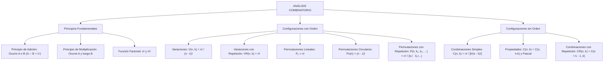

# TEMA XII: Análisis Combinatorio: Principios, Permutaciones y Combinaciones

---

## 1. FICHA TÉCNICA Y MATRIZ DE COMPETENCIAS

| Parámetro | Especificación Oficial |
| :--- | :--- |
| **Eje Temático** | EJE II: Matemática |
| **Asignatura / Componente** | Aritmética |
| **Tema Oficial N.°** | Tema XII: Análisis combinatorio: factorial, variaciones, combinaciones, permutaciones |
| **Referencia Prospecto UNSA** | Resolución de Consejo Universitario N.° 0028-2026 (Págs. 9, 44-45) |
| **Ponderación por Pregunta** | **Ingenierías:** 1.658267400 pts (4 preg. = 6.633070 pts)<br>**Biomédicas:** 1.265447400 pts (3 preg. = 3.796342 pts)<br>**Sociales:** 0.824134300 pts (3 preg. = 2.472403 pts) |
| **Nivel de Complejidad Cognitiva** | Bloom: Razonamiento Inductivo-Deductivo, Modelación Discreta y Estrategia Combinatoria |
| **Conexión Interuniversitaria** | **UNSA:** Permutaciones con elementos juntos/separados, rondas circulares con restricciones y combinaciones con repetición.<br>**UNMSM (DECO):** Rutas y caminos en cuadrículas urbanas, conformación de comités paritarios y distribución de turnos médicos hospitalarios.<br>**UNI:** Identidades combinatorias de Vandermonde, principio de inclusión-exclusión de Sylvester y particiones de enteros en teoría de grafos. |

### Matriz de Indicadores de Logro Evaluados
1. **Principios Fundamentales de Conteo:** Discriminar con rigor entre situaciones aditivas (sucesos excluyentes) y multiplicativas (etapas sucesivas o simultáneas).
2. **Modelado Factorial y Variaciones:** Operar expresiones algebraicas factoriales y calcular variaciones lineales con y sin repetición donde el orden de los elementos es determinante.
3. **Sistemas Permutacionales:** Resolver configuraciones lineales, circulares y con elementos repetidos bajo condiciones de ligadura (elementos juntos, adyacentes o separados).
4. **Teoría Combinatoria y Binomial:** Aplicar números combinatorios, propiedades de complementariedad, identidad de Pascal y combinaciones con repetición en problemas de partición.

---

## 2. MAPA TAXONÓMICO Y ONTOLOGÍA



---

## 3. DESARROLLO TEÓRICO FORMAL

### 3.1 Principios Fundamentales del Conteo

#### 1. Principio de Adición
Si un evento o actividad $A$ puede ocurrir de $m$ maneras diferentes y otro evento $B$ puede ocurrir de $n$ maneras diferentes, y **ambos eventos son mutuamente excluyentes** (no pueden ocurrir simultáneamente ni en secuencia: $A \cap B = \emptyset$), entonces el evento "$A$ o $B$" puede ocurrir de:
$$N = m + n \text{ maneras}$$

#### 2. Principio de Multiplicación (Principio Fundamental)
Si un experimento o procedimiento se compone de dos etapas sucesivas o independientes, donde la primera etapa puede realizarse de $m$ formas distintas y, para cada una de ellas, la segunda etapa puede realizarse de $n$ formas distintas, entonces el procedimiento completo "$A$ y luego $B$" puede realizarse de:
$$N = m \times n \text{ maneras}$$

---

### 3.2 La Función Factorial ($n!$) y Semifactorial ($n!!$)
Para todo número entero no negativo $n \in \mathbb{N} \cup \{0\}$, el factorial se define axiomáticamente:
$$0! = 1$$
$$n! = 1 \cdot 2 \cdot 3 \dots (n - 1) \cdot n = n \cdot (n - 1)! \quad (\forall n \ge 1)$$

* **Semifactorial o Factorial Doble ($n!!$):**
  $$n!! = \begin{cases} 2 \cdot 4 \cdot 6 \dots n, & \text{si } n \text{ es par} \\ 1 \cdot 3 \cdot 5 \dots n, & \text{si } n \text{ es impar} \end{cases}$$

---

### 3.3 El Cuadro de Decisión Combinatoria
Frente a cualquier problema de conteo, la elección del modelo se rige por dos preguntas axiomáticas:

| Modelo Combinatorio | ¿Importa el Orden? | ¿Intervienen Todos los Elementos? | ¿Se Pueden Repetir? | Fórmula Canónica |
| :--- | :---: | :---: | :---: | :--- |
| **Variación Simple ($V_k^n$)** | **SÍ** | NO ($k < n$) | NO | $V_k^n = \frac{n!}{(n - k)!}$ |
| **Variación con Repetición ($VR_k^n$)** | **SÍ** | NO o SÍ | **SÍ** | $VR_k^n = n^k$ |
| **Permutación Lineal ($P_n$)** | **SÍ** | **SÍ** ($k = n$) | NO | $P_n = n!$ |
| **Permutación Circular ($P_c(n)$)** | **SÍ** | **SÍ** (en anillo) | NO | $P_c(n) = (n - 1)!$ |
| **Permutación con Repetición ($P_n^{k_1, \dots, k_r}$)** | **SÍ** | **SÍ** | **SÍ** | $P_n^{k_1, \dots, k_r} = \frac{n!}{k_1! \cdot k_2! \dots k_r!}$ |
| **Combinación Simple ($C_k^n$)** | **NO** | NO ($k \le n$) | NO | $C_k^n = \frac{n!}{k!(n - k)!}$ |
| **Combinación con Repetición ($CR_k^n$)** | **NO** | Cualesquiera | **SÍ** | $CR_k^n = C_k^{n + k - 1}$ |

---

### 3.4 Permutaciones con Restricciones Especiales

#### 1. Elementos que Deben Permanecer Juntos (Método del Paquete o Bloque)
Si en una fila de $n$ personas, un subgrupo de $m$ personas específicas debe estar siempre junto:
* Se agrupa a las $m$ personas considerándolas como **un solo elemento ficticio**.
* El número total de elementos a ordenar pasa a ser: $n' = (n - m + 1)$.
* Las $m$ personas dentro del bloque pueden permutarse internamente entre sí de $m!$ formas.
$$N_{\text{total}} = (n - m + 1)! \times m!$$

#### 2. Elementos que Deben Estar Separados (Método de los Espacios Libres)
Para ordenar $n$ elementos donde $k$ elementos específicos no pueden estar juntos:
* Primero se ordenan los $(n - k)$ elementos restantes en una línea de $(n - k)!$ formas.
* Estos elementos generan $(n - k + 1)$ espacios o huecos disponibles (incluyendo los extremos).
* Los $k$ elementos especiales deben ubicarse en esos huecos disponibles de $V_k^{n - k + 1}$ maneras.

---

### 3.5 Propiedades Fundamentales de los Números Combinatorios

1. **Combinatorios Complementarios:**
   $$C_k^n = C_{n - k}^n$$
   *Ejemplo:* $C_8^{10} = C_{10 - 8}^{10} = C_2^{10} = \frac{10 \times 9}{2 \times 1} = 45$.
2. **Regla de Pascal (Identidad de Suma):**
   $$C_k^n + C_{k + 1}^n = C_{k + 1}^{n + 1}$$
3. **Suma Total de Coeficientes Binomiales (Subconjuntos de un Conjunto):**
   $$C_0^n + C_1^n + C_2^n + \dots + C_n^n = 2^n$$
4. **Fórmula Práctica de Degradación de Índices:**
   $$C_k^n = \frac{n}{k} \cdot C_{k - 1}^{n - 1}$$

---

## 4. FORMULARIO MAESTRO (LATEX ESTRICTO)

| Estructura Combinatoria | Expresión Matemática Rigurosa |
| :--- | :--- |
| **Variación Simple** | $V_k^n = \frac{n!}{(n - k)!} = n(n - 1)(n - 2)\dots(n - k + 1)$ |
| **Variación con Repetición** | $VR_k^n = n^k$ |
| **Permutación Lineal** | $P_n = n!$ |
| **Permutación Circular** | $P_c(n) = (n - 1)!$ |
| **Permutación con Repetición** | $P_n^{k_1, k_2, \dots, k_r} = \frac{n!}{k_1! \cdot k_2! \dots k_r!} \quad (\sum k_i = n)$ |
| **Combinación Simple** | $C_k^n = \frac{n!}{k!(n - k)!} = \frac{V_k^n}{k!}$ |
| **Identidad de Pascal** | $C_k^n + C_{k+1}^n = C_{k+1}^{n+1}$ |
| **Suma de Potencia de 2** | $\sum_{k=0}^n C_k^n = 2^n$ |
| **Combinación con Repetición** | $CR_k^n = C_k^{n + k - 1} = \frac{(n + k - 1)!}{k!(n - 1)!}$ |

---

## 5. MNEMOTECNIAS DE COMBATE PREUNIVERSITARIO

### 1. La Pregunta del Millón: "¿Importa el Orden?"
* **SÍ Importa:** Es una **VARIACIÓN** o **PERMUTACIÓN** (cargos jerárquicos: Presidente/Secretario, claves de cajero, podios de carreras, números formados con dígitos).
* **NO Importa:** Es una **COMBINACIÓN** (comisiones, equipos de trabajo, apretones de manos, selección de cartas, ensaladas de frutas).

### 2. Permutación Circular: "Fija a Uno, Permuta al Resto"
* En una mesa redonda de $n$ asientos, como todos los lugares son geométricamente equivalentes por rotación, debes **fijar a una persona de referencia** como ancla inamovible.
* El resto de $(n - 1)$ personas se permuta normalmente en los asientos restantes:
  $$P_c(n) = (n - 1)!$$

---

## 6. TÉCNICAS Y ARTIFICIOS DE CÁLCULO (HACKING PREUNIVERSITARIO)

### Artificio 1: La Regla Práctica del "Conteo Regresivo" para Combinaciones
Para calcular rápidamente $C_k^n$ sin escribir factoriales gigantes:
* Multiplica $k$ factores decrecientes en el numerador empezando desde $n$.
* Divide entre el factorial de $k$ ($k!$):
  $$C_3^8 = \frac{8 \times 7 \times 6}{3 \times 2 \times 1} = 56$$
  $$C_4^{12} = \frac{12 \times 11 \times 10 \times 9}{4 \times 3 \times 2 \times 1} = 495$$
* ¡Ahorra hasta un minuto entero por pregunta en el examen de admisión!

---

## 7. ZONA DE TRAMPAS Y DISTRACTORES ("¡PELIGRO EXAMEN!")

> [!CAUTION]
> ### Trampa 1: Olvidar Permutar Internamente a los Miembros de un Paquete
> Si $4$ amigos van al cine y $2$ de ellos se sientan siempre juntos:
> - Número de paquetes: $(4 - 2 + 1)! = 3! = 6$.
> - **¡EL ERROR HABITUAL!** Marcar $6$.
> - **Lo Correcto:** Los $2$ amigos pueden sentarse como $AB$ o $BA$ ($2! = 2$).
>   $$N_{\text{total}} = 3! \times 2! = 6 \times 2 = 12$$

> [!WARNING]
> ### Trampa 2: Confundir Asignación de Cargos con Elección de Delegaciones
> - Si de un grupo de $10$ personas se eligen $3$ personas para formar una **comisión paritaria de debate**: NO importa el orden $\implies C_3^{10} = 120$.
> - Si de las mismas $10$ personas se eligen un **Presidente, un Secretario y un Tesorero**: SÍ importa el orden de las funciones $\implies V_3^{10} = 10 \times 9 \times 8 = 720$.
> Ambas opciones ($120$ y $720$) siempre estarán presentes en las alternativas.

---

## 8. APLICACIÓN AL MUNDO REAL Y CONTEXTO DECO

### Conmutación y Ruteo en Redes de Fibra Óptica en Arequipa
En el tendido de telecomunicaciones subterráneas entre los campus de Ingenierías, Biomédicas y Sociales de la UNSA, los paquetes de datos viajan a través de una malla ortogonal de conmutadores de $m \times n$ nodos.
El número de trayectorias mínimas posibles que puede tomar un paquete desde un servidor origen hasta una terminal destino sin retroceder se modela como una **permutación con repetición**:
$$N_{\text{rutas}} = P_{m + n}^{m, n} = \frac{(m + n)!}{m! \cdot n!} = C_m^{m + n}$$
Esta formulación combinatoria permite a los protocolos de enrutamiento balancear el tráfico y evitar la saturación de los canales.

---

## 9. BANCO DE 5 EJERCICIOS RESUELTOS GRADUADOS

### Ejercicio 1 (Nivel Básico - Permutación Circular con Restricción)
**Enunciado:** Seis amigos, entre ellos una pareja de novios, se sientan alrededor de una mesa circular con seis asientos simétricamente distribuidos. ¿De cuántas maneras diferentes pueden sentarse si los novios deben estar siempre juntos?
- A) $24$
- B) $36$
- C) $48$
- D) $72$
- E) $120$

**Resolución Paso a Paso:**
1. Consideramos a la pareja de novios como un **único elemento ficticio (bloque)**.
2. Contamos el número de elementos a ordenar en la mesa redonda:
   - Los novios juntos: $1$ elemento.
   - Los otros $4$ amigos: $4$ elementos.
   - Total de elementos en el círculo: $n' = 1 + 4 = 5$ elementos.
3. Aplicamos la fórmula de **Permutación Circular** para estos $5$ elementos:
   $$P_c(5) = (5 - 1)! = 4! = 4 \times 3 \times 2 \times 1 = 24 \text{ maneras}$$
4. Dentro del bloque, los novios pueden permutar entre sí sus posiciones (él a la izquierda o ella a la izquierda):
   $$P_2 = 2! = 2 \text{ maneras}$$
5. Por el principio de multiplicación:
   $$N_{\text{total}} = P_c(5) \times 2! = 24 \times 2 = 48 \text{ maneras}$$
**Respuesta Correcta:** **C) 48**

---

### Ejercicio 2 (Nivel Intermedio - Conformación de Comisiones Mixtas)
**Enunciado:** En el departamento de Ingeniería de Sistemas de la UNSA hay $7$ profesores varones y $5$ profesoras mujeres. Se desea conformar una comisión evaluadora de $5$ integrantes compuesta por exactamente $3$ varones y $2$ mujeres. ¿Cuántas comisiones distintas se pueden estructurar?
- A) $280$
- B) $320$
- C) $350$
- D) $420$
- E) $450$

**Resolución Paso a Paso:**
1. Analizamos la naturaleza del problema:
   - Se eligen personas para una comisión general (no hay jerarquía de cargos), por lo que **no importa el orden**: se trata de **combinaciones**.
2. **Selección de los varones:**
   De un total de $7$ profesores varones, debemos seleccionar $3$:
   $$C_3^7 = \frac{7 \times 6 \times 5}{3 \times 2 \times 1} = 35 \text{ maneras}$$
3. **Selección de las mujeres:**
   De un total de $5$ profesoras mujeres, debemos seleccionar $2$:
   $$C_2^5 = \frac{5 \times 4}{2 \times 1} = 10 \text{ maneras}$$
4. Por el principio de multiplicación (la comisión requiere varones Y mujeres):
   $$N_{\text{comisiones}} = C_3^7 \times C_2^5 = 35 \times 10 = 350 \text{ comisiones}$$
**Respuesta Correcta:** **C) 350**

---

### Ejercicio 3 (Nivel Intermedio-Avanzado - Permutaciones con Elementos Repetidos)
**Enunciado:** ¿Cuántas palabras o códigos de $8$ letras, con o sin sentido lingüístico, pueden formarse utilizando todas las letras de la palabra **AREQUIPA**?
- A) $10\,080$
- B) $15\,120$
- C) $20\,160$
- D) $40\,320$
- E) $50\,400$

**Resolución Paso a Paso:**
1. Analizamos las letras que componen la palabra **AREQUIPA**:
   - Total de letras: $n = 8$ letras ($A, R, E, Q, U, I, P, A$).
2. Contamos la frecuencia de repetición de cada letra:
   - Letra $A$: se repite $2$ veces.
   - Letras $R, E, Q, U, I, P$: se presentan $1$ sola vez cada una.
3. Como intervienen todas las letras, el orden es determinante y hay elementos repetidos, aplicamos **Permutación con Repetición**:
   $$P_8^{2, 1, 1, 1, 1, 1, 1} = \frac{8!}{2! \cdot 1! \cdot 1! \cdot 1! \cdot 1! \cdot 1! \cdot 1!} = \frac{8!}{2!}$$
4. Calculamos numéricamente:
   $$8! = 40\,320$$
   $$P_8^2 = \frac{40\,320}{2} = 20\,160 \text{ palabras distintas}$$
**Respuesta Correcta:** **C) 20 160**

---

### Ejercicio 4 (Nivel Avanzado - Combinaciones con Repetición)
**Enunciado:** Una heladería artesanal en Characato ofrece $4$ sabores diferentes de helado: queso helado, lúcuma, chocolate y fresa. Si un cliente desea comprar un barquillo con $3$ porciones de helado, pudiendo repetir sabores, ¿de cuántas formas distintas puede elegir su combinación de helado?
- A) $15$
- B) $20$
- C) $24$
- D) $30$
- E) $36$

**Resolución Paso a Paso:**
1. Analizamos las condiciones del problema:
   - En un barquillo de helado **no importa el orden** en que se nombren o coloquen los sabores para el cliente.
   - Se permite **repetir sabores** (por ejemplo, tres porciones de queso helado).
   - Por tanto, se trata de una **Combinación con Repetición**:
     - Número de elementos o tipos disponibles: $n = 4$ sabores.
     - Número de elementos a elegir: $k = 3$ porciones.
2. Aplicamos la fórmula canónica de Combinaciones con Repetición:
   $$CR_k^n = C_k^{n + k - 1}$$
   $$CR_3^4 = C_3^{4 + 3 - 1} = C_3^6$$
3. Calculamos el valor del número combinatorio:
   $$C_3^6 = \frac{6 \times 5 \times 4}{3 \times 2 \times 1} = 20 \text{ formas distintas}$$
**Respuesta Correcta:** **B) 20**

---

### Ejercicio 5 (Nivel Boss Challenge - UNI / UNSA Ingenierías)
**Enunciado:** Ocho estudiantes, entre ellos Carlos y Diana, deben ubicarse en una fila de ocho asientos numerados consecutivamente del $1$ al $8$. ¿De cuántas maneras diferentes pueden sentarse todos ellos de modo que Carlos y Diana **nunca** queden sentados en asientos contiguos?
- A) $25\,200$
- B) $28\,800$
- C) $30\,240$
- D) $32\,400$
- E) $35\,280$

**Resolución Paso a Paso:**
1. **Estrategia del Complemento:**
   Resulta mucho más rápido calcular el total de ordenamientos posibles sin restricción y restarle aquellos ordenamientos donde Carlos y Diana se sientan **juntos**:
   $$N_{\text{separados}} = N_{\text{totales sin restricción}} - N_{\text{juntos}}$$
2. **Cálculo del Total Sin Restricción ($N_{\text{totales}}$):**
   Son $8$ personas ordenándose en $8$ asientos lineales:
   $$N_{\text{totales}} = P_8 = 8! = 40\,320 \text{ maneras}$$
3. **Cálculo de los Casos donde Carlos y Diana se sientan Juntos ($N_{\text{juntos}}$):**
   - Agrupamos a Carlos y Diana en un solo bloque: $(CD)$.
   - Elementos a ordenar: el bloque $(CD)$ más las otras $6$ personas $\implies 1 + 6 = 7$ elementos.
   - Las $7$ entidades se ordenan en la fila de $7!$ maneras.
   - Carlos y Diana pueden permutar entre sí dentro del bloque de $2!$ maneras ($CD$ o $DC$).
   $$N_{\text{juntos}} = 7! \times 2! = 5040 \times 2 = 10\,080 \text{ maneras}$$
4. **Cálculo de los Casos donde están Separados:**
   $$N_{\text{separados}} = 40\,320 - 10\,080 = 30\,240 \text{ maneras}$$
**Respuesta Correcta:** **C) 30 240**

---

## 10. GLOSARIO DE 10 TÉRMINOS CLAVE

1. **Principio de Adición:** Regla que establece la suma de posibilidades para eventos que son mutuamente excluyentes.
2. **Principio de Multiplicación:** Regla de producto cartesiano para procedimientos compuestos de etapas secuenciales independientes.
3. **Factorial ($n!$):** Producto continuo de todos los números enteros positivos consecutivos desde $1$ hasta $n$.
4. **Variación:** Agrupación ordenada de un subconjunto de elementos seleccionados de un conjunto mayor donde el orden es relevante.
5. **Permutación Lineal:** Ordenamiento de todos los elementos disponibles de un conjunto sobre una secuencia rectilínea.
6. **Permutación Circular:** Arreglo cerrado de elementos alrededor de una trayectoria continua donde solo importan las posiciones relativas.
7. **Permutación con Repetición:** Ordenamiento de elementos donde algunos de ellos son indistinguibles entre sí.
8. **Combinación Simple:** Selección o subconjunto de elementos donde la disposición posicional carece de relevancia.
9. **Identidad de Pascal:** Teorema que postula que $C_k^n + C_{k+1}^n = C_{k+1}^{n+1}$, base del triángulo de Tartaglia.
10. **Combinación con Repetición:** Agrupación no ordenada donde un mismo tipo de elemento puede ser seleccionado múltiples veces.

---

## 11. BANCO DE FLASHCARDS (Q/A)

* **PREGUNTA 1:** ¿Cuál es la diferencia conceptual determinante entre una Variación y una Combinación?
  - **RESPUESTA:** En la Variación el orden de colocación de los elementos SÍ altera el resultado; en la Combinación el orden NO importa.
* **PREGUNTA 2:** ¿Cuál es la fórmula para calcular la permutación circular de $n$ elementos?
  - **RESPUESTA:** $P_c(n) = (n - 1)!$.
* **PREGUNTA 3:** ¿A qué equivale la suma de todos los números combinatorios $\sum_{k=0}^n C_k^n$?
  - **RESPUESTA:** Equivale a $2^n$ (la cantidad total de subconjuntos de un conjunto de $n$ elementos).
* **PREGUNTA 4:** ¿Cómo se resuelve un problema lineal donde ciertos elementos deben permanecer siempre juntos?
  - **RESPUESTA:** Se consideran los elementos juntos como un único bloque ficticio, se permutan todos los elementos resultantes y se multiplica por la permutación interna del bloque.
* **PREGUNTA 5:** ¿Cuál es la fórmula de combinaciones con repetición $CR_k^n$?
  - **RESPUESTA:** $CR_k^n = C_k^{n + k - 1}$.
* **PREGUNTA 6:** ¿Cuánto vale por axioma universal $0!$?
  - **RESPUESTA:** $0! = 1$.

---

## 12. MOTOR DE GAMIFICACIÓN (JSON KMP)

```json
{
  "topicId": "aritmetica_tema_12_analisis_combinatorio",
  "subject": "Aritmética",
  "topicTitle": "Análisis Combinatorio: Principios, Permutaciones y Combinaciones",
  "totalXp": 200,
  "difficulty": "Avanzado",
  "examTargets": ["UNSA", "UNMSM", "UNI"],
  "microMissions": [
    {
      "missionId": "m_comb_01",
      "title": "El Consejo de la UNSA",
      "instruction": "Calcula de cuántas maneras pueden sentarse 10 decanos en una mesa redonda si el Rector y Vicerrector deben estar juntos.",
      "xpReward": 40,
      "badgeUnlocked": "Maestro del Círculo Combinatorio"
    },
    {
      "missionId": "m_comb_02",
      "title": "Criptógrafo de Anagramas",
      "instruction": "Halla cuántas palabras de 10 letras pueden formarse con INGENIERIA donde las vocales estén siempre juntas.",
      "xpReward": 60,
      "badgeUnlocked": "Hacker de Anagramas"
    },
    {
      "missionId": "m_comb_03",
      "title": "El Arquitecto de Rutas Ópticas",
      "instruction": "Calcula el número de caminos mínimos entre dos esquinas opuestas de una red de fibra óptica de 7x5 bloques.",
      "xpReward": 100,
      "badgeUnlocked": "Estratega Combinatorio Supremo"
    }
  ]
}
```
