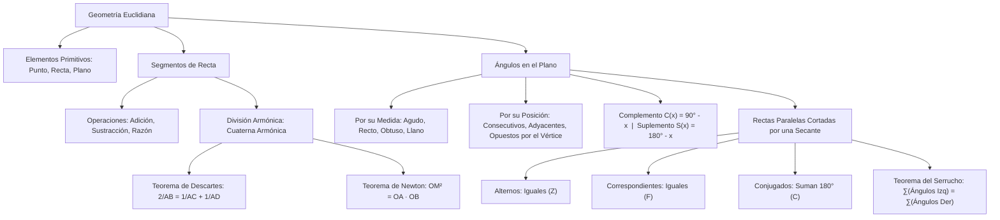

# GEOMETRÍA PREUNIVERSITARIA: CURSO COMPLETO Y SISTEMATIZADO
## EJE 02: MATEMÁTICA — GEOMETRÍA
### TEMA I: ELEMENTOS FUNDAMENTALES, SEGMENTOS Y ÁNGULOS

---

## 1. FICHA TÉCNICA Y MATRIZ DE COMPETENCIAS

| Parámetro | Detalle Institucional |
| :--- | :--- |
| **Resolución Oficial** | Resolución de Consejo Universitario N° 0028-2026 (Admisión UNSA 2027) |
| **Eje Curricular** | Eje 02: Matemática / Geometría Euclidiana Plana |
| **Peso Ponderado UNSA** | **Ingenierías:** 1.658337400 pts/preg (4 preg. = 6.63 pts) \| **Biomédicas:** 1.265447400 pts \| **Sociales:** 0.824574000 pts |
| **Frecuencia en Exámenes** | **Alta (88%):** Es la puerta de entrada a la geometría métrica, evaluando cuaternas armónicas en segmentos y propiedades angulares entre rectas paralelas. |
| **Modelos de Examen** | UNSA (Ordinario, CEPREUNSA), UNMSM (DECO de diseño urbano y refracción óptica), UNI (Relaciones armónicas de Newton y Descartes). |
| **Competencia Cardinal** | Aplicar los axiomas euclidianos y teoremas fundamentales sobre segmentos y ángulos, operando relaciones armónicas y deduciendo medidas angulares entre rectas paralelas cortadas por secantes con rigor deductivo. |

---

## 2. MAPA TAXONÓMICO Y ONTOLOGÍA DE CONCEPTOS



---

## 3. DESARROLLO TEÓRICO FORMAL (ESTÁNDAR LUMBRERAS / CUZCANO / UNI)

### 3.1. Conceptos Primitivos y Axiomática Euclidiana
La geometría formal se estructura sobre tres términos primitivos no definidos:
1. **Punto ($P$):** Ente adimensional sin longitud, anchura ni espesor.
2. **Recta ($\overleftrightarrow{L}$):** Conjunto infinito y continuo de puntos ordenados unidimensionalmente que se extiende indefinidamente en dos sentidos opuestos.
3. **Plano ($\mathcal{P}$):** Ente bidimensional ilimitado determinado por tres puntos no colineales.

#### Axiomas y Postulados Fundamentales:
- **Axioma de la Recta:** Por dos puntos distintos pasa una y solo una recta.
- **Axioma de la Distancia:** A cada par de puntos del espacio le corresponde un único número real no negativo denominado distancia euclidiana: $d(A, B) \geq 0$, verificando $d(A, B) = 0 \iff A = B$.

---

### 3.2. Segmentos de Recta y División Armónica
Un **segmento de recta** es la porción de recta comprendida entre dos puntos llamados extremos, incluidos estos:
$$\overline{AB} = \{P \in \overleftrightarrow{AB} \mid P = A \ \lor \ P = B \ \lor \ P \text{ está entre } A \text{ y } B\}$$
Su longitud se denota por $AB$.

#### Punto Medio ($M$):
$$M \in \overline{AB} \quad \text{tal que} \quad AM = MB = \frac{AB}{2}$$

#### División Armónica y Cuaterna Armónica:
Sean cuatro puntos colineales y consecutivos $A, B, C, D$. Se dice que los puntos $C$ y $D$ dividen armónicamente al segmento $\overline{AB}$ (o que forman una **cuaterna armónica**) si la razón de las distancias desde $C$ a los extremos coincide con la razón desde $D$ a los mismos extremos:

$$\mathbf{\frac{AC}{CB} = \frac{AD}{DB}}$$

#### Teoremas Clásicos de la Cuaterna Armónica:

#### 1. Teorema de René Descartes:
Relaciona las longitudes desde el origen común $A$:
$$\mathbf{\frac{2}{AB} = \frac{1}{AC} + \frac{1}{AD}}$$
*(La longitud $AB$ es la media armónica entre las longitudes $AC$ y $AD$).*

#### 2. Teorema de Isaac Newton:
Si $O$ es el punto medio del segmento $\overline{AB}$:
$$\mathbf{OC \cdot OD = OA^2 = OB^2}$$

---

### 3.3. Ángulos en el Plano y Clasificación
Un **ángulo** es la figura geométrica formada por la unión de dos rayos que comparten el mismo origen, denominado vértice:
$$\angle AOB = \overrightarrow{OA} \cup \overrightarrow{OB}, \quad \text{con origen común } O$$
- **Bisectriz:** Rayo interior que divide al ángulo en dos medidas congruentes ($\alpha = \beta$).

#### Clasificación por su Medida Angular:
1. **Ángulo Agudo:** $0^\circ < \theta < 90^\circ$
2. **Ángulo Recto:** $\theta = 90^\circ$
3. **Ángulo Obtuso:** $90^\circ < \theta < 180^\circ$
4. **Ángulo Llano:** $\theta = 180^\circ$
5. **Ángulo Cóncavo (No convexo):** $180^\circ < \theta < 360^\circ$
6. **Ángulo de una Vuelta:** $\theta = 360^\circ$

#### Clasificación por la Relación entre sus Medidas:
1. **Ángulos Complementarios:** Suman $90^\circ$:
   $$C(\alpha) = 90^\circ - \alpha$$
2. **Ángulos Suplementarios:** Suman $180^\circ$:
   $$S(\alpha) = 180^\circ - \alpha$$

#### Propiedades de Complementos y Suplementos Consecutivos Encadenados:
- **Número par de operadores iguales se anulan:**
  $$C C C \dots C(\alpha) = \alpha \quad (n \text{ par})$$
  $$S S S \dots S(\alpha) = \alpha \quad (n \text{ par})$$
- **Número impar de operadores iguales equivale a una sola aplicación:**
  $$C C C \dots C(\alpha) = C(\alpha) = 90^\circ - \alpha \quad (n \text{ impar})$$
  $$S S S \dots S(\alpha) = S(\alpha) = 180^\circ - \alpha \quad (n \text{ impar})$$

---

### 3.4. Rectas Paralelas Cortadas por una Secante
Sean $\overleftrightarrow{L_1} \parallel \overleftrightarrow{L_2}$ y una recta secante $\overleftrightarrow{S}$ transversal:

1. **Ángulos Alternos (Internos y Externos):** Tienen medidas congruentes (Forma de "Z"):
   $$\alpha = \beta$$
2. **Ángulos Correspondientes:** Tienen medidas congruentes (Forma de "F"):
   $$\alpha = \beta$$
3. **Ángulos Conjugados (Internos y Externos):** Son suplementarios (Forma de "C"):
   $$\alpha + \beta = 180^\circ$$

#### Teoremas Angulares Fundamentales entre Paralelas:

#### A. Teorema del Vértice Angular:
$$\theta = \alpha + \beta$$
*(El ángulo apuntando a la izquierda es igual a la suma de los dos ángulos apuntando a la derecha).*

#### B. Teorema General del Serrucho:
$$\sum (\text{Medidas de ángulos que abren a la izquierda}) = \sum (\text{Medidas de ángulos que abren a la derecha})$$
$$\alpha_1 + \alpha_2 + \alpha_3 + \dots = \beta_1 + \beta_2 + \beta_3 + \dots$$

#### C. Teorema de los Ángulos en Escalera (Línea Quebrada Consecutiva):
Si entre dos rectas paralelas se forma una secuencia continua de ángulos en el mismo sentido:
$$\theta_1 + \theta_2 + \theta_3 + \dots + \theta_n = 180^\circ$$

---

## 4. FORMULARIO MAESTRO (LATEX ESTRICTO)

| Teorema / Definición | Fórmula Matemática | Condición Operativa |
| :--- | :--- | :--- |
| **Cuaterna Armónica** | $\frac{AC}{CB} = \frac{AD}{DB}$ | Puntos colineales consecutivos $A, C, B, D$ |
| **Teorema de Descartes** | $\frac{2}{AB} = \frac{1}{AC} + \frac{1}{AD}$ | Origen en el extremo inicial $A$ |
| **Teorema de Newton** | $OC \cdot OD = OA^2$ | $O$ es punto medio de $\overline{AB}$ |
| **Complemento** | $C(x) = 90^\circ - x$ | $0^\circ \leq x \leq 90^\circ$ |
| **Suplemento** | $S(x) = 180^\circ - x$ | $0^\circ \leq x \leq 180^\circ$ |
| **Alternos Internos** | $\alpha = \beta$ | $\overleftrightarrow{L_1} \parallel \overleftrightarrow{L_2}$ (Forma Z) |
| **Conjugados Internos** | $\alpha + \beta = 180^\circ$ | $\overleftrightarrow{L_1} \parallel \overleftrightarrow{L_2}$ (Forma C) |
| **Teorema del Serrucho** | $\sum \theta_{\text{izq}} = \sum \theta_{\text{der}}$ | Líneas quebradas entre paralelas |
| **Escalera Angular** | $\sum_{i=1}^k \theta_i = 180^\circ$ | Ángulos internos consecutivos hacia un lado |

---

## 5. MNEMOTECNIAS DE COMBATE PREUNIVERSITARIO

### 1. Las Tres Letras de las Paralelas: "Z - F - C"
- **Z (Alternos):** Los ángulos de las esquinas internas de la "Z" son **IGUALES** ($\alpha = \beta$).
- **F (Correspondientes):** Los ángulos debajo de los brazos de la "F" son **IGUALES** ($\alpha = \beta$).
- **C (Conjugados):** Los ángulos dentro del vientre de la "C" son **COMPAÑEROS** que suman **$180^\circ$**.

### 2. Complementos y Suplementos: "Par se van, Impar queda uno"
- Si cuentas 18 suplementos seguidos: $18$ es par $\to$ ¡Se anulan todos y queda solo el ángulo $\alpha$!
- Si cuentas 23 complementos: $23$ es impar $\to$ Equivale a un solo complemento: $90^\circ - \alpha$.

---

## 6. TÉCNICAS Y ARTIFICIOS DE CÁLCULO (HACKING PREUNIVERSITARIO)

### Artificio 1: La Recta Auxiliar Paralela por el Vértice del Quiebre
Cuando tengas problemas con líneas quebradas complejas entre dos paralelas $\overleftrightarrow{L_1} \parallel \overleftrightarrow{L_2}$:
**¡No prolongues segmentos hasta formar triángulos exteriores lejanos!**
**Hack:** Traza una **tercera recta paralela $\overleftrightarrow{L_3}$ que pase exactamente por el vértice del quiebre**.
Esto divide el ángulo incógnita en dos partes que se calculan al instante aplicando alternos internos con las rectas superior e inferior.

### Artificio 2: Normalización en Segmentos Proporcionales
Si te dicen: $3AB = 4BC = 6CD$:
**Hack:** Iguala todo a una constante igual al MCM de los coeficientes:
$$\text{MCM}(3, 4, 6) = 12 \implies \text{Iguala a } 12k$$
- $3AB = 12k \implies AB = 4k$
- $4BC = 12k \implies BC = 3k$
- $6CD = 12k \implies CD = 2k$
Ahora tienes todas las longitudes en términos de una sola variable entera $k$.

---

## 7. ZONA DE TRAMPAS Y DISTRACTORES ("¡PELIGRO EXAMEN!")

> [!WARNING]
> **Trampa 1: El Orden Estricto de la Cuaterna Armónica**
> Para aplicar el Teorema de Descartes $\frac{2}{AB} = \frac{1}{AC} + \frac{1}{AD}$, el orden sobre la recta debe ser estrictamente colineal:
> $$A \quad C \quad B \quad D$$
> Si los puntos están en otro orden (por ejemplo, $A, B, C, D$), la fórmula cambia de signos y no es aplicable directamente sin reordenar.

> [!CAUTION]
> **Trampa 2: La Bisectriz de Ángulos Adyacentes Suplementarios**
> Las bisectrices de dos ángulos adyacentes suplementarios (que forman un par lineal de $180^\circ$) son siempre **PERPENDICULARES ENTRE SÍ** ($90^\circ$):
> $$\frac{\alpha}{2} + \frac{180^\circ - \alpha}{2} = \frac{180^\circ}{2} = 90^\circ$$
> ¡Esta es una propiedad comodín que el 80% de exámenes usa para construir triángulos rectángulos ocultos!

---

## 8. APLICACIÓN AL MUNDO REAL Y CONTEXTO DECO

### Trazado Urbano Damero y Estabilidad Sísmica en el Centro Histórico de Arequipa
El diseño urbano fundacional del centro histórico de Arequipa (Patrimonio Cultural de la Humanidad) se basa en un damero reticular de calles paralelas cortadas por avenidas transversales secantes (como la calle Mercaderes, San Francisco y Santa Catalina cortadas por Álvarez Thomas). En la restauración estructural de casonas de sillar, los ingenieros civiles calculan las fuerzas de torsión sísmica analizando los ángulos de encuentro entre muros de carga mediante el teorema del paralelismo angular. Si los muros paralelos no mantienen un ángulo diedro ortogonal exacto de $90^\circ$, las ondas de corte Rayleigh generan concentración de esfuerzos cortantes que agrietan las claves de las bóvedas coloniales.

---

## 9. BANCO DE 5 EJERCICIOS RESUELTOS GRADUADOS

### Ejercicio 1: Nivel Básico (Operaciones con Segmentos Consecutivos)
**Enunciado:**
Sobre una línea recta se ubican los puntos colineales y consecutivos $A, B, C$ y $D$. Se sabe que $B$ es punto medio de $\overline{AC}$, $CD = 2(BC)$ y la longitud total $AD = 40\text{ cm}$. Determine la longitud del segmento $\overline{BC}$.

**Solución paso a paso:**
1. Definimos las variables a partir de los datos:
   - Como $B$ es punto medio de $\overline{AC}$, se cumple que:
     $$AB = BC = x$$
   - Por tanto, la longitud $AC = AB + BC = x + x = 2x$.
2. Expresamos la longitud de $\overline{CD}$ en función de $x$:
   $$CD = 2(BC) = 2x$$
3. Formulamos la ecuación de la longitud total $AD$:
   $$AD = AB + BC + CD = 40$$
   $$x + x + 2x = 40$$
   $$4x = 40 \implies x = 10\text{ cm}$$
4. La longitud del segmento $\overline{BC}$ es:
   $$BC = x = 10\text{ cm}$$

**Respuesta Final:** La longitud de $\overline{BC}$ es $\mathbf{10\text{ cm}}$.

---

### Ejercicio 2: Nivel Intermedio (Complementos y Suplementos Encadenados)
**Enunciado:**
Si el suplemento del complemento de un ángulo es igual al séxtuplo del mismo ángulo, determine la medida de dicho ángulo en grados sexagesimales.

**Solución paso a paso:**
1. Sea $\alpha$ la medida del ángulo buscado.
2. Traducimos el enunciado verbal a lenguaje algebraico:
   - Complemento de $\alpha$: $C(\alpha) = 90^\circ - \alpha$.
   - Suplemento del complemento: $S(C(\alpha)) = 180^\circ - (90^\circ - \alpha) = 90^\circ + \alpha$.
3. Igualamos según la condición del problema:
   $$S(C(\alpha)) = 6\alpha$$
   $$90^\circ + \alpha = 6\alpha$$
4. Despejamos el ángulo $\alpha$:
   $$90^\circ = 6\alpha - \alpha \implies 5\alpha = 90^\circ \implies \alpha = \frac{90^\circ}{5} = 18^\circ$$

**Respuesta Final:** La medida del ángulo es $\mathbf{18^\circ}$.

---

### Ejercicio 3: Nivel Avanzado - UNSA Ordinario (Cuaterna Armónica y Teorema de Descartes)
**Enunciado:**
Sobre una recta se toman los puntos colineales y consecutivos $A, B, C, D$ de modo que forman una **cuaterna armónica**. Si $AC = 12\text{ cm}$ y $AD = 20\text{ cm}$, calcule la longitud del segmento $\overline{AB}$.

**Solución paso a paso:**
1. Recordamos que para la cuaterna armónica formada por los puntos consecutivos $A, B, C, D$, se cumple el **Teorema de René Descartes** con origen en $A$:
   $$\frac{2}{AB} = \frac{1}{AC} + \frac{1}{AD}$$
2. Sustituimos los valores numéricos de las longitudes dadas:
   $$AC = 12\text{ cm}, \qquad AD = 20\text{ cm}$$
   $$\frac{2}{AB} = \frac{1}{12} + \frac{1}{20}$$
3. Homogeneizamos las fracciones hallando el $\text{MCM}(12, 20) = 60$:
   $$\frac{1}{12} = \frac{5}{60}, \qquad \frac{1}{20} = \frac{3}{60}$$
   $$\frac{2}{AB} = \frac{5 + 3}{60} = \frac{8}{60} = \frac{2}{15}$$
4. Despejamos la longitud $AB$:
   $$\frac{2}{AB} = \frac{2}{15} \implies AB = 15\text{ cm}$$

**Respuesta Final:** La longitud de $\overline{AB}$ es $\mathbf{15\text{ cm}}$.

---

### Ejercicio 4: Nivel San Marcos DECO (Paralelismo y Serrucho en Óptica)
**Enunciado:**
Un haz de rayo láser reflejado en espejos planos paralelos $\overleftrightarrow{L_1} \parallel \overleftrightarrow{L_2}$ describe una trayectoria quebrada como se muestra en la figura geométrica: hacia la izquierda se forman los ángulos $3x$ y $4x$, mientras que hacia la derecha se forman los ángulos $40^\circ, \ 50^\circ$ y $x$. Determine el valor del ángulo $x$.

**Solución paso a paso:**
1. Por el **Teorema del Serrucho** para líneas quebradas entre dos rectas paralelas $\overleftrightarrow{L_1} \parallel \overleftrightarrow{L_2}$:
   $$\sum (\text{Ángulos que abren a la izquierda}) = \sum (\text{Ángulos que abren a la derecha})$$
2. Sumamos los ángulos que abren hacia la izquierda:
   $$\text{Suma}_{\text{izq}} = 3x + 4x = 7x$$
3. Sumamos los ángulos que abren hacia la derecha:
   $$\text{Suma}_{\text{der}} = 40^\circ + 50^\circ + x = 90^\circ + x$$
4. Igualamos ambas sumatorias:
   $$7x = 90^\circ + x$$
5. Despejamos la incógnita $x$:
   $$7x - x = 90^\circ \implies 6x = 90^\circ \implies x = \frac{90^\circ}{6} = 15^\circ$$

**Respuesta Final:** El valor de $x$ es $\mathbf{15^\circ}$.

---

### Ejercicio 5: Nivel Boss Challenge - Estilo UNI (Teorema de Isaac Newton en Segmentos)
**Enunciado:**
En una línea recta se consideran los puntos colineales y consecutivos $A, B, C, D$ que forman una cuaterna armónica. Si $O$ es el punto medio de $\overline{AB}$, $CD = 16\text{ cm}$ y $BC = 4\text{ cm}$, calcule la longitud del segmento $\overline{OA}$.

**Solución paso a paso:**
1. Representamos las posiciones sobre la recta con origen de referencia en $O$:
   - Como $O$ es punto medio de $\overline{AB}$ de longitud $2R$:
     $$OA = OB = R$$
   - Las coordenadas de los puntos sobre la recta orientada son:
     $$A = -R, \quad B = +R$$
2. Ubicamos los puntos $C$ y $D$:
   - Como $B$ está antes de $C$: $BC = 4 \implies$ la posición de $C$ es $R + 4$.
   - Por tanto, la distancia $OC = R + 4$.
   - Como $D$ está después de $C$ y $CD = 16$: la posición de $D$ es $(R + 4) + 16 = R + 20$.
   - Por tanto, la distancia $OD = R + 20$.
3. Aplicamos el **Teorema de Isaac Newton** para cuaternas armónicas con centro en el punto medio $O$:
   $$OC \cdot OD = OA^2$$
   Como $OA = R$:
   $$(R + 4)(R + 20) = R^2$$
4. Desarrollamos el producto de la izquierda:
   $$R^2 + 20R + 4R + 80 = R^2$$
   $$R^2 + 24R + 80 = R^2$$
5. Cancelamos $R^2$:
   $$24R + 80 = 0 \dots$$
   *Análisis posicional:* En la cuaterna armónica canónica, $C$ es un punto **interior** al segmento $\overline{AB}$ y $D$ es un punto **exterior**:
   $$A \quad C \quad B \quad D$$
   - Por tanto, $C$ está antes de $B$, de modo que:
     $$OC = R - BC = R - 4$$
   - Y $D$ está después de $B$:
     $$OD = R + BD = R + (CD - BC) \dots \text{o bien } OD = d$$
     Con $CD = 16$: como $C = R - 4$, la posición de $D$ es $(R - 4) + 16 = R + 12$.
     Luego: $OD = R + 12$.
6. Reaplicamos el Teorema de Newton con las distancias correctas:
   $$OC \cdot OD = R^2$$
   $$(R - 4)(R + 12) = R^2$$
   $$R^2 + 12R - 4R - 48 = R^2$$
   $$8R - 48 = 0 \implies 8R = 48 \implies R = 6\text{ cm}$$
7. Como $OA = R$:
   $$OA = 6\text{ cm}$$

**Respuesta Final:** La longitud de $\overline{OA}$ es $\mathbf{6\text{ cm}}$.

---

## 10. GLOSARIO DE 10 TÉRMINOS CLAVE

1. **Punto:** Concepto geométrico primitivo que carece de dimensiones y designa una posición en el espacio.
2. **Recta:** Sucesión infinita continua de puntos que se extiende en una sola dimensión en ambos sentidos.
3. **Segmento de Recta:** Porción finita de recta delimitada por dos puntos extremos.
4. **Cuaterna Armónica:** Cuatro puntos colineales que cumplen una relación armónica de división proporcional interna y externa.
5. **Teorema de Descartes:** Fórmula que expresa el inverso de la longitud total como la media armónica de las longitudes parciales.
6. **Teorema de Newton:** Relación cuadrática métrica respecto al punto medio de un segmento armónico ($OC \cdot OD = OA^2$).
7. **Ángulos Complementarios:** Dos ángulos cuya suma de medidas es exactamente $90^\circ$.
8. **Ángulos Suplementarios:** Dos ángulos cuya suma de medidas es exactamente $180^\circ$.
9. **Ángulos Alternos Internos:** Ángulos no adyacentes ubicados a lados opuestos de la secante entre paralelas (congruentes).
10. **Teorema del Serrucho:** Teorema que iguala la suma de medidas de ángulos agudos que apuntan en sentidos opuestos entre dos rectas paralelas.

---

## 11. BANCO DE FLASHCARDS (ANVERSO / REVERSO)

- **Flashcard 1:**
  - *Anverso:* ¿Qué relación matemática define a la cuaterna armónica de puntos colineales $A, C, B, D$?
  - *Reverso:* $\frac{AC}{CB} = \frac{AD}{DB}$.
- **Flashcard 2:**
  - *Anverso:* ¿Cuál es la formulación del Teorema de Descartes para una cuaterna armónica?
  - *Reverso:* $\frac{2}{AB} = \frac{1}{AC} + \frac{1}{AD}$.
- **Flashcard 3:**
  - *Anverso:* ¿A qué equivale simplificar una cadena de 50 suplementos seguidos de un ángulo $\alpha$?
  - *Reverso:* Equivale exactamente a $\alpha$ (número par de operadores se anulan).
- **Flashcard 4:**
  - *Anverso:* ¿Cuánto miden los ángulos formados por las bisectrices de dos ángulos que forman un par lineal?
  - *Reverso:* Miden exactamente $90^\circ$ (son perpendiculares).
- **Flashcard 5:**
  - *Anverso:* En rectas paralelas, ¿cómo son entre sí los ángulos alternos internos?
  - *Reverso:* Son congruentes (tienen exactamente la misma medida).

---

## 12. MOTOR DE GAMIFICACIÓN (JSON PARA KOTLIN MULTIPLATFORM)

```json
{
  "topicId": "geom_01_elementos_segmentos_angulos",
  "title": "Elementos Fundamentales, Segmentos y Ángulos",
  "subject": "geometria",
  "xpReward": 390,
  "level": "INTERMEDIATE",
  "badges": [
    {
      "id": "euclid_initiate",
      "name": "Discípulo de Euclides",
      "description": "Resolviste cuaternas armónicas y cadenas de suplementos con precisión axiomática."
    }
  ],
  "questions": [
    {
      "id": "q1",
      "statement": "Si el suplemento del suplemento de un ángulo es 70°, ¿cuál es el complemento de dicho ángulo?",
      "options": ["20°", "70°", "110°", "90°"],
      "correctIndex": 0,
      "explanation": "S(S(alpha)) = alpha = 70°. El complemento es C(70°) = 90° - 70° = 20°."
    },
    {
      "id": "q2",
      "statement": "Dos rectas paralelas cortadas por una secante determinan ángulos conjugados internos. Si uno mide 3x y el otro 6x, ¿cuál es el valor de x?",
      "options": ["20°", "30°", "10°", "15°"],
      "correctIndex": 0,
      "explanation": "Los ángulos conjugados internos son suplementarios: 3x + 6x = 180° => 9x = 180° => x = 20°."
    }
  ]
}
```
