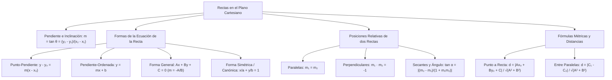

# GEOMETRÍA PREUNIVERSITARIA: CURSO COMPLETO Y SISTEMATIZADO
## EJE 02: MATEMÁTICA — GEOMETRÍA
### TEMA II: RECTAS EN EL PLANO, POSICIONES RELATIVAS Y DISTANCIAS

---

## 1. FICHA TÉCNICA Y MATRIZ DE COMPETENCIAS

| Parámetro | Detalle Institucional |
| :--- | :--- |
| **Resolución Oficial** | Resolución de Consejo Universitario N° 0028-2026 (Admisión UNSA 2027) |
| **Eje Curricular** | Eje 02: Matemática / Geometría Analítica Plana |
| **Peso Ponderado UNSA** | **Ingenierías:** 1.658337400 pts/preg (4 preg. = 6.63 pts) \| **Biomédicas:** 1.265447400 pts \| **Sociales:** 0.824574000 pts |
| **Frecuencia en Exámenes** | **Crítica / Alta (94%):** Preguntas fijas sobre ecuaciones de rectas tangentes, paralelismo, perpendicularidad y distancia de un punto a una recta. |
| **Modelos de Examen** | UNSA (Ordinario, CEPREUNSA), UNMSM (DECO de rutas óptimas y distancias mínimas a oleoductos), UNI (Familias de rectas y mediatrices analíticas). |
| **Competencia Cardinal** | Determinar las ecuaciones de la recta en sus formas punto-pendiente, general y simétrica, analizar el paralelismo y perpendicularidad a partir de pendientes, y calcular distancias mínimas y áreas mediante determinantes cartesianos. |

---

## 2. MAPA TAXONÓMICO Y ONTOLOGÍA DE CONCEPTOS



---

## 3. DESARROLLO TEÓRICO FORMAL (ESTÁNDAR LUMBRERAS / CUZCANO / UNI)

### 3.1. Sistema de Coordenadas Cartesianas y la Pendiente
El plano cartesiano $\mathbb{R}^2$ está definido por dos rectas numéricas perpendiculares que se cortan en el origen $(0, 0)$.

#### 1. Distancia Euclidiana entre dos Puntos:
Sean $P_1(x_1, y_1)$ y $P_2(x_2, y_2)$:
$$d(P_1, P_2) = \sqrt{(x_2 - x_1)^2 + (y_2 - y_1)^2}$$

#### 2. Punto Medio ($M$) de un Segmento:
$$M\left(\frac{x_1 + x_2}{2}, \ \frac{y_1 + y_2}{2}\right)$$

#### 3. División de un Segmento en una Razón Dada $r = \frac{P_1 P}{P P_2}$:
$$x = \frac{x_1 + r x_2}{1 + r}, \qquad y = \frac{y_1 + r y_2}{1 + r}, \quad (r \neq -1)$$

#### 4. Pendiente de una Recta ($m$):
Es la tangente trigonométrica de su ángulo de inclinación $\theta \in [0^\circ, 180^\circ\rangle$ medido en sentido antihorario desde el semieje positivo de las abscisas:
$$\mathbf{m = \tan \theta = \frac{y_2 - y_1}{x_2 - x_1}}, \quad (x_1 \neq x_2)$$
- Si $\theta$ es agudo ($0^\circ < \theta < 90^\circ$) $\implies m > 0$ (Recta ascendente).
- Si $\theta$ es obtuso ($90^\circ < \theta < 180^\circ$) $\implies m < 0$ (Recta descendente).
- Si $\theta = 0^\circ \implies m = 0$ (Recta horizontal).
- Si $\theta = 90^\circ \implies m$ no existe o es infinita (Recta vertical: $x = k$).

---

### 3.2. Formas Canónicas de la Ecuación de la Recta

1. **Ecuación Punto-Pendiente:**
   Conocidos el punto de paso $P_0(x_0, y_0)$ y la pendiente $m$:
   $$y - y_0 = m(x - x_0)$$
2. **Ecuación Pendiente-Ordenada al Origen:**
   Conocida la ordenada al origen $(0, b)$ y la pendiente $m$:
   $$y = mx + b$$
3. **Ecuación Simétrica (Canónica):**
   Conocidos los puntos de corte con los ejes coordenados $(a, 0)$ y $(0, b)$ con $a, b \neq 0$:
   $$\frac{x}{a} + \frac{y}{b} = 1$$
4. **Ecuación General de la Recta:**
   $$Ax + By + C = 0, \quad \text{con } A^2 + B^2 \neq 0$$
   - Pendiente analítica: $m = -\frac{A}{B}$
   - Ordenada al origen: $b = -\frac{C}{B}$
   - Abscisa al origen: $a = -\frac{C}{A}$

---

### 3.3. Posiciones Relativas de dos Rectas en el Plano
Sean las rectas $L_1: A_1 x + B_1 y + C_1 = 0$ y $L_2: A_2 x + B_2 y + C_2 = 0$:

#### A. Rectas Paralelas ($L_1 \parallel L_2$):
Poseen la misma inclinación y por tanto pendientes idénticas:
$$L_1 \parallel L_2 \iff m_1 = m_2 \iff \frac{A_1}{A_2} = \frac{B_1}{B_2} \neq \frac{C_1}{C_2}$$

#### B. Rectas Perpendiculares u Ortogonales ($L_1 \perp L_2$):
Se cortan formando un ángulo recto de $90^\circ$. El producto de sus pendientes es igual a $-1$:
$$L_1 \perp L_2 \iff m_1 \cdot m_2 = -1 \iff A_1 A_2 + B_1 B_2 = 0$$
- Si una recta tiene pendiente $m = \frac{p}{q}$, toda recta perpendicular tendrá pendiente $m_{\perp} = -\frac{q}{p}$.

#### C. Ángulo $\alpha$ entre dos Rectas Secantes:
$$\tan \alpha = \left| \frac{m_2 - m_1}{1 + m_1 m_2} \right|$$

---

### 3.4. Distancias y Métricas Fundamentales

#### 1. Distancia de un Punto $P_0(x_0, y_0)$ a una Recta $L: Ax + By + C = 0$:
Es la longitud del segmento perpendicular trazado desde el punto a la recta:
$$\mathbf{d(P_0, L) = \frac{|A x_0 + B y_0 + C|}{\sqrt{A^2 + B^2}}}$$

#### 2. Distancia entre dos Rectas Paralelas:
Dadas $L_1: Ax + By + C_1 = 0$ y $L_2: Ax + By + C_2 = 0$ (con coeficientes $A$ y $B$ idénticos):
$$\mathbf{d(L_1, L_2) = \frac{|C_1 - C_2|}{\sqrt{A^2 + B^2}}}$$

#### 3. Área de un Polígono por Coordenadas (Fórmula de Gauss / Determinante del Agrimensor):
Dados los vértices ordenados en sentido antihorario: $(x_1, y_1), (x_2, y_2), \dots, (x_n, y_n)$:
$$\text{Área} = \frac{1}{2} |(x_1 y_2 + x_2 y_3 + \dots + x_n y_1) - (y_1 x_2 + y_2 x_3 + \dots + y_n x_1)|$$

---

## 4. FORMULARIO MAESTRO (LATEX ESTRICTO)

| Concepto / Teorema | Fórmula Matemática | Propiedad / Condición |
| :--- | :--- | :--- |
| **Pendiente** | $m = \frac{y_2 - y_1}{x_2 - x_1} = -\frac{A}{B}$ | $x_1 \neq x_2, \ B \neq 0$ |
| **Punto-Pendiente** | $y - y_0 = m(x - x_0)$ | Pasa por $(x_0, y_0)$ |
| **Simétrica** | $\frac{x}{a} + \frac{y}{b} = 1$ | Cortes en $(a, 0)$ y $(0, b)$ |
| **Condición de Paralelismo** | $m_1 = m_2 \iff A_1 B_2 - A_2 B_1 = 0$ | Mismo ángulo de inclinación |
| **Condición Perpendicular** | $m_1 \cdot m_2 = -1 \iff A_1 A_2 + B_1 B_2 = 0$ | Ángulo de $90^\circ$ entre rectas |
| **Distancia Punto-Recta** | $d = \frac{\|Ax_0 + By_0 + C\|}{\sqrt{A^2 + B^2}}$ | Longitud perpendicular |
| **Distancia entre Paralelas** | $d = \frac{\|C_1 - C_2\|}{\sqrt{A^2 + B^2}}$ | Coeficientes $A$ y $B$ homogeneizados |
| **Ángulo entre Rectas** | $\tan \alpha = \left\|\frac{m_2 - m_1}{1 + m_1 m_2}\right\|$ | Ángulo agudo de corte |

---

## 5. MNEMOTECNIAS DE COMBATE PREUNIVERSITARIO

### 1. Pendientes Perpendiculares: "Invierte y Cambia de Signo" (I-C-S)
- Si una recta tiene pendiente $\frac{3}{5}$:
> **"Le das la vuelta a la tortilla y le cambias el signo."**
- Su pendiente perpendicular es forzosamente: $-\frac{5}{3}$.
- Si tiene pendiente $-4$: su perpendicular es $+\frac{1}{4}$.

### 2. Distancia Punto-Recta: "Evalúa arriba, Pitágoras abajo"
- Arriba en el numerador: Metes las coordenadas $(x_0, y_0)$ dentro de la ecuación de la recta con barras de valor absoluto.
- Abajo en el denominador: Sacas el teorema de Pitágoras con los coeficientes $A$ y $B$: $\sqrt{A^2 + B^2}$.

---

## 6. TÉCNICAS Y ARTIFICIOS DE CÁLCULO (HACKING PREUNIVERSITARIO)

### Artificio 1: Homogeneización Obligatoria en la Distancia entre Paralelas
Si te piden la distancia entre:
$$L_1: 3x + 4y - 12 = 0$$
$$L_2: 6x + 8y + 16 = 0$$
**¡Jamás restes directamente $C_1 - C_2 = -12 - 16$!** Los coeficientes de $x$ e $y$ son diferentes ($3, 4$ vs $6, 8$).
**Hack:** Divide $L_2$ entre 2 para igualar los coeficientes $A$ y $B$:
$$L_2: 3x + 4y + 8 = 0$$
Ahora sí:
$$d = \frac{|-12 - 8|}{\sqrt{3^2 + 4^2}} = \frac{|-20|}{5} = 4\text{ unidades}$$
¡Calculado en 10 segundos sin fallar la pregunta!

### Artificio 2: Ecuación Inmediata de Recta Paralela o Perpendicular
Dada la recta $L: 5x - 2y + 7 = 0$:
- **Toda recta paralela** tiene exactamente la forma:
  $$5x - 2y + K = 0$$
- **Toda recta perpendicular** intercambia coeficientes y cambia un signo:
  $$2x + 5y + K = 0$$
Solo reemplazas el punto de paso para hallar $K$ en un solo paso algebraico.

---

## 7. ZONA DE TRAMPAS Y DISTRACTORES ("¡PELIGRO EXAMEN!")

> [!WARNING]
> **Trampa 1: El Ángulo de Inclinación con Pendiente Negativa**
> Si $m = -\sqrt{3}$, el alumno novato calcula $\arctan(-\sqrt{3})$ en su memoria y dice $-60^\circ$.
> **¡INCORRECTO!** El ángulo de inclinación de una recta siempre se mide entre $0^\circ$ y $180^\circ$:
> $$\theta = 180^\circ - 60^\circ = 120^\circ$$

> [!CAUTION]
> **Trampa 2: La Recta Vertical NO Tiene Pendiente Real**
> Una recta de ecuación $x = 5$ es vertical ($\theta = 90^\circ$).
> Su pendiente no está definida en $\mathbb{R}$. Si intentas usar la fórmula de la distancia o del ángulo con $m = \infty$, el cálculo fallará. Debes utilizar las propiedades ortogonales directas.

---

## 8. APLICACIÓN AL MUNDO REAL Y CONTEXTO DECO

### Georreferenciación y Trazado de Tuberías en el Proyecto Minero Cerro Verde
En el monitoreo topográfico satelital de la planta de beneficio de Cerro Verde en Uchumayo (Arequipa), el tendido de un ducto de relaves mineros de alta presión se modela como una recta analítica $L_1: 4x - 3y + 25 = 0$ en el sistema de coordenadas UTM. Un pozo de monitoreo freático se ubica en las coordenadas $P_0(10, 5)$. Para cumplir con la normativa ambiental del OEFA y evitar filtraciones al río Chili, se exige que la distancia mínima de seguridad desde el pozo al ducto supere los $50$ metros. El cálculo de la distancia punto-recta permite certificar la idoneidad espacial del trazado con precisión milimétrica.

---

## 9. BANCO DE 5 EJERCICIOS RESUELTOS GRADUADOS

### Ejercicio 1: Nivel Básico (Ecuación de la Recta con Dos Puntos)
**Enunciado:**
Determine la ecuación general de la recta que pasa por los puntos $A(-2, \ 3)$ y $B(4, \ -1)$ en el plano cartesiano.

**Solución paso a paso:**
1. Calculamos la pendiente $m$ utilizando las coordenadas de los dos puntos dados:
   $$m = \frac{y_2 - y_1}{x_2 - x_1} = \frac{-1 - 3}{4 - (-2)} = \frac{-4}{4 + 2} = \frac{-4}{6} = -\frac{2}{3}$$
2. Empleamos la forma **punto-pendiente** de la recta con el punto $A(-2, 3)$:
   $$y - y_1 = m(x - x_1)$$
   $$y - 3 = -\frac{2}{3}[x - (-2)]$$
   $$y - 3 = -\frac{2}{3}(x + 2)$$
3. Multiplicamos toda la ecuación por 3 para eliminar la fracción:
   $$3(y - 3) = -2(x + 2)$$
   $$3y - 9 = -2x - 4$$
4. Trasladamos todos los términos al primer miembro para obtener la **forma general**:
   $$2x + 3y - 9 + 4 = 0$$
   $$2x + 3y - 5 = 0$$

**Respuesta Final:** La ecuación general es $\mathbf{2x + 3y - 5 = 0}$.

---

### Ejercicio 2: Nivel Intermedio (Recta Mediatriz Perpendicular)
**Enunciado:**
Dados los puntos $P(-1, \ 5)$ y $Q(3, \ 1)$, determine la ecuación general de la recta mediatriz del segmento $\overline{PQ}$.

**Solución paso a paso:**
1. Por definición geométrica, la **mediatriz** es la recta perpendicular a $\overline{PQ}$ que pasa por su punto medio $M$.
2. Calculamos las coordenadas del **punto medio $M$**:
   $$M = \left(\frac{x_1 + x_2}{2}, \ \frac{y_1 + y_2}{2}\right) = \left(\frac{-1 + 3}{2}, \ \frac{5 + 1}{2}\right) = \left(\frac{2}{2}, \ \frac{6}{2}\right) = (1, \ 3)$$
3. Calculamos la pendiente del segmento $\overline{PQ}$ ($m_{PQ}$):
   $$m_{PQ} = \frac{1 - 5}{3 - (-1)} = \frac{-4}{3 + 1} = \frac{-4}{4} = -1$$
4. Por la condición de perpendicularidad ($m \cdot m_{\perp} = -1$):
   $$(-1) \cdot m_{\text{mediatriz}} = -1 \implies m_{\text{mediatriz}} = 1$$
5. Formulamos la ecuación de la mediatriz con punto de paso $M(1, 3)$ y pendiente $m = 1$:
   $$y - y_0 = m(x - x_0)$$
   $$y - 3 = 1(x - 1)$$
   $$y - 3 = x - 1$$
6. Expresamos en forma general trasladando al segundo miembro:
   $$x - y + 2 = 0$$

**Respuesta Final:** La ecuación de la mediatriz es $\mathbf{x - y + 2 = 0}$.

---

### Ejercicio 3: Nivel Avanzado - UNSA Ordinario (Distancia de un Punto a una Recta)
**Enunciado:**
Calcule la distancia desde el punto $P(2, \ -3)$ hasta la recta $L$ cuya ecuación es:
$$L: 12x + 5y - 35 = 0$$

**Solución paso a paso:**
1. Identificamos los coeficientes de la recta $L: Ax + By + C = 0$:
   $$A = 12, \quad B = 5, \quad C = -35$$
2. Identificamos las coordenadas del punto $P(x_0, y_0)$:
   $$x_0 = 2, \quad y_0 = -3$$
3. Aplicamos la fórmula formal de la **distancia de un punto a una recta**:
   $$d(P, L) = \frac{|A x_0 + B y_0 + C|}{\sqrt{A^2 + B^2}}$$
4. Reemplazamos los valores en el numerador:
   $$\text{Numerador} = |12(2) + 5(-3) - 35| = |24 - 15 - 35| = |24 - 50| = |-26| = 26$$
5. Calculamos el denominador mediante el módulo pitagórico:
   $$\text{Denominador} = \sqrt{12^2 + 5^2} = \sqrt{144 + 25} = \sqrt{169} = 13$$
6. Dividimos numerador entre denominador:
   $$d(P, L) = \frac{26}{13} = 2\text{ unidades}$$

**Respuesta Final:** La distancia es de $\mathbf{2\text{ unidades}}$.

---

### Ejercicio 4: Nivel San Marcos DECO (Distancia entre Paralelas y Carreteras)
**Enunciado:**
Dos tramos rectilíneos de una autopista en la variante de Uchumayo son paralelos y siguen las trayectorias $L_1: 4x - 3y + 15 = 0$ y $L_2: 8x - 6y - 20 = 0$ en hectómetros. Si se proyecta construir una pasarela peatonal perpendicular entre ambos carriles, calcule la longitud que tendrá dicha pasarela en metros.

**Solución paso a paso:**
1. Verificamos que las rectas sean paralelas:
   - Pendiente de $L_1$: $m_1 = -\frac{4}{-3} = \frac{4}{3}$.
   - Pendiente de $L_2$: $m_2 = -\frac{8}{-6} = \frac{4}{3}$.
   Efectivamente, son paralelas ($m_1 = m_2$).
2. **Paso Clave de Homogeneización:**
   Dividimos la ecuación de $L_2$ entre 2 para que los coeficientes $A$ y $B$ sean idénticos a los de $L_1$:
   $$L_2: \frac{8x - 6y - 20}{2} = 0 \implies 4x - 3y - 10 = 0$$
3. Ahora tenemos las dos ecuaciones homogeneizadas:
   $$L_1: 4x - 3y + 15 = 0 \implies C_1 = 15$$
   $$L_2: 4x - 3y - 10 = 0 \implies C_2 = -10$$
   Con $A = 4$ y $B = -3$.
4. Aplicamos la fórmula de la distancia entre rectas paralelas:
   $$d = \frac{|C_1 - C_2|}{\sqrt{A^2 + B^2}} = \frac{|15 - (-10)|}{\sqrt{4^2 + (-3)^2}} = \frac{|15 + 10|}{\sqrt{16 + 9}} = \frac{25}{\sqrt{25}} = \frac{25}{5} = 5\text{ hectómetros}$$
5. Convertimos los hectómetros a metros ($1\text{ hm} = 100\text{ m}$):
   $$\text{Longitud} = 5 \times 100 = 500\text{ metros}$$

**Respuesta Final:** La pasarela tendrá una longitud de $\mathbf{500\text{ metros}}$.

---

### Ejercicio 5: Nivel Boss Challenge - Estilo UNI (Área de Triángulo por Determinantes)
**Enunciado:**
Determine el área de la región triangular cuyos lados están contenidos en las rectas:
$$L_1: x - y = 0, \qquad L_2: x + 2y - 12 = 0, \qquad L_3: y = 0$$

**Solución paso a paso:**
1. Hallamos los tres vértices del triángulo resolviendo los puntos de intersección dos a dos:
   - **Vértice $A = L_1 \cap L_3$:**
     $$\begin{cases} x - y = 0 \\ y = 0 \end{cases} \implies x = 0, \ y = 0 \implies A(0, \ 0)$$
   - **Vértice $B = L_2 \cap L_3$:**
     $$\begin{cases} x + 2y - 12 = 0 \\ y = 0 \end{cases} \implies x + 2(0) = 12 \implies x = 12 \implies B(12, \ 0)$$
   - **Vértice $C = L_1 \cap L_2$:**
     $$\begin{cases} x - y = 0 \implies x = y \\ x + 2y - 12 = 0 \end{cases}$$
     Sustituyendo $x = y$:
     $$y + 2y - 12 = 0 \implies 3y = 12 \implies y = 4$$
     Como $x = y \implies x = 4$.
     $$C(4, \ 4)$$
2. Con los vértices $A(0, 0)$, $B(12, 0)$ y $C(4, 4)$, observamos que la base del triángulo yace sobre el eje $X$ ($L_3: y = 0$):
   - **Longitud de la base ($b$):** Distancia entre $A(0, 0)$ y $B(12, 0)$:
     $$b = 12 - 0 = 12\text{ unidades}$$
   - **Altura ($h$):** Distancia vertical desde el vértice $C(4, 4)$ hasta la base $y = 0$:
     $$h = 4 - 0 = 4\text{ unidades}$$
3. Calculamos el área de la región triangular:
   $$\text{Área} = \frac{\text{base} \cdot \text{altura}}{2} = \frac{12 \cdot 4}{2} = \frac{48}{2} = 24\text{ u}^2$$
4. Verificamos por la fórmula del determinante de Gauss:
   $$\text{Área} = \frac{1}{2} |0(0) + 12(4) + 4(0) - (0(12) + 0(4) + 4(0))| = \frac{1}{2} |48 - 0| = 24\text{ u}^2 \quad \checkmark$$

**Respuesta Final:** El área de la región triangular es $\mathbf{24\text{ u}^2}$.

---

## 10. GLOSARIO DE 10 TÉRMINOS CLAVE

1. **Pendiente ($m$):** Tangente trigonométrica del ángulo de inclinación de una recta en el plano.
2. **Ángulo de Inclinación:** Ángulo formado por la recta y el semieje positivo de las abscisas ($[0^\circ, 180^\circ\rangle$).
3. **Ecuación General de la Recta:** Expresión lineal de la forma $Ax + By + C = 0$.
4. **Forma Simétrica:** Ecuación canónica $\frac{x}{a} + \frac{y}{b} = 1$ donde $a$ y $b$ son los cortes coordenados.
5. **Rectas Paralelas:** Rectas que poseen la misma dirección y pendientes idénticas ($m_1 = m_2$).
6. **Rectas Perpendiculares:** Rectas secantes que forman un ángulo de $90^\circ$ ($m_1 \cdot m_2 = -1$).
7. **Mediatriz:** Recta perpendicular a un segmento que pasa exactamente por su punto medio.
8. **Distancia Punto-Recta:** Longitud del segmento perpendicular desde un punto dado a una recta.
9. **Determinante de Gauss:** Método para calcular áreas de polígonos cerrados a partir de las coordenadas de sus vértices.
10. **Haz o Familia de Rectas:** Conjunto de infinitas rectas que comparten una propiedad geométrica común (punto de paso o pendiente).

---

## 11. BANCO DE FLASHCARDS (ANVERSO / REVERSO)

- **Flashcard 1:**
  - *Anverso:* ¿Cuál es la condición analítica sobre sus pendientes para que dos rectas sean perpendiculares?
  - *Reverso:* El producto de sus pendientes debe ser igual a $-1$: $m_1 \cdot m_2 = -1$.
- **Flashcard 2:**
  - *Anverso:* ¿Cómo se calcula la pendiente $m$ de una recta expresada en forma general $Ax + By + C = 0$?
  - *Reverso:* $m = -\frac{A}{B}$.
- **Flashcard 3:**
  - *Anverso:* ¿Cuál es la fórmula para la distancia de un punto $P(x_0, y_0)$ a la recta $Ax + By + C = 0$?
  - *Reverso:* $d = \frac{|Ax_0 + By_0 + C|}{\sqrt{A^2 + B^2}}$.
- **Flashcard 4:**
  - *Anverso:* ¿Qué debe verificarse antes de aplicar la fórmula de la distancia entre rectas paralelas $d = \frac{|C_1 - C_2|}{\sqrt{A^2 + B^2}}$?
  - *Reverso:* Los coeficientes $A$ y $B$ de ambas ecuaciones deben ser exactamente iguales (homogeneizados).
- **Flashcard 5:**
  - *Anverso:* ¿Cuánto vale la pendiente de una recta horizontal y de una recta vertical?
  - *Reverso:* Horizontal: $m = 0$. Vertical: no está definida en $\mathbb{R}$ ($\infty$).

---

## 12. MOTOR DE GAMIFICACIÓN (JSON PARA KOTLIN MULTIPLATFORM)

```json
{
  "topicId": "geom_02_rectas_plano",
  "title": "Rectas en el Plano, Posiciones Relativas y Distancias",
  "subject": "geometria",
  "xpReward": 410,
  "level": "INTERMEDIATE",
  "badges": [
    {
      "id": "cartesian_sniper",
      "name": "Francotirador Cartesiano",
      "description": "Calculaste distancias mínimas y trazaste perpendiculares con pendientes invertidas sin dudar."
    }
  ],
  "questions": [
    {
      "id": "q1",
      "statement": "Si una recta L1 tiene pendiente m1 = 4/7, ¿cuál es la pendiente de una recta perpendicular a ella?",
      "options": ["-7/4", "7/4", "-4/7", "4/7"],
      "correctIndex": 0,
      "explanation": "Por perpendicularidad: m1 * m2 = -1 => (4/7) * m2 = -1 => m2 = -7/4."
    },
    {
      "id": "q2",
      "statement": "¿Cuál es la distancia del origen (0, 0) a la recta 3x + 4y - 15 = 0?",
      "options": ["3", "5", "15", "2.5"],
      "correctIndex": 0,
      "explanation": "d = |3(0) + 4(0) - 15| / sqrt(3^2 + 4^2) = |-15| / 5 = 15 / 5 = 3."
    }
  ]
}
```
