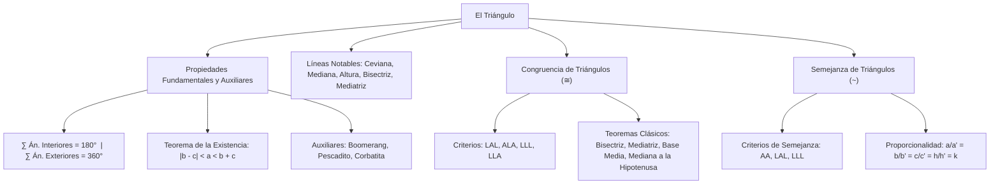

# GEOMETRÍA PREUNIVERSITARIA: CURSO COMPLETO Y SISTEMATIZADO
## EJE 02: MATEMÁTICA — GEOMETRÍA
### TEMA III: TRIÁNGULOS, LÍNEAS NOTABLES, CONGRUENCIA Y SEMEJANZA

---

## 1. FICHA TÉCNICA Y MATRIZ DE COMPETENCIAS

| Parámetro | Detalle Institucional |
| :--- | :--- |
| **Resolución Oficial** | Resolución de Consejo Universitario N° 0028-2026 (Admisión UNSA 2027) |
| **Eje Curricular** | Eje 02: Matemática / Geometría Plana Fundamental y Razonamiento Deductivo |
| **Peso Ponderado UNSA** | **Ingenierías:** 1.658337400 pts/preg (4 preg. = 6.63 pts) \| **Biomédicas:** 1.265447400 pts \| **Sociales:** 0.824574000 pts |
| **Frecuencia en Exámenes** | **Máxima / Imprescindible (99%):** Es el tema más evaluado de toda la geometría preuniversitaria. Casi todo problema geométrico complejo se reduce a congruencia o semejanza de triángulos. |
| **Modelos de Examen** | UNSA (Ordinario, CEPREUNSA), UNMSM (DECO de cálculo de sombras, puentes y armaduras reticulares), UNI (Construcciones auxiliares y criterios de semejanza). |
| **Competencia Cardinal** | Demostrar propiedades de figuras triangulares aplicando teoremas de ángulos interiores/exteriores y desigualdad triangular, trazar líneas notables, e identificar criterios de congruencia y razones de proporcionalidad en triángulos semejantes. |

---

## 2. MAPA TAXONÓMICO Y ONTOLOGÍA DE CONCEPTOS



---

## 3. DESARROLLO TEÓRICO FORMAL (ESTÁNDAR LUMBRERAS / CUZCANO / UNI)

### 3.1. Definición y Propiedades Fundamentales del Triángulo
El **triángulo** es la figura geométrica formada por la unión de tres segmentos de recta determinados por tres puntos no colineales:
$$\triangle ABC = \overline{AB} \cup \overline{BC} \cup \overline{CA}$$

#### Teoremas Angulares Fundamentales:
1. **Suma de Ángulos Interiores:**
   $$\alpha + \beta + \theta = 180^\circ$$
2. **Suma de Ángulos Exteriores (uno por vértice):**
   $$x + y + z = 360^\circ$$
3. **Medida del Ángulo Exterior:**
   Todo ángulo exterior es igual a la suma de las medidas de los dos ángulos interiores no adyacentes a él:
   $$x = \beta + \theta, \qquad y = \alpha + \theta, \qquad z = \alpha + \beta$$
4. **Teorema de la Existencia Triangular (Desigualdad Triangular):**
   En todo triángulo, la longitud de un lado es mayor que la diferencia de los otros dos y menor que su suma:
   $$\mathbf{|b - c| < a < b + c}$$
5. **Teorema de la Correspondencia:**
   A mayor ángulo interior se opone mayor lado, y viceversa:
   $$\alpha > \beta \iff a > b$$

#### Propiedades Auxiliares Frecuentes:
- **Teorema del Boomerang:** $x = \alpha + \beta + \theta$
- **Teorema del Pescadito:** $\alpha + \beta = x + y$
- **Teorema de la Mariposa (Corbatita):** $\alpha + \beta = \theta + \phi$

---

### 3.2. Clasificación de Triángulos

#### A. Por las Longitudes de sus Lados:
1. **Triángulo Escaleno:** Sus tres lados tienen longitudes diferentes ($a \neq b \neq c$).
2. **Triángulo Isósceles:** Posee dos lados congruentes ($a = b \neq c$). Los ángulos opuestos a dichos lados son congruentes (**ángulos de la base**).
3. **Triángulo Equilátero:** Sus tres lados son congruentes ($a = b = c$). Cada ángulo interior mide estrictamente **$60^\circ$**.

#### B. Por las Medidas de sus Ángulos (Triángulos Oblicuángulos y Rectángulos):
1. **Triángulo Acutángulo:** Sus tres ángulos interiores son agudos ($< 90^\circ$).
2. **Triángulo Rectángulo:** Posee un ángulo recto ($90^\circ$). Los lados que forman el ángulo recto son los **catetos** y el lado opuesto es la **hipotenusa**. Sus ángulos agudos son complementarios ($\alpha + \beta = 90^\circ$).
3. **Triángulo Obtusángulo:** Posee un ángulo interior obtuso ($> 90^\circ$).

---

### 3.3. Líneas Notables Asociadas al Triángulo
1. **Ceviana:** Segmento que une un vértice con cualquier punto del lado opuesto o de su prolongación.
2. **Mediana:** Ceviana que une un vértice con el **punto medio** del lado opuesto.
3. **Altura:** Ceviana perpendicular trazada desde un vértice a la recta que contiene al lado opuesto.
4. **Bisectriz (Interior y Exterior):** Rayo que biseca un ángulo del triángulo.
   - Ángulo formado por dos bisectrices interiores:
     $$x = 90^\circ + \frac{\theta}{2}$$
   - Ángulo formado por dos bisectrices exteriores:
     $$x = 90^\circ - \frac{\theta}{2}$$
   - Ángulo formado por una bisectriz interior y una exterior:
     $$x = \frac{\theta}{2}$$
5. **Mediatriz:** Recta coplanar perpendicular a un lado en su punto medio (no necesariamente pasa por el vértice opuesto).

---

### 3.4. Congruencia de Triángulos ($\cong$)
Dos triángulos son **congruentes** si sus tres lados correspondientes y sus tres ángulos correspondientes son respectivamente congruentes (tienen igual forma e igual tamaño):

$$\triangle ABC \cong \triangle DEF \iff \begin{cases} AB = DE, \ BC = EF, \ CA = FD \\ \angle A \cong \angle D, \ \angle B \cong \angle E, \ \angle C \cong \angle F \end{cases}$$

#### Criterios de Congruencia (Casos Fundamentales):
1. **Caso LAL (Lado - Ángulo - Lado):** Dos lados y el ángulo comprendido entre ellos respectivamente congruentes.
2. **Caso ALA (Ángulo - Lado - Ángulo):** Un lado y los dos ángulos adyacentes a él respectivamente congruentes.
3. **Caso LLL (Lado - Lado - Lado):** Los tres lados respectivamente congruentes.
4. **Caso LLA (Lado - Lado - Ángulo Mayor):** Dos lados y el ángulo opuesto al mayor de ellos respectivamente congruentes.

#### Teoremas Clásicos Derivados de la Congruencia:

#### 1. Teorema de la Bisectriz:
Todo punto de la bisectriz de un ángulo equidista de los lados de dicho ángulo:
$$P \in \text{Bisectriz} \implies PA = PB \quad \land \quad OA = OB$$

#### 2. Teorema de la Mediatriz:
Todo punto de la mediatriz de un segmento equidista de los extremos de dicho segmento:
$$P \in \text{Mediatriz}(\overline{AB}) \implies PA = PB \quad (\triangle APB \text{ es isósceles})$$

#### 3. Teorema de los Puntos Medios y la Base Media:
El segmento que une los puntos medios de dos lados de un triángulo es paralelo al tercer lado y su longitud es la mitad de dicho lado:
$$MN \parallel AC \quad \land \quad \mathbf{MN = \frac{AC}{2}}$$

#### 4. Teorema de la Mediana Relativa a la Hipotenusa:
En todo triángulo rectángulo, la longitud de la mediana relativa a la hipotenusa es igual a la mitad de la longitud de la hipotenusa:
$$\mathbf{BM = \frac{AC}{2} = AM = MC}$$
*(Determina dos triángulos isósceles interiores: $\triangle ABM$ y $\triangle CBM$).*

---

### 3.5. Semejanza de Triángulos ($\sim$)
Dos triángulos son **semejantes** si tienen sus tres ángulos correspondientes de igual medida y sus lados homólogos (los que se oponen a ángulos iguales) son proporcionales:

$$\triangle ABC \sim \triangle A'B'C' \iff \frac{a}{a'} = \frac{b}{b'} = \frac{c}{c'} = \frac{h}{h'} = \frac{2p}{2p'} = k$$
Donde $k$ es la **razón de semejanza**.

#### Criterios de Semejanza:
1. **Primer Criterio (Ángulo - Ángulo, AA):** Si dos triángulos tienen dos pares de ángulos interiores de igual medida, entonces son semejantes.
2. **Segundo Criterio (LAL):** Si tienen un ángulo congruente comprendido entre lados homólogos proporcionales.
3. **Tercer Criterio (LLL):** Si sus tres pares de lados homólogos son proporcionales.

---

## 4. FORMULARIO MAESTRO (LATEX ESTRICTO)

| Teorema / Propiedad | Formulación Matemática | Contexto Geométrico |
| :--- | :--- | :--- |
| **Existencia Triangular** | $\|b - c\| < a < b + c$ | En todo triángulo real |
| **Ángulo Exterior** | $x = \alpha + \beta$ | Ángulo exterior no adyacente |
| **Bisectrices Interiores** | $x = 90^\circ + \frac{\theta}{2}$ | Ángulo en el incentro |
| **Bisectrices Exteriores** | $x = 90^\circ - \frac{\theta}{2}$ | Ángulo en el excentro |
| **Interior y Exterior** | $x = \frac{\theta}{2}$ | Bisectriz interior y exterior cruzadas |
| **Base Media** | $MN = \frac{AC}{2} \quad \land \quad MN \parallel AC$ | $M, N$ puntos medios |
| **Mediana a la Hipotenusa** | $BM = \frac{AC}{2}$ | Exclusivo de triángulos rectángulos |
| **Semejanza Básica** | $\frac{a}{a'} = \frac{b}{b'} = \frac{h}{h'} = k$ | Triángulos con ángulos congruentes |
| **Teorema del Boomerang** | $x = \alpha + \beta + \theta$ | Cuadrilátero cóncavo |

---

## 5. MNEMOTECNIAS DE COMBATE PREUNIVERSITARIO

### 1. El Triángulo Rectángulo y su Mediana: "La Triple M"
> **"Mediana a la hipotenusa $\to$ Mide la Mitad."**
- Al trazar la mediana desde el ángulo recto: los tres segmentos resultantes son gemelos exactos:
  $$AM = MC = BM$$
- ¡Aparecen dos triángulos isósceles de inmediato!

### 2. Ángulos entre Bisectrices: "Interior Suma, Exterior Resta"
- Entre dos bisectrices **interiores**: vas hacia adentro $\to$ **$90^\circ + \frac{\theta}{2}$**.
- Entre dos bisectrices **exteriores**: vas hacia afuera $\to$ **$90^\circ - \frac{\theta}{2}$**.
- Una interior y una exterior: la mitad exacta: **$\frac{\theta}{2}$**.

---

## 6. TÉCNICAS Y ARTIFICIOS DE CÁLCULO (HACKING PREUNIVERSITARIO)

### Artificio 1: El Trazo Auxiliar de la Mediana en el Triángulo Rectángulo
Cuando veas un triángulo rectángulo con un ángulo notable de $15^\circ$ o $75^\circ$, o cuando conozcas el doble de un ángulo ($\alpha$ y $2\alpha$):
**¡No uses trigonometría engorrosa de ángulos compuestos!**
**Hack:** Traza la mediana relativa a la hipotenusa. Como $BM = MC$, el triángulo $\triangle BMC$ es isósceles con ángulo en la base $\alpha$.
Por ángulo exterior, el ángulo $\angle AMB$ mide exactamente **$2\alpha$**, transformando el problema en un triángulo isósceles o notable directo.

### Artificio 2: Identificación Relámpago de Semejanza por Ángulos Complementarios
En triángulos rectángulos donde se traza la altura relativa a la hipotenusa:
**Hack:** Nombra los ángulos agudos como $\alpha$ y $\beta$ (con $\alpha + \beta = 90^\circ$).
Al rotar por los vértices, los tres triángulos rectángulos formados (el total y los dos parciales) tienen exactamente los mismos ángulos $\alpha$ y $\beta$.
Aplica semejanza de inmediato: $\frac{\text{cateto opuesto a } \alpha}{\text{hipotenusa}}$.

---

## 7. ZONA DE TRAMPAS Y DISTRACTORES ("¡PELIGRO EXAMEN!")

> [!WARNING]
> **Trampa 1: Olvidar la Existencia Triangular al Calcular Valores Enteros**
> En un triángulo isósceles con lados $4\text{ cm}$ y $9\text{ cm}$, ¿cuánto mide el tercer lado?
> El postulante dice: *"Puede ser 4 o 9"*.
> **¡ERROR!** Si el tercer lado fuera $4$:
> Suma de lados menores: $4 + 4 = 8 < 9$. ¡El triángulo no se cierra, viola la existencia triangular!
> El tercer lado debe ser obligatoriamente $9\text{ cm}$ ($9 - 4 < 9 < 9 + 4$).

> [!CAUTION]
> **Trampa 2: Lados Homólogos Desalineados en Semejanza**
> En $\triangle ABC \sim \triangle PQR$, muchos alumnos dividen lado izquierdo entre lado izquierdo.
> **Regla de oro:** Los lados homólogos no se eligen por su posición visual, sino **por el ángulo al cual se oponen**. El lado que se opone a $\alpha$ en el primer triángulo se divide estrictamente entre el lado que se opone a $\alpha$ en el segundo triángulo.

---

## 8. APLICACIÓN AL MUNDO REAL Y CONTEXTO DECO

### Estructuras de Techumbre y Tijerales Reticulares en Arquitectura Arequipeña
En las naves industriales y hangares del Parque Industrial de Arequipa, las estructuras de soporte de techos utilizan cerchas metálicas triangulares (armaduras tipo Pratt o Howe). La rigidez mecánica indeformable del triángulo (propiedad que no poseen los cuadriláteros) garantiza que la estructura soporte cargas de nieve y sismos sin colapsar. Los ingenieros estructurales de la UNSA aplican el criterio de congruencia LLL y el teorema de la base media para calcular la longitud exacta de las barras de arriostramiento diagonal y minimizar el peso total de acero empleado.

---

## 9. BANCO DE 5 EJERCICIOS RESUELTOS GRADUADOS

### Ejercicio 1: Nivel Básico (Existencia Triangular y Perímetro Entero)
**Enunciado:**
En un triángulo escaleno, las longitudes de dos de sus lados son $5\text{ cm}$ y $8\text{ cm}$. Determine la cantidad de valores enteros que puede tomar la longitud del tercer lado.

**Solución paso a paso:**
1. Sea $x$ la longitud del tercer lado en centímetros.
2. Por el **Teorema de la Existencia Triangular** (desigualdad triangular):
   $$|8 - 5| < x < 8 + 5$$
   $$3 < x < 13$$
3. Como el problema especifica que el triángulo es **escaleno**, sus tres lados deben tener longitudes distintas:
   $$x \neq 5 \quad \land \quad x \neq 8$$
4. Listamos todos los valores enteros contenidos en el intervalo abierto $\langle 3, 13\rangle$:
   $$\{4, \ 5, \ 6, \ 7, \ 8, \ 9, \ 10, \ 11, \ 12\}$$
5. Descartamos los valores que romperían la condición de escaleno ($5$ y $8$):
   $$\text{Valores válidos} = \{4, \ 6, \ 7, \ 9, \ 10, \ 11, \ 12\}$$
6. Contamos los elementos:
   $$\text{Cantidad} = 7 \text{ valores enteros}$$

**Respuesta Final:** El tercer lado puede tomar **$7$** valores enteros.

---

### Ejercicio 2: Nivel Intermedio (Ángulos con Bisectrices)
**Enunciado:**
En un triángulo $ABC$, el ángulo formado por las bisectrices interiores de los ángulos $A$ y $C$ mide $130^\circ$. Calcule la medida del ángulo interior $B$.

**Solución paso a paso:**
1. Sea $I$ el incentro del triángulo $ABC$ (punto de corte de las bisectrices interiores).
2. Aplicamos la fórmula del ángulo formado por dos bisectrices interiores:
   $$\angle AIC = 90^\circ + \frac{\angle B}{2}$$
3. Sustituimos el dato dado $\angle AIC = 130^\circ$:
   $$130^\circ = 90^\circ + \frac{\angle B}{2}$$
4. Despejamos el ángulo $B$:
   $$130^\circ - 90^\circ = \frac{\angle B}{2}$$
   $$40^\circ = \frac{\angle B}{2} \implies \angle B = 2 \cdot 40^\circ = 80^\circ$$

**Respuesta Final:** La medida del ángulo $B$ es $\mathbf{80^\circ}$.

---

### Ejercicio 3: Nivel Avanzado - UNSA Ordinario (Teorema de la Mediana a la Hipotenusa)
**Enunciado:**
En un triángulo rectángulo $ABC$, recto en $B$, se traza la altura $\overline{BH}$ y la mediana $\overline{BM}$ relativa a la hipotenusa. Si el ángulo interior $C$ mide $25^\circ$, calcule la medida del ángulo $\angle HBM$ formado entre la altura y la mediana.

**Solución paso a paso:**
1. En el triángulo rectángulo $ABC$ ($\angle B = 90^\circ$):
   - Como $\angle C = 25^\circ$, su ángulo agudo complementario es:
     $$\angle A = 90^\circ - 25^\circ = 65^\circ$$
2. Analizamos el triángulo rectángulo $\triangle AHB$ (recto en $H$):
   - $\angle ABH = 90^\circ - \angle A = 90^\circ - 65^\circ = 25^\circ$.
3. Analizamos la mediana $\overline{BM}$ relativa a la hipotenusa:
   - Por el **Teorema de la Mediana a la Hipotenusa**:
     $$BM = MC = AM$$
   - Por tanto, el triángulo $\triangle CBM$ es isósceles con $BM = MC$:
     $$\angle MBC = \angle C = 25^\circ$$
4. Calculamos el ángulo $\angle HBM$:
   - Como el ángulo total en el vértice $B$ es recto ($90^\circ$):
     $$\angle ABH + \angle HBM + \angle MBC = 90^\circ$$
   - Sustituimos los valores calculados:
     $$25^\circ + \angle HBM + 25^\circ = 90^\circ$$
     $$50^\circ + \angle HBM = 90^\circ \implies \angle HBM = 40^\circ$$

**Respuesta Final:** El ángulo formado entre la altura y la mediana mide $\mathbf{40^\circ}$.

---

### Ejercicio 4: Nivel San Marcos DECO (Semejanza y Medición de Alturas)
**Enunciado:**
Para estimar la altura de una torre de transmisión eléctrica en Characato, un topógrafo clava verticalmente un poste de $2\text{ m}$ de altura en un terreno llano, proyectando una sombra de $1.5\text{ m}$. Si en ese mismo instante la sombra proyectada por la torre mide $45\text{ m}$, determine la altura total de la torre.

**Solución paso a paso:**
1. Los rayos solares inciden con el mismo ángulo de elevación $\theta$ sobre ambos objetos verticales.
2. Tanto el poste con su sombra como la torre con la suya forman triángulos rectángulos:
   - Triángulo menor: cateto vertical $h_1 = 2\text{ m}$, cateto horizontal $s_1 = 1.5\text{ m}$.
   - Triángulo mayor: cateto vertical $H$ (altura de la torre), cateto horizontal $s_2 = 45\text{ m}$.
3. Como ambos triángulos tienen un ángulo recto y el mismo ángulo solar $\theta$, son semejantes por el criterio **Ángulo - Ángulo (AA)**:
   $$\triangle \text{Poste} \sim \triangle \text{Torre}$$
4. Establecemos la proporción entre lados homólogos:
   $$\frac{H}{h_1} = \frac{s_2}{s_1}$$
   $$\frac{H}{2} = \frac{45}{1.5}$$
5. Operamos algebraicamente:
   $$\frac{45}{1.5} = \frac{450}{15} = 30$$
   $$H = 2 \cdot 30 = 60\text{ metros}$$

**Respuesta Final:** La altura de la torre es de $\mathbf{60\text{ metros}}$.

---

### Ejercicio 5: Nivel Boss Challenge - Estilo UNI (Congruencia y Trazo de Bisectriz)
**Enunciado:**
En un triángulo $ABC$, se traza la ceviana interior $\overline{BD}$ tal que $AB = CD$. Si la medida del ángulo $\angle ABD = 30^\circ$, $\angle DBC = 70^\circ$ y $\angle BCA = 40^\circ$, determine la medida del ángulo $\angle BAC$.

**Solución paso a paso:**
1. Calculamos los ángulos del triángulo general $\triangle ABC$:
   - En el vértice $B$: $\angle ABC = 30^\circ + 70^\circ = 100^\circ$.
   - En el vértice $C$: $\angle C = 40^\circ$.
   - Calculamos el tercer ángulo $\angle A$:
     $$\angle A = 180^\circ - (100^\circ + 40^\circ) = 180^\circ - 140^\circ = 40^\circ$$
2. Observamos que el triángulo $\triangle ABC$ es **isósceles**:
   - Como $\angle A = \angle C = 40^\circ$, se cumple que:
     $$AB = BC$$
3. Por dato del problema, se tenía que $AB = CD$.
   - Al relacionar ambas igualdades:
     $$BC = CD$$
4. Por tanto, el triángulo interior $\triangle BCD$ también es un **triángulo isósceles** con lados congruentes $BC = CD$:
   - Los ángulos opuestos a dichos lados deben ser congruentes:
     $$\angle BDC = \angle DBC = 70^\circ$$
5. Verificamos la suma de ángulos en $\triangle BCD$:
   $$70^\circ + 70^\circ + \angle BCD = 180^\circ \implies 140^\circ + 40^\circ = 180^\circ \quad \checkmark$$
   Todo concuerda a la perfección.
6. El ángulo solicitado en el enunciado es $\angle BAC$:
   $$\angle BAC = \angle A = 40^\circ$$

**Respuesta Final:** La medida del ángulo $\angle BAC$ es $\mathbf{40^\circ}$.

---

## 10. GLOSARIO DE 10 TÉRMINOS CLAVE

1. **Triángulo:** Polígono de tres lados determinado por tres puntos no colineales.
2. **Desigualdad Triangular:** Condición necesaria de existencia que exige que la longitud de un lado esté acotada por la suma y la diferencia de los otros dos.
3. **Ceviana:** Segmento que une un vértice de un triángulo con un punto cualquiera del lado opuesto.
4. **Base Media:** Segmento paralelo que une los puntos medios de dos lados y mide la mitad de la base.
5. **Mediana a la Hipotenusa:** Segmento notable que mide exactamente la mitad de la hipotenusa en un triángulo rectángulo.
6. **Congruencia ($\cong$):** Relación geométrica de igualdad exacta en dimensiones y forma entre dos triángulos.
7. **Semejanza ($\sim$):** Relación de proporcionalidad entre lados homólogos con ángulos respectivamente iguales.
8. **Incentro:** Punto de concurrencia de las tres bisectrices interiores de un triángulo (centro de la circunferencia inscrita).
9. **Lados Homólogos:** Lados que se oponen a ángulos de igual medida en triángulos semejantes.
10. **Razón de Semejanza ($k$):** Cociente constante entre las longitudes de cualquier par de segmentos homólogos de dos figuras semejantes.

---

## 11. BANCO DE FLASHCARDS (ANVERSO / REVERSO)

- **Flashcard 1:**
  - *Anverso:* ¿Cuál es la suma de los ángulos exteriores de cualquier triángulo (uno por vértice)?
  - *Reverso:* Siempre es igual a $360^\circ$.
- **Flashcard 2:**
  - *Anverso:* ¿A qué equivale la longitud de la mediana trazada hacia la hipotenusa en un triángulo rectángulo?
  - *Reverso:* Mide exactamente la mitad de la hipotenusa: $BM = \frac{AC}{2}$.
- **Flashcard 3:**
  - *Anverso:* ¿Qué fórmula calcula el ángulo formado por dos bisectrices interiores de un triángulo con tercer ángulo $\theta$?
  - *Reverso:* $x = 90^\circ + \frac{\theta}{2}$.
- **Flashcard 4:**
  - *Anverso:* ¿Cuáles son las dos propiedades de la base media $MN$ de un triángulo respecto al lado $AC$?
  - *Reverso:* Es paralela a la base ($MN \parallel AC$) y mide la mitad de su longitud ($MN = \frac{AC}{2}$).
- **Flashcard 5:**
  - *Anverso:* ¿Qué establece el Teorema de la Mediatriz?
  - *Reverso:* Todo punto de la mediatriz de un segmento equidista de los extremos de dicho segmento ($PA = PB$).

---

## 12. MOTOR DE GAMIFICACIÓN (JSON PARA KOTLIN MULTIPLATFORM)

```json
{
  "topicId": "geom_03_triangulos_congruencia_semejanza",
  "title": "Triángulos, Líneas Notables, Congruencia y Semejanza",
  "subject": "geometria",
  "xpReward": 430,
  "level": "ADVANCED",
  "badges": [
    {
      "id": "triangle_architect",
      "name": "Estratega de Triángulos",
      "description": "Dominaste la base media, la mediana a la hipotenusa y las razones de semejanza sin titubeos."
    }
  ],
  "questions": [
    {
      "id": "q1",
      "statement": "En un triángulo rectángulo, la hipotenusa mide 28 cm. ¿Cuánto mide la mediana relativa a dicha hipotenusa?",
      "options": ["14 cm", "28 cm", "7 cm", "14*sqrt(2) cm"],
      "correctIndex": 0,
      "explanation": "Por el teorema de la mediana a la hipotenusa: BM = AC / 2 = 28 / 2 = 14 cm."
    },
    {
      "id": "q2",
      "statement": "Si dos triángulos son semejantes con razón k = 3, y el perímetro del menor es 12 cm, ¿cuál es el perímetro del mayor?",
      "options": ["36 cm", "24 cm", "108 cm", "4 cm"],
      "correctIndex": 0,
      "explanation": "La razón de los perímetros es igual a la razón de semejanza lineal: 2p' = k * 2p = 3 * 12 = 36 cm."
    }
  ]
}
```
