# GEOMETRÍA PREUNIVERSITARIA: CURSO COMPLETO Y SISTEMATIZADO
## EJE 02: MATEMÁTICA — GEOMETRÍA
### TEMA IV: TEOREMAS FUNDAMENTALES (TALES, PITÁGORAS, RELACIONES MÉTRICAS EN TRIÁNGULOS Y CIRCUNFERENCIA)

---

## 1. FICHA TÉCNICA Y MATRIZ DE COMPETENCIAS

| Parámetro | Detalle Institucional |
| :--- | :--- |
| **Resolución Oficial** | Resolución de Consejo Universitario N° 0028-2026 (Admisión UNSA 2027) |
| **Eje Curricular** | Eje 02: Matemática / Proporcionalidad Geométrica y Métricas Euclidianas |
| **Peso Ponderado UNSA** | **Ingenierías:** 1.658337400 pts/preg (4 preg. = 6.63 pts) \| **Biomédicas:** 1.265447400 pts \| **Sociales:** 0.824574000 pts |
| **Frecuencia en Exámenes** | **Máxima / Crítica (98%):** Es el núcleo de cálculo numérico de la geometría plana. Aparece en todo examen para calcular longitudes de alturas, cuerdas y catetos. |
| **Modelos de Examen** | UNSA (Ordinario, CEPREUNSA), UNMSM (DECO de cálculo de distancias inaccesibles e ingeniería vial), UNI (Teoremas de Stewart, Apolonio y relaciones métricas en la circunferencia). |
| **Competencia Cardinal** | Aplicar con exactitud analítica el Teorema de Tales, los teoremas de la bisectriz y el incentro, las relaciones métricas en el triángulo rectángulo y oblicuángulo (Apolonio, Herón), y los teoremas de cuerdas, secantes y tangentes en la circunferencia. |

---

## 2. MAPA TAXONÓMICO Y ONTOLOGÍA DE CONCEPTOS

```mermaid
graph TD
    TF["Teoremas Fundamentales y Métricas"] --> PROP["Proporcionalidad Geométrica"]
    TF --> RMR["Relaciones Métricas en Triángulo Rectángulo"]
    TF --> RMO["Relaciones Métricas en Triángulos Oblicuángulos"]
    TF --> RMC["Relaciones Métricas en la Circunferencia"]
    
    PROP --> TALES["Teorema de Tales: a/b = c/d"]
    PROP --> BIS["Teoremas de la Bisectriz (Interior y Exterior)"]
    PROP --> CEVAMEN["Teoremas de Ceva y Menelao"]
    
    RMR --> PIT["Pitágoras: a² + b² = c²"]
    RMR --> CATALT["Cateto: a² = c·m  |  Altura: h² = m·n  |  a·b = c·h"]
    RMR --> INVCAT["Inversas: 1/h² = 1/a² + 1/b²"]
    
    RMO --> EUC["Teoremas de Euclides I y II (Ley de Cosenos Geométrica)"]
    RMO --> APOL["Teorema de la Mediana (Apolonio): b² + c² = 2mₐ² + a²/2"]
    RMO --> HERON["Fórmula de Herón para la Altura"]
    RMO --> STEW["Teorema de Stewart (Ceviana cualquiera)"]
    
    RMC --> CUER["Teorema de las Cuerdas: a · b = c · d"]
    RMC --> SECAN["Teorema de las Secantes: PA · PB = PC · PD"]
    RMC --> TANG["Teorema de la Tangente: PT² = PA · PB"]
```



---

## 3. DESARROLLO TEÓRICO FORMAL (ESTÁNDAR LUMBRERAS / CUZCANO / UNI)

### 3.1. Proporcionalidad Geométrica

#### 1. Teorema de Tales de Mileto:
Tres o más rectas paralelas determinan sobre dos o más rectas secantes transversales segmentos correspondientes proporcionales:
$$\text{Si } \overleftrightarrow{L_1} \parallel \overleftrightarrow{L_2} \parallel \overleftrightarrow{L_3} \implies \mathbf{\frac{AB}{BC} = \frac{DE}{EF}}$$

#### 2. Teorema de la Bisectriz Interior:
En todo triángulo, la bisectriz interior divide al lado opuesto en dos segmentos cuyas longitudes son proporcionales a las longitudes de los lados adyacentes:
$$\mathbf{\frac{c}{a} = \frac{m}{n} \iff \frac{AB}{BC} = \frac{AD}{DC}}$$
- **Longitud de la bisectriz interior ($x$):**
  $$\mathbf{x^2 = c \cdot a - m \cdot n}$$

#### 3. Teorema de la Bisectriz Exterior:
En un triángulo escaleno $ABC$, la bisectriz exterior divide a la prolongación del lado opuesto en segmentos proporcionales:
$$\mathbf{\frac{c}{a} = \frac{m'}{n'}}$$
- **Longitud de la bisectriz exterior ($y$):**
  $$\mathbf{y^2 = m' \cdot n' - c \cdot a}$$

#### 4. Teorema del Incentro:
Si $I$ es el incentro del triángulo $ABC$ y $\overline{BD}$ es la bisectriz interior:
$$\mathbf{\frac{BI}{ID} = \frac{AB + BC}{AC} = \frac{c + a}{b}}$$

#### 5. Teorema de Menelao:
Toda recta secante que corta a dos lados de un triángulo y a la prolongación del tercero determina seis segmentos que cumplen:
$$(a_1)(a_2)(a_3) = (b_1)(b_2)(b_3)$$
*(El producto de tres segmentos no consecutivos es igual al producto de los otros tres).*

#### 6. Teorema de Giovanni Ceva:
Tres cevianas interiores concurrentes en un punto interior determinan sobre los lados segmentos que cumplen:
$$(x)(y)(z) = (m)(n)(p)$$

---

### 3.2. Relaciones Métricas en el Triángulo Rectángulo
Sea el triángulo rectángulo $ABC$ recto en $B$. Trazamos la altura $\overline{BH}$ ($h$) relativa a la hipotenusa $AC$ ($c$), determinando las proyecciones ortogonales $AH = m$ y $HC = n$:

1. **Teorema de Pitágoras:**
   $$\mathbf{a^2 + b^2 = c^2}$$
2. **Teorema del Cateto:**
   El cuadrado de la longitud de un cateto es igual al producto de la hipotenusa por su proyección ortogonal sobre ella:
   $$\mathbf{c_1^2 = c \cdot m \qquad \land \qquad c_2^2 = c \cdot n}$$
3. **Teorema de la Altura Relativa a la Hipotenusa:**
   El cuadrado de la altura relativa a la hipotenusa es igual al producto de las proyecciones de los catetos:
   $$\mathbf{h^2 = m \cdot n}$$
4. **Teorema del Producto de Lados y Altura:**
   El producto de las longitudes de los catetos es igual al producto de la hipotenusa por la altura:
   $$\mathbf{c_1 \cdot c_2 = c \cdot h}$$
5. **Teorema de la Inversa de los Cuadrados de los Catetos:**
   $$\mathbf{\frac{1}{h^2} = \frac{1}{c_1^2} + \frac{1}{c_2^2}}$$

---

### 3.3. Relaciones Métricas en Triángulos Oblicuángulos

#### 1. Teorema de Euclides (Ley de Cosenos Geométrica):
- **Para ángulo agudo ($A < 90^\circ$):**
  $$a^2 = b^2 + c^2 - 2b \cdot m$$
  *(donde $m$ es la proyección de $c$ sobre $b$)*.
- **Para ángulo obtuso ($A > 90^\circ$):**
  $$a^2 = b^2 + c^2 + 2b \cdot m$$

#### 2. Teorema de la Mediana (Teorema de Apolonio):
En todo triángulo, la suma de los cuadrados de dos lados es igual al doble del cuadrado de la mediana relativa al tercer lado, más la mitad del cuadrado de dicho tercer lado:
$$\mathbf{b^2 + c^2 = 2m_a^2 + \frac{a^2}{2}}$$

#### 3. Fórmula de Herón de Alejandría para la Altura:
Sea el semiperímetro $p = \frac{a + b + c}{2}$:
$$\mathbf{h_a = \frac{2}{a} \sqrt{p(p - a)(p - b)(p - c)}}$$

#### 4. Teorema de Matthew Stewart (Ceviana Cualquiera):
Si $\overline{BD}$ ($x$) es una ceviana interior que divide al lado $b$ en segmentos $m$ y $n$:
$$\mathbf{c^2 \cdot n + a^2 \cdot m = x^2 \cdot b + b \cdot m \cdot n}$$

---

### 3.4. Relaciones Métricas en la Circunferencia

1. **Teorema de las Cuerdas:**
   Si dos cuerdas se cortan en un punto interior $P$:
   $$\mathbf{PA \cdot PB = PC \cdot PD}$$
2. **Teorema de las Secantes:**
   Si desde un punto exterior $P$ se trazan dos rectas secantes:
   $$\mathbf{PA \cdot PB = PC \cdot PD}$$
   *(Longitud secante total por su parte externa es constante).*
3. **Teorema de la Tangente y la Secante:**
   Si desde un punto exterior $P$ se trazan una tangente $\overline{PT}$ y una secante $\overline{PAB}$:
   $$\mathbf{PT^2 = PA \cdot PB}$$

---

## 4. FORMULARIO MAESTRO (LATEX ESTRICTO)

| Teorema | Fórmula Matemática | Aplicación Principal |
| :--- | :--- | :--- |
| **Tales** | $\frac{a}{b} = \frac{c}{d}$ | Rectas paralelas y secantes |
| **Bisectriz Interior** | $\frac{c}{a} = \frac{m}{n} \quad \land \quad x^2 = ca - mn$ | División proporcional interior |
| **Bisectriz Exterior** | $y^2 = m'n' - ca$ | Longitud de bisectriz externa |
| **Pitágoras** | $a^2 + b^2 = c^2$ | Triángulos rectángulos |
| **Cateto** | $a^2 = c \cdot m$ | Proyecciones en triángulo rectángulo |
| **Altura al Cuadrado** | $h^2 = m \cdot n$ | Media geométrica de proyecciones |
| **Inversa Cuadrados** | $\frac{1}{h^2} = \frac{1}{a^2} + \frac{1}{b^2}$ | Relación recíproca métrica |
| **Apolonio (Mediana)** | $b^2 + c^2 = 2m_a^2 + \frac{a^2}{2}$ | Cálculo de medianas |
| **Cuerdas** | $PA \cdot PB = PC \cdot PD$ | Cuerdas secantes interiores |
| **Tangente** | $PT^2 = PA \cdot PB$ | Potencia de un punto exterior |

---

## 5. MNEMOTECNIAS DE COMBATE PREUNIVERSITARIO

### 1. Las Cinco del Triángulo Rectángulo: "Cateto, Altura, Producto, Inversa y Don Pitágoras"
- **Cateto al cuadrado:** Todo el piso (hipotenusa) por su pedacito de sombra ($m$).
- **Altura al cuadrado:** Sombra izquierda por sombra derecha ($m \cdot n$).
- **Producto:** Cateto por cateto es igual a hipotenusa por altura ($ab = ch$).
- **Inversa:** La suma de las inversas cuadráticas de los catetos da la inversa cuadrática de la altura.

### 2. Relaciones Métricas en Circunferencia: "Todo por afuera"
En el Teorema de las Secantes:
> **"Toda la secante por su pedazo exterior."**
- $\text{Total}_1 \times \text{Afuera}_1 = \text{Total}_2 \times \text{Afuera}_2$.
- Si la secante se convierte en tangente, ¡el "afuera" es toda la línea! Por eso queda: $\text{Tangente}^2 = \text{Total} \times \text{Afuera}$.

---

## 6. TÉCNICAS Y ARTIFICIOS DE CÁLCULO (HACKING PREUNIVERSITARIO)

### Artificio 1: Identificación Inmediata de Triángulos Notables de Lados Enteros
Aprende de memoria los triángulos pitagóricos primitivos para evitar calcular raíces:
- **$(3, 4, 5)$** y sus múltiplos $(6, 8, 10), (9, 12, 15), (15, 20, 25)$.
- **$(5, 12, 13)$** y sus múltiplos $(10, 24, 26)$.
- **$(7, 24, 25)$**
- **$(8, 15, 17)$**
- **$(9, 40, 41)$**
- **$(20, 21, 29)$**
Si ves cateto 5 e hipotenusa 13, ¡el otro cateto es 12 sin aplicar la fórmula!

### Artificio 2: Teorema de la Tangente en Cuadriláteros con Circunferencia Oculta
Cuando veas una recta tangente a una circunferencia y una secante que pasa por el centro:
**Hack:** Prolonga la secante hasta que corte el extremo opuesto de la circunferencia para tener el diámetro completo.
Así aplicas $PT^2 = (d - R)(d + R) = d^2 - R^2$, que es la definición analítica de la **Potencia del Punto**.

---

## 7. ZONA DE TRAMPAS Y DISTRACTORES ("¡PELIGRO EXAMEN!")

> [!WARNING]
> **Trampa 1: El Teorema de las Secantes NO Multiplica la Parte Interna**
> Si una secante tiene parte externa $4$ y cuerda interna $6$:
> El error típico: multiplicar $4 \times 6 = 24$. **¡ERROR GARRAFAL!**
> La fórmula exige multiplicar la **secante total**:
> $$\text{Secante Total} = 4 + 6 = 10 \implies 10 \times 4 = 40$$

> [!CAUTION]
> **Trampa 2: Confundir Mediana con Altura en Apolonio**
> El Teorema de Apolonio $b^2 + c^2 = 2m_a^2 + \frac{a^2}{2}$ calcula exclusivamente la **MEDIANA**.
> Si el problema te pide la altura, debes usar Herón o relaciones métricas rectangulares, no Apolonio.

---

## 8. APLICACIÓN AL MUNDO REAL Y CONTEXTO DECO

### Cálculo de Distancias Inaccesibles y Triangulación Geodésica en el Cañón del Colca
En la medición geodésica de las profundidades del Cañón del Colca (Arequipa), los topógrafos del Instituto Geográfico Nacional (IGN) determinan el ancho del río Colca y la altura de farallones rocosos inaccesibles mediante estaciones totales láser aplicando el Teorema de Tales y el Teorema de la Bisectriz. La relación métrica de proporcionalidad permite calcular distancias kilométricas con precisión centimétrica sin necesidad de cruzar quebradas agrestes o arriesgar vidas en desfiladeros verticales de sillar y basalto.

---

## 9. BANCO DE 5 EJERCICIOS RESUELTOS GRADUADOS

### Ejercicio 1: Nivel Básico (Teorema de la Altura en Triángulo Rectángulo)
**Enunciado:**
En un triángulo rectángulo, la altura relativa a la hipotenusa determina sobre ella dos segmentos cuyas longitudes son $4\text{ cm}$ y $9\text{ cm}$. Calcule la longitud de dicha altura y la longitud del menor cateto.

**Solución paso a paso:**
1. Identificamos los datos dados:
   - Proyecciones sobre la hipotenusa: $m = 4\text{ cm}$ y $n = 9\text{ cm}$.
   - Longitud de la hipotenusa total: $c = m + n = 4 + 9 = 13\text{ cm}$.
2. Aplicamos el **Teorema de la Altura**:
   $$h^2 = m \cdot n$$
   $$h^2 = 4 \cdot 9 = 36 \implies h = \sqrt{36} = 6\text{ cm}$$
3. Aplicamos el **Teorema del Cateto** para hallar el cateto menor (asociado a la menor proyección $m = 4$):
   $$c_1^2 = c \cdot m$$
   $$c_1^2 = 13 \cdot 4 = 52 \implies c_1 = \sqrt{52} = 2\sqrt{13}\text{ cm}$$

**Respuesta Final:** La altura mide $\mathbf{6\text{ cm}}$ y el cateto menor mide $\mathbf{2\sqrt{13}\text{ cm}}$.

---

### Ejercicio 2: Nivel Intermedio (Teorema de la Bisectriz Interior y Longitud)
**Enunciado:**
En un triángulo $ABC$, los lados miden $AB = 6\text{ cm}$, $BC = 8\text{ cm}$ y $AC = 7\text{ cm}$. Se traza la bisectriz interior $\overline{BD}$. Calcule la longitud de los segmentos determinados sobre $\overline{AC}$ y la longitud exacta de la bisectriz $\overline{BD}$.

**Solución paso a paso:**
1. Sea $AD = m$ y $DC = n$, con $m + n = AC = 7\text{ cm}$.
2. Por el **Teorema de la Bisectriz Interior**:
   $$\frac{AB}{BC} = \frac{AD}{DC} \implies \frac{6}{8} = \frac{m}{n} \implies \frac{3}{4} = \frac{m}{n}$$
3. Expresamos en función de una constante $k$:
   $$m = 3k, \quad n = 4k$$
   $$m + n = 3k + 4k = 7k = 7 \implies k = 1$$
   Por tanto: $m = 3\text{ cm}$ y $n = 4\text{ cm}$.
4. Calculamos la longitud de la bisectriz interior $x = BD$:
   $$x^2 = AB \cdot BC - AD \cdot DC$$
   $$x^2 = (6)(8) - (3)(4)$$
   $$x^2 = 48 - 12 = 36 \implies x = \sqrt{36} = 6\text{ cm}$$

**Respuesta Final:** Los segmentos sobre $\overline{AC}$ miden $\mathbf{3\text{ cm}}$ y $\mathbf{4\text{ cm}}$, y la bisectriz mide $\mathbf{6\text{ cm}}$.

---

### Ejercicio 3: Nivel Avanzado - UNSA Ordinario (Teorema de la Tangente en Circunferencia)
**Enunciado:**
Desde un punto exterior $P$ a una circunferencia se traza la tangente $\overline{PT}$ y la secante $\overline{PAB}$ que pasa por el centro de la circunferencia. Si la parte externa de la secante mide $PA = 4\text{ cm}$ y el radio de la circunferencia mide $R = 6\text{ cm}$, calcule la longitud de la tangente $\overline{PT}$.

**Solución paso a paso:**
1. Como la secante pasa por el centro de la circunferencia, contiene a un diámetro completo:
   $$\text{Diámetro} = 2R = 2(6) = 12\text{ cm}$$
2. Calculamos la longitud total de la secante $PB$:
   $$PB = PA + \text{Diámetro} = 4 + 12 = 16\text{ cm}$$
3. Aplicamos el **Teorema de la Tangente y la Secante**:
   $$PT^2 = PA \cdot PB$$
4. Sustituimos los valores calculados:
   $$PT^2 = (4)(16) = 64$$
   $$PT = \sqrt{64} = 8\text{ cm}$$

**Respuesta Final:** La longitud de la tangente $\overline{PT}$ es $\mathbf{8\text{ cm}}$.

---

### Ejercicio 4: Nivel San Marcos DECO (Teorema de Pitágoras y Cables Tensores)
**Enunciado:**
Un poste vertical de telefonía de $12\text{ metros}$ de altura instalado en el distrito de Paucarpata se asegura con dos cables tensores anclados en línea recta a ambos lados del poste en los puntos $A$ y $B$. Si el cable anclado en $A$ mide $15\text{ m}$ y el cable anclado en $B$ mide $13\text{ m}$, determine la distancia total de separación horizontal entre los dos puntos de anclaje $A$ y $B$.

**Solución paso a paso:**
1. El poste forma dos triángulos rectángulos con el suelo horizontal, compartiendo el cateto vertical común $h = 12\text{ m}$.
2. **Triángulo Rectángulo 1 (lado $A$):**
   - Hipotenusa: $c_1 = 15\text{ m}$
   - Cateto vertical: $h = 12\text{ m}$
   - Aplicamos Pitágoras para hallar la distancia horizontal $d_1$:
     $$d_1^2 + 12^2 = 15^2$$
     $$d_1^2 + 144 = 225 \implies d_1^2 = 225 - 144 = 81 \implies d_1 = 9\text{ m}$$
3. **Triángulo Rectángulo 2 (lado $B$):**
   - Hipotenusa: $c_2 = 13\text{ m}$
   - Cateto vertical: $h = 12\text{ m}$
   - Aplicamos Pitágoras para hallar la distancia horizontal $d_2$:
     $$d_2^2 + 12^2 = 13^2$$
     $$d_2^2 + 144 = 169 \implies d_2^2 = 169 - 144 = 25 \implies d_2 = 5\text{ m}$$
4. Como los anclajes están a lados opuestos del poste en línea recta, la separación total es:
   $$D = d_1 + d_2 = 9 + 5 = 14\text{ metros}$$

**Respuesta Final:** La distancia de separación entre los anclajes es $\mathbf{14\text{ metros}}$.

---

### Ejercicio 5: Nivel Boss Challenge - Estilo UNI (Teorema de la Mediana de Apolonio)
**Enunciado:**
En un triángulo $ABC$, los lados miden $AB = 7\text{ cm}$, $BC = 9\text{ cm}$ y la mediana relativa al lado $\overline{AC}$ mide $m_b = 6\text{ cm}$. Determine la longitud exacta del lado $\overline{AC}$.

**Solución paso a paso:**
1. Sea $b = AC$ la longitud del lado buscado.
2. Aplicamos el **Teorema de la Mediana de Apolonio** relativo al lado $b$:
   $$AB^2 + BC^2 = 2m_b^2 + \frac{b^2}{2}$$
3. Sustituimos los valores numéricos dados:
   $$7^2 + 9^2 = 2(6^2) + \frac{b^2}{2}$$
   $$49 + 81 = 2(36) + \frac{b^2}{2}$$
   $$130 = 72 + \frac{b^2}{2}$$
4. Despejamos el término con $b^2$:
   $$130 - 72 = \frac{b^2}{2}$$
   $$58 = \frac{b^2}{2} \implies b^2 = 58 \cdot 2 = 116$$
5. Extraemos raíz cuadrada y simplificamos el radical:
   $$b = \sqrt{116} = \sqrt{4 \cdot 29} = 2\sqrt{29}\text{ cm}$$

**Respuesta Final:** La longitud del lado $\overline{AC}$ es $\mathbf{2\sqrt{29}\text{ cm}}$.

---

## 10. GLOSARIO DE 10 TÉRMINOS CLAVE

1. **Teorema de Tales:** Principio que afirma que rectas paralelas determinan segmentos proporcionales sobre rectas secantes.
2. **Teorema de Pitágoras:** Teorema fundamental que establece que la suma de cuadrados de catetos es igual al cuadrado de la hipotenusa.
3. **Proyección Ortogonal:** Sombra perpendicular proyectada por un segmento sobre una recta directriz.
4. **Teorema del Cateto:** Relación que iguala el cuadrado del cateto al producto de la hipotenusa por su proyección.
5. **Teorema de la Altura:** Propiedad que establece que la altura relativa a la hipotenusa al cuadrado es el producto de las proyecciones de los catetos.
6. **Teorema de la Mediana (Apolonio):** Ecuación métrica que vincula la suma de cuadrados de dos lados con la mediana y el tercer lado.
7. **Teorema de Herón:** Fórmula que permite calcular el área o la altura de un triángulo conociendo únicamente sus tres lados y el semiperímetro.
8. **Teorema de las Cuerdas:** Teorema de potencia que iguala los productos de las secciones de dos cuerdas secantes interiores.
9. **Teorema de la Tangente:** Relación métrica donde el cuadrado de la tangente exterior es igual al producto de la secante total por su parte externa.
10. **Incentro:** Punto interior donde concurren las bisectrices interiores de un triángulo.

---

## 11. BANCO DE FLASHCARDS (ANVERSO / REVERSO)

- **Flashcard 1:**
  - *Anverso:* En un triángulo rectángulo, ¿a qué equivale el cuadrado de la altura relativa a la hipotenusa?
  - *Reverso:* Al producto de las proyecciones de los catetos sobre la hipotenusa: $h^2 = m \cdot n$.
- **Flashcard 2:**
  - *Anverso:* ¿Cómo se calcula la longitud de la bisectriz interior $x$ a partir de los lados $a, c$ y los segmentos $m, n$?
  - *Reverso:* $x^2 = c \cdot a - m \cdot n$.
- **Flashcard 3:**
  - *Anverso:* ¿Cuál es la fórmula del Teorema de la Mediana de Apolonio para la mediana $m_a$?
  - *Reverso:* $b^2 + c^2 = 2m_a^2 + \frac{a^2}{2}$.
- **Flashcard 4:**
  - *Anverso:* ¿Qué establece el Teorema de la Tangente y la Secante en una circunferencia?
  - *Reverso:* $PT^2 = PA \cdot PB$ (Tangente al cuadrado = Secante total por parte externa).
- **Flashcard 5:**
  - *Anverso:* ¿Cuál es la relación métrica entre catetos $a, b$, hipotenusa $c$ y altura relativa $h$?
  - *Reverso:* $a \cdot b = c \cdot h$.

---

## 12. MOTOR DE GAMIFICACIÓN (JSON PARA KOTLIN MULTIPLATFORM)

```json
{
  "topicId": "geom_04_teoremas_metricas",
  "title": "Teoremas Fundamentales (Tales, Pitágoras, Relaciones Métricas)",
  "subject": "geometria",
  "xpReward": 440,
  "level": "EXPERT",
  "badges": [
    {
      "id": "pythagoras_titan",
      "name": "Titán de las Métricas",
      "description": "Calculaste alturas, medianas y potencias de circunferencias a velocidad sobrehumana."
    }
  ],
  "questions": [
    {
      "id": "q1",
      "statement": "En un triángulo rectángulo, los catetos miden 9 cm y 12 cm. ¿Cuánto mide la altura relativa a la hipotenusa?",
      "options": ["7.2 cm", "15 cm", "6.5 cm", "8 cm"],
      "correctIndex": 0,
      "explanation": "Hipotenusa c = sqrt(9^2 + 12^2) = 15 cm. Por a*b = c*h => 9*12 = 15*h => 108 = 15h => h = 7.2 cm."
    },
    {
      "id": "q2",
      "statement": "Desde un punto exterior P se traza una tangente PT de 6 cm y una secante PAB cuya parte externa PA mide 4 cm. ¿Cuánto mide la secante total PB?",
      "options": ["9 cm", "10 cm", "8 cm", "12 cm"],
      "correctIndex": 0,
      "explanation": "PT^2 = PA * PB => 6^2 = 4 * PB => 36 = 4 * PB => PB = 9 cm."
    }
  ]
}
```
