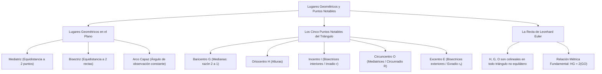

# GEOMETRÍA PREUNIVERSITARIA: CURSO COMPLETO Y SISTEMATIZADO
## EJE 02: MATEMÁTICA — GEOMETRÍA
### TEMA V: LUGARES GEOMÉTRICOS, PUNTOS NOTABLES DEL TRIÁNGULO Y RECTA DE EULER

---

## 1. FICHA TÉCNICA Y MATRIZ DE COMPETENCIAS

| Parámetro | Detalle Institucional |
| :--- | :--- |
| **Resolución Oficial** | Resolución de Consejo Universitario N° 0028-2026 (Admisión UNSA 2027) |
| **Eje Curricular** | Eje 02: Matemática / Geometría del Triángulo y Lugares Geométricos |
| **Peso Ponderado UNSA** | **Ingenierías:** 1.658337400 pts/preg (4 preg. = 6.63 pts) \| **Biomédicas:** 1.265447400 pts \| **Sociales:** 0.824574000 pts |
| **Frecuencia en Exámenes** | **Alta (91%):** Se evalúan las propiedades métricas del baricentro (razón 2:1), el circuncentro en triángulos rectángulos y la Recta de Euler. |
| **Modelos de Examen** | UNSA (Ordinario, CEPREUNSA), UNMSM (DECO de centros de masa y antenas de telecomunicación), UNI (Geometría del triángulo órtico y propiedades de la Recta de Euler). |
| **Competencia Cardinal** | Definir lugares geométricos en el plano, localizar con exactitud los puntos notables del triángulo (baricentro, ortocentro, incentro, circuncentro y excentro), y aplicar las propiedades de concurrencia y la razón colineal de Euler. |

---

## 2. MAPA TAXONÓMICO Y ONTOLOGÍA DE CONCEPTOS



---

## 3. DESARROLLO TEÓRICO FORMAL (ESTÁNDAR LUMBRERAS / CUZCANO / UNI)

### 3.1. Teoría de Lugares Geométricos (L.G.)
Un **Lugar Geométrico** es el conjunto de todos los puntos del plano, y solo ellos, que satisfacen una propiedad geométrica o métrica determinada:
$$\mathcal{LG} = \{P \in \mathbb{R}^2 \mid \mathcal{P}(P) \text{ es verdadera}\}$$

#### Lugares Geométricos Clásicos:
1. **La Mediatriz:** Lugar geométrico de todos los puntos del plano que equidistan de dos puntos fijos $A$ y $B$:
   $$\mathcal{LG} = \{P \mid d(P, A) = d(P, B)\}$$
2. **La Bisectriz:** Lugar geométrico de todos los puntos que equidistan de los lados de un ángulo:
   $$\mathcal{LG} = \{P \mid d(P, \overrightarrow{OA}) = d(P, \overrightarrow{OB})\}$$
3. **La Circunferencia:** Lugar geométrico de los puntos que equidistan de un punto fijo central $O$:
   $$\mathcal{LG} = \{P \mid d(P, O) = R\}$$
4. **El Arco Capaz:** Lugar geométrico de los puntos desde los cuales un segmento dado $\overline{AB}$ se observa bajo un mismo ángulo constante $\alpha$.

---

### 3.2. Los Cinco Puntos Notables del Triángulo

#### 1. Baricentro o Gravicentro ($G$):
Es el punto de intersección de las **tres medianas** del triángulo. Es el centro de gravedad físico de una placa triangular homogénea.
- **Teorema de la Razón 2 a 1:**
  El baricentro divide a cada mediana en dos segmentos cuya razón es de $2$ a $1$, siendo el segmento mayor el que conecta con el vértice:
  $$\mathbf{AG = 2(GM_a), \qquad BG = 2(GM_b), \qquad CG = 2(GM_c)}$$
- **Coordenadas Cartesianas del Baricentro:**
  $$G = \left(\frac{x_A + x_B + x_C}{3}, \ \frac{y_A + y_B + y_C}{3}\right)$$

#### 2. Ortocentro ($H$):
Es el punto de intersección de las **tres alturas** (o de las rectas que las contienen).
- **Ubicación según la naturaleza del triángulo:**
  - En un triángulo **acutángulo:** $H$ es un punto estrictamente **interior**.
  - En un triángulo **rectángulo:** $H$ coincide exactamente con el **vértice del ángulo recto**.
  - En un triángulo **obtusángulo:** $H$ se ubica en la **región exterior**, detrás del ángulo obtuso.

#### 3. Incentro ($I$):
Es el punto de intersección de las **tres bisectrices interiores**.
- Es el centro de la **circunferencia inscrita** (tangente interior a los tres lados).
- Su radio se denomina **inradio ($r$)**.
- Siempre es un punto **interior** en cualquier tipo de triángulo.
- **Teorema de Poncelet (exclusivo para triángulos rectángulos):**
  $$a + b = c + 2r \quad (\text{Suma de catetos} = \text{Hipotenusa} + 2 \cdot \text{Inradio})$$

#### 4. Circuncentro ($O$):
Es el punto de intersección de las **tres mediatrices** de los lados del triángulo.
- Es el centro de la **circunferencia circunscrita** (que pasa por los tres vértices).
- Su radio se denomina **circunradio ($R$)**.
- Equidista de los tres vértices: $OA = OB = OC = R$.
- **Ubicación en el plano:**
  - En un triángulo **acutángulo:** $O$ es **interior**.
  - En un triángulo **rectángulo:** $O$ se ubica exactamente en el **punto medio de la hipotenusa** ($R = c/2$).
  - En un triángulo **obtusángulo:** $O$ es **exterior**, detrás del lado mayor.
- **Ángulo Central:** El ángulo formado desde el circuncentro hacia dos vértices duplica al ángulo del tercer vértice:
  $$\mathbf{\angle BOC = 2\angle A}$$

#### 5. Excentro ($E$):
Es el punto de intersección de **dos bisectrices exteriores y una bisectriz interior**.
- Es el centro de la **circunferencia exinscrita** (tangente a un lado y a las prolongaciones de los otros dos).
- Su radio es el **exradio ($r_a$)**.
- Todo triángulo posee **tres excentros** ($E_a, E_b, E_c$), todos exteriores.

---

### 3.3. La Recta de Leonhard Euler
En **todo triángulo no equilátero**, el **Ortocentro ($H$)**, el **Baricentro ($G$)** y el **Circuncentro ($O$)** son colineales y pertenecen a una misma recta denominada **Recta de Euler**.

#### Propiedad Métrica Cardinal de la Recta de Euler:
La distancia del ortocentro al baricentro es exactamente el doble de la distancia del baricentro al circuncentro:
$$\mathbf{HG = 2(GO) \iff \frac{HG}{GO} = 2}$$
- La distancia del ortocentro a un vértice es el doble de la distancia del circuncentro al lado opuesto:
  $$BH = 2(OM_b)$$

#### Casos Especiales de Puntos Notables:
1. **Triángulo Equilátero:**
   Los cuatro puntos notables coinciden en un único punto:
   $$\mathbf{H \equiv G \equiv I \equiv O}$$
   La Recta de Euler se reduce a un único punto degenerado.
2. **Triángulo Isósceles:**
   La Recta de Euler coincide con la altura relativa a la base (eje de simetría) y contiene también al **Incentro ($I$)**:
   $$H, G, I, O \quad \text{son todos colineales sobre el eje de simetría}$$

---

## 4. FORMULARIO MAESTRO (LATEX ESTRICTO)

| Punto / Teorema | Relación Matemática | Ubicación / Condición |
| :--- | :--- | :--- |
| **Baricentro ($G$)** | $AG = 2(GM_a)$ | Razón métrica $2:1$ |
| **Coordenadas $G$** | $G = \frac{A + B + C}{3}$ | Media aritmética de vértices |
| **Poncelet** | $a + b = c + 2r$ | Triángulos rectángulos |
| **Circuncentro ($O$)** | $OA = OB = OC = R$ | Centro de circunferencia circunscrita |
| **Ángulo Circuncentro** | $\angle BOC = 2\angle A$ | Ángulo central |
| **Recta de Euler** | $HG = 2(GO)$ | Colinealidad de $H, G, O$ |
| **Distancia Vértice-Orto** | $BH = 2(OM_b)$ | Relación con la mediatriz |
| **Pitot** | $AB + CD = BC + AD$ | Cuadrilátero circunscrito |

---

## 5. MNEMOTECNIAS DE COMBATE PREUNIVERSITARIO

### 1. El Orden de la Recta de Euler: "Hugo Genera Oro" (H - G - O)
> **"H - G - O con proporción 2 a 1"**
- **H** (Ortocentro) $\to$ el más lejano.
- **G** (Baricentro) $\to$ el del medio.
- **O** (Circuncentro) $\to$ el extremo opuesto.
- La distancia grande $HG$ mide **el doble** que la chica $GO$:
  $$H \xrightarrow{\quad 2k \quad} G \xrightarrow{\quad 1k \quad} O$$

### 2. Puntos Notables y sus Líneas: "Me-Al-Bi-Me"
- **Me**dianas $\to$ Baricentro
- **Al**turas $\to$ Ortocentro
- **Bi**sectrices interiores $\to$ Incentro
- **Me**diatrices $\to$ Circuncentro

---

## 6. TÉCNICAS Y ARTIFICIOS DE CÁLCULO (HACKING PREUNIVERSITARIO)

### Artificio 1: El Circuncentro Instantáneo en Triángulos Rectángulos
Si en un problema de admisión te dicen: *"En un triángulo rectángulo de hipotenusa $20\text{ cm}$, se ubica el circuncentro $O$ y el ortocentro $H$"*:
**¡No traces mediatrices ni alturas!**
**Hack:**
- El ortocentro $H$ está en el vértice recto.
- El circuncentro $O$ está en el punto medio de la hipotenusa.
- Por tanto, la distancia $HO$ es la mediana a la hipotenusa:
  $$HO = R = \frac{20}{2} = 10\text{ cm}$$
- Y como $HG = \frac{2}{3} HO \implies HG = \frac{20}{3}\text{ cm}$. ¡Resuelto en 5 segundos!

### Artificio 2: Ángulos Formados con el Ortocentro
En un triángulo acutángulo $ABC$, el ángulo formado por las alturas en el ortocentro es el suplementario del ángulo del tercer vértice:
$$\angle BHC = 180^\circ - \angle A$$
¡Esto ahorra calcular cuadriláteros inscriptibles en el 90% de los problemas de examen!

---

## 7. ZONA DE TRAMPAS Y DISTRACTORES ("¡PELIGRO EXAMEN!")

> [!WARNING]
> **Trampa 1: El Incentro NO Pertenece a la Recta de Euler en General**
> Muchos estudiantes asumen que la Recta de Euler contiene a los cuatro puntos notables ($H, G, O, I$).
> **¡FALSO!** El incentro $I$ solo pertenece a la Recta de Euler si el triángulo es **isósceles** o equilátero. En un triángulo escaleno general, el incentro queda fuera de la recta de Euler formando un triángulo con ellos.

> [!CAUTION]
> **Trampa 2: La Ubicación del Ortocentro en Triángulos Obtusángulos**
> Si el triángulo es obtusángulo, el ortocentro no cae dentro del triángulo. Si intentas trazar las alturas hacia adentro, el dibujo colapsará. Debes prolongar los lados exteriores para encontrar el punto de concurrencia $H$.

---

## 8. APLICACIÓN AL MUNDO REAL Y CONTEXTO DECO

### Centro de Gravedad Estructural en Naves de Sillar y Ubicación de Antenas en Arequipa
En el diseño y restauración de cubiertas de sillar del Monasterio de Santa Catalina en Arequipa, la determinación del baricentro $G$ de las cerchas triangulares es crítica para concentrar el apoyo de las cargas gravitatorias sobre las columnas maestras y evitar momentos de volteo durante sismos de gran magnitud. Asimismo, las empresas de telecomunicaciones ubican antenas repetidoras en el circuncentro $O$ de tres distritos (Cerro Colorado, Cayma y Yanahuara) para asegurar que el radio de cobertura $R$ equidiste exactamente de los tres nodos poblacionales urbanos.

---

## 9. BANCO DE 5 EJERCICIOS RESUELTOS GRADUADOS

### Ejercicio 1: Nivel Básico (Propiedad Métrica del Baricentro)
**Enunciado:**
En un triángulo $ABC$, se traza la mediana $\overline{BM}$ de longitud $18\text{ cm}$. Si $G$ es el baricentro del triángulo, determine la longitud del segmento $\overline{BG}$.

**Solución paso a paso:**
1. Por el teorema fundamental del baricentro, $G$ divide a la mediana $\overline{BM}$ en la razón métrica de $2$ a $1$:
   $$BG = 2(GM)$$
2. Expresamos la longitud total de la mediana como la suma de sus partes:
   $$BM = BG + GM = 2(GM) + GM = 3(GM) = 18\text{ cm}$$
3. Despejamos el segmento menor $GM$:
   $$GM = \frac{18}{3} = 6\text{ cm}$$
4. Calculamos la longitud del segmento $\overline{BG}$:
   $$BG = 2(GM) = 2(6) = 12\text{ cm}$$

**Respuesta Final:** La longitud de $\overline{BG}$ es $\mathbf{12\text{ cm}}$.

---

### Ejercicio 2: Nivel Intermedio (Teorema de Poncelet y Circunradio)
**Enunciado:**
En un triángulo rectángulo, los catetos miden $15\text{ cm}$ y $20\text{ cm}$. Calcule la suma del inradio ($r$) y el circunradio ($R$).

**Solución paso a paso:**
1. Calculamos la hipotenusa $c$ aplicando el Teorema de Pitágoras:
   $$c = \sqrt{15^2 + 20^2} = \sqrt{225 + 400} = \sqrt{625} = 25\text{ cm}$$
   *(O reconociendo el triángulo notable 3-4-5 multiplicado por 5: $3(5), 4(5), 5(5)$)*.
2. Calculamos el **circunradio $R$**:
   En todo triángulo rectángulo, el circuncentro es el punto medio de la hipotenusa:
   $$R = \frac{c}{2} = \frac{25}{2} = 12.5\text{ cm}$$
3. Calculamos el **inradio $r$** aplicando el **Teorema de Poncelet**:
   $$a + b = c + 2r$$
   $$15 + 20 = 25 + 2r$$
   $$35 = 25 + 2r \implies 2r = 10 \implies r = 5\text{ cm}$$
4. Sumamos ambos radios:
   $$r + R = 5 + 12.5 = 17.5\text{ cm}$$

**Respuesta Final:** La suma es $\mathbf{17.5\text{ cm}}$ (o $\mathbf{\frac{35}{2}\text{ cm}}$).

---

### Ejercicio 3: Nivel Avanzado - UNSA Ordinario (La Recta de Euler)
**Enunciado:**
En un triángulo acutángulo, la distancia entre el ortocentro $H$ y el circuncentro $O$ es de $36\text{ cm}$. Calcule la distancia entre el baricentro $G$ y el circuncentro $O$.

**Solución paso a paso:**
1. Por la teoría de la **Recta de Euler**, los puntos $H, G$ y $O$ son colineales y guardan la relación métrica:
   $$HG = 2(GO)$$
2. Representamos las distancias en función de una constante $k$:
   $$GO = k \implies HG = 2k$$
3. La distancia total entre el ortocentro y el circuncentro es:
   $$HO = HG + GO = 2k + k = 3k = 36\text{ cm}$$
4. Despejamos el valor de $k$:
   $$k = \frac{36}{3} = 12\text{ cm}$$
5. La distancia solicitada es $GO$:
   $$GO = k = 12\text{ cm}$$

**Respuesta Final:** La distancia entre el baricentro y el circuncentro es $\mathbf{12\text{ cm}}$.

---

### Ejercicio 4: Nivel San Marcos DECO (Ángulo con el Circuncentro e Incentro)
**Enunciado:**
En un triángulo $ABC$, el ángulo interior en el vértice $A$ mide $50^\circ$. Si $O$ es el circuncentro e $I$ es el incentro del triángulo, determine la diferencia positiva entre las medidas de los ángulos $\angle BIC$ y $\angle BOC$.

**Solución paso a paso:**
1. Calculamos el ángulo formado en el incentro ($\angle BIC$):
   $$\angle BIC = 90^\circ + \frac{\angle A}{2} = 90^\circ + \frac{50^\circ}{2} = 90^\circ + 25^\circ = 115^\circ$$
2. Calculamos el ángulo formado en el circuncentro ($\angle BOC$):
   Por el teorema del ángulo central en el circuncentro:
   $$\angle BOC = 2\angle A = 2(50^\circ) = 100^\circ$$
3. Calculamos la diferencia positiva entre ambos ángulos:
   $$\text{Diferencia} = \angle BIC - \angle BOC = 115^\circ - 100^\circ = 15^\circ$$

**Respuesta Final:** La diferencia positiva es $\mathbf{15^\circ}$.

---

### Ejercicio 5: Nivel Boss Challenge - Estilo UNI (Distancia del Ortocentro al Baricentro)
**Enunciado:**
En un triángulo rectángulo $ABC$ recto en $B$, los catetos miden $AB = 6\text{ cm}$ y $BC = 8\text{ cm}$. Determine la distancia exacta entre el ortocentro $H$ y el baricentro $G$.

**Solución paso a paso:**
1. Localizamos la posición geométrica del ortocentro y el baricentro:
   - Al ser un triángulo rectángulo recto en $B$, el **ortocentro $H$ coincide con el vértice $B$**:
     $$H \equiv B$$
   - Por tanto, la distancia $HG$ es la distancia desde el vértice $B$ hasta el baricentro $G$:
     $$HG = BG$$
2. Calculamos la hipotenusa $AC$:
   $$AC = \sqrt{6^2 + 8^2} = \sqrt{36 + 64} = \sqrt{100} = 10\text{ cm}$$
3. Trazamos la mediana relativa a la hipotenusa $\overline{BM}$:
   Por el Teorema de la Mediana a la Hipotenusa:
   $$BM = \frac{AC}{2} = \frac{10}{2} = 5\text{ cm}$$
4. Por la propiedad del baricentro sobre la mediana ($BG = \frac{2}{3} BM$):
   $$BG = \frac{2}{3}(5) = \frac{10}{3}\text{ cm}$$
5. Como $HG = BG$:
   $$HG = \frac{10}{3}\text{ cm}$$

**Respuesta Final:** La distancia entre el ortocentro y el baricentro es $\mathbf{\frac{10}{3}\text{ cm}}$.

---

## 10. GLOSARIO DE 10 TÉRMINOS CLAVE

1. **Lugar Geométrico:** Conjunto de puntos del plano que comparten una propiedad geométrica común unívoca.
2. **Baricentro ($G$):** Punto de intersección de las medianas que divide a cada una en razón $2:1$.
3. **Ortocentro ($H$):** Punto de concurrencia de las tres alturas o sus prolongaciones.
4. **Incentro ($I$):** Centro de la circunferencia inscrita y punto de concurrencia de las bisectrices interiores.
5. **Circuncentro ($O$):** Centro de la circunferencia circunscrita y punto de concurrencia de las mediatrices.
6. **Excentro ($E$):** Centro de la circunferencia exinscrita, tangente exterior a un lado del triángulo.
7. **Recta de Euler:** Recta que contiene de manera colineal al ortocentro, baricentro y circuncentro.
8. **Teorema de Poncelet:** Ecuación métrica para triángulos rectángulos que relaciona los catetos con la hipotenusa y el inradio.
9. **Inradio ($r$):** Radio de la circunferencia tangente interior a los tres lados de un triángulo.
10. **Circunradio ($R$):** Radio de la circunferencia que pasa por los tres vértices del triángulo.

---

## 11. BANCO DE FLASHCARDS (ANVERSO / REVERSO)

- **Flashcard 1:**
  - *Anverso:* En qué proporción divide el baricentro a cada mediana del triángulo?
  - *Reverso:* En la razón de $2$ a $1$, partiendo desde el vértice hacia el punto medio ($AG = 2GM$).
- **Flashcard 2:**
  - *Anverso:* Dónde se ubica el ortocentro en un triángulo rectángulo?
  - *Reverso:* Coincide exactamente con el vértice del ángulo recto.
- **Flashcard 3:**
  - *Anverso:* Dónde se ubica el circuncentro en un triángulo rectángulo?
  - *Reverso:* En el punto medio de la hipotenusa.
- **Flashcard 4:**
  - *Anverso:* Cuál es la relación métrica de distancias en la Recta de Euler?
  - *Reverso:* $HG = 2(GO)$ (La distancia del ortocentro al baricentro es el doble que del baricentro al circuncentro).
- **Flashcard 5:**
  - *Anverso:* Qué establece el Teorema de Poncelet?
  - *Reverso:* $a + b = c + 2r$ (Suma de catetos = Hipotenusa + 2 veces el inradio).

---

## 12. MOTOR DE GAMIFICACIÓN (JSON PARA KOTLIN MULTIPLATFORM)

```json
{
  "topicId": "geom_05_lugares_puntos_notables",
  "title": "Lugares Geométricos, Puntos Notables y Recta de Euler",
  "subject": "geometria",
  "xpReward": 430,
  "level": "ADVANCED",
  "badges": [
    {
      "id": "euler_line_master",
      "name": "Navegante de Euler",
      "description": "Localizaste ortocentros, circuncentros y baricentros en proporción 2:1 a la perfección."
    }
  ],
  "questions": [
    {
      "id": "q1",
      "statement": "En un triángulo acutángulo, si la distancia entre el baricentro y el circuncentro es 4 cm, ¿cuánto mide la distancia entre el ortocentro y el baricentro?",
      "options": ["8 cm", "4 cm", "2 cm", "12 cm"],
      "correctIndex": 0,
      "explanation": "Por la propiedad métrica de la Recta de Euler: HG = 2(GO) = 2(4) = 8 cm."
    },
    {
      "id": "q2",
      "statement": "En un triángulo rectángulo de catetos 6 cm y 8 cm, ¿cuánto mide su inradio según el teorema de Poncelet?",
      "options": ["2 cm", "1 cm", "3 cm", "4 cm"],
      "correctIndex": 0,
      "explanation": "Hipotenusa c = 10 cm. Poncelet: 6 + 8 = 10 + 2r => 14 = 10 + 2r => 2r = 4 => r = 2 cm."
    }
  ]
}
```
