# TEMA 07: LA CIRCUNFERENCIA

---

## 1. FICHA TÉCNICA Y MATRIZ DE COMPETENCIAS

| Parámetro | Detalle |
| :--- | :--- |
| **Eje Temático** | 02. Matemática |
| **Área Disciplinar** | Geometría Plana |
| **Nivel de Complejidad** | Intermedio a Avanzado (Estándar CEPREUNSA, UNMSM-DECO, UNI) |
| **Ponderación UNSA** | Ingenierías: 1.6583 pts \| Biomédicas: 1.2654 pts \| Sociales: 0.8245 pts |
| **Tiempo Estimado de Estudio** | 3.5 a 4.5 horas |
| **Prerrequisitos** | Ángulos, Triángulos, Congruencia, Semejanza y Cuadriláteros |

### Competencias Clave del Prospecto
1. **Modelación Espacial y Angular:** Identificar, clasificar y calcular medidas angulares determinadas por cuerdas, secantes y tangentes en la circunferencia.
2. **Aplicación Teoremas de Contacto:** Utilizar con precisión los teoremas de Poncelet, Pitot y Steiner en triángulos rectángulos y polígonos circunscritos/exinscritos.
3. **Reconocimiento de Inscriptibilidad:** Reconocer y aplicar las condiciones necesarias y suficientes para que un cuadrilátero sea inscriptible o inscrito en la resolución de problemas geométricos de alta exigencia.
4. **Relaciones Métricas en la Circunferencia:** Relacionar métricamente cuerdas, secantes y tangentes (Teorema de cuerdas, de las secantes y de la tangente).

---

## 2. MAPA TAXONÓMICO Y ONTOLOGÍA

```mermaid
graph TD
    A[La Circunferencia] --> B[Elementos Asociados]
    A --> C[Posiciones Relativas]
    A --> D[Ángulos en la Circunferencia]
    A --> E[Teoremas Fundamentales de Tangencia]
    A --> F[Cuadrilátero Inscriptible]
    A --> G[Relaciones Métricas Circulares]

    B --> B1[Radio, Cuerda, Diámetro]
    B --> B2[Arco, Flecha o Sagita]
    B --> B3[Recta Secante y Tangente]

    C --> C1[Exteriores y Tangentes Ext.]
    C --> C2[Secantes y Ortogonales]
    C --> C3[Tangentes Int., Interiores y Concéntricas]

    D --> D1[Central e Inscrito]
    D --> D2[Semi-inscrito y Ex-inscrito]
    D --> D3[Interior y Exterior]

    E --> E1[Radio perpendicular a Tangente]
    E --> E2[Segmentos Tangentes Congruentes]
    E --> E3[Teorema de Poncelet: a+b=c+2r]
    E --> E4[Teorema de Pitot: a+c=b+d]

    F --> F1[Ángulos Opuestos Suplementarios]
    F --> F2[Ángulos 'Rebote' de Diagonales]
    F --> F3[Ángulo Exterior = Interior Opuesto]

    G --> G1[Teorema de las Cuerdas]
    G --> G2[Teorema de las Secantes]
    G --> G3[Teorema de la Tangente]
```



---

## 3. DESARROLLO TEÓRICO FORMAL

### 3.1. Definición y Elementos Asociados
La **circunferencia** es el lugar geométrico de todos los puntos de un plano que equidistan de un punto fijo denominado **centro** ($O$). La distancia constante entre el centro y cualquier punto de la circunferencia se denomina **radio** ($R$ o $r$).
$$\mathcal{C}(O, R) = \{ P \in \mathbb{R}^2 \mid d(P, O) = R \}$$

*Diferencia con el Círculo:* La circunferencia es la línea curva cerrada perimetral (unidimensional). El círculo es la unión de la circunferencia con todos sus puntos interiores (región bidimensional).

#### Elementos Notables:
1. **Cuerda:** Segmento que une dos puntos cualesquiera de la circunferencia (ej. $\overline{AB}$).
2. **Diámetro (Cuerda Máxima):** Cuerda que contiene al centro. Mide exactamente $2R$. Divide a la circunferencia en dos semicircunferencias de $180^\circ$.
3. **Arco:** Porción continua de circunferencia limitada por dos puntos ($\widehat{AB}$).
4. **Flecha o Sagita:** Segmento perpendicular a una cuerda levantado desde su punto medio hasta la intersección con el arco subtendido.
5. **Recta Tangente ($\mathscr{L}_T$):** Recta coplanar que interseca a la circunferencia en un único punto denominado **punto de tangencia** o contacto ($T$).
6. **Recta Secante ($\mathscr{L}_S$):** Recta que corta a la circunferencia en dos puntos distintos.

---

### 3.2. Propiedades Fundamentales de la Circunferencia
1. **Propiedad del Radio y la Tangente:** Todo radio trazado al punto de tangencia es estrictamente perpendicular a la recta tangente.
   $$\overline{OT} \perp \mathscr{L}_T$$
2. **Perpendicularidad Centro-Cuerda:** Todo radio o diámetro perpendicular a una cuerda biseca a la cuerda y al arco que subtiende.
   $$\text{Si } \overline{OM} \perp \overline{AB} \implies AM = MB \quad \text{y} \quad m\widehat{AN} = m\widehat{NB}$$
3. **Cuerdas Congruentes:** A cuerdas de igual longitud les corresponden arcos de igual medida angular, y equidistan del centro.
   $$AB = CD \iff m\widehat{AB} = m\widehat{CD} \iff d(O, \overline{AB}) = d(O, \overline{CD})$$
4. **Cuerdas Paralelas:** Los arcos comprendidos entre dos cuerdas paralelas son congruentes.
   $$\overline{AB} \parallel \overline{CD} \implies m\widehat{AC} = m\widehat{BD}$$
5. **Tangentes desde un punto exterior:** Si desde un punto exterior $P$ se trazan las tangentes $\overline{PA}$ y $\overline{PB}$ a la circunferencia:
   $$PA = PB \quad \text{y} \quad \overrightarrow{PO} \text{ es bisectriz del } \angle APB$$

---

### 3.3. Posiciones Relativas de Dos Circunferencias Coplanares
Sean dos circunferencias de centros $O_1, O_2$, radios $R$ y $r$ ($R \ge r$) y distancia entre centros $d = O_1O_2$:

1. **Circunferencias Exteriores:** No tienen puntos comunes.
   $$d > R + r$$
2. **Circunferencias Tangentes Exteriores:** Tienen un único punto común exterior. Los centros y el punto de tangencia son colineales.
   $$d = R + r$$
3. **Circunferencias Secantes:** Se cortan en dos puntos distintos.
   $$R - r < d < R + r$$
   *Caso Particular (Ortogonales):* Los radios trazados a uno de los puntos de intersección son perpendiculares: $d^2 = R^2 + r^2$.
4. **Circunferencias Tangentes Interiores:** Tienen un único punto de contacto y una está dentro de la otra.
   $$d = R - r \quad (R > r)$$
5. **Circunferencias Interiores:** No tienen puntos comunes y una está dentro de la otra sin compartir centro.
   $$0 \le d < R - r$$
6. **Circunferencias Concéntricas:** Mismo centro ($d = 0$). La región comprendida entre ellas es una corona circular.

---

### 3.4. Ángulos en la Circunferencia

| Tipo de Ángulo | Vértice | Lados | Fórmula de la Medida |
| :--- | :--- | :--- | :--- |
| **Central** | En el centro $O$ | Dos radios | $\alpha = m\widehat{AB}$ |
| **Inscrito** | En la circunferencia | Dos cuerdas | $\alpha = \dfrac{m\widehat{AB}}{2}$ |
| **Semi-inscrito** | En la circunferencia | Una tangente y una cuerda | $\alpha = \dfrac{m\widehat{TA}}{2}$ |
| **Ex-inscrito** | En la circunferencia | Una secante y una cuerda | $\alpha = \dfrac{m\widehat{ABC}}{2} = 180^\circ - \text{inscrito}$ |
| **Interior** | Interior a la circ. | Dos cuerdas secantes | $\alpha = \dfrac{m\widehat{AB} + m\widehat{CD}}{2}$ |
| **Exterior (Secantes)** | Exterior | Dos secantes | $\alpha = \dfrac{m\widehat{AB} - m\widehat{CD}}{2}$ |
| **Exterior (Sec.-Tang.)** | Exterior | Una tangente y una secante | $\alpha = \dfrac{m\widehat{TB} - m\widehat{TC}}{2}$ |
| **Exterior (Tangentes)** | Exterior | Dos tangentes | $\alpha = \dfrac{m\widehat{AMB} - m\widehat{AB}}{2} = 180^\circ - m\widehat{AB}$ |

*Corolario Fundamental:* En el ángulo exterior formado por dos tangentes, la suma de su medida con la del arco menor correspondiente es siempre $180^\circ$:
$$\alpha + m\widehat{AB} = 180^\circ$$

---

### 3.5. Teoremas de Poncelet, Pitot y Steiner

#### Teorema de Poncelet
En todo triángulo rectángulo, la suma de las longitudes de los catetos es igual a la longitud de la hipotenusa más el doble del inradio (diámetro de la circunferencia inscrita).
$$a + b = c + 2r$$
*Demostración resumida:* Se basa en la descomposición de los catetos en segmentos tangentes desde los vértices: cateto $a = r + (a-r)$, cateto $b = r + (b-r)$. La hipotenusa $c = (a-r) + (b-r) = a + b - 2r \implies a + b = c + 2r$.

#### Teorema de Pitot
En todo cuadrilátero circunscrito a una circunferencia (o cuadrilátero tangencial), la suma de las longitudes de dos lados opuestos es igual a la suma de los otros dos lados opuestos.
$$AB + CD = BC + AD$$
*Condición necesaria y suficiente:* Un cuadrilátero convexo admite circunferencia inscrita si y solo si cumple el Teorema de Pitot.

#### Teorema de Steiner
En todo cuadrilátero exinscrito a una circunferencia, la diferencia de las longitudes de los lados opuestos es igual.
$$|AB - CD| = |AD - BC|$$

---

### 3.6. Cuadriláteros Inscritos e Inscriptibles

Un cuadrilátero es **inscrito** si sus cuatro vértices pertenecen a una misma circunferencia.  
Es **inscriptible** si por sus cuatro vértices es posible hacer pasar una circunferencia.

#### Condiciones de Inscriptibilidad (Criterios Sí y Solo Sí):
1. **Ángulos Opuestos Suplementarios:** Un cuadrilátero convexo es inscriptible si y solo si sus ángulos opuestos suman $180^\circ$.
   $$\alpha + \theta = 180^\circ$$
2. **Ángulo Exterior igual al Interior Opuesto:** Un cuadrilátero es inscriptible si un ángulo exterior es congruente con el ángulo interior opuesto.
3. **Propiedad de las Diagonales ("Efecto Mariposa" o "Rebote"):** El ángulo formado por una diagonal y un lado es congruente con el ángulo formado por la otra diagonal y el lado opuesto.
   $$\angle BAC \cong \angle BDC$$
4. **Cuadriláteros Inscriptibles Notables:**
   - Todo rectángulo es inscriptible.
   - Todo trapecio isósceles es inscriptible.
   - Todo cuadrado es inscriptible.
   - Todo cuadrilátero con dos ángulos opuestos rectos ($90^\circ + 90^\circ = 180^\circ$) es inscriptible.

---

### 3.7. Relaciones Métricas en la Circunferencia
1. **Teorema de las Cuerdas:** Si dos cuerdas $\overline{AB}$ y $\overline{CD}$ se intersecan en un punto interior $P$:
   $$PA \cdot PB = PC \cdot PD$$
2. **Teorema de las Secantes:** Si desde un punto exterior $P$ se trazan dos secantes $P-A-B$ y $P-C-D$:
   $$PA \cdot PB = PC \cdot PD \quad (\text{parte externa} \times \text{total})$$
3. **Teorema de la Tangente:** Si desde un punto exterior $P$ se traza la tangente $\overline{PT}$ ($T$ punto de contacto) y una secante $P-A-B$:
   $$PT^2 = PA \cdot PB$$

---

## 4. FORMULARIO MAESTRO (LATEX ESTRICTO)

| Situación Geométrica | Identidad / Ecuación Rigurosa | Variables y Condiciones |
| :--- | :--- | :--- |
| **Ángulo Inscrito** | $\theta = \dfrac{1}{2} m\widehat{AB}$ | Vértice en la circunferencia |
| **Ángulo Interior** | $\theta = \dfrac{m\widehat{AB} + m\widehat{CD}}{2}$ | Intersección de cuerdas |
| **Ángulo Exterior** | $\theta = \dfrac{m\widehat{AB} - m\widehat{CD}}{2}$ | Vértice exterior, arcos $AB > CD$ |
| **Tangentes Exteriores** | $\theta + m\widehat{AB}_{\text{menor}} = 180^\circ$ | Vértice formado por 2 tangentes |
| **Teorema de Poncelet** | $a + b = c + 2r$ | $\triangle$ rectángulo, $c$ hipotenusa, $r$ inradio |
| **Poncelet Generalizado** | $a + b = c + 2(r + r_e)$ | Válido en configuraciones mixtas |
| **Teorema de Pitot** | $a + c = b + d$ | Cuadrilátero circunscrito convexo |
| **Teorema de Steiner** | $a - c = b - d$ | Cuadrilátero exinscrito |
| **Teorema de Cuerdas** | $x \cdot y = u \cdot v$ | Segmentos determinados en el punto de cruce |
| **Teorema de Secantes** | $e_1 \cdot T_1 = e_2 \cdot T_2$ | $e_i$: parte exterior, $T_i$: secante total |
| **Teorema de la Tangente**| $x^2 = e \cdot T$ | $x$: segmento tangente, $e$: externo, $T$: total |

---

## 5. MNEMOTECNIAS DE COMBATE PREUNIVERSITARIO

### 1. Mnemotecnia de los Teoremas de Contacto: "PON-CATO y PI-TOPO"
- **PON-CATO (Poncelet):**  
  **PON**celet = **CAT**etos suman **O**tra cosa: $\text{Cateto}_1 + \text{Cateto}_2 = \text{Hipotenusa} + 2r$.
- **PI-TOPO (Pitot):**  
  **PI**tot = **OP**uestos suman igual (**TO**dos los **OP**uestos: arriba + abajo = izquierda + derecha).

### 2. Mnemotecnia para Ángulos Circulares: "IN-MITAD, INT-PROMEDIO, EXT-DIFERENCIA"
- **IN**scrito $\to$ la **MITAD** del arco ($\frac{\text{arco}}{2}$).
- **INT**erior $\to$ la **SEMISUMA** o promedio de los arcos ($\frac{\text{arco}_1 + \text{arco}_2}{2}$).
- **EXT**erior $\to$ la **SEMIDIFERENCIA** ($\frac{\text{arco Mayor} - \text{arco Menor}}{2}$).

### 3. Mnemotecnia de Inscriptibilidad: "BOING-BOING (El Rebote)"
- Si ves una cruz de diagonales dentro de un cuadrilátero, el ángulo de la base "rebota" en la pared superior y cae en la base opuesta: si $\angle 1 = \angle 2$, ¡el cuadrilátero es inscriptible al instante!

---

## 6. TÉCNICAS Y ARTIFICIOS DE CÁLCULO (HACKING PREUNIVERSITARIO)

### Hack 1: Trazar el Radio al Punto de Tangencia (El Trazo Obligado)
En el 90% de los problemas de examen donde aparezca una recta tangente o una circunferencia inscrita/tangente a una recta, **el trazo auxiliar automático e inexcusable** es trazar el radio desde el centro hacia el punto de tangencia.
- Esto genera un ángulo de $90^\circ$.
- Transforma de inmediato el problema en un triángulo rectángulo donde se aplican razones trigonométricas, semejanza o Teorema de Pitágoras.

### Hack 2: Unión de Centros en Circunferencias Tangentes
Cuando dos circunferencias son tangentes (exteriores o interiores), el segmento que une sus centros **pasa obligatoriamente por el punto de tangencia**.
- La distancia entre centros es $R + r$ (tangentes exteriores) o $R - r$ (tangentes interiores).
- Al unir los centros, se forma una línea recta continua de longitud conocida, ideal para trazar alturas y formar triángulos rectángulos.

### Hack 3: Ángulo Inscrito en una Semicircunferencia
Siempre que veas un diámetro $AB$ y un punto $P$ en la semicircunferencia, traza $\overline{AP}$ y $\overline{BP}$. El ángulo $\angle APB$ es **siempre de $90^\circ$** porque subtiende un arco de $180^\circ$. ¡Es una fábrica instantánea de triángulos rectángulos y alturas!

---

## 7. ZONA DE TRAMPAS Y DISTRACTORES ("¡PELIGRO EXAMEN!")

> [!WARNING]
> **Trampa 1: Confundir Cuadrilátero Inscrito con Circunscrito**
> - **Inscrito (Inscriptible):** Los vértices tocan la circunferencia. Cumple ángulos opuestos suplementarios ($180^\circ$) y rebote de diagonales. **NO cumple Pitot**.
> - **Circunscrito:** Los lados son tangentes a la circunferencia. Cumple el **Teorema de Pitot** ($a+c = b+d$). **NO necesariamente tiene ángulos opuestos suplementarios** a menos que sea bicéntrico.

> [!CAUTION]
> **Trampa 2: La Sagita y el Radio**
> La sagita (flecha) $h$ es solo el pedacito entre la cuerda y el arco. El radio completo es $R$. El segmento del centro a la cuerda mide $R - h$. Muchos postulantes confunden la sagita con la distancia del centro a la cuerda y erran en Pitágoras:
> $$(R - h)^2 + \left(\frac{L_{\text{cuerda}}}{2}\right)^2 = R^2$$

> [!WARNING]
> **Trampa 3: Signo en el Teorema de la Secante**
> En el teorema de las secantes, es **parte externa por TOTAL**, NO parte externa por parte interna:
> $$\text{CORRECTO: } PA \cdot PB \quad (PB = PA + AB)$$
> $$\text{ERROR FATAL: } PA \cdot AB$$

---

## 8. APLICACIÓN AL MUNDO REAL Y CONTEXTO DECO

1. **Ingeniería Mecánica y Engranajes:** La relación entre poleas, correas de transmisión y engranajes planetarios depende del radio y los puntos de contacto tangenciales, garantizando relaciones de transmisión constantes sin deslizamiento angular.
2. **Arquitectura y Bóvedas:** Los arcos góticos, de medio punto y peraltados son combinaciones de arcos de circunferencias secantes y tangentes cuyos centros determinan la distribución de cargas de empuje hacia las columnas.
3. **Sistemas de Posicionamiento Global (GPS y Triangulación):** La localización de un teléfono móvil se basa en la intersección de circunferencias generadas por la distancia (tiempo de viaje de la señal por la velocidad de la luz) a tres antenas transmisoras base.

---

## 9. BANCO DE 5 EJERCICIOS RESUELTOS GRADUADOS

### Ejercicio 1 (Nivel 1 - Básico / Admisión Directa)
**Enunciado:** En una circunferencia de centro $O$, los puntos $A, B$ y $C$ pertenecen a ella de modo que el ángulo central $\angle AOC$ mide $110^\circ$. Si el punto $B$ se encuentra en el arco mayor $AC$, calcule la medida del ángulo inscrito $\angle ABC$.

- A) $55^\circ$
- B) $110^\circ$
- C) $70^\circ$
- D) $125^\circ$
- E) $35^\circ$

**Solución Paso a Paso:**
1. El ángulo central $\angle AOC = 110^\circ$, por tanto, la medida del arco menor $\widehat{AC}$ es:
   $$m\widehat{AC}_{\text{menor}} = 110^\circ$$
2. El punto $B$ está ubicado en el arco mayor $AC$. El ángulo inscrito $\angle ABC$ subtiende directamente al arco menor $\widehat{AC}$.
3. Aplicamos la fórmula del ángulo inscrito:
   $$\angle ABC = \frac{m\widehat{AC}_{\text{menor}}}{2} = \frac{110^\circ}{2} = 55^\circ$$
- **Respuesta Correcta:** A) $55^\circ$

---

### Ejercicio 2 (Nivel 2 - Intermedio / CEPREUNSA)
**Enunciado:** En un triángulo rectángulo $ABC$ recto en $B$, los catetos miden $AB = 8\text{ cm}$ y $BC = 15\text{ cm}$. Calcule el radio de la circunferencia inscrita (inradio) en dicho triángulo.

- A) $2\text{ cm}$
- B) $3\text{ cm}$
- C) $4\text{ cm}$
- D) $2.5\text{ cm}$
- E) $3.5\text{ cm}$

**Solución Paso a Paso:**
1. Calculamos la hipotenusa $AC$ mediante el Teorema de Pitágoras:
   $$AC = \sqrt{AB^2 + BC^2} = \sqrt{8^2 + 15^2} = \sqrt{64 + 225} = \sqrt{289} = 17\text{ cm}$$
2. Aplicamos el **Teorema de Poncelet**:
   $$AB + BC = AC + 2r$$
3. Sustituimos los valores numéricos:
   $$8 + 15 = 17 + 2r \implies 23 = 17 + 2r \implies 2r = 6 \implies r = 3\text{ cm}$$
- **Respuesta Correcta:** B) $3\text{ cm}$

---

### Ejercicio 3 (Nivel 3 - Intermedio-Avanzado / UNSA Ordinario)
**Enunciado:** En un trapecio isósceles $ABCD$ ($\overline{BC} \parallel \overline{AD}$) circunscrito a una circunferencia, las bases miden $BC = 4\text{ m}$ y $AD = 16\text{ m}$. Calcule el radio de la circunferencia inscrita.

- A) $4\text{ m}$
- B) $2\sqrt{2}\text{ m}$
- C) $5\text{ m}$
- D) $4\sqrt{2}\text{ m}$
- E) $8\text{ m}$

**Solución Paso a Paso:**
1. Dado que el trapecio está circunscrito a la circunferencia, aplicamos el **Teorema de Pitot**:
   $$AB + CD = BC + AD = 4 + 16 = 20\text{ m}$$
2. Por ser trapecio isósceles, los lados no paralelos son congruentes: $AB = CD$.
   $$2 AB = 20 \implies AB = CD = 10\text{ m}$$
3. Trazamos las alturas $\overline{BH}$ y $\overline{CK}$ hacia la base mayor $\overline{AD}$.
   - El segmento intermedio es $HK = BC = 4\text{ m}$.
   - Los segmentos laterales son congruentes:
     $$AH = KD = \frac{AD - BC}{2} = \frac{16 - 4}{2} = 6\text{ m}$$
4. En el triángulo rectángulo $AHB$, calculamos la altura $h = BH$:
   $$h = \sqrt{AB^2 - AH^2} = \sqrt{10^2 - 6^2} = \sqrt{100 - 36} = \sqrt{64} = 8\text{ m}$$
5. Como el trapecio está circunscrito entre dos rectas paralelas (las bases), la altura del trapecio coincide exactamente con el diámetro de la circunferencia inscrita:
   $$2r = h = 8\text{ m} \implies r = 4\text{ m}$$
- **Respuesta Correcta:** A) $4\text{ m}$

---

### Ejercicio 4 (Nivel 4 - Avanzado / UNMSM DECO)
**Enunciado:** Desde un punto exterior $P$ a una circunferencia se trazan la tangente $\overline{PT}$ ($T$ es el punto de tangencia) y una recta secante que corta a la circunferencia en los puntos $A$ y $B$ ($P-A-B$). Se sabe que la cuerda $AB$ mide $5\text{ cm}$ y el segmento exterior $PA$ mide $4\text{ cm}$. Si se traza otra secante $P-C-D$ que pasa por el centro $O$, de modo que el radio de la circunferencia mide $R = 4.5\text{ cm}$, halle la distancia desde $P$ hasta el centro $O$.

- A) $7.5\text{ cm}$
- B) $6.5\text{ cm}$
- C) $8\text{ cm}$
- D) $7\text{ cm}$
- E) $9\text{ cm}$

**Solución Paso a Paso:**
1. Calculamos la longitud del segmento tangente $PT$ aplicando el **Teorema de la Tangente**:
   $$PT^2 = PA \cdot PB$$
   Donde $PA = 4\text{ cm}$ y $PB = PA + AB = 4 + 5 = 9\text{ cm}$.
   $$PT^2 = 4 \cdot 9 = 36 \implies PT = 6\text{ cm}$$
2. Consideramos el triángulo formado por el punto exterior $P$, el punto de tangencia $T$ y el centro $O$: $\triangle PTO$.
3. Por propiedad fundamental de la tangencia, el radio al punto de contacto es perpendicular a la tangente:
   $$\overline{OT} \perp \overline{PT} \implies \angle PTO = 90^\circ$$
4. El $\triangle PTO$ es un triángulo rectángulo de catetos $PT = 6\text{ cm}$ y radio $OT = R = 4.5\text{ cm}$.
5. Calculamos la hipotenusa $PO$ (distancia de $P$ al centro $O$) mediante Pitágoras:
   $$PO^2 = PT^2 + OT^2 = 6^2 + (4.5)^2 = 36 + 20.25 = 56.25$$
   $$PO = \sqrt{56.25} = 7.5\text{ cm}$$
- **Respuesta Correcta:** A) $7.5\text{ cm}$

---

### Ejercicio 5 (Nivel 5 - Boss Challenge / UNI)
**Enunciado:** En un triángulo acutángulo $ABC$, se trazan las alturas $\overline{AD}$ y $\overline{CE}$ que se intersecan en el ortocentro $H$. Se traza la recta que pasa por $E$ y $D$, la cual interseca a la prolongación del lado $\overline{AC}$ en el punto $P$. Si $AC = b$, y los segmentos $CD = m$ y $CB = a$, demuestre analíticamente y determine el valor del producto $PA \cdot PC$ en función de la longitud del segmento tangente trazado desde $P$ a la circunferencia circunscrita al cuadrilátero inscriptible $ACDE$. Si adicionalmente $PC = 4\text{ m}$ y $AC = 8\text{ m}$, calcule la longitud del segmento secante exterior asociado a los puntos $E$ y $D$.

- A) $48\text{ m}^2$
- B) $32\text{ m}^2$
- C) $24\text{ m}^2$
- D) $16\text{ m}^2$
- E) $40\text{ m}^2$

**Solución Paso a Paso:**
1. **Identificación de Inscriptibilidad:**
   - En el triángulo $ABC$, las alturas $\overline{AD} \perp \overline{BC}$ y $\overline{CE} \perp \overline{AB}$ determinan que:
     $$\angle ADC = 90^\circ \quad \text{y} \quad \angle AEC = 90^\circ$$
   - Ambos ángulos subtienden el mismo segmento $\overline{AC}$. Por la condición de "rebote" (ángulos rectos opuestos al mismo segmento base), los vértices $A, E, D, C$ son concíclicos; es decir, **el cuadrilátero $AEDC$ es inscriptible** en una circunferencia cuyo diámetro es precisamente $\overline{AC}$.
2. **Aplicación del Teorema de las Secantes:**
   - Como $A, E, D, C$ pertenecen a una misma circunferencia $\mathcal{C}_1$, las rectas secantes que se intersecan en el punto exterior $P$ son la recta que contiene a los puntos $P-C-A$ y la recta que contiene a $P-D-E$.
   - Por el **Teorema de las Secantes** con respecto a la circunferencia $\mathcal{C}_1$:
     $$PC \cdot PA = PD \cdot PE$$
3. **Cálculo Numérico del Potencial de Punto:**
   - Se nos dan los valores $PC = 4\text{ m}$ y $AC = 8\text{ m}$.
   - La longitud total de la secante $PA$ es:
     $$PA = PC + AC = 4 + 8 = 12\text{ m}$$
   - Evaluamos el producto métrico (potencia del punto $P$):
     $$PC \cdot PA = 4 \cdot 12 = 48\text{ m}^2$$
   - Por tanto, $PD \cdot PE = 48\text{ m}^2$.
- **Respuesta Correcta:** A) $48\text{ m}^2$

---

## 10. GLOSARIO DE 10 TÉRMINOS CLAVE

1. **Circunferencia:** Lugar geométrico de los puntos del plano que equidistan de un centro fijo.
2. **Inradio:** Radio de la circunferencia inscrita en un polígono (tangente interior a todos sus lados).
3. **Circunradio:** Radio de la circunferencia circunscrita a un polígono (pasa por todos sus vértices).
4. **Cuerda:** Segmento cuyos extremos son dos puntos de una misma circunferencia.
5. **Sagita (Flecha):** Segmento perpendicular a una cuerda levantado desde su punto medio hasta la circunferencia.
6. **Cuadrilátero Inscriptible:** Aquel cuadrilátero convexo por cuyos cuatro vértices pasa una circunferencia.
7. **Punto de Tangencia:** Único punto común entre una recta tangente y una circunferencia.
8. **Ángulo Central:** Ángulo cuyo vértice coincide con el centro de la circunferencia y sus lados son radios.
9. **Ángulo Inscrito:** Ángulo cuyo vértice está sobre la circunferencia y sus lados son cuerdas.
10. **Potencia de un Punto:** Valor constante obtenido del producto de los segmentos de cualquier secante trazada desde dicho punto a la circunferencia ($P(x) = d^2 - R^2$).

---

## 11. BANCO DE FLASHCARDS (Q/A)

- **Q: ¿Qué afirma el Teorema de Poncelet y en qué tipo de triángulo es aplicable?**
  - **A:** Es aplicable exclusivamente en triángulos rectángulos. Afirma que la suma de los catetos es igual a la hipotenusa más dos veces el inradio ($a + b = c + 2r$).
- **Q: ¿Qué relación guardan los lados opuestos de un cuadrilátero circunscrito a una circunferencia (Teorema de Pitot)?**
  - **A:** La suma de las longitudes de dos lados opuestos es exactamente igual a la suma de los otros dos lados opuestos ($a + c = b + d$).
- **Q: ¿Cuánto suman el ángulo exterior formado por dos tangentes y el arco menor comprendido entre ellas?**
  - **A:** Suman siempre $180^\circ$ ($\alpha + m\widehat{AB} = 180^\circ$).
- **Q: ¿Cuál es el valor del ángulo inscrito que subtiende un diámetro o semicircunferencia?**
  - **A:** Mide exactamente $90^\circ$ (ángulo recto).
- **Q: ¿Cuáles son las dos condiciones angulares más usadas para demostrar que un cuadrilátero es inscriptible?**
  - **A:** 1) Ángulos opuestos suplementarios ($\alpha + \theta = 180^\circ$); 2) Ángulos de rebote de diagonales congruentes ($\angle BAC = \angle BDC$).
- **Q: En el teorema de las secantes, si desde $P$ se trazan $P-A-B$ y $P-C-D$, ¿cuál es la ecuación métrica?**
  - **A:** $PA \cdot PB = PC \cdot PD$ (segmento exterior por secante total).

---

## 12. MOTOR DE GAMIFICACIÓN (JSON NATIVO PARA KOTRAIN MULTIPLATFORM)

```json
{
  "temaId": "GEO_07_CIRCUNFERENCIA",
  "titulo": "Dominio de la Circunferencia, Inscriptibilidad y Teoremas de Contacto",
  "dificultad": "Intermedio-Avanzado",
  "xpTotal": 550,
  "skills": [
    "Identificación de Ángulos Circulares",
    "Teorema de Poncelet y Pitot",
    "Criterios de Cuadriláteros Inscriptibles",
    "Relaciones Métricas en la Circunferencia"
  ],
  "retos": [
    {
      "id": "reto_1",
      "tipo": "opcion_multiple",
      "pregunta": "¿Qué resultado predice el Teorema de Pitot en un cuadrilátero circunscrito con lados consecutivos 7, 9, x, 6?",
      "opciones": ["8", "4", "10", "5"],
      "respuestaCorrecta": "4",
      "puntos": 80,
      "explicacion": "Lados opuestos suman igual: 7 + x = 9 + 6 -> 7 + x = 15 -> x = 8. (Verificar pares opuestos: si son 7, 9, x, 6 en orden cíclico, los opuestos son 7 y x, 9 y 6: 7 + x = 15 -> x = 8)."
    },
    {
      "id": "reto_2",
      "tipo": "opcion_multiple",
      "pregunta": "Si un ángulo inscrito mide 42°, ¿cuánto mide el ángulo central que subtiende el mismo arco?",
      "opciones": ["21°", "42°", "84°", "138°"],
      "respuestaCorrecta": "84°",
      "puntos": 70,
      "explicacion": "El ángulo central mide el doble del ángulo inscrito correspondiente: 2 * 42° = 84°."
    },
    {
      "id": "reto_3",
      "tipo": "opcion_multiple",
      "pregunta": "En un triángulo rectángulo de catetos 6 y 8, ¿cuánto mide su inradio según Poncelet?",
      "opciones": ["1", "2", "3", "4"],
      "respuestaCorrecta": "2",
      "puntos": 100,
      "explicacion": "Hipotenusa = 10. Por Poncelet: 6 + 8 = 10 + 2r -> 14 = 10 + 2r -> 2r = 4 -> r = 2."
    },
    {
      "id": "reto_4",
      "tipo": "opcion_multiple",
      "pregunta": "¿Cuál es la medida del ángulo formado por un radio trazado hacia el punto de contacto con una recta tangente?",
      "opciones": ["45°", "60°", "90°", "180°"],
      "respuestaCorrecta": "90°",
      "puntos": 80,
      "explicacion": "Todo radio trazado al punto de tangencia es estrictamente perpendicular a la recta tangente (90°)."
    },
    {
      "id": "reto_boss",
      "tipo": "boss_challenge",
      "pregunta": "Desde un punto exterior P se traza la tangente PT = 12 y una secante P-A-B tal que PA = 8. ¿Cuánto mide la cuerda AB?",
      "opciones": ["10", "18", "16", "26"],
      "respuestaCorrecta": "10",
      "puntos": 220,
      "explicacion": "Por Teorema de la Tangente: PT^2 = PA * PB -> 12^2 = 8 * PB -> 144 = 8 * PB -> PB = 18. Luego AB = PB - PA = 18 - 8 = 10."
    }
  ]
}
```
