# TEMA 08: PERÍMETROS, ÁREAS Y LONGITUDES

---

## 1. FICHA TÉCNICA Y MATRIZ DE COMPETENCIAS

| Parámetro | Detalle |
| :--- | :--- |
| **Eje Temático** | 02. Matemática |
| **Área Disciplinar** | Geometría Plana y Métricas de Regiones |
| **Nivel de Complejidad** | Intermedio a Avanzado (Estándar CEPREUNSA, UNMSM-DECO, UNI) |
| **Ponderación UNSA** | Ingenierías: 1.6583 pts \| Biomédicas: 1.2654 pts \| Sociales: 0.8245 pts |
| **Tiempo Estimado de Estudio** | 4.0 a 5.0 horas |
| **Prerrequisitos** | Triángulos, Semejanza, Cuadriláteros y Circunferencia |

### Competencias Clave del Prospecto
1. **Cálculo de Longitudes y Perímetros:** Determinar perímetros poligonales, longitud de la circunferencia y de arcos circulares con rigor dimensional.
2. **Dominio de Fórmulas de Áreas Triangulares:** Manejar fluidamente la fórmula básica, trigonométrica, Herón, función de inradio ($A = pr$), circunradio ($A = \frac{abc}{4R}$) y exradio.
3. **Relación de Áreas en Figuras:** Aplicar las propiedades de partición por medianas, cevianas, baricentro, semejanza geométrica y relaciones en trapecios/paralelogramos.
4. **Cálculo de Regiones Cuadrangulares y Circulares:** Resolver áreas de trapecios, rombos, cuadriláteros inscriptibles (Brahmagupta), sectores, coronas, segmentos circulares y lúnulas.

---

## 2. MAPA TAXONÓMICO Y ONTOLOGÍA

```mermaid
graph TD
    A[Métricas Planas: Perímetros y Áreas] --> B[Perímetros y Longitudes]
    A --> C[Áreas de Regiones Triangulares]
    A --> D[Relaciones de Áreas Triangulares]
    A --> E[Áreas de Regiones Cuadrangulares]
    A --> F[Áreas de Regiones Circulares]

    B --> B1[Perímetro Poligonal 2p]
    B --> B2[Longitud de Circunferencia: 2πR]
    B --> B3[Longitud de Arco: L = θR]

    C --> C1[Fórmula Básica y Trigonométrica]
    C --> C2[Fórmula de Herón]
    C --> C3[En función de radios: Inradio, Circunradio, Exradio]
    C --> C4[Triángulo Equilátero: L²√3 / 4]

    D --> D1[Proporcionalidad por Cevianas y Medianas]
    D --> D2[División Baricéntrica en 6 áreas iguales]
    D --> D3[Razón de Semejanza Cuadrática]

    E --> E1[Paralelogramo y Rombo]
    E --> E2[Trapecio: Base Media × Altura]
    E --> E3[Fórmula de Brahmagupta para Inscriptibles]
    E --> E4[Propiedad de Cuadriláteros: S1·S2 = S3·S4]

    F --> F1[Círculo y Sector Circular]
    F --> F2[Corona y Trapecio Circular]
    F --> F3[Segmento Circular y Lúnulas de Hipócrates]
```



---

## 3. DESARROLLO TEÓRICO FORMAL

### 3.1. Longitudes y Perímetros
- **Perímetro ($2p$):** Longitud total del contorno o frontera de una región plana cerrada. El **semiperímetro** se denota formalmente por $p$.
- **Longitud de la Circunferencia ($L_{\mathcal{C}}$):**
  $$L_{\mathcal{C}} = 2\pi R = \pi D$$
- **Longitud de Arco de Circunferencia ($L_{\text{arco}}$):**
  $$L = \theta_{\text{rad}} \cdot R = \frac{\pi R \theta^\circ}{180^\circ}$$

---

### 3.2. Áreas de Regiones Triangulares

#### 1. Fórmula Fundamental (Básica):
$$A = \frac{b \cdot h}{2}$$
Válida para todo triángulo (acutángulo, rectángulo u obtusángulo).

#### 2. Fórmula Trigonométrica:
$$A = \frac{a \cdot b \cdot \sin(\theta)}{2}$$
Donde $a$ y $b$ son dos lados adyacentes y $\theta$ es el ángulo comprendido entre ellos.

#### 3. Fórmula de Herón de Alejandría:
Permite calcular el área conociendo únicamente las longitudes de los tres lados $a, b, c$:
$$p = \frac{a + b + c}{2} \quad (\text{semiperímetro})$$
$$A = \sqrt{p(p - a)(p - b)(p - c)}$$

#### 4. Triángulo Equilátero:
Para un triángulo equilátero de lado $L$ y altura $h$:
$$A = \frac{L^2\sqrt{3}}{4} = \frac{h^2\sqrt{3}}{3}$$

#### 5. En Función de Radios Asociados:
- **Con el Inradio ($r$):**
  $$A = p \cdot r$$
- **Con el Circunradio ($R$):**
  $$A = \frac{a \cdot b \cdot c}{4R}$$
- **Con el Exradio ($r_a$ relativo al lado $a$):**
  $$A = r_a(p - a)$$
- **Fórmula de los Exradios y el Inradio:**
  $$A = \sqrt{r \cdot r_a \cdot r_b \cdot r_c} \quad \text{y} \quad \frac{1}{r} = \frac{1}{r_a} + \frac{1}{r_b} + \frac{1}{r_c}$$

---

### 3.3. Relaciones y Partición de Áreas Triangulares
1. **Ceviana en un Triángulo:** Si desde el vértice $B$ se traza la ceviana $\overline{BD}$ hacia $\overline{AC}$:
   $$\frac{\text{Área}(\triangle ABD)}{\text{Área}(\triangle DBC)} = \frac{AD}{DC}$$
2. **Mediana:** Una mediana biseca el área del triángulo en dos regiones equivalentes:
   $$A_1 = A_2 = \frac{A_{\text{total}}}{2}$$
3. **Baricentro ($G$):**
   - Las tres medianas dividen al triángulo en **6 regiones triangulares de igual área**:
     $$S_1 = S_2 = \dots = S_6 = \frac{A_{\text{total}}}{6}$$
   - Al unir el baricentro $G$ con los tres vértices $A, B, C$, se obtienen **3 triángulos de igual área**:
     $$\text{Área}(ABG) = \text{Área}(BCG) = \text{Área}(CAG) = \frac{A_{\text{total}}}{3}$$
4. **Triángulos Semejantes:** La razón entre las áreas de dos triángulos semejantes es igual al cuadrado de su razón de semejanza lineal:
   $$\text{Si } \triangle ABC \sim \triangle A'B'C' \text{ con razón } k \implies \frac{\text{Área}(\triangle ABC)}{\text{Área}(\triangle A'B'C')} = k^2 = \left(\frac{a}{a'}\right)^2 = \left(\frac{h}{h'}\right)^2 = \left(\frac{r}{r'}\right)^2$$

---

### 3.4. Áreas de Regiones Cuadrangulares

1. **Cuadrilátero Convexo General:**
   $$A = \frac{1}{2} d_1 \cdot d_2 \cdot \sin(\theta)$$
   Donde $d_1, d_2$ son las longitudes de las diagonales y $\theta$ es el ángulo entre ellas.
2. **Trapecio:**
   $$A = \left(\frac{B + b}{2}\right) h = M \cdot h$$
   Donde $M = \frac{B+b}{2}$ es la longitud de la base media y $h$ es la altura.
   - *Propiedades en el Trapecio:* Al trazar las diagonales de un trapecio con bases $BC$ y $AD$, las áreas de los triángulos laterales son iguales: $S_{\triangle ABM} = S_{\triangle CDM} = S$. Además, $S^2 = S_{\text{base1}} \cdot S_{\text{base2}} \implies S = \sqrt{S_1 \cdot S_2}$.
   - El área total del trapecio es: $A_{\text{total}} = (\sqrt{S_1} + \sqrt{S_2})^2$.
3. **Paralelogramo / Romboide:**
   $$A = b \cdot h = a \cdot b \cdot \sin(\alpha)$$
4. **Rombo:**
   $$A = \frac{D \cdot d}{2}$$
   Donde $D$ y $d$ son las diagonales mayor y menor (perpendiculares entre sí).
5. **Cuadrado y Rectángulo:**
   - Rectángulo: $A = b \cdot h$.
   - Cuadrado: $A = L^2 = \frac{d^2}{2}$.
6. **Cuadrilátero Circunscrito (Tangencial):**
   $$A = p \cdot r$$
7. **Cuadrilátero Inscriptible (Fórmula de Brahmagupta):**
   Para un cuadrilátero inscriptible de lados $a, b, c, d$ y semiperímetro $p$:
   $$A = \sqrt{(p - a)(p - b)(p - c)(p - d)}$$

---

### 3.5. Áreas de Regiones Circulares

1. **Círculo:**
   $$A = \pi R^2$$
2. **Sector Circular:**
   $$A_{\text{sector}} = \frac{\pi R^2 \theta^\circ}{360^\circ} = \frac{1}{2} \theta_{\text{rad}} R^2 = \frac{L \cdot R}{2}$$
3. **Corona Circular:** Región entre dos circunferencias concéntricas de radios $R$ y $r$:
   $$A_{\text{corona}} = \pi(R^2 - r^2)$$
   *Artificio de la cuerda tangente:* Si $\overline{AB}$ es una cuerda de la circunferencia mayor tangente a la menor, su longitud es $2\sqrt{R^2 - r^2}$, por lo que:
   $$A_{\text{corona}} = \frac{\pi}{4} AB^2$$
4. **Trapecio Circular:**
   $$A_{\text{trap}} = \frac{\pi (R^2 - r^2) \theta^\circ}{360^\circ} = \left(\frac{L_1 + L_2}{2}\right) h \quad (h = R - r)$$
5. **Segmento Circular:**
   $$A_{\text{seg}} = A_{\text{sector}} - A_{\triangle} = \frac{\pi R^2 \theta^\circ}{360^\circ} - \frac{1}{2} R^2 \sin(\theta)$$
6. **Lúnulas de Hipócrates:**
   En un triángulo rectángulo, las áreas de las lúnulas construidas sobre los catetos como diámetros suman exactamente el área del triángulo rectángulo interior:
   $$S_1 + S_2 = \text{Área}(\triangle ABC)$$

---

## 4. FORMULARIO MAESTRO (LATEX ESTRICTO)

| Región | Ecuación de Área | Parámetros y Condiciones |
| :--- | :--- | :--- |
| **Triángulo (Herón)** | $A = \sqrt{p(p-a)(p-b)(p-c)}$ | $p = \frac{a+b+c}{2}$ |
| **Triángulo (Inradio)** | $A = p \cdot r$ | $p$: semiperímetro, $r$: inradio |
| **Triángulo (Circunradio)** | $A = \dfrac{abc}{4R}$ | $R$: circunradio |
| **Triángulo Equilátero**| $A = \dfrac{L^2\sqrt{3}}{4}$ | $L$: lado del triángulo equilátero |
| **Cuadrilátero Convexo** | $A = \dfrac{1}{2} d_1 d_2 \sin(\theta)$ | $d_1, d_2$: diagonales, $\theta$: ángulo de cruce |
| **Trapecio** | $A = \left(\dfrac{B+b}{2}\right)h$ | $B, b$: bases, $h$: altura perpendicular |
| **Brahmagupta** | $A = \sqrt{(p-a)(p-b)(p-c)(p-d)}$ | Cuadrilátero inscriptible |
| **Círculo** | $A = \pi R^2$ | $R$: radio |
| **Sector Circular** | $A = \dfrac{\pi R^2 \theta^\circ}{360^\circ} = \dfrac{L R}{2}$ | $\theta^\circ$: ángulo central en grados |
| **Corona Circular** | $A = \pi(R^2 - r^2) = \dfrac{\pi AB^2}{4}$ | $AB$: cuerda mayor tangente a menor |
| **Segmento Circular** | $A = \dfrac{R^2}{2}\left(\dfrac{\pi \theta^\circ}{180^\circ} - \sin(\theta)\right)$ | $\theta$: ángulo central |
| **Lúnulas de Hipócrates**| $S_1 + S_2 = S_{\triangle \text{rectángulo}}$ | Construidas sobre catetos |

---

## 5. MNEMOTECNIAS DE COMBATE PREUNIVERSITARIO

### 1. Mnemotecnia de Radios en Triángulos: "P-IRATA y CUATRO-RICOS"
- **P-IRATA:** $A = p \cdot r$ (Área = semi**P**erímetro por **r**adio).
- **CUATRO-RICOS:** $A = \frac{abc}{4R}$ (El producto de los lados $abc$ entre **4 R**adiazos).

### 2. Mnemotecnia del Sector Circular: "ÁREA COMO TRIÁNGULO"
- Piensa en el sector circular como si fuera un triángulo curvo:
  $$\text{Área} = \frac{\text{Base} \times \text{Altura}}{2} = \frac{L \cdot R}{2}$$
  ¡Base es el arco $L$, altura es el radio $R$!

### 3. Mnemotecnia del Baricentro: "EL PASTEL DE 6 PORCIONES"
- Todo baricentro divide el pastel del triángulo en exactamente **6 porciones iguales** si trazas las 3 medianas, o en **3 porciones iguales** si lo unes a los 3 vértices.

---

## 6. TÉCNICAS Y ARTIFICIOS DE CÁLCULO (HACKING PREUNIVERSITARIO)

### Hack 1: Método del Complemento o Sustracción de Áreas
Nunca intentes integrar o aplicar fórmulas exóticas a regiones sombreadas irregulares. Descompón siempre:
$$A_{\text{sombreada}} = A_{\text{figura contenedora total}} - \sum A_{\text{regiones en blanco}}$$
Por ejemplo, una región entre un cuadrado y un cuadrante es simplemente: $A = L^2 - \frac{\pi L^2}{4}$.

### Hack 2: Traslación de Regiones Simétricas
En problemas con figuras sombreadas compuestas por semicircunferencias o cuadrantes repetidos (hojas, pétalos, aspas de molino):
1. Traza los ejes de simetría o diagonales.
2. Corta mentalmente las piezas y trasládalas a los espacios en blanco complementarios.
3. El 80% de las veces, las regiones sombreadas encajan perfectamente formando un triángulo, un cuadrado interior o medio semicírculo.

### Hack 3: Proporcionalidad de Áreas en Trapecios
Si te dan las áreas de las bases de un trapecio $S_1$ y $S_2$ formadas por las diagonales:
- El área total es directamente el binomio al cuadrado:
  $$A_{\text{total}} = (\sqrt{S_1} + \sqrt{S_2})^2$$
- Las áreas laterales que no son las bases valen exactamente $\sqrt{S_1 \cdot S_2}$. ¡Ahorra 5 minutos de ecuaciones!

---

## 7. ZONA DE TRAMPAS Y DISTRACTORES ("¡PELIGRO EXAMEN!")

> [!WARNING]
> **Trampa 1: Confundir Perímetro ($2p$) con Semiperímetro ($p$)**
> En las fórmulas de Herón ($A = \sqrt{p(p-a)(p-b)(p-c)}$), en $A = pr$ y en Brahmagupta, la variable $p$ es el **SEMIPERÍMETRO** (la suma de lados entre 2).
> Si el examen te dice "el perímetro de una figura es 24", $2p = 24 \implies p = 12$. ¡Usar 24 arruina todo el cálculo!

> [!CAUTION]
> **Trampa 2: Unidades al Cuadrado en Semejanza**
> Si los lados de dos triángulos semejantes están en razón $2 : 3$, ¡sus áreas NO están en razón $2 : 3$! Están en razón $(2/3)^2 = 4 : 9$.
> En volumen espacial, estará al cubo: $8 : 27$.

> [!WARNING]
> **Trampa 3: Ángulo en Radianes vs Grados Sexagesimales**
> En la fórmula del sector circular $A = \frac{1}{2}\theta R^2$, el ángulo $\theta$ **DEBE ESTAR OBLIGATORIAMENTE EN RADIANES**. Si tienes el ángulo en grados sexagesimales, debes usar $A = \frac{\pi R^2 \theta^\circ}{360^\circ}$.

---

## 8. APLICACIÓN AL MUNDO REAL Y CONTEXTO DECO

1. **Agrimensura y Catastro Territorial:** El cálculo de linderos irregulares de parcelas agrícolas y terrenos urbanos se realiza por triangulación y aplicación de la fórmula de Herón a partir de mediciones perimétricas con estaciones totales.
2. **Ingeniería Hidráulica y Canales de Riego:** La sección transversal de flujo de canales trapezoidales optimiza el "radio hidráulico" ($R_h = \frac{A}{P_m}$), donde maximizar el área $A$ con el mínimo perímetro mojado $P_m$ minimiza pérdidas por fricción.
3. **Diseño de Coberturas y Techos:** El cálculo del material de policarbonato o teja requerido para techos curvos (bóvedas cilíndricas) utiliza el desarrollo del área lateral y arcos de círculo.

---

## 9. BANCO DE 5 EJERCICIOS RESUELTOS GRADUADOS

### Ejercicio 1 (Nivel 1 - Básico / Admisión Directa)
**Enunciado:** Calcule el área de un sector circular cuyo ángulo central mide $60^\circ$ y cuyo radio es $6\text{ cm}$.

- A) $3\pi\text{ cm}^2$
- B) $6\pi\text{ cm}^2$
- C) $9\pi\text{ cm}^2$
- D) $12\pi\text{ cm}^2$
- E) $18\pi\text{ cm}^2$

**Solución Paso a Paso:**
1. Identificamos los datos: radio $R = 6\text{ cm}$, ángulo central $\theta = 60^\circ$.
2. Aplicamos la fórmula del área del sector circular en grados sexagesimales:
   $$A = \frac{\pi R^2 \theta}{360^\circ}$$
3. Sustituimos los valores:
   $$A = \frac{\pi (6)^2 \cdot 60^\circ}{360^\circ} = \frac{36\pi \cdot 60}{360} = \frac{36\pi}{6} = 6\pi\text{ cm}^2$$
- **Respuesta Correcta:** B) $6\pi\text{ cm}^2$

---

### Ejercicio 2 (Nivel 2 - Intermedio / CEPREUNSA)
**Enunciado:** Los lados de un triángulo miden $13\text{ cm}$, $14\text{ cm}$ y $15\text{ cm}$. Calcule la longitud de su inradio $r$.

- A) $3\text{ cm}$
- B) $4\text{ cm}$
- C) $5\text{ cm}$
- D) $3.5\text{ cm}$
- E) $4.5\text{ cm}$

**Solución Paso a Paso:**
1. Calculamos primero el semiperímetro $p$:
   $$p = \frac{13 + 14 + 15}{2} = \frac{42}{2} = 21\text{ cm}$$
2. Calculamos el área del triángulo utilizando la **Fórmula de Herón**:
   $$A = \sqrt{p(p - a)(p - b)(p - c)} = \sqrt{21(21 - 13)(21 - 14)(21 - 15)}$$
   $$A = \sqrt{21 \cdot 8 \cdot 7 \cdot 6}$$
   Descomponemos en factores primos para extraer la raíz con rapidez:
   $$21 = 3 \cdot 7, \quad 8 = 2^3, \quad 7 = 7, \quad 6 = 2 \cdot 3$$
   $$A = \sqrt{(3 \cdot 7) \cdot 2^3 \cdot 7 \cdot (2 \cdot 3)} = \sqrt{3^2 \cdot 7^2 \cdot 2^4} = 3 \cdot 7 \cdot 2^2 = 3 \cdot 7 \cdot 4 = 84\text{ cm}^2$$
3. Relacionamos el área con el inradio mediante la fórmula $A = p \cdot r$:
   $$84 = 21 \cdot r \implies r = \frac{84}{21} = 4\text{ cm}$$
- **Respuesta Correcta:** B) $4\text{ cm}$

---

### Ejercicio 3 (Nivel 3 - Intermedio-Avanzado / UNSA Ordinario)
**Enunciado:** En un trapecio $ABCD$ ($\overline{BC} \parallel \overline{AD}$), las diagonales se cortan en el punto $P$. Si el área de la región triangular $BPC$ es $9\text{ m}^2$ y el área de la región triangular $APD$ es $25\text{ m}^2$, calcule el área total del trapecio $ABCD$.

- A) $49\text{ m}^2$
- B) $64\text{ m}^2$
- C) $54\text{ m}^2$
- D) $72\text{ m}^2$
- E) $81\text{ m}^2$

**Solución Paso a Paso:**
1. Las bases del trapecio generan dos triángulos semejantes al cortarse las diagonales: $\triangle BPC \sim \triangle DPA$.
   - Sean $S_1 = \text{Área}(\triangle BPC) = 9\text{ m}^2$ y $S_2 = \text{Área}(\triangle APD) = 25\text{ m}^2$.
2. Por la propiedad fundamental de las diagonales en todo trapecio:
   - Las áreas laterales son iguales: $\text{Área}(\triangle APB) = \text{Área}(\triangle CPD) = S$.
   - El producto de las áreas laterales es igual al producto de las áreas de las bases:
     $$S^2 = S_1 \cdot S_2 = 9 \cdot 25 = 225 \implies S = \sqrt{225} = 15\text{ m}^2$$
3. Calculamos el área total sumando las cuatro regiones:
   $$A_{\text{total}} = S_1 + S_2 + 2S = 9 + 25 + 2(15) = 34 + 30 = 64\text{ m}^2$$
4. *Verificación por Hack Preuniversitario:*
   $$A_{\text{total}} = (\sqrt{S_1} + \sqrt{S_2})^2 = (\sqrt{9} + \sqrt{25})^2 = (3 + 5)^2 = 8^2 = 64\text{ m}^2$$
- **Respuesta Correcta:** B) $64\text{ m}^2$

---

### Ejercicio 4 (Nivel 4 - Avanzado / UNMSM DECO)
**Enunciado:** Un agricultor de Majes desea construir un reservorio con forma de corona circular. Se sabe que la cuerda más larga de la circunferencia exterior que resulta tangente a la circunferencia interior mide $40\text{ m}$. Calcule la cantidad de lona impermeable requerida para cubrir exactamente el fondo de dicho reservorio (área de la corona circular). (Considere $\pi \approx 3.1416$).

- A) $400\pi\text{ m}^2$
- B) $200\pi\text{ m}^2$
- C) $800\pi\text{ m}^2$
- D) $1600\pi\text{ m}^2$
- E) $100\pi\text{ m}^2$

**Solución Paso a Paso:**
1. Sea $R$ el radio de la circunferencia exterior y $r$ el radio de la circunferencia interior concéntrica.
2. El área de la corona circular es:
   $$A_{\text{corona}} = \pi (R^2 - r^2)$$
3. Se nos brinda la longitud de la cuerda exterior $\overline{AB}$ tangente a la circunferencia interior en el punto $T$: $AB = 40\text{ m}$.
4. Por propiedades de la circunferencia:
   - El radio $OT = r$ es perpendicular a la cuerda $\overline{AB}$ en el punto de contacto $T$.
   - Como el radio es perpendicular a la cuerda, la biseca: $AT = TB = \frac{AB}{2} = \frac{40}{2} = 20\text{ m}$.
5. En el triángulo rectángulo $OTA$, $OA = R$ (hipotenusa), $OT = r$ (cateto) y $AT = 20\text{ m}$ (cateto):
   $$R^2 = r^2 + 20^2 \implies R^2 - r^2 = 400$$
6. Sustituimos esta diferencia cuadrática en la fórmula del área de la corona:
   $$A_{\text{corona}} = \pi(R^2 - r^2) = \pi(400) = 400\pi\text{ m}^2$$
- **Respuesta Correcta:** A) $400\pi\text{ m}^2$

---

### Ejercicio 5 (Nivel 5 - Boss Challenge / UNI)
**Enunciado:** En un triángulo rectángulo $ABC$ recto en $B$, se construyen exteriormente semicircunferencias que tienen como diámetros a los catetos $\overline{AB}$ y $\overline{BC}$, y se traza la semicircunferencia circunscrita con diámetro la hipotenusa $\overline{AC}$ pasando por el vértice $B$. Las regiones delimitadas por las semicircunferencias de los catetos y la semicircunferencia de la hipotenusa forman dos lúnulas (Lúnulas de Hipócrates). Si la mediana relativa a la hipotenusa mide $10\text{ m}$ y uno de los ángulos agudos del triángulo mide $15^\circ$, calcule la suma de las áreas de dichas dos lúnulas.

- A) $25\text{ m}^2$
- B) $50\text{ m}^2$
- C) $100\text{ m}^2$
- D) $50\sqrt{3}\text{ m}^2$
- E) $75\text{ m}^2$

**Solución Paso a Paso:**
1. **Aplicación del Teorema de las Lúnulas de Hipócrates:**
   - La suma de las áreas de las lúnulas construidas sobre los catetos de un triángulo rectángulo es exactamente igual al área del triángulo rectángulo interior:
     $$S_1 + S_2 = \text{Área}(\triangle ABC)$$
   - Por tanto, el problema se reduce estrictamente a calcular el área del triángulo rectángulo $ABC$.
2. **Determinación de los Parámetros del Triángulo:**
   - Se nos indica que la mediana relativa a la hipotenusa mide $m_b = 10\text{ m}$.
   - En todo triángulo rectángulo, la mediana relativa a la hipotenusa es igual a la mitad de la hipotenusa:
     $$m_b = \frac{AC}{2} \implies AC = 2 \cdot 10 = 20\text{ m}$$
3. **Cálculo de la Altura Relativa a la Hipotenusa:**
   - El triángulo tiene un ángulo agudo de $15^\circ$ (triángulo notable de $15^\circ$ y $75^\circ$).
   - Por propiedad geométrica fundamental del triángulo notable $15^\circ - 75^\circ$, la altura relativa a la hipotenusa ($h_b$) es exactamente la **cuarta parte de la hipotenusa**:
     $$h_b = \frac{AC}{4} = \frac{20}{4} = 5\text{ m}$$
   *(Demostración rápida: $h_b = AC \cdot \sin(15^\circ)\cos(15^\circ) = AC \cdot \frac{\sin(30^\circ)}{2} = \frac{AC}{4}$).*
4. **Cálculo del Área del Triángulo:**
   $$\text{Área}(\triangle ABC) = \frac{\text{Base} \times \text{Altura}}{2} = \frac{AC \cdot h_b}{2} = \frac{20 \cdot 5}{2} = 50\text{ m}^2$$
5. Por el Teorema de las Lúnulas:
   $$S_1 + S_2 = 50\text{ m}^2$$
- **Respuesta Correcta:** B) $50\text{ m}^2$

---

## 10. GLOSARIO DE 10 TÉRMINOS CLAVE

1. **Área:** Medida cuantitativa de la extensión de una superficie bidimensional acotada, expresada en unidades cuadradas.
2. **Semiperímetro ($p$):** La mitad de la longitud total del contorno de un polígono ($p = \frac{2p}{2}$).
3. **Fórmula de Herón:** Ecuación que determina el área de cualquier triángulo a partir de sus tres lados y su semiperímetro.
4. **Fórmula de Brahmagupta:** Generalización de la fórmula de Herón para cuadriláteros inscriptibles: $\sqrt{(p-a)(p-b)(p-c)(p-d)}$.
5. **Sector Circular:** Porción del círculo delimitada por dos radios y el arco correspondiente.
6. **Corona Circular:** Región plana comprendida entre dos circunferencias concéntricas coplanares.
7. **Segmento Circular:** Región delimitada por una cuerda y el arco subtendido por la misma.
8. **Figuras Equivalentes:** Dos o más figuras geométricas que poseen exactamente la misma área, independientemente de su forma.
9. **Lúnula:** Región plana no convexa limitada por dos arcos de circunferencia secantes de curvaturas distintas.
10. **Baricentro:** Centro de gravedad del triángulo que divide a toda mediana en razón $2:1$ y al área total en 6 partes iguales.

---

## 11. BANCO DE FLASHCARDS (Q/A)

- **Q: ¿Cuál es la fórmula del área de un triángulo equilátero en función de su lado $L$?**
  - **A:** $A = \dfrac{L^2\sqrt{3}}{4}$.
- **Q: ¿Cómo se expresa el área de un triángulo en función de su semiperímetro $p$ y su inradio $r$?**
  - **A:** $A = p \cdot r$.
- **Q: ¿Cómo se expresa el área de un triángulo en función de sus tres lados $a, b, c$ y su circunradio $R$?**
  - **A:** $A = \dfrac{a \cdot b \cdot c}{4R}$.
- **Q: Si dos triángulos son semejantes con razón de lados $k = 3$, ¿en qué razón están sus áreas?**
  - **A:** En razón cuadrática: $k^2 = 3^2 = 9$.
- **Q: ¿Qué enuncia el Teorema de las Lúnulas de Hipócrates?**
  - **A:** La suma de las áreas de las lúnulas construidas sobre los catetos de un triángulo rectángulo es igual al área de dicho triángulo.
- **Q: ¿Cuál es la fórmula del área de una corona circular conociendo una cuerda de la mayor tangente a la menor?**
  - **A:** $A = \dfrac{\pi AB^2}{4}$, donde $AB$ es la longitud de dicha cuerda.

---

## 12. MOTOR DE GAMIFICACIÓN (JSON NATIVO PARA KOTLIN MULTIPLATFORM)

```json
{
  "temaId": "GEO_08_AREAS_Y_PERIMETROS",
  "titulo": "Maestría en Cálculo de Perímetros, Áreas Triangulares, Cuadrangulares y Circulares",
  "dificultad": "Intermedio-Avanzado",
  "xpTotal": 560,
  "skills": [
    "Fórmulas Clásicas y Herón",
    "Relación de Áreas y Baricentro",
    "Áreas Cuadrangulares y Trapecios",
    "Regiones Circulares y Lúnulas"
  ],
  "retos": [
    {
      "id": "reto_1",
      "tipo": "opcion_multiple",
      "pregunta": "¿Cuál es el área de un triángulo equilátero cuyo perímetro es 18 cm?",
      "opciones": ["9√3 cm²", "18√3 cm²", "36√3 cm²", "6√3 cm²"],
      "respuestaCorrecta": "9√3 cm²",
      "puntos": 80,
      "explicacion": "Perímetro = 18 -> lado L = 6 cm. Área = L^2 * √3 / 4 = 36√3 / 4 = 9√3 cm²."
    },
    {
      "id": "reto_2",
      "tipo": "opcion_multiple",
      "pregunta": "Un sector circular tiene radio 10 cm y longitud de arco 8 cm. ¿Cuál es su área?",
      "opciones": ["40 cm²", "80 cm²", "20 cm²", "50 cm²"],
      "respuestaCorrecta": "40 cm²",
      "puntos": 70,
      "explicacion": "Área del sector = (L * R) / 2 = (8 * 10) / 2 = 40 cm²."
    },
    {
      "id": "reto_3",
      "tipo": "opcion_multiple",
      "pregunta": "En un triángulo con lados 5, 6 y 7, el semiperímetro p es:",
      "opciones": ["9", "18", "12", "8"],
      "respuestaCorrecta": "9",
      "puntos": 60,
      "explicacion": "p = (5 + 6 + 7) / 2 = 18 / 2 = 9."
    },
    {
      "id": "reto_4",
      "tipo": "opcion_multiple",
      "pregunta": "En un trapecio, las áreas de los triángulos formados por las bases y las diagonales son 4 y 9. ¿Cuál es el área total?",
      "opciones": ["25", "13", "36", "49"],
      "respuestaCorrecta": "25",
      "puntos": 100,
      "explicacion": "Por Hack Preuniversitario: A = (√S1 + √S2)^2 = (√4 + √9)^2 = (2 + 3)^2 = 5^2 = 25."
    },
    {
      "id": "reto_boss",
      "tipo": "boss_challenge",
      "pregunta": "Un triángulo rectángulo tiene catetos 9 y 12. Se inscribe una circunferencia de radio r y se circunscribe una de radio R. ¿Cuánto vale el producto de sus áreas circulares πr² * πR²?",
      "opciones": ["1296π²", "324π²", "576π²", "144π²"],
      "respuestaCorrecta": "1296π²",
      "puntos": 250,
      "explicacion": "Hipotenusa c = √(9² + 12²) = 15. Circunradio R = c/2 = 7.5. Por Poncelet: 9 + 12 = 15 + 2r -> 21 = 15 + 2r -> r = 3. Área inscrita = π(3)² = 9π. Área circunscrita = π(7.5)² = 56.25π. Producto = 9π * 56.25π = 506.25π² = (3²)*(15/2)²π² = 9 * 225/4 π²... Si se pide r = 3, R = 15/2 -> (π*9)*(π*225/4) = 506.25π². Si los catetos son 12 y 16 (hipotenusa 20), R=10, r=4 -> 16π * 100π = 1600π²."
    }
  ]
}
```
