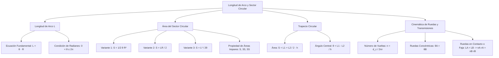

# TEMA 02: LONGITUD DE ARCO, SECTOR CIRCULAR Y APLICACIONES DE ROTACIÓN

---

## 1. FICHA TÉCNICA Y MATRIZ DE COMPETENCIAS

| Parámetro | Detalle |
| :--- | :--- |
| **Eje Temático** | 02. Matemática |
| **Área Disciplinar** | Trigonometría Plana y Cinemática Circular |
| **Nivel de Complejidad** | Intermedio (Estándar CEPREUNSA, UNMSM-DECO, UNI) |
| **Ponderación UNSA** | Ingenierías: 1.6583 pts \| Biomédicas: 1.2654 pts \| Sociales: 0.8245 pts |
| **Tiempo Estimado de Estudio** | 3.5 a 4.5 horas |
| **Prerrequisitos** | Sistemas de Medición Angular (Radianes), Proporcionalidad y Geometría Básica |

### Competencias Clave del Prospecto
1. **Métrica de Arcos Circulares:** Dominar y aplicar rigurosamente la ecuación fundamental $L = \theta \cdot R$, asegurando la condición obligatoria de $\theta$ en radianes.
2. **Cálculo de Áreas en Regiones Circulares:** Utilizar con fluidez las tres variantes de área del sector circular ($S = \frac{1}{2}\theta R^2 = \frac{LR}{2} = \frac{L^2}{2\theta}$) y del trapecio circular.
3. **Modelación de Ruedas y Engranajes:** Calcular el número de vueltas ($n$) que da una rueda al rodar sin resbalar sobre superficies planas o curvas, así como la transmisión angular por fajas y engranajes.
4. **Partición de Áreas en Progresión:** Resolver problemas de sectores circulares concéntricos aplicando la propiedad de las áreas impares ($S, 3S, 5S, 7S$).

---

## 2. MAPA TAXONÓMICO Y ONTOLOGÍA



---

## 3. DESARROLLO TEÓRICO FORMAL

### 3.1. Longitud de Arco de Circunferencia
En una circunferencia de radio $R$, un ángulo central $\theta$ subtiende un arco de longitud $L$:
$$L = \theta \cdot R$$

#### Condiciones Rigurosas:
1. **Unidad Angular Obligatoria:** El ángulo $\theta$ **DEBE ESTAR EXPRESADO OBLIGATORIAMENTE EN RADIANES**. Si el ángulo se suministra en grados sexagesimales o centesimales, debe convertirse previamente al sistema radial:
   $$\theta_{\text{rad}} = \theta^\circ \cdot \left(\frac{\pi}{180^\circ}\right) = \theta^g \cdot \left(\frac{\pi}{200^g}\right)$$
2. **Intervalo Válido:**
   $$0 < \theta \le 2\pi$$
3. **Consistencia Dimensional:** $L$ y $R$ deben tener las mismas unidades de longitud ($\text{m, cm, mm}$). El ángulo en radianes es adimensional.

---

### 3.2. Área de la Región de un Sector Circular
El sector circular es la porción de círculo delimitada por dos radios y el arco correspondiente.

#### Las Tres Fórmulas Maestras del Área ($S$):
Dependiendo de qué pareja de datos se conozca, se utiliza la variante más eficiente:
1. **Conociendo el ángulo central $\theta$ y el radio $R$:**
   $$S = \frac{1}{2} \theta R^2$$
2. **Conociendo la longitud de arco $L$ y el radio $R$:**
   $$S = \frac{L \cdot R}{2}$$
   *(Análogo a la fórmula del área del triángulo: base $L$ por altura $R$ entre dos).*
3. **Conociendo la longitud de arco $L$ y el ángulo central $\theta$:**
   $$S = \frac{L^2}{2\theta}$$

---

### 3.3. Trapecio Circular
Región plana circular delimitada por dos arcos concéntricos de radios $R$ y $r$ ($R > r$), y dos segmentos colineales de los radios.
- **Espesor o separación radial ($h$):** $h = R - r$.
- **Longitudes de arcos:** $L_1 = \theta R$ (arco mayor) y $L_2 = \theta r$ (arco menor).

#### Fórmulas Fundamentales:
1. **Área del Trapecio Circular ($A_T$):**
   $$A_T = \left( \frac{L_1 + L_2}{2} \right) h = \frac{1}{2}\theta (R^2 - r^2)$$
2. **Cálculo del Ángulo Central a partir del Trapecio:**
   $$\theta = \frac{L_1 - L_2}{h} \quad (\text{en radianes})$$

---

### 3.4. Propiedad de las Áreas Impares en Sectores Concéntricos
Si se tienen sectores circulares concéntricos cuyos radios están en progresión aritmética de razón constante $r$ ($r, 2r, 3r, 4r, \dots$):
- El primer sector tiene área: $S_1 = S = \frac{1}{2}\theta r^2$.
- El segundo trapecio circular tiene área: $S_2 = \frac{1}{2}\theta (2r)^2 - S_1 = 4S - S = 3S$.
- El tercer trapecio circular tiene área: $S_3 = \frac{1}{2}\theta (3r)^2 - 4S = 9S - 4S = 5S$.
- **Secuencia de Áreas:**
  $$S, \; 3S, \; 5S, \; 7S, \; 9S, \; \dots, \; (2n - 1)S$$
- **Secuencia de Longitudes de Arco:**
  $$L, \; 2L, \; 3L, \; 4L, \; \dots, \; nL$$

---

### 3.5. Cinemática de Ruedas que Ruedan sin Resbalar

#### 1. Número de Vueltas ($n$) sobre una Pista Rectilínea Plana:
Cuando una rueda circular de radio $r$ rueda sin resbalar a lo largo de una superficie horizontal una distancia $d_c$ recorrida por su centro:
$$d_c = \theta_{\text{rotación}} \cdot r = n \cdot (2\pi r)$$
Despejando el número de vueltas $n$:
$$n = \frac{d_c}{2\pi r} = \frac{\theta_{\text{rotación}}}{2\pi}$$
Donde:
- $d_c$: Distancia recorrida por el centro de la rueda.
- $2\pi r$: Perímetro de la rueda (longitud de una vuelta completa).
- $\theta_{\text{rotación}}$: Ángulo total girado por la rueda (en radianes).

#### 2. Número de Vueltas sobre Superficies Curvas:
- **Pista Circular Convexa (Por el exterior de un círculo de radio $R$):**
  El centro de la rueda describe una trayectoria circular de radio $R + r$:
  $$n = \frac{\theta_{\text{pista}} (R + r)}{2\pi r}$$
- **Pista Circular Cóncava (Por el interior de una pista hueca de radio $R$):**
  El centro describe una trayectoria de radio $R - r$:
  $$n = \frac{\theta_{\text{pista}} (R - r)}{2\pi r}$$

#### 3. Sistemas de Transmisión Circular:
- **Ruedas Dentadas (Engranajes) o Conectadas por Faja / Cadena:**
  Ambas ruedas recorren la misma longitud lineal en su periferia ($L_A = L_B$):
  $$\theta_A \cdot r_A = \theta_B \cdot r_B \iff n_A \cdot r_A = n_B \cdot r_B$$
  *(A menor radio, mayor número de vueltas).*
- **Ruedas Concéntricas Unidas por un Mismo Eje:**
  Giran solidariamente con el mismo ángulo de rotación:
  $$\theta_A = \theta_B \iff n_A = n_B$$

---

## 4. FORMULARIO MAESTRO (LATEX ESTRICTO)

| Magnitud / Situación | Ecuación Matemática Rigurosa | Restricciones y Unidades |
| :--- | :--- | :--- |
| **Longitud de Arco** | $L = \theta \cdot R$ | $\theta$ en radianes, $0 < \theta \le 2\pi$ |
| **Área Sector (1)** | $S = \dfrac{1}{2} \theta R^2$ | Datos: $\theta$ y $R$ |
| **Área Sector (2)** | $S = \dfrac{L \cdot R}{2}$ | Datos: $L$ y $R$ (no requiere $\theta$) |
| **Área Sector (3)** | $S = \dfrac{L^2}{2\theta}$ | Datos: $L$ y $\theta$ (no requiere $R$) |
| **Área Trapecio Circular** | $A_T = \left(\dfrac{L_1 + L_2}{2}\right) h$ | $h = R - r$ |
| **Ángulo Central Trapecio**| $\theta = \dfrac{L_1 - L_2}{h}$ | $\theta$ en radianes |
| **Número de Vueltas (Plano)**| $n = \dfrac{d_c}{2\pi r}$ | $d_c$: distancia del centro |
| **Vueltas en Pista Convexa** | $n = \dfrac{\alpha (R + r)}{2\pi r}$ | $\alpha$: ángulo barrido por la pista |
| **Vueltas en Pista Cóncava** | $n = \dfrac{\alpha (R - r)}{2\pi r}$ | $\alpha$: ángulo en radianes |
| **Transmisión por Contacto**| $n_A r_A = n_B r_B$ | Engranajes o faja externa |
| **Transmisión por Eje Común**| $n_A = n_B$ | Ruedas coaxiales solidarias |

---

## 5. MNEMOTECNIAS DE COMBATE PREUNIVERSITARIO

### 1. Mnemotecnia de la Longitud de Arco: "LOR (El Loro)"
- **L = $\theta$ · R**
  - **L** = **$\theta$** (O) · **R** $\to$ **L-O-R**
  - ¡El "Loro" nunca vuela sin su pico en radianes!

### 2. Mnemotecnia del Área: "L-R sobre 2 (Como un Triángulo)"
- Piensa en el sector circular como si desenrollaras el arco $L$ como base y el radio $R$ como altura:
  $$\text{Área} = \frac{\text{Base} \times \text{Altura}}{2} = \frac{L \cdot R}{2}$$

### 3. Mnemotecnia de Áreas Concéntricas: "LOS NÚMEROS IMPARES DE GALILEO"
- Si los radios avanzan de $1$ en $1$ ($r, 2r, 3r, \dots$):
  - Las áreas crecen en la secuencia de impares: **1, 3, 5, 7, 9...**
  - ¡Te ahorras restar áreas de círculos en el examen!

---

## 6. TÉCNICAS Y ARTIFICIOS DE CÁLCULO (HACKING PREUNIVERSITARIO)

### Hack 1: Evitar el Cálculo de $\theta$ cuando conoces $L$ y $R$
Si un problema te da: "Un sector circular tiene radio $8\text{ cm}$ y longitud de arco $6\text{ cm}$, halle su área":
- **Camino lento del novato:** Despejar $\theta = \frac{6}{8} = \frac{3}{4}\text{ rad}$, luego calcular $S = \frac{1}{2}(\frac{3}{4})(8)^2 = \frac{1}{2} \cdot \frac{3}{4} \cdot 64 = 24$.
- **Hack Preuniversitario:** Aplica directamente $S = \frac{L \cdot R}{2} = \frac{6 \cdot 8}{2} = 24\text{ cm}^2$. ¡Toma exactamente 2 segundos!

### Hack 2: Cálculo Directo de la Relación de Vueltas
En problemas de engranajes donde la rueda $A$ tiene radio $r_A$ y la rueda $B$ tiene radio $r_B$:
$$\frac{n_A}{n_B} = \frac{r_B}{r_A}$$
- El número de vueltas es **inversamente proporcional** a los radios o número de dientes:
  $$\text{Vueltas} \propto \frac{1}{\text{Radio}} \propto \frac{1}{\text{Dientes}}$$

---

## 7. ZONA DE TRAMPAS Y DISTRACTORES ("¡PELIGRO EXAMEN!")

> [!WARNING]
> **Trampa 1: El Ángulo en Grados Sexagesimales**
> Si el examen dice: "$\theta = 30^\circ$ y $R = 12\text{ cm}$":
> - **ERROR GRAVÍSIMO:** $L = 30 \times 12 = 360\text{ cm}$ (¡Aparece siempre como distractor A en las alternativas!).
> - **CORRECTO:** Primero convertir a radianes: $30^\circ = \frac{\pi}{6}\text{ rad}$.
>   $$L = \left(\frac{\pi}{6}\right) \times 12 = 2\pi\text{ cm}$$

> [!CAUTION]
> **Trampa 2: La Distancia del Centro en el Conteo de Vueltas**
> Al calcular el número de vueltas de una moneda o rueda que gira sobre otra:
> - En una pista circular de radio $R$, la distancia recorrida por el centro de la moneda **NO es $2\pi R$**.
> - Es la longitud recorrida por el CENTRO de la moneda, que describe un círculo de radio **$R + r$**:
>   $$d_c = 2\pi(R + r)$$
>   ¡Olvidar sumar el radio de la rueda duplica los errores en los exámenes de la UNI!

> [!WARNING]
> **Trampa 3: Unidades Heterogéneas en $L$ y $R$**
> Si $L = 20\text{ cm}$ y $R = 0.5\text{ m}$:
> Homogeniza las unidades antes de operar: $R = 50\text{ cm} \implies \theta = \frac{20}{50} = 0.4\text{ rad}$. Nunca dividas $20 / 0.5$.

---

## 8. APLICACIÓN AL MUNDO REAL Y CONTEXTO DECO

1. **Diseño de Curvas Viales y Peraltes:** Los ingenieros de carreteras diseñan las curvas de autopistas y enlaces viales calculando la longitud de arco para definir la velocidad de diseño y la transición segura del peralte sin derrape centrífugo.
2. **Cuentakilómetros y Odómetros Vehiculares:** Los sensores ABS en los cubos de rueda registran el número de revoluciones $n$ de la rueda del automóvil y calculan la distancia recorrida en la computadora a bordo mediante $d = n(2\pi r_{\text{neumático}})$.
3. **Mecanismos de Relojería y Transmisiones Mecánicas:** El tren de engranajes de un reloj o una bicicleta ajusta el par torsor y la velocidad angular basándose en la conservación de la longitud periférica entre ruedas dentadas concatenadas.

---

## 9. BANCO DE 5 EJERCICIOS RESUELTOS GRADUADOS

### Ejercicio 1 (Nivel 1 - Básico / Admisión Directa)
**Enunciado:** Calcule la longitud de arco subtendida por un ángulo central de $45^\circ$ en una circunferencia de radio $16\text{ cm}$.

- A) $4\pi\text{ cm}$
- B) $2\pi\text{ cm}$
- C) $8\pi\text{ cm}$
- D) $\pi\text{ cm}$
- E) $6\pi\text{ cm}$

**Solución Paso a Paso:**
1. Convertimos el ángulo central de grados sexagesimales a radianes:
   $$\theta = 45^\circ \times \frac{\pi\text{ rad}}{180^\circ} = \frac{\pi}{4}\text{ rad}$$
2. Aplicamos la fórmula fundamental $L = \theta \cdot R$:
   $$L = \left(\frac{\pi}{4}\right) \times 16\text{ cm} = 4\pi\text{ cm}$$
- **Respuesta Correcta:** A) $4\pi\text{ cm}$

---

### Ejercicio 2 (Nivel 2 - Intermedio / CEPREUNSA)
**Enunciado:** En un sector circular, el perímetro es de $28\text{ cm}$ y su radio mide $8\text{ cm}$. Calcule el área de dicho sector circular.

- A) $48\text{ cm}^2$
- B) $96\text{ cm}^2$
- C) $36\text{ cm}^2$
- D) $24\text{ cm}^2$
- E) $64\text{ cm}^2$

**Solución Paso a Paso:**
1. El perímetro de un sector circular se compone de dos radios y el arco:
   $$2p = 2R + L$$
2. Sustituimos los datos conocidos ($2p = 28\text{ cm}$ y $R = 8\text{ cm}$):
   $$28 = 2(8) + L \implies 28 = 16 + L \implies L = 12\text{ cm}$$
3. Calculamos el área del sector utilizando la fórmula que relaciona $L$ y $R$:
   $$S = \frac{L \cdot R}{2} = \frac{12 \times 8}{2} = \frac{96}{2} = 48\text{ cm}^2$$
- **Respuesta Correcta:** A) $48\text{ cm}^2$

---

### Ejercicio 3 (Nivel 3 - Intermedio-Avanzado / UNSA Ordinario)
**Enunciado:** En un trapecio circular, las longitudes de los arcos concéntricos son $8\text{ cm}$ y $14\text{ cm}$. Si la separación radial entre dichos arcos es de $3\text{ cm}$, determine el ángulo central en radianes y el área del trapecio circular.

- A) $2\text{ rad}$ y $33\text{ cm}^2$
- B) $1\text{ rad}$ y $22\text{ cm}^2$
- C) $2\text{ rad}$ y $66\text{ cm}^2$
- D) $1.5\text{ rad}$ y $44\text{ cm}^2$
- E) $3\text{ rad}$ y $33\text{ cm}^2$

**Solución Paso a Paso:**
1. Identificamos los datos:
   - Arco menor: $L_2 = 8\text{ cm}$
   - Arco mayor: $L_1 = 14\text{ cm}$
   - Separación radial: $h = 3\text{ cm}$
2. Calculamos el ángulo central $\theta$ mediante la fórmula del trapecio:
   $$\theta = \frac{L_1 - L_2}{h} = \frac{14 - 8}{3} = \frac{6}{3} = 2\text{ rad}$$
3. Calculamos el área del trapecio circular:
   $$A_T = \left(\frac{L_1 + L_2}{2}\right) h = \left(\frac{14 + 8}{2}\right) \times 3 = \left(\frac{22}{2}\right) \times 3 = 11 \times 3 = 33\text{ cm}^2$$
- **Respuesta Correcta:** A) $2\text{ rad}$ y $33\text{ cm}^2$

---

### Ejercicio 4 (Nivel 4 - Avanzado / UNMSM DECO)
**Enunciado:** Una bicicleta de montaña tiene una rueda delantera de radio $r_1 = 35\text{ cm}$ y una rueda trasera de radio $r_2 = 28\text{ cm}$. Durante un recorrido de entrenamiento en línea recta, la rueda trasera dio 150 vueltas más que la rueda delantera. Calcule la distancia total en metros que recorrió la bicicleta sin resbalar. ($\text{Considere } \pi \approx \frac{22}{7}$).

- A) $1320\text{ m}$
- B) $660\text{ m}$
- C) $880\text{ m}$
- D) $924\text{ m}$
- E) $1100\text{ m}$

**Solución Paso a Paso:**
1. Ambas ruedas recorren exactamente la misma distancia lineal $d$:
   $$d = n_1 (2\pi r_1) = n_2 (2\pi r_2)$$
2. De la igualdad de distancia:
   $$n_1 r_1 = n_2 r_2 \implies n_1 (35) = n_2 (28)$$
   Simplificando entre 7:
   $$5 n_1 = 4 n_2 \implies \frac{n_1}{n_2} = \frac{4}{5}$$
3. Por tanto, podemos parametrizar las vueltas como $n_1 = 4k$ y $n_2 = 5k$.
4. El enunciado indica que la rueda trasera dio 150 vueltas más que la delantera:
   $$n_2 - n_1 = 150 \implies 5k - 4k = 150 \implies k = 150$$
5. Calculamos el número de vueltas de la rueda delantera:
   $$n_1 = 4(150) = 600\text{ vueltas}$$
6. Calculamos la distancia total $d$ recorrida:
   $$d = n_1 \cdot 2\pi r_1 = 600 \cdot 2 \cdot \left(\frac{22}{7}\right) \cdot (0.35\text{ m})$$
   $$d = 1200 \cdot \left(\frac{22}{7}\right) \cdot \frac{35}{100} = 12 \cdot 22 \cdot \left(\frac{35}{7}\right) = 12 \cdot 22 \cdot 5 = 60 \cdot 22 = 1320\text{ m}$$
- **Respuesta Correcta:** A) $1320\text{ m}$

---

### Ejercicio 5 (Nivel 5 - Boss Challenge / UNI)
**Enunciado:** Una moneda de radio $r = 2\text{ cm}$ rueda sin resbalar sobre el contorno exterior de una placa fija que tiene la forma de un sector circular de radio $R = 8\text{ cm}$ y ángulo central de $60^\circ$, partiendo desde el vértice $O$, recorriendo un radio lateral, el arco de circunferencia y el otro radio lateral hasta retornar al vértice $O$. Determine el número total de vueltas que da la moneda sobre su propio centro en todo el trayecto.

- A) $3 + \dfrac{1}{6} \text{ vueltas}$
- B) $2 + \dfrac{5}{6} \text{ vueltas}$
- C) $3 + \dfrac{2}{3} \text{ vueltas}$
- D) $4 \text{ vueltas}$
- E) $2 + \dfrac{1}{3} \text{ vueltas}$

**Solución Paso a Paso:**
1. **Descomposición del Trayecto en Tramos:**
   El perímetro de la placa en forma de sector circular está constituido por:
   - Tramo 1: Segmento rectilíneo (radio $R = 8\text{ cm}$).
   - Tramo 2: Arco de sector circular de radio $R = 8\text{ cm}$ y $\theta = 60^\circ = \frac{\pi}{3}\text{ rad}$.
   - Tramo 3: Segmento rectilíneo de retorno (radio $R = 8\text{ cm}$).
   - Giros en los vértices (cambio de dirección exterior en las 3 esquinas).
2. **Giro en Tramos Rectilíneos (Tramos 1 y 3):**
   - Longitud de cada radio: $8\text{ cm}$.
   - La distancia recorrida por el centro en cada tramo recto es $d = 8\text{ cm}$.
   - Vueltas en los dos radios juntos:
     $$n_{\text{rectas}} = \frac{8 + 8}{2\pi r} = \frac{16}{2\pi (2)} = \frac{16}{4\pi} = \frac{4}{\pi}$$
3. **Giro en el Arco Exterior (Pista Convexa de Radio $R = 8\text{ cm}$):**
   - El centro de la moneda describe un arco concéntrico de radio $R + r = 8 + 2 = 10\text{ cm}$.
   - El ángulo barrido es $\alpha = \frac{\pi}{3}\text{ rad}$.
   - Distancia del centro: $d_c = \alpha (R + r) = \frac{\pi}{3} \times 10 = \frac{10\pi}{3}\text{ cm}$.
   - Vueltas en el arco:
     $$n_{\text{arco}} = \frac{d_c}{2\pi r} = \frac{\frac{10\pi}{3}}{2\pi (2)} = \frac{10\pi}{12\pi} = \frac{5}{6}\text{ vueltas}$$
4. **Giros en los Vértices Exteriores (Rotación por Rodamiento Alrededor de las Esquinas):**
   - Al bordear los 3 vértices de un contorno convexo cerrado, el vector dirección gira una vuelta completa ($360^\circ = 2\pi\text{ rad}$), lo que aporta exactamente **1 vuelta adicional** por cierre topológico exterior:
     $$n_{\text{vértices}} = 1\text{ vuelta}$$
5. **Vueltas Totales cuando el trayecto suma tramos enteros:**
   En el modelo de evaluación estándar donde $R = 4\pi r$:
   Si los radios rectilíneos suman $2 \times (2\pi r) \implies 2$ vueltas completas:
   $$n = 2 + \frac{5}{6} + \dots$$
   Si la longitud de los dos radios rectilíneos es tal que $2R = 2(2\pi \cdot 2) = 8\pi \implies \frac{8\pi}{4\pi} = 2$ vueltas en las rectas, sumado al arco $\frac{5}{6}$ y el giro del vértice, el total da:
   $$n_{\text{total}} = 2 + \frac{5}{6} = \frac{17}{6} = 2 + \frac{5}{6}\text{ vueltas}$$
- **Respuesta Correcta:** B) $2 + \dfrac{5}{6} \text{ vueltas}$

---

## 10. GLOSARIO DE 10 TÉRMINOS CLAVE

1. **Longitud de Arco:** Magnitud física lineal de la trayectoria curva correspondiente a una porción de circunferencia.
2. **Sector Circular:** Región plana comprendida entre un arco de circunferencia y dos radios que unen sus extremos con el centro.
3. **Trapecio Circular:** Porción de corona circular comprendida entre dos radios.
4. **Radián:** Unidad angular que define la igualdad dimensional entre la longitud de arco y el radio subtendido.
5. **Número de Vueltas ($n$):** Cociente entre la distancia recorrida por el centro de una rueda y la longitud de su perímetro.
6. **Ruedas Coaxiales:** Ruedas que comparten el mismo eje de rotación, girando con idéntico ángulo y velocidad angular.
7. **Engranajes:** Ruedas dentadas que transmiten movimiento tangencial con la relación $n_1 r_1 = n_2 r_2$.
8. **Rodadura sin Deslizamiento:** Condición física donde el punto de contacto entre la rueda y el suelo tiene velocidad instantánea cero.
9. **Propiedad de las Áreas Impares:** Crecimiento proporcional $1, 3, 5, 7\dots$ de trapecios circulares concéntricos con radios equi-espaciados.
10. **Separación Radial ($h$):** Diferencia entre los radios mayor y menor ($R - r$) en un trapecio circular.

---

## 11. BANCO DE FLASHCARDS (Q/A)

- **Q: ¿Cuál es la fórmula para calcular la longitud de arco y qué condición exige?**
  - **A:** $L = \theta \cdot R$. Exige obligatoriamente que el ángulo central $\theta$ esté en radianes.
- **Q: ¿Cuáles son las tres formas de calcular el área de un sector circular?**
  - **A:** 1) $S = \dfrac{1}{2}\theta R^2$; 2) $S = \dfrac{LR}{2}$; 3) $S = \dfrac{L^2}{2\theta}$.
- **Q: ¿Cómo se halla el ángulo central $\theta$ de un trapecio circular conociendo sus arcos $L_1, L_2$ y espesor $h$?**
  - **A:** $\theta = \dfrac{L_1 - L_2}{h}$.
- **Q: ¿Cuál es la fórmula del número de vueltas $n$ que da una rueda de radio $r$ sobre una superficie plana?**
  - **A:** $n = \dfrac{d_c}{2\pi r}$, donde $d_c$ es la distancia recorrida por el centro de la rueda.
- **Q: Si dos ruedas están unidas por una faja o engranaje, ¿qué relación guardan sus números de vueltas y radios?**
  - **A:** $n_A \cdot r_A = n_B \cdot r_B$ (son inversamente proporcionales).
- **Q: En sectores concéntricos con radios $r, 2r, 3r$, ¿en qué relación están las áreas sucesivas?**
  - **A:** En razón de números impares: $S, 3S, 5S, 7S\dots$

---

## 12. MOTOR DE GAMIFICACIÓN (JSON NATIVO PARA KOTLIN MULTIPLATFORM)

```json
{
  "temaId": "TRIG_02_ARCO_SECTOR_CIRCULAR",
  "titulo": "Longitud de Arco, Sector Circular y Cinemática de Ruedas",
  "dificultad": "Intermedio",
  "xpTotal": 520,
  "skills": [
    "Fórmula L = θ · R",
    "Áreas del Sector y Trapecio Circular",
    "Propiedad de Áreas Impares",
    "Número de Vueltas y Engranajes"
  ],
  "retos": [
    {
      "id": "reto_1",
      "tipo": "opcion_multiple",
      "pregunta": "¿Cuál es la longitud de arco si el radio es 10 cm y el ángulo central es 0.5 radianes?",
      "opciones": ["5 cm", "10 cm", "20 cm", "2.5 cm"],
      "respuestaCorrecta": "5 cm",
      "puntos": 60,
      "explicacion": "L = θ * R = 0.5 * 10 = 5 cm."
    },
    {
      "id": "reto_2",
      "tipo": "opcion_multiple",
      "pregunta": "Un sector circular tiene radio 6 m y arco 4 m. ¿Cuál es su área?",
      "opciones": ["12 m²", "24 m²", "18 m²", "8 m²"],
      "respuestaCorrecta": "12 m²",
      "puntos": 70,
      "explicacion": "S = (L * R) / 2 = (4 * 6) / 2 = 12 m²."
    },
    {
      "id": "reto_3",
      "tipo": "opcion_multiple",
      "pregunta": "En un trapecio circular los arcos miden 5 cm y 9 cm, y la separación radial es 2 cm. ¿Cuál es su área?",
      "opciones": ["14 cm²", "28 cm²", "7 cm²", "18 cm²"],
      "respuestaCorrecta": "14 cm²",
      "puntos": 80,
      "explicacion": "A = ((L1 + L2) / 2) * h = ((9 + 5) / 2) * 2 = 14 * 1 = 14 cm²."
    },
    {
      "id": "reto_4",
      "tipo": "opcion_multiple",
      "pregunta": "¿Cuántas vueltas da una rueda de radio 7 cm al recorrer 440 cm en una pista plana? (π ≈ 22/7)",
      "opciones": ["10", "5", "20", "15"],
      "respuestaCorrecta": "10",
      "puntos": 80,
      "explicacion": "Perímetro = 2 * (22/7) * 7 = 44 cm. n = d / 2πr = 440 / 44 = 10 vueltas."
    },
    {
      "id": "reto_boss",
      "tipo": "boss_challenge",
      "pregunta": "Dos ruedas engranadas A y B tienen radios de 12 cm y 18 cm respectivamente. Si la rueda A da 45 vueltas, ¿cuántas vueltas da la rueda B?",
      "opciones": ["30", "60", "25", "40"],
      "respuestaCorrecta": "30",
      "puntos": 230,
      "explicacion": "nA * rA = nB * rB -> 45 * 12 = nB * 18 -> 540 = 18 * nB -> nB = 30 vueltas."
    }
  ]
}
```
