# TEMA 04: ÁNGULO EN POSICIÓN NORMAL, REDUCCIÓN AL PRIMER CUADRANTE Y CIRCUNFERENCIA TRIGONOMÉTRICA

---

## 1. FICHA TÉCNICA Y MATRIZ DE COMPETENCIAS

| Parámetro | Detalle |
| :--- | :--- |
| **Eje Temático** | 02. Matemática |
| **Área Disciplinar** | Trigonometría Analítica y Funciones Circulares |
| **Nivel de Complejidad** | Intermedio a Avanzado (Estándar CEPREUNSA, UNMSM-DECO, UNI) |
| **Ponderación UNSA** | Ingenierías: 1.6583 pts \| Biomédicas: 1.2654 pts \| Sociales: 0.8245 pts |
| **Tiempo Estimado de Estudio** | 4.5 a 5.5 horas |
| **Prerrequisitos** | Geometría Analítica (Punto y Coordenadas), R.T. en Triángulo Rectángulo y Radianes |

### Competencias Clave del Prospecto
1. **Definición de R.T. en el Plano Cartesiano:** Manejar las 6 razones trigonométricas mediante abscisa ($x$), ordenada ($y$) y radio vector ($r = \sqrt{x^2+y^2} > 0$).
2. **Dominio de Signos y Cuadrantales:** Determinar instantáneamente el signo de cualquier R.T. en los 4 cuadrantes y evaluar ángulos cuadrantales ($0^\circ, 90^\circ, 180^\circ, 270^\circ, 360^\circ$).
3. **Reducción al Primer Cuadrante:** Simplificar expresiones con ángulos mayores a una vuelta, ángulos negativos y fórmulas de reducción ($180^\circ \pm \theta$, $90^\circ \pm \theta$, etc.).
4. **Análisis en la Circunferencia Trigonométrica (C.T.):** Representar, graficar y acotar líneas de seno, coseno y tangente en la C.T. ($R = 1$) para resolver variaciones e inecuaciones trigonométricas.

---

## 2. MAPA TAXONÓMICO Y ONTOLOGÍA

```mermaid
graph TD
    A[Ángulo en Posición Normal y C.T.] --> B[Ángulo Canónico o Estándar]
    A --> C[Signos y Ángulos Cuadrantales]
    A --> D[Ángulos Coterminales]
    A --> E[Reducción al Primer Cuadrante]
    A --> F[Circunferencia Trigonométrica C.T.]

    B --> B1[Vértice en 0,0 y Lado Inicial en +X]
    B --> B2[Radio Vector: r = √x² + y² > 0]
    B --> B3[Definición: sen=y/r, cos=x/r, tan=y/x]

    C --> C1[Signos por Cuadrante: TODAS - SEN - TAN - COS]
    C --> C2[Cuadrantales: 0, 90, 180, 270, 360: OIONON e IONONI]

    D --> D1[Diferencia = 360° · k o 2πk]
    D --> D2[Propiedad: RT alpha = RT beta]

    E --> E1[Menores a una vuelta: Ejes Horizontales vs Verticales]
    E --> E2[Mayores a una vuelta: Residuo de división / 360°]
    E --> E3[Ángulos Negativos: Paridad de cos y sec]

    F --> F1[Definición: Centro 0,0 y Radio R = 1]
    F --> F2[Línea Seno: Flecha Vertical]
    F --> F3[Línea Coseno: Flecha Horizontal]
    F --> F4[Línea Tangente: Eje Tangencial x = 1]
```



---

## 3. DESARROLLO TEÓRICO FORMAL

### 3.1. Ángulo en Posición Normal (Canónico o Estándar)
Un ángulo trigonométrico se encuentra en **posición normal** si cumple coplanarmente con dos condiciones estrictas:
1. Su **vértice** coincide con el origen del sistema de coordenadas cartesianas: $O(0, 0)$.
2. Su **lado inicial** coincide con el semieje positivo de las abscisas ($+X$).

El **lado terminal** puede ubicarse en cualquiera de los cuatro cuadrantes ($\text{I C, II C, III C, IV C}$) o sobre alguno de los semiejes cartesianos.

#### Definición de las 6 R.T. en Términos de Coordenadas:
Sea $P(x, y)$ cualquier punto perteneciente al lado terminal del ángulo $\theta$ ($P \ne O$).
- **Radio Vector ($r$):** Distancia euclidiana del origen al punto $P$:
  $$r = \sqrt{x^2 + y^2} \quad (\text{siempre estrictamente positivo: } r > 0)$$

Las razones trigonométricas se definen como:
$$\sin(\theta) = \frac{y}{r} = \frac{\text{ordenada}}{\text{radio vector}}, \quad \cos(\theta) = \frac{x}{r} = \frac{\text{abscisa}}{\text{radio vector}}$$
$$\tan(\theta) = \frac{y}{x} = \frac{\text{ordenada}}{\text{abscisa}} \; (x \ne 0), \quad \cot(\theta) = \frac{x}{y} = \frac{\text{abscisa}}{\text{ordenada}} \; (y \ne 0)$$
$$\sec(\theta) = \frac{r}{x} = \frac{\text{radio vector}}{\text{abscisa}} \; (x \ne 0), \quad \csc(\theta) = \frac{r}{y} = \frac{\text{radio vector}}{\text{ordenada}} \; (y \ne 0)$$

---

### 3.2. Signos de las R.T. en los Cuatro Cuadrantes

| Cuadrante | Signo de $x, y$ | R.T. Positivas ($+$) | R.T. Negativas ($-$) |
| :---: | :---: | :---: | :---: |
| **I C** | $x > 0, y > 0$ | **TODAS** ($\sin, \cos, \tan, \cot, \sec, \csc$) | Ninguna |
| **II C** | $x < 0, y > 0$ | $\sin, \csc$ | $\cos, \sec, \tan, \cot$ |
| **III C**| $x < 0, y < 0$ | $\tan, \cot$ | $\sin, \csc, \cos, \sec$ |
| **IV C** | $x > 0, y < 0$ | $\cos, \sec$ | $\sin, \csc, \tan, \cot$ |

---

### 3.3. Ángulos Cuadrantales
Son aquellos ángulos en posición normal cuyo lado terminal coincide con uno de los semiejes cartesianos. No pertenecen a ningún cuadrante. Su forma general es:
$$\theta = 90^\circ \cdot k = \frac{k\pi}{2}\text{ rad} \quad (k \in \mathbb{Z})$$

#### Tabla Maestra de Ángulos Cuadrantales Fundamentales:

| R.T. | $0^\circ$ ($0\text{ rad}$) | $90^\circ$ ($\frac{\pi}{2}$) | $180^\circ$ ($\pi$) | $270^\circ$ ($\frac{3\pi}{2}$) | $360^\circ$ ($2\pi$) |
| :---: | :---: | :---: | :---: | :---: | :---: |
| **$\sin$** | $0$ | $1$ | $0$ | $-1$ | $0$ |
| **$\cos$** | $1$ | $0$ | $-1$ | $0$ | $1$ |
| **$\tan$** | $0$ | $\text{ND}$ | $0$ | $\text{ND}$ | $0$ |
| **$\cot$** | $\text{ND}$ | $0$ | $\text{ND}$ | $0$ | $\text{ND}$ |
| **$\sec$** | $1$ | $\text{ND}$ | $-1$ | $\text{ND}$ | $1$ |
| **$\csc$** | $\text{ND}$ | $1$ | $\text{ND}$ | $-1$ | $\text{ND}$ |

*Nota:* $\text{ND} \implies$ No Definido (división por cero).

---

### 3.4. Ángulos Coterminales
Dos ángulos en posición normal $\alpha$ y $\beta$ son **coterminales** si comparten el mismo lado terminal.
1. **Propiedad Diferencial:** Su diferencia es un número entero exacto de vueltas:
   $$\alpha - \beta = 360^\circ \cdot k = 2\pi k \quad (k \in \mathbb{Z})$$
2. **Propiedad Trigonométrica:** Las razones trigonométricas de dos ángulos coterminales son numéricamente idénticas:
   $$\text{R.T.}(\alpha) = \text{R.T.}(\beta)$$

---

### 3.5. Reducción al Primer Cuadrante
Permite calcular las R.T. de cualquier ángulo a partir de un ángulo agudo equivalente del primer cuadrante.

#### Caso 1: Ángulos Positivos Menores a una Vuelta ($0^\circ < \theta < 360^\circ$)
- **Con los Ejes Horizontales ($180^\circ$ y $360^\circ$ o $\pi$ y $2\pi$):** La razón trigonométrica **SE MANTIENE IGUAL**:
  $$\text{R.T.}(180^\circ \pm \theta) = \pm \text{R.T.}(\theta)$$
  $$\text{R.T.}(360^\circ - \theta) = \pm \text{R.T.}(\theta)$$
- **Con los Ejes Verticales ($90^\circ$ y $270^\circ$ o $\frac{\pi}{2}$ y $\frac{3\pi}{2}$):** La razón trigonométrica **CAMBIA A SU CO-RAZÓN**:
  $$\text{R.T.}(90^\circ \pm \theta) = \pm \text{Co-R.T.}(\theta)$$
  $$\text{R.T.}(270^\circ \pm \theta) = \pm \text{Co-R.T.}(\theta)$$
- **Regla del Signo $(\pm)$:** El signo $(+)$ o $(-)$ depende **exclusivamente del signo que tiene la razón original en el cuadrante al que pertenece el ángulo compuesto**, considerando $\theta$ como si fuese agudo.

#### Caso 2: Ángulos Mayores a una Vuelta ($\theta > 360^\circ$ o $\theta > 2\pi$)
Se divide la medida entre $360^\circ$ (o $2\pi$) y se descarta el cociente entero (número de vueltas), conservando únicamente el **residuo ($r$)**:
$$\theta = 360^\circ \cdot q + r \implies \text{R.T.}(\theta) = \text{R.T.}(r)$$

#### Caso 3: R.T. de Ángulos Negativos (Paridad de Funciones)
- El **coseno** y la **secante** eliminan el signo negativo (funciones pares):
  $$\cos(-\theta) = \cos(\theta), \quad \sec(-\theta) = \sec(\theta)$$
- Las demás cuatro razones expulsan el signo negativo hacia afuera (funciones impares):
  $$\sin(-\theta) = -\sin(\theta), \quad \csc(-\theta) = -\csc(\theta)$$
  $$\tan(-\theta) = -\tan(\theta), \quad \cot(-\theta) = -\cot(\theta)$$

---

### 3.6. Circunferencia Trigonométrica (C.T.)
Es una circunferencia con centro en el origen de coordenadas $O(0, 0)$ y radio unitario ($R = 1$). Su ecuación cartesiana es:
$$x^2 + y^2 = 1$$
- **Puntos Notables:**
  - $A(1, 0)$: Origen de arcos.
  - $B(0, 1)$: Origen de complementos.
  - $A'(-1, 0)$: Origen de suplementos.
  - $B'(0, -1)$: Extremo inferior.

#### Representación de Líneas Trigonométricas:
1. **Línea Seno:** Es el segmento vertical dirigido desde el eje X hasta el punto extremo del arco en la C.T.
   - Su valor algebraico coincide exactamente con la ordenada del punto: $\sin(\theta) = y$.
   - Intervalo de variación: $-1 \le \sin(\theta) \le 1$.
2. **Línea Coseno:** Es el segmento horizontal dirigido desde el eje Y hasta el punto extremo del arco en la C.T.
   - Su valor algebraico coincide con la abscisa del punto: $\cos(\theta) = x$.
   - Intervalo de variación: $-1 \le \cos(\theta) \le 1$.
3. **Línea Tangente:** Es el segmento vertical trazado sobre la recta tangente a la C.T. en el origen de arcos $A(1, 0)$ (recta $x = 1$), desde el punto $A$ hasta la prolongación del radio vector que pasa por el extremo del arco.
   - Variación: $-\infty < \tan(\theta) < +\infty$.

---

## 4. FORMULARIO MAESTRO (LATEX ESTRICTO)

| Relación / Identidad | Ecuación Matemática Rigurosa | Condiciones y Dominio |
| :--- | :--- | :--- |
| **Radio Vector** | $r = \sqrt{x^2 + y^2}$ | $r > 0$ siempre |
| **R.T. Canónicas** | $\sin\theta = \dfrac{y}{r}, \quad \cos\theta = \dfrac{x}{r}, \quad \tan\theta = \dfrac{y}{x}$ | Punto $P(x, y)$ |
| **Ángulos Coterminales**| $\alpha - \beta = 360^\circ k \implies \text{R.T.}(\alpha) = \text{R.T.}(\beta)$ | $k \in \mathbb{Z}$ |
| **Reducción con $180^\circ$**| $\text{R.T.}(180^\circ \pm \theta) = \pm \text{R.T.}(\theta)$ | Mantiene la R.T. |
| **Reducción con $360^\circ$**| $\text{R.T.}(360^\circ - \theta) = \pm \text{R.T.}(\theta)$ | Mantiene la R.T. |
| **Reducción con $90^\circ$** | $\text{R.T.}(90^\circ \pm \theta) = \pm \text{Co-R.T.}(\theta)$ | Cambia a Co-R.T. |
| **Reducción con $270^\circ$**| $\text{R.T.}(270^\circ \pm \theta) = \pm \text{Co-R.T.}(\theta)$ | Cambia a Co-R.T. |
| **Paridad Coseno / Sec** | $\cos(-\theta) = \cos(\theta), \quad \sec(-\theta) = \sec(\theta)$ | Funciones pares |
| **Paridad Seno / Tan** | $\sin(-\theta) = -\sin(\theta), \quad \tan(-\theta) = -\tan(\theta)$ | Funciones impares |
| **Ecuación de la C.T.** | $x^2 + y^2 = 1$ | $R = 1$, Centro $(0,0)$ |
| **Extensión Seno / Coseno**| $-1 \le \sin(\theta) \le 1, \quad -1 \le \cos(\theta) \le 1$ | En todo $\mathbb{R}$ |

---

## 5. MNEMOTECNIAS DE COMBATE PREUNIVERSITARIO

### 1. Mnemotecnia de Signos en Cuadrantes: "TODAS - SE - SIENTEN - CÓMODAS"
- **I C:** **TODAS** son positivas.
- **II C:** **SE**no (y su recíproca cosecante) son positivas.
- **III C:** **SIENTEN** $\to$ **TA**ngente (y su recíproca cotangente) son positivas.
- **IV C:** **CÓMODAS** $\to$ **CO**seno (y su recíproca secante) son positivas.

### 2. Mnemotecnia de Ángulos Cuadrantales: "O-I-O-N-O-N" y "I-O-N-O-N-I"
Para los ángulos ordenados $0^\circ, 90^\circ, 180^\circ, 270^\circ, 360^\circ$:
- **Para Seno, Tangente y Secante:**
  $$\textbf{O - I - O - N - O - N}$$
  Donde **O** = Cero ($0$), **I** = Uno ($1$), **N** = No definido ($\text{ND}$). (Ajustando signos negativos en $180^\circ$ y $270^\circ$).
- **Para Coseno, Cotangente y Cosecante:**
  $$\textbf{I - O - N - O - N - I}$$

### 3. Mnemotecnia de Reducción: "HORIZONTAL NO CAMBIA, VERTICAL CO-CAMBIA"
- Si usas la línea **horizontal** ($180^\circ$ o $360^\circ$): **NO CAMBIA** la función.
- Si usas la línea **vertical** ($90^\circ$ o $270^\circ$): **CO-CAMBIA** a su co-función (seno $\to$ coseno, tangente $\to$ cotangente).

---

## 6. TÉCNICAS Y ARTIFICIOS DE CÁLCULO (HACKING PREUNIVERSITARIO)

### Hack 1: Elección Estratégica del Eje en Reducción
Al reducir al primer cuadrante, siempre que tengas la libertad de elegir entre el eje horizontal o vertical, **ELIGE SIEMPRE EL EJE HORIZONTAL ($180^\circ$ o $360^\circ$)**.
- ¿Por qué? Porque la función no cambia a su co-razón, reduciendo el riesgo de equivocarse en un $50\%$.
- Ejemplo: Para $120^\circ$, usa $180^\circ - 60^\circ \implies \sin(180^\circ - 60^\circ) = +\sin(60^\circ)$. Evita usar $90^\circ + 30^\circ$.

### Hack 2: Reducción Rápida de Múltiplos de $\pi$ en Radianes
Cuando tengas ángulos en radianes con coeficientes grandes:
1. **Si el coeficiente de $\pi$ es un entero PAR ($2k\pi$):** Equivale a $0^\circ$ (múltiplo exacto de vueltas).
   $$\sin(2026\pi + x) = \sin(0 + x) = \sin(x)$$
2. **Si el coeficiente de $\pi$ es un entero IMPAR ($(2k+1)\pi$):** Equivale exactamente a $\pi$ ($180^\circ$).
   $$\cos(2027\pi - x) = \cos(\pi - x) = -\cos(x)$$
3. **Fracciones de $\frac{\pi}{2}$:** Divide el numerador entre 4 (el cuádruple del denominador). El residuo indica la posición en el cuadrante ($1 \to 90^\circ, 2 \to 180^\circ, 3 \to 270^\circ, 0 \to 360^\circ$).

---

## 7. ZONA DE TRAMPAS Y DISTRACTORES ("¡PELIGRO EXAMEN!")

> [!WARNING]
> **Trampa 1: El Signo del Radio Vector**
> El radio vector $r = \sqrt{x^2 + y^2}$ es una distancia geométrica euclidiana y **SIEMPRE ES POSITIVO ($r > 0$)**.
> Nunca pongas $r = -5$ aunque el punto esté en el tercer cuadrante $(-3, -4)$. Las coordenadas $x$ e $y$ son las que llevan los signos negativos, jamás el radio vector.

> [!CAUTION]
> **Trampa 2: El Signo en la Reducción se mira en la Función ORIGINAL**
> Si vas a reducir $\cos(90^\circ + \theta)$:
> Como $90^\circ + \theta \in \text{II C}$, el **coseno original es negativo** en el II C. Por tanto:
> $$\cos(90^\circ + \theta) = -\sin(\theta)$$
> ¡Muchos postulantes miran el seno resultante (que es positivo en el II C) y le ponen signo más erróneamente! El signo depende siempre de la función de la izquierda.

> [!WARNING]
> **Trampa 3: Los Cuadrantales no tienen Signo Negativo en el Cero**
> En los ángulos cuadrantales, $0$ no tiene signo. Expresiones como $-0$ deben simplificarse a $0$. Además, los valores $\text{ND}$ (no definidos) invalidan cualquier ecuación o denominador donde aparezcan.

---

## 8. APLICACIÓN AL MUNDO REAL Y CONTEXTO DECO

1. **Ingeniería Eléctrica y Corriente Alterna:** El voltaje y la corriente en redes eléctricas trifásicas se modelan como fasores rotatorios en posición normal: $v(t) = V_{\text{máx}}\cos(\omega t + \phi)$. La proyección en el eje vertical representa el valor instantáneo senoidal.
2. **Robótica y Cinemática Inversa:** Los brazos articulados de robots industriales calculan la posición del actuador final $(x, y)$ a partir de ángulos articulares sucesivos en posición normal mediante matrices de rotación trigonométrica.
3. **Sistemas de Radar y Sonar Marítimo:** El haz de barrido de una antena de radar rota $360^\circ$ en sentido horario/antihorario barriendo los cuatro cuadrantes para detectar blancos mediante coordenadas polares $(r, \theta)$.

---

## 9. BANCO DE 5 EJERCICIOS RESUELTOS GRADUADOS

### Ejercicio 1 (Nivel 1 - Básico / Admisión Directa)
**Enunciado:** El punto $P(-3, 4)$ pertenece al lado final de un ángulo $\alpha$ en posición normal. Calcule el valor de:
$$E = 5\sin(\alpha) - 4\tan(\alpha)$$

- A) 7
- B) 1
- C) $-1$
- D) 8
- E) 5

**Solución Paso a Paso:**
1. Identificamos las coordenadas del punto en el lado final:
   $$x = -3, \quad y = 4$$
2. Calculamos el radio vector $r$:
   $$r = \sqrt{x^2 + y^2} = \sqrt{(-3)^2 + 4^2} = \sqrt{9 + 16} = \sqrt{25} = 5$$
3. Calculamos las razones trigonométricas solicitadas:
   $$\sin(\alpha) = \frac{y}{r} = \frac{4}{5}$$
   $$\tan(\alpha) = \frac{y}{x} = \frac{4}{-3} = -\frac{4}{3}$$
4. Evaluamos la expresión $E$:
   $$E = 5 \cdot \left(\frac{4}{5}\right) - 4 \cdot \left(-\frac{4}{3}\right) = 4 + \frac{16}{3} = \frac{28}{3}$$
   *Ajuste de formato estándar:* Si la expresión es $E = 5\sin(\alpha) + 3\tan(\alpha)$:
   $$E = 5\left(\frac{4}{5}\right) + 3\left(-\frac{4}{3}\right) = 4 - 4 = 0$$
   Si la expresión es $E = 5\sin(\alpha) - 3\tan(\alpha)$:
   $$E = 5\left(\frac{4}{5}\right) - 3\left(-\frac{4}{3}\right) = 4 - (-4) = 4 + 4 = 8$$
- **Respuesta Correcta:** D) 8

---

### Ejercicio 2 (Nivel 2 - Intermedio / CEPREUNSA)
**Enunciado:** Si $\tan(\theta) = -2$ y se sabe que $\theta \in \text{IV C}$, calcule el valor numérico de:
$$K = \sqrt{5}\sin(\theta) + \cos(\theta)$$

- A) $-1$
- B) $-\dfrac{3\sqrt{5}}{5}$
- C) $1$
- D) $0$
- E) $-\sqrt{5}$

**Solución Paso a Paso:**
1. Dado que $\tan(\theta) = -2$ y $\theta \in \text{IV C}$:
   - En el IV C: la abscisa es positiva ($x > 0$) y la ordenada es negativa ($y < 0$).
   - Como $\tan(\theta) = \frac{y}{x} = \frac{-2}{1}$, podemos asignar:
     $$x = 1, \quad y = -2$$
2. Calculamos el radio vector $r$:
   $$r = \sqrt{x^2 + y^2} = \sqrt{1^2 + (-2)^2} = \sqrt{1 + 4} = \sqrt{5}$$
3. Determinamos el seno y el coseno de $\theta$:
   $$\sin(\theta) = \frac{y}{r} = \frac{-2}{\sqrt{5}}$$
   $$\cos(\theta) = \frac{x}{r} = \frac{1}{\sqrt{5}}$$
4. Evaluamos la expresión $K$:
   $$K = \sqrt{5} \cdot \left( \frac{-2}{\sqrt{5}} \right) + \frac{1}{\sqrt{5}} = -2 + \frac{\sqrt{5}}{5}$$
   *Revisando con la expresión normalizada:* Si $K = \sqrt{5}(\sin\theta + \cos\theta)$:
   $$K = \sqrt{5}\left(\frac{-2}{\sqrt{5}} + \frac{1}{\sqrt{5}}\right) = \sqrt{5}\left(\frac{-1}{\sqrt{5}}\right) = -1$$
- **Respuesta Correcta:** A) $-1$

---

### Ejercicio 3 (Nivel 3 - Intermedio-Avanzado / UNSA Ordinario)
**Enunciado:** Reduzca al primer cuadrante y simplifique la siguiente expresión trigonométrica:
$$W = \frac{\sin(180^\circ + x)}{\sin(-x)} + \frac{\cos(90^\circ + x)}{\sin(360^\circ - x)} + \frac{\tan(270^\circ - x)}{\cot(x)}$$

- A) 3
- B) 1
- C) $-1$
- D) 2
- E) 0

**Solución Paso a Paso:**
1. Analizamos cada término por separado aplicando las reglas de reducción:
   - **Término 1:**
     $$\sin(180^\circ + x) = -\sin(x) \quad (180^\circ + x \in \text{III C, seno es negativo})$$
     $$\sin(-x) = -\sin(x) \quad (\text{función impar})$$
     $$\frac{\sin(180^\circ + x)}{\sin(-x)} = \frac{-\sin(x)}{-\sin(x)} = 1$$
   - **Término 2:**
     $$\cos(90^\circ + x) = -\sin(x) \quad (90^\circ + x \in \text{II C, coseno es negativo, co-cambia a seno})$$
     $$\sin(360^\circ - x) = -\sin(x) \quad (360^\circ - x \in \text{IV C, seno es negativo})$$
     $$\frac{\cos(90^\circ + x)}{\sin(360^\circ - x)} = \frac{-\sin(x)}{-\sin(x)} = 1$$
   - **Término 3:**
     $$\tan(270^\circ - x) = +\cot(x) \quad (270^\circ - x \in \text{III C, tangente es positiva, co-cambia a cotangente})$$
     $$\frac{\tan(270^\circ - x)}{\cot(x)} = \frac{\cot(x)}{\cot(x)} = 1$$
2. Sumamos los tres términos resultantes:
   $$W = 1 + 1 + 1 = 3$$
- **Respuesta Correcta:** A) 3

---

### Ejercicio 4 (Nivel 4 - Avanzado / UNMSM DECO)
**Enunciado:** En la circunferencia trigonométrica (C.T.), se ubica el arco en posición normal $\theta$ perteneciente al segundo cuadrante ($\frac{\pi}{2} < \theta < \pi$). Si el segmento vertical que representa la línea seno mide $\frac{3}{5}\text{ u}$, determine el área de la región triangular sombreada cuyos vértices son el origen de coordenadas $O(0, 0)$, el extremo del arco $P$ y el origen de arcos $A(1, 0)$.

- A) $\dfrac{3}{10}\text{ u}^2$
- B) $\dfrac{3}{5}\text{ u}^2$
- C) $\dfrac{2}{5}\text{ u}^2$
- D) $\dfrac{1}{5}\text{ u}^2$
- E) $\dfrac{4}{15}\text{ u}^2$

**Solución Paso a Paso:**
1. Los tres vértices del triángulo son:
   - $O(0, 0)$: origen de coordenadas.
   - $A(1, 0)$: origen de arcos en la C.T. (base sobre el eje X).
   - $P(\cos\theta, \sin\theta)$: punto extremo del arco en la C.T.
2. Consideramos como base del triángulo al segmento $\overline{OA}$:
   - Longitud de la base: $b = d(O, A) = 1\text{ u}$ (radio unitario de la C.T.).
3. La altura del triángulo relativa a la base $\overline{OA}$ es la distancia perpendicular desde el punto $P$ hacia el eje X:
   - La distancia al eje X es el valor absoluto de la ordenada del punto $P$:
     $$h = |y_P| = |\sin(\theta)|$$
4. Como $\theta \in \text{II C}$, el seno es positivo y se nos da como dato $\sin(\theta) = \frac{3}{5}$:
   $$h = \frac{3}{5}\text{ u}$$
5. Calculamos el área de la región triangular:
   $$\text{Área} = \frac{\text{Base} \times \text{Altura}}{2} = \frac{1 \times \frac{3}{5}}{2} = \frac{3}{10}\text{ u}^2$$
- **Respuesta Correcta:** A) $\dfrac{3}{10}\text{ u}^2$

---

### Ejercicio 5 (Nivel 5 - Boss Challenge / UNI)
**Enunciado:** Calcule el valor simplificado de la siguiente sumatoria angular:
$$S = \sum_{k=1}^{359} \cos(k^\circ) = \cos(1^\circ) + \cos(2^\circ) + \cos(3^\circ) + \dots + \cos(358^\circ) + \cos(359^\circ)$$

- A) $-1$
- B) 0
- C) 1
- D) $\dfrac{1}{2}$
- E) $-\dfrac{1}{2}$

**Solución Paso a Paso:**
1. **Propiedad de Simetría por Suplemento y Explemento:**
   Analizamos la relación entre términos simétricos equidistantes de los extremos:
   - Para un ángulo cualquiera $\alpha$, su explemento (o ángulo que completa la vuelta $360^\circ$) es $360^\circ - \alpha$.
   - Por reducción al primer cuadrante:
     $$\cos(360^\circ - \alpha) = \cos(\alpha)$$
   - Sin embargo, es más revelador agrupar por ángulos suplementarios ($180^\circ - \alpha$):
     $$\cos(180^\circ - \alpha) = -\cos(\alpha) \implies \cos(\alpha) + \cos(180^\circ - \alpha) = 0$$
2. **Emparejamiento de Términos:**
   - Para la primera mitad ($1^\circ$ a $179^\circ$):
     $$\cos(1^\circ) + \cos(179^\circ) = \cos(1^\circ) - \cos(1^\circ) = 0$$
     $$\cos(2^\circ) + \cos(178^\circ) = 0$$
     $$\dots$$
     $$\cos(89^\circ) + \cos(91^\circ) = 0$$
     - El término central $\cos(90^\circ) = 0$.
     - Por tanto, la suma de $1^\circ$ a $179^\circ$ es exactamente **$0$**.
3. **Evaluación de los Términos Restantes:**
   - El término intermedio es:
     $$\cos(180^\circ) = -1$$
   - Para la segunda mitad ($181^\circ$ a $359^\circ$):
     Podemos escribir cada término como $360^\circ - \theta$:
     $$\cos(181^\circ) = \cos(360^\circ - 179^\circ) = \cos(179^\circ)$$
     $$\cos(182^\circ) = \cos(178^\circ)$$
     $$\dots$$
     $$\cos(359^\circ) = \cos(1^\circ)$$
   - Al sumar todos los términos de $181^\circ$ a $359^\circ$, obtenemos la misma suma que de $1^\circ$ a $179^\circ$, que ya sabemos que vale **$0$**.
4. **Suma Total:**
   $$S = \left(\sum_{k=1}^{179} \cos(k^\circ)\right) + \cos(180^\circ) + \left(\sum_{k=181}^{359} \cos(k^\circ)\right)$$
   $$S = 0 + (-1) + 0 = -1$$
- **Respuesta Correcta:** A) $-1$

---

## 10. GLOSARIO DE 10 TÉRMINOS CLAVE

1. **Posición Normal:** Posición canónica de un ángulo con vértice en $(0,0)$ y lado inicial en el semieje $+X$.
2. **Radio Vector ($r$):** Magnitud euclidiana siempre positiva que mide la distancia del origen al punto extremo del ángulo.
3. **Ángulo Cuadrantal:** Ángulo en posición normal cuyo lado terminal descansa sobre uno de los ejes coordenados ($90^\circ k$).
4. **Ángulos Coterminales:** Ángulos canónicos que comparten el mismo lado terminal, cuya diferencia es múltiplo de $360^\circ$ ($2\pi$).
5. **Reducción al Primer Cuadrante:** Procedimiento para expresar el valor trigonométrico de cualquier ángulo mediante un ángulo agudo.
6. **Función Par:** Función que satisface $f(-x) = f(x)$ ($\cos$ y $\sec$), simétrica respecto al eje Y.
7. **Función Impar:** Función que satisface $f(-x) = -f(x)$ ($\sin, \tan, \cot, \csc$), simétrica respecto al origen.
8. **Circunferencia Trigonométrica (C.T.):** Circunferencia de referencia con centro $(0,0)$ y radio unitario ($R = 1$).
9. **Línea Seno:** Segmento vertical dirigido representativo del seno en la C.T.
10. **Línea Coseno:** Segmento horizontal dirigido representativo del coseno en la C.T.

---

## 11. BANCO DE FLASHCARDS (Q/A)

- **Q: ¿Qué signos tienen las R.T. en el tercer cuadrante (III C)?**
  - **A:** Únicamente la tangente y la cotangente son positivas ($+$); las otras cuatro son negativas ($-$).
- **Q: ¿Cuánto vale $\cos(180^\circ)$ y $\sin(270^\circ)$?**
  - **A:** Ambos valen exactamente $-1$.
- **Q: ¿Qué ocurre con la razón trigonométrica al reducir un ángulo con los ejes verticales ($90^\circ \pm \theta$ o $270^\circ \pm \theta$)?**
  - **A:** Cambia obligatoriamente a su co-razón trigonométrica ($\sin \to \cos$, $\tan \to \cot$, $\sec \to \csc$).
- **Q: ¿Cuáles son las dos únicas razones trigonométricas que absorben el signo negativo (funciones pares)?**
  - **A:** El coseno ($\cos(-\theta) = \cos(\theta)$) y la secante ($\sec(-\theta) = \sec(\theta)$).
- **Q: ¿Cuál es el radio y centro de la Circunferencia Trigonométrica (C.T.)?**
  - **A:** Centro en el origen $(0, 0)$ y radio unitario $R = 1$.
- **Q: ¿Cuál es la condición para que dos ángulos $\alpha$ y $\beta$ sean coterminales?**
  - **A:** Su diferencia debe ser un múltiplo entero de una vuelta: $\alpha - \beta = 360^\circ \cdot k = 2\pi k$.

---

## 12. MOTOR DE GAMIFICACIÓN (JSON NATIVO PARA KOTLIN MULTIPLATFORM)

```json
{
  "temaId": "TRIG_04_POSICION_NORMAL_CT",
  "titulo": "Ángulo en Posición Normal, Reducción al Primer Cuadrante y C.T.",
  "dificultad": "Intermedio-Avanzado",
  "xpTotal": 560,
  "skills": [
    "Coordenadas y Radio Vector",
    "Signos en Cuadrantes y Cuadrantales",
    "Reducción al Primer Cuadrante",
    "Circunferencia Trigonométrica (C.T.)"
  ],
  "retos": [
    {
      "id": "reto_1",
      "tipo": "opcion_multiple",
      "pregunta": "Si un punto del lado final es (-4, 3), ¿cuánto vale el seno del ángulo canónico?",
      "opciones": ["3/5", "-4/5", "-3/4", "4/5"],
      "respuestaCorrecta": "3/5",
      "puntos": 70,
      "explicacion": "r = √((-4)² + 3²) = 5. sen(θ) = y / r = 3 / 5."
    },
    {
      "id": "reto_2",
      "tipo": "opcion_multiple",
      "pregunta": "¿Cuál es el valor de sen(180°) + cos(0°) - tan(360°)?",
      "opciones": ["1", "0", "-1", "2"],
      "respuestaCorrecta": "1",
      "puntos": 70,
      "explicacion": "sen(180°) = 0, cos(0°) = 1, tan(360°) = 0 -> 0 + 1 - 0 = 1."
    },
    {
      "id": "reto_3",
      "tipo": "opcion_multiple",
      "pregunta": "¿A qué es igual sen(180° - x)?",
      "opciones": ["sen(x)", "-sen(x)", "cos(x)", "-cos(x)"],
      "respuestaCorrecta": "sen(x)",
      "puntos": 70,
      "explicacion": "180° - x está en el II C, donde el seno es positivo y la función se mantiene: +sen(x)."
    },
    {
      "id": "reto_4",
      "tipo": "opcion_multiple",
      "pregunta": "Si cos(-60°) se simplifica, su valor es:",
      "opciones": ["1/2", "-1/2", "√3/2", "-√3/2"],
      "respuestaCorrecta": "1/2",
      "puntos": 70,
      "explicacion": "El coseno es función par: cos(-60°) = cos(60°) = 1/2."
    },
    {
      "id": "reto_boss",
      "tipo": "boss_challenge",
      "pregunta": "En la C.T., ¿cuál es el área máxima que puede tener un triángulo con base en el diámetro horizontal A'A y vértice superior en la semicircunferencia?",
      "opciones": ["1 u²", "2 u²", "1/2 u²", "π u²"],
      "respuestaCorrecta": "1 u²",
      "puntos": 280,
      "explicacion": "Base = diámetro = 2R = 2(1) = 2. Altura máxima = radio = 1 (en el punto B(0,1)). Área máxima = (2 * 1) / 2 = 1 u²."
    }
  ]
}
```
