# TEMA 06: RAZONES DE ÁNGULOS COMPUESTOS, ÁNGULO DOBLE, MITAD Y TRIPLE

---

## 1. FICHA TÉCNICA Y MATRIZ DE COMPETENCIAS

| Parámetro | Detalle |
| :--- | :--- |
| **Eje Temático** | 02. Matemática |
| **Área Disciplinar** | Álgebra Trigonométrica Avanzada |
| **Nivel de Complejidad** | Avanzado (Estándar CEPREUNSA, UNMSM-DECO, UNI) |
| **Ponderación UNSA** | Ingenierías: 1.6583 pts \| Biomédicas: 1.2654 pts \| Sociales: 0.8245 pts |
| **Tiempo Estimado de Estudio** | 5.0 a 6.0 horas |
| **Prerrequisitos** | Identidades Fundamentales, Productos Notables, Racionalización y Cuadrantes |

### Competencias Clave del Prospecto
1. **Manejo de Ángulos Compuestos:** Aplicar con precisión las fórmulas de adición y sustracción para seno, coseno y tangente, reconociendo las identidades condicionales para $\alpha + \beta + \gamma = 180^\circ$ o $90^\circ$.
2. **Dominio del Ángulo Doble:** Manejar las expresiones de $\sin(2x), \cos(2x), \tan(2x)$, las fórmulas de degradación cuadrática ($2\sin^2 x = 1 - \cos 2x$) y el triángulo del ángulo doble.
3. **Cálculo del Ángulo Mitad y Formas Racionales:** Utilizar las expresiones algebraicas con signo de cuadrante y las formas racionales directas $\tan(\frac{x}{2}) = \csc x - \cot x$.
4. **Desarrollo del Ángulo Triple:** Manejar identidades de degradación cúbica y las identidades de productos especiales $\tan(x)\tan(60^\circ - x)\tan(60^\circ + x) = \tan(3x)$.

---

## 2. MAPA TAXONÓMICO Y ONTOLOGÍA

```mermaid
graph TD
    A[Ángulos Compuestos, Doble, Mitad y Triple] --> B[Ángulos Compuestos]
    A --> C[Ángulo Doble: 2x]
    A --> D[Ángulo Mitad: x/2]
    A --> E[Ángulo Triple: 3x]

    B --> B1[Seno: sen a±b = sen a cos b ± cos a sen b]
    B --> B2[Coseno: cos a±b = cos a cos b ∓ sen a sen b]
    B --> B3[Tangente: tan a±b = tan a ± tan b / 1 ∓ tan a tan b]
    B --> B4[Condicionales Triangulares: a+b+c = 180°]

    C --> C1[sen 2x = 2 sen x cos x]
    C --> C2[cos 2x = cos²x - sen²x = 2cos²x - 1 = 1 - 2sen²x]
    C --> C3[Degradación: 2sen²x = 1 - cos 2x, 2cos²x = 1 + cos 2x]
    C --> C4[Auxiliares: cot x ± tan x]

    D --> D1[Fórmulas con Radical y Signo de Cuadrante]
    D --> D2[Forma Racional: tan x/2 = csc x - cot x]
    D --> D3[Forma Racional: cot x/2 = csc x + cot x]

    E --> E1[sen 3x = 3sen x - 4sen³x]
    E --> E2[cos 3x = 4cos³x - 3cos x]
    E --> E3[Productos Notables de 60° ± x]
```



---

## 3. DESARROLLO TEÓRICO FORMAL

### 3.1. Razones Trigonométricas de Ángulos Compuestos

#### 1. Adición y Sustracción de Seno y Coseno:
$$\sin(\alpha \pm \beta) = \sin(\alpha)\cos(\beta) \pm \cos(\alpha)\sin(\beta)$$
$$\cos(\alpha \pm \beta) = \cos(\alpha)\cos(\beta) \mp \sin(\alpha)\sin(\beta)$$
*(Observación crucial: En el coseno, el signo se invierte: más genera menos, menos genera más).*

#### 2. Adición y Sustracción de Tangente y Cotangente:
$$\tan(\alpha \pm \beta) = \frac{\tan(\alpha) \pm \tan(\beta)}{1 \mp \tan(\alpha)\tan(\beta)}$$
$$\cot(\alpha \pm \beta) = \frac{\cot(\alpha)\cot(\beta) \mp 1}{\cot(\beta) \pm \cot(\alpha)}$$

#### 3. Identidades Auxiliares de Ángulos Compuestos:
- **Producto de Senos de Suma y Diferencia:**
  $$\sin(\alpha + \beta)\sin(\alpha - \beta) = \sin^2(\alpha) - \sin^2(\beta) = \cos^2(\beta) - \cos^2(\alpha)$$
- **Producto de Cosenos de Suma y Diferencia:**
  $$\cos(\alpha + \beta)\cos(\alpha - \beta) = \cos^2(\alpha) - \sin^2(\beta) = \cos^2(\beta) - \sin^2(\alpha)$$
- **Suma o Diferencia de Tangentes:**
  $$\tan(\alpha) \pm \tan(\beta) = \frac{\sin(\alpha \pm \beta)}{\cos(\alpha)\cos(\beta)}$$

#### 4. Identidades Condicionales Notables:
- **Si $\alpha + \beta + \gamma = 180^\circ$ (o $\pi\text{ rad}$, ángulos internos de un triángulo):**
  $$\tan(\alpha) + \tan(\beta) + \tan(\gamma) = \tan(\alpha) \cdot \tan(\beta) \cdot \tan(\gamma)$$
  $$\cot(\alpha)\cot(\beta) + \cot(\beta)\cot(\gamma) + \cot(\gamma)\cot(\alpha) = 1$$
- **Si $\alpha + \beta + \gamma = 90^\circ$ (o $\frac{\pi}{2}\text{ rad}$):**
  $$\cot(\alpha) + \cot(\beta) + \cot(\gamma) = \cot(\alpha) \cdot \cot(\beta) \cdot \cot(\gamma)$$
  $$\tan(\alpha)\tan(\beta) + \tan(\beta)\tan(\gamma) + \tan(\gamma)\tan(\alpha) = 1$$

---

### 3.2. Razones Trigonométricas del Ángulo Doble ($2x$)

Haciendo $\alpha = \beta = x$ en las fórmulas de ángulos compuestos:
1. **Seno del Ángulo Doble:**
   $$\sin(2x) = 2\sin(x)\cos(x)$$
2. **Coseno del Ángulo Doble (Las Tres Formas):**
   $$\cos(2x) = \cos^2(x) - \sin^2(x)$$
   $$\cos(2x) = 2\cos^2(x) - 1$$
   $$\cos(2x) = 1 - 2\sin^2(x)$$
3. **Tangente del Ángulo Doble:**
   $$\tan(2x) = \frac{2\tan(x)}{1 - \tan^2(x)}$$

#### Fórmulas de Degradación Cuadrática (Clave en Integrales y Admisión):
Permiten bajar potencias cuadráticas a argumentos lineales simples:
$$2\sin^2(x) = 1 - \cos(2x) \implies \sin^2(x) = \frac{1 - \cos(2x)}{2}$$
$$2\cos^2(x) = 1 + \cos(2x) \implies \cos^2(x) = \frac{1 + \cos(2x)}{2}$$

#### Triángulo Rectángulo del Ángulo Doble (en función de $\tan x$):
Cateto opuesto $= 2\tan x$, cateto adyacente $= 1 - \tan^2 x$, hipotenusa $= 1 + \tan^2 x$:
$$\sin(2x) = \frac{2\tan(x)}{1 + \tan^2(x)}, \quad \cos(2x) = \frac{1 - \tan^2(x)}{1 + \tan^2(x)}$$

#### Identidades Auxiliares del Ángulo Doble:
$$\cot(x) + \tan(x) = 2\csc(2x)$$
$$\cot(x) - \tan(x) = 2\cot(2x)$$
$$\sec(2x) + 1 = \frac{\tan(2x)}{\tan(x)}$$

---

### 3.3. Razones Trigonométricas del Ángulo Mitad ($\frac{x}{2}$)

Despejando de las fórmulas de degradación:
1. **Seno del Ángulo Mitad:**
   $$\sin\left(\frac{x}{2}\right) = \pm \sqrt{\frac{1 - \cos(x)}{2}}$$
2. **Coseno del Ángulo Mitad:**
   $$\cos\left(\frac{x}{2}\right) = \pm \sqrt{\frac{1 + \cos(x)}{2}}$$
3. **Tangente del Ángulo Mitad:**
   $$\tan\left(\frac{x}{2}\right) = \pm \sqrt{\frac{1 - \cos(x)}{1 + \cos(x)}}$$

*Regla del Signo $(\pm)$:* El signo $(+)$ o $(-)$ depende **exclusivamente del cuadrante en el que se ubique el ángulo mitad $\frac{x}{2}$** y de la razón trigonométrica evaluada.

#### Formas Racionales Libres de Radicales (Las Fórmulas Doradas):
$$\tan\left(\frac{x}{2}\right) = \csc(x) - \cot(x) = \frac{\sin(x)}{1 + \cos(x)} = \frac{1 - \cos(x)}{\sin(x)}$$
$$\cot\left(\frac{x}{2}\right) = \csc(x) + \cot(x) = \frac{\sin(x)}{1 - \cos(x)} = \frac{1 + \cos(x)}{\sin(x)}$$

---

### 3.4. Razones Trigonométricas del Ángulo Triple ($3x$)

1. **Seno del Ángulo Triple:**
   $$\sin(3x) = 3\sin(x) - 4\sin^3(x) = \sin(x)(2\cos 2x + 1)$$
2. **Coseno del Ángulo Triple:**
   $$\cos(3x) = 4\cos^3(x) - 3\cos(x) = \cos(x)(2\cos 2x - 1)$$
3. **Tangente del Ángulo Triple:**
   $$\tan(3x) = \frac{3\tan(x) - \tan^3(x)}{1 - 3\tan^2(x)} = \tan(x)\left(\frac{2\cos 2x - 1}{2\cos 2x + 1}\right)$$

#### Degradación Cúbica:
$$4\sin^3(x) = 3\sin(x) - \sin(3x)$$
$$4\cos^3(x) = 3\cos(x) + \cos(3x)$$

#### Productos Notables de Ángulo Triple (Identidades de Morrie / Euler):
$$\sin(x) \cdot \sin(60^\circ - x) \cdot \sin(60^\circ + x) = \frac{1}{4}\sin(3x)$$
$$\cos(x) \cdot \cos(60^\circ - x) \cdot \cos(60^\circ + x) = \frac{1}{4}\cos(3x)$$
$$\tan(x) \cdot \tan(60^\circ - x) \cdot \tan(60^\circ + x) = \tan(3x)$$

---

## 4. FORMULARIO MAESTRO (LATEX ESTRICTO)

| Identidad | Ecuación Rigurosa | Propiedad Particular |
| :--- | :--- | :--- |
| **Seno de Suma/Resta** | $\sin(\alpha \pm \beta) = \sin\alpha\cos\beta \pm \cos\alpha\sin\beta$ | Conserva signo |
| **Coseno de Suma/Resta**| $\cos(\alpha \pm \beta) = \cos\alpha\cos\beta \mp \sin\alpha\sin\beta$ | Invierte signo |
| **Tangente de Suma/Resta**| $\tan(\alpha \pm \beta) = \dfrac{\tan\alpha \pm \tan\beta}{1 \mp \tan\alpha\tan\beta}$ | Denominador alterno |
| **Seno del Doble** | $\sin(2x) = 2\sin(x)\cos(x)$ | Argumento $2x \to x$ |
| **Coseno del Doble** | $\cos(2x) = \cos^2(x) - \sin^2(x) = 2\cos^2(x) - 1$ | 3 formas equivalentes |
| **Degradación Cuadrática**| $2\sin^2(x) = 1 - \cos(2x) \quad \land \quad 2\cos^2(x) = 1 + \cos(2x)$ | Elimina cuadrados |
| **Auxiliar Csc Doble** | $\cot(x) + \tan(x) = 2\csc(2x)$ | Suma a cosecante |
| **Auxiliar Cot Doble** | $\cot(x) - \tan(x) = 2\cot(2x)$ | Resta a cotangente |
| **Tangente del Mitad** | $\tan\left(\dfrac{x}{2}\right) = \csc(x) - \cot(x)$ | Sin radical |
| **Cotangente del Mitad**| $\cot\left(\dfrac{x}{2}\right) = \csc(x) + \cot(x)$ | Sin radical |
| **Seno del Triple** | $\sin(3x) = 3\sin(x) - 4\sin^3(x)$ | "Tres sen menos cuatro sen cubo" |
| **Coseno del Triple** | $\cos(3x) = 4\cos^3(x) - 3\cos(x)$ | "Cuatro cos cubo menos tres cos" |
| **Producto $60^\circ \pm x$** | $\tan(x)\tan(60^\circ - x)\tan(60^\circ + x) = \tan(3x)$ | Identidad de triplicación |

---

## 5. MNEMOTECNIAS DE COMBATE PREUNIVERSITARIO

### 1. Mnemotecnia del Seno y Coseno Compuesto: "SEN-COS-COS-SEN y COS-COS-SEN-SEN"
- **Seno es amable:** Comparte con el coseno y mantiene el signo:
  $$\sin(A + B) = \textbf{sen } A \textbf{ cos } B + \textbf{cos } A \textbf{ sen } B$$
- **Coseno es egoísta:** Se junta consigo mismo y te cambia el signo:
  $$\cos(A + B) = \textbf{cos } A \textbf{ cos } B - \textbf{sen } A \textbf{ sen } B$$

### 2. Mnemotecnia del Ángulo Triple: "34 Y 43"
- **Seno de 3x:** El número es **34** (3 seno menos 4 seno cubo):
  $$\sin(3x) = \mathbf{3}\sin x - \mathbf{4}\sin^3 x$$
- **Coseno de 3x:** El número es **43** (4 coseno cubo menos 3 coseno):
  $$\cos(3x) = \mathbf{4}\cos^3 x - \mathbf{3}\cos x$$

### 3. Mnemotecnia de la Degradación: "MENOS ES SENO, MÁS ES COSENO"
- $1 \mathbf{-} \cos(2x) = 2\mathbf{\sin}^2(x)$ (El signo menos genera seno).
- $1 \mathbf{+} \cos(2x) = 2\mathbf{\cos}^2(x)$ (El signo más genera coseno).

---

## 6. TÉCNICAS Y ARTIFICIOS DE CÁLCULO (HACKING PREUNIVERSITARIO)

### Hack 1: Expresión $A\sin(x) + B\cos(x)$ (Método del Ángulo Auxiliar)
Cualquier combinación lineal de seno y coseno con el mismo argumento se colapsa en una sola función senoidal:
$$A\sin(x) + B\cos(x) = \sqrt{A^2 + B^2} \cdot \sin(x + \phi)$$
Donde $\tan(\phi) = \frac{B}{A}$.
- **Valores Extremos Instantáneos:**
  - Valor Máximo: $+\sqrt{A^2 + B^2}$
  - Valor Mínimo: $-\sqrt{A^2 + B^2}$
  - Ejemplo: El máximo de $3\sin(x) + 4\cos(x)$ es $\sqrt{3^2 + 4^2} = 5$. ¡Sale en 1 segundo sin derivar!

### Hack 2: Descomposición de $75^\circ$ y $15^\circ$
- $75^\circ = 45^\circ + 30^\circ \implies \sin(75^\circ) = \frac{\sqrt{6} + \sqrt{2}}{4}, \quad \cos(75^\circ) = \frac{\sqrt{6} - \sqrt{2}}{4}$.
- $15^\circ = 45^\circ - 30^\circ \implies \sin(15^\circ) = \frac{\sqrt{6} - \sqrt{2}}{4}, \quad \cos(15^\circ) = \frac{\sqrt{6} + \sqrt{2}}{4}$.

---

## 7. ZONA DE TRAMPAS Y DISTRACTORES ("¡PELIGRO EXAMEN!")

> [!WARNING]
> **Trampa 1: El Signo del Coseno de la Suma**
> Recordar siempre:
> $$\cos(x + y) = \cos(x)\cos(y) \mathbf{-} \sin(x)\sin(y)$$
> Poner un signo $+$ en $\cos(x+y)$ es el error más recurrente de los postulantes bajo estrés de tiempo.

> [!CAUTION]
> **Trampa 2: La Elección del Signo en el Ángulo Mitad**
> En $\sin\left(\frac{x}{2}\right) = \pm\sqrt{\frac{1-\cos x}{2}}$, el signo **NO depende del cuadrante de $x$**, sino del cuadrante donde cae $\frac{x}{2}$.
> Si $x \in \text{III C}$ ($180^\circ < x < 270^\circ$), entonces $90^\circ < \frac{x}{2} < 135^\circ$ ($\text{II C}$).
> En el II C, el seno es POSITIVO ($+$), pero el coseno es NEGATIVO ($-$).

> [!WARNING]
> **Trampa 3: Confundir $\sin(2x)$ con $2\sin(x)$**
> La función trigonométrica no es distributiva con respecto a los escalares:
> $$\sin(2x) \ne 2\sin(x) \quad \text{y} \quad \cos(2x) \ne 2\cos(x)$$
> $\sin(2x)$ es $2\sin(x)\cos(x)$.

---

## 8. APLICACIÓN AL MUNDO REAL Y CONTEXTO DECO

1. **Telecomunicaciones y Modulación de Señales (AM / FM):** La modulación de amplitud mezcla la portadora de alta frecuencia $\cos(\omega_c t)$ con la señal de audio $\cos(\omega_m t)$. Por identidades de productos y compuestos, genera las bandas laterales: $\frac{1}{2}[\cos(\omega_c + \omega_m)t + \cos(\omega_c - \omega_m)t]$.
2. **Generación Eléctrica Trifásica:** Tres bobinados desfasados $120^\circ$ generan voltajes $V_A = V\sin(\omega t)$, $V_B = V\sin(\omega t - 120^\circ)$ y $V_C = V\sin(\omega t + 120^\circ)$. La suma instantánea de las tres fases es exactamente cero gracias a las identidades condicionales compuestas.
3. **Mecánica Cuántica y Óptica Ondulatoria:** La interferencia de dos rayos de luz con desfase $\delta$ sigue la intensidad $I = 4I_0 \cos^2(\frac{\delta}{2})$, expresión directa del ángulo mitad.

---

## 9. BANCO DE 5 EJERCICIOS RESUELTOS GRADUADOS

### Ejercicio 1 (Nivel 1 - Básico / Admisión Directa)
**Enunciado:** Calcule el valor exacto de:
$$E = \sin(40^\circ)\cos(20^\circ) + \cos(40^\circ)\sin(20^\circ)$$

- A) $\dfrac{\sqrt{3}}{2}$
- B) $\dfrac{1}{2}$
- C) $\dfrac{\sqrt{2}}{2}$
- D) 1
- E) 0

**Solución Paso a Paso:**
1. Reconocemos la estructura del desarrollo del seno de la suma de dos ángulos:
   $$\sin(\alpha + \beta) = \sin(\alpha)\cos(\beta) + \cos(\alpha)\sin(\beta)$$
2. Identificamos los valores angulares:
   $$\alpha = 40^\circ, \quad \beta = 20^\circ$$
3. Recomponemos la expresión:
   $$E = \sin(40^\circ + 20^\circ) = \sin(60^\circ)$$
4. Evaluamos el valor notable:
   $$E = \frac{\sqrt{3}}{2}$$
- **Respuesta Correcta:** A) $\dfrac{\sqrt{3}}{2}$

---

### Ejercicio 2 (Nivel 2 - Intermedio / CEPREUNSA)
**Enunciado:** Si $\tan(\alpha) = 2$ y $\tan(\beta) = 3$, calcule la medida del ángulo agudo $(\alpha + \beta)$ en grados sexagesimales.

- A) $45^\circ$
- B) $135^\circ$
- C) $60^\circ$
- D) $30^\circ$
- E) $120^\circ$

**Solución Paso a Paso:**
1. Aplicamos la fórmula de la tangente de la suma de dos ángulos:
   $$\tan(\alpha + \beta) = \frac{\tan(\alpha) + \tan(\beta)}{1 - \tan(\alpha)\tan(\beta)}$$
2. Sustituimos los valores numéricos dados:
   $$\tan(\alpha + \beta) = \frac{2 + 3}{1 - (2)(3)} = \frac{5}{1 - 6} = \frac{5}{-5} = -1$$
3. Dado que $\tan(\alpha + \beta) = -1$, el ángulo se ubica en el segundo cuadrante:
   $$\alpha + \beta = 180^\circ - 45^\circ = 135^\circ$$
- **Respuesta Correcta:** B) $135^\circ$

---

### Ejercicio 3 (Nivel 3 - Intermedio-Avanzado / UNSA Ordinario)
**Enunciado:** Si $\sin(x) - \cos(x) = \dfrac{1}{3}$, determine el valor de $\sin(2x)$.

- A) $\dfrac{8}{9}$
- B) $\dfrac{4}{9}$
- C) $\dfrac{2}{3}$
- D) $\dfrac{7}{9}$
- E) $\dfrac{5}{9}$

**Solución Paso a Paso:**
1. Elevamos al cuadrado ambos miembros de la igualdad dada:
   $$(\sin x - \cos x)^2 = \left(\frac{1}{3}\right)^2$$
2. Desarrollamos el binomio al cuadrado:
   $$\sin^2 x - 2\sin x \cos x + \cos^2 x = \frac{1}{9}$$
3. Agrupamos los términos pitagóricos:
   $$(\sin^2 x + \cos^2 x) - 2\sin x \cos x = \frac{1}{9}$$
4. Reemplazamos $\sin^2 x + \cos^2 x = 1$ y reconocemos la identidad del ángulo doble $\sin(2x) = 2\sin x \cos x$:
   $$1 - \sin(2x) = \frac{1}{9}$$
5. Despejamos $\sin(2x)$:
   $$\sin(2x) = 1 - \frac{1}{9} = \frac{8}{9}$$
- **Respuesta Correcta:** A) $\dfrac{8}{9}$

---

### Ejercicio 4 (Nivel 4 - Avanzado / UNMSM DECO)
**Enunciado:** Simplifique la siguiente expresión trigonométrica en función de razones de ángulo simple:
$$W = \frac{\cot(x) - \tan(x)}{\cot(x) + \tan(x)}$$

- A) $\cos(2x)$
- B) $\sin(2x)$
- C) $\tan(2x)$
- D) $\cos^2(x)$
- E) $\sec(2x)$

**Solución Paso a Paso:**
1. Aplicamos las identidades auxiliares del ángulo doble directamente al numerador y al denominador:
   - Numerador: $\cot(x) - \tan(x) = 2\cot(2x)$
   - Denominador: $\cot(x) + \tan(x) = 2\csc(2x)$
2. Sustituimos en la fracción $W$:
   $$W = \frac{2\cot(2x)}{2\csc(2x)} = \frac{\cot(2x)}{\csc(2x)}$$
3. Expresamos en función de senos y cosenos:
   $$W = \frac{\frac{\cos(2x)}{\sin(2x)}}{\frac{1}{\sin(2x)}}$$
4. Cancelamos el denominador común $\sin(2x)$:
   $$W = \cos(2x)$$
- **Respuesta Correcta:** A) $\cos(2x)$

---

### Ejercicio 5 (Nivel 5 - Boss Challenge / UNI)
**Enunciado:** Calcule el valor numérico simplificado del siguiente producto de tangentes:
$$P = \tan(20^\circ) \cdot \tan(40^\circ) \cdot \tan(80^\circ)$$

- A) $\sqrt{3}$
- B) $\dfrac{\sqrt{3}}{3}$
- C) 1
- D) $2\sqrt{3}$
- E) $\dfrac{1}{2}$

**Solución Paso a Paso:**
1. **Reconocimiento de la Estructura de Ángulo Triple:**
   Recordamos la identidad de triplicación de productos:
   $$\tan(x) \cdot \tan(60^\circ - x) \cdot \tan(60^\circ + x) = \tan(3x)$$
2. **Identificación del Argumento Base $x$:**
   Tomamos $x = 20^\circ$:
   - $60^\circ - x = 60^\circ - 20^\circ = 40^\circ$
   - $60^\circ + x = 60^\circ + 20^\circ = 80^\circ$
3. **Sustitución en el Producto:**
   El producto dado es exactamente:
   $$P = \tan(20^\circ) \cdot \tan(60^\circ - 20^\circ) \cdot \tan(60^\circ + 20^\circ)$$
4. **Aplicación Inmediata de la Identidad:**
   $$P = \tan(3 \times 20^\circ) = \tan(60^\circ)$$
5. **Evaluación Notable:**
   $$P = \sqrt{3}$$
- **Respuesta Correcta:** A) $\sqrt{3}$

---

## 10. GLOSARIO DE 10 TÉRMINOS CLAVE

1. **Ángulo Compuesto:** Ángulo formado por la suma o diferencia algebraica de dos o más ángulos individuales ($\alpha \pm \beta$).
2. **Ángulo Doble:** Razón trigonométrica aplicada a un argumento duplicado ($2x$), expresable en funciones de $x$.
3. **Ángulo Mitad:** Razón trigonométrica aplicada a la mitad de un arco ($\frac{x}{2}$).
4. **Ángulo Triple:** Razón trigonométrica aplicada al triple de un argumento ($3x$).
5. **Degradación Cuadrática:** Transformación que reduce potencias pares a argumentos lineales con el doble del ángulo.
6. **Degradación Cúbica:** Transformación que reduce potencias cúbicas a argumentos lineales y triples.
7. **Identidad Condicional:** Igualdad válida únicamente cuando los ángulos satisfacen una restricción particular ($\alpha + \beta + \gamma = 180^\circ$).
8. **Ángulo Auxiliar:** Transformación de $A\sin x + B\cos x$ a la forma armónica única $R\sin(x + \phi)$.
9. **Forma Racional del Ángulo Mitad:** Expresión de $\tan(x/2)$ como $\csc x - \cot x$ sin radicales.
10. **Identidad de Morrie:** Relación multiplicativa que condensa productos de razones espaciadas simétricamente respecto a $60^\circ$.

---

## 11. BANCO DE FLASHCARDS (Q/A)

- **Q: ¿Cuál es el desarrollo de $\sin(\alpha + \beta)$?**
  - **A:** $\sin(\alpha)\cos(\beta) + \cos(\alpha)\sin(\beta)$.
- **Q: ¿Cuál es el desarrollo de $\cos(\alpha + \beta)$?**
  - **A:** $\cos(\alpha)\cos(\beta) - \sin(\alpha)\sin(\beta)$ (invierte el signo a menos).
- **Q: ¿A qué es igual la degradación cuadrática $2\sin^2(x)$?**
  - **A:** $2\sin^2(x) = 1 - \cos(2x)$.
- **Q: ¿A qué es igual la degradación cuadrática $2\cos^2(x)$?**
  - **A:** $2\cos^2(x) = 1 + \cos(2x)$.
- **Q: ¿Cuál es la forma racional sin radicales para $\tan\left(\frac{x}{2}\right)$?**
  - **A:** $\tan\left(\frac{x}{2}\right) = \csc(x) - \cot(x)$.
- **Q: ¿A qué equivale el producto $\tan(x)\tan(60^\circ - x)\tan(60^\circ + x)$?**
  - **A:** Equivale a $\tan(3x)$.

---

## 12. MOTOR DE GAMIFICACIÓN (JSON NATIVO PARA KOTLIN MULTIPLATFORM)

```json
{
  "temaId": "TRIG_06_COMPUESTOS_DOBLE_MITAD_TRIPLE",
  "titulo": "Ángulos Compuestos, Doble, Mitad y Triple",
  "dificultad": "Avanzado",
  "xpTotal": 580,
  "skills": [
    "Seno, Coseno y Tangente Compuesta",
    "Ángulo Doble y Degradación Cuadrática",
    "Ángulo Mitad Racional",
    "Ángulo Triple y Productos Especiales"
  ],
  "retos": [
    {
      "id": "reto_1",
      "tipo": "opcion_multiple",
      "pregunta": "¿A qué es igual 2sen(15°)cos(15°)?",
      "opciones": ["1/2", "√3/2", "√2/2", "1"],
      "respuestaCorrecta": "1/2",
      "puntos": 60,
      "explicacion": "2 sen(x) cos(x) = sen(2x). Para x = 15°: sen(30°) = 1/2."
    },
    {
      "id": "reto_2",
      "tipo": "opcion_multiple",
      "pregunta": "La expresión 1 - 2sen²(x) es idéntica a:",
      "opciones": ["cos(2x)", "sen(2x)", "cos²(x)", "1"],
      "respuestaCorrecta": "cos(2x)",
      "puntos": 70,
      "explicacion": "Es una de las tres formas fundamentales del coseno del ángulo doble: cos(2x) = 1 - 2sen²(x)."
    },
    {
      "id": "reto_3",
      "tipo": "opcion_multiple",
      "pregunta": "Si cot(x) - tan(x) = 4, ¿cuánto vale cot(2x)?",
      "opciones": ["2", "4", "1/2", "8"],
      "respuestaCorrecta": "2",
      "puntos": 80,
      "explicacion": "Identidad auxiliar: cot(x) - tan(x) = 2cot(2x) -> 2cot(2x) = 4 -> cot(2x) = 2."
    },
    {
      "id": "reto_4",
      "tipo": "opcion_multiple",
      "pregunta": "¿Cuál es el valor máximo que puede tomar la expresión 3sen(x) + 4cos(x)?",
      "opciones": ["5", "7", "1", "12"],
      "respuestaCorrecta": "5",
      "puntos": 70,
      "explicacion": "Valor máximo = √(A² + B²) = √(3² + 4²) = √25 = 5."
    },
    {
      "id": "reto_boss",
      "tipo": "boss_challenge",
      "pregunta": "Calcule el valor del producto tan(10°) * tan(50°) * tan(70°):",
      "opciones": ["√3/3", "√3", "1", "3"],
      "respuestaCorrecta": "√3/3",
      "puntos": 300,
      "explicacion": "Es de la forma tan(x) * tan(60° - x) * tan(60° + x) = tan(3x) con x = 10°. Por tanto: tan(3 * 10°) = tan(30°) = √3/3."
    }
  ]
}
```
