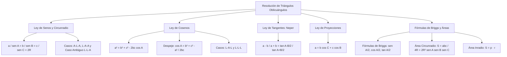

# TEMA 08: RESOLUCIÓN DE TRIÁNGULOS OBLICUÁNGULOS: LEYES DE SENOS, COSENOS, TANGENTES Y PROYECCIONES

---

## 1. FICHA TÉCNICA Y MATRIZ DE COMPETENCIAS

| Parámetro | Detalle |
| :--- | :--- |
| **Eje Temático** | 02. Matemática |
| **Área Disciplinar** | Trigonometría Plana y Geometría Métrica |
| **Nivel de Complejidad** | Avanzado (Estándar CEPREUNSA, UNMSM-DECO, UNI) |
| **Ponderación UNSA** | Ingenierías: 1.6583 pts \| Biomédicas: 1.2654 pts \| Sociales: 0.8245 pts |
| **Tiempo Estimado de Estudio** | 4.5 a 5.5 horas |
| **Prerrequisitos** | Razones Trigonométricas, Reducción al Primer Cuadrante, Circunferencia y Áreas |

### Competencias Clave del Prospecto
1. **Aplicación de la Ley de Senos y Circunradio:** Relacionar lados, ángulos y el diámetro de la circunferencia circunscrita ($2R$) para resolver triángulos con ángulos conocidos.
2. **Dominio de la Ley de Cosenos:** Calcular lados o ángulos en casos L-A-L y L-L-L, analizando la naturaleza acutángulo u obtusángulo del triángulo según el signo del coseno.
3. **Uso de Ley de Tangentes y Proyecciones:** Aplicar el Teorema de Neper y la descomposición proyectiva de lados ($a = b\cos C + c\cos B$).
4. **Fórmulas de Briggs y Cálculo de Áreas:** Manejar razones de ángulos mitad en función del semiperímetro y las cinco variantes de área triangular ($S = \frac{abc}{4R} = pr = 2R^2\sin A\sin B\sin C$).

---

## 2. MAPA TAXONÓMICO Y ONTOLOGÍA



---

## 3. DESARROLLO TEÓRICO FORMAL

### 3.1. Definición y Elementos de un Triángulo Oblicuángulo
Un **triángulo oblicuángulo** es aquel que no posee ningún ángulo interior recto ($90^\circ$). Puede ser acutángulo (tres ángulos agudos) u obtusángulo (un ángulo obtuso mayor a $90^\circ$).

#### Notación Convencional Estándar:
- **Vértices:** $A, B, C$.
- **Ángulos Interiores:** $\alpha = A, \beta = B, \gamma = C$, cumpliendo:
  $$A + B + C = 180^\circ = \pi\text{ rad}$$
- **Lados Opuestos:** $a$ (opuesto a $A$), $b$ (opuesto a $B$), $c$ (opuesto a $C$).
- **Circunradio ($R$):** Radio de la circunferencia circunscrita al triángulo.
- **Inradio ($r$):** Radio de la circunferencia inscrita.
- **Semiperímetro ($p$):** $p = \dfrac{a + b + c}{2}$.

---

### 3.2. Ley de Senos (Teorema de los Senos)
En todo triángulo, las longitudes de los lados son directamente proporcionales a los senos de sus respectivos ángulos opuestos, y la constante de proporcionalidad es exactamente igual al diámetro de la circunferencia circunscrita ($2R$):
$$\frac{a}{\sin(A)} = \frac{b}{\sin(B)} = \frac{c}{\sin(C)} = 2R$$

#### Despejes Clave para Sustitución Rápida:
$$a = 2R\sin(A), \quad b = 2R\sin(B), \quad c = 2R\sin(C)$$

#### Casos de Aplicación Óptima:
1. **Caso A-L-A o L-A-A:** Conocidos dos ángulos y un lado cualquiera. (Tiene solución única directa).
2. **Caso L-L-A (Caso Ambiguo):** Conocidos dos lados y el ángulo opuesto a uno de ellos. Puede tener cero, una o dos soluciones dependiendo de la altura $h = b\sin(A)$.

---

### 3.3. Ley de Cosenos (Teorema de los Cosenos)
En todo triángulo, el cuadrado de la longitud de un lado es igual a la suma de los cuadrados de los otros dos lados, menos el doble del producto de dichos lados por el coseno del ángulo comprendido entre ellos:
$$a^2 = b^2 + c^2 - 2bc\cos(A)$$
$$b^2 = a^2 + c^2 - 2ac\cos(B)$$
$$c^2 = a^2 + b^2 - 2ab\cos(C)$$

#### Despeje de los Cosenos de los Ángulos Interiores:
$$\cos(A) = \frac{b^2 + c^2 - a^2}{2bc}, \quad \cos(B) = \frac{a^2 + c^2 - b^2}{2ac}, \quad \cos(C) = \frac{a^2 + b^2 - c^2}{2ab}$$

#### Criterio de Clasificación Angular por el Signo de $\cos(A)$:
- Si $a^2 < b^2 + c^2 \implies \cos(A) > 0 \implies$ El ángulo $A$ es **agudo** ($< 90^\circ$).
- Si $a^2 = b^2 + c^2 \implies \cos(A) = 0 \implies$ El ángulo $A$ es **recto** ($90^\circ$, Teorema de Pitágoras).
- Si $a^2 > b^2 + c^2 \implies \cos(A) < 0 \implies$ El ángulo $A$ es **obtuso** ($> 90^\circ$).

---

### 3.4. Ley de Tangentes (Teorema de Neper)
En todo triángulo, la diferencia de dos lados es a su suma como la tangente de la semidiferencia de sus ángulos opuestos es a la tangente de la semisuma de dichos ángulos:
$$\frac{a - b}{a + b} = \frac{\tan\left(\frac{A - B}{2}\right)}{\tan\left(\frac{A + B}{2}\right)}$$
$$\frac{b - c}{b + c} = \frac{\tan\left(\frac{B - C}{2}\right)}{\tan\left(\frac{B + C}{2}\right)}$$
$$\frac{a - c}{a + c} = \frac{\tan\left(\frac{A - C}{2}\right)}{\tan\left(\frac{A + C}{2}\right)}$$

*Artificio Útil:* Dado que $\frac{A + B}{2} = 90^\circ - \frac{C}{2}$, el denominador se convierte en:
$$\tan\left(\frac{A + B}{2}\right) = \cot\left(\frac{C}{2}\right)$$

---

### 3.5. Ley de Proyecciones
En todo triángulo, cualquier lado es numéricamente igual a la suma de las proyecciones ortogonales de los otros dos lados sobre él:
$$a = b\cos(C) + c\cos(B)$$
$$b = a\cos(C) + c\cos(A)$$
$$c = a\cos(B) + b\cos(A)$$

---

### 3.6. Fórmulas de Briggs (Razones del Ángulo Mitad)
Permiten calcular el seno, coseno y tangente de la mitad de los ángulos interiores a partir del semiperímetro $p = \frac{a+b+c}{2}$:
1. **Seno del Ángulo Mitad:**
   $$\sin\left(\frac{A}{2}\right) = \sqrt{\frac{(p - b)(p - c)}{bc}}$$
2. **Coseno del Ángulo Mitad:**
   $$\cos\left(\frac{A}{2}\right) = \sqrt{\frac{p(p - a)}{bc}}$$
3. **Tangente del Ángulo Mitad:**
   $$\tan\left(\frac{A}{2}\right) = \sqrt{\frac{(p - b)(p - c)}{p(p - a)}} = \frac{r}{p - a}$$

---

### 3.7. Fórmulas del Área de la Región Triangular ($S$)

1. **Fórmula Trigonométrica Básica:**
   $$S = \frac{1}{2}ab\sin(C) = \frac{1}{2}bc\sin(A) = \frac{1}{2}ac\sin(B)$$
2. **En Función del Circunradio ($R$):**
   $$S = \frac{abc}{4R} = 2R^2\sin(A)\sin(B)\sin(C)$$
3. **En Función del Inradio ($r$):**
   $$S = p \cdot r$$
4. **Fórmula de Herón:**
   $$S = \sqrt{p(p - a)(p - b)(p - c)}$$

---

## 4. FORMULARIO MAESTRO (LATEX ESTRICTO)

| Ley / Teorema | Ecuación Matemática Rigurosa | Aplicación y Contexto |
| :--- | :--- | :--- |
| **Ley de Senos** | $\dfrac{a}{\sin A} = \dfrac{b}{\sin B} = \dfrac{c}{\sin C} = 2R$ | Relaciona lados y circunradio |
| **Lados en $R$** | $a = 2R\sin A, \quad b = 2R\sin B, \quad c = 2R\sin C$ | Sustitución algebraica directa |
| **Ley de Cosenos** | $a^2 = b^2 + c^2 - 2bc\cos A$ | Casos L-A-L y L-L-L |
| **Despeje Coseno** | $\cos A = \dfrac{b^2 + c^2 - a^2}{2bc}$ | Detección de ángulos obtusos |
| **Ley de Tangentes**| $\dfrac{a - b}{a + b} = \dfrac{\tan\left(\frac{A-B}{2}\right)}{\cot\left(\frac{C}{2}\right)}$ | Relaciona diferencias angulares |
| **Ley de Proyecciones**| $a = b\cos C + c\cos B$ | Suma de sombras ortogonales |
| **Briggs (Seno Mitad)**| $\sin\left(\frac{A}{2}\right) = \sqrt{\dfrac{(p-b)(p-c)}{bc}}$ | $p = \frac{a+b+c}{2}$ |
| **Briggs (Coseno Mitad)**| $\cos\left(\frac{A}{2}\right) = \sqrt{\dfrac{p(p-a)}{bc}}$ | $p = \frac{a+b+c}{2}$ |
| **Área con Circunradio**| $S = \dfrac{abc}{4R} = 2R^2\sin A\sin B\sin C$ | Geometría y trigonometría mixta|
| **Área con Inradio** | $S = p \cdot r$ | Relación con semiperímetro |

---

## 5. MNEMOTECNIAS DE COMBATE PREUNIVERSITARIO

### 1. Mnemotecnia de la Ley de Senos: "LADO ARRIBA, SENO ABAJO, DIÁMETRO AL FINAL"
- Cada lado tiene a su seno debajo:
  $$\frac{\text{Lado } a}{\sin A} = \frac{\text{Lado } b}{\sin B} = \frac{\text{Lado } c}{\sin C} = 2R$$
  ¡Recuerda siempre que al final es $2R$ (el diámetro), no $R$!

### 2. Mnemotecnia de la Ley de Cosenos: "PITÁGORAS CON DESCUENTO"
- El lado al cuadrado es Pitágoras ($b^2 + c^2$) **menos el descuento** del doble producto por el coseno:
  $$a^2 = b^2 + c^2 \mathbf{- 2bc\cos A}$$

### 3. Mnemotecnia de Proyecciones: "EL LADO ES LA SUMA CRUZADA"
- Para hallar el lado $a$, tomas los otros dos lados ($b$ y $c$) y los cruzas con los cosenos de los ángulos opuestos:
  $$a = b \cdot \cos(C) + c \cdot \cos(B)$$

---

## 6. TÉCNICAS Y ARTIFICIOS DE CÁLCULO (HACKING PREUNIVERSITARIO)

### Hack 1: Eliminación Rápida de Lados en Fracciones Homogéneas
En preguntas teóricas donde aparezcan expresiones como $\frac{a\sin B - b\sin A}{c}$:
- Sustituye de inmediato los lados por la Ley de Senos: $a = 2R\sin A$ y $b = 2R\sin B$.
- La expresión se convierte en:
  $$\frac{(2R\sin A)\sin B - (2R\sin B)\sin A}{c} = \frac{2R\sin A\sin B - 2R\sin A\sin B}{c} = \frac{0}{c} = 0$$
- ¡Se resuelve en 3 segundos sin dibujar ningún triángulo!

### Hack 2: Cálculo Directo de Ángulos Notables con Ley de Cosenos
- Si $a^2 = b^2 + c^2 - bc \implies 2bc\cos A = bc \implies \cos A = \frac{1}{2} \implies A = 60^\circ$.
- Si $a^2 = b^2 + c^2 + bc \implies -2bc\cos A = bc \implies \cos A = -\frac{1}{2} \implies A = 120^\circ$.
- Si $a^2 = b^2 + c^2 - \sqrt{2}bc \implies \cos A = \frac{\sqrt{2}}{2} \implies A = 45^\circ$.
- Si $a^2 = b^2 + c^2 + \sqrt{2}bc \implies \cos A = -\frac{\sqrt{2}}{2} \implies A = 135^\circ$.
- Si $a^2 = b^2 + c^2 - \sqrt{3}bc \implies \cos A = \frac{\sqrt{3}}{2} \implies A = 30^\circ$.
- ¡Aprende a reconocer estos patrones visuales para marcar la respuesta al instante!

---

## 7. ZONA DE TRAMPAS Y DISTRACTORES ("¡PELIGRO EXAMEN!")

> [!WARNING]
> **Trampa 1: El Signo Negativo del Coseno en Ángulos Obtusos**
> Si el triángulo es obtusángulo con $A = 120^\circ$:
> En la ley de cosenos, $\cos(120^\circ) = -\frac{1}{2}$.
> Al sustituir:
> $$a^2 = b^2 + c^2 - 2bc\left(-\frac{1}{2}\right) = b^2 + c^2 + bc$$
> Muchos postulantes olvidan que menos por menos da más y restan el término, obteniendo un lado menor que los otros dos en lugar del lado mayor.

> [!CAUTION]
> **Trampa 2: Circunradio vs Radio**
> La constante de la ley de senos es **$2R$ (dos veces el circunradio)**.
> Si te dicen "la circunferencia circunscrita tiene radio 5", la constante de la ley de senos es $2(5) = 10$, no $5$.

> [!WARNING]
> **Trampa 3: El Caso Ambiguo L-L-A**
> Cuando conoces dos lados $a, b$ y el ángulo $A$ opuesto al lado menor ($a < b$):
> Al aplicar $\sin B = \frac{b\sin A}{a}$, si $\sin B < 1$, existen **DOS ÁNGULOS POSIBLES**:
> Uno agudo $B_1$ y otro obtuso $B_2 = 180^\circ - B_1$. ¡Debes verificar si ambos ángulos permiten que la suma interior no supere $180^\circ$!

---

## 8. APLICACIÓN AL MUNDO REAL Y CONTEXTO DECO

1. **Triangulación Geodésica y Cartografía:** El Instituto Geográfico Nacional (IGN) traza las cartas topográficas del Perú midiendo líneas de base geodésicas y aplicando la ley de senos para calcular distancias a vértices en picos de cordilleras sin necesidad de ascender a ellos.
2. **Navegación Marítima y Aérea (Cálculo de Distancia entre Barcos):** Dos embarcaciones que parten del puerto de Matarani con rumbos divergentes que forman un ángulo $\theta$ calculan su distancia de separación en alta mar tras cierto tiempo mediante la ley de cosenos (conociendo las distancias recorridas $d_1 = v_1 t$ y $d_2 = v_2 t$).
3. **Ingeniería Estructural y Cálculo de Cerchas:** En puentes y techumbres reticuladas, los esfuerzos axiales de tracción y compresión en barras diagonales no ortogonales se resuelven planteando el equilibrio de nudos con leyes de senos y cosenos.

---

## 9. BANCO DE 5 EJERCICIOS RESUELTOS GRADUADOS

### Ejercicio 1 (Nivel 1 - Básico / Admisión Directa)
**Enunciado:** En un triángulo $ABC$, el lado $a = 12\text{ cm}$, el ángulo $A = 60^\circ$ y el ángulo $B = 45^\circ$. Calcule la longitud del lado $b$.

- A) $4\sqrt{6}\text{ cm}$
- B) $6\sqrt{2}\text{ cm}$
- C) $6\sqrt{6}\text{ cm}$
- D) $8\sqrt{3}\text{ cm}$
- E) $4\sqrt{3}\text{ cm}$

**Solución Paso a Paso:**
1. Aplicamos directamente la **Ley de Senos**:
   $$\frac{a}{\sin(A)} = \frac{b}{\sin(B)}$$
2. Sustituimos los valores numéricos dados:
   $$\frac{12}{\sin(60^\circ)} = \frac{b}{\sin(45^\circ)}$$
3. Reemplazamos los valores notables de las razones:
   $$\frac{12}{\frac{\sqrt{3}}{2}} = \frac{b}{\frac{\sqrt{2}}{2}}$$
4. Cancelamos el denominador $2$ y despejamos $b$:
   $$\frac{12}{\sqrt{3}} = \frac{b}{\sqrt{2}} \implies b = \frac{12\sqrt{2}}{\sqrt{3}}$$
5. Racionalizamos multiplicando por $\sqrt{3}$:
   $$b = \frac{12\sqrt{6}}{3} = 4\sqrt{6}\text{ cm}$$
- **Respuesta Correcta:** A) $4\sqrt{6}\text{ cm}$

---

### Ejercicio 2 (Nivel 2 - Intermedio / CEPREUNSA)
**Enunciado:** Los lados de un triángulo miden $a = 7\text{ cm}$, $b = 5\text{ cm}$ y $c = 3\text{ cm}$. Calcule la medida del mayor ángulo interior de dicho triángulo.

- A) $120^\circ$
- B) $135^\circ$
- C) $150^\circ$
- D) $60^\circ$
- E) $90^\circ$

**Solución Paso a Paso:**
1. Por propiedad geométrica básica, a mayor lado se opone mayor ángulo.
   - El lado mayor es $a = 7\text{ cm}$, por tanto el ángulo mayor es $A$.
2. Aplicamos la **Ley de Cosenos** para despejar $\cos(A)$:
   $$a^2 = b^2 + c^2 - 2bc\cos(A)$$
3. Sustituimos los valores numéricos:
   $$7^2 = 5^2 + 3^2 - 2(5)(3)\cos(A)$$
   $$49 = 25 + 9 - 30\cos(A)$$
   $$49 = 34 - 30\cos(A)$$
4. Despejamos el término con coseno:
   $$30\cos(A) = 34 - 49 = -15$$
   $$\cos(A) = -\frac{15}{30} = -\frac{1}{2}$$
5. Como $\cos(A) = -\frac{1}{2}$, el ángulo es obtuso del segundo cuadrante:
   $$A = 180^\circ - 60^\circ = 120^\circ$$
- **Respuesta Correcta:** A) $120^\circ$

---

### Ejercicio 3 (Nivel 3 - Intermedio-Avanzado / UNSA Ordinario)
**Enunciado:** En un triángulo $ABC$, simplifique la siguiente expresión que vincula lados y ángulos:
$$K = \frac{a\cos(C) + c\cos(A)}{b} + \frac{b\cos(C) + c\cos(B)}{a}$$

- A) 2
- B) 1
- C) $\dfrac{a+b}{c}$
- D) $\dfrac{a}{b}$
- E) 0

**Solución Paso a Paso:**
1. Aplicamos la **Ley de Proyecciones** al numerador de cada fracción:
   - Para la primera fracción: $a\cos(C) + c\cos(A) = b$.
   - Para la segunda fracción: $b\cos(C) + c\cos(B) = a$.
2. Sustituimos estas igualdades en la expresión $K$:
   $$K = \frac{b}{b} + \frac{a}{a}$$
3. Simplificamos cada cociente:
   $$K = 1 + 1 = 2$$
- **Respuesta Correcta:** A) 2

---

### Ejercicio 4 (Nivel 4 - Avanzado / UNMSM DECO)
**Enunciado:** Desde un faro costero $F$, un vigía observa dos lanchas patrulleras $A$ y $B$. La distancia del faro a la lancha $A$ es de $6\text{ km}$ y la distancia a la lancha $B$ es de $10\text{ km}$. Si el ángulo visual formado por las dos líneas de mira desde el faro es de $60^\circ$, determine la distancia en kilómetros que separa a ambas lanchas patrulleras.

- A) $2\sqrt{19}\text{ km}$
- B) $14\text{ km}$
- C) $4\sqrt{7}\text{ km}$
- D) $8\text{ km}$
- E) $2\sqrt{21}\text{ km}$

**Solución Paso a Paso:**
1. Identificamos los elementos del triángulo formado por el faro y las dos lanchas ($\triangle FAB$):
   - Lado $FA = b = 6\text{ km}$.
   - Lado $FB = a = 10\text{ km}$.
   - Ángulo comprendido: $\angle F = 60^\circ$.
   - Distancia desconocida entre lanchas: $AB = d$.
2. Aplicamos la **Ley de Cosenos** para el lado opuesto $d$:
   $$d^2 = a^2 + b^2 - 2ab\cos(F)$$
3. Sustituimos los valores numéricos:
   $$d^2 = 10^2 + 6^2 - 2(10)(6)\cos(60^\circ)$$
   $$d^2 = 100 + 36 - 120 \cdot \left(\frac{1}{2}\right)$$
   $$d^2 = 136 - 60 = 76$$
4. Extraemos la raíz cuadrada:
   $$d = \sqrt{76} = \sqrt{4 \times 19} = 2\sqrt{19}\text{ km}$$
- **Respuesta Correcta:** A) $2\sqrt{19}\text{ km}$

---

### Ejercicio 5 (Nivel 5 - Boss Challenge / UNI)
**Enunciado:** En un triángulo $ABC$ cuyos lados cumplen la relación algebraica $a^3 + b^3 + c^3 = c^2(a + b + c)$, determine la medida del ángulo interior $C$.

- A) $60^\circ$
- B) $120^\circ$
- C) $45^\circ$
- D) $30^\circ$
- E) $90^\circ$

**Solución Paso a Paso:**
1. **Manipulación Algebraica de la Condición:**
   Expandimos el segundo miembro de la igualdad dada:
   $$a^3 + b^3 + c^3 = c^2 a + c^2 b + c^3$$
2. Cancelamos el término $c^3$ en ambos miembros:
   $$a^3 + b^3 = c^2 a + c^2 b$$
3. Factorizamos por suma de cubos en el primer miembro y por factor común en el segundo:
   $$(a + b)(a^2 - ab + b^2) = c^2(a + b)$$
4. Dado que $a$ y $b$ son longitudes de lados ($a + b > 0$), cancelamos el factor $(a + b)$:
   $$a^2 - ab + b^2 = c^2$$
   Reordenando:
   $$c^2 = a^2 + b^2 - ab$$
5. **Comparación con la Ley de Cosenos:**
   La ley de cosenos para el lado $c$ establece:
   $$c^2 = a^2 + b^2 - 2ab\cos(C)$$
6. Igualamos ambas expresiones para $c^2$:
   $$a^2 + b^2 - ab = a^2 + b^2 - 2ab\cos(C)$$
   $$-ab = -2ab\cos(C)$$
   Simplificando $-ab$ en ambos lados:
   $$1 = 2\cos(C) \implies \cos(C) = \frac{1}{2}$$
7. Como $C$ es un ángulo interior de un triángulo ($0 < C < 180^\circ$):
   $$C = 60^\circ$$
- **Respuesta Correcta:** A) $60^\circ$

---

## 10. GLOSARIO DE 10 TÉRMINOS CLAVE

1. **Triángulo Oblicuángulo:** Triángulo que no posee ningún ángulo interior recto de $90^\circ$.
2. **Ley de Senos:** Teorema que establece la proporcionalidad directa entre los lados de un triángulo y los senos de sus ángulos opuestos ($2R$).
3. **Ley de Cosenos:** Teorema que generaliza el Teorema de Pitágoras para cualquier triángulo mediante un término correctivo de coseno.
4. **Circunradio ($R$):** Radio de la circunferencia que pasa por los tres vértices de un triángulo.
5. **Inradio ($r$):** Radio de la circunferencia tangente interior a los tres lados de un triángulo.
6. **Ley de Proyecciones:** Propiedad que expresa cualquier lado de un triángulo como la suma de las sombras ortogonales de los otros dos lados.
7. **Ley de Tangentes:** Teorema de Neper que relaciona la razón de la diferencia y suma de lados con las tangentes de sus semiángulos.
8. **Fórmulas de Briggs:** Expresiones que determinan las razones trigonométricas del ángulo mitad en función de los lados y el semiperímetro.
9. **Caso Ambiguo:** Situación de resolución trigonométrica (L-L-A) que puede dar lugar a dos triángulos geométricos distintos.
10. **Semiperímetro ($p$):** La mitad del perímetro total de una figura poligonal ($p = \frac{a+b+c}{2}$).

---

## 11. BANCO DE FLASHCARDS (Q/A)

- **Q: ¿A qué es igual la constante de proporcionalidad en la Ley de Senos?**
  - **A:** Es igual al diámetro de la circunferencia circunscrita: $2R$.
- **Q: ¿Cuál es la ecuación de la Ley de Cosenos para el lado $a$?**
  - **A:** $a^2 = b^2 + c^2 - 2bc\cos(A)$.
- **Q: Si en un triángulo se cumple $a^2 = b^2 + c^2 + bc$, ¿cuánto mide el ángulo $A$?**
  - **A:** Mide exactamente $120^\circ$ ($\cos A = -\frac{1}{2}$).
- **Q: ¿Qué establece la Ley de Proyecciones para el lado $c$?**
  - **A:** $c = a\cos(B) + b\cos(A)$.
- **Q: ¿Cómo se expresa el área de un triángulo en función de sus tres lados y su circunradio $R$?**
  - **A:** $S = \dfrac{abc}{4R}$.
- **Q: Si $\cos(A) < 0$ en un triángulo, ¿qué tipo de ángulo es $A$?**
  - **A:** Es un ángulo obtuso ($> 90^\circ$).

---

## 12. MOTOR DE GAMIFICACIÓN (JSON NATIVO PARA KOTLIN MULTIPLATFORM)

```json
{
  "temaId": "TRIG_08_TRIANGULOS_OBLICUANGULOS",
  "titulo": "Resolución de Triángulos Oblicuángulos: Ley de Senos, Cosenos y Proyecciones",
  "dificultad": "Avanzado",
  "xpTotal": 580,
  "skills": [
    "Ley de Senos y Circunradio",
    "Ley de Cosenos y Casos L-A-L / L-L-L",
    "Ley de Proyecciones",
    "Área Triangular Trigonométrica"
  ],
  "retos": [
    {
      "id": "reto_1",
      "tipo": "opcion_multiple",
      "pregunta": "En un triángulo, a = 8 cm y sen(A) = 0.4. ¿Cuánto mide el circunradio R?",
      "opciones": ["10 cm", "20 cm", "5 cm", "16 cm"],
      "respuestaCorrecta": "10 cm",
      "puntos": 70,
      "explicacion": "Por Ley de Senos: a / sen A = 2R -> 8 / 0.4 = 2R -> 20 = 2R -> R = 10 cm."
    },
    {
      "id": "reto_2",
      "tipo": "opcion_multiple",
      "pregunta": "Si b = 3, c = 4 y el ángulo A = 60°, ¿cuánto mide el lado a?",
      "opciones": ["√13", "√37", "5", "√25"],
      "respuestaCorrecta": "√13",
      "puntos": 80,
      "explicacion": "a² = 3² + 4² - 2(3)(4)cos(60°) = 9 + 16 - 24(1/2) = 25 - 12 = 13 -> a = √13."
    },
    {
      "id": "reto_3",
      "tipo": "opcion_multiple",
      "pregunta": "La expresión b cos(C) + c cos(B) es idéntica a:",
      "opciones": ["a", "2a", "b + c", "0"],
      "respuestaCorrecta": "a",
      "puntos": 70,
      "explicacion": "Por la Ley de Proyecciones: a = b cos(C) + c cos(B)."
    },
    {
      "id": "reto_4",
      "tipo": "opcion_multiple",
      "pregunta": "En un triángulo con lados 5 y 6 y ángulo comprendido de 30°, ¿cuál es su área?",
      "opciones": ["7.5", "15", "30", "12.5"],
      "respuestaCorrecta": "7.5",
      "puntos": 70,
      "explicacion": "Área = (1/2) * 5 * 6 * sen(30°) = 15 * (1/2) = 7.5."
    },
    {
      "id": "reto_boss",
      "tipo": "boss_challenge",
      "pregunta": "Si en un triángulo se verifica que a² = b² + c² + √2 bc, ¿cuánto mide el ángulo interior A?",
      "opciones": ["135°", "45°", "120°", "150°"],
      "respuestaCorrecta": "135°",
      "puntos": 290,
      "explicacion": "Por Ley de Cosenos: a² = b² + c² - 2bc cos(A). Igualando: -2bc cos(A) = √2 bc -> cos(A) = -√2/2 -> A = 180° - 45° = 135°."
    }
  ]
}
```
