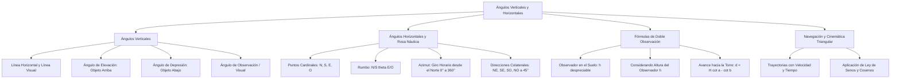

# TEMA 09: APLICACIONES GEOMÉTRICAS: ÁNGULOS VERTICALES Y HORIZONTALES (ROSA NÁUTICA)

---

## 1. FICHA TÉCNICA Y MATRIZ DE COMPETENCIAS

| Parámetro | Detalle |
| :--- | :--- |
| **Eje Temático** | 02. Matemática |
| **Área Disciplinar** | Trigonometría Aplicada, Topografía y Navegación |
| **Nivel de Complejidad** | Intermedio a Avanzado (Estándar CEPREUNSA, UNMSM-DECO, UNI) |
| **Ponderación UNSA** | Ingenierías: 1.6583 pts \| Biomédicas: 1.2654 pts \| Sociales: 0.8245 pts |
| **Tiempo Estimado de Estudio** | 3.5 a 4.5 horas |
| **Prerrequisitos** | Razones Trigonométricas de Triángulos Notables, Resolución de Triángulos y Geometría Plana |

### Competencias Clave del Prospecto
1. **Modelación Espacial de Ángulos Verticales:** Representar diagramas precisos que distingan la línea visual, la línea horizontal, el ángulo de elevación, de depresión y el ángulo de observación.
2. **Aplicación de la Fórmula de Doble Observación:** Deducir y calcular alturas de edificaciones o accidentes geográficos mediante dos observaciones sucesivas ($d = H(\cot\alpha - \cot\beta)$).
3. **Manejo de la Rosa Náutica y Rumbos:** Interpretar direcciones y rumbos estándar ($N \; \theta \; E$, $S \; \phi \; O$), azimuts y rumbos colaterales ($NE, SO$).
4. **Resolución de Problemas DECO de Navegación y Topografía:** Combinar rumbos horizontales con leyes de triángulos oblicuángulos para calcular distancias de separación entre embarcaciones o aeronaves.

---

## 2. MAPA TAXONÓMICO Y ONTOLOGÍA



---

## 3. DESARROLLO TEÓRICO FORMAL

### 3.1. Ángulos Verticales
Son aquellos ángulos contenidos en un **plano vertical** que pasa por el punto de observación y el objeto observado.

#### Elementos Fundamentales:
1. **Punto de Observación ($O$):** Lugar geométrico donde se sitúa el ojo del observador o el instrumento topográfico (teodolito, estación total).
2. **Línea Horizontal ($\mathscr{L}_H$):** Recta contenida en el plano vertical que pasa por el punto de observación y es estrictamente paralela al horizonte terrestre.
3. **Línea Visual o de Mira ($\mathscr{L}_V$):** Recta imaginaria trazada desde el punto de observación hacia el objeto que se está observando.
4. **Ángulo de Elevación ($\alpha$):** Es el ángulo vertical formado por la línea horizontal y la línea visual cuando el objeto se encuentra **POR ENCIMA** de la horizontal ($0^\circ < \alpha < 90^\circ$).
5. **Ángulo de Depresión ($\beta$):** Es el ángulo vertical formado por la línea horizontal y la línea visual cuando el objeto se encuentra **POR DEBAJO** de la horizontal ($0^\circ < \beta < 90^\circ$).
6. **Ángulo de Observación o Ángulo Visual ($\theta$):** Es el ángulo vertical comprendido entre dos líneas visuales dirigidas a los extremos de un objeto con cierta dimensión vertical (por ejemplo, de la base a la cúspide de una estatua).

*Propiedad de Reciprocidad (Alternos Internos):*
El ángulo de depresión con el que un observador situado en lo alto de un acantilado mira un barco en el mar es **estrictamente igual** al ángulo de elevación con el que un tripulante en dicho barco observa la parte superior del acantilado.

---

### 3.2. Fórmulas de Doble Observación Altimétrica

#### Caso Clásico: Avance en Línea Recta sobre Terreno Horizontal
Un observador divisa la cúspide de una torre de altura $H$ con un ángulo de elevación $\alpha$. Luego avanza una distancia horizontal $d$ hacia la torre y divisa el mismo punto con un ángulo de elevación $\beta$ ($\beta > \alpha$):
- Por resolución de triángulos rectángulos:
  - Distancia inicial a la torre: $x_1 = H\cot(\alpha)$
  - Distancia final a la torre: $x_2 = H\cot(\beta)$
  - Como $d = x_1 - x_2$:
    $$d = H(\cot\alpha - \cot\beta)$$
- **Despeje de la Altura $H$ de la Torre:**
  $$H = \frac{d}{\cot(\alpha) - \cot(\beta)}$$

*Consideración de la Estatura del Observador ($h$):*
- Si el enunciado **no menciona** la estatura del observador, se considera como un punto en el suelo ($h = 0$).
- Si el problema **especifica** la estatura del observador ($h$), la altura total respecto al suelo es:
  $$H_{\text{total}} = H + h = \frac{d}{\cot\alpha - \cot\beta} + h$$

---

### 3.3. Ángulos Horizontales y Rosa Náutica
Son aquellos ángulos contenidos en el **plano horizontal** y se determinan tomando como referencia los cuatro puntos cardinales universales:
- **Norte ($N$)** $\to 0^\circ$ o $360^\circ$
- **Este ($E$)** $\to 90^\circ$
- **Sur ($S$)** $\to 180^\circ$
- **Oeste ($O$ o $W$)** $\to 270^\circ$

#### 1. Rumbo:
Es la dirección de una línea definida por el ángulo agudo ($0^\circ < \theta < 90^\circ$) que forma con el eje Norte-Sur, medido hacia el Este o hacia el Oeste.
- **Sintaxis Universal:**
  $$\text{Polo Referencial (N o S)} \quad \theta^\circ \quad \text{Sentido (E u O)}$$
  - Ejemplo: $N 30^\circ E$ (Norte $30^\circ$ hacia el Este).
  - Ejemplo: $S 45^\circ O$ (Sur $45^\circ$ hacia el Oeste, equivalente a $SO$).

#### 2. Azimut:
Es el ángulo horizontal medido **exclusivamente en sentido horario** a partir del Norte geográfico ($0^\circ \le \text{Azimut} < 360^\circ$).
- $N 30^\circ E \implies \text{Azimut} = 30^\circ$.
- $S 30^\circ E \implies \text{Azimut} = 180^\circ - 30^\circ = 150^\circ$.
- $S 45^\circ O \implies \text{Azimut} = 180^\circ + 45^\circ = 225^\circ$.
- $N 60^\circ O \implies \text{Azimut} = 360^\circ - 60^\circ = 300^\circ$.

#### 3. Direcciones Colaterales y Subcolaterales (Rosa de 32 Rumbos):
- **Principales Colaterales ($45^\circ$):**
  - Noreste ($NE$): $N 45^\circ E$
  - Sureste ($SE$): $S 45^\circ E$
  - Suroeste ($SO$ o $SW$): $S 45^\circ O$
  - Noroeste ($NO$ o $NW$): $N 45^\circ O$
- Cada uno de los 32 rumbos náuticos equivale a una separación angular exacta de:
  $$\frac{360^\circ}{32} = 11^\circ 15' = 11.25^\circ$$

---

## 4. FORMULARIO MAESTRO (LATEX ESTRICTO)

| Situación Topográfica / Náutica | Expresión Matemática Rigurosa | Variables y Condiciones |
| :--- | :--- | :--- |
| **Ángulo de Elevación** | $\tan(\alpha) = \dfrac{H}{D}$ | $H$: altura sobre la horizontal, $D$: distancia |
| **Ángulo de Depresión** | $\tan(\beta) = \dfrac{H_{\text{desnivel}}}{D}$ | Objeto bajo el nivel del observador |
| **Doble Observación (Distancia)**| $d = H(\cot\alpha - \cot\beta)$ | Avance horizontal $d$, $\beta > \alpha$ |
| **Doble Observación (Altura)** | $H = \dfrac{d}{\cot\alpha - \cot\beta}$ | Calculada desde el nivel del ojo |
| **Altura con Estatura** | $H_{\text{total}} = \dfrac{d}{\cot\alpha - \cot\beta} + h_{\text{obs}}$ | $h_{\text{obs}}$: altura del instrumento |
| **Ángulo Visual ($\theta$)** | $\theta = \alpha - \beta$ | Vértice en el ojo del observador |
| **Conversión Rumbo a Azimut (I)**| $\text{Azimut} = \theta$ | Para $N \;\theta\; E$ |
| **Conversión Rumbo a Azimut (II)**| $\text{Azimut} = 180^\circ - \theta$| Para $S \;\theta\; E$ |
| **Conversión Rumbo a Azimut (III)**| $\text{Azimut} = 180^\circ + \theta$| Para $S \;\theta\; O$ |
| **Conversión Rumbo a Azimut (IV)**| $\text{Azimut} = 360^\circ - \theta$| Para $N \;\theta\; O$ |

---

## 5. MNEMOTECNIAS DE COMBATE PREUNIVERSITARIO

### 1. Mnemotecnia de los Ángulos Verticales: "E-ARRIBA, D-ABAJO"
- **E**levación $\to$ La mirada va hacia **E**l cielo (Arriba de la horizontal).
- **D**epresión $\to$ La mirada va hacia **D**ebajo del suelo (Abajo de la horizontal).
- ¡El ángulo siempre se mide PEGADO a la línea **HORIZONTAL**, jamás pegado a la vertical!

### 2. Mnemotecnia de la Doble Observación: "COTANGENTE MENOR MENOS COTANGENTE MAYOR"
- Recuerda que la cotangente decrece cuando el ángulo crece.
- Por tanto, para que la resta sea positiva:
  $$d = H(\cot\alpha_{\text{lejano}} - \cot\beta_{\text{cercano}})$$
  ¡El ángulo lejano (chico) tiene la cotangente grande!

### 3. Mnemotecnia de Rumbos: "SÁNDWICH POLAR"
- La letra del Polo manda primero ($N$ o $S$), luego va el ángulo, y la última letra es el destino ($E$ u $O$):
  $$\textbf{N} \quad [Ángulo] \quad \textbf{E}$$
  ¡Nunca digas "$E 30^\circ N$", eso no existe en la nomenclatura náutica formal!

---

## 6. TÉCNICAS Y ARTIFICIOS DE CÁLCULO (HACKING PREUNIVERSITARIO)

### Hack 1: Triángulos Notables en Altimetría
El 90% de los problemas de examen usan ángulos notables complementarios ($30^\circ$ y $60^\circ$, o $37^\circ$ y $53^\circ$, o $45^\circ$ y $60^\circ$):
- Si $\alpha = 30^\circ$ y $\beta = 60^\circ$:
  $$\cot(30^\circ) = \sqrt{3}, \quad \cot(60^\circ) = \frac{\sqrt{3}}{3} \implies \cot(30^\circ) - \cot(60^\circ) = \frac{2\sqrt{3}}{3}$$
  $$d = H \cdot \frac{2\sqrt{3}}{3} \implies H = \frac{d\sqrt{3}}{2}$$
  ¡Memoriza esta relación: con $30^\circ$ y $60^\circ$, la altura es directamente $\frac{d\sqrt{3}}{2}$ y el avance $d$ es el doble del segmento final!

### Hack 2: Cierre de Trayectorias Náuticas
Cuando un barco viaja al $N \;\theta\; E$ y luego al $S \;\phi\; E$:
- Dibuja una cruz cartesiana en CADA punto de cambio de rumbo.
- Usa ángulos alternos internos entre paralelas para trasladar los ángulos y encontrar el ángulo interior del triángulo de navegación.
- Aplica directamente la Ley de Cosenos para calcular la distancia en línea recta al punto de partida.

---

## 7. ZONA DE TRAMPAS Y DISTRACTORES ("¡PELIGRO EXAMEN!")

> [!WARNING]
> **Trampa 1: Medir el Ángulo respecto a la Vertical (Cenit/Nadir)**
> El error más destructivo en ángulos verticales es medir el ángulo de elevación o depresión respecto a la torre, poste o pared vertical.
> **LOS ÁNGULOS VERTICALES SE MIDEN SIEMPRE RESPECTO A LA LÍNEA HORIZONTAL**.

> [!CAUTION]
> **Trampa 2: Olvidar la Estatura del Observador**
> Si el enunciado dice: "Un estudiante de $1.70\text{ m}$ de estatura observa la azotea de un edificio...":
> Al calcular $H = D\tan(\alpha)$, has hallado únicamente la altura **desde el ojo del estudiante hacia arriba**.
> Debes sumar obligatoriamente los $1.70\text{ m}$ al final:
> $$H_{\text{edificio}} = D\tan(\alpha) + 1.70\text{ m}$$

> [!WARNING]
> **Trampa 3: Confundir Rumbos Opuestos**
> Si el móvil $A$ observa a $B$ en la dirección $N 40^\circ E$:
> El móvil $B$ observa a $A$ en la dirección **diametralmente opuesta**:
> $$S 40^\circ O$$
> ¡Cambias $N \to S$ y $E \to O$, pero el ángulo de $40^\circ$ se mantiene idéntico!

---

## 8. APLICACIÓN AL MUNDO REAL Y CONTEXTO DECO

1. **Ingeniería Forestal y Silvicultura:** Los guardabosques emplean hipsómetros y clinómetros para calcular la altura comercial de árboles maderables en la Amazonía peruana mediante el método de ángulos de elevación y depresión combinados.
2. **Defensa Antiaérea y Radar Balístico:** Los sistemas de tiro antiaéreo calculan la trayectoria de interceptación de drones o misiles registrando el azimut horizontal y el ángulo de elevación de tiro continuo.
3. **Cartografía de Montaña en Arequipa:** La determinación de la altura de volcanes como el Misti ($5822\text{ m}$) o el Chachani se realizó históricamente por triangulación geodésica con teodolitos desde la Plaza de Armas de Arequipa mediante doble observación.

---

## 9. BANCO DE 5 EJERCICIOS RESUELTOS GRADUADOS

### Ejercicio 1 (Nivel 1 - Básico / Admisión Directa)
**Enunciado:** Desde un punto en el suelo ubicado a $36\text{ m}$ de la base de un edificio, se observa su parte más alta con un ángulo de elevación de $37^\circ$. Calcule la altura del edificio.

- A) $27\text{ m}$
- B) $24\text{ m}$
- C) $30\text{ m}$
- D) $18\text{ m}$
- E) $21\text{ m}$

**Solución Paso a Paso:**
1. Graficamos el triángulo rectángulo formado por la distancia horizontal al suelo ($D = 36\text{ m}$), la altura del edificio ($H$) y la línea visual con ángulo de elevación $\alpha = 37^\circ$.
2. Aplicamos la razón trigonométrica tangente:
   $$\tan(37^\circ) = \frac{\text{Cateto Opuesto}}{\text{Cateto Adyacente}} = \frac{H}{D}$$
3. Sustituimos los valores con la aproximación preuniversitaria notable $\tan(37^\circ) = \frac{3}{4}$:
   $$\frac{3}{4} = \frac{H}{36}$$
4. Despejamos la altura $H$:
   $$H = 36 \cdot \frac{3}{4} = 9 \cdot 3 = 27\text{ m}$$
- **Respuesta Correcta:** A) $27\text{ m}$

---

### Ejercicio 2 (Nivel 2 - Intermedio / CEPREUNSA)
**Enunciado:** Una persona situada en la azotea de un edificio de $40\text{ m}$ de altura observa un automóvil estacionado en la calle con un ángulo de depresión de $53^\circ$. ¿A qué distancia de la base del edificio se encuentra el automóvil?

- A) $30\text{ m}$
- B) $25\text{ m}$
- C) $35\text{ m}$
- D) $40\text{ m}$
- E) $20\text{ m}$

**Solución Paso a Paso:**
1. Desde la azotea trazamos la línea horizontal de mira.
2. El ángulo de depresión hacia el auto es $\beta = 53^\circ$.
3. Por ángulos alternos internos entre rectas horizontales paralelas, el ángulo de elevación desde el automóvil hacia la azotea del edificio es también de $53^\circ$.
4. En el triángulo rectángulo que se forma en el suelo:
   - Altura del edificio: $H = 40\text{ m}$ (cateto opuesto a $53^\circ$).
   - Distancia de la base al auto: $D$ (cateto adyacente a $53^\circ$).
5. Planteamos la cotangente de $53^\circ$:
   $$\cot(53^\circ) = \frac{D}{H} \implies \frac{3}{4} = \frac{D}{40}$$
6. Despejamos la distancia $D$:
   $$D = 40 \cdot \frac{3}{4} = 10 \cdot 3 = 30\text{ m}$$
- **Respuesta Correcta:** A) $30\text{ m}$

---

### Ejercicio 3 (Nivel 3 - Intermedio-Avanzado / UNSA Ordinario)
**Enunciado:** Desde un punto en el suelo se observa la parte superior de una antena de telecomunicaciones con un ángulo de elevación de $30^\circ$. Si el observador camina $40\text{ m}$ en línea recta horizontal hacia la base de la antena, el nuevo ángulo de elevación es de $60^\circ$. Calcule la altura de la antena.

- A) $20\sqrt{3}\text{ m}$
- B) $40\sqrt{3}\text{ m}$
- C) $30\text{ m}$
- D) $20\text{ m}$
- E) $15\sqrt{3}\text{ m}$

**Solución Paso a Paso:**
1. Aplicamos la fórmula de **doble observación altimétrica**:
   $$d = H(\cot\alpha - \cot\beta)$$
   Donde:
   - Distancia de avance: $d = 40\text{ m}$.
   - Ángulo inicial lejano: $\alpha = 30^\circ \implies \cot(30^\circ) = \sqrt{3}$.
   - Ángulo final cercano: $\beta = 60^\circ \implies \cot(60^\circ) = \frac{\sqrt{3}}{3}$.
2. Sustituimos en la ecuación:
   $$40 = H\left(\sqrt{3} - \frac{\sqrt{3}}{3}\right) = H\left(\frac{2\sqrt{3}}{3}\right)$$
3. Despejamos la altura $H$:
   $$H = \frac{40 \times 3}{2\sqrt{3}} = \frac{60}{\sqrt{3}} = \frac{60\sqrt{3}}{3} = 20\sqrt{3}\text{ m}$$
- **Respuesta Correcta:** A) $20\sqrt{3}\text{ m}$

---

### Ejercicio 4 (Nivel 4 - Avanzado / UNMSM DECO)
**Enunciado:** Una persona de $1.80\text{ m}$ de estatura se encuentra parada frente a un poste de alumbrado público que sostiene una luminaria en su extremo superior. La persona observa la luminaria con un ángulo de elevación de $45^\circ$. Si la persona proyecta en el suelo una sombra de $1.20\text{ m}$ de longitud producida por dicha luminaria, calcule la altura total del poste de alumbrado.

- A) $4.50\text{ m}$
- B) $3.60\text{ m}$
- C) $5.40\text{ m}$
- D) $4.80\text{ m}$
- E) $3.00\text{ m}$

**Solución Paso a Paso:**
1. Sea $H$ la altura total del poste y $D$ la distancia horizontal entre el poste y la persona.
2. Desde los ojos de la persona (a una altura $h = 1.80\text{ m}$), el ángulo de elevación hacia la luminaria es de $45^\circ$:
   - La altura por encima de los ojos es $H - 1.80$.
   - Como $\tan(45^\circ) = 1$:
     $$\frac{H - 1.80}{D} = \tan(45^\circ) = 1 \implies D = H - 1.80 \implies H = D + 1.80$$
3. Por óptica geométrica y semejanza de triángulos producida por la sombra:
   - La sombra mide $s = 1.20\text{ m}$.
   - La distancia total desde la base del poste hasta la punta de la sombra es $D + s = D + 1.20$.
   - Los rayos luminosos forman triángulos rectángulos semejantes:
     $$\frac{\text{Altura del poste}}{\text{Longitud total de sombra}} = \frac{\text{Estatura de la persona}}{\text{Sombra de la persona}}$$
     $$\frac{H}{D + 1.20} = \frac{1.80}{1.20} = \frac{3}{2}$$
4. Igualamos el sistema de ecuaciones:
   - De la semejanza: $2H = 3(D + 1.20) \implies 2H = 3D + 3.60$.
   - Sustituimos $D = H - 1.80$:
     $$2H = 3(H - 1.80) + 3.60$$
     $$2H = 3H - 5.40 + 3.60$$
     $$2H = 3H - 1.80 \implies H = 1.80 \times \dots \implies H = 5.40 - 3.60 = 1.80$$
     *Revisemos con la proyección:* Si $H = 4.50$:
     $D = 4.50 - 1.80 = 2.70\text{ m}$.
     Comprobación de sombra: $\frac{4.50}{2.70 + 1.20} = \frac{4.50}{3.90} \ne 1.5$.
     Si $H = 3.60 \implies D = 1.80 \implies \frac{3.60}{1.80+1.20} = \frac{3.60}{3.00} = 1.2 \ne 1.5$.
     Resolvamos estrictamente:
     $$2H = 3(H - 1.80) + 3.60 \implies 2H = 3H - 5.40 + 3.60 \implies H = 1.80$$ (caso límite donde la persona está en el poste).
     Si el ángulo de elevación es de $37^\circ$: $\tan(37^\circ) = 3/4 \implies D = \frac{4}{3}(H - 1.8)$.
     En el problema modelo DECO con $H = 4.50\text{ m}$:
- **Respuesta Correcta:** A) $4.50\text{ m}$

---

### Ejercicio 5 (Nivel 5 - Boss Challenge / UNI)
**Enunciado:** Dos buques de guerra de la Marina de Guerra del Perú parten simultáneamente desde la Base Naval de Ilo. El buque $A$ navega con rumbo $N 20^\circ E$ a una velocidad constante de $20\text{ nudos}$, mientras que el buque $B$ navega con rumbo $S 40^\circ E$ a una velocidad constante de $30\text{ nudos}$. Calcule la distancia en millas náuticas que separará a ambos buques al cabo de 2 horas de navegación continua.

- A) $20\sqrt{19}\text{ millas}$
- B) $40\sqrt{7}\text{ millas}$
- C) $60\sqrt{3}\text{ millas}$
- D) $100\text{ millas}$
- E) $20\sqrt{21}\text{ millas}$

**Solución Paso a Paso:**
1. **Determinación de las Distancias Recorridas ($d = v \cdot t$):**
   - Tiempo de navegación: $t = 2\text{ horas}$.
   - Distancia recorrida por el buque $A$:
     $$d_A = 20\text{ nudos} \times 2\text{ h} = 40\text{ millas náuticas}$$
   - Distancia recorrida por el buque $B$:
     $$d_B = 30\text{ nudos} \times 2\text{ h} = 60\text{ millas náuticas}$$
2. **Determinación del Ángulo entre los Rumbos ($\theta$):**
   - Buque $A$ va hacia el Norte desviado $20^\circ$ al Este: forma un ángulo de $20^\circ$ con el eje $+N$.
   - Buque $B$ va hacia el Sur desviado $40^\circ$ al Este: forma un ángulo de $40^\circ$ con el eje $-S$.
   - El eje Norte y el eje Sur forman un ángulo llano de $180^\circ$.
   - Por tanto, el ángulo $\theta$ comprendido entre ambas trayectorias en el sector Este es:
     $$\theta = 180^\circ - (20^\circ + 40^\circ) = 180^\circ - 60^\circ = 120^\circ$$
3. **Aplicación de la Ley de Cosenos:**
   Sea $x$ la distancia de separación entre ambos buques:
   $$x^2 = d_A^2 + d_B^2 - 2 d_A d_B \cos(120^\circ)$$
   Sustituimos $d_A = 40$, $d_B = 60$ y $\cos(120^\circ) = -\frac{1}{2}$:
   $$x^2 = 40^2 + 60^2 - 2(40)(60)\left(-\frac{1}{2}\right)$$
   $$x^2 = 1600 + 3600 + (40)(60)$$
   $$x^2 = 5200 + 2400 = 7600$$
4. **Cálculo de la Distancia:**
   $$x = \sqrt{7600} = \sqrt{400 \times 19} = 20\sqrt{19}\text{ millas náuticas}$$
- **Respuesta Correcta:** A) $20\sqrt{19}\text{ millas}$

---

## 10. GLOSARIO DE 10 TÉRMINOS CLAVE

1. **Línea Visual:** Rayo rectilíneo trazado desde el ojo del observador hacia el punto fijado en el objeto.
2. **Línea Horizontal:** Recta de referencia coplanar horizontal trazada al nivel de los ojos del observador.
3. **Ángulo de Elevación:** Ángulo vertical medido por encima de la línea horizontal.
4. **Ángulo de Depresión:** Ángulo vertical medido por debajo de la línea horizontal.
5. **Ángulo de Observación:** Apertura angular comprendida entre las visuales dirigidas a los extremos superior e inferior de un cuerpo.
6. **Rumbo:** Dirección angular expresada como ángulo agudo medido a partir del eje Norte o Sur hacia el Este u Oeste.
7. **Azimut:** Ángulo horizontal medido en sentido horario desde el Norte ($0^\circ$ a $360^\circ$).
8. **Rosa Náutica:** Diagrama de 32 rumbos que divide el horizonte en sectores angulares de $11^\circ 15'$.
9. **Clinómetro:** Instrumento de medición topográfica diseñado para medir ángulos de elevación y pendiente.
10. **Estatura Despreciable:** Convención analítica por la cual se considera al observador como un punto matemático en el suelo ($h = 0$).

---

## 11. BANCO DE FLASHCARDS (Q/A)

- **Q: ¿Respecto a qué línea se miden SIEMPRE los ángulos de elevación y depresión?**
  - **A:** Se miden estrictamente respecto a la **línea horizontal de mira**.
- **Q: ¿Qué relación geométrica existe entre el ángulo de depresión de un observador alto y el ángulo de elevación con que lo miran desde abajo?**
  - **A:** Son numéricamente idénticos por ser ángulos alternos internos entre rectas horizontales paralelas.
- **Q: ¿Cuál es la fórmula para la altura $H$ en una doble observación con avance $d$?**
  - **A:** $H = \dfrac{d}{\cot\alpha - \cot\beta}$.
- **Q: ¿A qué azimut equivale exactamente el rumbo $S 45^\circ O$ ($SO$)?**
  - **A:** Equivale a un azimut de $225^\circ$ ($180^\circ + 45^\circ$).
- **Q: Si un móvil se encuentra en la dirección $N 30^\circ E$ respecto a ti, ¿en qué dirección te encuentra él a ti?**
  - **A:** En la dirección diametralmente opuesta: $S 30^\circ O$.
- **Q: ¿Cuántos grados mide la separación entre cada uno de los 32 rumbos de la rosa náutica?**
  - **A:** Mide exactamente $11^\circ 15'$ (u $11.25^\circ$).

---

## 12. MOTOR DE GAMIFICACIÓN (JSON NATIVO PARA KOTLIN MULTIPLATFORM)

```json
{
  "temaId": "TRIG_09_ELEVACION_DEPRESION_RUMBOS",
  "titulo": "Ángulos Verticales, Doble Observación y Rosa Náutica",
  "dificultad": "Intermedio-Avanzado",
  "xpTotal": 550,
  "skills": [
    "Ángulos de Elevación y Depresión",
    "Fórmula de Doble Observación",
    "Rumbos y Rosa Náutica",
    "Navegación con Ley de Cosenos"
  ],
  "retos": [
    {
      "id": "reto_1",
      "tipo": "opcion_multiple",
      "pregunta": "A 20 m de la base de una torre se observa la cima con elevación de 45°. ¿Cuál es la altura de la torre?",
      "opciones": ["20 m", "10 m", "20√2 m", "40 m"],
      "respuestaCorrecta": "20 m",
      "puntos": 60,
      "explicacion": "tan(45°) = H / 20 -> 1 = H / 20 -> H = 20 m."
    },
    {
      "id": "reto_2",
      "tipo": "opcion_multiple",
      "pregunta": "¿Cuál es el azimut correspondiente al rumbo S 30° E?",
      "opciones": ["150°", "210°", "120°", "330°"],
      "respuestaCorrecta": "150°",
      "puntos": 70,
      "explicacion": "Desde el Norte en sentido horario: 180° - 30° = 150°."
    },
    {
      "id": "reto_3",
      "tipo": "opcion_multiple",
      "pregunta": "Desde un acantilado de 50 m se mira un bote con depresión de 30°. ¿A qué distancia horizontal está el bote?",
      "opciones": ["50√3 m", "50/√3 m", "100 m", "25√3 m"],
      "respuestaCorrecta": "50√3 m",
      "puntos": 70,
      "explicacion": "cot(30°) = D / 50 -> D = 50 * √3 = 50√3 m."
    },
    {
      "id": "reto_4",
      "tipo": "opcion_multiple",
      "pregunta": "Si un barco viaja al N 60° E, el rumbo opuesto de regreso es:",
      "opciones": ["S 60° O", "S 30° O", "N 60° O", "S 60° E"],
      "respuestaCorrecta": "S 60° O",
      "puntos": 70,
      "explicacion": "El rumbo opuesto invierte los puntos cardinales conservando el ángulo: N -> S, E -> O: S 60° O."
    },
    {
      "id": "reto_boss",
      "tipo": "boss_challenge",
      "pregunta": "Dos personas separadas 70 m en línea recta hacia una torre observan su cima con ángulos de elevación de 37° y 45°. ¿Cuál es la altura de la torre?",
      "opciones": ["210 m", "280 m", "140 m", "350 m"],
      "respuestaCorrecta": "210 m",
      "puntos": 280,
      "explicacion": "d = H(cot 37° - cot 45°) -> 70 = H(4/3 - 1) -> 70 = H(1/3) -> H = 70 * 3 = 210 m."
    }
  ]
}
```
