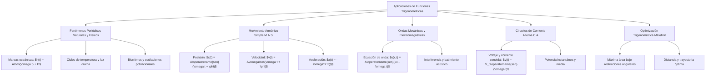

# TEMA 12: APLICACIONES DE LAS FUNCIONES TRIGONOMÉTRICAS

---

## 1. FICHA TÉCNICA Y MATRIZ DE COMPETENCIAS

| Parámetro | Especificación Oficial UNSA / UNMSM / UNI |
| :--- | :--- |
| **Eje Curricular** | Eje 02: Matemática / Trigonometría |
| **Nivel de Dificultad** | Nivel Avanzado - Interdisciplinario (Trigonometría, Física, Modelado Matemático) |
| **Ponderación UNSA** | Ingenierías: 1.658337400 pts \| Biomédicas: 1.265447400 pts \| Sociales: 0.824574000 pts |
| **Tiempo Estándar de Respuesta** | 2.5 a 3.0 minutos por reactivo de modelado periódico |
| **Prerrequisitos Cognitivos** | Funciones trigonométricas directas ($A \operatorname{sen}(Bx + C) + D$), transformada gráfica, identidades compuestas, derivada/tasa de cambio intuitiva, Movimiento Armónico Simple (M.A.S.). |
| **Competencia Cardinal** | Modela fenómenos cíclicos de la naturaleza, ondas mecánicas y acústicas, mareas, corrientes alternas y optimización geométrica mediante modelos sinusoidales $y = A \operatorname{sen}(\omega t + \phi) + k$. |

---

## 2. MAPA TAXONÓMICO Y ONTOLOGÍA



---

## 3. DESARROLLO TEÓRICO FORMAL

### 3.1. Parámetros del Modelo Sinusoidal General
Cualquier fenómeno periódico armónico fundamental se describe por la función general:
$$y(t) = A \operatorname{sen}(\omega t + \phi) + k \quad \text{o} \quad y(t) = A \cos(\omega t + \phi) + k$$

1. **Amplitud ($|A|$):** Semidiferencia entre el valor máximo ($y_{\max}$) y el valor mínimo ($y_{\min}$):
   $$|A| = \frac{y_{\max} - y_{\min}}{2}$$
2. **Eje Central de Oscilación o Nivel Medio ($k$):**
   $$k = \frac{y_{\max} + y_{\min}}{2}$$
3. **Frecuencia Angular ($\omega$):** Tasa de cambio de la fase con respecto al tiempo:
   $$\omega = \frac{2\pi}{T} = 2\pi f \quad (\text{rad/s})$$
   donde $T$ es el período fundamental y $f = \frac{1}{T}$ es la frecuencia ordinaria en hercios ($\text{Hz}$).
4. **Desfase o Ángulo de Fase Inicial ($\phi$):** Determina el estado de la oscilación en $t = 0$.
5. **Corrimiento Temporal o Desplazamiento de Fase ($t_0$):**
   $$y(t) = A \operatorname{sen}\left[\omega(t - t_0)\right] + k \implies \phi = -\omega t_0 \iff t_0 = -\frac{\phi}{\omega}$$

---

### 3.2. Modelado de Movimiento Armónico Simple (M.A.S.)
En cinemática armónica (resortes ideales, péndulos para pequeños ángulos):
- **Ecuación de Posición:**
  $$x(t) = A \operatorname{sen}(\omega t + \phi)$$
- **Ecuación de Velocidad:**
  $$v(t) = \frac{dx}{dt} = A\omega \cos(\omega t + \phi) \implies v_{\max} = \omega A$$
- **Ecuación de Aceleración:**
  $$a(t) = \frac{dv}{dt} = -A\omega^2 \operatorname{sen}(\omega t + \phi) = -\omega^2 x(t) \implies a_{\max} = \omega^2 A$$
- **Conservación de la Energía Mecánica:**
  $$E_M = \frac{1}{2} k_{el} A^2 = \frac{1}{2} m v^2 + \frac{1}{2} k_{el} x^2$$

---

### 3.3. Ondas Senoidales Progresivas y Superposición
Una perturbación ondulatoria unidimensional que se propaga a velocidad $v$:
$$y(x,t) = A \operatorname{sen}(kx \mp \omega t + \phi)$$
- Signo $(-)$: Onda que viaja hacia la derecha ($+x$).
- Signo $(+)$: Onda que viaja hacia la izquierda ($-x$).
- **Número de onda ($k$):** $k = \frac{2\pi}{\lambda}$, donde $\lambda$ es la longitud de onda.
- **Velocidad de propagación:** $v = \frac{\omega}{k} = \lambda f$.

**Batimiento (Beats):** Superposición de dos ondas sonoras de frecuencias muy cercanas $f_1 \approx f_2$:
$$y_1 + y_2 = A \operatorname{sen}(2\pi f_1 t) + A \operatorname{sen}(2\pi f_2 t) = \left[ 2A \cos\left(2\pi \frac{f_1 - f_2}{2} t\right) \right] \operatorname{sen}\left(2\pi \frac{f_1 + f_2}{2} t\right)$$
La frecuencia del pulso de batimiento percibido es $f_{\text{bat}} = |f_1 - f_2|$.

---

### 3.4. Corriente Alterna y Fasores
- Voltaje alterno senoidal: $v(t) = V_{\text{pico}} \operatorname{sen}(\omega t)$
- Voltaje Eficaz o RMS (Root Mean Square):
  $$V_{\text{rms}} = \frac{V_{\text{pico}}}{\sqrt{2}}$$
- En la red eléctrica peruana doméstica: $V_{\text{rms}} = 220\text{ V}, f = 60\text{ Hz} \implies \omega = 120\pi\text{ rad/s} \approx 377\text{ rad/s}$.
  $$V_{\text{pico}} = 220\sqrt{2}\text{ V} \approx 311.13\text{ V}$$

---

### 3.5. Optimización Trigonométrica Sin Derivadas
En problemas de máximos y mínimos de figuras geométricas con variables angulares $\theta$:
1. **Forma $A\operatorname{sen}\theta + B\cos\theta$:**
   $$-\sqrt{A^2+B^2} \le A\operatorname{sen}\theta + B\cos\theta \le \sqrt{A^2+B^2}$$
2. **Propiedad de Medias ($MA \ge MG$):** Para términos como $a\tan\theta + b\cot\theta$ con $\theta \in \langle 0, \pi/2\rangle$:
   $$a\tan\theta + b\cot\theta \ge 2\sqrt{ab}$$
   El valor mínimo $2\sqrt{ab}$ se alcanza cuando $a\tan\theta = b\cot\theta \implies \tan\theta = \sqrt{b/a}$.

---

## 4. FORMULARIO MAESTRO DE APLICACIONES

$$\begin{array}{|l|l|l|}
\hline
\textbf{Fenómeno / Magnitud} & \textbf{Ecuación / Fórmula} & \textbf{Condición / Rango} \\ \hline
\text{Modelo Senoidal Clásico} & y(t) = A\operatorname{sen}\left(\frac{2\pi}{T}(t - t_0)\right) + k & A = \frac{M - m}{2},\; k = \frac{M + m}{2} \\ \hline
\text{Velocidad máxima M.A.S.} & v_{\max} = \omega A = \frac{2\pi}{T} A & \text{Ocurre al pasar por el punto de equilibrio } (x = 0) \\ \hline
\text{Aceleración máxima M.A.S.} & a_{\max} = \omega^2 A & \text{Ocurre en los extremos de máxima elongación } (|x| = A) \\ \hline
\text{Longitud de onda y velocidad} & v = \lambda f = \frac{\lambda}{T} = \frac{\omega}{k} & k = \frac{2\pi}{\lambda},\; \omega = 2\pi f \\ \hline
\text{Frecuencia de Batimiento} & f_{\text{bat}} = |f_1 - f_2| & \text{Sonoridad oscila entre 0 y } 2A \\ \hline
\text{Voltaje Eficaz (RMS)} & V_{\text{rms}} = \frac{V_{\text{pico}}}{\sqrt{2}} & \text{Onda puramente senoidal} \\ \hline
\text{Máx/Mín de } A\operatorname{sen} x + B\cos x & \text{Máx} = +\sqrt{A^2+B^2},\; \text{Mín} = -\sqrt{A^2+B^2} & \text{Ángulo idéntico } x \\ \hline
\text{Mínimo de } a\operatorname{sen}^2 x + b\csc^2 x & \text{Mínimo} = 2\sqrt{ab} & \text{Para } a, b > 0 \\ \hline
\hline
\end{array}$$

---

## 5. MNEMOTECNIAS DE COMBATE PREUNIVERSITARIO

### Mnemotecnia 1: "A-K-T-O" para Modelado de Mareas y Clima
Para extraer al instante los parámetros de cualquier problema verbal (temperatura o nivel de agua):
- **A**mplitud: $\frac{\text{Máx} - \text{Mín}}{2}$
- **K** (Eje central): $\frac{\text{Máx} + \text{Mín}}{2}$
- **T**iempo de período: $T = 2 \times (\text{tiempo entre un mínimo y el siguiente máximo consecutivo})$
- **O**mega ($\omega$): $\omega = \frac{2\pi}{T}$

### Mnemotecnia 2: "El Columpio Energético"
- En el centro ($x=0$): **V**elocidad es **V**oluminosa (máxima), **A**celeración es **A**usente ($0$).
- En los extremos ($|x|=A$): **V**elocidad es **V**acía ($0$), **A**celeración es **A**rrrolladora (máxima).

---

## 6. TÉCNICAS Y ARTIFICIOS DE CÁLCULO (HACKING PREUNIVERSITARIO)

### Hack 1: Conversión Directa de Horas a Fase Angular
En problemas DECO de mareas o temperaturas que ocurren a lo largo de un día ($T = 24\text{ h}$ o $T = 12\text{ h}$):
- Si $T = 24\text{ h} \implies \omega = \frac{2\pi}{24} = \frac{\pi}{12}\text{ rad/h}$. Cada hora equivale a un giro de fase de $15^\circ$ ($\frac{\pi}{12}\text{ rad}$).
- Si $T = 12\text{ h} \implies \omega = \frac{2\pi}{12} = \frac{\pi}{6}\text{ rad/h}$. Cada hora equivale a $30^\circ$ ($\frac{\pi}{6}\text{ rad}$).
*Truco:* Para saber la altura a las 4 horas después del pico máximo, evalúa simplemente $\cos(4 \times 30^\circ) = \cos(120^\circ) = -0.5$.

### Hack 2: Búsqueda del Máximo Rectángulo Inscrito en una Semicircunferencia
Dado un semicírculo de radio $R$, el rectángulo inscrito con base en el diámetro tiene vértices en $(R\cos\theta, R\operatorname{sen}\theta)$.
- Área: $S(\theta) = (2R\cos\theta)(R\operatorname{sen}\theta) = R^2 (2\operatorname{sen}\theta\cos\theta) = R^2 \operatorname{sen}(2\theta)$.
- Como el valor máximo de $\operatorname{sen}(2\theta)$ es $1$ (cuando $2\theta = 90^\circ \implies \theta = 45^\circ$):
$$S_{\max} = R^2$$
¡No se necesita cálculo diferencial! Se resuelve en 5 segundos con el ángulo doble.

---

## 7. ZONA DE TRAMPAS Y DISTRACTORES ("¡PELIGRO EXAMEN!")

> [!WARNING]
> **Trampa 1: Confundir Frecuencia Ordinaria con Frecuencia Angular**
> En enunciados que dicen "un pistón vibra a 30 revoluciones por segundo (Hz)", muchos colocan $\omega = 30$. ¡Falso! La frecuencia ordinaria es $f = 30\text{ Hz}$, por lo que $\omega = 2\pi(30) = 60\pi\text{ rad/s}$.

> [!CAUTION]
> **Trampa 2: Elección Equivocada entre Seno y Coseno al Modelar**
> Si el fenómeno inicia en $t = 0$ en su **valor máximo** (ej. solsticio de verano, marea alta), usa directamente el **coseno sin desfase**:
> $$y(t) = A\cos(\omega t) + k$$
> Si inicia en el punto de equilibrio ascendiendo, usa el **seno**:
> $$y(t) = A\operatorname{sen}(\omega t) + k$$
> Usar seno cuando arranca en el máximo te obligará a arrastrar un desfase de $+\frac{\pi}{2}$, donde los postulantes cometen errores de signo.

> [!WARNING]
> **Trampa 3: Unidades de los Parámetros Temporales**
> Si el tiempo $t$ se mide en horas y la velocidad angular en rad/min, debes homogenizar de inmediato antes de operar.

---

## 8. APLICACIÓN AL MUNDO REAL Y CONTEXTO DECO

### Caso 1: Navegación Portuaria en el Puerto de Matarani (Arequipa)
Un buque de gran calado necesita al menos $6.5\text{ m}$ de profundidad en el canal de acceso para maniobrar sin encallar. Si la marea baja mide $4\text{ m}$ y la marea alta $8\text{ m}$, modelar el intervalo de horas en que el buque puede atracar con seguridad es un problema de inecuaciones trigonométricas contextualizadas típico de los exámenes UNSA y UNMSM.

### Caso 2: Acústica Médica y Tomografía por Ultrasonido
En ecografías, se emiten ondas ultrasónicas de frecuencia $f \approx 3.5\text{ MHz}$. Conociendo la velocidad del sonido en los tejidos blandos ($v \approx 1540\text{ m/s}$), la longitud de onda viene dada por $\lambda = \frac{v}{f} \approx 0.44\text{ mm}$, que delimita la resolución espacial mínima del diagnóstico por imagen.

---

## 9. BANCO DE 5 EJERCICIOS RESUELTOS GRADUADOS

### Ejercicio 1 (Nivel 1 - Acceso Inmediato): Parámetros Básicos de Marea
**Enunciado:** La profundidad del agua $h$ (en metros) en la bahía de Mollendo durante un día se modela mediante:
$$h(t) = 3\cos\left(\frac{\pi}{6}t\right) + 7$$
donde $t$ es el tiempo transcurrido en horas desde la medianoche ($t = 0$). Halle la profundidad máxima, mínima y el período de la marea.

**Solución paso a paso:**
1. Identificamos los parámetros de la función $h(t) = A\cos(\omega t) + k$:
   - Amplitud: $A = 3$
   - Nivel medio: $k = 7$
   - Frecuencia angular: $\omega = \frac{\pi}{6}\text{ rad/h}$
2. Rango de la función coseno: $-1 \le \cos\left(\frac{\pi}{6}t\right) \le 1$.
3. Profundidad máxima:
   $$h_{\max} = 3(1) + 7 = 10\text{ m}$$
4. Profundidad mínima:
   $$h_{\min} = 3(-1) + 7 = 4\text{ m}$$
5. Período fundamental:
   $$T = \frac{2\pi}{\omega} = \frac{2\pi}{\pi / 6} = 12\text{ horas}$$
**Respuesta:** $h_{\max} = 10\text{ m}$, $h_{\min} = 4\text{ m}$, $T = 12\text{ horas}$.

---

### Ejercicio 2 (Nivel 2 - Intermedio Operativo): Cinemática del M.A.S.
**Enunciado:** Una partícula oscila horizontalmente unida a un resorte con una trayectoria descrita por $x(t) = 0.4 \operatorname{sen}\left(5\pi t + \frac{\pi}{3}\right)$ en el Sistema Internacional ($x$ en metros, $t$ en segundos). Determine la rapidez máxima y la magnitud de la aceleración máxima que experimenta la partícula.

**Solución paso a paso:**
1. De la ecuación de movimiento reconocemos:
   - Amplitud: $A = 0.4\text{ m}$
   - Frecuencia angular: $\omega = 5\pi\text{ rad/s}$
2. La velocidad de la partícula es la derivada respecto al tiempo:
   $$v(t) = A\omega \cos\left(5\pi t + \frac{\pi}{3}\right)$$
   Por ende, la rapidez máxima es:
   $$v_{\max} = \omega A = (5\pi)(0.4) = 2\pi\text{ m/s} \approx 6.28\text{ m/s}$$
3. La aceleración es $a(t) = -\omega^2 x(t)$, cuya magnitud máxima ocurre en los extremos de oscilación:
   $$a_{\max} = \omega^2 A = (5\pi)^2 (0.4) = 25\pi^2(0.4) = 10\pi^2\text{ m/s}^2 \approx 98.7\text{ m/s}^2$$
**Respuesta:** $v_{\max} = 2\pi\text{ m/s}$, $a_{\max} = 10\pi^2\text{ m/s}^2$.

---

### Ejercicio 3 (Nivel 3 - Contexto DECO UNSA): Ventana de Acceso a Puerto
**Enunciado:** La profundidad $P(t)$ en metros del canal de navegación del puerto de Ilo varía según la ley:
$$P(t) = 2\operatorname{sen}\left(\frac{\pi}{6}t\right) + 6$$
donde $t$ es el número de horas transcurridas desde las 00:00 horas. Una barcaza cisterna requiere una profundidad mínima de $7\text{ metros}$ para navegar con seguridad. ¿Cuántas horas continuas durante las primeras 12 horas del día puede transitar la barcaza?

**Solución paso a paso:**
1. Planteamos la condición de navegación segura:
   $$P(t) \ge 7 \implies 2\operatorname{sen}\left(\frac{\pi}{6}t\right) + 6 \ge 7$$
2. Despejamos la función trigonométrica:
   $$2\operatorname{sen}\left(\frac{\pi}{6}t\right) \ge 1 \implies \operatorname{sen}\left(\frac{\pi}{6}t\right) \ge \frac{1}{2}$$
3. Sea el argumento $\theta = \frac{\pi}{6}t$. Para el primer ciclo ($0 \le t \le 12 \implies 0 \le \theta \le 2\pi$):
   $$\operatorname{sen}\theta \ge \frac{1}{2} \iff \frac{\pi}{6} \le \theta \le \frac{5\pi}{6}$$
4. Reemplazamos $\theta = \frac{\pi}{6}t$:
   $$\frac{\pi}{6} \le \frac{\pi}{6}t \le \frac{5\pi}{6}$$
   Multiplicando toda la desigualdad por $\frac{6}{\pi}$:
   $$1 \le t \le 5$$
5. El intervalo de tiempo seguro es desde las $t = 1\text{ h}$ (01:00 am) hasta las $t = 5\text{ h}$ (05:00 am).
6. Duración continua:
   $$\Delta t = 5 - 1 = 4\text{ horas}$$
**Respuesta:** La barcaza puede transitar durante $4\text{ horas}$ continuas.

---

### Ejercicio 4 (Nivel 4 - Avanzado UNI): Optimización de Iluminación y Área
**Enunciado:** Una chapa metálica de ancho $L = 12\text{ cm}$ se dobla simétricamente en tres partes iguales de $4\text{ cm}$ cada una para formar una canaleta de sección transversal trapezoidal isósceles abierta por arriba. Determine el ángulo de inclinación $\theta$ ($0^\circ < \theta < 90^\circ$) que deben tener las paredes laterales con respecto a la horizontal para que la sección transversal tenga área máxima, y halle dicha área.

**Solución paso a paso:**
1. Esquematizamos la sección transversal:
   - Fondo horizontal: base menor $b = 4\text{ cm}$.
   - Paredes laterales de longitud $4\text{ cm}$ que forman un ángulo $\theta$ con la horizontal.
   - Altura del trapecio: $h = 4\operatorname{sen}\theta$.
   - Cada proyección lateral sobre la base mayor mide $4\cos\theta$.
   - Base mayor del trapecio: $B = 4 + 2(4\cos\theta) = 4 + 8\cos\theta$.
2. Expresamos el área del trapecio en función de $\theta$:
   $$S(\theta) = \frac{B + b}{2} \cdot h = \frac{(4 + 8\cos\theta) + 4}{2} \cdot (4\operatorname{sen}\theta)$$
   $$S(\theta) = (4 + 4\cos\theta)(4\operatorname{sen}\theta) = 16(1 + \cos\theta)\operatorname{sen}\theta$$
3. Desarrollamos trigonométricamente:
   $$S(\theta) = 16\operatorname{sen}\theta + 16\operatorname{sen}\theta\cos\theta = 16\operatorname{sen}\theta + 8\operatorname{sen}(2\theta)$$
4. Para hallar el punto crítico en nivel preuniversitario avanzado, usamos identidades o la derivada respecto a $\theta$:
   $$\frac{dS}{d\theta} = 16\cos\theta + 16\cos(2\theta) = 0$$
   $$\cos(2\theta) + \cos\theta = 0 \implies 2\cos^2\theta - 1 + \cos\theta = 0$$
5. Factorizamos la ecuación cuadrática en $\cos\theta$:
   $$(2\cos\theta - 1)(\cos\theta + 1) = 0$$
   Como $0^\circ < \theta < 90^\circ \implies \cos\theta > 0$:
   $$2\cos\theta - 1 = 0 \implies \cos\theta = \frac{1}{2} \implies \theta = 60^\circ$$
6. Evaluamos el área máxima con $\theta = 60^\circ$:
   $$S(60^\circ) = 16(1 + \cos 60^\circ)\operatorname{sen} 60^\circ = 16\left(1 + \frac{1}{2}\right)\left(\frac{\sqrt{3}}{2}\right) = 16 \left(\frac{3}{2}\right) \left(\frac{\sqrt{3}}{2}\right) = 12\sqrt{3}\text{ cm}^2$$
**Respuesta:** El ángulo óptimo es $\theta = 60^\circ$ y el área máxima es $12\sqrt{3}\text{ cm}^2 \approx 20.78\text{ cm}^2$.

---

### Ejercicio 5 (Nivel 5 - Reto Titán / UNI Boss): Corriente Alterna y Potencia Instantánea
**Enunciado:** En un circuito eléctrico de corriente alterna monofásico, el voltaje instantáneo y la intensidad de corriente están dados respectivamente por:
$$v(t) = 200 \operatorname{sen}(100\pi t) \quad \text{y} \quad i(t) = 10 \operatorname{sen}\left(100\pi t - \frac{\pi}{3}\right)$$
donde $v$ se mide en voltios, $i$ en amperios y $t$ en segundos.
a) Determine la potencia instantánea $p(t) = v(t) \cdot i(t)$ expresada como la suma de un término constante y un término puramente oscilatorio.
b) Calcule la potencia media disipada en el circuito (valor constante) y la potencia máxima instantánea absorbida.

**Solución paso a paso:**
1. Escribimos la potencia instantánea:
   $$p(t) = v(t) \cdot i(t) = [200 \operatorname{sen}(100\pi t)] \cdot \left[10 \operatorname{sen}\left(100\pi t - \frac{\pi}{3}\right)\right]$$
   $$p(t) = 2000 \cdot \operatorname{sen}(100\pi t) \cdot \operatorname{sen}\left(100\pi t - \frac{\pi}{3}\right)$$
2. Aplicamos la identidad de transformación de producto a diferencia de cosenos:
   $$2\operatorname{sen} A \operatorname{sen} B = \cos(A - B) - \cos(A + B)$$
   Aquí $A = 100\pi t$ y $B = 100\pi t - \frac{\pi}{3}$:
   - Diferencia: $A - B = 100\pi t - (100\pi t - \frac{\pi}{3}) = \frac{\pi}{3}$
   - Suma: $A + B = 100\pi t + 100\pi t - \frac{\pi}{3} = 200\pi t - \frac{\pi}{3}$
3. Reemplazamos:
   $$p(t) = 1000 \left[ 2\operatorname{sen}(100\pi t) \operatorname{sen}\left(100\pi t - \frac{\pi}{3}\right) \right]$$
   $$p(t) = 1000 \left[ \cos\left(\frac{\pi}{3}\right) - \cos\left(200\pi t - \frac{\pi}{3}\right) \right]$$
4. Como $\cos(\frac{\pi}{3}) = \frac{1}{2}$:
   $$p(t) = 1000\left(\frac{1}{2}\right) - 1000\cos\left(200\pi t - \frac{\pi}{3}\right)$$
   $$p(t) = 500 - 1000\cos\left(200\pi t - \frac{\pi}{3}\right) \quad (\text{en Watts})$$
5. Análisis de la potencia:
   - **Potencia Media ($P_{\text{med}}$):** El promedio del término cosenoidal en un ciclo completo es cero:
     $$P_{\text{med}} = 500\text{ W}$$
     *(Fórmula estándar de electrotecnia: $P = V_{\text{rms}} I_{\text{rms}} \cos\phi = \frac{200}{\sqrt{2}} \frac{10}{\sqrt{2}} \cos(60^\circ) = 1000 \cdot \frac{1}{2} = 500\text{ W}$)*.
   - **Potencia Máxima Instantánea ($P_{\max}$):** Ocurre cuando $\cos\left(200\pi t - \frac{\pi}{3}\right) = -1$:
     $$P_{\max} = 500 - 1000(-1) = 500 + 1000 = 1500\text{ W}$$
**Respuesta:**
a) $p(t) = 500 - 1000\cos\left(200\pi t - \frac{\pi}{3}\right)\text{ W}$.
b) Potencia media: $500\text{ W}$; Potencia instantánea máxima: $1500\text{ W}$.

---

## 10. GLOSARIO DE 10 TÉRMINOS CLAVE

1. **Amplitud ($A$):** Valor pico absoluto de una oscilación medido desde la posición o nivel de equilibrio central.
2. **Frecuencia Angular ($\omega$):** Velocidad a la que rota el vector fasorial o ángulo de fase, medida en radianes por segundo ($\text{rad/s}$).
3. **Período ($T$):** Duración temporal mínima necesaria para que una función u oscilación complete un ciclo idéntico.
4. **Desfase ($\phi$):** Ángulo inicial que determina la posición o estado de una magnitud periódica en el instante de tiempo $t = 0$.
5. **Valor Eficaz (RMS):** Raíz cuadrada de la media de los cuadrados; equivale al valor de corriente continua que disiparía la misma potencia térmica en una resistencia.
6. **Batimiento:** Modulación periódica en amplitud producida por la superposición lineal de dos tonos u ondas de frecuencias ligeramente diferentes.
7. **Número de Onda ($k$):** Medida espacial de la periodicidad ondulatoria, definida como $k = \frac{2\pi}{\lambda}$ ($\text{rad/m}$).
8. **Fasor:** Vector rotatorio en el plano complejo cuya proyección sobre un eje real representa instantáneamente una magnitud armónica senoidal.
9. **Nivel Medio ($k$ o Eje Central):** Altura constante alrededor de la cual oscilan simétricamente las crestas y valles de una función sinusoidal.
10. **Factor de Potencia:** Coseno del ángulo de desfase entre la tensión y la corriente ($\cos\phi$) en un circuito de corriente alterna.

---

## 11. BANCO DE FLASHCARDS (Q/A)

- **P:** ¿Cómo se calcula la amplitud $A$ si te dan el valor máximo $M$ y el valor mínimo $m$ de una onda?
  - **R:** Mediante la semidiferencia: $A = \frac{M - m}{2}$.
- **P:** ¿Cómo se calcula la altura media $k$ de oscilación con los valores extremos $M$ y $m$?
  - **R:** Mediante la semisuma: $k = \frac{M + m}{2}$.
- **P:** ¿Qué relación vincula la frecuencia angular $\omega$ con el período $T$?
  - **R:** $\omega = \frac{2\pi}{T}$, o equivalentemente $T = \frac{2\pi}{\omega}$.
- **P:** Si una onda sonora viaja a $340\text{ m/s}$ con frecuencia de $170\text{ Hz}$, ¿cuál es su longitud de onda $\lambda$?
  - **R:** $\lambda = \frac{v}{f} = \frac{340}{170} = 2\text{ metros}$.
- **P:** En un M.A.S., ¿en qué posición la aceleración de la partícula es nula?
  - **R:** En la posición de equilibrio ($x = 0$), pues $a(t) = -\omega^2 x$.
- **P:** ¿Cuál es el valor eficaz ($V_{\text{rms}}$) de una tensión domiciliaria cuyo voltaje pico es de $311\text{ V}$?
  - **R:** $V_{\text{rms}} = \frac{311}{\sqrt{2}} \approx 220\text{ V}$.
- **P:** Si dos diapasones emiten frecuencias de $440\text{ Hz}$ y $444\text{ Hz}$, ¿cuántos pulsos de batimiento se escuchan por segundo?
  - **R:** $f_{\text{bat}} = |444 - 440| = 4\text{ pulsos por segundo (Hz)}$.
- **P:** Para maximizar el área de un triángulo rectángulo de hipotenusa fija $H$, ¿qué valor debe tener uno de sus ángulos agudos?
  - **R:** $\theta = 45^\circ$, convirtiéndolo en un triángulo rectángulo isósceles ($S_{\max} = \frac{H^2}{4}$).

---

## 12. MOTOR DE GAMIFICACIÓN (JSON NATIVO PARA KOTLIN MULTIPLATFORM)

```json
{
  "subject_id": "TRIGONOMETRIA",
  "topic_id": "TEMA_12_APLICACIONES_FUNCIONES_TRIGONOMETRICAS",
  "title": "Aplicaciones de las Funciones Trigonométricas",
  "level": "Avanzado",
  "total_xp": 250,
  "skills": ["Modelado Senoidal", "Movimiento Armónico Simple", "Corriente Alterna", "Optimización Geométrica"],
  "challenges": [
    {
      "id": "TRIG_APP_01",
      "type": "MULTIPLE_CHOICE",
      "question": "La temperatura en grados Celsius de una ciudad se modela por T(t) = 8 sen(πt/12) + 18, donde t es la hora del día. ¿Cuál es la temperatura máxima y a qué hora se alcanza por primera vez?",
      "options": [
        "26 °C a las 6:00 h",
        "26 °C a las 12:00 h",
        "18 °C a las 6:00 h",
        "24 °C a las 18:00 h"
      ],
      "correct_index": 0,
      "explanation": "El valor máximo de la función seno es 1, dando T_máx = 8(1) + 18 = 26 °C. Esto ocurre cuando el argumento πt/12 = π/2 => t = 6 horas (06:00 am).",
      "xp_reward": 50
    },
    {
      "id": "TRIG_APP_02",
      "type": "NUMERIC_INPUT",
      "question": "Si una partícula en M.A.S. tiene una amplitud de 0.5 m y una frecuencia angular de 4 rad/s, halle su rapidez máxima en m/s.",
      "correct_value": 2.0,
      "tolerance": 0.01,
      "explanation": "La rapidez máxima en un M.A.S. es v_máx = ω * A = 4 rad/s * 0.5 m = 2.0 m/s.",
      "xp_reward": 60
    },
    {
      "id": "TRIG_APP_03",
      "type": "BOSS_CHALLENGE",
      "question": "¿Cuál es el valor máximo de la expresión E(θ) = 5 sen(θ) + 12 cos(θ) para cualquier ángulo real θ?",
      "options": [
        "17",
        "13",
        "12",
        "7"
      ],
      "correct_index": 1,
      "explanation": "Para toda expresión A sen(θ) + B cos(θ), el valor máximo absoluto es √(A² + B²) = √(5² + 12²) = √(25 + 144) = √169 = 13.",
      "xp_reward": 140
    }
  ]
}
```
