# TEMA 01: Nociones Fundamentales de Geografía y Espacio Geográfico

---

## 1. FICHA TÉCNICA Y MATRIZ DE COMPETENCIAS

| Parámetro | Detalle |
| :--- | :--- |
| **Área Curricular** | Ciencias Sociales |
| **Eje Temático** | 03. Ciencias Sociales |
| **Asignatura** | Geografía |
| **Tema** | Tema I: Nociones Fundamentales de Geografía y Espacio Geográfico |
| **Código del Archivo** | `CS-GEO-01` |
| **Ponderación UNSA** | Sociales: $1.584321000$ \| Biomédicas: $0.942150000$ \| Ingenierías: $0.812450000$ |
| **Nivel de Dificultad** | Intermedio - Teórico / Epistemológico |
| **Prerrequisitos** | Nociones básicas de ciencias naturales, observación del paisaje, método científico elemental |
| **Tiempo de Estudio** | 3.5 horas de asimilación teórica y resolución práctica |

### Matriz de Aprendizajes Esperados (Estándar UNSA / UNMSM-DECO)
* **Conceptual:** Comprender la evolución epistemológica de la geografía, desde la etapa etimológica-descriptiva de la antigüedad hasta la ciencia social y holística contemporánea (enfoque sistémico). Distinguir el geosistema y sus componentes bióticos, abióticos y antrópicos.
* **Procedimental:** Aplicar con rigurosidad los principios geográficos metodológicos (localización, descripción, causalidad o explicación, conexión o relación, evolución o actividad, y comparación o analogía) en el análisis de fenómenos y hechos geográficos.
* **Actitudinal / Crítico:** Evaluar el impacto de la acción antrópica sobre el espacio geográfico, superando la dicotomía determinismo versus posibilismo hacia una gestión territorial sostenible.

---

## 2. MAPA TAXONÓMICO Y ONTOLOGÍA

```mermaid
graph TD
    GEO["La Geografía como Ciencia"] --> EVOL["Evolución Histórica y Enfoques"]
    GEO --> PRIN["Principios Geográficos Metodológicos"]
    GEO --> OBJ["Objeto de Estudio: Espacio Geográfico"]
    GEO --> SIST["Teoría del Geosistema"]

    EVOL --> ET_ANT["Antigua: Etimológica y Descriptiva<br/>(Hecateo de Mileto, Eratóstenes, Estrabón)"]
    EVOL --> ET_MOD["Moderna y Científica<br/>(Alexander von Humboldt, Karl Ritter)"]
    EVOL --> DOC_DET["Determinismo Geográfico<br/>(Friedrich Ratzel - Escuela Alemana)"]
    EVOL --> DOC_POS["Posibilismo Geográfico<br/>(Paul Vidal de la Blache - Escuela Francesa)"]

    PRIN --> P_LOC["Localización / Extensión<br/>(Federico Ratzel)"]
    PRIN --> P_DES["Descripción<br/>(Paul Vidal de la Blache)"]
    PRIN --> P_CAU["Causalidad / Explicación<br/>(Alexander von Humboldt)"]
    PRIN --> P_REL["Conexión / Relación<br/>(Jean Brunhes)"]
    PRIN --> P_EVO["Actividad / Evolución<br/>(Jean Brunhes)"]
    PRIN --> P_COM["Comparación / Analogía<br/>(Karl Ritter y Paul Vidal)"]

    OBJ --> PAIS_NAT["Paisaje Natural (Físico/Biótico)"]
    OBJ --> PAIS_CUL["Paisaje Cultural (Antrópico/Social)"]

    SIST --> LITO["Litósfera / Geósfera (Inorgánico)"]
    SIST --> HIDRO["Hidrósfera"]
    SIST --> ATMO["Atmósfera"]
    SIST --> BIO["Biósfera (Flora y Fauna)"]
    SIST --> ANTRO["Antropósfera / Sociósfera (Hombre y Sociedad)"]
```



---

## 3. DESARROLLO TEÓRICO FORMAL

### 3.1. Definición y Etimología de la Geografía

Etimológicamente, la palabra proviene del griego clásico:
$$\text{Geografía} = \gamma \tilde{\eta} \ (\text{Gē} = \text{Tierra}) + \gamma \rho \alpha \varphi \acute{\iota} \alpha \ (\text{Graphía} = \text{descripción, tratado, dibujo o escritura})$$
* **Definición Clásica (Antigüedad hasta el siglo XVIII):** Descripción de la Tierra, sus pueblos, relieves y recursos (mera acumulación enciclopédica, cartográfica y descriptiva).
* **Definición Moderna / Contemporánea (UNESCO / Geografía Sistémica):** Ciencia social y natural que localiza, describe, explica y compara los fenómenos y hechos que se producen en la superficie terrestre, investigando las relaciones recíprocas entre el medio geográfico y el ser humano (espacio geográfico o geosistema).

### 3.2. Evolución Histórica de la Geografía

#### A. Edad Antigua
* **Hecateo de Mileto (siglo VI - V a.C.):** Considerado tradicionalmente el **Padre de la Geografía Antigua**. Escribió *Los viajes* o *Periodos Ges* (primera obra sistemática descriptiva de las regiones conocidas del Mediterráneo).
* **Eratóstenes de Cirene (siglo III a.C.):** Acuñó el término *Geografía*. Calculó por primera vez con asombrosa precisión la circunferencia terrestre midiendo la sombra del sol en el solsticio de verano entre Alejandría y Siena (Asuán) usando trigonometría.
* **Estrabón (siglo I a.C. - d.C.):** Autor de *Geografía* (17 libros), obra monumental que fusionó la descripción física con el factor humano y político para el Imperio romano.
* **Claudio Ptolomeo (siglo II d.C.):** En su *Geographia*, propuso un sistema de coordenadas celestes y terrestres (latitud y longitud), consolidando la teoría geocéntrica.

#### B. Edad Media
* **Periodo de oscurantismo cartográfico en Europa occidental:** Mapas "T en O" (representación teológica con Jerusalén en el centro).
* **Florecimiento del mundo árabe e islámico:** **Al-Idrisi**, **Ibn Battuta** e **Ibn Jaldún** recopilaron observaciones geográficas y climáticas del Viejo Mundo.

#### C. Edad Moderna
* **Grandes Exploraciones Marítimas (siglos XV-XVI):** Enrique el Navegante, Cristóbal Colón, Vasco da Gama, Fernando de Magallanes. Se supera la noción de la Tierra plana y se cartografía América y los océanos.
* **Bernhardus Varenius (Bernardo Varenio, 1622-1650):** Publicó *Geographia Generalis* (1650), distinguiendo por primera vez entre **Geografía General** (sistemática y universal) y **Geografía Especial o Regional** (corológica).

#### D. Edad Contemporánea: Nacimiento de la Geografía Científica
A finales del siglo XVIII e inicios del XIX, la geografía deja de ser mera descripción para transformarse en ciencia explicativa-causal:
* **Alexander von Humboldt (1769–1859):** Padre de la **Geografía Física Moderna**. Con su expedición a América (1799–1804) y su magna obra *Cosmos*, introdujo el método empírico, la causalidad, la correlación altitud-vegetación y las mediciones barométricas y geomagnéticas.
* **Karl Ritter (1779–1859):** Padre de la **Geografía Humana Moderna**. Su obra *Las ciencias de la Tierra en relación con la naturaleza y con la historia del hombre* enfatizó la relación e influencia mutua entre el espacio físico y el devenir histórico humano.

---

### 3.3. Doctrinas Geográficas Determinismo vs. Posibilismo

Durante la segunda mitad del siglo XIX, bajo la influencia del darwinismo social y el positivismo, emergieron dos grandes escuelas doctrinarias:

| Parámetro | Determinismo Geográfico | Posibilismo Geográfico |
| :--- | :--- | :--- |
| **Escuela / País** | Escuela Alemana | Escuela Francesa |
| **Máximo Exponente** | **Friedrich Ratzel** (1844-1904) (*Antropogeografía*) | **Paul Vidal de la Blache** (1845-1918) (*Cuadro de la geografía de Francia*) |
| **Tesis Central** | El medio geográfico condiciona y determina de manera absoluta el desarrollo físico, cultural, económico y social del hombre. | El medio geográfico no es una prisión: ofrece un abanico de **posibilidades** que el ser humano aprovecha o transforma según su grado de cultura, técnica y organización. |
| **Rol del Hombre** | Sujeto pasivo, subordinado a las leyes climáticas y físicas de su entorno. | Sujeto activo, agente modificador del paisaje con capacidad creadora e innovadora. |
| **Crítica Epistemológica** | Justificó el colonialismo y teorías geopolíticas del "espacio vital" (*Lebensraum*). | Subestimó a veces los límites de absorción ecológica y los desastres naturales extremos. |

---

### 3.4. Principios Geográficos Metodológicos

Constituyen las normas epistemológicas y operativas que rigen toda investigación geográfica formal:

1. **Principio de Localización (Extensión / Ubicación):**
   * **Autor:** **Federico Ratzel**.
   * **Fundamento:** Todo fenómeno o hecho geográfico debe ser ubicado con precisión en el espacio mediante coordenadas geográficas (latitud, longitud, altitud), límites, extensión territorial y accesibilidad.
   * *Consigna:* Es el principio **fundamental y cardinal** de la geografía; ningún fenómeno puede ser estudiado científicamente si no se sabe con certeza matemática dónde ocurre.
2. **Principio de Descripción:**
   * **Autor:** **Paul Vidal de la Blache**.
   * **Fundamento:** Consiste en señalar las características, rasgos morfológicos, composición, extensión, volumen y particularidades esenciales del fenómeno geográfico para individualizarlo.
3. **Principio de Causalidad (Explicación):**
   * **Autor:** **Alexander von Humboldt**.
   * **Fundamento:** Investiga el origen, las causas primarias y secundarias, los mecanismos de génesis y las consecuencias directas de un fenómeno geográfico. Otorga rango de ciencia formal a la geografía, trascendiendo la mera crónica.
4. **Principio de Conexión (Relación o Coordinación):**
   * **Autor:** **Jean Brunhes**.
   * **Fundamento:** Los hechos y fenómenos geográficos nunca ocurren de forma aislada; están íntimamente interconectados y subordinados entre sí. La variación de un factor geográfico altera la cadena ecosistémica y territorial contigua.
5. **Principio de Actividad (Evolución o Transformación):**
   * **Autor:** **Jean Brunhes**.
   * **Fundamento:** Las entidades geográficas están en perpetuo cambio, dinamismo y modificación; nada es estático. El paisaje cambia por fuerzas endógenas, exógenas y por el trabajo antrópico.
6. **Principio de Comparación (Analogía o Generalización):**
   * **Autores:** **Karl Ritter** y **Paul Vidal de la Blache**.
   * **Fundamento:** Permite cotejar dos o más fenómenos o hechos geográficos que ocurren en distintas partes del planeta para encontrar similitudes, diferencias y leyes generales (e.g., comparar el desierto de Atacama con el desierto de Namibia).

---

### 3.5. El Objeto de Estudio: El Espacio Geográfico y el Geosistema

* **Espacio Geográfico:** Es la superficie terrestre accesible y modificable por el ser humano donde conviven de manera dialéctica la naturaleza y la sociedad. Se compone de dos paisajes:
  1. **Paisaje Natural:** Formado exclusivamente por elementos fisiográficos y biológicos sin intervención antrópica (relieve, ríos, glaciares vírgenes).
  2. **Paisaje Cultural o Modificado:** Es el espacio geográfico transformado por la acción transformadora del hombre (ciudades, campos de cultivo, carreteras, represas).
* **Hecho vs. Fenómeno Geográfico:**
  * **Hecho Geográfico:** Ocurre de forma lenta, prolongada y relativamente estable en la escala temporal humana; sus cambios son casi imperceptibles día a día (e.g., formación de una cordillera, erosión de un valle glaciar, construcción de una metrópoli).
  * **Fenómeno Geográfico:** Evento intempestivo, súbito, dinámico y de corta duración pero de gran intensidad transformadora (e.g., un terremoto, un aluvión o *huayco*, un tsunami, una erupción volcánica).
* **Teoría del Geosistema:**
  Enfoque sistémico holístico donde la Tierra es concebida como un macrosistema termodinámico abierto en equilibrio dinámico, integrado por subsistemas interdependientes:
  $$\text{Geosistema} = \text{Abióticos} (\text{Litósfera, Hidrósfera, Atmósfera}) + \text{Bióticos} (\text{Biósfera}) + \text{Antrópico} (\text{Antropósfera / Sociósfera})$$

---

## 4. FORMULARIO MAESTRO / CUADRO SINÓPTICO

| Principio Geográfico | Padre / Propulsor | Pregunta Orientadora | Ejemplo Concreto |
| :--- | :--- | :--- | :--- |
| **Localización** | Friedrich Ratzel | *¿Dónde está? ¿Cuáles son sus límites y coordenadas?* | El volcán Misti se ubica a $16^\circ 17' 40''\text{ S}$, $71^\circ 24' 32''\text{ W}$, a $5\,822\text{ m s.n.m.}$, provincia de Arequipa. |
| **Descripción** | Paul Vidal de la Blache | *¿Cómo es? ¿Qué forma y características tiene?* | El Misti es un estratovolcán andesítico de forma cónica simétrica con un cráter exterior de $950\text{ m}$ de diámetro. |
| **Causalidad** | Alexander von Humboldt | *¿Por qué se produce? ¿Cuál es su origen y causa?* | La actividad volcánica del Misti se debe a la subducción de la Placa de Nazca bajo la Placa Sudamericana. |
| **Conexión** | Jean Brunhes | *¿Con qué otros elementos se vincula?* | Sus cenizas fertilizan los suelos de la campiña arequipeña, pero amenazan las fuentes de agua potable del río Chili. |
| **Actividad** | Jean Brunhes | *¿Cómo cambia? ¿Cuál es su dinámica temporal?* | Sus fumarolas varían con la presión hidrostática y su cono sufre meteorización mecánica y riesgo eruptivo continuo. |
| **Comparación** | Karl Ritter y P. Vidal de la Blache | *¿En qué se parece o diferencia de otros?* | El Misti presenta similitudes morfológicas con el monte Fuji en Japón, pero difiere en el régimen de aridez periférica. |

---

## 5. MNEMOTECNIAS DE COMBATE PREUNIVERSITARIO

### Mnemotecnia 1: Los 6 Principios Geográficos
**"LO - DES - CAU - CO - AC - COM"**
* **LO** $\rightarrow$ **LO**calización (Ratzel)
* **DES** $\rightarrow$ **DES**cripción (Vidal de la Blache)
* **CAU** $\rightarrow$ **CAU**salidad (Humboldt)
* **CO** $\rightarrow$ **CO**nexión (Brunhes)
* **AC** $\rightarrow$ **AC**tividad (Brunhes)
* **COM** $\rightarrow$ **COM**paración (Ritter y Vidal)

*Frase de combate:* **"LO DESCAUta COn ACtitud COMpetitiva"**.

### Mnemotecnia 2: Brunhes inventó las dos C-T
Jean Brunhes formuló la **Conexión** y la **Transformación** (Actividad):
$$\text{Jean Brunhes} \rightarrow \mathbf{C}\text{onexión} + \mathbf{T}\text{ransformación (Actividad)}$$

---

## 6. TÉCNICAS Y ARTIFICIOS DE RESOLUCIÓN (HACKING PREUNIVERSITARIO)

1. **Discriminación Inmediata de Principios Geográficos:**
   * Si el enunciado contiene: *grados, minutos, segundos, hemisferio, límites limítrofes, superficie de $x\text{ km}^2$, altitud* $\rightarrow$ Marca sin dudar **Localización (Ratzel)**.
   * Si el enunciado explica: *debido a, a consecuencia de, generado por, el factor desencadenante fue, el origen reside en* $\rightarrow$ Marca **Causalidad (Humboldt)**.
   * Si el enunciado vincula: *se relaciona con, repercute en, desencadenó en el valle contiguo una alteración de* $\rightarrow$ Marca **Conexión / Relación (Brunhes)**.
   * Si el enunciado menciona: *antiguamente era un lago y hoy es un salar seco, el delta ha crecido $2\text{ cm}$ al año* $\rightarrow$ Marca **Actividad / Evolución (Brunhes)**.
2. **Trampa Ratzel vs. Vidal de la Blache:**
   * Pregunta típica: *¿Qué autor sostuvo que el destino y riqueza de un pueblo dependen inexorablemente de las condiciones de su suelo y clima?*
   * **Ratzel** = Determinismo alemán (el medio manda).
   * **Vidal de la Blache** = Posibilismo francés (el hombre decide qué hacer con las posibilidades del medio).

---

## 7. ZONA DE TRAMPAS Y DISTRACTORES ("¡PELIGRO EXAMEN!")

* ⚠️ **Trampa 1: Padre de la Geografía Antigua vs. Padre de la Geografía Moderna:**
  * Padre de la Geografía Antigua: **Hecateo de Mileto** (a veces los distractores ponen a Eratóstenes, quien acuñó la palabra y midió la Tierra, pero el título de Padre Tradicional según la historiografía clásica es Hecateo).
  * Padre de la Geografía Física Moderna: **Alexander von Humboldt**.
  * Padre de la Geografía Humana Moderna: **Karl Ritter**.
* ⚠️ **Trampa 2: Confundir Hecho Geográfico con Fenómeno Geográfico:**
  * Un terremoto, una erupción, un huayco o un tornado son **fenómenos geográficos** (súbitos, instantáneos, violentos).
  * La Cordillera de los Andes, el Cañón del Colca, la cuenca del Amazonas o la Carretera Panamericana son **hechos geográficos** (permanentes, estables, de formación prolongada o antrópica).
* ⚠️ **Trampa 3: ¿Quién dio carácter científico a la Geografía?**
  * Muchos postulantes marcan *Eratóstenes* por medir la circunferencia de la Tierra. ¡Error de examen! Quien elevó la geografía a rango de **ciencia causal explicativa** moderna fue **Alexander von Humboldt** con la introducción del principio de causalidad.

---

## 8. APLICACIÓN AL MUNDO REAL Y CONTEXTO DECO

### Caso de Estudio DECO: El Megapuerto de Chancay y la Transformación del Espacio Geográfico
La construcción del Megapuerto Multipropósito de Chancay en la costa norte de Lima representa la conversión radical de un **paisaje natural** (bocana marina, humedales de Santa Rosa, acantilados litorales) en un **paisaje cultural altamente industrializado**:
1. **Localización:** Latitud $11^\circ 35'\text{ S}$, longitud $77^\circ 16'\text{ W}$, bahía natural protegida al norte de Lima.
2. **Causalidad:** Su construcción obedece a la necesidad geoeconómica de contar con un puerto hub de aguas profundas (calado de $17.8\text{ metros}$) capaz de recibir buques Triple E y reducir el tiempo de flete directo Sudamérica-Asia de 35 a 23 días.
3. **Conexión:** Su operación impacta en la conectividad vial de la Panamericana Norte, modifica la dinámica sedimentaria costera y ejerce presión ecológica sobre los humedales vecinos.
4. **Actividad:** El espacio geográfico de Chancay no permanece estático; experimenta una acelerada revalorización del suelo, expansión urbana y reconfiguración demográfica.

---

## 9. BANCO DE 5 EJERCICIOS RESUELTOS GRADUADOS

### Ejercicio 1 (Nivel 1 - Básico Formativo: Principios de la Geografía)
**Enunciado:**
Un equipo de investigadores del Instituto Geofísico del Perú (IGP) reporta que la cordillera submarina de Nazca se localiza frente al departamento de Ica, extendiéndose en dirección suroeste a noreste con una longitud aproximada de $1\,100\text{ km}$, ubicándose entre los $14^\circ$ y $16^\circ$ de latitud sur. ¿Qué principio geográfico se ha priorizado de manera estricta en el informe?
* A) Principio de Causalidad
* B) Principio de Localización
* C) Principio de Conexión
* D) Principio de Actividad
* E) Principio de Analogía

**Solución Paso a Paso:**
1. Analizamos los datos aportados por el texto: coordenadas angulares ($14^\circ$ y $16^\circ$ latitud sur), departamento de referencia (frente a Ica), orientación direccional (SO-NE) y magnitud de extensión longitudinal ($1\,100\text{ km}$).
2. De acuerdo con la doctrina geográfica, el principio que determina la posición espacial, coordenadas, orientación, forma y límites de un hecho o fenómeno geográfico sobre la superficie terrestre fue postulado por Friedrich Ratzel y se denomina **Principio de Localización o Extensión**.
* **Respuesta Correcta:** **B**

---

### Ejercicio 2 (Nivel 2 - Intermedio UNSA Ordinario: Doctrinas Geográficas)
**Enunciado:**
En el debate del siglo XIX sobre la relación entre el medio físico y el desarrollo humano, la postura alemana liderada por Friedrich Ratzel afirmaba que los climas tropicales cálidos y húmedos condenaban irreversiblemente a sus habitantes a la indolencia y al subdesarrollo cultural, impidiendo el florecimiento de grandes civilizaciones. Esta corriente de pensamiento corresponde al:
* A) Posibilismo geográfico
* B) Enfoque cuantitativo
* C) Determinismo geográfico
* D) Materialismo histórico
* E) Enfoque sistémico

**Solución Paso a Paso:**
1. La tesis planteada sostiene que el factor físico (el clima) condiciona de forma fatal, ineludible y determinante la conducta y el desarrollo social del ser humano, dejando a este como un ente pasivo.
2. Esta concepción fatalista formulada por la Escuela Geográfica Alemana (Ratzel, Ritter) se denomina formalmente **Determinismo Geográfico**.
3. Por el contrario, el posibilismo (Vidal de la Blache) defiende que el ser humano posee libertad creadora e iniciativa técnica para superar las limitaciones del medio.
* **Respuesta Correcta:** **C**

---

### Ejercicio 3 (Nivel 3 - Avanzado UNMSM DECO: Método Científico y Causalidad)
**Enunciado:**
Durante el Fenómeno de El Niño Costero, los meteorólogos del SENAMHI identificaron que el debilitamiento de los vientos alisios del sureste y la disminución de la fuerza del Anticiclón del Pacífico Sur provocaron el ingreso anómalo de aguas cálidas ecuatoriales (corriente de El Niño) hacia la costa peruana, lo cual incrementó la evaporación y generó precipitaciones torrenciales en Piura y Lambayeque. Al explicar las causas que dieron origen a este fenómeno hidrometeorológico, se aplicó el principio metodológico formulado por:
* A) Paul Vidal de la Blache
* B) Jean Brunhes
* C) Alexander von Humboldt
* D) Federico Ratzel
* E) Eratóstenes de Cirene

**Solución Paso a Paso:**
1. El texto indaga en el porqué del fenómeno: qué factores dinámicos (vientos alisios, Anticiclón del Pacífico Sur) desencadenaron el calentamiento de las aguas marinas y las consecuentes lluvias torrenciales.
2. El principio que busca explicar la génesis, causas directas y origen de los fenómenos geográficos es el **Principio de Causalidad o Explicación**.
3. El padre y propulsor de dicho principio fue el naturalista y geógrafo prusiano **Alexander von Humboldt**, considerado el Padre de la Geografía Física Moderna.
* **Respuesta Correcta:** **C**

---

### Ejercicio 4 (Nivel 4 - Crítico / Interdisciplinario UNI: Dinámica del Geosistema)
**Enunciado:**
El geosistema es considerado un sistema termodinámicamente abierto porque intercambia continuamente materia y energía con el espacio exterior y entre sus propios subsistemas. Si analizamos el retroceso drástico de los glaciares en la Cordillera Blanca debido al calentamiento global provocado por las emisiones de gases de efecto invernadero industriales, podemos deducir que la interacción causal primaria se produce entre la:
* A) Antropósfera modificando la atmósfera, lo cual desestabiliza la criósfera/hidrósfera.
* B) Litósfera emitiendo magma que altera la biósfera de forma directa.
* C) Hidrósfera enfriando la atmósfera por mecanismos de subducción tectónica.
* D) Biósfera vegetal alterando los patrones orbitales del eje terrestre.
* E) Geósfera profunda liberando energía endógena que extingue a la antropósfera.

**Solución Paso a Paso:**
1. La quema de combustibles fósiles es una actividad originada en la **Antropósfera / Sociósfera** (actividades humanas).
2. Esta actividad libera $CO_2$ y metano a la **Atmósfera**, intensificando el efecto invernadero.
3. El calor atmosférico atrapado funde los glaciares tropicales, que forman parte de la **Criósfera** (subsistema de la **Hidrósfera**), alterando el ciclo del agua dulce y el caudal de los ríos andinos.
4. Por lo tanto, la secuencia causal sistémica correcta es: Antropósfera $\rightarrow$ Atmósfera $\rightarrow$ Criósfera/Hidrósfera.
* **Respuesta Correcta:** **A**

---

### Ejercicio 5 (Nivel 5 - Boss Challenge: Integración y Análisis Complejo DECO)
**Enunciado:**
Lea con atención el siguiente informe técnico y responda la interrogante:
*"La cuenca del río Chili (Arequipa) abarca una superficie de $12\,500\text{ km}^2$, discurriendo de noreste a suroeste desde las alturas de Sumbay hasta su desembocadura en el Océano Pacífico como río Quilca. Sus aguas son represadas en Aguada Blanca y El Frayle debido a la marcada estacionalidad de las lluvias andinas. La sobreexplotación agrícola e industrial y el vertimiento de aguas servidas han disminuido la calidad del recurso hídrico, afectando negativamente la fauna acuática y la irrigación de la campiña tradicional, mientras que el avance de la urbanización informal sobre las torrenteras ha incrementado el riesgo de desastres por aluviones en épocas extraordinarias".*

A partir de la lectura y aplicando los postulados epistemológicos de la Geografía, se infiere que:
I. La delimitación de la cuenca y su altitud de origen a desembocadura ilustra el principio de causalidad de Humboldt.  
II. La relación directa entre estacionalidad pluviométrica y la construcción de represas evidencia el principio de relación o conexión de Brunhes.  
III. La transformación de torrenteras en zonas urbanas informales demuestra la condición dinámica del espacio geográfico bajo el principio de actividad.  
IV. El caso valida íntegramente el determinismo de Ratzel al mostrar que el hombre arequipeño no puede modificar la aridez de su desierto.

Son enunciados correctos:
* A) I y IV
* B) II y III
* C) I, II y III
* D) II, III y IV
* E) Solo III

**Solución Paso a Paso:**
1. **Evaluación de I:** Delimitar la cuenca ($12\,500\text{ km}^2$), marcar su dirección y extremos territoriales corresponde al principio de **Localización** (Ratzel), no de causalidad de Humboldt. (Falso).
2. **Evaluación de II:** Conectar la irregularidad de las lluvias con la necesidad antrópica de embalsar agua para la supervivencia y producción agrícola ilustra una interdependencia funcional (**Conexión o Relación** de Brunhes). (Verdadero).
3. **Evaluación de III:** La invasión de torrenteras y el cambio continuo del uso del suelo muestran que el espacio geográfico es dinámico, mutable e histórico (**Actividad o Evolución** de Brunhes). (Verdadero).
4. **Evaluación de IV:** El ser humano en Arequipa ha construido represas, canales de irrigación (como Majes-Siguas) y campiñas agrícolas ganadas al desierto; esto refuta el determinismo radical y demuestra el **posibilismo** o la acción antrópica modificadora. (Falso).
* Conclusión: Son correctas II y III.
* **Respuesta Correcta:** **B**

---

## 10. GLOSARIO DE 10 TÉRMINOS CLAVE

1. **Espacio Geográfico:** Objeto formal de estudio de la geografía; medio natural transformado por la sociedad humana mediante su trabajo, técnica y cultura.
2. **Geosistema:** Concepción holística y sistémica de la Tierra entendida como un megasistema termodinámico compuesto por subsistemas bióticos, abióticos y antrópicos interrelacionados.
3. **Paisaje Cultural:** Porción visible del espacio geográfico que evidencia modificaciones, construcciones y reordenamientos realizados por el ser humano.
4. **Determinismo Geográfico:** Corriente de pensamiento del siglo XIX que sostenía que el entorno natural determina y subordina el destino de las sociedades humanas.
5. **Posibilismo Geográfico:** Doctrina que plantea que el medio biofísico ofrece opciones que el hombre decide transformar en función de su bagaje técnico y cultural.
6. **Hecho Geográfico:** Elemento o configuración física, biológica o social de carácter duradero, estable y de lenta transformación sobre la superficie terrestre.
7. **Fenómeno Geográfico:** Modificación súbita, catastrófica o imprevista del entorno físico que genera transformaciones notables en poco tiempo.
8. **Antropósfera (Sociósfera):** Subsistema del geosistema integrado por el ser humano, sus agrupaciones sociales, infraestructuras e instituciones socioeconómicas.
9. **Principio de Causalidad:** Norma metodológica formulada por Alexander von Humboldt que exige buscar las causas y factores explicativos de los hechos y fenómenos.
10. **Corología:** Estudio de la distribución espacial de los fenómenos y la caracterización y diferenciación de las regiones del planeta.

---

## 11. BANCO DE FLASHCARDS (Q/A)

* **PREGUNTA:** ¿Quién es considerado tradicionalmente el "Padre de la Geografía Antigua" y qué obra escribió?
  * **RESPUESTA:** Hecateo de Mileto, autor de *Los viajes* o *Periodos Ges*.
* **PREGUNTA:** ¿Qué sabio griego acuñó la palabra "Geografía" y calculó con notable exactitud la circunferencia de la Tierra?
  * **RESPUESTA:** Eratóstenes de Cirene.
* **PREGUNTA:** ¿Quiénes son considerados los padres de la Geografía Moderna y qué rama fundó cada uno?
  * **RESPUESTA:** Alexander von Humboldt (Geografía Física) y Karl Ritter (Geografía Humana).
* **PREGUNTA:** ¿Cuál es la diferencia fundamental entre el determinismo de Ratzel y el posibilismo de Vidal de la Blache?
  * **RESPUESTA:** El determinismo sostiene que el medio físico subordina al ser humano; el posibilismo plantea que el medio ofrece alternativas que el ser humano aprovecha y transforma activamente.
* **PREGUNTA:** ¿Cuál es el principio geográfico que exige situar un hecho con coordenadas, límites y altitud, y quién lo propuso?
  * **RESPUESTA:** Principio de Localización (o Extensión), formulado por Friedrich Ratzel.
* **PREGUNTA:** ¿Qué principio geográfico elevó a la geografía a categoría de ciencia explicativa y quién fue su autor?
  * **RESPUESTA:** Principio de Causalidad o Explicación, propuesto por Alexander von Humboldt.
* **PREGUNTA:** ¿Quién formuló los principios de Conexión (Relación) y de Actividad (Evolución)?
  * **RESPUESTA:** Jean Brunhes.
* **PREGUNTA:** ¿En qué consiste el Principio de Comparación o Analogía y quiénes lo postularon?
  * **RESPUESTA:** En confrontar hechos o fenómenos geográficos en distintos puntos del globo para encontrar semejanzas y divergencias; propuesto por Karl Ritter y Paul Vidal de la Blache.
* **PREGUNTA:** ¿Cuál es la diferencia entre un hecho geográfico y un fenómeno geográfico?
  * **RESPUESTA:** El hecho es estable, duradero y de génesis lenta o antrópica (ej. cordillera, ciudad); el fenómeno es repentino, dinámico y de impacto súbito (ej. terremoto, aluvión).
* **PREGUNTA:** ¿Cuáles son los tres componentes fundamentales de la teoría del Geosistema?
  * **RESPUESTA:** Componentes abióticos (litósfera, hidrósfera, atmósfera), bióticos (biósfera) y antrópicos (antropósfera o sociósfera).

---

## 12. MOTOR DE GAMIFICACIÓN (JSON NATIVO KMP)

```json
{
  "subjectCode": "GEO",
  "subjectName": "Geografía",
  "topicId": "GEO-01",
  "topicTitle": "Nociones Fundamentales de Geografía y Espacio Geográfico",
  "totalXP": 250,
  "difficulty": "INTERMEDIO",
  "unsaWeight": 1.584321,
  "badges": [
    {
      "id": "BADGE_GEO_EXPLORADOR_PRIMIGENIO",
      "title": "Cosmógrafo Fundacional",
      "description": "Comprendiste la transición de la geografía descriptiva antigua a la ciencia explicativa moderna.",
      "icon": "compass_rose_gold"
    },
    {
      "id": "BADGE_GEO_MAESTRO_PRINCIPIOS",
      "title": "Estratega Territorial",
      "description": "Dominas con precisión milimétrica los seis principios geográficos metodológicos.",
      "icon": "map_pinned_master"
    }
  ],
  "missions": [
    {
      "missionId": "GEO_M1_PRINCIPIOS",
      "title": "Misión de Campo: Los Seis Pilares Metodológicos",
      "requiredPoints": 100,
      "xpReward": 100,
      "task": "Identificar sin errores en 5 casos DECO los principios de localización, descripción, causalidad, conexión, actividad y analogía."
    },
    {
      "missionId": "GEO_M2_DOCTRINAS",
      "title": "El Gran Debate: Ratzel vs. Vidal de la Blache",
      "requiredPoints": 80,
      "xpReward": 80,
      "task": "Diferenciar con precisión analítica las premisas del determinismo geográfico y del posibilismo geográfico."
    },
    {
      "missionId": "GEO_M3_GEOSISTEMA",
      "title": "Simulación Sistémica: La Máquina Tierra",
      "requiredPoints": 70,
      "xpReward": 70,
      "task": "Explicar las transferencias de materia y energía entre la litósfera, hidrósfera, atmósfera y antropósfera ante un evento antrópico."
    }
  ],
  "questions": [
    {
      "id": "GEO_Q1",
      "type": "SINGLE_CHOICE",
      "question": "¿Quién es reconocido como el Padre de la Geografía Física Moderna por incorporar la causalidad en el análisis espacial?",
      "options": [
        "Eratóstenes de Cirene",
        "Alexander von Humboldt",
        "Karl Ritter",
        "Friedrich Ratzel",
        "Paul Vidal de la Blache"
      ],
      "correctIndex": 1,
      "explanation": "Alexander von Humboldt aplicó el método científico y el principio de causalidad en sus exploraciones por América, siendo reconocido como el Padre de la Geografía Física Moderna."
    },
    {
      "id": "GEO_Q2",
      "type": "SINGLE_CHOICE",
      "question": "Determinar que la Cordillera de los Andes actúa como una barrera orográfica que impide el paso de las masas de aire húmedo atlánticas hacia la costa peruana, generando su aridez, es una aplicación del principio de:",
      "options": [
        "Localización",
        "Analogía",
        "Conexión o Relación",
        "Evolución",
        "Descripción"
      ],
      "correctIndex": 2,
      "explanation": "El principio de Conexión o Relación (Jean Brunhes) establece que los elementos del geosistema no actúan aislados, sino en estrecha interdependencia e influencia mutua."
    }
  ]
}
```
