# TEMA 02: Geodesia y Cartografía

---

## 1. FICHA TÉCNICA Y MATRIZ DE COMPETENCIAS

| Parámetro | Detalle |
| :--- | :--- |
| **Área Curricular** | Ciencias Sociales |
| **Eje Temático** | 03. Ciencias Sociales |
| **Asignatura** | Geografía |
| **Tema** | Tema II: Geodesia y Cartografía |
| **Código del Archivo** | `CS-GEO-02` |
| **Ponderación UNSA** | Sociales: $1.584321000$ \| Biomédicas: $0.942150000$ \| Ingenierías: $0.812450000$ |
| **Nivel de Dificultad** | Avanzado - Analítico y Cuantitativo (Escalas y Proyecciones) |
| **Prerrequisitos** | Razonamiento Geométrico, Proporcionalidad Aritmética, Conceptos Angulares |
| **Tiempo de Estudio** | 4.0 horas de profundización teórica y cálculo cartográfico |

### Matriz de Aprendizajes Esperados (Estándar UNSA / UNMSM-DECO / UNI)
* **Conceptual:** Dominar las líneas, círculos y semicírculos imaginarios terrestres. Comprender la forma real de la Tierra (Geoide y Elipsoide de revolución). Distinguir con precisión matemática y morfológica mapas, cartas y planos. Conocer las propiedades de las proyecciones cilíndricas, cónicas y acimutales.
* **Procedimental:** Resolver problemas cuantitativos de escala cartográfica ($D = d \cdot E$), interpretación de curvas de nivel (isohipsas) y cálculo de posiciones geográficas espaciales (antecos, periecos y antípodas).
* **Actitudinal / Crítico:** Valorar el uso de los Sistemas de Información Geográfica (SIG), la teledetección y el GPS en la gestión del riesgo de desastres, el ordenamiento territorial y la soberanía nacional.

---

## 2. MAPA TAXONÓMICO Y ONTOLOGÍA

```mermaid
graph TD
    GEO_CART["Geodesia y Cartografía"] --> GEOD["Geodesia: Medición y Forma Terrestre"]
    GEO_CART --> COORD["Líneas y Círculos Imaginarios"]
    GEO_CART --> DOC_CART["Documentos Cartográficos"]
    GEO_CART --> PROY["Proyecciones Cartográficas"]
    GEO_CART --> ESC["Escalas y Curvas de Nivel"]

    GEOD --> FORMA["Forma de la Tierra: Geoide / Esferoide Oblato"]
    GEOD --> CAUSAS["Causas: Gravedad, Fuerza Centrífuga, Plasticidad"]

    COORD --> EJE["Eje Terrestre (Inclinación 23°27' respecto a la normal)"]
    COORD --> PARAL["Paralelos: Ecuador (0°), Trópicos (23°27'), Polares (66°33')"]
    COORD --> MERID["Meridianos: Greenwich (0°), Antimeridiano (180° / Línea de Cambio de Fecha)"]
    COORD --> RELAC["Posiciones: Antecos, Periecos, Antípodas"]

    DOC_CART --> MAPA["Mapas: Pequeña Escala (> 1:200 000) - Temáticos y Deformación"]
    DOC_CART --> CARTA["Cartas: Mediana Escala (1:50 000 a 1:200 000) - Tridimensional / Curvas de Nivel"]
    DOC_CART --> PLANO["Planos: Gran Escala (< 1:50 000) - Bidimensional y Detallado"]

    PROY --> CIL["Cilíndrica (Mercator): Baja Latitud (0° a 30°)"]
    PROY --> CON["Cónica (Lambert): Media Latitud (30° a 60°)"]
    PROY --> ACI["Acimutal / Cenital: Alta Latitud (60° a 90° - Polos)"]

    ESC --> NUM_GRAF["Escala Numérica (1:X) y Gráfica (Talón y Cuerpo)"]
    ESC --> CALC["Fórmula de Escala: D = d × E"]
    ESC --> ISOHIP["Curvas de Nivel: Pendiente Suave vs. Abrupta (Equidistancia)"]
```



---

## 3. DESARROLLO TEÓRICO FORMAL

### 3.1. Geodesia y la Forma de la Tierra

La **Geodesia** es la ciencia que estudia la forma, dimensiones y campo de gravedad de la Tierra y otros cuerpos celestes a nivel global.
* **Forma Real:** **Geoide** (superficie equipotencial del campo de gravedad terrestre que coincide idealmente con el nivel medio del mar en reposo y prolongado por debajo de los continentes). Es una superficie irregular e indeterminable matemáticamente por simple ecuación analítica.
* **Forma Geométrica de Referencia (Matemática):** **Elipsoide de revolución** o **Esferoide oblato** (achatada en los polos y ensanchada en el ecuador).
* **Causas de la Forma Terrestre:**
  1. **Fuerza de Gravedad (Centrípeta):** Atrae la masa hacia el baricentro terrestre, tendiendo a la esfericidad perfecta.
  2. **Fuerza Centrífuga:** Generada por el movimiento de rotación, máxima en el ecuador y nula en los polos; empuja la masa hacia el exterior en la zona ecuatorial.
  3. **Plasticidad de los materiales de la corteza:** Permitió el modelado y deformación a lo largo de las eras geológicas.
* **Dimensiones Clave de la Tierra:**
  * Radio Ecuatorial ($R_e$): $\approx 6\,378.1\text{ km}$
  * Radio Polar ($R_p$): $\approx 6\,356.8\text{ km}$
  * Diferencia de radios: $\Delta R = R_e - R_p \approx 21.3\text{ km}$ (Achatamiento polar: $f \approx 1/298.25$)
  * Circunferencia Ecuatorial: $\approx 40\,075\text{ km}$
  * Circunferencia Polar: $\approx 40\,008\text{ km}$

---

### 3.2. Líneas, Círculos y Semicírculos Imaginarios

#### A. Líneas Imaginarias
1. **Eje Terrestre (Línea de los Polos):**
   * Es la línea imaginaria sobre la cual la Tierra realiza su movimiento de rotación.
   * Une el Polo Norte geográfico con el Polo Sur geográfico.
   * Su inclinación es de **$23^\circ 27'$** con respecto a la **perpendicular a la elíptica**, o de **$66^\circ 33'$** con respecto al **plano de la eclíptica**.
2. **Radios Terrestres:** Líneas que unen cualquier punto de la superficie terrestre con el centro geocéntrico. Su longitud disminuye del ecuador hacia los polos.
3. **Vertical:** Línea determinada por la dirección de la plomada bajo la acción de la gravedad local (apunta al Cenit arriba y al Nadir abajo).

#### B. Círculos Imaginarios: Los Paralelos
Círculos menores perpendiculares al eje terrestre y paralelos al ecuador. Cortan a los meridianos en ángulo recto ($90^\circ$).
* **Ecuador Terrestre (Línea Equinoccial):**
  * Es el **círculo máximo** de la Tierra ($0^\circ 00' 00''$ de latitud). Divide al planeta en dos hemisferios:
    * **Norte:** Septentrional, Boreal, Continental o Ártico.
    * **Sur:** Meridional, Austral, Marítimo o Antártico.
* **Trópicos:** Paralelos ubicados a **$23^\circ 27'$** al norte y sur del ecuador:
  * **Trópico de Cáncer:** $23^\circ 27'\text{ N}$ (los rayos solares caen perpendiculares el 21 de junio, solsticio de verano boreal).
  * **Trópico de Capricornio:** $23^\circ 27'\text{ S}$ (los rayos caen perpendiculares el 21-22 de diciembre, solsticio de verano austral).
* **Círculos Polares:** Paralelos situados a **$66^\circ 33'$** de latitud:
  * **Círculo Polar Ártico:** $66^\circ 33'\text{ N}$.
  * **Círculo Polar Antártico:** $66^\circ 33'\text{ S}$.
  * Delimitan las zonas donde ocurre al menos un día al año de sol ininterrumpido (sol de medianoche) o una noche polar continua ($24\text{ horas}$).

#### C. Semicírculos Imaginarios: Los Meridianos
Semicírculos de $180^\circ$ cuyos extremos convergen en los polos. Su plano pasa siempre por el eje terrestre.
* **Meridiano de Greenwich (Meridiano Cero o Base):**
  * Adoptado internacionalmente en la Conferencia de Washington (1884). Divide la Tierra en:
    * **Hemisferio Este:** Oriental o de Levante.
    * **Hemisferio Oeste:** Occidental o de Poniente.
  * Es la base oficial para la determinación de los husos horarios del planeta (UTC/GMT).
* **Antimeridiano ($180^\circ$):**
  * Opuesto exacto a Greenwich. Atraviesa el estrecho de Bering y el océano Pacífico.
  * Denominado **Línea Internacional de Cambio de Fecha** (presenta desviaciones para no fraccionar políticamente a archipiélagos como Kiribati, Fiyi o Rusia). Al cruzarlo de oeste a este se resta un día; de este a oeste se suma un día.

---

### 3.3. Coordenadas Geográficas y Posiciones Especiales

* **Latitud ($\varphi$):** Distancia angular desde cualquier punto de la superficie terrestre hasta el **Ecuador**. Se mide a lo largo de un meridiano desde $0^\circ$ (ecuador) hasta $90^\circ$ (polos Norte o Sur).
* **Longitud ($\lambda$):** Distancia angular desde cualquier punto terrestre hasta el **Meridiano de Greenwich**. Se mide a lo largo de un paralelo desde $0^\circ$ (Greenwich) hasta $180^\circ$ (Este u Oeste).
* **Altitud ($Z$):** Distancia vertical de un punto respecto al nivel medio del mar ($\text{m s.n.m.}$). A diferencia de la *altura*, que mide la elevación relativa respecto a una base topográfica local.

#### Posiciones Geográficas Especiales:
1. **Antecos:** Dos puntos que se encuentran en el **mismo meridiano** (igual longitud), pero en **hemisferios opuestos a la misma distancia del ecuador** (misma latitud pero de signo contrario).
   * Comparten la misma hora solar, pero tienen estaciones contrarias.
2. **Periecos:** Dos puntos que se encuentran en el **mismo paralelo** (igual latitud y hemisferio), pero en **meridianos diametralmente opuestos** (diferencia de $180^\circ$ de longitud).
   * Tienen la misma estación climática y duración del día, pero horas opuestas (diferencia de 12 horas solares).
3. **Antípodas:** Dos puntos situados en los extremos de un diámetro que pasa por el centro geocéntrico terrestre (puntos diametralmente opuestos).
   * Tienen latitudes numéricas idénticas pero hemisferios opuestos ($+\varphi$ y $-\varphi$) y longitudes suplementarias respecto a $180^\circ$ ($\lambda_1 + \lambda_2 = 180^\circ$ en hemisferios contrarios).
   * Tienen estaciones contrarias y horas totalmente opuestas (diferencia de 12 horas).

$$\text{Punto } A (\varphi^\circ\text{ N}, \lambda^\circ\text{ E}) \iff \text{Antípoda } B (\varphi^\circ\text{ S}, (180 - \lambda)^\circ\text{ W})$$

---

### 3.4. Documentos Cartográficos: Mapas, Cartas y Planos

| Documento | Escala de Trabajo | Representación | Deformación | Uso y Características |
| :--- | :--- | :--- | :--- | :--- |
| **Mapas** | **Pequeña Escala**<br/>($< 1:200\,000$, típicamente $1:1\,000\,000$ o menor) | **Bidimensional** (representan grandes extensiones: países, continentes, el globo) | **Alta deformación** por la curvatura esférica de la Tierra | Temáticos (políticos, climáticos, geológicos). El **Mapa Oficial del Perú** está a escala $1:1\,000\,000$. |
| **Cartas** | **Mediana Escala**<br/>($1:50\,000$ a $1:200\,000$) | **Tridimensional** (incorpora el relieve mediante **curvas de nivel o isohipsas**) | **Deformación moderada** | Gran valor militar, vial y de ingeniería civil. La **Carta Nacional del Perú** elaborada por el IGN está a escala $1:100\,000$. |
| **Planos** | **Gran Escala**<br/>($> 1:50\,000$, ej. $1:10\,000$, $1:1\,000$, $1:500$) | **Bidimensional de máximo detalle** (no considera la curvatura terrestre) | **Nula o despreciable deformación** | Muestran áreas pequeñas: distritos, avenidas, viviendas, parcelas agrícolas, obras arquitectónicas. |

---

### 3.5. Proyecciones Cartográficas

Son métodos geométrico-matemáticos para transferir la superficie esférica terrestre tridimensional a un plano bidimensional:

1. **Proyección Cilíndrica (e.g., Mercator, UTM):**
   * La Tierra se inscribe dentro de un cilindro tangente en el ecuador.
   * Los meridianos y paralelos se cruzan en ángulos rectos formando una cuadrícula ortogonal.
   * **Zona de nula o mínima deformación:** Entre los $0^\circ$ y $30^\circ$ de latitud (**bajas latitudes** o zonas ecuatoriales y tropicales).
   * *Desventaja:* Exagera descomunalmente el tamaño de las zonas polares (Groenlandia parece del tamaño de África, cuando África es 14 veces mayor).
   * **Proyección Universal Transversa de Mercator (UTM):** Cilindro secante y transversal al eje terrestre; divide al planeta en 60 husos o zonas de $6^\circ$ de longitud cada uno. El Perú está comprendido en las **zonas 17, 18 y 19** en el hemisferio sur.
2. **Proyección Cónica (e.g., Cónica Conforme de Lambert):**
   * Se proyecta la superficie sobre un cono tangente o secante a uno o dos paralelos estándar.
   * Los meridianos son líneas rectas que convergen hacia los polos; los paralelos son arcos concéntricos.
   * **Zona de mínima deformación:** Entre los $30^\circ$ y $60^\circ$ de latitud (**latitudes medias** o zonas templadas: Europa, Norteamérica, Cono Sur).
3. **Proyección Acimutal, Cenital o Plana:**
   * La superficie se proyecta directamente sobre un plano tangente a un punto específico de la Tierra.
   * **Zona de mínima deformación:** El punto de tangencia. Si es polar, es ideal para latitudes entre $60^\circ$ y $90^\circ$ (**altas latitudes** o polos).

---

### 3.6. Escalas y Curvas de Nivel (Topografía Matemática)

#### A. La Escala Cartográfica
Es la relación matemática de proporcionalidad constante entre la distancia medida en el mapa o documento ($d$) y la distancia correspondiente en el terreno real ($D$):
$$\text{Escala } (E) = \frac{d}{D} \implies D = d \cdot \text{Denominador de Escala}$$
* Regla de conversión de unidades:
  $$1\text{ km} = 1\,000\text{ m} = 100\,000\text{ cm} = 10^5\text{ cm}$$
  $$1\text{ m} = 100\text{ cm} = 10^2\text{ cm}$$

#### B. Curvas de Nivel (Isohipsas)
Son líneas imaginarias que unen puntos de igual altitud sobre el nivel del mar:
* **Propiedades:**
  * Son cerradas sobre sí mismas y nunca se bifurcan ni se cruzan (salvo en acantilados con extraplomo o cavernas).
  * **Equidistancia:** La diferencia de altitud vertical entre dos curvas consecutivas es constante en una misma carta.
  * **Densidad de Curvas:**
    * Curvas muy **juntas o apretadas** $\rightarrow$ Pendiente abrupta, escarpada, risco o precipicio.
    * Curvas muy **separadas o distanciadas** $\rightarrow$ Pendiente suave, llanura o meseta plana.
    * Curvas concéntricas con cotas crecientes hacia el centro $\rightarrow$ Cumbre, colina o cerro.
    * Curvas concéntricas con cotas decrecientes hacia el centro $\rightarrow$ Depresión topográfica o dolina.
    * Curvas en forma de "V" con el vértice apuntando hacia cotas más altas $\rightarrow$ Vaguada o cauce de un río / valle fluvial.

---

## 4. FORMULARIO MAESTRO / CUADRO SINÓPTICO

### Resumen Analítico de Documentos y Fórmulas

| Concepto | Fórmula / Regla | Ejemplo de Aplicación |
| :--- | :--- | :--- |
| **Cálculo de Distancia Real ($D$)** | $D = d \times \text{Denominador de Escala}$ | Si en la Carta Nacional ($1:100\,000$) dos cerros distan $4\text{ cm}$: $D = 4 \times 100\,000\text{ cm} = 400\,000\text{ cm} = 4\text{ km}$. |
| **Cálculo de Distancia en Papel ($d$)** | $d = \frac{D}{\text{Denominador de Escala}}$ | En un mapa a $1:1\,000\,000$, un río de $75\text{ km}$ mide: $d = \frac{7\,500\,000\text{ cm}}{1\,000\,000} = 7.5\text{ cm}$. |
| **Cálculo de Escala ($E$)** | $E = \frac{d}{D}$ | Si $5\text{ cm}$ en el mapa equivalen a $25\text{ km}$ ($2\,500\,000\text{ cm}$): $E = \frac{5}{2\,500\,000} = \frac{1}{500\,000}$. |
| **Antípoda de $(\varphi^\circ\text{ Hemisferio}, \lambda^\circ\text{ Hemisferio})$** | $(\varphi^\circ\text{ Opuesto}, (180 - \lambda)^\circ\text{ Opuesto})$ | Antípoda de Lima ($12^\circ\text{ S}, 77^\circ\text{ W}$) $\rightarrow (12^\circ\text{ N}, (180-77)^\circ\text{ E}) = (12^\circ\text{ N}, 103^\circ\text{ E})$ (Golfo de Tailandia/Camboya). |
| **Anteco de $(\varphi^\circ, \lambda^\circ)$** | Misma $\lambda$, latitud opuesta ($-\varphi$) | Anteco de Arequipa ($16^\circ\text{ S}, 71^\circ\text{ W}$) $\rightarrow (16^\circ\text{ N}, 71^\circ\text{ W})$. |
| **Perieco de $(\varphi^\circ, \lambda^\circ)$** | Misma $\varphi$, longitud suplementaria $(180 - \lambda)$ | Perieco de Arequipa ($16^\circ\text{ S}, 71^\circ\text{ W}$) $\rightarrow (16^\circ\text{ S}, 109^\circ\text{ E})$. |

---

## 5. MNEMOTECNIAS DE COMBATE PREUNIVERSITARIO

### Mnemotecnia 1: Proyecciones Cartográficas por Latitud
**"CI-BA, CO-ME, A-AL"**
* **CI**líndrica $\rightarrow$ **BA**jas latitudes ($0^\circ - 30^\circ$)
* **CO**nica $\rightarrow$ latitudes **ME**dias ($30^\circ - 60^\circ$)
* **A**cimutal $\rightarrow$ latitudes **AL**tas ($60^\circ - 90^\circ$, Polos)

*Regla mental:* *"El cilindro abraza la cintura (Ecuador), el cono cubre la falda (templado), el plato plano tapa la cabeza (polo)"*.

### Mnemotecnia 2: Jerarquía de Documentos Cartográficos
**"PLAN-CAR-MA" (de Mayor Detalle a Menor Detalle / de Mayor Escala a Menor Escala):**
* **PLAN**os $\rightarrow$ Gran escala ($> 1:50\,000$, mayor detalle, menor territorio, casi sin deformación).
* **CAR**tas $\rightarrow$ Mediana escala ($1:50\,000 - 1:200\,000$, relieve con curvas de nivel).
* **MA**pas $\rightarrow$ Pequeña escala ($< 1:200\,000$, menor detalle, gran territorio, alta deformación).

---

## 6. TÉCNICAS Y ARTIFICIOS DE CÁLCULO CARTOGRÁFICO (HACKING PREUNIVERSITARIO)

1. **La Regla de los Ceros en Escalas (Conversión Rápida cm a km):**
   * Para pasar directamente de centímetros a kilómetros, **tacha 5 ceros** del denominador de la escala.
   * *Ejemplo:* Escala $1:1\,000\,000 \implies$ tachas 5 ceros $\rightarrow 1\text{ cm}$ equivale a $10\text{ km}$.
   * *Ejemplo:* Carta Nacional $1:100\,000 \implies$ tachas 5 ceros $\rightarrow 1\text{ cm}$ equivale a $1\text{ km}$.
   * *Ejemplo:* Escala $1:250\,000 \implies$ corres la coma 5 lugares $\rightarrow 1\text{ cm}$ equivale a $2.5\text{ km}$.
2. **Identificación Inmediata de Relieve en Curvas de Nivel:**
   * ¿Dónde construir una carretera o subir una montaña a pie? Por donde las curvas estén **más separadas** (camino de mínima pendiente).
   * ¿Dónde se ubica una catarata o un acantilado? Donde las curvas de nivel se tocan o están **extremadamente juntas**.

---

## 7. ZONA DE TRAMPAS Y DISTRACTORES ("¡PELIGRO EXAMEN!")

* ⚠️ **Trampa 1: El significado de "Gran Escala" vs. "Pequeña Escala":**
  * Muchos postulantes creen intuitivamente que un "Mapa del Mundo" es a *gran escala* porque abarca un planeta entero. ¡Falso!
  * La escala es una fracción: $\frac{1}{1\,000\,000} = 0.000001$ es un número minúsculo (**pequeña escala**). En cambio, $\frac{1}{500} = 0.002$ es un número mucho mayor (**gran escala**).
  * A mayor territorio abarcado $\rightarrow$ menor escala y menor detalle.
  * A menor territorio abarcado $\rightarrow$ mayor escala y máximo detalle.
* ⚠️ **Trampa 2: La Línea Internacional de Cambio de Fecha:**
  * Si cruzas el meridiano de $180^\circ$ de **América hacia Asia** (de Este a Oeste), sumas un día (+1 día: viajas al futuro).
  * Si lo cruzas de **Asia hacia América** (de Oeste a Este), restas un día (-1 día: viajas al pasado).
* ⚠️ **Trampa 3: La Carta Nacional del Perú:**
  * Diseñada y custodiada por el **Instituto Geográfico Nacional (IGN)**. Su escala oficial matriz es **$1:100\,000$** (y no $1:1\,000\,000$, que corresponde al Mapa Oficial del Perú).

---

## 8. APLICACIÓN AL MUNDO REAL Y CONTEXTO DECO

### Caso de Estudio DECO: El IGN y la Prevención del Riesgo ante Erupciones Volcánicas
En la ciudad de Arequipa, el Instituto Geográfico Nacional (IGN) junto al Instituto Geológico, Minero y Metalúrgico (INGEMMET) emplean cartas topográficas a escala $1:25\,000$ e imágenes de teledetección satelital LiDAR para modelar mapas de peligros del volcán Misti:
1. **Curvas de Nivel:** Permiten calcular las pendientes críticas de las torrenteras (San Lázaro, Huarangal, Chullo). Zonas con curvas muy juntas en las faldas superiores del volcán indican pendientes mayores a $35^\circ$, por donde los lahares o flujos piroclásticos descenderían a velocidades superiores a $80\text{ km/h}$.
2. **Sistemas de Información Geográfica (SIG):** Al superponer la carta topográfica con las capas de densidad urbana de los distritos de Alto Selva Alegre, Miraflores y Paucarpata, los SIG identifican zonas de evacuación inmediata y declaran la intangibilidad de las quebradas naturales para salvaguardar a más de 300,000 habitantes.

---

## 9. BANCO DE 5 EJERCICIOS RESUELTOS GRADUADOS

### Ejercicio 1 (Nivel 1 - Básico Formativo: Coordenadas y Husos)
**Enunciado:**
El paralelo de $0^\circ$ de latitud se denomina Ecuador terrestre y tiene una longitud aproximada de $40\,075\text{ km}$. Si un avión vuela a lo largo de este paralelo desde el meridiano de Greenwich ($0^\circ$) hasta los $90^\circ$ de longitud occidental, ¿qué fracción de la circunferencia ecuatorial ha recorrido y en qué hemisferio se encuentra al aterrizar?
* A) $\frac{1}{2}$ de la circunferencia y hemisferio oriental
* B) $\frac{1}{4}$ de la circunferencia y hemisferio occidental
* C) $\frac{1}{3}$ de la circunferencia y hemisferio boreal
* D) $\frac{1}{4}$ de la circunferencia y hemisferio austral
* E) $\frac{3}{4}$ de la circunferencia y hemisferio oriental

**Solución Paso a Paso:**
1. La circunferencia total comprende un giro angular completo de $360^\circ$.
2. El avión ha recorrido desde $0^\circ$ hasta $90^\circ$, lo que equivale a:
   $$\text{Fracción} = \frac{90^\circ}{360^\circ} = \frac{1}{4}$$
3. Al desplazarse hacia el oeste ($90^\circ\text{ W}$), se sitúa en el hemisferio **Occidental** (Poniente).
* **Respuesta Correcta:** **B**

---

### Ejercicio 2 (Nivel 2 - Intermedio UNSA Ordinario: Cálculo de Escala Cartográfica)
**Enunciado:**
En la Carta Nacional del Perú, dos capitales distritales separadas por una cordillera aparecen distanciadas en el papel por $18.5\text{ cm}$. Sabiendo que la Carta Nacional se elabora oficialmente a escala $1:100\,000$, la distancia lineal real en el terreno entre ambas localidades es de:
* A) $1.85\text{ km}$
* B) $18.5\text{ km}$
* C) $185\text{ km}$
* D) $1\,850\text{ m}$
* E) $0.185\text{ km}$

**Solución Paso a Paso:**
1. Datos del problema:
   * $d = 18.5\text{ cm}$
   * Escala: $1:100\,000$ (Denominador de escala $= 100\,000$)
2. Aplicamos la fórmula fundamental de la escala:
   $$D = d \cdot \text{Denominador de Escala}$$
   $$D = 18.5\text{ cm} \times 100\,000 = 1\,850\,000\text{ cm}$$
3. Convertimos centímetros a kilómetros dividiendo entre $100\,000$ (o tachando 5 ceros):
   $$D = \frac{1\,850\,000}{100\,000}\text{ km} = 18.5\text{ km}$$
* **Respuesta Correcta:** **B**

---

### Ejercicio 3 (Nivel 3 - Avanzado UNMSM DECO: Geometría de Antípodas)
**Enunciado:**
Una expedición científica peruana parte de una estación biológica en la Amazonía ubicada a $04^\circ 00'\text{ S}$ de latitud y $74^\circ 00'\text{ W}$ de longitud. Los investigadores desean enviar una señal satelital al punto antípoda exacto de su base en el globo terráqueo. ¿Cuáles son las coordenadas geográficas de dicha antípoda?
* A) $04^\circ 00'\text{ S}$ y $106^\circ 00'\text{ E}$
* B) $04^\circ 00'\text{ N}$ y $74^\circ 00'\text{ E}$
* C) $04^\circ 00'\text{ N}$ y $106^\circ 00'\text{ E}$
* D) $86^\circ 00'\text{ N}$ y $106^\circ 00'\text{ W}$
* E) $04^\circ 00'\text{ N}$ y $106^\circ 00'\text{ W}$

**Solución Paso a Paso:**
1. Las antípodas son puntos diametralmente opuestos en la esfera terrestre.
2. **Latitud de la antípoda:** Tiene el mismo valor numérico de latitud pero en el hemisferio opuesto:
   $$\text{Latitud} = 04^\circ 00'\text{ S} \implies \text{Antípoda} = 04^\circ 00'\text{ N}$$
3. **Longitud de la antípoda:** Es el ángulo suplementario a $180^\circ$ en el hemisferio opuesto:
   $$\text{Longitud} = 180^\circ 00' - 74^\circ 00' = 106^\circ 00'$$
   Como el punto original está al Oeste ($\text{W}$), la antípoda debe estar al Este ($\text{E}$).
4. Por ende, las coordenadas de la antípoda son: **$04^\circ 00'\text{ N}$ y $106^\circ 00'\text{ E}$**.
* **Respuesta Correcta:** **C**

---

### Ejercicio 4 (Nivel 4 - Crítico / Interdisciplinario UNI: Curvas de Nivel y Topografía)
**Enunciado:**
En un fragmento de una carta topográfica con una equidistancia de $50\text{ metros}$, se observa que entre el punto $X$ (cota $2\,400\text{ m s.n.m.}$) y el punto $Y$ (cota $2\,650\text{ m s.n.m.}$) hay una distancia sobre el papel de $2.5\text{ cm}$. Si la escala de la carta es $1:25\,000$, determine la pendiente topográfica promedio en porcentaje ($P\%$) existente entre ambos puntos:
* A) $10\%$
* B) $25\%$
* C) $40\%$
* D) $50\%$
* E) $15\%$

**Solución Paso a Paso:**
1. **Calcular la distancia horizontal real en el terreno ($D$):**
   $$D = d \cdot \text{Denominador de Escala} = 2.5\text{ cm} \times 25\,000 = 62\,500\text{ cm}$$
   $$D = \frac{62\,500}{100}\text{ m} = 625\text{ metros}$$
2. **Calcular el desnivel vertical ($\Delta h$):**
   $$\Delta h = 2\,650\text{ m} - 2\,400\text{ m} = 250\text{ metros}$$
3. **Calcular la pendiente promedio en porcentaje ($P\%$):**
   $$P\% = \left( \frac{\Delta h}{D} \right) \times 100$$
   $$P\% = \left( \frac{250\text{ m}}{625\text{ m}} \right) \times 100 = 0.40 \times 100 = 40\%$$
* **Respuesta Correcta:** **C**

---

### Ejercicio 5 (Nivel 5 - Boss Challenge: Proyecciones, Deformación y Geopolítica)
**Enunciado:**
Un consorcio aeronáutico internacional evalúa trazar la ruta de vuelo comercial transpolar más corta (geodésica) entre Tokio (Japón, $35^\circ\text{ N}$) y Londres (Reino Unido, $51^\circ\text{ N}$), sobrevolando el Océano Ártico. Al consultar una carta de navegación basada en la proyección Cilíndrica Conforme de Mercator, los pilotos notan que la línea recta trazada sobre el papel no coincide con el trayecto más económico ni con la curvatura real de la Tierra. Al respecto, indique la secuencia de verdad (V) o falsedad (F) de las siguientes aseveraciones:
I. En la proyección de Mercator, las líneas loxodrómicas (de rumbo constante) son representadas como líneas rectas, pero no son las distancias más cortas en latitudes altas.  
II. La proyección ideal para planificar y representar sin distorsión angular ni de escala el trayecto polar es una proyección plana o acimutal polar gnomónica.  
III. La deformación de la superficie representada en una proyección cilíndrica se incrementa exponencialmente a medida que nos aproximamos al ecuador terrestre.  
IV. El uso exclusivo de la proyección de Mercator en la cartografía histórica escolar consolidó una visión eurocéntrica del mundo al sobredimensionar las masas continentales septentrionales.

* A) V - V - F - V
* B) V - F - F - V
* C) F - V - V - F
* D) V - V - V - V
* E) F - F - V - V

**Solución Paso a Paso:**
1. **Evaluación de I:** En la proyección Mercator, una línea recta representa un rumbo de brújula constante (línea loxodrómica), lo cual era óptimo para marinos del siglo XVI, pero la distancia más corta real entre dos puntos en una esfera es un círculo máximo (línea ortodrómica), que en Mercator aparece como una curva. (Verdadero).
2. **Evaluación de II:** Las proyecciones acimutales o planas polares (especialmente la gnomónica) representan los círculos máximos como líneas rectas, siendo la herramienta óptima para la navegación transpolar. (Verdadero).
3. **Evaluación de III:** En las proyecciones cilíndricas normales, la distorsión es mínima en el ecuador ($0^\circ$) y se hace **infinita en los polos** ($90^\circ$); por ende, no se incrementa al acercarse al ecuador, sino al alejarse de él. (Falso).
4. **Evaluación de IV:** La proyección de Mercator agranda desproporcionadamente a Europa y Norteamérica respecto a África y Sudamérica (por ejemplo, Groenlandia parece mayor que Sudamérica, cuando Sudamérica es 8 veces más grande), consolidando un sesgo eurocéntrico denunciado por Arno Peters en el siglo XX. (Verdadero).
* Conclusión: V - V - F - V.
* **Respuesta Correcta:** **A**

---

## 10. GLOSARIO DE 10 TÉRMINOS CLAVE

1. **Geoide:** Superficie física equipotencial del campo gravitatorio terrestre que coincide aproximadamente con el nivel medio de los mares en calma extendido bajo los continentes.
2. **Elipsoide de Revolución:** Figura geométrica matemática generada por la rotación de una elipse alrededor de su eje menor, empleada como superficie de referencia para el cálculo geodésico.
3. **Línea Loxodrómica:** Línea sobre la superficie terrestre que corta a todos los meridianos bajo el mismo ángulo; representa un rumbo constante de navegación.
4. **Línea Ortodrómica:** Arco de círculo máximo que une dos puntos sobre una esfera; representa la distancia geométrica más corta entre ellos.
5. **Isohipsa:** Curva de nivel que une puntos de igual altitud topográfica sobre el nivel medio del mar.
6. **Isobata:** Línea imaginaria que une puntos de igual profundidad submarina o lacustre.
7. **Equidistancia:** Diferencia vertical constante entre dos curvas de nivel contiguas en un mapa o carta topográfica.
8. **Antecos:** Puntos de la superficie terrestre que comparten el mismo meridiano pero se hallan en hemisferios opuestos a idéntica latitud.
9. **Periecos:** Puntos situados en el mismo paralelo pero separados por $180^\circ$ de longitud geográfica.
10. **Antípodas:** Puntos ubicados en extremos opuestos de un eje que pasa por el centro geométrico de la Tierra.

---

## 11. BANCO DE FLASHCARDS (Q/A)

* **PREGUNTA:** ¿Cuál es la forma real de la Tierra y cuál es su forma matemática de referencia?
  * **RESPUESTA:** La forma real es el Geoide; la forma geométrica matemática de referencia es el Elipsoide de revolución (esferoide oblato).
* **PREGUNTA:** ¿Cuáles son las tres causas que determinan la forma ensanchada en el ecuador y achatada en los polos?
  * **RESPUESTA:** La fuerza de gravedad, la fuerza centrífuga originada por la rotación y la plasticidad de las rocas terrestres.
* **PREGUNTA:** ¿Qué ángulo forma el eje de rotación de la Tierra con respecto a la perpendicular del plano de la eclíptica?
  * **RESPUESTA:** $23^\circ 27'$ (y $66^\circ 33'$ respecto al plano mismo de la eclíptica).
* **PREGUNTA:** ¿Qué meridiano sirve de base para los husos horarios mundiales y qué semicírculo sirve de Línea Internacional de Cambio de Fecha?
  * **RESPUESTA:** Greenwich ($0^\circ$) para los husos horarios y el Antimeridiano ($180^\circ$) para el cambio de fecha.
* **PREGUNTA:** ¿Qué relación existe entre las coordenadas de dos puntos que son antípodas exactas?
  * **RESPUESTA:** Tienen la misma latitud pero en hemisferios opuestos ($N/S$), y sus longitudes son suplementarias ($\lambda_1 + \lambda_2 = 180^\circ$) en hemisferios opuestos ($E/W$).
* **PREGUNTA:** ¿Cuál es la escala oficial del Mapa Oficial del Perú y cuál la de la Carta Nacional?
  * **RESPUESTA:** Mapa Oficial: $1:1\,000\,000$. Carta Nacional: $1:100\,000$ (IGN).
* **PREGUNTA:** ¿Qué proyección cartográfica se recomienda utilizar para representar las bajas latitudes (cercanas al ecuador)?
  * **RESPUESTA:** La proyección cilíndrica (e.g., Mercator).
* **PREGUNTA:** ¿Qué proyección cartográfica es idónea para representar zonas templadas o latitudes medias ($30^\circ$ a $60^\circ$)?
  * **RESPUESTA:** La proyección cónica (e.g., Lambert).
* **PREGUNTA:** ¿Qué indica en una carta topográfica que las curvas de nivel se encuentren sumamente juntas?
  * **RESPUESTA:** Indica una pendiente muy abrupta, risco, acantilado o pared escarpada.
* **PREGUNTA:** ¿En cuántas zonas o husos UTM se divide el territorio peruano y cuáles son?
  * **RESPUESTA:** Se divide en tres zonas: Zona 17, Zona 18 y Zona 19, todas en el hemisferio sur.

---

## 12. MOTOR DE GAMIFICACIÓN (JSON NATIVO KMP)

```json
{
  "subjectCode": "GEO",
  "subjectName": "Geografía",
  "topicId": "GEO-02",
  "topicTitle": "Geodesia y Cartografía",
  "totalXP": 300,
  "difficulty": "AVANZADO",
  "unsaWeight": 1.584321,
  "badges": [
    {
      "id": "BADGE_GEO_CARTOGRAFO_ELITE",
      "title": "Maestro Cartógrafo del IGN",
      "description": "Calculaste escalas topográficas complejas y desentrañaste la geometría del geoide sin margen de error.",
      "icon": "theodolite_master"
    },
    {
      "id": "BADGE_GEO_NAVEGANTE_ANTIPODAS",
      "title": "Navegante Transpolar",
      "description": "Dominas con maestría las proyecciones ortodrómicas y las coordenadas de antípodas y husos horarios.",
      "icon": "globe_crosshairs_gold"
    }
  ],
  "missions": [
    {
      "missionId": "GEO_M1_ESCALAS",
      "title": "Operación Cálculo de Escala",
      "requiredPoints": 120,
      "xpReward": 120,
      "task": "Resolver 3 problemas de cálculo de distancias reales, áreas y escalas a partir de la Carta Nacional 1:100 000."
    },
    {
      "missionId": "GEO_M2_PROYECCIONES",
      "title": "Dominio de Proyecciones Cartográficas",
      "requiredPoints": 100,
      "xpReward": 100,
      "task": "Asignar correctamente la proyección cilíndrica, cónica o acimutal según la latitud geográfica del territorio analizado."
    },
    {
      "missionId": "GEO_M3_CURVAS_NIVEL",
      "title": "Lectura Táctica de Curvas de Nivel",
      "requiredPoints": 80,
      "xpReward": 80,
      "task": "Determinar pendientes porcentuales, cotas de cumbres y perfiles topográficos a partir de isohipsas."
    }
  ],
  "questions": [
    {
      "id": "GEO_Q1",
      "type": "SINGLE_CHOICE",
      "question": "Si en un mapa a escala 1:500 000 la distancia entre dos ciudades es de 6 cm, ¿cuál es la distancia real en kilómetros?",
      "options": [
        "3 km",
        "30 km",
        "300 km",
        "15 km",
        "60 km"
      ],
      "correctIndex": 1,
      "explanation": "D = d * E = 6 cm * 500 000 = 3 000 000 cm. Al tachar 5 ceros para convertir a kilómetros, obtenemos exactamente 30 km."
    },
    {
      "id": "GEO_Q2",
      "type": "SINGLE_CHOICE",
      "question": "Dos puntos que se encuentran a la misma latitud pero en meridianos separados por 180° se denominan:",
      "options": [
        "Antecos",
        "Periecos",
        "Antípodas",
        "Cenitales",
        "Loxodrómicos"
      ],
      "correctIndex": 1,
      "explanation": "Los periecos son aquellos puntos ubicados en el mismo paralelo (misma latitud), pero en meridianos opuestos (separados por 180° de longitud)."
    }
  ]
}
```
