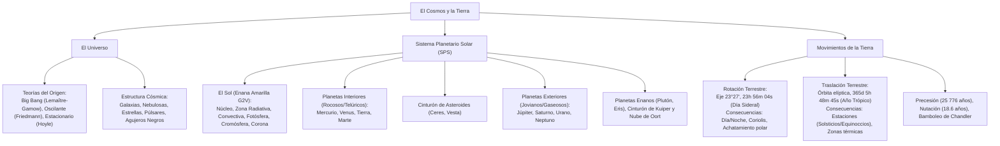

# TEMA 03: El Universo, el Sistema Planetario Solar y la Tierra

---

## 1. FICHA TÉCNICA Y MATRIZ DE COMPETENCIAS

| Parámetro | Detalle |
| :--- | :--- |
| **Área Curricular** | Ciencias Sociales |
| **Eje Temático** | 03. Ciencias Sociales |
| **Asignatura** | Geografía |
| **Tema** | Tema III: El Universo, el Sistema Planetario Solar y la Tierra |
| **Código del Archivo** | `CS-GEO-03` |
| **Ponderación UNSA** | Sociales: $1.584321000$ \| Biomédicas: $0.942150000$ \| Ingenierías: $0.812450000$ |
| **Nivel de Dificultad** | Intermedio - Cosmológico y Geodinámico Terrestre |
| **Prerrequisitos** | Gravitación universal, leyes del movimiento circular, nociones astronómicas básicas |
| **Tiempo de Estudio** | 3.5 horas de estudio conceptual y análisis astronómico |

### Matriz de Aprendizajes Esperados (Estándar UNSA / UNMSM-DECO)
* **Conceptual:** Analizar las teorías sobre el origen y evolución del universo (Big Bang, Universo Oscilante, Estado Estacionario). Comprender la estructura de las galaxias y la evolución estelar. Caracterizar el Sistema Planetario Solar (el Sol, planetas interiores vs. exteriores, planetas enanos y cuerpos menores). Explicar los movimientos terrestres (rotación, traslación, precesión y nutación) y sus consecuencias geográficas.
* **Procedimental:** Interpretar esquemas orbitales planetarios (perihelio, afelio, equinoccios y solsticios), el efecto Coriolis y los cálculos del año trópico y bisiesto.
* **Actitudinal / Crítico:** Reconocer la fragilidad y singularidad de la biósfera terrestre en el contexto cósmico y valorar la exploración espacial como motor de innovación científica.

---

## 2. MAPA TAXONÓMICO Y ONTOLOGÍA



---

## 3. DESARROLLO TEÓRICO FORMAL

### 3.1. El Universo: Origen y Estructura

El Universo es la totalidad del espacio, tiempo, materia y energía existentes.

#### A. Teorías sobre el Origen y Destino del Universo
1. **Teoría de la Gran Explosión o Big Bang (Modelo Estándar / Caos de la Materia):**
   * **Planteamiento:** Propuesta por el sacerdote belga **Georges Lemaître** (hipótesis del "átomo primitivo") y desarrollada por **George Gamow** en 1948.
   * **Fundamento:** Hace aproximadamente $13\,800$ millones de años, toda la materia y energía estaban concentradas en un punto geométrico infinitesimal de densidad y temperatura infinitas llamado **Ylem**. Este punto se expandió violentamente, dando origen al espacio-tiempo.
   * **Pruebas Científicas Irrefutables:**
     * *Efecto Doppler / Corrimiento hacia el rojo (Redshift):* Descubierto por **Edwin Hubble** (1929), quien demostró que las galaxias se alejan unas de otras a velocidades proporcionales a su distancia ($v = H_0 \cdot d$, Ley de Hubble).
     * *Radiación Cósmica de Fondo de Microondas (CMBR):* Descubierta accidentalmente por **Arno Penzias** y **Robert Wilson** (1965) a $2.725\text{ K}$, eco fósil de la radiación liberada $380\,000$ años después del Big Bang.
     * *Abundancia primordial de elementos ligeros:* Hidrógeno ($\approx 75\%$) y Helio ($\approx 24\%$).
2. **Teoría del Universo Oscilante o Pulsante (Big Bounce / Gran Rebote):**
   * **Autor:** **Alexander Friedmann** y **Richard Tolman**.
   * **Fundamento:** Sostiene que la atracción gravitatoria frenará la expansión cósmica, iniciando una contracción catastrófica (**Big Crunch**), tras lo cual se producirá un nuevo Big Bang en un ciclo eterno de expansión y colapso.
3. **Teoría del Estado Estacionario (Creación Continua):**
   * **Autores:** **Fred Hoyle**, **Hermann Bondi** y **Thomas Gold** (1948).
   * **Fundamento:** Principio Cosmológico Perfecto: el universo no tiene principio ni fin; ha existido siempre igual. Para compensar la disminución de densidad por la expansión, se crea materia de la nada continuamente. *Actualmente descartada por el hallazgo del CMBR.*

#### B. Componentes del Universo
* **Galaxias:** Megasistemas de cientos de miles de millones de estrellas, polvo y gas interestelar unidos por la gravedad.
  * *Espirales normales:* Núcleo denso con brazos curvados (e.g., Galaxia de Andrómeda - M31, Vía Láctea).
  * *Espirales barradas:* Presentan una barra central de estrellas de cuyos extremos salen los brazos (e.g., NGC 1300).
  * *Elípticas:* Forma ovalada o esferoidal, compuestas por estrellas viejas con escaso gas libre (e.g., M87).
  * *Irregulares:* Sin simetría definida, ricas en gas joven (e.g., Nubes de Magallanes).
* **Nuestra Galaxia: La Vía Láctea:**
  * Es una galaxia espiral barrada de tipo SBbc con un diámetro de $\approx 100\,000\text{ años luz}$.
  * El Sistema Solar se ubica en el **Brazo de Orión** (o Espolón de Orión), a unos $26\,000 - 28\,000\text{ años luz}$ del centro galáctico, donde reside el agujero negro supermasivo **Sagitario A\***.
  * Periodo de revolución galáctica (Año Cósmico): $\approx 225 - 250\text{ millones de años}$ a $220\text{ km/s}$.
* **Evolución Estelar:**
  * Las estrellas nacen por colapso gravitacional en **nebulosas** de gas y polvo.
  * Fusión nuclear: Convierten Hidrógeno en Helio en su núcleo mediante la cadena protón-protón ($4\,^1\text{H} \to \,^4\text{He} + 2e^+ + 2\nu_e + \gamma$, liberando $26.7\text{ MeV}$).
  * *Estrellas de masa similar al Sol:* Secuencia principal $\to$ Gigante Roja $\to$ Nebulosa Planetaria $\to$ **Enana Blanca** (remanente de carbono-oxígeno).
  * *Estrellas muy masivas ($> 8 M_\odot$):* Supergigante Roja $\to$ Supernova $\to$ **Estrella de Neutrones** (púlsar) o, si superan el límite de Tolman-Oppenheimer-Volkoff ($> 3 M_\odot$ en el núcleo remanente), colapsan hacia una singularidad: **Agujero Negro**.

---

### 3.2. El Sistema Planetario Solar (SPS)

Ubicado en el Brazo de Orión, se formó hace aproximadamente $4\,600\text{ millones de años}$ a partir del colapso de una nebulosa protoestelar (**Hipótesis Nebular de Kant y Laplace**).

#### A. La Estrella Central: El Sol
* **Clasificación:** Enana amarilla de la secuencia principal (tipo espectral G2V). Representa el $99.86\%$ de la masa total del SPS.
* **Estructura Interna:**
  1. **Núcleo:** Donde se produce la fusión termonuclear ($T \approx 15\text{ millones de K}$, presión extrema).
  2. **Zona Radiativa:** La energía viaja lentamente por absorción y reemisión de fotones de alta energía ($X$ y $\gamma$).
  3. **Zona Convectiva:** El plasma caliente asciende por convección, se enfría en la superficie y vuelve a descender.
* **Atmósfera Solar:**
  1. **Fotósfera:** Superficie visible ($T \approx 5\,500 - 6\,000\text{ K}$). Presenta granulación convectiva, **fáculas** (zonas brillantes) y **manchas solares** (zonas más frías a $4\,000\text{ K}$ causadas por intensos campos magnéticos, ciclo de 11 años).
  2. **Cromósfera:** Capa rosácea visible en eclipses totales. Presenta **espículas** y **protuberancias solares**.
  3. **Corona:** Capa externa de plasma tenue y gas ionizado extremadamente caliente ($T \approx 1 - 3\text{ millones de K}$). Origina el **viento solar** (flujo continuo de protones y electrones).

---

#### B. Clasificación y Morfología Planetaria

| Característica | Planetas Interiores (Telúricos / Rocosos) | Planetas Exteriores (Jovianos / Gaseosos) |
| :--- | :--- | :--- |
| **Miembros** | **Mercurio, Venus, Tierra, Marte** | **Júpiter, Saturno, Urano, Neptuno** |
| **Ubicación** | Entre el Sol y el Cinturón de Asteroides | Más allá del Cinturón de Asteroides |
| **Composición** | Silicatos, hierro y níquel (alta densidad: $> 3.9\text{ g/cm}^3$) | Hidrógeno, helio, metano, amoníaco (baja densidad: $< 1.7\text{ g/cm}^3$) |
| **Volumen y Masa** | Pequeños y de baja masa | Gigantescos y de enorme masa gravitatoria |
| **Satélites** | Escasos o nulos (Mercurio 0, Venus 0, Tierra 1, Marte 2) | Muy abundantes (decenas o cientos de satélites) |
| **Sistemas de Anillos** | Ninguno posee anillos | **Todos poseen anillos** (los de Saturno son los más conspicuos) |
| **Periodo de Rotación** | Lentos (días terrestres prolongados) | Rápidos (rotaciones de 10 a 17 horas terrestres) |

##### Particularidades Planetarias Notables:
* **Mercurio:** El más pequeño, carece de atmósfera sustancial, presenta la mayor amplitud térmica diaria ($\Delta T \approx 600^\circ\text{C}$).
* **Venus:** El más caliente ($T \approx 465^\circ\text{C}$) por su asfixiante efecto invernadero ($96\% \text{ CO}_2$). Posee **rotación retrógrada** (de este a oeste) y su día es más largo que su año.
* **Tierra:** Mayor densidad del sistema ($5.515\text{ g/cm}^3$), presencia de agua líquida superficial, tectónica de placas activa y biósfera.
* **Marte:** Planeta Rojo por el óxido de hierro. Alberga el **Monte Olimpo** (el mayor volcán del SPS, $22\text{ km}$ de altura) y dos satélites pequeños: Fobos y Deimos.
* **Júpiter:** El planeta más grande y masivo del SPS ($2.5$ veces la masa de todos los demás juntos). Presenta la **Gran Mancha Roja** (anticiclón gigante) y 4 satélites galileanos: Ío (volcánico), Europa (océano subglaciar), Ganímedes (el más grande del SPS) y Calisto.
* **Saturno:** Menor densidad del SPS ($0.687\text{ g/cm}^3$, flotaría en agua). Majestuoso sistema de anillos de hielo y polvo. Su satélite Titán posee densa atmósfera de nitrógeno y lagos de metano líquido.
* **Urano:** Inclinación axial extrema ($97.8^\circ$, "rueda acostado" en su órbita). Color azul verdoso por el metano.
* **Neptuno:** El más lejano a $\approx 30\text{ UA}$, los vientos más veloces del SPS ($> 2\,000\text{ km/h}$). Su satélite mayor es Tritón (con criovulcanismo de nitrógeno).

---

#### C. Planetas Enanos y Cuerpos Menores
* **Planetas Enanos (Definición UAI Praga, 2006):** Cuerpos que orbitan al Sol, tienen suficiente masa para que su propia gravedad les dé forma casi esférica (equilibrio hidrostático), pero **no han limpiado la vecindad de su órbita** y no son satélites.
  * Miembros reconocidos: **Plutón** (reclasificado en 2006), **Ceres** (en el cinturón de asteroides), **Eris** (el más masivo), **Makemake** y **Haumea**.
* **Cinturón de Kuiper:** Anillo de cuerpos helados más allá de Neptuno ($30 - 55\text{ UA}$), origen de cometas de periodo corto (como el Halley).
* **Nube de Oort:** Esfera hipotética gigante de cometas helados a $2\,000 - 100\,000\text{ UA}$, origen de los cometas de periodo largo.
* **Cometas:** Bloques de hielo sucio, metano y roca que al acercarse al perihelio desarrollan cabellera (coma) y cola impulsada por la radiación y viento solar (la cola siempre apunta en dirección opuesta al Sol).

---

### 3.3. Movimientos de la Tierra y sus Consecuencias Geográficas

#### A. Movimiento de Rotación
Giro que realiza la Tierra sobre su propio eje imaginario.
* **Sentido:** De **Oeste a Este** (sentido antihorario si se observa desde el Polo Norte celeste).
* **Duración:**
  * **Día Sideral:** Tiempo de una rotación completa respecto a una estrella lejana: **$23\text{ h } 56\text{ min } 04\text{ s}$**.
  * **Día Solar Medio:** Tiempo que tarda el Sol en cruzar el mismo meridiano dos veces consecutivas: **$24\text{ horas}$** exactas.
  * **Día Civil:** Convención legal humana de 24 horas contadas desde la medianoche.
* **Velocidad de Rotación:**
  * Máxima en el ecuador: $\approx 1\,670\text{ km/h}$ o $28\text{ km/min}$.
  * Disminuye proporcionalmente al coseno de la latitud: $V = V_0 \cdot \cos(\varphi)$. En los polos ($90^\circ$) es $0\text{ km/h}$.
* **Consecuencias Geográficas Directas:**
  1. **Sucesión del día y la noche:** Regula los ciclos biológicos (ritmos circadianos) y el balance de radiación térmica.
  2. **Determinación de los Puntos Cardinales:** El sol sale por el oriente (Este) y se oculta por el occidente (Oeste).
  3. **Achatamiento polar y ensanchamiento ecuatorial:** Por la fuerza centrífuga acumulada durante eras geológicas.
  4. **Efecto Coriolis:** Fuerza aparente debida a la rotación que desvía la trayectoria de los fluidos (vientos y corrientes marinas):
     * **Hacia la derecha** en el Hemisferio Norte.
     * **Hacia la izquierda** en el Hemisferio Sur.
  5. **Desviación de los cuerpos en caída libre hacia el Este:** Al caer de gran altura, conservan la mayor velocidad inercial lineal de la cota superior.
  6. **Movimiento aparente de la bóveda celeste y del Sol.**

---

#### B. Movimiento de Traslación
Desplazamiento orbital de la Tierra alrededor del Sol describiendo una trayectoria elíptica (**Primera Ley de Kepler**).
* **Parámetros Orbitales:**
  * Longitud de la órbita: $\approx 930\text{ millones de km}$.
  * Radio medio: $1\text{ Unidad Astronómica (UA)} \approx 149\,597\,870.7\text{ km} \approx 150\text{ millones de km}$.
  * **Perihelio:** Punto de máximo acercamiento al Sol ($\approx 147\text{ millones de km}$, ocurre a inicios de enero). Mayor velocidad orbital ($\approx 30.3\text{ km/s}$).
  * **Afelio:** Punto de máximo alejamiento del Sol ($\approx 152\text{ millones de km}$, ocurre a inicios de julio). Menor velocidad orbital ($\approx 29.3\text{ km/s}$, Segunda Ley de Kepler).
* **Duración:**
  * **Año Trópico (Solar):** Tiempo exacto entre dos pasos consecutivos por el equinoccio de primavera: **$365\text{ días, } 5\text{ h, } 48\text{ min, } 45\text{ s}$**.
  * **Año Bisiesto:** Cada 4 años se acumula el excedente de $\approx 6\text{ horas}$ ($6 \times 4 = 24\text{ h}$), sumando un día adicional al mes de febrero ($366\text{ días}$). Regla gregoriana: divisible entre 4, excepto fines de siglo que no sean divisibles entre 400.
* **Consecuencias Geográficas Directas:**
  1. **Las Estaciones del Año:** Causadas por la **conjunción de la traslación y la inclinación invariable de $23^\circ 27'$ del eje terrestre**:
     * **Equinoccios (Rayos solares perpendiculares en el Ecuador a $0^\circ$):**
       * *21 de marzo:* Otoño austral / Primavera boreal.
       * *23 de setiembre:* Primavera austral / Otoño boreal.
       * Días y noches tienen idéntica duración ($12\text{ horas}$) en todo el planeta.
     * **Solsticios (Rayos solares perpendiculares en los Trópicos a $23^\circ 27'$):**
       * *21 de junio:* Solsticio de Invierno en el hemisferio sur (rayos en Cáncer). Noche más larga en el Perú.
       * *21-22 de diciembre:* Solsticio de Verano en el hemisferio sur (rayos en Capricornio). Día más largo en el Perú.
  2. **Zonas Térmicas de la Tierra:** Cálida o intertropical (entre trópicos), templadas (entre trópicos y círculos polares) y frías o polares (dentro de los círculos polares).
  3. **Sol de Medianoche:** Ocurre dentro de los círculos polares durante sus respectivos veranos solsticiales.

---

## 4. FORMULARIO MAESTRO / CUADRO SINÓPTICO

### Cuadro Sinóptico de Estaciones y Puntos Astronómicos

| Evento Astronómico | Fecha Aproximada | Cenit Solar (Rayos a $90^\circ$) | Estación Hemisferio Sur | Estación Hemisferio Norte | Duración Día/Noche en Perú |
| :--- | :--- | :--- | :--- | :--- | :--- |
| **Solsticio de Junio** | 21 de junio | Trópico de Cáncer ($23^\circ 27'\text{ N}$) | **Invierno** | Verano | Noche más larga del año |
| **Equinoccio de Setiembre**| 23 de setiembre | Ecuador ($0^\circ$) | **Primavera** | Otoño | Día = Noche ($12\text{ h}$) |
| **Solsticio de Diciembre** | 21-22 de diciembre| Trópico de Capricornio ($23^\circ 27'\text{ S}$)| **Verano** | Invierno | Día más largo del año |
| **Equinoccio de Marzo** | 21 de marzo | Ecuador ($0^\circ$) | **Otoño** | Primavera | Día = Noche ($12\text{ h}$) |

---

## 5. MNEMOTECNIAS DE COMBATE PREUNIVERSITARIO

### Mnemotecnia 1: Orden de los Planetas desde el Sol
**"Mi Vecina Tiene Manías: Jamás Sabe Usar Nada"**
* **M**i $\rightarrow$ **M**ercurio
* **V**ecina $\rightarrow$ **V**enus
* **T**iene $\rightarrow$ **T**ierra
* **M**anías $\rightarrow$ **M**arte
* *(Cinturón de Asteroides)*
* **J**amás $\rightarrow$ **J**úpiter
* **S**abe $\rightarrow$ **S**aturno
* **U**sar $\rightarrow$ **U**rano
* **N**ada $\rightarrow$ **N**eptuno

### Mnemotecnia 2: Efecto Coriolis
**"Sur-Izquierda, Norte-Derecha" $\rightarrow$ "SINDI"**
* **S**ur $\rightarrow$ **I**zquierda
* **N**orte $\rightarrow$ **D**erecha

*Aplicación:* Los huracanes giran en sentido antihorario en el hemisferio norte y horario en el hemisferio sur debido a esta desviación.

---

## 6. TÉCNICAS Y ARTIFICIOS DE RESOLUCIÓN (HACKING PREUNIVERSITARIO)

1. **La Verdadera Causa de las Estaciones:**
   * Pregunta trampa recurrente: *¿Las estaciones se deben a la cercanía o lejanía de la Tierra al Sol (perihelio/afelio)?*
   * **¡Falso absoluto!** La Tierra está en el **perihelio** (más cerca del Sol) en **enero**, cuando es pleno **invierno** en el hemisferio norte.
   * La causa real es la **inclinación del eje terrestre ($23^\circ 27'$) combinada con la traslación**, lo que determina el ángulo de incidencia de los rayos solares.
2. **Diferencia entre Rotación y Traslación en Preguntas de Examen:**
   * Si la pregunta involucra **horarios, minutos, brújula, remolinos, desvío de vientos o sucesión día/noche** $\rightarrow$ Marca **Rotación**.
   * Si involucra **cambios de temperatura a lo largo de meses, duración desigual de luz estacional, calendarios o solsticios** $\rightarrow$ Marca **Traslación**.

---

## 7. ZONA DE TRAMPAS Y DISTRACTORES ("¡PELIGRO EXAMEN!")

* ⚠️ **Trampa 1: El planeta más caliente no es Mercurio:**
  * Pese a que Mercurio es el más próximo al Sol, el planeta más caliente es **Venus** ($465^\circ\text{C}$ de media) debido a su atmósfera ultra densa de dióxido de carbono que genera un efecto invernadero desbocado.
* ⚠️ **Trampa 2: Rotación retrógrada:**
  * Casi todos los planetas giran en sentido antihorario (de oeste a este), excepto **Venus** y **Urano**, que presentan rotación retrógrada (de este a oeste).
* ⚠️ **Trampa 3: Planetas con anillos:**
  * Saturno tiene los anillos más visibles y brillantes, pero **los cuatro planetas exteriores (Júpiter, Saturno, Urano y Neptuno) poseen sistemas de anillos**.

---

## 8. APLICACIÓN AL MUNDO REAL Y CONTEXTO DECO

### Caso de Estudio DECO: El Puerto Espacial de Talara y la Ventaja Ecuatorial de Rotación
El gobierno del Perú y la Fuerza Aérea (FAP) han impulsado el proyecto del **Puerto Espacial de Talara (Spaceport)** en Piura:
1. **Fundamento Físico-Geográfico:** La velocidad lineal tangencial debida a la rotación terrestre es máxima en las cercanías de la línea ecuatorial ($V \approx 1\,670\text{ km/h}$).
2. **Ventaja Orbital:** Talara ($04^\circ 34'\text{ S}$) se halla en una posición geodésica privilegiada. Lanzar cohetes espaciales hacia el Este desde latitudes casi ecuatoriales permite aprovechar al máximo el impulso inercial de la Tierra, ahorrando hasta un $30\%$ de combustible propelente en comparación con cosmódromos ubicados en latitudes altas (como Cabo Cañaveral o Baikonur).

---

## 9. BANCO DE 5 EJERCICIOS RESUELTOS GRADUADOS

### Ejercicio 1 (Nivel 1 - Básico Formativo: Planetas del Sistema Solar)
**Enunciado:**
El planeta del Sistema Planetario Solar que posee la mayor densidad media ($5.515\text{ g/cm}^3$), atmósfera rica en nitrógeno y oxígeno, y un satélite natural cuyo diámetro es aproximadamente un cuarto del propio cuerpo primario, es:
* A) Marte
* B) Mercurio
* C) Venus
* D) La Tierra
* E) Júpiter

**Solución Paso a Paso:**
1. Analizamos los datos: densidad de $5.515\text{ g/cm}^3$ (la mayor de todos los planetas del SPS), atmósfera con $78\%$ de nitrógeno y $21\%$ de oxígeno, y un satélite (la Luna) de masa y diámetro inusualmente grandes en proporción a su planeta.
2. Todas estas características corresponden inequívocamente a **La Tierra**.
* **Respuesta Correcta:** **D**

---

### Ejercicio 2 (Nivel 2 - Intermedio UNSA Ordinario: Consecuencias de la Rotación)
**Enunciado:**
Debido a la fuerza inercial originada por la rotación terrestre, conocida como Efecto Coriolis, las masas de aire y corrientes marinas experimentan una desviación en su trayectoria rectilínea. Al respecto, señale la alternativa correcta:
* A) Se desvían hacia la izquierda en el hemisferio norte y hacia la derecha en el sur.
* B) Se desvían hacia la derecha en el hemisferio norte y hacia la izquierda en el sur.
* C) Se desvían exclusivamente de sur a norte sin importar el hemisferio.
* D) Anulan totalmente su velocidad lineal sobre la línea del Ecuador.
* E) Se dirigen verticalmente hacia el centro de gravedad del planeta.

**Solución Paso a Paso:**
1. El físico francés Gaspard-Gustave de Coriolis demostró que en un sistema en rotación, los cuerpos en movimiento libre se desvían de su trayectoria lineal.
2. En la Tierra:
   * Hemisferio Norte $\rightarrow$ Desviación hacia la **derecha**.
   * Hemisferio Sur $\rightarrow$ Desviación hacia la **izquierda**.
* **Respuesta Correcta:** **B**

---

### Ejercicio 3 (Nivel 3 - Avanzado UNMSM DECO: Solsticios y Duración del Día)
**Enunciado:**
Un grupo de estudiantes de geografía en Arequipa ($16^\circ\text{ S}$) organiza una vigilia astronómica durante la noche del 21 de junio. Según las leyes de la traslación terrestre y la mecánica de las estaciones, ¿qué fenómeno astronómico y ambiental experimentarán en dicha fecha?
* A) El solsticio de verano, con el día más largo y cálido del año.
* B) El equinoccio de otoño, donde el día y la noche duran exactamente doce horas.
* C) El solsticio de invierno, coincidiendo con la noche más larga del año en el hemisferio sur.
* D) El paso de la Tierra por el afelio, provocando la noche polar perpetua en el trópico.
* E) El ocultamiento del Sol exactamente en el cenit de la plaza de Arequipa.

**Solución Paso a Paso:**
1. El 21 de junio se produce el **solsticio de junio**, en el cual los rayos solares inciden perpendicularmente sobre el Trópico de Cáncer ($23^\circ 27'\text{ N}$).
2. Para el hemisferio sur (donde se ubica Arequipa a $16^\circ\text{ S}$), esto marca el inicio formal del **invierno astronómico**.
3. Como el polo sur geográfico se encuentra inclinado en dirección opuesta al Sol, el hemisferio sur recibe la menor insolación del año, registrándose **la noche más larga y el día más corto del año**.
* **Respuesta Correcta:** **C**

---

### Ejercicio 4 (Nivel 4 - Crítico / Interdisciplinario UNI: Mecánica Orbital y Calendarios)
**Enunciado:**
La duración exacta del año trópico o solar terrestre es de $365\text{ días, } 5\text{ horas, } 48\text{ minutos y } 45\text{ segundos}$. Si el calendario civil ordinario consta únicamente de $365\text{ días}$ exactos, el desajuste temporal acumulado exige la inserción de años bisiestos ($366\text{ días}$). ¿Cuál fue la reforma astronómica que corrigió el error acumulativo del calendario juliano dictaminando que los años seculares solo serían bisiestos si eran divisibles entre 400?
* A) La Reforma del Concilio de Nicea (325 d.C.)
* B) La Reforma del Calendario Gregoriano (1582) por el papa Gregorio XIII
* C) La Conferencia Geodésica de Washington (1884)
* D) La Resolución de la Unión Astronómica Internacional de Praga (2006)
* E) El Sistema de Kepler sobre las órbitas elípticas (1609)

**Solución Paso a Paso:**
1. El calendario juliano (instaurado por Julio César en el 46 a.C.) asumía que el año duraba exactamente $365.25\text{ días}$ (agregando un bisiesto cada 4 años sin excepción). Esto generaba un desfase de $11\text{ minutos y } 15\text{ segundos}$ por año (1 día cada 128 años).
2. Para corregir este adelanto, en 1582 el papa **Gregorio XIII**, asesorado por los astrónomos Luis Lilio y Cristóbal Clavio, promulgó la bula *Inter gravissimas*, suprimiendo 10 días de golpe y estableciendo la regla gregoriana: los años múltiplos de 100 solo son bisiestos si son divisibles entre 400 (por ello, 1600 y 2000 fueron bisiestos, pero 1700, 1800 y 1900 no lo fueron).
* **Respuesta Correcta:** **B**

---

### Ejercicio 5 (Nivel 5 - Boss Challenge: Cosmología, Expansión y Termodinámica)
**Enunciado:**
Lea atentamente el siguiente fragmento científico:
*"En 1965, Arno Penzias y Robert Wilson calibraban una antena de cuerno ultrasensible en los laboratorios Bell cuando detectaron un ruido estático isotrópico y constante en la banda de microondas que no provenía de ninguna fuente galáctica identificable. Mediciones posteriores confirmaron que este resplandor corresponde a un cuerpo negro térmico que llena el cosmos a una temperatura de $2.725\text{ K}$, emitido en la época de la recombinación cuando los electrones y protones formaron los primeros átomos neutros de hidrógeno, permitiendo que los fotones viajaran libremente por el espacio".*

A partir del texto y sus conocimientos de astronomía preuniversitaria, determine qué proposiciones son correctas:
I. El hallazgo constituyó la prueba definitiva que invalidó la teoría del Estado Estacionario de Hoyle.  
II. La radiación descrita demuestra que el universo primitivo era opaco, caliente y extremadamente denso.  
III. La temperatura observada de $2.725\text{ K}$ se debe a que la radiación original no ha sufrido corrimiento al rojo durante la expansión cósmica.  
IV. El descubrimiento respalda el modelo del Big Bang planteado originalmente en sus bases teóricas por Lemaître y Gamow.

* A) I, II y III
* B) I, II y IV
* C) II y IV
* D) Solo I y IV
* E) I, II, III y IV

**Solución Paso a Paso:**
1. **Evaluación de I:** La teoría del Estado Estacionario postulaba que el universo carecía de un principio temporal y que no existía ninguna radiación fósil residual. El hallazgo del Fondo Cósmico de Microondas (CMBR) refutó sus bases. (Verdadero).
2. **Evaluación de II:** Antes de la recombinación ($380\,000$ años tras el Big Bang), el universo era un plasma ionizado opaco a la luz; cuando se enfrió a unos $3\,000\text{ K}$, los fotones se desacoplaron, viajando en todas direcciones. (Verdadero).
3. **Evaluación de III:** La radiación fue emitida originalmente a cerca de $3\,000\text{ K}$. Si hoy se mide a apenas $2.725\text{ K}$ (cerca del cero absoluto), es **precisamente debido al corrimiento al rojo cosmológico provocado por la expansión del espacio**, que estiró la longitud de onda de los fotones a lo largo de $13\,800$ millones de años. (Falso).
4. **Evaluación de IV:** Lemaître predijo el inicio puntual del cosmos y Gamow dedujo teóricamente en 1948 que debía existir un remanente térmico microondular del Big Bang. (Verdadero).
* Conclusión: Son correctas I, II y IV.
* **Respuesta Correcta:** **B**

---

## 10. GLOSARIO DE 10 TÉRMINOS CLAVE

1. **Ylem:** Nombre dado por George Gamow a la sustancia primigenia concentrada de temperatura, densidad y energía infinitas previa a la Gran Explosión.
2. **Redshift (Corrimiento al Rojo):** Desplazamiento de las líneas espectrales de un cuerpo celeste hacia longitudes de onda mayores por efecto Doppler, indicando que se aleja del observador.
3. **Radiación Cósmica de Fondo (CMBR):** Radiación térmica residual en el espectro de microondas que baña todo el universo, evidencia fósil del Big Bang.
4. **Unidad Astronómica (UA):** Medida de distancia equivalente al radio medio de la órbita terrestre alrededor del Sol ($149\,597\,870.7\text{ km}$, aprox. $150\text{ millones de km}$).
5. **Perihelio:** Punto de la órbita de un planeta o cometa en el cual se encuentra a la mínima distancia del Sol.
6. **Afelio:** Punto orbital de máxima distancia respecto al Sol, donde la velocidad de traslación del planeta es mínima.
7. **Equinoccio:** Momento del año en que el Sol se sitúa en el plano del ecuador celeste, haciendo que el día y la noche tengan igual duración en toda la Tierra.
8. **Solsticio:** Momento del año en que el Sol alcanza su máxima declinación boreal o austral respecto al ecuador celeste, marcando el inicio del verano o invierno.
9. **Efecto Coriolis:** Fuerza aparente generada por la rotación terrestre que desvía los fluidos hacia la derecha en el hemisferio norte y hacia la izquierda en el sur.
10. **Planeta Enano:** Cuerpo celeste que orbita al Sol y posee suficiente masa para tener forma casi esférica, pero que no ha despejado la vecindad de su órbita.

---

## 11. BANCO DE FLASHCARDS (Q/A)

* **PREGUNTA:** ¿Quién formuló la hipótesis del átomo primitivo y quién desarrolló la teoría del Big Bang en 1948?
  * **RESPUESTA:** Georges Lemaître (átomo primitivo) y George Gamow (modelo formal del Big Bang).
* **PREGUNTA:** ¿Cuáles son las dos grandes evidencias empíricas que sustentan el modelo del Big Bang?
  * **RESPUESTA:** La recesión de las galaxias comprobada por el corrimiento al rojo (Ley de Hubble) y la Radiación Cósmica de Fondo de Microondas (Penzias y Wilson).
* **PREGUNTA:** ¿En qué brazo espiral de la Vía Láctea se localiza el Sistema Planetario Solar?
  * **RESPUESTA:** En el Brazo de Orión (Espolón de Orión).
* **PREGUNTA:** ¿Cuál es el planeta más caliente del Sistema Solar y cuál es la causa?
  * **RESPUESTA:** Venus ($465^\circ\text{C}$ de media), debido al efecto invernadero extremo producido por su atmósfera de $96\% \text{ CO}_2$.
* **PREGUNTA:** ¿Cuáles son las dos características que diferencian a los planetas interiores de los exteriores?
  * **RESPUESTA:** Los interiores son rocosos, densos y pequeños; los exteriores son gigantescos, gaseosos, ligeros y poseen anillos.
* **PREGUNTA:** ¿Cuánto dura exactamente un día sideral terrestre?
  * **RESPUESTA:** $23\text{ horas, } 56\text{ minutos y } 04\text{ segundos}$.
* **PREGUNTA:** ¿Cuál es la causa astronómica fundamental de la existencia de las estaciones del año?
  * **RESPUESTA:** La inclinación de $23^\circ 27'$ del eje terrestre combinada con el movimiento de traslación alrededor del Sol.
* **PREGUNTA:** ¿Hacia dónde desvía el Efecto Coriolis a los vientos en el Hemisferio Sur?
  * **RESPUESTA:** Hacia la izquierda de su trayectoria de desplazamiento.
* **PREGUNTA:** ¿Qué fecha corresponde al solsticio de invierno en el Perú y qué característica lumínica presenta?
  * **RESPUESTA:** El 21 de junio; presenta la noche más prolongada y el día con menor luz solar del año.
* **PREGUNTA:** ¿Por qué Plutón fue reclasificado a planeta enano por la UAI en 2006?
  * **RESPUESTA:** Porque no ha limpiado gravitacionalmente la vecindad de su órbita en el Cinturón de Kuiper.

---

## 12. MOTOR DE GAMIFICACIÓN (JSON NATIVO KMP)

```json
{
  "subjectCode": "GEO",
  "subjectName": "Geografía",
  "topicId": "GEO-03",
  "topicTitle": "El Universo, el Sistema Planetario Solar y la Tierra",
  "totalXP": 280,
  "difficulty": "INTERMEDIO",
  "unsaWeight": 1.584321,
  "badges": [
    {
      "id": "BADGE_GEO_ASTROFISICO",
      "title": "Astrofísico del Cosmos",
      "description": "Comprendiste los misterios del Big Bang, la radiación de fondo y la evolución estelar galáctica.",
      "icon": "supernova_burst"
    },
    {
      "id": "BADGE_GEO_PILOTO_ORBITAL",
      "title": "Comandante de Órbitas Terrestres",
      "description": "Dominas con precisión milimétrica los solsticios, equinoccios y la cinemática del efecto Coriolis.",
      "icon": "earth_orbit_sun"
    }
  ],
  "missions": [
    {
      "missionId": "GEO_M1_COSMOLOGIA",
      "title": "El Enigma del Big Bang",
      "requiredPoints": 100,
      "xpReward": 100,
      "task": "Diferenciar las hipótesis de Lemaître, Gamow, Friedmann y Hoyle ante reactivos tipo DECO."
    },
    {
      "missionId": "GEO_M2_PLANETAS",
      "title": "Raid Planetario del SPS",
      "requiredPoints": 90,
      "xpReward": 90,
      "task": "Identificar sin equivocación las anomalías de rotación de Venus, el vulcanismo marciano y los satélites jovianos."
    },
    {
      "missionId": "GEO_M3_ESTACIONES",
      "title": "Mecánica de Solsticios y Equinoccios",
      "requiredPoints": 90,
      "xpReward": 90,
      "task": "Determinar la duración del día solar, inclinación cenital y fecha de solsticios en hemisferios opuestos."
    }
  ],
  "questions": [
    {
      "id": "GEO_Q1",
      "type": "SINGLE_CHOICE",
      "question": "¿Cuál es la causa principal de que en la Tierra se produzca la sucesión de las cuatro estaciones del año?",
      "options": [
        "La distancia cambiante de la Tierra al Sol entre el perihelio y el afelio",
        "La inclinación de 23°27' del eje terrestre conjugada con el movimiento de traslación",
        "La aceleración de Coriolis que frena los vientos alisios durante el verano",
        "El ciclo magnético de 11 años de las manchas de la fotósfera solar",
        "La precesión de los equinoccios cada 25 776 años"
      ],
      "correctIndex": 1,
      "explanation": "Las estaciones se deben a la inclinación fija de 23°27' del eje terrestre respecto a la normal del plano orbital, lo cual varía el ángulo de incidencia de los rayos solares a lo largo de la traslación."
    },
    {
      "id": "GEO_Q2",
      "type": "SINGLE_CHOICE",
      "question": "Planeta del Sistema Solar que rota en sentido retrógrado (de este a oeste) y cuya temperatura superficial es la más elevada debido a un desbocado efecto invernadero:",
      "options": [
        "Mercurio",
        "Marte",
        "Venus",
        "Urano",
        "Júpiter"
      ],
      "correctIndex": 2,
      "explanation": "Venus rota de este a oeste y cuenta con una atmósfera densísima de dióxido de carbono que eleva su temperatura media a unos 465°C."
    }
  ]
}
```
