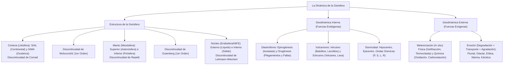

# TEMA 04: Geósfera y Geodinámica Interna y Externa

---

## 1. FICHA TÉCNICA Y MATRIZ DE COMPETENCIAS

| Parámetro | Detalle |
| :--- | :--- |
| **Área Curricular** | Ciencias Sociales |
| **Eje Temático** | 03. Ciencias Sociales |
| **Asignatura** | Geografía |
| **Tema** | Tema IV: Geósfera y Geodinámica Interna y Externa |
| **Código del Archivo** | `CS-GEO-04` |
| **Ponderación UNSA** | Sociales: $1.584321000$ \| Biomédicas: $0.942150000$ \| Ingenierías: $0.812450000$ |
| **Nivel de Dificultad** | Avanzado - Geológico, Tectónico y Morfogenético |
| **Prerrequisitos** | Nociones de física ondulatoria, mecánica de fluidos, química de minerales |
| **Tiempo de Estudio** | 4.0 horas de asimilación teórica y análisis geomorfológico |

### Matriz de Aprendizajes Esperados (Estándar UNSA / UNMSM-DECO / UNI)
* **Conceptual:** Identificar la estructura concéntrica de la geósfera (corteza, manto y núcleo) y sus discontinuidades sísmicas primarias y secundarias. Diferenciar los procesos endógenos constructores de relieve (diastrofismo: orogénesis y epirogénesis; vulcanismo y sismicidad) de los procesos exógenos modeladores (meteorización física/química y fases de degradación-agradación en la erosión).
* **Procedimental:** Explicar la tectónica de placas en el borde convergente peruano (subducción de la Placa de Nazca bajo la Sudamericana) y clasificar las geoformas resultantes de la erosión fluvial, eólica, glaciar, marina y kárstica.
* **Actitudinal / Crítico:** Evaluar la vulnerabilidad sísmica y volcánica del sur peruano (Arequipa, Moquegua, Tacna), promoviendo una cultura de gestión prospectiva del riesgo de desastres.

---

## 2. MAPA TAXONÓMICO Y ONTOLOGÍA



---

## 3. DESARROLLO TEÓRICO FORMAL

### 3.1. Estructura Interna de la Geósfera

La geósfera es la porción mineral y sólida del planeta Tierra. Su estudio se realiza mediante métodos directos (perforaciones petrolíferas de hasta $\approx 12.3\text{ km}$ en la península de Kola, erupciones volcánicas) y métodos indirectos (análisis de la propagación y refracción de las **ondas sísmicas P y S**, gravimetría y geomagnetismo).

#### A. Las Capas Concéntricas de la Tierra
1. **La Corteza Terrestre (Litósfera u Oxiesfera):**
   * Es la capa más superficial, delgada y fría ($1\%$ del volumen terrestre).
   * Se divide en dos subcapas:
     * **SIAL (Corteza Continental):** Compuesta predominantemente por **Silicio y Aluminio**. Rocas ácidas graníticas. Constituye la base de los continentes y cordilleras. Densidad media: $2.7\text{ g/cm}^3$.
     * *Discontinuidad de Conrad:* Separa el SIAL del SIMA.
     * **SIMA (Corteza Oceánica):** Compuesta por **Silicio y Magnesio**. Rocas básicas basálticas. Forma el fondo oceánico y sirve de soporte al SIAL. Densidad media: $3.0\text{ g/cm}^3$.
2. **El Manto Terrestre (Mesósfera):**
   * Capa intermedia que representa el **$82\%$ del volumen** y el $65\%$ de la masa terrestre.
   * Compuesto por silicatos de hierro y magnesio (peridotita).
   * Se divide en:
     * **Manto Superior (Astenósfera):** Estado plástico/semifluido ($T \approx 1\,500 - 2\,000^\circ\text{C}$). En él ocurren las **corrientes de convección del magma**, motor térmico que desplaza a las placas tectónicas.
     * *Discontinuidad de Repetti:* Separa el Manto Superior del Manto Inferior.
     * **Manto Inferior (Pirósfera):** Estado sólido de alta densidad, rico en óxidos densos de silicio y magnesio.
3. **El Núcleo Terrestre (Endósfera, Barósfera, Siderósfera o NIFE):**
   * Ocupa el centro geocéntrico ($16\%$ del volumen, pero más del $30\%$ de la masa).
   * Compuesto fundamentalmente por **Níquel y Hierro (NIFE)**.
   * Se divide en:
     * **Núcleo Externo:** Estado **líquido** ($T \approx 4\,000 - 5\,000^\circ\text{C}$). La circulación de hierro líquido conductor genera el **campo magnético terrestre** (efecto dínamo o magnetósfera). Las ondas S no lo atraviesan.
     * *Discontinuidad de Lehmann-Wiechert:* Separa el Núcleo Externo del Núcleo Interno.
     * **Núcleo Interno:** Estado **sólido metálico** debido a la colosal presión litostática ($> 3.5\text{ millones de atm}$), con temperaturas cercanas a los $6\,000^\circ\text{C}$ (similares a la fotósfera solar).

#### B. Las Discontinuidades Sísmicas
Son zonas de transición abrupta en la velocidad y dirección de las ondas sísmicas debido al cambio de densidad y composición de los materiales:
* **Discontinuidades de Primer Orden (Mayores):**
  1. **Mohorovičić:** Límite entre la **Corteza** y el **Manto** ($\approx 30 - 70\text{ km}$ bajo continentes).
  2. **Gutenberg:** Límite entre el **Manto** y el **Núcleo** ($\approx 2\,900\text{ km}$ de profundidad).
* **Discontinuidades de Segundo Orden (Menores):**
  1. **Conrad:** Límite entre **SIAL** y **SIMA**.
  2. **Repetti:** Límite entre **Manto Superior** y **Manto Inferior** ($\approx 700\text{ km}$).
  3. **Lehmann-Wiechert:** Límite entre **Núcleo Externo** y **Núcleo Interno** ($\approx 5\,150\text{ km}$).

---

### 3.2. Geodinámica Interna (Fuerzas Endógenas)

Procesos impulsados por la energía geotérmica del interior terrestre y las corrientes de convección del manto que **construyen relieve** y elevan la corteza.

#### A. Tectónica de Placas
* **Teoría de la Deriva Continental (Alfred Wegener, 1912):** Planteó que hace 250 millones de años los continentes formaban un supercontinente llamado **Pangea** rodeado por el océano **Panthalassa**. Argumentó pruebas paleontológicas (fósiles de *Mesosaurus* y *Glossopteris*), morfológicas (encaje Sudamérica-África) y paleoclimáticas.
* **Teoría de la Expansión del Fondo Oceánico (Harry Hess, 1962):** El magma asciende por las dorsales oceánicas, generando nueva corteza marina que empuja los fondos.
* **Tipos de Límites de Placas:**
  1. **Límites Divergentes (Constructivos):** Dos placas se separan. Se forma magma nuevo en dorsales oceánicas (Dorsal Mesoatlántica) o rifts continentales (Rift Valley africano).
  2. **Límites Convergentes (Destructivos):** Dos placas colisionan:
     * *Subducción (Oceánica bajo Continental):* La placa oceánica más densa se hunde en la astenósfera, generando fosas marinas profundas, sismicidad y cordilleras volcánicas (e.g., Placa de Nazca subduciendo bajo la Placa Sudamericana, formando la **Cordillera de los Andes**).
     * *Colisión Continental (Obducción):* Dos placas continentales chocan, arrugando la corteza sin subducción profunda y formando cadenas colosales (e.g., Placa Índica contra Placa Euroasiática $\to$ **Himalaya**).
  3. **Límites Transformantes (Conservativos):** Desplazamiento lateral tangencial sin creación ni destrucción de corteza (e.g., **Falla de San Andrés** en California).

#### B. Diastrofismo
1. **Epirogénesis (Movimientos Verticales Continentales):**
   * Fuerzas radiales ascendentes o descendentes de gran radio de curvatura que afectan a masas continentales estables (cratones o escudos).
   * Regulados por la **Isostasia** (equilibrio gravitacional hidrostático de la corteza flotando sobre el manto denso, formulada por Airy y Pratt).
   * *Consecuencias:* Formación de acantilados escalonados, emersión de **tablazos** (playas fósiles levantadas con reservas petrolíferas en la costa norte peruana: Zorritos, Lobitos, La Brea y Pariñas).
2. **Orogénesis (Movimientos Horizontales y Compresivos):**
   * Fuerzas tectónicas que pliegan o fracturan la corteza en zonas geosinclinales, originando montañas y cordilleras.
   * **Plegamientos:** Si las rocas son plásticas y sedimentarias:
     * *Anticlinal:* Porción convexa o arqueada hacia arriba (origina cumbres y montañas).
     * *Sinclinal:* Porción cóncava o arqueada hacia abajo (origina valles y depresiones).
   * **Fallamientos:** Si las rocas son rígidas, se quiebran y desplazan a lo largo de un plano de falla:
     * *Horst (Pilar tectónico):* Bloque elevado entre dos fallas normales (forma mesetas y mesetas altiplánicas).
     * *Graben (Fosa tectónica):* Bloque hundido entre dos fallas normales (alberga lagos como el **Titicaca** o el Mar Muerto).

#### C. Vulcanismo o Magmatismo
* **Vulcanismo Intrusivo (Plutónico):** El magma se consolida y enfría lentamente en el interior de la corteza:
  * *Batolito:* Masa intrusiva de escala regional gigantesca ($> 100\text{ km}^2$), base de las cordilleras (e.g., Batolito de la Costa del Perú).
  * *Lacolito:* Hongo magmático que levanta los estratos superiores.
  * *Dique:* Masa tabular que corta verticalmente los estratos rocosos.
  * *Sill (Manto):* Lámina magmática consolidada horizontalmente entre estratos.
* **Vulcanismo Extrusivo (Volcánico):** El magma alcanza la superficie a través de chimeneas y cráteres expulsando lava, cenizas, lapilli y gases piroclásticos.
  * Tipos de volcanes peruanos: Estratovolcanes andesíticos (Ubinas, Sabancaya, Misti, Coropuna, Tutupaca).

#### D. Sismicidad
* **Definición:** Liberación repentina de energía elástica acumulada en las rocas a lo largo de una falla por deformación tectónica (**Teoría del Rebote Elástico de Reid**).
* **Puntos Clave:**
  * **Hipocentro (Foco):** Punto en el interior de la geósfera donde se inicia la fractura y ruptura de rocas.
  * **Epicentro:** Punto de la superficie terrestre ubicado en la vertical sobre el hipocentro, donde el sismo se siente con mayor intensidad y primero.
* **Ondas Sísmicas:**
  * *Ondas de Cuerpo (Internas):*
    * **Ondas P (Primarias / Longitudinales):** Compresionales, las más veloces ($V \approx 6 - 8\text{ km/s}$), viajan a través de sólidos y líquidos.
    * **Ondas S (Secundarias / Transversales):** De cizalla o corte, más lentas ($V \approx 3.5 - 4.5\text{ km/s}$), **solo viajan a través de sólidos**. No atraviesan el núcleo externo.
  * *Ondas Superficiales (Provocan los daños en superficie):*
    * **Ondas Rayleigh (R):** Movimiento elíptico retrógrado (similar a olas marinas).
    * **Ondas Love (L):** Movimiento horizontal serpentino de vaivén perpendicular a la dirección de propagación. Son las más destructivas para las estructuras de ingeniería.
* **Escalas de Medición:**
  * **Escala de Richter (Magnitud Local - $M_L$ / Magnitud de Momento - $M_w$):** Mide la **energía liberada** en el hipocentro mediante sismógrafos. Es una escala logarítmica cuantitativa abierta (un aumento de 1 grado representa $\approx 31.6$ veces más energía liberada).
  * **Escala de Mercalli Modificada (Intensidad):** Mide los **efectos, daños y percepción humana** en la superficie. Escala cualitativa cerrada en números romanos del **I al XII** (I: imperceptible; XII: catástrofe total).

---

### 3.3. Geodinámica Externa (Fuerzas Exógenas)

Procesos impulsados por la radiación solar y la gravedad que **destruyen, desgastan, modelan y nivelan el relieve terrestre** a través del intemperismo y la erosión.

#### A. Meteorización (Intemperismo)
Destrucción, desintegración y alteración físico-química de las rocas *in situ* (sin transporte de materiales):
1. **Meteorización Mecánica o Física:** Desintegra la roca en fragmentos menores sin alterar su composición mineralógica:
   * *Gelifracción o Crioclastia:* El agua se infiltra en las fisuras, se congela aumentando su volumen en un $9\%$ y fractura la roca (típica de la región Puna y Janca).
   * *Termoclastia:* Dilatación y contracción térmica diferencial entre el día y la noche en zonas desérticas.
   * *Haloclastia:* Crecimiento de cristales de sal en los poros rocosos.
   * *Bioclastia:* Fracturación por crecimiento de raíces de árboles.
2. **Meteorización Química:** Modifica y descompone la estructura química de los minerales de la roca:
   * *Oxidación:* Reacción del oxígeno disuelto con minerales ricos en hierro (formación de hematita y limonita de color rojizo/amarillento).
   * *Carbonatación:* El agua combinada con dióxido de carbono ($H_2CO_3$) disuelve rocas calcáreas (calizas).
   * *Hidratación y Disolución:* Incorporación de moléculas de agua a la red cristalina de minerales como el sulfato de calcio.

#### B. Erosión (Modelado del Relieve)
Proceso dinámico que comprende tres fases secuenciales: **Degradación** (desgaste y remoción) $\to$ **Transporte** (acarreo) $\to$ **Agradación o Sedimentación** (depósito).

| Agente Erosivo | Geoformas por Degradación (Desgaste) | Geoformas por Agradación (Sedimentación) |
| :--- | :--- | :--- |
| **Fluvial** (Ríos) | Valles en "V", cañones (Colca, Cotahuasi), gargantas, pongos (Manseriche, Rentema), cataratas, meandros. | Valles aluviales, llanuras de inundación, conos de deyección o abanicos aluviales, terrazas fluviales, deltas y estuarios. |
| **Glaciar** (Hielos) | Valles en "U", circos glaciares, picos piramidales (horns), aristas, fiordos. | Morrenas (laterales, centrales, frontales), drumlins, bloques erráticos, llanuras fluvioglaciares. |
| **Eólica** (Vientos) | Pedestales rocosos (rocas hongo), ventifactos, tafonis, yardangs, depresiones de deflación. | Dunas (barjanes, transversales), médanos, campos de loess (suelos fértiles). |
| **Marina** (Olas y Mareas) | Acantilados costeros, arcos marinos, farallones, ensenadas, bufaderos o cuevas marinas. | Playas de arena, cordones litorales, tómbolos, espigas litorales, albuferas. |
| **Kárstica** (Aguas Subterráneas en caliza) | Cavernas subterráneas, grutas, dolinas, simas, puentes naturales, lapiaces o lenares. | Estalactitas (techo), estalagmitas (suelo), estalagnatos (columnas completas de fusión). |

---

## 4. FORMULARIO MAESTRO / CUADRO SINÓPTICO

### Matriz Comparativa de Capas y Discontinuidades de la Geósfera

| Capa | Subcapas | Densidad Media | Estado Físico | Discontinuidad Superior | Discontinuidad Inferior | Elementos Predominantes |
| :--- | :--- | :--- | :--- | :--- | :--- | :--- |
| **Corteza** | SIAL (Continental)<br/>SIMA (Oceánica) | $2.7\text{ g/cm}^3$<br/>$3.0\text{ g/cm}^3$ | Sólido rígido | Superficie terrestre | **Mohorovičić** (1er orden) | $Si, Al, O, Mg$<br/>(Rocas graníticas y basálticas) |
| **Manto** | Superior (Astenósfera)<br/>Inferior (Pirósfera) | $3.5\text{ g/cm}^3$<br/>$5.6\text{ g/cm}^3$ | Plástico/fluido<br/>Sólido | Mohorovičić | **Gutenberg** (1er orden) | $Fe, Mg, Si$<br/>(Peridotitas, corrientes de convección) |
| **Núcleo** | Externo<br/>Interno | $10.0\text{ g/cm}^3$<br/>$13.6\text{ g/cm}^3$ | **Líquido**<br/>**Sólido** | Gutenberg | Centro terrestre ($6\,378\text{ km}$) | $Fe, Ni$ (NIFE)<br/>(Genera magnetósfera) |

---

## 5. MNEMOTECNIAS DE COMBATE PREUNIVERSITARIO

### Mnemotecnia 1: Las 5 Discontinuidades Sísmicas en Orden Descendente
**"CO-MO-RE-GU-LE"**
* **CO** $\rightarrow$ **CO**nrad (SIAL - SIMA)
* **MO** $\rightarrow$ **MO**horovičić (Corteza - Manto)
* **RE** $\rightarrow$ **RE**petti (Manto Superior - Manto Inferior)
* **GU** $\rightarrow$ **GU**tenberg (Manto - Núcleo)
* **LE** $\rightarrow$ **LE**hmann (Núcleo Externo - Núcleo Interno)

*Frase clave:* **"COMO REsto GUiso LEchero"**.

### Mnemotecnia 2: Geoformas Kársticas de Agradación
* **EstalacTITA** $\rightarrow$ Viene del **Techo** (termina en **T** de Techo).
* **EstalagMITA** $\rightarrow$ Sube del **Suelo** (termina en **M** de Montículo/suelo).
* **Estalagnato** $\rightarrow$ Columna que une ambas.

---

## 6. TÉCNICAS Y ARTIFICIOS DE RESOLUCIÓN (HACKING PREUNIVERSITARIO)

1. **Distinguir Valles Fluviales de Glaciares al Instante:**
   * Valle con sección transversal en forma de **"V"** $\rightarrow$ Origen **Fluvial** (ríos que erosionan en el fondo con pendiente rápida).
   * Valle con fondo plano y laderas verticales en forma de **"U"** o artesón $\rightarrow$ Origen **Glaciar** (masa de hielo que lima y aplana el valle).
2. **Identificación de Plegamientos vs. Fallamientos:**
   * Si el texto menciona *rocas sedimentarias plásticas, anticlinal, sinclinal* $\rightarrow$ **Plegamiento**.
   * Si menciona *bloque levantado (horst), fosa hundida (graben), rocas cristalinas rígidas, fractura* $\rightarrow$ **Fallamiento**.

---

## 7. ZONA DE TRAMPAS Y DISTRACTORES ("¡PELIGRO EXAMEN!")

* ⚠️ **Trampa 1: El Núcleo Externo es Líquido, no Sólido:**
  * El núcleo interno es sólido por la altísima presión, pero el núcleo externo es **líquido**, razón por la cual las ondas sísmicas transversales (S) no pueden propagarse a través de él.
* ⚠️ **Trampa 2: La diferencia entre Hipocentro y Epicentro:**
  * **Hipocentro:** Punto focal subterráneo real (origen geofísico de la fractura).
  * **Epicentro:** Proyección en la superficie terrestre directamente sobre el foco (lugar geográfico donde primero se percibe).
* ⚠️ **Trampa 3: Los Tablazos no se forman por orogénesis:**
  * Los tablazos de la costa peruana (Piura, Tumbes) se forman por **epirogénesis** (movimientos verticales de ajuste isostático marino lento), no por plegamiento orogénico.

---

## 8. APLICACIÓN AL MUNDO REAL Y CONTEXTO DECO

### Caso de Estudio DECO: El Cinturón de Fuego del Pacífico y la Vulnerabilidad del Sur Peruano
El territorio peruano forma parte del **Cinturón de Fuego del Pacífico**, donde se concentra más del $85\%$ de la actividad sísmica del planeta:
1. **Mecanismo Tectónico:** La Placa de Nazca se desplaza hacia el este a una tasa de $\approx 6 - 7\text{ cm/año}$, colisionando y subduciendo bajo la Placa Sudamericana a lo largo de la Fosa Peruano-Chilena.
2. **Consecuencia Geológica:** Esta fricción acumula tensiones elásticas colosales (silencio sísmico en el sur peruano) y alimenta las cámaras magmáticas del Arco Volcánico del Sur (sabana de volcanes activos en Arequipa y Moquegua como el Ubinas y Sabancaya).
3. **Gestión del Riesgo:** El CENEPRED y el IGP emplean redes acelerográficas satelitales y mapas de microzonificación sísmica para restringir construcciones sobre suelos colapsables o rellenos sanitarios en ciudades como Arequipa, Lima e Ica.

---

## 9. BANCO DE 5 EJERCICIOS RESUELTOS GRADUADOS

### Ejercicio 1 (Nivel 1 - Básico Formativo: Estructura de la Geósfera)
**Enunciado:**
La discontinuidad sísmica de primer orden que marca el límite entre la corteza terrestre y el manto superior (astenósfera), donde se registra un incremento abrupto en la velocidad de propagación de las ondas sísmicas longitudinales (P), se denomina:
* A) Discontinuidad de Gutenberg
* B) Discontinuidad de Mohorovičić
* C) Discontinuidad de Conrad
* D) Discontinuidad de Repetti
* E) Discontinuidad de Lehmann

**Solución Paso a Paso:**
1. Las discontinuidades de primer orden son aquellas que separan las tres capas fundamentales de la geósfera.
2. La discontinuidad que separa la corteza del manto fue descubierta en 1909 por el sismólogo croata Andrija Mohorovičić y se conoce como **Discontinuidad de Mohorovičić (Moho)**.
* **Respuesta Correcta:** **B**

---

### Ejercicio 2 (Nivel 2 - Intermedio UNSA Ordinario: Geodinámica Externa y Erosión)
**Enunciado:**
El impresionante Cañón del Colca (Arequipa) y el Cañón de Cotahuasi (La Unión) son gargantas geográficas colosales que presentan perfiles transversales en forma de "V", modelados durante millones de años por la acción destructiva de corrientes de agua continuas. Dichas geoformas corresponden a un proceso de:
* A) Sedimentación eólica
* B) Degradación fluvial
* C) Agradación kárstica
* D) Degradación glaciar
* E) Agradación marina

**Solución Paso a Paso:**
1. Los ríos Colca y Cotahuasi discurren a gran velocidad erosionando verticalmente los estratos rocosos andinos.
2. El desgaste de la roca provocado por las corrientes de agua de los ríos se clasifica formalmente como **degradación fluvial** (erosión fluvial de desgaste).
* **Respuesta Correcta:** **B**

---

### Ejercicio 3 (Nivel 3 - Avanzado UNMSM DECO: Tectónica y Vulcanismo)
**Enunciado:**
Durante los últimos años, el Instituto Geológico, Minero y Metalúrgico (INGEMMET) ha monitoreado la constante emisión de cenizas y gases piroclásticos en el volcán Sabancaya (Arequipa) y Ubinas (Moquegua). Desde una perspectiva geodinámica global, el origen causal de este vulcanismo extrusivo en la Cordillera Occidental del sur peruano se debe a:
* A) La divergencia entre la Placa Antártica y la Placa de Cocos.
* B) La subducción de la Placa oceánica de Nazca bajo la Placa continental Sudamericana.
* C) El deslizamiento transcurrente de la Falla de San Andrés.
* D) La fracturación isostática del Cratón Amazónico.
* E) La formación de un punto caliente intraplaca o pluma del manto similar a Hawái.

**Solución Paso a Paso:**
1. La costa y cordillera del Perú se sitúan en un borde de placa convergente destructivo.
2. La placa oceánica de **Nazca** se hunde (subduce) bajo la placa continental **Sudamericana**. Al descender a profundidades de más de $100\text{ km}$, el agua atrapada y la litósfera oceánica se funden parcialmente en la astenósfera, generando magmas andesíticos que ascienden boyantes formando el arco volcánico andino.
* **Respuesta Correcta:** **B**

---

### Ejercicio 4 (Nivel 4 - Crítico / Interdisciplinario UNI: Ondas Sísmicas y Núcleo)
**Enunciado:**
Cuando se produce un sismo de gran magnitud, los sismógrafos situados en estaciones ubicadas entre los $103^\circ$ y $142^\circ$ de distancia angular desde el epicentro no registran ondas P directas, y ninguna estación situada a más de $103^\circ$ registra ondas S directas (zona de sombra sísmica). ¿Qué conclusión fundamental sobre el interior de la Tierra se dedujo a partir del comportamiento de las ondas transversales (S) en esta zona de sombra?
* A) Que el manto inferior es enteramente hueco y carece de minerales densos.
* B) Que el núcleo externo se encuentra en estado líquido, impidiendo el paso de ondas de cizalla.
* C) Que la corteza continental tiene un espesor constante de $100\text{ km}$ en todo el globo.
* D) Que el núcleo interno gira en sentido contrario al movimiento de rotación terrestre.
* E) Que las ondas sísmicas aumentan de velocidad en medios gaseosos de la atmósfera.

**Solución Paso a Paso:**
1. Las ondas S son ondas transversales de corte que requieren rigidez elástica en el medio de propagación; por tanto, **solo pueden transmitirse a través de materiales en estado sólido**.
2. Al llegar a la discontinuidad de Gutenberg a $2\,900\text{ km}$ de profundidad, las ondas S se extinguen por completo y no logran atravesar el **núcleo externo**.
3. Este hecho demostró científicamente que el núcleo externo de la Tierra se encuentra en **estado líquido**.
* **Respuesta Correcta:** **B**

---

### Ejercicio 5 (Nivel 5 - Boss Challenge: Geomorfología y Análisis Diastrófico DECO)
**Enunciado:**
Lea con detenimiento el siguiente reporte técnico geomorfológico sobre el territorio peruano:
*"En la costa norte del departamento de Piura se extienden amplias mesetas escalonadas conocidas como tablazos de Máncora y Lobitos, las cuales contienen importantes terrazas marinas fósiles con presencia de restos de moluscos del Pleistoceno y ricas cuencas hidrocarburíferas. Por su parte, en el sur andino, la meseta del Collao alberga al lago Titicaca flanqueado por fallas geológicas normales que limitan fosas tectónicas, mientras que en la Cordillera de Huayhuash se aprecian valles en forma de artesa con morrenas terminales y circos glaciares".*

A partir de la lectura y aplicando la teoría de la geodinámica terrestre, determine el valor de verdad (V) o falsedad (F) de las siguientes proposiciones:
I. Los tablazos piuranos se han originado por movimientos epirogénicos de levantamiento isostático continental.  
II. La depresión donde se asienta la cuenca del lago Titicaca es un graben o fosa tectónica originada por orogénesis de fallamiento.  
III. Los circos y valles en artesa de Huayhuash son geoformas de agradación producidas por la acción química del agua subterránea.  
IV. La presencia de petróleo en los tablazos se debe a que antiguamente constituyeron fondos marinos receptores de materia orgánica sedimentada.

* A) V - V - F - V
* B) V - F - F - V
* C) F - V - V - F
* D) V - V - V - V
* E) F - F - V - V

**Solución Paso a Paso:**
1. **Evaluación de I:** Los tablazos son terrazas marinas sobreelevadas por lentos movimientos epirogénicos verticales (isostáticos) a razón de unos $25\text{ cm}$ por siglo. (Verdadero).
2. **Evaluación de II:** La meseta del Collao y la cuenca del Titicaca constituyen un clásico graben o fosa tectónica hundida entre bloques elevados (horst) de la cordillera. (Verdadero).
3. **Evaluación de III:** Los circos y valles en artesa (forma de "U") son geoformas de **degradación (desgaste) glaciar**, no de agradación ni de origen kárstico. (Falso).
4. **Evaluación de IV:** Los tablazos fueron fondos marinos costeros donde el plancton y materia orgánica quedaron sepultados bajo sedimentos antes de la emersión, originando los reservorios de petróleo y gas natural. (Verdadero).
* Conclusión: V - V - F - V.
* **Respuesta Correcta:** **A**

---

## 10. GLOSARIO DE 10 TÉRMINOS CLAVE

1. **Astenósfera:** Capa superior del manto terrestre constituida por rocas plásticas y semifundidas donde se desarrollan las corrientes de convección que desplazan a las placas litosféricas.
2. **Isostasia:** Condición de equilibrio hidrostático y gravitacional entre la corteza terrestre ligera y el manto subyacente más denso.
3. **Subducción:** Proceso tectónico por el cual una placa litosférica oceánica más densa desciende por debajo de una placa continental hacia el manto.
4. **Horst:** Bloque de corteza terrestre elevado entre dos fallas paralelas, también denominado pilar tectónico.
5. **Graben:** Bloque de corteza hundido entre dos o más fallas normales paralelas; fosa tectónica que suele albergar lagos.
6. **Hipocentro:** Foco o punto en el interior de la corteza donde se produce la fractura inicial y liberación de energía de un terremoto.
7. **Epicentro:** Punto de la superficie terrestre situado en la vertical exacta sobre el hipocentro de un sismo.
8. **Gelifracción (Crioclastia):** Proceso de meteorización física mediante el cual el agua se congela en las fisuras de las rocas, fracturándolas al expandirse.
9. **Pongo:** Cañón o garganta fluvial profunda y estrecha abierta por un río al erosionar una cadena montañosa en la selva alta peruana.
10. **Estalactita:** Geoforma kárstica cónica de agradación que se forma en el techo de las cavernas por el goteo y precipitación de carbonato de calcio.

---

## 11. BANCO DE FLASHCARDS (Q/A)

* **PREGUNTA:** ¿Cuáles son las dos subcapas que componen la corteza terrestre y qué elementos químicos las caracterizan?
  * **RESPUESTA:** El SIAL (corteza continental: Silicio y Aluminio) y el SIMA (corteza oceánica: Silicio y Magnesio).
* **PREGUNTA:** ¿Qué discontinuidad separa la corteza del manto y cuál separa el manto del núcleo?
  * **RESPUESTA:** Mohorovičić separa corteza de manto; Gutenberg separa manto de núcleo.
* **PREGUNTA:** ¿En qué estado físico se encuentra el núcleo externo y qué fenómeno geofísico genera?
  * **RESPUESTA:** Se encuentra en estado líquido; su circulación de hierro metálico genera el campo magnético terrestre (magnetósfera).
* **PREGUNTA:** ¿Qué placas tectónicas interactúan frente a la costa del Perú y qué tipo de borde forman?
  * **RESPUESTA:** La Placa de Nazca y la Placa Sudamericana, formando un límite convergente de subducción.
* **PREGUNTA:** ¿Cuál es la diferencia entre orogénesis y epirogénesis?
  * **RESPUESTA:** La orogénesis produce movimientos horizontales que pliegan o fracturan cordilleras; la epirogénesis produce movimientos verticales lentos que elevan o hunden masas continentales (tablazos).
* **PREGUNTA:** ¿Cómo se llama la parte arqueada hacia arriba en un plegamiento y cómo la parte arqueada hacia abajo?
  * **RESPUESTA:** La cresta arqueada hacia arriba es el anticlinal; la parte cóncava hacia abajo es el sinclinal.
* **PREGUNTA:** ¿Por qué las ondas sísmicas S no pueden atravesar el núcleo externo?
  * **RESPUESTA:** Porque son ondas de cizalla o corte que únicamente se propagan a través de materiales sólidos, y el núcleo externo es líquido.
* **PREGUNTA:** ¿En qué se diferencia la meteorización física de la química?
  * **RESPUESTA:** La física desintegra mecánicamente la roca sin alterar su composición mineralógica; la química altera y descompone las moléculas minerales de la roca.
* **PREGUNTA:** ¿Qué diferencia geomorfológica presenta un valle fluvial frente a un valle glaciar?
  * **RESPUESTA:** El valle fluvial tiene perfil en "V"; el valle glaciar tiene fondo plano y laderas escarpadas en forma de "U" (artesa).
* **PREGUNTA:** ¿Qué escala mide la energía liberada por un sismo y cuál mide sus daños e intensidad?
  * **RESPUESTA:** Richter (o Magnitud de Momento) mide la energía liberada; Mercalli Modificada mide los daños e intensidad perceptiva.

---

## 12. MOTOR DE GAMIFICACIÓN (JSON NATIVO KMP)

```json
{
  "subjectCode": "GEO",
  "subjectName": "Geografía",
  "topicId": "GEO-04",
  "topicTitle": "Geósfera y Geodinámica Interna y Externa",
  "totalXP": 300,
  "difficulty": "AVANZADO",
  "unsaWeight": 1.584321,
  "badges": [
    {
      "id": "BADGE_GEO_GEODINAMICO",
      "title": "Ingeniero de Tectónica Global",
      "description": "Desentrañaste la subducción de Nazca, la dinámica del manto convectivo y la sismología de ondas profundas.",
      "icon": "fault_line_plate"
    },
    {
      "id": "BADGE_GEO_GEOMORFOLOGO",
      "title": "Maestro Geomorfólogo",
      "description": "Diferencias a simple vista cañones fluviales, circos glaciares, dunas eólicas y grutas kársticas.",
      "icon": "mountain_erosion_shield"
    }
  ],
  "missions": [
    {
      "missionId": "GEO_M1_DISCONTINUIDADES",
      "title": "Sondaje Sísmico Profundo",
      "requiredPoints": 100,
      "xpReward": 100,
      "task": "Identificar sin errores en cortes estratigráficos las discontinuidades de Conrad, Mohorovičić, Repetti, Gutenberg y Lehmann."
    },
    {
      "missionId": "GEO_M2_TECTONICA",
      "title": "El Choque de Placas Andino",
      "requiredPoints": 100,
      "xpReward": 100,
      "task": "Explicar las consecuencias tectónicas, sísmicas y volcánicas de la subducción de la Placa de Nazca en el Perú."
    },
    {
      "missionId": "GEO_M3_EROSION",
      "title": "Catálogo de Geoformas Terrestres",
      "requiredPoints": 100,
      "xpReward": 100,
      "task": "Clasificar correctamente 6 geoformas entre degradación o agradación fluvial, eólica, marina, glaciar y kárstica."
    }
  ],
  "questions": [
    {
      "id": "GEO_Q1",
      "type": "SINGLE_CHOICE",
      "question": "¿Qué capa interna de la geósfera se encuentra en estado líquido y actúa como dinamo generando el campo magnético de la Tierra?",
      "options": [
        "El Manto Superior o Astenósfera",
        "El SIAL continental",
        "El Núcleo Externo",
        "El Núcleo Interno",
        "La Pirósfera"
      ],
      "correctIndex": 2,
      "explanation": "El núcleo externo está compuesto por hierro y níquel en estado líquido, y su circulación convectiva produce el campo magnético terrestre."
    },
    {
      "id": "GEO_Q2",
      "type": "SINGLE_CHOICE",
      "question": "Las terrazas marinas sobreelevadas de la costa norte del Perú, como Máncora y Lobitos, con ricas reservas de petróleo, se han originado por:",
      "options": [
        "Orogénesis de plegamiento",
        "Epirogénesis o movimientos isostáticos verticales",
        "Erosión eólica de agradación",
        "Vulcanismo intrusivo tipo batolito",
        "Degradación kárstica submarina"
      ],
      "correctIndex": 1,
      "explanation": "Los tablazos son producto de movimientos epirogénicos de levantamiento vertical de la corteza continental a lo largo de miles de años."
    }
  ]
}
```
