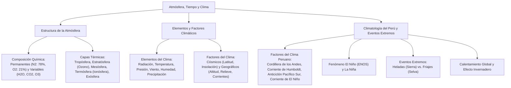

# TEMA 05: Atmósfera, Tiempo y Clima

---

## 1. FICHA TÉCNICA Y MATRIZ DE COMPETENCIAS

| Parámetro | Detalle |
| :--- | :--- |
| **Área Curricular** | Ciencias Sociales |
| **Eje Temático** | 03. Ciencias Sociales |
| **Asignatura** | Geografía |
| **Tema** | Tema V: Atmósfera, Tiempo y Clima |
| **Código del Archivo** | `CS-GEO-05` |
| **Ponderación UNSA** | Sociales: $1.584321000$ \| Biomédicas: $0.942150000$ \| Ingenierías: $0.812450000$ |
| **Nivel de Dificultad** | Intermedio - Físico, Termodinámico y Climatológico |
| **Prerrequisitos** | Termodinámica básica, leyes de los gases, balance de radiación solar |
| **Tiempo de Estudio** | 4.0 horas de profundización teórica y análisis meteorológico |

### Matriz de Aprendizajes Esperados (Estándar UNSA / UNMSM-DECO / UNI)
* **Conceptual:** Analizar la estructura vertical de la atmósfera terrestre y su gradiente térmico. Diferenciar rigurosamente tiempo meteorológico de clima. Identificar los elementos (temperatura, presión, humedad, vientos, precipitaciones) y los factores modificadores del clima (cósmicos y geográficos). Explicar los factores que determinan la atipicidad climática del Perú.
* **Procedimental:** Interpretar mapas de isobaras e isotermas, calcular variaciones de temperatura por gradiente vertical térmico y contrastar la dinámica del fenómeno El Niño Oscilación del Sur (ENOS) frente a eventos de heladas y friajes.
* **Actitudinal / Crítico:** Evaluar las consecuencias socioeconómicas del cambio climático antrópico sobre la desglaciación andina y promover medidas de adaptación y mitigación en cuencas vulnerables.

---

## 2. MAPA TAXONÓMICO Y ONTOLOGÍA



---

## 3. DESARROLLO TEÓRICO FORMAL

### 3.1. La Atmósfera: Origen, Composición y Retención

La atmósfera es la envoltura gaseosa que rodea la Tierra, unida a ella por la **fuerza de gravedad** terrestre y dinamizada por la **energía solar**.

#### A. Composición Química de la Atmósfera Homogénea (Homósfera, hasta $\approx 80\text{ km}$)
1. **Gases Permanentes o Constantes (Volumen fijo):**
   * **Nitrógeno ($N_2$):** $78.08\%$. Es el gas más abundante; diluye el oxígeno haciendo respirable el aire y es fijado en los suelos por bacterias nitrificantes.
   * **Oxígeno ($O_2$):** $20.95\%$. Gas vital para la respiración aeróbica y comburente esencial.
   * **Argón ($Ar$):** $0.93\%$. Gas noble inerte más abundante.
   * *Otros gases nobles:* Neón, Helio, Kriptón, Xenón ($< 0.04\%$).
2. **Gases Variables o Termorreguladores (Invernadero natural):**
   * **Vapor de agua ($H_2O$):** Responsable de la humedad, nubosidad y precipitaciones. Principal gas de efecto invernadero natural.
   * **Dióxido de Carbono ($CO_2$):** $0.04\%$ ($\approx 420\text{ ppm}$). Gas clave para la fotosíntesis y la retención del calor infrarrojo terrestre.
   * **Ozono ($O_3$):** Se concentra en la estratósfera; absorbe la letal radiación ultravioleta de alta energía (UV-B y UV-C).
   * **Metano ($CH_4$), Óxidos de nitrógeno ($NO_x$):** Retienen radiación de onda larga.

---

### 3.2. Estructura Vertical Térmica de la Atmósfera

La atmósfera se subdivide en capas concéntricas basándose en la variación de la temperatura con la altitud:

```
Altitud (km)
 ↑
1000 +-----------------------------------------+  Exósfera / Magnetósfera (Cinturones de Van Allen)
     |                                         |
 500 +-----------------------------------------+  Termopausa
     |   TERMÓSFERA / IONÓSFERA                |  T asciende hasta 1 500 °C. Auroras y Telecomunicaciones
  85 +-----------------------------------------+  Mesopausa (-100 °C, capa más fría)
     |   MESÓSFERA                             |  Desintegración de meteoros. Sodiosfera
  50 +-----------------------------------------+  Estratopausa
     |   ESTRATÓSFERA (Ozonósfera a 25-30 km)  |  T asciende por absorción UV. Vuelos supersónicos
  12 +-----------------------------------------+  Tropopausa (-56 °C, "techo del tiempo")
     |   TROPÓSFERA                            |  Gradiente vertical: -6.5 °C / 1 000 m. Fenómenos climáticos
   0 +=========================================+  Superficie Terrestre (Nivel del Mar)
```

1. **Tropósfera ("Esfera de cambios"):**
   * Espesor variable: $\approx 18\text{ km}$ en el ecuador (por mayor fuerza centrífuga y calor) y $\approx 9\text{ km}$ en los polos.
   * Contiene el **$80\%$ del peso total de la atmósfera** y prácticamente la totalidad del vapor de agua y polvo atmosférico.
   * Ocurren todos los **fenómenos meteorológicos** (nubes, lluvias, vientos, tormentas).
   * **Gradiente Térmico Vertical:** La temperatura disminuye a razón de **$6.5^\circ\text{C}$ por cada $1\,000\text{ metros}$** de ascenso ($0.65^\circ\text{C} / 100\text{ m}$).
   * Límite superior: **Tropopausa** ($\approx -56^\circ\text{C}$), zona de calma térmica.
2. **Estratósfera ("Esfera de capas"):**
   * Se extiende desde la tropopausa hasta los $50\text{ km}$. Aire en calma sin turbulencias verticales (vuelo de aeronaves comerciales supersónicas).
   * Alberga la **Capa de Ozono u Ozonósfera** entre los $25$ y $35\text{ km}$. La absorción de rayos UV por el ciclo de Chapman ($O_2 + h\nu \to 2O$; $O + O_2 \to O_3$) provoca una **inversión térmica**: la temperatura asciende desde $-56^\circ\text{C}$ hasta cerca de los $0^\circ\text{C}$ en la **Estratopausa**.
3. **Mesósfera ("Esfera media"):**
   * Se extiende de los $50$ a los $85\text{ km}$. La temperatura desciende bruscamente hasta alcanzar la zona más gélida de la atmósfera: **$-90^\circ\text{C}$ a $-100^\circ\text{C}$** en la **Mesopausa**.
   * Capa donde la fricción atmosférica desintegra a la inmensa mayoría de los meteoroides, produciendo los bólidos y "estrellas fugaces". Se observa el vapor de sodio (sodiosfera) y nubes noctilucentes.
4. **Termósfera o Ionósfera ("Esfera de calor"):**
   * De los $85$ hasta aproximadamente $500 - 600\text{ km}$. El aire está extremadamente enrarecido y fuertemente ionizado por la radiación solar extrema (rayos gamma y X).
   * La temperatura cinética asciende por encima de los **$1\,500^\circ\text{C}$**.
   * Alberga las subcapas ionizadas (Kennelly-Heaviside y Appleton) que **reflejan las ondas electromagnéticas de radio AM y TV**, permitiendo las telecomunicaciones transoceánicas terrestres antes de los satélites.
   * En ella orbitan la Estación Espacial Internacional (ISS) y se producen las **auroras boreales y australes**.
5. **Exósfera ("Esfera exterior"):**
   * Más allá de los $600\text{ km}$. Transición gradual hacia el vacío del espacio interplanetario. Predominan átomos ligeros de hidrógeno y helio a velocidades de escape. Alberga la **Magnetósfera** y los **Cinturones de Radiación de Van Allen**, que escudan a la biósfera de las partículas letales del viento solar.

---

### 3.3. Tiempo Meteorológico vs. Clima

* **Tiempo Meteorológico:** Estado termodinámico e hidrológico puntual, momentáneo y cambiante de la tropósfera en un lugar específico y momento determinado (medido en horas o días). Ciencia que lo estudia: **Meteorología**.
* **Clima:** Conjunto y sucesión periódica de estados meteorológicos característicos de una región geográfica, deducidos a partir de la observación estadística continuada durante al menos **30 años consecutivos** (según la Organización Meteorológica Mundial - OMM). Ciencia que lo estudia: **Climatología**.

---

### 3.4. Elementos del Clima y su Instrumentalización

| Elemento Climático | Definición Física | Instrumento de Medición | Línea Isoplética |
| :--- | :--- | :--- | :--- |
| **Radiación Solar** | Energía electromagnética emitida por el Sol que arriba a la superficie. | **Pirheliómetro / Actinómetro** | Isolia |
| **Temperatura** | Medida del grado de agitación cinética molecular del aire atmosférico. | **Termómetro** (máximas y mínimas) | **Isoterma** |
| **Presión Atmosférica** | Peso que ejerce la columna de aire sobre una unidad de superficie ($1\text{ atm} = 760\text{ mmHg} = 1\,013.25\text{ hPa}$). | **Barómetro** (Torricelli / Aneroide) | **Isobara** |
| **Humedad** | Cantidad de vapor de agua contenido en el aire. (Relativa: $\%$ vs. Absoluta: $\text{g/m}^3$). | **Higrómetro / Psicrómetro** | **Isohídrica** |
| **Precipitación** | Caída de agua líquida (lluvia, llovizna) o sólida (nieve, granizo) de las nubes. | **Pluviómetro / Pluviógrafo** | **Isoyeta** |
| **Vientos** | Desplazamiento horizontal de masas de aire de zonas de alta presión a baja presión. | **Anemómetro** (velocidad) y **Veleta** (dirección) | **Isotaca** (velocidad) |

#### Leyes de los Vientos:
1. **Ley de Buys-Ballot:** El viento siempre se desplaza desde los centros de **Alta Presión (Anticiclones)** hacia los centros de **Baja Presión (Ciclones o borrascas)**.
2. **Ley de Ferrel:** Debido a la rotación terrestre (efecto Coriolis), los vientos se desvían hacia su **derecha en el hemisferio norte** y hacia su **izquierda en el hemisferio sur**.
3. **Ley de Stephenson:** La velocidad del viento es directamente proporcional al gradiente barométrico (diferencia de presión entre dos puntos).

---

### 3.5. Factores que Modifican el Clima

* **Factores Cósmicos (Globales):**
  * *Forma esférica de la Tierra:* Determina la distribución angular desigual de los rayos solares (máxima energía en el ecuador, mínima en los polos).
  * *Inclinación del eje ($23^\circ 27'$) y Traslación:* Causan la estacionalidad climática y las zonas térmicas.
* **Factores Geográficos (Locales y Regionales):**
  * *Latitud:* A menor latitud (zona intertropical), mayor temperatura promedio anual; a mayor latitud (polos), menor temperatura.
  * *Altitud:* A mayor altitud $\to$ menor temperatura (gradiente vertical), menor presión atmosférica y menor humedad absoluta.
  * *Relieve y barreras orográficas:* Bloquean masas de aire húmedo, generando lluvias en barlovento y desiertos o sombras de lluvia en sotavento.
  * *Continentalidad vs. Oceanidad:* El agua posee un calor específico elevado ($c = 1\text{ cal/g}^\circ\text{C}$); actúa como moderador térmico reduciendo la amplitud térmica en la costa (oceanidad), mientras que en el interior continental la oscilación térmica es extrema (continentalidad).
  * *Corrientes Marinas:* Corrientes frías estabilizan la atmósfera impidiendo la evaporación masiva (aridez costera); corrientes cálidas incrementan la humedad y las lluvias torrenciales.

---

### 3.6. Factores del Clima Peruano y Fenómenos Extremos

Por su posición latitudinal ($0^\circ 01'$ a $18^\circ 21'\text{ S}$), al Perú le correspondería un clima estrictamente **tropical, cálido, húmedo y lluvioso** en todo su territorio. Sin embargo, el Perú posee **28 de los 32 tipos de climas del mundo** (según la clasificación de Thornthwaite).

#### Factores Determinantes del Clima en el Perú:
1. **La Cordillera de los Andes:**
   * Es el **factor climático principal y determinante**. Actúa como una descomunal barrera orográfica que divide al país en tres dominios climáticos radicalmente diferentes (Costa, Sierra y Selva).
   * Impide que los vientos alisios cargados de humedad atlántica-amazónica crucen hacia la vertiente del Pacífico, condensándolos en la Selva Alta y dejando a la Costa desértica.
   * Genera los pisos altitudinales y la disminución escalonada de la temperatura con la altura.
2. **La Corriente Peruana o de Humboldt (Aguas Frías):**
   * Baña la costa central y sur ($13^\circ\text{C} - 17^\circ\text{C}$). Se origina por afloramiento costero impulsado por los vientos alisios del sureste.
   * *Efecto Climático:* Enfría las capas bajas de la atmósfera costera, generando una capa de **inversión térmica** que bloquea la formación de nubes de desarrollo vertical (cumulonimbos). Condensa nubes bajas estratos que provocan nieblas, brumas y tenues lloviznas (**garúas**) invernales, pero **ausencia casi total de lluvias torrenciales**, originando el árido desierto costero del Pacífico.
3. **El Anticiclón del Pacífico Sur (APS):**
   * Sistema de alta presión marítimo que impulsa masas de aire frío y seco a través de los vientos alisios del sureste paralelos a la costa peruana, reforzando la corriente de Humboldt y la estabilidad costera.
4. **La Corriente de El Niño (Aguas Cálidas Ecuatoriales):**
   * Fluye de norte a sur frente a Tumbes y Piura ($T > 23^\circ\text{C}$). Calienta el aire, intensifica la evaporación y genera precipitaciones estivales intensas en la costa norte.
5. **El Ciclón Ecuatorial y la Masa Húmeda Amazónica:**
   * Masas de aire inestables y calientes del Atlántico que descargan torrenciales lluvias sobre la Amazonía.

---

#### Fenómenos Meteorológicos y Climáticos Extremos en el Perú

| Fenómeno | Región Afectada | Causa Mecánica | Consecuencias e Impactos |
| :--- | :--- | :--- | :--- |
| **El Niño Oscilación del Sur (ENOS)** | Costa Norte y Central (y sequías en la Sierra Sur) | Debilitamiento de los vientos alisios del este $\to$ invasión anómala de ondas Kelvin cálidas hacia la costa sudamericana $\to$ colapso de la Corriente de Humboldt. | Lluvias e inundaciones catastróficas en Tumbes, Piura, Lambayeque; desbordes de ríos y huaycos; mortandad o migración de anchoveta; severas sequías en el Altiplano (Puno). |
| **La Niña** | Costa Peruana | Fortalecimiento anómalo de los vientos alisios $\to$ intensificación del afloramiento de aguas frías subsuperficiales. | Enfriamiento severo del mar y la costa; sequías en la costa norte; incremento de precipitaciones en la sierra oriental. |
| **Heladas** | Sierra Alta (Zonas $> 3\,500\text{ m s.n.m.}$, Puna) | Ocurren en invierno (junio-agosto) bajo cielos despejados por pérdida radiativa nocturna del suelo (**heladas meteorológicas**, $T \le 0^\circ\text{C}$). | Destrucción de cultivos agrícolas (papa, quinua); mortandad masiva de camélidos (alpacas) por congelamiento e hipotermia; afecciones respiratorias agudas en poblaciones vulnerables. |
| **Friajes (Surazos)** | Selva (Ucayali, Madre de Dios, Loreto) | Invasión de masas de aire polar frío de origen antártico que ascienden por la cuenca del Plata a través de los Andes orientales. | Caída brusca y anómala de la temperatura en la selva baja (de $32^\circ\text{C}$ a $11^\circ\text{C}$ en pocas horas); vientos huracanados y lluvias frontales. |

---

## 4. FORMULARIO MAESTRO / CUADRO SINÓPTICO

### Gradiente Térmico y Cálculo de Variación de Temperatura

$$\Delta T = - \left( \frac{6.5^\circ\text{C}}{1\,000\text{ m}} \right) \cdot \Delta h = - 0.0065 \cdot (h_{\text{final}} - h_{\text{inicial}})$$

* **Fórmula de Temperatura Estimada por Altitud:**
  $$T_h = T_0 - 0.0065 \cdot h$$
  *(donde $T_0$ es la temperatura a nivel del mar en $^\circ\text{C}$ y $h$ es la altitud en metros).*

### Síntesis de Instrumentos y Fenómenos

| Parámetro | Instrumento | Unidad SI | Condición en Arequipa |
| :--- | :--- | :--- | :--- |
| **Presión** | Barómetro aneroide | $\text{hPa}$ / $\text{mmHg}$ | Menor que a nivel del mar ($\approx 770\text{ hPa}$ a $2\,325\text{ m s.n.m.}$). |
| **Temperatura** | Termómetro de mercurio | $^\circ\text{C}$ | Alta radiación diurna y fuerte oscilación térmica nocturna por cielo diáfano. |
| **Vientos Locales** | Anemómetro / Veleta | $\text{m/s}$ o $\text{km/h}$ | Brisas de montaña y valle (vientos anabáticos y catabáticos). |

---

## 5. MNEMOTECNIAS DE COMBATE PREUNIVERSITARIO

### Mnemotecnia 1: Capas de la Atmósfera en Orden Ascendente
**"TRO-ES-ME-TER-EX"**
* **TRO** $\rightarrow$ **TRO**pósfera (vida, clima, gradiente)
* **ES** $\rightarrow$ **ES**tratósfera (ozono $O_3$, aviones)
* **ME** $\rightarrow$ **ME**sósfera (meteoros desintegrados, $-100^\circ\text{C}$)
* **TER** $\rightarrow$ **TER**mósfera (ionósfera, telecomunicaciones, auroras)
* **EX** $\rightarrow$ **EX**ósfera (espacio exterior, satélites, Van Allen)

*Frase mnemotécnica:* **"TROpitas EStudian MEcanica TERmo EXtrema"**.

### Mnemotecnia 2: Diferencia Clave Helada vs. Friaje
* **Helada $\rightarrow$ Alto Andino (Sierra)**: Pérdida de calor por cielo despejado en la noche.
* **Friaje $\rightarrow$ Flujo Polar en la Floresta (Selva)**: Viento antártico que entra por el sur.

---

## 6. TÉCNICAS Y ARTIFICIOS DE RESOLUCIÓN (HACKING PREUNIVERSITARIO)

1. **Hacking del Gradiente Térmico:**
   * En preguntas de admisión donde te den la temperatura de Lima ($0\text{ m s.n.m.}$) y te pidan la de Ticlio ($4\,800\text{ m s.n.m.}$):
   * Por cada $100\text{ m}$ resta $0.65^\circ\text{C}$ (o por cada $1\,000\text{ m}$ resta $6.5^\circ\text{C}$).
   * $4.8 \times 6.5 = 31.2^\circ\text{C}$ de caída. Si Lima está a $20^\circ\text{C}$, en Ticlio habrá: $20 - 31.2 = -11.2^\circ\text{C}$.
2. **Causa de la Aridez Costera:**
   * Si en el examen te preguntan por qué la Costa peruana es un desierto y no llueve como en el Caribe, la respuesta combinada clave es: **La frialdad de la Corriente de Humboldt (afloramiento) que genera inversión térmica + la Cordillera de los Andes que frena la humedad amazónica**.

---

## 7. ZONA DE TRAMPAS Y DISTRACTORES ("¡PELIGRO EXAMEN!")

* ⚠️ **Trampa 1: El gas más abundante de la atmósfera no es el oxígeno:**
  * El gas más abundante es el **Nitrógeno ($78\%$); el oxígeno ocupa el segundo lugar con un $21\%$**.
* ⚠️ **Trampa 2: La capa del ozono no está en la tropósfera:**
  * El ozono estratosférico ($25-30\text{ km}$) es el filtro benéfico vital. El ozono troposférico a nivel del suelo es un contaminante fotoquímico tóxico derivado de la combustión vehicular.
* ⚠️ **Trampa 3: Tiempo meteorológico vs. Clima:**
  * *"Hoy amaneció nublado y con llovizna en Arequipa"* $\rightarrow$ Es una descripción del **tiempo meteorológico**, no del clima. El clima es el promedio secular de 30 años.

---

## 8. APLICACIÓN AL MUNDO REAL Y CONTEXTO DECO

### Caso de Estudio DECO: El Retroceso del Glaciar Pastoruri y la Seguridad Hídrica
El glaciar Pastoruri, ubicado en la Cordillera Blanca (Áncash), ha perdido más del $55\%$ de su masa de hielo en los últimos 40 años debido al calentamiento global antropogénico:
1. **Mecanismo:** El incremento sostenido en la concentración de gases de efecto invernadero ($CO_2 > 420\text{ ppm}$) atrapa mayor radiación infrarroja de onda larga en la tropósfera, elevando la isoterma de $0^\circ\text{C}$ a cotas más altas.
2. **Impacto en Cuencas:** La desaparición de los glaciares tropicales andinos compromete el caudal de estiaje del río Santa, amenazando la generación hidroeléctrica del Cañón del Pato y el suministro hídrico del proyecto de irrigación agroindustrial Chavimochic en La Libertad.

---

## 9. BANCO DE 5 EJERCICIOS RESUELTOS GRADUADOS

### Ejercicio 1 (Nivel 1 - Básico Formativo: Estructura Atmosférica)
**Enunciado:**
La capa de la atmósfera terrestre donde se concentran los fenómenos meteorológicos que determinan el tiempo y el clima (nubes, precipitaciones, tormentas y vientos), y donde se produce el descenso de la temperatura con la altitud conocido como gradiente térmico vertical, es la:
* A) Estratósfera
* B) Mesósfera
* C) Tropósfera
* D) Termósfera
* E) Exósfera

**Solución Paso a Paso:**
1. La tropósfera es la capa inferior en contacto con la corteza terrestre, abarcando hasta los $12 - 18\text{ km}$.
2. Contiene el $80\%$ de la masa gaseosa y prácticamente todo el vapor de agua atmosférico, siendo el escenario exclusivo de los meteoros acuosos y aéreos.
* **Respuesta Correcta:** **C**

---

### Ejercicio 2 (Nivel 2 - Intermedio UNSA Ordinario: Clima Costero Peruano)
**Enunciado:**
A pesar de situarse en plena zona intertropical de baja latitud, la costa central y sur del Perú presenta un clima templado cálido desértico con escasa precipitación pluvial. La causa oceanográfica y meteorológica directa que impide el desarrollo de nubes de lluvia vertical (cumulonimbos) en este litoral es:
* A) El paso del Ciclón Ecuatorial que desvía los vientos hacia Brasil.
* B) El fenómeno de inversión térmica generado por las aguas frías de la Corriente de Humboldt.
* C) La radiación ultravioleta absorbida en la capa de ozono marina.
* D) El choque frontal de los vientos catabáticos de la Cordillera de la Costa.
* E) El sobrecalentamiento del suelo por el ingreso exclusivo de la Corriente de El Niño.

**Solución Paso a Paso:**
1. Las aguas frías de la Corriente Peruana enfrían el aire en contacto con la superficie del mar, volviéndolo más denso y pesado que el aire superior.
2. Esto altera el gradiente normal, impidiendo la convección ascendente del vapor de agua (fenómeno de **inversión térmica**).
3. Solo se forman nubes estratos bajas horizontales que producen lloviznas (garúas), impidiendo tormentas y lluvias copiosas, lo que determina la aridez de la costa.
* **Respuesta Correcta:** **B**

---

### Ejercicio 3 (Nivel 3 - Avanzado UNMSM DECO: Cálculo del Gradiente Térmico)
**Enunciado:**
En una mañana de invierno, la ciudad costera de Mollendo ($0\text{ m s.n.m.}$) registra una temperatura ambiente de $18^\circ\text{C}$. Un grupo de transportistas asciende por la carretera Panamericana hacia la ciudad de Arequipa, situada a $2\,325\text{ metros sobre el nivel del mar}$. Asumiendo una atmósfera con gradiente térmico vertical estándar y sin perturbaciones locales de inversión, ¿cuál será la temperatura teórica aproximada del aire al llegar a la ciudad de Arequipa?
* A) $15.0^\circ\text{C}$
* B) $10.2^\circ\text{C}$
* C) $2.9^\circ\text{C}$
* D) $-3.5^\circ\text{C}$
* E) $22.4^\circ\text{C}$

**Solución Paso a Paso:**
1. El gradiente térmico vertical establece que la temperatura desciende $6.5^\circ\text{C}$ por cada $1\,000\text{ metros}$ de elevación:
   $$\Delta T = - \left( \frac{6.5^\circ\text{C}}{1\,000\text{ m}} \right) \cdot \Delta h$$
2. Calculamos el desnivel: $\Delta h = 2\,325\text{ m} - 0\text{ m} = 2\,325\text{ m}$.
3. Calculamos la disminución de temperatura:
   $$\text{Descenso} = 2.325 \times 6.5^\circ\text{C} \approx 15.11^\circ\text{C}$$
4. Restamos de la temperatura basal de Mollendo:
   $$T_{\text{Arequipa}} = 18^\circ\text{C} - 15.11^\circ\text{C} = 2.89^\circ\text{C} \approx 2.9^\circ\text{C}$$
* **Respuesta Correcta:** **C**

---

### Ejercicio 4 (Nivel 4 - Crítico / Interdisciplinario UNI: Fenómenos Extremos y Masas de Aire)
**Enunciado:**
Durante los meses de mayo a agosto, en la selva baja de los departamentos de Madre de Dios y Ucayali, se registran eventos bruscos de descenso térmico donde los termómetros caen precipitadamente desde los $33^\circ\text{C}$ habituales hasta los $11^\circ\text{C}$ o menos, acompañados de vientos intensos y lluvias frontales. Este fenómeno meteorológico estacional se denomina:
* A) Helada radiativa
* B) Inversión térmica
* C) Friaje o Surazo
* D) Viento Paraca
* E) Veranillo de San Juan

**Solución Paso a Paso:**
1. El fenómeno descrito ocurre en la cuenca amazónica por la penetración de una masa de aire frío polar antártico que ingresa por el Río de la Plata y avanza por la llanura chaco-amazónica.
2. En el Perú, este enfriamiento violento de la selva se conoce oficialmente como **Friaje** (o **Surazo** en la frontera con Bolivia y Brasil).
3. No debe confundirse con la *helada*, la cual se presenta en la región andina alta por encima de los $3\,500\text{ m s.n.m.}$ con temperaturas bajo cero.
* **Respuesta Correcta:** **C**

---

### Ejercicio 5 (Nivel 5 - Boss Challenge: Dinámica Global del ENOS y Teleconexiones)
**Enunciado:**
Lea con rigurosidad el siguiente reporte sobre la circulación de Walker en el Pacífico ecuatorial:
*"En condiciones oceanográficas normales, los vientos alisios del sureste y noreste soplan vigorosamente hacia el oeste a lo largo del ecuador, apilando aguas cálidas en el Pacífico occidental (Indonesia y norte de Australia), donde la termoclina es profunda y la convección genera copiosas lluvias. En contraste, frente a las costas de Sudamérica (Perú y Ecuador), se produce un ascenso constante de aguas gélidas y ricas en nutrientes (afloramiento), manteniendo la termoclina muy somera. Sin embargo, durante el Fenómeno de El Niño (fase cálida del ENOS), la presión atmosférica en el Pacífico occidental se eleva, los vientos alisios se debilitan o se revierten hacia el este, y la piscina cálida se propaga a través de ondas Kelvin oceánicas hacia el litoral sudamericano".*

A partir del texto y la climatología física, señale las proposiciones correctas:
I. Durante El Niño, la termoclina en el mar peruano se profundiza, bloqueando el afloramiento de nutrientes hacia la zona fótica.  
II. La elevación de la temperatura superficial del mar intensifica la evaporación, produciendo precipitaciones catastróficas en la costa norte peruana.  
III. La teleconexión climática del evento genera frecuentemente severas sequías en la sierra surandina y el Altiplano peruano-boliviano.  
IV. Durante la fase opuesta (La Niña), los vientos alisios se extinguen por completo y el mar peruano alcanza temperaturas tropicales de más de $28^\circ\text{C}$.

* A) I, II y III
* B) Solo II y III
* C) I, III y IV
* D) II y IV
* E) I, II, III y IV

**Solución Paso a Paso:**
1. **Evaluación de I:** Al llegar la masa cálida de ondas Kelvin, la capa de agua templada suprayacente se ensancha y la termoclina (límite entre agua caliente y fría) se hunde a gran profundidad, impidiendo que el afloramiento traiga nutrientes a la superficie. (Verdadero).
2. **Evaluación de II:** El agua marina caliente ($> 26^\circ\text{C}$) rompe la inversión térmica y genera convección desbocada con nubes cumulonimbos y lluvias torrenciales en Piura y Tumbes. (Verdadero).
3. **Evaluación de III:** La perturbación de la celda de Walker altera la circulación de humedad, traduciéndose típicamente en sequías extremas en Puno, Cusco y Arequipa. (Verdadero).
4. **Evaluación de IV:** En La Niña ocurre exactamente lo contrario: los vientos alisios se fortalecen extraordinariamente y el mar peruano se enfría aún más de lo normal ($< 15^\circ\text{C}$). (Falso).
* Conclusión: Son correctas I, II y III.
* **Respuesta Correcta:** **A**

---

## 10. GLOSARIO DE 10 TÉRMINOS CLAVE

1. **Tropopausa:** Límite térmico superior de la tropósfera donde la temperatura se estabiliza a unos $-56^\circ\text{C}$, marcando el límite de los fenómenos meteorológicos convencionales.
2. **Ozonósfera:** Subcapa estratosférica ubicada entre los $25$ y $35\text{ km}$ donde se concentra el gas ozono ($O_3$), vital para filtrar la radiación UV solar.
3. **Gradiente Térmico Vertical:** Tasa de disminución de la temperatura con la altitud en la tropósfera libre, equivalente a $-6.5^\circ\text{C}$ por cada $1\,000\text{ metros}$ de ascenso.
4. **Inversión Térmica:** Anomalía atmosférica en la cual la temperatura del aire aumenta con la altitud en lugar de descender, actuando como una tapadera que inhibe la convección de nubes de lluvia.
5. **Afloramiento (Upwelling):** Movimiento ascensional de aguas profundas frías y ricas en nutrientes minerales hacia la superficie marina costera.
6. **Isobara:** Línea trazada en un mapa meteorológico que une los puntos de la superficie terrestre con igual presión atmosférica reducida al nivel del mar.
7. **Isoterma:** Línea cartográfica que une puntos de igual temperatura media en un periodo determinado.
8. **Efecto Invernadero:** Proceso natural mediante el cual gases como el vapor de agua, $CO_2$ y metano retienen parte de la radiación infrarroja emitida por la Tierra, manteniendo una temperatura habitable ($15^\circ\text{C}$ promedio).
9. **Friaje:** Fenómeno meteorológico caracterizado por el ingreso repentino de masas de aire polar antártico en la cuenca amazónica, provocando desplomes drásticos de temperatura.
10. **Termoclina:** Capa delgada de transición vertical en un cuerpo de agua (océano o lago) donde la temperatura desciende drásticamente con la profundidad.

---

## 11. BANCO DE FLASHCARDS (Q/A)

* **PREGUNTA:** ¿Cuáles son los dos gases más abundantes de la atmósfera y en qué proporciones volumétricas se encuentran?
  * **RESPUESTA:** Nitrógeno ($N_2$) con $78.08\%$ y Oxígeno ($O_2$) con $20.95\%$.
* **PREGUNTA:** ¿Cuál es la capa atmosférica donde se desintegran los meteoroides y se registra la menor temperatura del planeta?
  * **RESPUESTA:** La Mesósfera (en la mesopausa se alcanzan de $-90^\circ\text{C}$ a $-100^\circ\text{C}$).
* **PREGUNTA:** ¿Qué capa de la atmósfera refleja las ondas de radio AM permitiendo las telecomunicaciones a larga distancia?
  * **RESPUESTA:** La Termósfera o Ionósfera (capas de Kennelly-Heaviside y Appleton).
* **PREGUNTA:** ¿Cuál es el valor del gradiente térmico vertical estándar en la tropósfera?
  * **RESPUESTA:** Disminución de $6.5^\circ\text{C}$ por cada $1\,000\text{ metros}$ de ascenso ($0.65^\circ\text{C} / 100\text{ m}$).
* **PREGUNTA:** ¿Qué instrumento mide la presión atmosférica y cuál mide la humedad relativa?
  * **RESPUESTA:** Barómetro para la presión atmosférica e Higrómetro (o Psicrómetro) para la humedad.
* **PREGUNTA:** ¿Qué establece la Ley de Buys-Ballot sobre el desplazamiento de los vientos?
  * **RESPUESTA:** Que los vientos siempre se desplazan desde las zonas de alta presión (anticiclones) hacia las de baja presión (ciclones).
* **PREGUNTA:** ¿Cuál es el factor geográfico principal y determinante del clima en el Perú?
  * **RESPUESTA:** La Cordillera de los Andes, que actúa como una colosal barrera orográfica y genera pisos ecológicos térmicos.
* **PREGUNTA:** ¿Por qué la costa central y sur peruana es un desierto y carece de lluvias torrenciales?
  * **RESPUESTA:** Por el fenómeno de inversión térmica producido por las aguas frías de la Corriente de Humboldt sumado al bloqueo andino de la humedad oriental.
* **PREGUNTA:** ¿Qué diferencia geográfica existe entre una helada y un friaje en el Perú?
  * **RESPUESTA:** La helada ocurre en la Sierra por encima de los $3\,500\text{ m s.n.m.}$ con temperaturas $\le 0^\circ\text{C}$; el friaje ocurre en la Selva por invasión de aire polar antártico.
* **PREGUNTA:** ¿Qué ocurre con la piscina cálida del Pacífico y los vientos alisios durante el fenómeno de El Niño?
  * **RESPUESTA:** Los vientos alisios se debilitan o revierten y la masa de agua cálida del Pacífico occidental se desplaza hacia la costa sudamericana a través de ondas Kelvin.

---

## 12. MOTOR DE GAMIFICACIÓN (JSON NATIVO KMP)

```json
{
  "subjectCode": "GEO",
  "subjectName": "Geografía",
  "topicId": "GEO-05",
  "topicTitle": "Atmósfera, Tiempo y Clima",
  "totalXP": 290,
  "difficulty": "INTERMEDIO",
  "unsaWeight": 1.584321,
  "badges": [
    {
      "id": "BADGE_GEO_METEOROLOGO",
      "title": "Meteorólogo Predictivo",
      "description": "Calculaste gradientes térmicos y descifraste mapas sinópticos de isobaras e isotermas con maestría.",
      "icon": "barometer_mercury_gold"
    },
    {
      "id": "BADGE_GEO_MONITOR_ENOS",
      "title": "Especialista en Clima y ENOS",
      "description": "Comprendes a la perfección la circulación de Walker, la inversión térmica de Humboldt y los friajes amazónicos.",
      "icon": "ocean_wave_kelvin"
    }
  ],
  "missions": [
    {
      "missionId": "GEO_M1_CAPAS_ATM",
      "title": "Ascenso a la Termósfera",
      "requiredPoints": 100,
      "xpReward": 100,
      "task": "Ubicar correctamente los fenómenos atmosféricos en la tropósfera, estratósfera, mesósfera y termósfera."
    },
    {
      "missionId": "GEO_M2_GRADIENTE",
      "title": "Cálculo Térmico Altitudinal",
      "requiredPoints": 90,
      "xpReward": 90,
      "task": "Resolver 3 problemas numéricos de gradiente vertical térmico entre ciudades de la costa y la cordillera andina."
    },
    {
      "missionId": "GEO_M3_ENOS_FRIAJE",
      "title": "Duelo Climático: El Niño vs. Friaje",
      "requiredPoints": 100,
      "xpReward": 100,
      "task": "Contrastar las causas dinámicas y consecuencias territoriales del Fenómeno El Niño frente a las heladas y friajes."
    }
  ],
  "questions": [
    {
      "id": "GEO_Q1",
      "type": "SINGLE_CHOICE",
      "question": "En la tropósfera, la temperatura del aire desciende regularmente con la altitud a una tasa aproximada de:",
      "options": [
        "1.0°C por cada 1 000 m",
        "6.5°C por cada 1 000 m",
        "12.0°C por cada 1 000 m",
        "0.65°C por cada 1 000 m",
        "3.5°C por cada 100 m"
      ],
      "correctIndex": 1,
      "explanation": "El gradiente térmico vertical normal en la tropósfera es de aproximadamente 6.5°C por cada 1 000 metros de altitud (o 0.65°C por cada 100 m)."
    },
    {
      "id": "GEO_Q2",
      "type": "SINGLE_CHOICE",
      "question": "El fenómeno meteorológico que consiste en el ingreso de masas de aire polar antártico a través de la cuenca del Plata provocando una brusca caída térmica en la selva peruana se denomina:",
      "options": [
        "Helada meteorológica",
        "Inversión térmica",
        "Friaje o surazo",
        "Efecto Foehn",
        "Viento Paraca"
      ],
      "correctIndex": 2,
      "explanation": "El friaje es el descenso brusco de temperatura en la Amazonía peruana provocado por el avance de frentes fríos polares desde el cono sur."
    }
  ]
}
```
