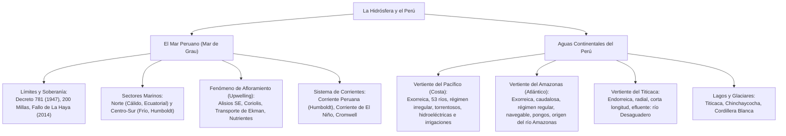

# TEMA 06: Hidrósfera: Mar Peruano y Aguas Continentales

---

## 1. FICHA TÉCNICA Y MATRIZ DE COMPETENCIAS

| Parámetro | Detalle |
| :--- | :--- |
| **Área Curricular** | Ciencias Sociales |
| **Eje Temático** | 03. Ciencias Sociales |
| **Asignatura** | Geografía |
| **Tema** | Tema VI: Hidrósfera: Mar Peruano y Aguas Continentales |
| **Código del Archivo** | `CS-GEO-06` |
| **Ponderación UNSA** | Sociales: $1.584321000$ \| Biomédicas: $0.942150000$ \| Ingenierías: $0.812450000$ |
| **Nivel de Dificultad** | Avanzado - Hidrología, Oceanografía y Cuencas del Perú |
| **Prerrequisitos** | Geodinámica externa, climatología, cartografía hidrológica |
| **Tiempo de Estudio** | 4.0 horas de asimilación teórica y cartografía de cuencas |

### Matriz de Aprendizajes Esperados (Estándar UNSA / UNMSM-DECO / UNI)
* **Conceptual:** Analizar la distribución del agua en el planeta y el ciclo hidrológico. Caracterizar el Mar de Grau (sectores ecológicos, corrientes marinas, fenómeno de afloramiento, causas de su biomasa y delimitación marítima con Chile según La Haya). Comparar con rigor físico y económico las tres vertientes hidrográficas del Perú (Pacífico, Amazonas y Titicaca).
* **Procedimental:** Identificar en mapas fluviales el curso, pongos, meandros, represas e infraestructuras hidroeléctricas sobre los ríos Rímac, Santa, Mantaro, Amazonas y la cuenca del Titicaca.
* **Actitudinal / Crítico:** Valorar la seguridad hídrica, la preservación de los acuíferos subterráneos y la lucha contra la contaminación minera y de aguas servidas en las cuencas del Pacífico y el lago Titicaca.

---

## 2. MAPA TAXONÓMICO Y ONTOLOGÍA



---

## 3. DESARROLLO TEÓRICO FORMAL

### 3.1. La Hidrósfera y el Ciclo Hidrológico

La **hidrósfera** es el subsistema acuático del geosistema, cubriendo aproximadamente el **$71\%$ de la superficie terrestre** ($\approx 361\text{ millones de km}^2$).
* **Distribución Planetaria del Agua:**
  * **Agua Salada (Océanos y Mares):** **$97.2\%$** del volumen total (Océano Pacífico $46\%$, Atlántico $23\%$, Índico $20\%$, Antártico y Ártico).
  * **Agua Dulce:** Apenas el **$2.8\%$**:
    * *Casquetes polares y glaciares (Criósfera):* $2.15\%$ (más del $75\%$ del agua dulce líquida potencial).
    * *Aguas subterráneas (Acuíferos y napas freáticas):* $0.62\%$.
    * *Lagos y embalses:* $0.009\%$.
    * *Humedad del suelo:* $0.005\%$.
    * *Vapor atmosférico:* $0.001\%$.
    * *Ríos y arroyos superficiales:* Solo el **$0.0001\%$**.
* **El Ciclo Hidrológico:** Circulación cerrada y continua de agua impulsada por la energía solar y la gravedad a través de cinco etapas fundamentales: **Evaporación** (y evapotranspiración vegetal) $\to$ **Condensación** (formación de nubes) $\to$ **Precipitación** (lluvia, nieve, granizo) $\to$ **Infiltración** (alimentación freática) $\to$ **Escorrentía** superficial y subterránea hacia mares y lagos.

---

### 3.2. El Mar Peruano (Mar de Grau)

Es la porción del Océano Pacífico adyacente a las costas del Perú sobre la cual el Estado ejerce soberanía y jurisdicción bioceánica.
* **Marco Jurídico e Histórico:**
  * **Decreto Supremo N.° 781 (1 de agosto de 1947):** Promulgado por el presidente **José Luis Bustamante y Rivero**, proclamó la soberanía y jurisdicción del Perú sobre la plataforma submarina y el mar adyacente hasta una distancia de **200 millas marinas** ($370.4\text{ km}$), sentando las bases de la doctrina marítima internacional del Derecho del Mar.
  * **Fallo de la Corte Internacional de Justicia de La Haya (27 de enero de 2014):** Resolvió la controversia de delimitación marítima con Chile. Ratificó el paralelo del Hito N.° 1 hasta las **$80\text{ millas náuticas}$**, a partir de la cual trazó una línea equidistante en dirección suroeste hasta las 200 millas, reconociendo para el Perú más de **$50\,000\text{ km}^2$ de dominio marítimo** exclusivo.

#### A. Dimensiones y Sectores del Mar Peruano
* **Límites:**
  * *Norte:* Paralelo de Boca de Capones ($03^\circ 23' 33.96''\text{ S}$, frontera con Ecuador).
  * *Sur:* Punto "Concordia" / Paralelo del Hito N.° 1 ($18^\circ 21' 08''\text{ S}$, frontera con Chile).
  * *Oeste:* Línea imaginaria a 200 millas marinas mar adentro.
* **División en Dos Sectores Oceanográficos:**

| Parámetro | Sector Norte (Mar Ecuatorial o Tropical) | Sector Centro-Sur (Mar Frío de la Corriente Peruana) |
| :--- | :--- | :--- |
| **Ubicación Geográfica** | Desde Boca de Capones (Tumbes) hasta la Península de Illescas (Piura, $05^\circ\text{ S}$). | Desde la Península de Illescas hasta la frontera con Chile ($18^\circ 21'\text{ S}$). |
| **Temperatura del Agua** | **Cálida:** $21^\circ\text{C}$ a $24^\circ\text{C}$ (e incluso $28^\circ\text{C}$ en verano). | **Fría:** $13^\circ\text{C}$ a $17^\circ\text{C}$ (anomalía térmica de $-6^\circ\text{C}$ a $-8^\circ\text{C}$). |
| **Salinidad** | **Baja:** Menor a $34.5\text{ g/kg}$ (por dilución de lluvias y ríos ecuatoriales). | **Alta:** $34.8$ a $35.2\text{ g/kg}$ (escasa dilución y alta evaporación neta). |
| **Coloración del Agua** | Azulina y cristalina (baja densidad de fitoplancton). | **Verdosa** (alta concentración de clorofila y fitoplancton microscópico). |
| **Ecosistemas y Fauna** | Manglares de Tumbes, cocodrilo americano, conchas negras, langostinos, perico, pez vela, marlines, atún. | **Gran biomasa pelágica:** Anchoveta (*Engraulis ringens*), sardina, jurel, caballa, lobos marinos y aves guaneras (guanay, piquero, pelícano). |

---

#### B. El Fenómeno de Afloramiento (Upwelling)
Es el proceso oceanográfico mediante el cual **aguas subsuperficiales frías, densas y cargadas de nutrientes inorgánicos (nitratos, fosfatos y silicatos) ascienden hacia la superficie marina iluminada (zona fótica)**.
* **Causas Físicas del Afloramiento:**
  1. **Vientos Alisios del Sureste:** Soplan en forma paralela y oblicua a la línea de costa peruana.
  2. **Efecto Coriolis y Transporte de Ekman:** La rotación terrestre desvía las aguas superficiales hacia la izquierda en el hemisferio sur (mar adentro), creando un vacío hidráulico superficial.
  3. **Ascenso de Reemplazo:** Para compensar el agua superficial empujada mar adentro, ascienden masas de agua fría del fondo del talud continental.
* **¿Por qué el Mar Peruano es uno de los más ricos del planeta?**
  1. **Afloramiento constante:** Suministra "abono mineral" ininterrumpido.
  2. **Alta radiación solar en baja latitud:** Permite una fotosíntesis acelerada del fitoplancton (diatomeas microscópicas).
  3. **Presencia de la Corriente de Humboldt:** Mantiene temperaturas frías que retienen mayor oxígeno disuelto ($O_2$).
  4. **Amplitud del zócalo continental:** Facilita la penetración de la luz solar hasta el lecho marino en la costa central.

---

### 3.3. Aguas Continentales del Perú: Las Tres Vertientes Hidrográficas

El relieve andino divide al territorio peruano en tres macrovertientes hidrográficas con características físicas y regímenes marcadamente contrastantes:

```
                      CORDILLERA DE LOS ANDES
                             /\
   Vertiente del            /  \               Vertiente del
     PACÍFICO              /    \                AMAZONAS
  (53 ríos cortos,        /      \         (Caudalosos, navegables,
 torrentosos, estiaje)   /        \        meándricos, rampa oriental)
      ←                 /          \                  →
   Océano Pacífico     /   Lago     \         Océano Atlántico
                      /  Titicaca    \
                     /  (Endorreico)  \
```

---

#### A. Vertiente Hidrográfica del Pacífico (Cuenca Occidental)
* **Generalidades:**
  * Compuesta por **53 ríos principales** que nacen en la vertiente occidental andina y desembocan en el Océano Pacífico.
  * Ocupa el **$21.7\%$ del territorio nacional**, alberga a más del **$65\%$ de la población del país**, pero solo dispone del **$1.8\%$ de los recursos hídricos superficiales**.
* **Características Hidrológicas:**
  * **Cuencas Exorreicas:** Desembocan en el mar (algunos ríos sufren arreísmo en épocas de estiaje severo por infiltración y sobreexplotación agrícola, como el río Ica).
  * **Curso Corto y Pendiente Pronunciada:** Nacen a más de $4\,000 - 5\,000\text{ m s.n.m.}$ y recorren menos de $150 - 300\text{ km}$; son ríos **torrentosos y de régimen juvenil erosionador** en su cuenca alta.
  * **Régimen Muy Irregular:** Caudal estacional marcado:
    * *Época de crecida (Avenidas):* Verano austral (enero a marzo), alimentados por lluvias andinas.
    * *Época de estiaje:* Invierno y primavera (mayo a noviembre), caudal mínimo o lechos secos.
  * **No navegables:** Salvo el **río Tumbes** en su tramo inferior (desembocadura en delta con manglares).
* **Ríos Notables de la Vertiente del Pacífico:**
  * **Río Santa (Áncash):** El de **mayor caudal anual constante** de la costa; recorre de sur a norte el Callejón de Huaylas entre la Cordillera Blanca y Negra, atraviesa el Cañón del Pato y abastece los proyectos de irrigación **Chavimochic** y **Chinecas**, además de la central hidroeléctrica del Cañón del Pato.
  * **Río Rímac (Lima):** El más urbanizado, más contaminado y el que cuenta con **mayor número de centrales hidroeléctricas escalonadas** (Huinco, Pablo Boner, Moyopampa, Huampaní).
  * **Río Majes-Camaná (Arequipa):** Posee la **mayor longitud** de la vertiente del Pacífico ($\approx 388\text{ km}$, naciendo como Colca). Sus aguas son trasvasadas en el colosal proyecto agroindustrial **Majes-Siguas**.
  * **Río Tambo (Arequipa-Moquegua):** Posee la **cuenca hidrográfica más extensa** de la costa ($> 13\,000\text{ km}^2$).
  * **Río Chira (Piura):** El de caudal más regular de la costa norte; abastece a la represa de Poechos (el reservorio de mayor capacidad del país).
  * **Río La Leche (Lambayeque):** El río menos caudaloso y más seco en estiaje.
  * **Río Caplina (Tacna):** El río más meridional del Perú, abastece a la ciudad heroica de Tacna.

---

#### B. Vertiente Hidrográfica del Amazonas (Cuenca del Atlántico)
* **Generalidades:**
  * Abarca el **$74.5\%$ del territorio peruano** y genera el **$97.7\%$ del agua dulce superficial** del país, albergando a menos del $30\%$ de la población.
  * Todos sus ríos son tributarios directos o indirectos del gran **río Amazonas**, que desagua en el Océano Atlántico.
* **Características Hidrológicas:**
  * **Cuencas Exorreicas de Escala Continental.**
  * **Ríos de Gran Longitud y Enorme Caudal:** Alimentados por lluvias tropicales perennes y deshielos glaciares andinos.
  * **Régimen Regular:** Mantienen un caudal abundante todo el año, aunque presentan épocas de vaciante (junio-setiembre) y creciente (diciembre-abril).
  * **Ríos Navegables:** En su curso medio e inferior en la Selva Baja, formando amplios **meandros**, islas fluviales, *tahuampas* y lagunas de herradura o *cochas*.
  * **Gran Potencial Hidroeléctrico en la Rampa Andina:** En su curso superior cortan las cordilleras formando cañones estrechos y profundos llamados **pongos**.
* **Ríos Notables de la Vertiente Amazónica:**
  * **Río Amazonas:** El río **más largo, ancho, profundo y caudaloso del planeta Tierra** ($L \approx 6\,800\text{ km}$; caudal medio de descarga $\approx 219\,000\text{ m}^3\text{/s}$).
    * *Nacimiento geográfico comprobado:* Nace en el departamento de **Arequipa**, en la provincia de Caylloma, en la quebrada Apacheta al pie del **Nevado Quehuisha/Mismi** a $5\,597\text{ m s.n.m.}$, con el nombre de riachuelo Carhuasanta $\to$ Lloqueta $\to$ Challamayo $\to$ Hornillos $\to$ Monigote $\to$ **Río Apurímac** $\to$ Ene $\to$ Tambo $\to$ **Ucayali**, el cual al confluir con el **río Marañón** en Nauta (Loreto) forma formalmente el **Río Amazonas**.
  * **Río Ucayali:** El **río más largo del territorio peruano** ($1\,771\text{ km}$ dentro del Perú).
  * **Río Marañón:** El río de **mayor potencial hidroeléctrico** del país; erosiona la cadena central y oriental formando célebres pongos como **Manseriche** y **Rentema**.
  * **Río Huallaga:** Forma el valle longitudinal más extenso del país (selva alta) y erosiona la cordillera en el **Pongo de Aguirre**.
  * **Río Mantaro:** Cruza el valle del Mantaro (Junín y Huancavelica); forma la península de Tayacaja donde opera el **Complejo Hidroeléctrico Santiago Antúnez de Mayolo - Restitución**, que genera cerca del $20\%$ de la energía eléctrica del Perú.
  * **Río Urubamba:** Riega el Valle Sagrado de los Incas en Cusco, pasa al pie de Machu Picchu y corta la cordillera oriental en el histórico **Pongo de Mainique**, ingresando a la zona gasífera de Camisea.

---

#### C. Vertiente Hidrográfica del Titicaca (Hoya del Altiplano)
* **Generalidades:**
  * Abarca el **$3.8\%$ del territorio nacional** y concentra el **$0.5\%$ del volumen hídrico**. Se emplaza en la Meseta del Collao (Puno) a más de $3\,812\text{ m s.n.m.}$
* **Características Hidrológicas:**
  * **Cuenca Endorreica y Cerrada:** Sus ríos no tienen salida al océano; nacen en las cumbres de la Cordillera Volcánica (al oeste) y la Cordillera de Carabaya (al norte y este), convergiendo de forma **radial y centrípeta** hacia el **Lago Titicaca**.
  * **Ríos de Corto Recorrido y Poco Caudal.**
  * **Régimen Irregular:** Torrenciales en verano (enero-marzo) y con marcado estiaje en invierno.
  * **No navegables:** Aguas frías de altura.
* **Ríos Notables de la Cuenca del Titicaca:**
  * **Río Ramis:** El **más largo, extenso y caudaloso** de la vertiente (formado por la unión del Ayaviri y el Azángaro).
  * **Río Coata:** Formado por el río Cabanillas y Lampa; atraviesa la ciudad de Juliaca y sufre severos problemas de contaminación por efluentes urbanos.
  * **Río Ilave:** Segundo más largo; cuenca agrícola y ganadera tradicional.
  * **Río Huancané:** Desemboca en el extremo norte del lago.
  * **Río Suches:** Nace en la laguna de Suches y actúa como límite fronterizo natural entre Perú y Bolivia.
  * **Río Desaguadero:** Es el **único efluente (desagüe) del Lago Titicaca**; transporta una fracción de sus aguas superficiales hacia el lago Poopó en territorio boliviano.

---

### 3.4. Lagos y Glaciares del Perú

* **Lago Titicaca:** Es el **lago navegable más alto del mundo** ($3\,812\text{ m s.n.m.}$) y el más extenso de Sudamérica en agua dulce ($8\,372\text{ km}^2$, correspondiendo al Perú el $56\%$). Es de origen **tectónico** (fosa tectónica o graben). Actúa como un colosal **termorregulador ambiental**, haciendo habitable y fértil el gélido Altiplano puneño.
* **Lago Junín o Chinchaycocha:** Segundo lago más extenso del Perú ($530\text{ km}^2$, a $4\,080\text{ m s.n.m.}$); en él nace el río Mantaro.
* **Glaciares Andinos:** El Perú concentra más del **$70\%$ de los glaciares tropicales del mundo**, destacando la **Cordillera Blanca** (nevado Huascarán, $6\,768\text{ m s.n.m.}$), pero enfrenta una acelerada crisis de desglaciación por el cambio climático.

---

## 4. FORMULARIO MAESTRO / CUADRO SINÓPTICO

### Cuadro Comparativo de las Tres Vertientes Hidrográficas del Perú

| Parámetro | Vertiente del Pacífico | Vertiente del Amazonas | Vertiente del Titicaca |
| :--- | :--- | :--- | :--- |
| **Tipo de Cuenca** | **Exorreica** (algunos ríos sufren arreísmo temporal) | **Exorreica** (drenaje macrocontinental) | **Endorreica** (centrípeta cerrada) |
| **Desembocadura** | Océano Pacífico | Río Amazonas $\to$ Océano Atlántico | Lago Titicaca |
| **Porcentaje de Agua** | **$1.8\%$** | **$97.7\%$** | **$0.5\%$** |
| **Población Servida** | $\approx 65\%$ (estrés hídrico extremo) | $\approx 30\%$ | $\approx 5\%$ |
| **Régimen Fluvial** | Muy irregular (estiaje prolongado) | Regular (abundante todo el año) | Irregular (crecida en verano) |
| **Longitud y Curso** | Cortos, torrentosos, pendientes empinadas | Muy largos, caudalosos, meándricos | Cortos, radiales, baja pendiente |
| **Navegabilidad** | No navegables (salvo río Tumbes) | **Ampliamente navegables** | No navegables |
| **Río Más Caudaloso** | **Río Santa** | **Río Amazonas** | **Río Ramis** |
| **Río Más Largo** | **Río Majes-Camaná** ($388\text{ km}$) | **Río Ucayali** ($1\,771\text{ km}$) | **Río Ramis** ($320\text{ km}$) |
| **Mayor Hidroeléctrica** | Rímac (Huinco) / Santa (Cañón del Pato) | **Río Mantaro** (Santiago Antúnez de Mayolo) | Ninguna de gran envergadura |

---

## 5. MNEMOTECNIAS DE COMBATE PREUNIVERSITARIO

### Mnemotecnia 1: Los Principales Ríos Afluentes del Lago Titicaca
**"RAM-I-CO-HU-SU"**
* **RAM** $\rightarrow$ **RAM**is (el más largo y caudaloso)
* **I** $\rightarrow$ **I**lave
* **CO** $\rightarrow$ **CO**ata
* **HU** $\rightarrow$ **HU**ancané
* **SU** $\rightarrow$ **SU**ches (fronterizo)
* *(Y el efluente que desagua es el **Desaguadero**)*.

### Mnemotecnia 2: Nacimiento Extremo del Amazonas
**"MISMI-CAR-LLO-APU-UCA"**
* Nevado **MISMI** (Apacheta) $\to$ Riachuelo **CAR**huasanta $\to$ **LLO**queta $\to$ **APU**rímac $\to$ **UCA**yali (+ Marañón = Amazonas).

---

## 6. TÉCNICAS Y ARTIFICIOS DE RESOLUCIÓN (HACKING PREUNIVERSITARIO)

1. **Diferenciación Rápida de Vertientes en Enunciados:**
   * Si el enunciado menciona: *valle costero, represa para irrigación agroexportadora, déficit hídrico poblacional, Huinco, Chavimochic* $\to$ Marca **Vertiente del Pacífico**.
   * Si menciona: *pongo, meandro, puerto fluvial, cochas, gas de Camisea, Santiago Antúnez de Mayolo* $\to$ Marca **Vertiente del Amazonas**.
   * Si menciona: *cuenca endorreica, altiplano, radial, Lago Poopó, Desaguadero, río Ramis* $\to$ Marca **Vertiente del Titicaca**.
2. **El "Río más..." en Admisión UNSA / UNMSM:**
   * ¿Río más largo del Perú? $\to$ **Ucayali** ($1\,771\text{ km}$).
   * ¿Río más caudaloso de la costa? $\to$ **Santa**.
   * ¿Río con mayor potencial hidroeléctrico? $\to$ **Marañón**.
   * ¿Río con mayor producción hidroeléctrica activa? $\to$ **Mantaro**.
   * ¿Único efluente del Titicaca? $\to$ **Desaguadero**.

---

## 7. ZONA DE TRAMPAS Y DISTRACTORES ("¡PELIGRO EXAMEN!")

* ⚠️ **Trampa 1: El río Amazonas no nace en Iquitos ni en Marañón:**
  * Geográficamente y por hidrometría satelital, nace en el **Nevado Quehuisha/Mismi (Arequipa)** a través del río Carhuasanta/Apurímac.
  * La confluencia del Marañón con el Ucayali es solo donde adopta formalmente el nombre de río Amazonas (cerca de Nauta, Loreto).
* ⚠️ **Trampa 2: El Titicaca no es el único lago del Perú:**
  * El lago Junín (Chinchaycocha) es el segundo más grande del Perú y es enteramente peruano (el Titicaca es binacional).
* ⚠️ **Trampa 3: Los ríos de la costa no son navegables:**
  * Salvo el río Tumbes en su desembocadura, ningún río de la costa peruana es navegable por su régimen torrencial y escaso calado en estiaje.

---

## 8. APLICACIÓN AL MUNDO REAL Y CONTEXTO DECO

### Caso de Estudio DECO: El Proyecto Especial de Irrigación e Hidroenergético Majes-Siguas
En el sur del Perú (Arequipa), la vertiente del Pacífico padece un agudo déficit de recursos hídricos superficiales en comparación con la alta fertilidad de sus pampas desérticas:
1. **La Solución Geográfica del Trasvase:** El proyecto Majes-Siguas capta aguas de la cuenca alta del río Colca y del río Apurímac (represas de Condoroma y Angostura), trasvasándolas a través de túneles y canales cordilleranos hacia las cuencas de los ríos Siguas y Quilca.
2. **Impacto Geoeconómico:** Transforma más de $38\,000\text{ hectáreas}$ de desierto estéril en emporios agroexportadores de uva, palta y alcachofa, al tiempo que genera energía hidroeléctrica en las centrales de Lluta y Lluclla, evidenciando el dominio y modificación antrópica del espacio geográfico andino.

---

## 9. BANCO DE 5 EJERCICIOS RESUELTOS GRADUADOS

### Ejercicio 1 (Nivel 1 - Básico Formativo: Mar Peruano y Afloramiento)
**Enunciado:**
El fenómeno oceanográfico que consiste en el ascenso de masas de agua subsuperficiales frías y densas cargadas de sales minerales (fosfatos y nitratos) hacia la superficie del Mar Peruano, constituyendo el factor fundamental de la descomunal riqueza ictiológica de la Corriente de Humboldt, se denomina:
* A) Inversión térmica
* B) Fenómeno de El Niño
* C) Afloramiento o Upwelling
* D) Transporte de Coriolis
* E) Tsunami tectónico

**Solución Paso a Paso:**
1. El ascenso de aguas profundas impulsado por los vientos alisios del sureste y la fuerza de Coriolis se conoce científicamente como **afloramiento** (o *upwelling* en inglés).
2. Este fenómeno abona con sales nutrientes la zona fótica marina, detonando la floración del fitoplancton que alimenta a la inmensa biomasa de anchoveta del mar peruano.
* **Respuesta Correcta:** **C**

---

### Ejercicio 2 (Nivel 2 - Intermedio UNSA Ordinario: Vertiente del Pacífico)
**Enunciado:**
En la vertiente hidrográfica del Pacífico peruano, el río que destaca por poseer el régimen más regular y el mayor caudal medio anual de la costa, recorriendo de sur a norte el Callejón de Huaylas antes de quebrar la Cordillera Negra para desembocar en el mar, es el río:
* A) Rímac
* B) Santa
* C) Chira
* D) Majes
* E) Tumbes

**Solución Paso a Paso:**
1. El río que drena el Callejón de Huaylas entre la Cordillera Blanca y Negra en Áncash es el **río Santa**.
2. Posee el mayor caudal medio anual de toda la vertiente occidental peruana debido a los deshielos continuos de la Cordillera Blanca, abasteciendo a los valles agroindustriales de Chavimochic y Chinecas.
* **Respuesta Correcta:** **B**

---

### Ejercicio 3 (Nivel 3 - Avanzado UNMSM DECO: Vertiente del Amazonas y Pongos)
**Enunciado:**
Los ríos de la vertiente del Amazonas presentan una rampa andina de alta pendiente donde erosionan cadenas montañosas formando cañones estrechos y profundos conocidos como pongos, idóneos para el emplazamiento de presas hidroeléctricas. En este contexto, el río de mayor potencial hidroeléctrico del Perú que atraviesa la cordillera formando los célebres pongos de Rentema y Manseriche es el río:
* A) Ucayali
* B) Huallaga
* C) Marañón
* D) Urubamba
* E) Mantaro

**Solución Paso a Paso:**
1. El río Marañón es el tributario andino más importante que recorre las cadenas montañosas del norte peruano.
2. Al cortar la Cordillera Oriental y Central antes de unirse al Ucayali, modela los colosales pongos de **Rentema** y **Manseriche**, albergando el mayor potencial de generación hidroeléctrica del territorio nacional.
* **Respuesta Correcta:** **C**

---

### Ejercicio 4 (Nivel 4 - Crítico / Interdisciplinario UNI: Hoya del Lago Titicaca)
**Enunciado:**
La vertiente hidrográfica del Titicaca constituye una cuenca endorreica cerrada de carácter centrípeto ubicada en la meseta del Collao. Al analizar la dinámica hidrológica de sus tributarios y efluentes, indique la afirmación correcta:
* A) El río Ramis es el más largo y caudaloso de la vertiente y desagua en el Océano Atlántico.
* B) El río Desaguadero es el único efluente natural que drena las aguas superficiales del Titicaca hacia el lago Poopó.
* C) Todos los ríos del Altiplano son plenamente navegables durante los doce meses del año.
* D) El río Suches delimita la frontera internacional natural entre el Perú y la República de Chile.
* E) La cuenca concentra más del $50\%$ de los recursos hídricos superficiales de todo el Perú.

**Solución Paso a Paso:**
1. Analizamos las opciones:
   * A es falsa: el Ramis desagua en el lago Titicaca, no en el Atlántico.
   * B es **verdadera**: el río Desaguadero es el **único efluente (río de desagüe)** del Titicaca y conduce caudales excedentes hacia el lago Poopó en Bolivia.
   * C es falsa: son ríos de poco calado, pedregosos y torrenciales, no navegables.
   * D es falsa: el Suches delimita frontera con Bolivia, no con Chile.
   * E es falsa: solo concentra el $0.5\%$ del agua del país.
* **Respuesta Correcta:** **B**

---

### Ejercicio 5 (Nivel 5 - Boss Challenge: Geopolítica Marítima y Fallo de La Haya)
**Enunciado:**
Lea con atención el siguiente fragmento del fallo de la Corte Internacional de Justicia de La Haya dictado el 27 de enero de 2014 en la controversia marítima Perú contra Chile:
*"La Corte dictamina por quince votos a uno que el punto de inicio de la frontera marítima se sitúa en la intersección del paralelo de latitud del Hito N.° 1 con la línea de baja marea. Asimismo, concluye que dicho acuerdo tácito de delimitación marítima paralela se extiende únicamente hasta una distancia de 80 millas náuticas mar adentro. A partir de dicho punto de las 80 millas, la delimitación continuará a lo largo de una línea equidistante hasta alcanzar el punto donde convergen las 200 millas marinas medidas desde las costas de ambas naciones".*

De acuerdo con el análisis jurídico-geográfico del fallo y la soberanía del Mar de Grau, es correcto inferir que:
I. El Perú obtuvo derechos soberanos y exclusivos sobre una zona marítima de más de $50\,000\text{ km}^2$ previamente bajo control fáctico chileno.  
II. El fallo eliminó de forma absoluta el zócalo continental peruano en el departamento de Tacna.  
III. La sentencia reconoció el argumento peruano de que los acuerdos pesqueros de 1952 y 1954 no constituían tratados generales de límites definitivos hasta las 200 millas.  
IV. La línea equidistante fijada a partir de la milla 80 favoreció a Chile al otorgarle aguas históricas peruanas frente al litoral de Ilo.

* A) I y III
* B) II y IV
* C) I, II y III
* D) Solo I
* E) I, III y IV

**Solución Paso a Paso:**
1. **Evaluación de I:** Con el trazado de la línea equidistante desde la milla 80 y la incorporación del triángulo exterior, el Perú incorporó formalmente a su dominio marítimo soberano aproximadamente **$50\,354\text{ km}^2$** de mar territorial y recursos pesqueros. (Verdadero).
2. **Evaluación de II:** El zócalo continental sigue existiendo bajo la jurisdicción de la plataforma marina peruana; no fue eliminado de ninguna manera. (Falso).
3. **Evaluación de III:** La Corte aceptó la tesis peruana de que las Declaraciones de Santiago (1952) y el Convenio de 1954 eran acuerdos pesqueros y que no existía un tratado de límites que llegara hasta las 200 millas, fijando un límite tácito solo hasta las 80 millas. (Verdadero).
4. **Evaluación de IV:** La línea equidistante a partir de la milla 80 benefició al Perú, devolviéndole un extenso sector marítimo en el sur. (Falso).
* Conclusión: Son correctas I y III.
* **Respuesta Correcta:** **A**

---

## 10. GLOSARIO DE 10 TÉRMINOS CLAVE

1. **Afloramiento:** Proceso oceanográfico de ascenso de aguas profundas gélidas y ricas en sales minerales hacia la zona fótica marina.
2. **Transporte de Ekman:** Movimiento neto del agua oceánica a $90^\circ$ de la dirección del viento debido al equilibrio entre la fuerza del viento y la aceleración de Coriolis.
3. **Cuenca Exorreica:** Sistema de drenaje hidrográfico cuyas aguas superficiales alcanzan y desembocan en el mar u océano abierto.
4. **Cuenca Endorreica:** Sistema hidrográfico cerrado cuyas aguas no llegan al mar, vertiéndose en lagos interiores o evaporándose en salares.
5. **Estiaje:** Periodo anual en el cual un río alcanza su caudal más bajo debido a la escasez estacional de precipitaciones en su cuenca.
6. **Pongo:** Cañón fluvial estrecho y profundo labrado por un río al atravesar una cordillera andina en la vertiente amazónica.
7. **Efluente:** Río o arroyo que nace de un lago o cuerpo de agua y desagua parte de su volumen hacia el exterior (e.g., río Desaguadero).
8. **Fitoplancton:** Conjunto de organismos vegetales microscópicos fotosintéticos que flotan en la zona fótica marina, base primaria de la red trófica.
9. **Zona Fótica:** Capa superior iluminada de las aguas marinas (hasta $\approx 100 - 200\text{ m}$ de profundidad) donde es posible la fotosíntesis.
10. **Meandro:** Curva pronunciada y sinuosa descrita por el curso de un río en llanuras aluviales de escasa pendiente.

---

## 11. BANCO DE FLASHCARDS (Q/A)

* **PREGUNTA:** ¿Qué porcentaje del agua total del planeta corresponde a agua dulce y dónde se concentra su mayor volumen?
  * **RESPUESTA:** Representa el $2.8\%$, y más del $75\%$ de ella se encuentra congelada en los glaciares y casquetes polares (criósfera).
* **PREGUNTA:** ¿Qué presidente peruano proclamó las 200 millas marinas en 1947 y mediante qué norma?
  * **RESPUESTA:** José Luis Bustamante y Rivero, mediante el Decreto Supremo N.° 781 del 1 de agosto de 1947.
* **PREGUNTA:** ¿Cuáles son las dos causas físicas fundamentales del fenómeno de afloramiento en el mar peruano?
  * **RESPUESTA:** Los vientos alisios del sureste y el Efecto Coriolis que produce el Transporte de Ekman mar adentro.
* **PREGUNTA:** ¿Cuál es la diferencia de temperatura y salinidad entre el sector norte y centro-sur del Mar Peruano?
  * **RESPUESTA:** El sector norte es cálido ($> 21^\circ\text{C}$) y de baja salinidad; el centro-sur es frío ($13^\circ\text{C}-17^\circ\text{C}$) y de alta salinidad.
* **PREGUNTA:** ¿Por qué la vertiente hidrográfica del Pacífico padece estrés hídrico si alberga al $65\%$ de la población peruana?
  * **RESPUESTA:** Porque solo dispone del $1.8\%$ de los recursos de agua dulce superficial del país.
* **PREGUNTA:** ¿Cuál es el río más caudaloso de la costa peruana y qué proyectos de irrigación abastece?
  * **RESPUESTA:** El río Santa; abastece a los proyectos Chavimochic y Chinecas.
* **PREGUNTA:** ¿Dónde nace científicamente el río Amazonas y qué nombres sucesivos adopta?
  * **RESPUESTA:** En el Nevado Quehuisha/Mismi (Arequipa) como Carhuasanta $\to$ Lloqueta $\to$ Apurímac $\to$ Ene $\to$ Tambo $\to$ Ucayali (que al unirse al Marañón forma el Amazonas).
* **PREGUNTA:** ¿Cuál es el río más largo dentro del territorio peruano?
  * **RESPUESTA:** El río Ucayali ($1\,771\text{ km}$).
* **PREGUNTA:** ¿Cuál es el río más caudaloso que alimenta al lago Titicaca y cuál es su único río efluente?
  * **RESPUESTA:** El río Ramis es el más caudaloso que lo alimenta; el río Desaguadero es su único efluente de salida.
* **PREGUNTA:** ¿Qué resolvió la Corte de La Haya en 2014 sobre el límite marítimo entre Perú y Chile?
  * **RESPUESTA:** Mantuvo el paralelo del Hito N.° 1 hasta la milla 80 y trazó una línea equidistante suroeste hasta la milla 200, otorgando a Perú más de $50\,000\text{ km}^2$ de mar.

---

## 12. MOTOR DE GAMIFICACIÓN (JSON NATIVO KMP)

```json
{
  "subjectCode": "GEO",
  "subjectName": "Geografía",
  "topicId": "GEO-06",
  "topicTitle": "Hidrósfera: Mar Peruano y Aguas Continentales",
  "totalXP": 300,
  "difficulty": "AVANZADO",
  "unsaWeight": 1.584321,
  "badges": [
    {
      "id": "BADGE_GEO_ALMIRANTE_GRAU",
      "title": "Guardián del Mar de Grau",
      "description": "Dominas con precisión geopolítica el fallo de La Haya, el transporte de Ekman y el afloramiento costero.",
      "icon": "navy_anchor_gold"
    },
    {
      "id": "BADGE_GEO_HIDROGRAFO_ANDINO",
      "title": "Maestro Hidrógrafo de Cuencas",
      "description": "Cartografiaste con exactitud matemática las 3 vertientes fluviales, el origen del Amazonas y el Titicaca.",
      "icon": "river_basin_network"
    }
  ],
  "missions": [
    {
      "missionId": "GEO_M1_MAR_GRAU",
      "title": "Misión Oceanográfica de las 200 Millas",
      "requiredPoints": 100,
      "xpReward": 100,
      "task": "Diferenciar la biomasa, temperatura y salinidad del Mar Ecuatorial frente al Mar Frío de Humboldt."
    },
    {
      "missionId": "GEO_M2_VERTIENTES",
      "title": "El Gran Drenaje Nacional",
      "requiredPoints": 100,
      "xpReward": 100,
      "task": "Contrastar el régimen fluvial, cuencas y longitud de los ríos del Pacífico, Amazonas y Titicaca."
    },
    {
      "missionId": "GEO_M3_AMAZONAS_ORIGEN",
      "title": "La Ruta del Mismi al Atlántico",
      "requiredPoints": 100,
      "xpReward": 100,
      "task": "Identificar sin errores los ríos Apurímac, Ene, Tambo, Ucayali y Marañón en el nacimiento del Amazonas."
    }
  ],
  "questions": [
    {
      "id": "GEO_Q1",
      "type": "SINGLE_CHOICE",
      "question": "¿Cuál es la causa oceanográfica directa que genera el fenómeno de afloramiento (upwelling) en el mar peruano?",
      "options": [
        "El choque frontal de la Corriente de El Niño con las costas de Tacna",
        "Los vientos alisios del sureste y el efecto Coriolis que impulsan aguas superficiales mar adentro",
        "Las mareas de sizigia originadas por la luna nueva",
        "El desagüe de agua dulce y sedimentos del río Amazonas",
        "La evaporación en la fosa marina de Ancón"
      ],
      "correctIndex": 1,
      "explanation": "Los vientos alisios del sureste soplan a lo largo de la costa y, por efecto Coriolis (Transporte de Ekman), empujan las aguas superficiales mar adentro, provocando el ascenso de aguas frías profundas ricas en sales minerales."
    },
    {
      "id": "GEO_Q2",
      "type": "SINGLE_CHOICE",
      "question": "Río de la vertiente del Pacífico peruano que posee el mayor caudal constante, recorre el Callejón de Huaylas y abastece la irrigación de Chavimochic:",
      "options": [
        "Río Rímac",
        "Río Majes",
        "Río Santa",
        "Río Chira",
        "Río Tumbes"
      ],
      "correctIndex": 2,
      "explanation": "El río Santa es el más caudaloso de la vertiente del Pacífico, discurre por el Callejón de Huaylas y alimenta la central hidroeléctrica del Cañón del Pato y las irrigaciones Chavimochic y Chinecas."
    }
  ]
}
```
