# TEMA 07: Geomorfología y Relieve del Territorio Peruano

---

## 1. FICHA TÉCNICA Y MATRIZ DE COMPETENCIAS

| Parámetro | Detalle |
| :--- | :--- |
| **Área Curricular** | Ciencias Sociales |
| **Eje Temático** | 03. Ciencias Sociales |
| **Asignatura** | Geografía |
| **Tema** | Tema VII: Geomorfología y Relieve del Territorio Peruano |
| **Código del Archivo** | `CS-GEO-07` |
| **Ponderación UNSA** | Sociales: $1.584321000$ \| Biomédicas: $0.942150000$ \| Ingenierías: $0.812450000$ |
| **Nivel de Dificultad** | Avanzado - Geotectónico, Morfológico y Topográfico |
| **Prerrequisitos** | Geodinámica interna y externa, cartografía básica, orogénesis andina |
| **Tiempo de Estudio** | 4.0 horas de sistematización morfológica y análisis regional |

### Matriz de Aprendizajes Esperados (Estándar UNSA / UNMSM-DECO / UNI)
* **Conceptual:** Identificar y clasificar con precisión científica las unidades geomorfológicas del relieve submarino, de la Costa (valles, pampas, tablazos, desiertos, depresiones, lomas), de la Sierra (sectores y cadenas andinas, volcanes, mesetas, cañones, abras, valles interandinos) y de la Selva (valles longitudinales, pongos, cavernas, terrazas escalonadas de la llanura amazónica: tahuampas, restingas, altos y filos).
* **Procedimental:** Localizar en mapas topográficos y cuadros comparativos las geoformas más representativas del Perú (e.g., Cañón de Cotahuasi, Pampa de Olmos, Depresión de Bayóvar, Paso de Porculla, Pongo de Manseriche).
* **Actitudinal / Crítico:** Evaluar la relación entre las geoformas del relieve peruano y el poblamiento humano, la vulnerabilidad ante desastres de origen natural y el potencial de desarrollo agroexportador, energético y turístico.

---

## 2. MAPA TAXONÓMICO Y ONTOLOGÍA

```mermaid
graph TD
    REL_PERU["Geomorfología y Relieve del Perú"] --> SUBMARINO["Relieve Submarino"]
    REL_PERU --> COSTA["Relieve Costero (Chala)"]
    REL_PERU --> SIERRA["Relieve Andino (Sierra)"]
    REL_PERU --> SELVA["Relieve Amazónico (Selva)"]

    SUBMARINO --> ZOC["Zócalo Continental (0 a -200 m, fótico, pesca, petróleo)"]
    SUBMARINO --> TAL["Talud Continental (-200 a -4 000 m)"]
    SUBMARINO --> FOS["Fosas Marinas (Central y Meridional, hasta -6 868 m)"]
    SUBMARINO --> DORS["Dorsal de Nazca (Cordillera submarina frente a Ica)"]

    COSTA --> VAL_C["Valles Transversales (53 ríos, conos aluviales, ciudades)"]
    COSTA --> PAM["Pampas (Llanuras aluviales secas, irrigación: Olmos, Majes)"]
    COSTA --> TAB["Tablazos (Terrazas marinas en emersión con petróleo: Máncora)"]
    COSTA --> DEP["Depresiones (Afloramiento de sales: Bayóvar -37 m, Otuma)"]
    COSTA --> DES["Desiertos y Lomas (Sechura, Ica; Atiquipa, Lachay)"]

    SIERRA --> SECT_AND["3 Sectores (Norte, Centro, Sur) y 2 Nudos (Pasco, Vilcanota)"]
    SIERRA --> CUMB["Cumbres y Volcanes (Huascarán 6 768 m; Coropuna, Misti, Ubinas)"]
    SIERRA --> MES["Mesetas / Altiplanos (> 3 800 m, camélidos: Collao, Bombón)"]
    SIERRA --> CAÑ["Cañones Fluviales (Cotahuasi, Colca, Pato)"]
    SIERRA --> ABR["Pasos o Abras (Porculla 2 144 m, Anticona/Ticlio 4 818 m)"]
    SIERRA --> VAL_INT["Valles Interandinos (Mantaro, Urubamba, Callejón Huaylas)"]

    SELVA --> ALTA["Selva Alta (Rupa Rupa): Valles Longitudinales, Pongos y Cavernas"]
    SELVA --> BAJA["Selva Baja (Omagua): Tahuampas, Restingas, Altos, Filos y Cochas"]
```



---

## 3. DESARROLLO TEÓRICO FORMAL

### 3.1. Relieve Submarino del Mar Peruano

El fondo del Mar de Grau presenta una morfología accidentada determinada por la tectónica de subducción de la Placa de Nazca:

```
Nivel del mar (0 m)
===================~~~~~~~~~ Línea de Costa
\   ZÓCALO CONTINENTAL (0 a -200 m)  ← Plataforma fótica de gran biomasa pesquera
 \  (Ancho máximo: Chimbote 140 km)
  \
   \  TALUD CONTINENTAL (-200 a -4 000 m) ← Pendiente abrupta
    \
     \                      DORSAL DE NAZCA (Cordillera submarina frente a Ica)
      \                                /\
       \                              /  \
        \__ FOSA MARINA (-6 868 m) __/    \__ LLANURA ABISAL (-4 000 a -6 000 m)
```

1. **Zócalo Continental o Plataforma Continental (0 a $-200\text{ m}$):**
   * Meseta submarina suavemente inclinada que bordea la costa. Al ser poco profunda, es plenamente iluminada por la luz solar (**zona fótica**), lo que permite la proliferación masiva del fitoplancton.
   * Concentra la mayor biomasa pesquera del planeta y alberga yacimientos de petróleo y gas natural en la costa norte (Piura y Tumbes).
   * **Amplitud variable:**
     * *Sector Norte:* Angosto (entre $4$ y $10\text{ km}$ frente a Tumbes y Piura).
     * *Sector Central:* Muy ancho y extenso (alcanza su **máximo ancho frente a Chimbote con $\approx 140\text{ km}$**).
     * *Sector Sur:* Estrecho (apenas $2$ a $4\text{ km}$ frente a la península de Paracas y Nazca).
2. **Talud Continental ($-200$ a $-4\,000\text{ m}$):**
   * Declive o pendiente muy empinada y escarpada que desciende desde el borde de la plataforma hacia las profundidades abisales. Surcado por cañones submarinos y fallas geológicas.
3. **Fosas Marinas (Fosa Peruano-Chilena):**
   * Profundas hendiduras longitudinales donde la Placa de Nazca se dobla y subduce bajo la Placa Sudamericana.
   * Se divide en dos sectores:
     * **Fosa Central:** Desde Lambayeque hasta Ica. Registra la **máxima profundidad del mar peruano en la Fosa de Chimbote ($-6\,868\text{ metros}$)** y la fosa del Callao ($-6\,860\text{ m}$).
     * **Fosa Meridional:** Desde Arequipa y Moquegua hasta Tacna (desciende hasta más de $-7\,000\text{ m}$ en la Fosa de Arica).
4. **Dorsal de Nazca:**
   * Cordillera volcánica submarina que se desplaza hacia el este en dirección perpendicular a la fosa. Se ubica frente a la costa del departamento de **Ica** (a unos $150\text{ km}$ de la península de Paracas) y se eleva miles de metros sobre el lecho abisal.

---

### 3.2. Geomorfología de la Costa (Región Chala)

Franja desértica árida y longitudinal entre el litoral marítimo y los $500\text{ m s.n.m.}$, con un ancho de entre $5\text{ km}$ (en Arequipa) y $170\text{ km}$ (en el desierto de Sechura, Piura).

#### Principales Geoformas Costeras:
1. **Valles Costeros Transversales (53 valles):**
   * Conos de deyección o abanicos aluviales formados por los ríos que bajan de los Andes hacia el Pacífico.
   * Son las zonas más fértiles y pobladas del país; concentran la agricultura intensiva de agroexportación (espárragos, uvas, caña de azúcar, algodón) y las grandes urbes (Lima en los valles del Rímac, Chillón y Lurín).
2. **Pampas:**
   * Extensas llanuras desérticas horizontales formadas por sedimentación aluvial del Cuaternario.
   * Suelos altamente productivos que solo requieren obras de irrigación hidráulica para florecer:
     * **Pampa de Olmos (Lambayeque):** La más extensa del Perú (irrigada mediante el trasvase del río Huancabamba).
     * **Pampas de Majes, Siguas y La Joya (Arequipa):** Gran emporio agroindustrial del sur andino.
     * **Pampa de Cañete (Lima), Pampa de Villacurí (Ica), Pampa del Hospital (Tumbes).**
3. **Tablazos:**
   * Terrazas marinas sobreelevadas por lentos movimientos epirogénicos isostáticos de levantamiento continental.
   * Albergan los yacimientos de hidrocarburos (petróleo y gas) más antiguos del país:
     * **Máncora (Piura):** El tablazo más alto y extenso del Perú.
     * **Lobitos, Restín, El Alto, Los Órganos, La Brea y Pariñas (Piura); Zorritos (Tumbes); Tablada de Lurín (Lima).**
4. **Depresiones:**
   * Zonas continentales hundidas bajo el nivel del mar donde afloran aguas salobres y freáticas por evaporación, originando ricos yacimientos de sales y fosfatos:
     * **Depresión de Bayóvar (Piura):** Punto más bajo del territorio peruano (**$-37\text{ metros bajo el nivel del mar}$**), rica en fosfatos para fertilizantes.
     * **Depresión de Otuma (Ica), Las Salinas de Huacho y Chilca (Lima).**
5. **Desiertos y Dunas:**
   * Áreas áridas cubiertas por arenas movedizas modeladas por el viento (agradación eólica):
     * **Desierto de Sechura (Piura):** El más extenso del Perú ($\approx 5\,000\text{ km}^2$).
     * **Desierto de Ica:** Alberga dunas gigantes (como Cerro Blanco, la duna más alta del Perú con más de $1\,100\text{ m}$ de desnivel) y el oasis de la Huacachina.
6. **Lomas Costeras:**
   * Colinas litorales que desarrollan exuberante vegetación estacional durante el invierno y primavera gracias a la condensación de las densas neblinas y garúas traídas por la Corriente de Humboldt:
     * **Lomas de Atiquipa (Caravelí, Arequipa):** Las lomas más extensas del Perú (bosques de tara).
     * **Lomas de Lachay (Huaura, Lima):** Reserva Nacional protegida.
7. **Esteros:**
   * Ecosistema fluviomarino de canales y marismas en la desembocadura del río Tumbes donde prosperan los **manglares** (mangle rojo), conchas negras y langostinos.

---

### 3.3. Geomorfología de la Sierra (Región Andina)

La Cordillera de los Andes es la columna vertebral del territorio peruano; se divide en **tres sectores** delimitados por **dos grandes nudos orográficos**:

```
[SECTOR NORTE]
   - Cadena Occidental (C. Blanca, C. Negra) -> Callejón de Huaylas
   - Cadena Central
   - Cadena Oriental
         \       /
          NUDO DE PASCO (Separa Norte y Centro)
         /       \
[SECTOR CENTRO]
   - Cadena Occidental (C. La Viuda)
   - Cadena Central
   - Cadena Oriental
         \       /
          NUDO DE VILCANOTA (Separa Centro y Sur)
         /       \
[SECTOR SUR]
   - Cadena Occidental (Cordillera Volcánica: Coropuna, Misti, Sabancaya, Ubinas)
   - Cadena Oriental (Cordillera de Carabaya)
   *(En medio de ambas se asienta la Meseta del Collao y el Lago Titicaca)*
```

#### Principales Geoformas Andinas:
1. **Cumbres y Nevados:**
   * **Huascarán (Áncash):** Punto más alto del Perú y de la zona intertropical del planeta (**$6\,768\text{ m s.n.m.}$** en su pico sur).
   * **Yerupajá (Huánuco-Áncash):** Segundo más alto ($6\,634\text{ m}$).
   * **Alpamayo (Áncash):** Considerado en 1966 en Múnich como el "nevado más bello del mundo" por su simetría piramidal.
2. **Volcanes:**
   * Concentrados casi exclusivamente en el **Sector Sur (Cordillera Occidental)**, sobre el arco volcánico andino en Arequipa, Moquegua y Tacna:
     * **Coropuna (Arequipa):** El volcán más alto del Perú ($6\,425\text{ m s.n.m.}$).
     * **Misti (Arequipa):** Estratovolcán cónico emblemático de $5\,822\text{ m}$.
     * **Sabancaya (Arequipa):** En constante actividad eruptiva y emisión de cenizas.
     * **Ubinas (Moquegua):** El **volcán más activo del Perú** en tiempos históricos.
     * **Tutupaca y Yucamane (Tacna).**
3. **Mesetas (Altiplanos):**
   * Planicies elevadas ubicadas por encima de los $3\,800\text{ m s.n.m.}$ (región Puna), de origen tectónico o volcánico piroclástico, idóneas para la ganadería de pastos naturales (ichu) y camélidos sudamericanos:
     * **Meseta del Collao (Puno):** La más extensa del Perú y de Sudamérica.
     * **Meseta de Bombón (Junín):** Segunda más extensa (alberga al lago Chinchaycocha).
     * **Meseta de Castrovirreyna (Huancavelica), Parinacochas (Ayacucho), Pampa Cañahuas y Arrieros (Arequipa).**
4. **Cañones Fluviales:**
   * Gargantas orográficas colosales labradas por ríos andinos con laderas casi verticales:
     * **Cañón de Cotahuasi (La Unión, Arequipa):** Uno de los más profundos del planeta ($3\,535\text{ metros}$ de profundidad).
     * **Cañón del Colca (Caylloma, Arequipa):** Gran atractivo turístico de avistamiento del cóndor ($3\,200\text{ m}$ de profundidad).
     * **Cañón del Pato (Áncash):** Donde el río Santa corta la Cordillera Negra.
5. **Pasos o Abras:**
   * Depresiones en las partes más bajas de las cordilleras que permiten el tendido de carreteras y vías férreas para comunicar la costa con el interior:
     * **Paso de Porculla (Piura/Olmos):** El **abra más baja de los Andes peruanos** ($2\,144\text{ m s.n.m.}$, carretera Olmos-Jaén).
     * **Paso de Anticona o Ticlio (Lima-Junín):** Cruce ferroviario y vial tradicional a **$4\,818\text{ m s.n.m.}$** (carretera Central).
     * **Paso de La Raya (Cusco-Puno):** $4\,338\text{ m s.n.m.}$
6. **Valles Interandinos:**
   * Valles situados entre las cadenas montañosas andinas, con clima templado y suelos aluviales muy productivos:
     * **Valle del Mantaro (Junín):** El valle interandino más extenso, poblado y productivo del Perú.
     * **Valle de Urubamba (Cusco), Callejón de Huaylas (Áncash), Valle del Colca (Arequipa).**

---

### 3.4. Geomorfología de la Selva (Región Amazónica)

Abarca más del $60\%$ del territorio peruano, dividiéndose en dos provincias morfológicas nítidas:

#### A. Selva Alta (Rupa Rupa): De $400$ a $1\,000\text{ m s.n.m.}$
Relieve extremadamente accidentado, montañoso, con densa vegetación y alta pluviosidad:
1. **Valles Longitudinales:**
   * Valles paralelos a la cordillera donde se concentra la mayor actividad agropecuaria de la selva (café, cacao, frutas, palma aceitera):
     * **Chanchamayo y Satipo (Junín), Tingo María (Huánuco), Quillabamba / La Convención (Cusco), Jaén y San Ignacio (Cajamarca), Bagua (Amazonas), Huallaga Central (San Martín).**
2. **Pongos:**
   * Cañones fluviales estrechos labrados por ríos amazónicos al quebrar la Cordillera Oriental o Central:
     * **Pongo de Manseriche:** El más extenso y temible sobre el río Marañón (Loreto/Amazonas).
     * **Pongo de Rentema:** Sobre el río Marañón (Amazonas).
     * **Pongo de Aguirre:** Sobre el río Huallaga (San Martín).
     * **Pongo de Mainique:** Sobre el río Urubamba (Cusco).
     * **Boquerón del Padre Abad:** Labrado por el río Yuracyacu (Ucayali).
3. **Cavernas o Grutas Kársticas:**
   * Formadas por erosión kárstica subterránea en rocas calizas:
     * **Cueva de las Lechuzas (Tingo María, Huánuco).**
     * **Gruta de Huagapo (Tarma, Junín):** Una de las más profundas de Sudamérica.
     * **Cueva de los Guácharos (Cajamarca).**

---

#### B. Selva Baja (Llanura Amazónica u Omagua): Por debajo de los $400\text{ m s.n.m.}$
Inmensa llanura horizontal cubierta por bosque tropical lluvioso, surcada por ríos meándricos. Presenta **cuatro niveles morfológicos escalonados**:

```
Altitud (m)
 ↑
300 |      [FILOS]  ← Colinas agudas que dividen cuencas
    |       /\
200 |      /  \   [ALTOS]  ← Terrazas NO inundables (Ciudades: Iquitos, Pucallpa)
    |     /    \______
150 |                 \   [RESTINGAS]  ← Se inundan solo en crecidas extraordinarias
    |                  \______
100 |                         \   [TAHUAMPAS / AGUAJALES] ← Terrenos pantanosos SIEMPRE inundados
    |                          \____________________   [COCHAS] ← Lagunas de meandro
  0 +===============================================~~~~ Río Amazonas ~~~~~~~~~~~~~~~~~~~~~~
```

1. **Tahuampas o Aguajales:**
   * Las partes más bajas de la llanura; terrenos pantanosos deprimidos que permanecen **inundados permanentemente** durante todo el año. Predomina la palmera del aguaje (*Mauritia flexuosa*).
2. **Barrizales y Playones:**
   * Playas fluviales e islas de sedimentación reciente dejadas por el río en vaciante; aprovechadas para agricultura rápida de subsistencia (arroz, frejol, yuca).
3. **Restingas:**
   * Terrazas fluviales bajas intermedias que **solo se inundan durante las crecidas máximas anuales extraordinarias** del verano. Empleadas para cultivos temporales de maíz y plátano.
4. **Altos:**
   * Colinas y mesetas fluviales que **nunca se inundan**. En ellos se emplazan las principales ciudades, puertos fluviales y carreteras de la Amazonía: **Iquitos, Pucallpa, Tarapoto, Puerto Maldonado, Yurimaguas y Nauta**.
5. **Filos:**
   * Colinas escarpadas de mayor elevación (hasta $300 - 400\text{ m}$) que actúan como divisorias de aguas (*divortium aquarum*) entre ríos amazónicos contiguos.
6. **Cochas o Tipishcas:**
   * Lagunas con forma de medialuna o herradura originadas por el estrangulamiento natural de antiguos meandros fluviales abandonados; ricas en fauna acuática (paiche, piraña, tortugas taricayas).

---

## 4. FORMULARIO MAESTRO / CUADRO SINÓPTICO

### Cuadro Sinóptico de Récords Geomorfológicos del Perú

| Unidad Geomorfológica | Récord Nacional | Localización Departamental | Altitud / Profundidad / Dimensión |
| :--- | :--- | :--- | :--- |
| **Cumbre Más Elevada** | **Nevado Huascarán** | Áncash (Cordillera Blanca) | **$6\,768\text{ m s.n.m.}$** |
| **Volcán Más Elevado** | **Volcán Coropuna** | Arequipa | **$6\,425\text{ m s.n.m.}$** |
| **Volcán Más Activo** | **Volcán Ubinas** | Moquegua | $5\,672\text{ m s.n.m.}$ |
| **Punto Más Bajo Continental**| **Depresión de Bayóvar** | Piura | **$-37\text{ m b.n.m.}$** |
| **Máxima Profundidad Marina**| **Fosa de Chimbote** | Áncash (Fosa Central) | **$-6\,868\text{ m}$** |
| **Pampa Más Extensa** | **Pampa de Olmos** | Lambayeque | $\approx 2\,000\text{ km}^2$ |
| **Tablazo Más Alto y Extenso**| **Tablazo de Máncora** | Piura | Altura de $\approx 300\text{ m}$ |
| **Desierto Más Extenso** | **Desierto de Sechura** | Piura | $\approx 5\,000\text{ km}^2$ |
| **Lomas Más Extensas** | **Lomas de Atiquipa** | Arequipa (Caravelí) | $\approx 30\,000\text{ ha}$ |
| **Meseta Más Extensa** | **Meseta del Collao** | Puno | Altitud $> 3\,812\text{ m s.n.m.}$ |
| **Cañón Más Profundo** | **Cañón de Cotahuasi** | Arequipa (La Unión) | **$3\,535\text{ m}$ de profundidad** |
| **Abra o Paso Más Bajo** | **Paso de Porculla** | Piura (Cordillera Occidental)| **$2\,144\text{ m s.n.m.}$** |
| **Paso Más Famoso / Central** | **Anticona (Ticlio)** | Lima - Junín | $4\,818\text{ m s.n.m.}$ |
| **Valle Interandino Extenso** | **Valle del Mantaro** | Junín | Longitud de $\approx 60\text{ km}$ |
| **Pongo Más Extenso** | **Pongo de Manseriche** | Amazonas - Loreto (Río Marañón)| Longitud de $\approx 12\text{ km}$ |

---

## 5. MNEMOTECNIAS DE COMBATE PREUNIVERSITARIO

### Mnemotecnia 1: Los 4 Pisos de la Selva Baja (de Abajo hacia Arriba)
**"TA-BA-RES-AL-FI"**
* **TA** $\rightarrow$ **TA**huampa (siempre bajo agua, pantano con aguaje)
* **BA** $\rightarrow$ **BA**rrizal (playón temporal)
* **RES** $\rightarrow$ **RES**tinga (se inunda solo en crecientes extremas)
* **AL** $\rightarrow$ **AL**to (nunca se inunda, ciudades)
* **FI** $\rightarrow$ **FI**lo (colinas divisoras de agua)

*Frase clave:* **"TAmbién BAilan RESpetables ALcaldes de FIEsta"**.

### Mnemotecnia 2: Récords de Cañones Arequipeños
* **COTAHUASI** $\rightarrow$ El más **profundo** ($3\,535\text{ m}$).
* **COLCA** $\rightarrow$ El más **famoso y visitado** ($3\,200\text{ m}$, cóndor).

---

## 6. TÉCNICAS Y ARTIFICIOS DE RESOLUCIÓN (HACKING PREUNIVERSITARIO)

1. **Diferenciación Tablazo vs. Depresión:**
   * Si el texto dice: *emersión, levantamiento isostático, terraza marina, petróleo* $\to$ **Tablazo**.
   * Si el texto dice: *hundimiento, bajo el nivel del mar, sales, fosfatos, Bayóvar* $\to$ **Depresión**.
2. **Hacking de Ciudades Amazónicas:**
   * Pregunta típica de admisión: *¿Sobre qué geoforma de la llanura amazónica se asientan ciudades como Iquitos, Pucallpa o Puerto Maldonado para evitar las inundaciones de los ríos?*
   * **Respuesta instantánea:** En los **Altos**.

---

## 7. ZONA DE TRAMPAS Y DISTRACTORES ("¡PELIGRO EXAMEN!")

* ⚠️ **Trampa 1: El volcán más alto no es el Misti:**
  * El Misti ($5\,822\text{ m}$) es el más célebre, pero el volcán más alto del Perú es el **Coropuna ($6\,425\text{ m}$)** en Arequipa.
  * El volcán más activo del Perú es el **Ubinas** en Moquegua.
* ⚠️ **Trampa 2: Las Tahuampas no son aptas para fundar ciudades:**
  * Las tahuampas están anegadas todo el año; solo albergan bosques inundables de palmeras de aguaje.
* ⚠️ **Trampa 3: Los Nudos de la Cordillera:**
  * Los dos nudos principales que dividen los tres sectores andinos son **Pasco** (norte-centro) y **Vilcanota** (centro-sur). Nudos secundarios son Pelagatos y Tuco.

---

## 8. APLICACIÓN AL MUNDO REAL Y CONTEXTO DECO

### Caso de Estudio DECO: El Abra de Porculla y la Conectividad Bioceánica Nororiental
En el norte peruano, la Cordillera Occidental sufre una importante depresión orográfica:
1. **La Singularidad del Relieve:** A diferencia del paso de Ticlio ($4\,818\text{ m}$) en el centro, el **Paso de Porculla** desciende hasta los **$2\,144\text{ m s.n.m.}$**, constituyendo la brecha montañosa más baja de toda la cordillera andina peruana.
2. **Impacto Geoeconómico y de Infraestructura:** Por esta abra cruza la carretera IIRSA Norte que conecta el puerto marítimo de Paita (Piura) con Yurimaguas (río Huallaga), permitiendo la salida de productos amazónicos hacia el Océano Pacífico, además de servir de trazo para el **Oleoducto Norperuano** que transporta el crudo desde la selva norte hacia el terminal de Bayóvar.

---

## 9. BANCO DE 5 EJERCICIOS RESUELTOS GRADUADOS

### Ejercicio 1 (Nivel 1 - Básico Formativo: Geoformas de la Costa)
**Enunciado:**
Las extensas llanuras desérticas de origen aluvial en la costa peruana, ricas en minerales pero carentes de agua superficial permanente, que se convierten en emporios agrícolas de alta productividad mediante obras de trasvase e irrigación tecnificada (como Olmos en Lambayeque o Majes en Arequipa), corresponden a la geoforma denominada:
* A) Tablazos
* B) Pampas
* C) Depresiones
* D) Lomas
* E) Esteros

**Solución Paso a Paso:**
1. Las geoformas descritas son llanuras de sedimentación aluvial del Cuaternario caracterizadas por su fertilidad edafológica y aridez climática.
2. Al incorporarles agua mediante proyectos hidráulicos de irrigación se transforman en campos agroexportadores. Esta definición corresponde exactamente a las **pampas costeras**.
* **Respuesta Correcta:** **B**

---

### Ejercicio 2 (Nivel 2 - Intermedio UNSA Ordinario: Relieve Andino y Volcanes)
**Enunciado:**
En el departamento de Arequipa se localizan imponentes accidentes orográficos que testimonian la intensa dinámica geodinámica de la Cordillera Occidental del sur peruano. Al respecto, señale la alternativa que relaciona correctamente la geoforma con su respectiva característica o récord:
* A) Volcán Coropuna - Es el volcán más activo en tiempos históricos del Perú.
* B) Cañón del Colca - Es el cañón fluvial más profundo de América con $3\,535\text{ metros}$.
* C) Nevado Huascarán - Punto más elevado de la Cordillera Volcánica de Arequipa.
* D) Cañón de Cotahuasi - Considerado el cañón más profundo del planeta ($3\,535\text{ m}$), formado por el río Cotahuasi.
* E) Volcán Misti - El volcán más alto del territorio nacional con más de $6\,400\text{ m s.n.m.}$

**Solución Paso a Paso:**
1. Analizamos cada alternativa:
   * A es falsa: el más activo es Ubinas (Moquegua); Coropuna es el más alto ($6\,425\text{ m}$).
   * B es falsa: el más profundo es Cotahuasi, no el Colca.
   * C es falsa: Huascarán está en Áncash (Cordillera Blanca).
   * D es **correcta**: el Cañón de Cotahuasi (provincia de La Unión, Arequipa) alcanza los $3\,535\text{ m}$ de profundidad, siendo el más profundo del continente.
   * E es falsa: Misti mide $5\,822\text{ m}$; el más alto es el Coropuna.
* **Respuesta Correcta:** **D**

---

### Ejercicio 3 (Nivel 3 - Avanzado UNMSM DECO: Morfología de la Selva Baja)
**Enunciado:**
Durante la temporada de creciente del río Amazonas y sus afluentes mayores (entre diciembre y abril), las aguas fluviales se desbordan inundando vastas extensiones de la llanura. Sin embargo, poblaciones enteras como Iquitos y Pucallpa no sufren anegamientos catastróficos en sus núcleos urbanos consolidados debido a que fueron fundadas sobre terrazas fluviales que no se inundan nunca, denominadas:
* A) Tahuampas
* B) Restingas
* C) Altos
* D) Filos
* E) Meandros

**Solución Paso a Paso:**
1. La llanura amazónica u Omagua se estructura en niveles escalonados según su susceptibilidad a las inundaciones fluviales.
2. Los **Altos** son terrazas y colinas fluviales sobreelevadas que quedan a salvo de las crecidas máximas anuales e históricas; por esta razón, los colonizadores y comunidades nativas emplazaron en ellos las principales ciudades de la Amazonía.
* **Respuesta Correcta:** **C**

---

### Ejercicio 4 (Nivel 4 - Crítico / Interdisciplinario UNI: Nudos y Cadenas Andinas)
**Enunciado:**
La Cordillera de los Andes en el Perú se articula en tres grandes sectores morfológicos. El **Nudo de Pasco** constituye una colosal encrucijada orográfica que cumple la función geomorfológica de:
* A) Dividir el Sector Centro del Sector Sur y dar origen al lago Titicaca.
* B) Separar el Sector Norte del Sector Centro y actuar como naciente de importantes ríos como el Marañón y el Huallaga.
* C) Albergar al volcán más activo del territorio nacional.
* D) Unir la Cordillera Blanca con la Cordillera Negra formando el Callejón de Huaylas.
* E) Constituir el punto de menor altitud de toda la cordillera andina sudamericana.

**Solución Paso a Paso:**
1. El Nudo de Pasco es el principal macizo orográfico central del Perú.
2. Separa geomorfológicamente el **Sector Norte** del **Sector Centro** de los Andes peruanos.
3. En sus inmediaciones se ubica la meseta de Bombón y de sus deshielos nacen ríos de gran envergadura como el río Marañón, el Huallaga y el río Mantaro (en el lago Junín).
* **Respuesta Correcta:** **B**

---

### Ejercicio 5 (Nivel 5 - Boss Challenge: Integración Morfotectónica y Recursos DECO)
**Enunciado:**
Lea con atención el siguiente informe geomorfológico y responda:
*"En la provincia de Sechura (Piura), el relieve presenta dos geoformas contiguas con características geotectónicas opuestas: hacia el interior se localiza la depresión de Bayóvar a $-37\text{ m b.n.m.}$, rica en salmueras y mantos de fosfatos; hacia la línea litoral se extiende el tablazo de Máncora y Lobitos, con cotas que superan los $200\text{ m s.n.m.}$ y contienen importantes reservas de crudo liviano. Más al oriente, en la selva alta de Amazonas y San Martín, los ríos Marañón y Huallaga cortan la cordillera oriental labrando los pongos de Manseriche y Aguirre, antes de ingresar a la cuenca meándrica de la llanura amazónica".*

A partir de la lectura y aplicando la geomorfología analítica, señale las proposiciones correctas:
I. La depresión de Bayóvar representa la cota continental más baja del territorio peruano y se originó por procesos de hundimiento tectónico.  
II. Los tablazos de Máncora y Lobitos son geoformas originadas por la orogénesis compresiva de la subducción de Nazca.  
III. Los pongos de Manseriche y Aguirre constituyen gargantas fluviales de alta energía con notable potencial hidroeléctrico.  
IV. Los fosfatos de Bayóvar y los hidrocarburos de los tablazos tienen un origen común ligado a antiguos fondos marinos sedimentarios del Cenozoico.

* A) I, III y IV
* B) I y II
* C) II, III y IV
* D) Solo I y III
* E) I, II, III y IV

**Solución Paso a Paso:**
1. **Evaluación de I:** Bayóvar está a $-37\text{ m b.n.m.}$, siendo el punto más deprimido del Perú y de Sudamérica septentrional, originado por subsidencia tectónica. (Verdadero).
2. **Evaluación de II:** Los tablazos se forman por **epirogénesis** (movimientos verticales lentos de emersión isostática), no por orogénesis compresiva de subducción. (Falso).
3. **Evaluación de III:** Los pongos son cañones fluviales labrados por ríos andinos que rompen la cordillera, concentrando una enorme fuerza hidráulica potencial. (Verdadero).
4. **Evaluación de IV:** Ambas geoformas costeras fueron fondos marinos poco profundos durante el Terciario (Cenozoico), donde la acumulación de restos orgánicos fosilizados dio origen al petróleo y a las capas sedimentarias de fosfatos de calcio. (Verdadero).
* Conclusión: Son correctas I, III y IV.
* **Respuesta Correcta:** **A**

---

## 10. GLOSARIO DE 10 TÉRMINOS CLAVE

1. **Zócalo Continental:** Plataforma submarina que se extiende desde la orilla costera hasta los $200\text{ metros}$ de profundidad, zona de máxima productividad biológica marina.
2. **Fosa Marina:** Depresión submarina alargada y profunda producida en las zonas de subducción donde la placa oceánica se hunde bajo la continental.
3. **Pampa:** Llanura costera o interandina de origen aluvial, plana y fértil, cuya explotación agropecuaria depende de obras artificiales de irrigación.
4. **Tablazo:** Terraza marina emergida por movimientos epirogénicos verticales, rica en depósitos de hidrocarburos.
5. **Depresión Costera:** Zona continental situada bajo el nivel medio del mar donde afloran sales y fosfatos por evaporación de napas freáticas.
6. **Lomas:** Ecosistema colinoso del litoral árido que reverdece en invierno por la condensación de las nieblas y garúas marítimas.
7. **Meseta (Altiplano):** Superficie plana o suavemente ondulada situada a gran altitud sobre el nivel del mar (habitualmente $> 3\,800\text{ m s.n.m.}$).
8. **Abra o Paso:** Depresión o punto más bajo en una cresta montañosa que facilita el tránsito y cruce de una vertiente a otra.
9. **Pongo:** Cañón o garganta angosta labrada por ríos amazónicos al atravesar cordilleras andinas en la selva alta.
10. **Restinga:** Terraza aluvial intermedia en la selva baja que solo se inunda durante las crecientes fluviales estacionales extraordinarias.

---

## 11. BANCO DE FLASHCARDS (Q/A)

* **PREGUNTA:** ¿Cuál es la cota más baja del territorio peruano y qué recursos mineros contiene?
  * **RESPUESTA:** La Depresión de Bayóvar en Piura ($-37\text{ m b.n.m.}$); contiene ricos yacimientos de fosfatos y sales.
* **PREGUNTA:** ¿Qué diferencia geomorfológica y económica existe entre una pampa y un tablazo costero?
  * **RESPUESTA:** La pampa es una llanura aluvial fértil que requiere irrigación agrícola; el tablazo es una terraza marina sobreelevada con yacimientos petrolíferos.
* **PREGUNTA:** ¿Cuál es la cumbre más alta del Perú y en qué cordillera se localiza?
  * **RESPUESTA:** El Nevado Huascarán ($6\,768\text{ m s.n.m.}$), ubicado en la Cordillera Blanca, Áncash.
* **PREGUNTA:** ¿Cuál es el volcán más alto del Perú y cuál es el más activo históricamente?
  * **RESPUESTA:** El volcán más alto es el Coropuna ($6\,425\text{ m}$ en Arequipa); el más activo es el Ubinas en Moquegua.
* **PREGUNTA:** ¿Cuál es el paso o abra más baja de la Cordillera de los Andes peruanos y qué departamentos comunica?
  * **RESPUESTA:** El Paso de Porculla a $2\,144\text{ m s.n.m.}$, comunicando Piura y Lambayeque con Cajamarca y Amazonas.
* **PREGUNTA:** ¿Qué cañón fluvial es considerado el más profundo del Perú y del continente americano?
  * **RESPUESTA:** El Cañón de Cotahuasi en Arequipa ($3\,535\text{ metros}$ de profundidad).
* **PREGUNTA:** ¿Cuáles son los dos grandes nudos orográficos que delimitan los tres sectores de los Andes peruanos?
  * **RESPUESTA:** El Nudo de Pasco (separa Norte y Centro) y el Nudo de Vilcanota (separa Centro y Sur).
* **PREGUNTA:** ¿En qué nivel morfológico de la Selva Baja se fundan las ciudades como Iquitos y Pucallpa para no inundarse?
  * **RESPUESTA:** En los Altos.
* **PREGUNTA:** ¿Qué son las Tahuampas o Aguajales en la llanura amazónica?
  * **RESPUESTA:** Zonas bajas y pantanosas permanentemente inundadas donde predomina la palmera del aguaje.
* **PREGUNTA:** ¿Cómo se llama el pongo más largo y peligroso del río Marañón en la Selva Alta?
  * **RESPUESTA:** El Pongo de Manseriche.

---

## 12. MOTOR DE GAMIFICACIÓN (JSON NATIVO KMP)

```json
{
  "subjectCode": "GEO",
  "subjectName": "Geografía",
  "topicId": "GEO-07",
  "topicTitle": "Geomorfología y Relieve del Territorio Peruano",
  "totalXP": 300,
  "difficulty": "AVANZADO",
  "unsaWeight": 1.584321,
  "badges": [
    {
      "id": "BADGE_GEO_EXPLORADOR_RELIEVE",
      "title": "Conquistador de los Andes y la Amazonía",
      "description": "Dominas con rigor topográfico las cumbres, volcanes, cañones, pongos y terrazas de las tres regiones del Perú.",
      "icon": "mountain_range_golden"
    },
    {
      "id": "BADGE_GEO_CARTOGRAFO_COSTA",
      "title": "Estratega del Litoral y la Pampa",
      "description": "Diferencias con precisión científica los tablazos petroleros, las pampas irrigadas y las fosas abisales.",
      "icon": "desert_oasis_compass"
    }
  ],
  "missions": [
    {
      "missionId": "GEO_M1_COSTA_MORFO",
      "title": "Raid Geomorfológico Costero",
      "requiredPoints": 100,
      "xpReward": 100,
      "task": "Identificar sin errores las pampas de Olmos y Majes, los tablazos piuranos y la depresión de Bayóvar."
    },
    {
      "missionId": "GEO_M2_ANDES_RECORD",
      "title": "La Columna Vertebral Andina",
      "requiredPoints": 100,
      "xpReward": 100,
      "task": "Ubicar correctamente los nudos de Pasco y Vilcanota, el Cañón de Cotahuasi y el Paso de Porculla."
    },
    {
      "missionId": "GEO_M3_SELVA_TERRAZAS",
      "title": "Los Cuatro Niveles de la Omagua",
      "requiredPoints": 100,
      "xpReward": 100,
      "task": "Clasificar correctamente tahuampas, restingas, altos y filos según su régimen de inundación fluvial."
    }
  ],
  "questions": [
    {
      "id": "GEO_Q1",
      "type": "SINGLE_CHOICE",
      "question": "¿Cuál es el cañón fluvial más profundo del continente americano, labrado en el departamento de Arequipa?",
      "options": [
        "Cañón del Pato",
        "Cañón del Colca",
        "Cañón de Cotahuasi",
        "Pongo de Manseriche",
        "Pongo de Mainique"
      ],
      "correctIndex": 2,
      "explanation": "El Cañón de Cotahuasi, ubicado en la provincia de La Unión (Arequipa), alcanza los 3 535 metros de profundidad, siendo el más profundo del Perú y de América."
    },
    {
      "id": "GEO_Q2",
      "type": "SINGLE_CHOICE",
      "question": "En la Selva Baja, las terrazas que permanecen permanentemente inundadas a lo largo de todo el año, formando pantanos ricos en palmeras de aguaje, se denominan:",
      "options": [
        "Altos",
        "Restingas",
        "Filos",
        "Tahuampas o Aguajales",
        "Barrizales"
      ],
      "correctIndex": 3,
      "explanation": "Las tahuampas o aguajales son los sectores más deprimidos de la llanura amazónica que se hallan permanentemente anegados por aguas fluviales."
    }
  ]
}
```
