# TEMA 08: Las Ocho Regiones Naturales del Perú (Javier Pulgar Vidal)

---

## 1. FICHA TÉCNICA Y MATRIZ DE COMPETENCIAS

| Parámetro | Detalle |
| :--- | :--- |
| **Área Curricular** | Ciencias Sociales |
| **Eje Temático** | 03. Ciencias Sociales |
| **Asignatura** | Geografía |
| **Tema** | Tema VIII: Las Ocho Regiones Naturales del Perú (Pulgar Vidal) |
| **Código del Archivo** | `CS-GEO-08` |
| **Ponderación UNSA** | Sociales: $1.584321000$ \| Biomédicas: $0.942150000$ \| Ingenierías: $0.812450000$ |
| **Nivel de Dificultad** | Intermedio - Transversal, Bioclimático y Tradicional Andino |
| **Prerrequisitos** | Geomorfología andina, pisos altitudinales, climatología general |
| **Tiempo de Estudio** | 4.0 horas de sistematización biogeográfica y toponímica |

### Matriz de Aprendizajes Esperados (Estándar UNSA / UNMSM-DECO / UNI)
* **Conceptual:** Analizar los seis criterios de clasificación ecológica-geográfica formulados por el Dr. Javier Pulgar Vidal (altitudinal, toponímico, climático, ecológico/flora/fauna, geomorfológico y actividad antrópica tradicional). Caracterizar cada una de las 8 regiones naturales: Chala, Yunga, Quechua, Suni, Puna, Janca, Rupa Rupa y Omagua.
* **Procedimental:** Localizar los límites altitudinales de cada región, identificar la toponimia aborigen (quechua, aymara, cauqui) y asociar especies emblemáticas de flora y fauna a su piso ecológico correspondiente.
* **Actitudinal / Crítico:** Valorar el conocimiento ecológico ancestral de los pueblos andino-amazónicos sobre el control vertical de pisos ecológicos y reflexionar sobre la vulnerabilidad de la biodiversidad ante la degradación antrópica.

---

## 2. MAPA TAXONÓMICO Y ONTOLOGÍA

```mermaid
graph TD
    OCHO_REG["Las 8 Regiones Naturales del Perú (Javier Pulgar Vidal, 1940)"] --> CRIT["Criterios de Clasificación"]
    OCHO_REG --> VER_OCC["Vertiente Occidental y Cumbres"]
    OCHO_REG --> VER_ORI["Vertiente Oriental y Llanura Amazónica"]

    CRIT --> ALT["Altitudinal (Factor Principal)"]
    CRIT --> TOP["Toponímico (Etimología Nativa)"]
    CRIT --> CLI["Climático (Temperatura y Lluvias)"]
    CRIT --> BIO["Ecológico (Flora y Fauna)"]
    CRIT --> MORF["Geomorfológico (Relieve)"]
    CRIT --> ACT["Actividad Humana y Productos"]

    VER_OCC --> CHALA["1. Chala o Costa (0 a 500 m)<br/>'Maizal / Amontonamiento'"]
    VER_OCC --> YUNGA["2. Yunga (500 a 2 300 m)<br/>'Valle cálido' (Marítima y Fluvial)"]
    VER_OCC --> QUECHUA["3. Quechua (2 300 a 3 500 m)<br/>'Tierra de clima templado'"]
    VER_OCC --> SUNI["4. Suni o Jalca (3 500 a 4 000 m)<br/>'Tierras altas / Heladas'"]
    VER_OCC --> PUNA["5. Puna (4 000 a 4 800 m)<br/>'Soroche / Altiplano'"]
    VER_OCC --> JANCA["6. Janca o Cordillera (4 800 a 6 768 m)<br/>'Blanco / Nieve'"]

    VER_ORI --> RUPA["7. Rupa Rupa o Selva Alta (400 a 1 000 m)<br/>'Ardiente / Muy lluvioso'"]
    VER_ORI --> OMAGUA["8. Omagua o Selva Baja (80 a 400 m)<br/>'Peces de agua dulce / Muy cálido'"]
```



---

## 3. DESARROLLO TEÓRICO FORMAL

### 3.1. Origen y Criterios de la Tesis de Javier Pulgar Vidal

En 1940, durante la **III Asamblea General del Instituto Panamericano de Geografía e Historia (IPGH)** celebrada en Lima, el ilustre geógrafo huanuqueño **Dr. Javier Pulgar Vidal** presentó su trascendental tesis doctoral titulada *Las Ocho Regiones Naturales del Perú*, superando de forma definitiva la simplista e insuficiente división virreinal y republicana tradicional de "Costa, Sierra y Montaña".

#### Los 6 Criterios de Clasificación Científica:
1. **Factor Altitudinal:** Criterio director y estructurante. La altitud impone variaciones bruscas de temperatura, presión atmosférica, humedad y radiación solar conforme se asciende en la cordillera.
2. **Criterio Toponímico (Etimología Nativa):** Rescata el saber vernáculo de las lenguas aborígenes (quechua, aymara, cauqui y lenguas amazónicas) que sintetizaban en un vocablo la realidad geográfica y climática de cada piso ecológico.
3. **Criterio Climático:** Considera las temperaturas medias y extremas, la insolación, la nubosidad y el régimen pluvial estacional.
4. **Criterio Ecológico (Flora y Fauna):** Identifica las especies bioindicadoras endémicas adaptadas a cada hábitat térmico.
5. **Criterio Geomorfológico:** Tipo de relieve dominante (llanuras aluviales, desfiladeros, mesetas, conos volcánicos, llanuras aluviales meándricas).
6. **Criterio de la Actividad Humana (Agropecuario y Cultural):** Productos agrícolas cultivables, domesticación milenaria y adaptación del ser humano.

---

### 3.2. Estudio Exhaustivo de las 8 Regiones Naturales

```
Altitud (m)
6 768 |                                  [JANCA O CORDILLERA] (Nieve permanente, cóndor)
      |                                        /\
4 800 |---------------------------------------/  \---------------------------------------
      |                         [PUNA]       /    \
      |                    (Ichu, camélidos) /      \
4 000 |-------------------------------------/        \-----------------------------------
      |                   [SUNI]           /          \
      |              (Cantuta, heladas)   /            \
3 500 |----------------------------------/              \---------------------------------
      |               [QUECHUA]         /                \
      |          (Maíz, clima benigno) /                  \
2 300 |-------------------------------/                    \-----------------------------
      |          [YUNGA]             /                      \        [RUPA RUPA]
      |     (Frutales, huaycos)     /                        \     (Selva Alta, pongos)
  500 |----------------------------/                          \-------------------------- (1 000 m)
      |       [CHALA O COSTA]     /                            \     [OMAGUA]
    0 +==========================/                              \====(Selva Baja, tahuampas) (80 m)
         Océano Pacífico (Oeste)                                     Llanura Amazónica (Este)
```

---

#### 1. Región Chala o Costa ($0\text{ a }500\text{ m s.n.m.}$)
* **Toponimia:**
  * En quechua: *"Maizal"* o *"amontonamiento de nubes secas"*.
  * En aymara: *"Amontonamiento"* o *"tierra arenosa y yerma"*.
  * En cauqui: *"Tierra seca y arcillosa"*.
* **Relieve:** Llanuras aluviales (valles transversales), pampas desérticas, tablazos sobreelevados, dunas, depresiones salinas y lomas costeras.
* **Clima:**
  * *Centro-Sur (desde Piura hasta Tacna):* **Subtropical árido**, templado cálido, húmedo en invierno por nieblas estratos y garúas traídas por la Corriente de Humboldt; casi ausencia total de lluvias torrenciales.
  * *Norte (Tumbes y norte de Piura):* **Semiaridocaluroso a tropical seco**, caluroso con lluvias en verano por influjo de la Corriente de El Niño.
* **Flora:** Algarrobo, zapote, caña brava, totora, carrizos, flor de Amancaes y lito en lomas, mangle rojo (en esteros de Tumbes).
* **Fauna:** Anchoveta, sardina, lobos marinos, aves guaneras (guanay, piquero, pelícano), zarcillo, pingüino de Humboldt, conchas negras.
* **Productos y Agricultura:** Caña de azúcar, algodón, espárragos, páprika, uvas de mesa, cítricos, arroz.

---

#### 2. Región Yunga ($500\text{ a }2\,300\text{ m s.n.m.}$)
* **Toponimia:** En quechua significa *"Valle cálido"*; en aymara: *"Mujer estéril"* (por la escasez de vegetación natural arbórea en sus quebradas pedregosas).
* **Subregiones Geográficas:**
  1. **Yunga Marítima ($500\text{ a }2\,300\text{ m}$):** Flanco occidental andino que mira al Pacífico. Clima desértico cálido, extremadamente soleado casi todo el año, aire seco. Es la **zona endémica de huaycos o llocllas** en verano. Ciudades: Chosica, Moquegua, Tacna, Nazca.
  2. **Yunga Fluvial ($1\,000\text{ a }2\,300\text{ m}$):** Valles interandinos y flanco oriental andino. Clima templado cálido y húmedo con lluvias estivales copiosas. Menos insolación directa. Ciudades: Huánuco, Chachapoyas, Abancay.
* **Relieve:** Quebradas estrechas y profundas, valles intermontanos encajonados, laderas empinadas y pedregosas.
* **Flora:** Molle (*Schinus molle*, el árbol emblemático), cactáceas columnares (pitajaya, gigantón), cabuya o maguey, tara, carrizo.
* **Fauna:** Chaucato, taurigaray, alacranes, ciempiés, culebras, picaflores.
* **Actividad:** Es la **región frutal por excelencia del Perú** (palta, lúcuma, chirimoya, naranja, pacae, guayaba, manzana).

---

#### 3. Región Quechua ($2\,300\text{ a }3\,500\text{ m s.n.m.}$)
* **Toponimia:** En quechua alude a *"Tierras de clima templado"* o *"tierras de valles y quebradas fértiles"*.
* **Relieve:** Valles interandinos amplios y laderas de pendiente moderada modeladas por erosión fluvial.
* **Clima:** Considerado unánimemente como **el clima más benigno, saludable y templado del mundo**: templado regular, aire seco y puro, días soleados y noches frescas. Lluvias periódicas en verano (enero a marzo).
* **Flora:** Aliso (*Alnus acuminata*, árbol típico), arrayán, calabaza, caigua, maíz (centro de origen y máxima diversificación genética), cantuta blanca, eucalipto (árbol exótico aclimatado).
* **Fauna:** Zorzal gris, zorro andino (*añás*), puma, venado gris, oso de anteojos, taruca.
* **Actividad:** Constituye la **zona de mayor concentración demográfica tradicional de la sierra y la despensa agrícola del Perú** (maíz, trigo, cebada, habas, hortalizas, tubérculos menores). Ciudades: **Arequipa ($2\,325\text{ m}$)**, Cusco, Huancayo, Huaraz, Cajamarca, Ayacucho.

---

#### 4. Región Suni o Jalca ($3\,500\text{ a }4\,000\text{ m s.n.m.}$)
* **Toponimia:** En quechua significa *"Tierras altas"*, *"ancho"*, *"largo"* o *"altas cumbres desoladas"*. En el norte peruano (Cajamarca) se le conoce como **Jalca**.
* **Relieve:** Muy quebrado, escarpado, con desfiladeros, paredes rocosas abruptas y cañones estrechos.
* **Clima:** Frío y seco. Es la **región límite de la agricultura tradicional y zona de inicio de las heladas meteorológicas invernales** que congelan las cosechas.
* **Flora:** **La Cantuta** (*Cantua buxifolia*, la flor sagrada de los incas y flor nacional del Perú), árbol de queñual, quishuar, saúco, taya. Cultivos de tubérculos resistentes al frío: **mashua, olluco, oca, quinua y papa amarga**.
* **Fauna:** Zorzal negro, cernícalo andino, allqamari (caracara andino), vizcacha, cuy silvestre.
* **Ciudades:** Puno ($3\,827\text{ m}$), Huancavelica, La Oroya, Juliaca.

---

#### 5. Región Puna ($4\,000\text{ a }4\,800\text{ m s.n.m.}$)
* **Toponimia:** En quechua y aymara significa *"Soroche"*, *"mal de montaña"* o *"tierra alta y fría azotada por el viento"*.
* **Relieve:** Extensas mesetas altiplánicas onduladas (planicies altoandinas), colinas suaves y numerosas lagunas glaciares.
* **Clima:** **Frígido**. Atmósfera extremadamente diáfana y seca, con una oscilación térmica diaria descomunal (fuerte calor a pleno sol durante el día y temperaturas bajo cero en la noche: hasta $-20^\circ\text{C}$). Frecuentes tempestades de nieve, aguanieve y granizo.
* **Flora:** **Ichu** (paja brava, gramínea base de la dieta ganadera), **Puya de Raimondi** (*Puya raimondii*, titanca: florece cada 100 años con más de $8\,000$ flores), yareta (planta compacta resinosa), pajonales y el cultivo nativo de la **maca** (hasta los $4\,400\text{ m}$).
* **Fauna:** Hábitat de los cuatro **camélidos sudamericanos** (vicuña y guanaco silvestres; alpaca y llama domesticadas), parihuana o flamenco andino, cóndor, chinchilla, trucha arcoíris (en lagunas).
* **Ciudades y Asentamientos:** Cerro de Pasco ($4\,380\text{ m}$, la ciudad con más de $50\,000$ hab. más alta del mundo), Junín.

---

#### 6. Región Janca o Cordillera ($4\,800\text{ a }6\,768\text{ m s.n.m.}$)
* **Toponimia:** En aymara y quechua significa *"Blanco"* o *"maíz tostado y reventado"* (haciendo alusión a la nieve perpetua que cubre las cumbres).
* **Relieve:** Abrupto, escarpado, dominado por picos piramidales, crestas afiladas, morrenas, circos glaciares y abismos infranqueables.
* **Clima:** **Glaciar o muy frígido**. Temperaturas permanentemente por debajo de los $0^\circ\text{C}$ durante casi todo el año. Aire enrarecido con muy baja presión parcial de oxígeno.
* **Flora:** Muy escasa y especializada; líquenes, musgos y la diminuta flor de la yaretilla pegada a las rocas.
* **Fauna:** El **Cóndor andino** (*Vultur gryphus*), la vizcacha y el zorrino andino.
* **Actividad:** Explotación minera de socavón a gran altura (e.g., La Rinconada en Puno a más de $5\,100\text{ m s.n.m.}$, el campamento minero permanente más alto del planeta) y andinismo/turismo de alta montaña.

---

#### 7. Región Rupa Rupa o Selva Alta ($400\text{ a }1\,000\text{ m s.n.m.}$)
* **Toponimia:** En quechua significa *"Ardiente"* o *"lo que está caliente y quema"*.
* **Relieve:** Muy complejo y accidentado; cadenas montañosas cubiertas de selva, profundos cañones fluviales (**pongos**), valles longitudinales fértiles, terrazas y cavernas kársticas.
* **Clima:** Tropical cálido y húmedo. Es **la región más nubosa y lluviosa de todo el Perú** (registrándose en Quincemil, Cusco, más de $7\,000\text{ mm}$ de precipitación anual).
* **Flora:** **El Árbol de la Quina** (*Cinchona officinalis*, árbol nacional del escudo peruano), yarina, cedro, orquídeas, bromelias, tornillo.
* **Fauna:** **El Gallito de las Rocas** (*Rupicola peruvianus*, tunqui, ave nacional del Perú), otorongo (jaguar), tapir americano o sachavaca, mono choro de cola amarilla, serpiente shushupe, sajino.
* **Actividad y Ciudades:** Agricultura agroexportadora de **café, cacao, té, frutas tropicales y coca**. Ciudades: Tingo María, Bagua, Jaén, Moyobamba, Chanchamayo, Quillabamba.

---

#### 8. Región Omagua o Selva Baja ($80\text{ a }400\text{ m s.n.m.}$)
* **Toponimia:** En lenguas originarias amazónicas significa *"Peces de agua dulce"* o *"tierra de hombres sabios"*.
* **Relieve:** Inmensa llanura aluvial horizontal de suave pendiente atravesada por ríos gigantescos de curso meándrico. Estructurada en cuatro niveles: **tahuampas** (pantanos permanentes), **restingas** (terrazas inundables temporales), **altos** (terrazas no inundables donde se fundan las urbes) y **filos** (colinas divisorias de aguas).
* **Clima:** **Tropical muy caluroso, húmedo y lluvioso**. Es **la región más calurosa del territorio nacional** (registrándose temperaturas máximas históricas superiores a $41^\circ\text{C}$ en Neshuya, Ucayali).
* **Flora:** Árboles madereros gigantescos como la **caoba o aguano**, el **cedro**, la **lupuna** (el árbol más alto de la selva peruana, con más de $60\text{ m}$ de altura), la palmera de aguaje, la castaña y la flor acuática gigante *Victoria regia*.
* **Fauna:** **El Paiche** (*Arapaima gigas*, pez gigante de agua dulce), anaconda, manatí amazónico, delfín rosado, caimán negro, charapa, ronsoco (capibara).
* **Ciudades:** Iquitos, Pucallpa, Tarapoto, Puerto Maldonado, Yurimaguas.

---

## 4. FORMULARIO MAESTRO / CUADRO SINÓPTICO

### Matriz Maestra de las 8 Regiones Naturales del Perú

| Región | Altitud ($\text{m s.n.m.}$) | Significado Toponímico | Clima Predominante | Especie de Flora Típica | Especie de Fauna Típica | Ciudad Emblemática |
| :--- | :--- | :--- | :--- | :--- | :--- | :--- |
| **Chala** | $0 - 500$ | *"Maizal / Nubes amontonadas"* | Subtropical árido / Tropical seco | Algarrobo, Amancaes, Mangle | Anchoveta, Aves guaneras | Lima, Trujillo, Chiclayo |
| **Yunga** | $500 - 2\,300$ | *"Valle cálido / Mujer estéril"* | Desértico cálido (sol permanente) | Molle, Pitajaya, Lúcumo | Chaucato, Taurigaray | Chosica, Moquegua, Tacna |
| **Quechua** | $2\,300 - 3\,500$ | *"Tierra de clima templado"* | **Templado seco (el más benigno)**| Aliso, Maíz, Arrayán | Zorzal gris, Oso de anteojos | **Arequipa**, Cusco, Huancayo |
| **Suni** | $3\,500 - 4\,000$ | *"Tierras altas / Heladas"* | Frío y seco (heladas frecuentes) | **Flor de la Cantuta**, Queñual | Allqamari, Zorzal negro | Puno, Huancavelica, Juliaca |
| **Puna** | $4\,000 - 4\,800$ | *"Soroche / Mal de altura"* | Frígido (oscilación extrema) | **Ichu**, **Puya de Raimondi**, Maca | Vicuña, Alpaca, Parihuana | Cerro de Pasco, Junín |
| **Janca** | $4\,800 - 6\,768$ | *"Blanco / Maíz tostado"* | Glaciar (bajo $0^\circ\text{C}$ siempre) | Líquenes, Yaretilla | **Cóndor andino**, Vizcacha | La Rinconada (campamento) |
| **Rupa Rupa**| $400 - 1\,000$ | *"Ardiente / Caliente"* | Cálido húmedo (**la más lluviosa**) | **Árbol de la Quina**, Cedro | **Gallito de las Rocas**, Otorongo | Tingo María, Bagua, Jaén |
| **Omagua** | $80 - 400$ | *"Peces de agua dulce"* | Tropical cálido (**la más calurosa**)| Caoba, **Lupuna**, Aguaje | **Paiche**, Anaconda, Charapa | Iquitos, Pucallpa, Tarapoto |

---

## 5. MNEMOTECNIAS DE COMBATE PREUNIVERSITARIO

### Mnemotecnia 1: Las 8 Regiones en Orden de Ascenso y Descenso
**"CHA-YU-QUE-SU-PU-JAN / RU-O"**
* **CHA** $\rightarrow$ **CHA**la ($0 - 500$)
* **YU** $\rightarrow$ **YU**nga ($500 - 2\,300$)
* **QUE** $\rightarrow$ **QUE**chua ($2\,300 - 3\,500$)
* **SU** $\rightarrow$ **SU**ni ($3\,500 - 4\,000$)
* **PU** $\rightarrow$ **PU**na ($4\,000 - 4\,800$)
* **JAN** $\rightarrow$ **JAN**ca ($4\,800 - 6\,768$)
* *(Bajando por el flanco oriental hacia la Amazonía:)*
* **RU** $\rightarrow$ **RU**pa Rupa ($400 - 1\,000$)
* **O** $\rightarrow$ **O**magua ($80 - 400$)

*Frase de combate:* **"CHArly Y Un QUErido SUjeto PUdieron JANkear RUpitas de OMAha"**.

### Mnemotecnia 2: Récords de Extremos Climáticos
* **La más BENIGNA** $\rightarrow$ **QUECHUA** (templado ideal).
* **La más LLUVIOSA** $\rightarrow$ **RUPA RUPA** (Selva Alta, Quincemil).
* **La más CALUROSA** $\rightarrow$ **OMAGUA** (Selva Baja, Neshuya).
* **La más FRÍA** $\rightarrow$ **JANCA** (glaciares perpetuos).

---

## 6. TÉCNICAS Y ARTIFICIOS DE RESOLUCIÓN (HACKING PREUNIVERSITARIO)

1. **La Ubicación de Arequipa en las 8 Regiones:**
   * La Plaza de Armas de Arequipa está a **$2\,325\text{ m s.n.m.}$**
   * Por tanto, Arequipa pertenece formalmente a la **Región Quechua** (que empieza a los $2\,300\text{ m}$), aunque sus distritos bajos hacia la costa limítrofe pertenezcan a la Yunga Marítima.
2. **Flora y Fauna Símbolos Patrios:**
   * **Flor Nacional (Cantuta):** Pertenece a la región **SUNI**.
   * **Árbol de la Quina (Árbol Nacional):** Pertenece a la región **RUPA RUPA** (Selva Alta).
   * **Gallito de las Rocas (Ave Nacional):** Pertenece a la región **RUPA RUPA**.
   * **Vicuña (Fauna del Escudo):** Pertenece a la región **PUNA**.

---

## 7. ZONA DE TRAMPAS Y DISTRACTORES ("¡PELIGRO EXAMEN!")

* ⚠️ **Trampa 1: Confundir Yunga Marítima con Yunga Fluvial:**
  * Yunga Marítima: $500 - 2\,300\text{ m}$ en el flanco occidental desértico soleado (zona de huaycos).
  * Yunga Fluvial: $1\,000 - 2\,300\text{ m}$ en los valles interandinos orientales, más húmeda y con menor insolación.
* ⚠️ **Trampa 2: La Puya de Raimondi no crece en Janca:**
  * La Puya de Raimondi (*titanca*) es de la región **Puna** ($4\,000 - 4\,800\text{ m}$), no de la Janca. En la Janca solo viven líquenes y musgos.
* ⚠️ **Trampa 3: ¿Cuál es la región de mayor producción de maíz?**
  * La región **Quechua** es el centro de origen, domesticación y cultivo del maíz andino.

---

## 8. APLICACIÓN AL MUNDO REAL Y CONTEXTO DECO

### Caso de Estudio DECO: El Control Vertical de Pisos Ecológicos de John Murra
El antropólogo John Murra formuló el modelo del **"Control vertical de un máximo de pisos ecológicos"** en las sociedades andinas prehispánicas:
1. **Fundamento Ecológico:** Las comunidades andinas (como los Lupacas en el Altiplano) no se limitaban a cultivar en su región de origen (Puna). Establecían colonias o "archipiélagos humanos" en la costa (Chala: sal, guano, ají, algodón), en los valles templados (Quechua: maíz), en las quebradas cálidas (Yunga: frutas, coca) y en la ceja de selva (Rupa Rupa: madera, plumas, miel).
2. **Autosuficiencia y Resiliencia:** Este manejo sincrónico de las 8 regiones naturales garantizaba la seguridad alimentaria frente a heladas o sequías locales, demostrando que la topografía andina no fue una barrera, sino una despensa complementaria escalonada.

---

## 9. BANCO DE 5 EJERCICIOS RESUELTOS GRADUADOS

### Ejercicio 1 (Nivel 1 - Básico Formativo: Altitudes y Toponimia)
**Enunciado:**
En la clasificación biogeográfica de Javier Pulgar Vidal, la región natural situada entre los $2\,300$ y los $3\,500\text{ metros sobre el nivel del mar}$, cuyo vocablo toponímico en lengua nativa alude a "tierras de clima templado" y que se caracteriza por poseer el clima más benigno y saludable del país, apto para el cultivo del maíz, se denomina:
* A) Yunga
* B) Quechua
* C) Suni
* D) Puna
* E) Rupa Rupa

**Solución Paso a Paso:**
1. Analizamos los límites altitudinales dados: $2\,300$ a $3\,500\text{ m s.n.m.}$
2. Esta faja altitudinal corresponde inequívocamente a la región **Quechua**, célebre por albergar a las principales ciudades serranas (Cusco, Huancayo, Arequipa) y ser el hábitat óptimo del maíz con un clima templado seco benigno.
* **Respuesta Correcta:** **B**

---

### Ejercicio 2 (Nivel 2 - Intermedio UNSA Ordinario: Especies Emblemáticas y Pisos)
**Enunciado:**
Relacione adecuadamente la región natural formulada por Javier Pulgar Vidal con la especie vegetal o animal que actúa como bioindicador característico de dicho piso ecológico:
1. Puna  
2. Suni  
3. Rupa Rupa  
4. Yunga  

a. Flor de la Cantuta (*Cantua buxifolia*)  
b. Puya de Raimondi (*Puya raimondii*)  
c. Molle (*Schinus molle*)  
d. Gallito de las Rocas (*Rupicola peruvianus*)  

* A) 1b, 2a, 3d, 4c
* B) 1a, 2b, 3c, 4d
* C) 1c, 2d, 3a, 4b
* D) 1b, 2c, 3d, 4a
* E) 1d, 2a, 3b, 4c

**Solución Paso a Paso:**
1. **Puna:** Se caracteriza por los pajonales de ichu y la titanca o **Puya de Raimondi** ($1 \to b$).
2. **Suni:** Alberga a la flor nacional del Perú, la **Cantuta** ($2 \to a$).
3. **Rupa Rupa:** Selva alta donde habita el ave nacional, el **Gallito de las Rocas** ($3 \to d$).
4. **Yunga:** Quebradas cálidas y pedregosas donde abunda el árbol de **Molle** ($4 \to c$).
* Secuencia correcta: **1b, 2a, 3d, 4c**.
* **Respuesta Correcta:** **A**

---

### Ejercicio 3 (Nivel 3 - Avanzado UNMSM DECO: Clima y Extremos Meteorológicos)
**Enunciado:**
Un equipo de agrónomos evalúa las pérdidas económicas en cultivos de tubérculos causadas por el congelamiento súbito nocturno durante los meses de junio y julio en localidades situadas a $3\,700\text{ m s.n.m.}$, mientras que en un valle a $800\text{ m s.n.m.}$ del flanco oriental se reportan lluvias torrenciales continuas que superan los $5\,000\text{ mm}$ anuales. Según la tesis de las 8 regiones naturales, ¿en qué regiones se ubican respectivamente ambos escenarios?
* A) Quechua y Omagua
* B) Suni y Rupa Rupa
* C) Puna y Yunga Fluvial
* D) Janca y Chala
* E) Suni y Selva Baja

**Solución Paso a Paso:**
1. Primer escenario: Altitud de $3\,700\text{ m s.n.m.}$ con severas heladas meteorológicas invernales. Esta cota se encuentra dentro del rango de $3\,500$ a $4\,000\text{ m s.n.m.}$, correspondiente a la región **Suni o Jalca** ("tierra de heladas").
2. Segundo escenario: Altitud de $800\text{ m s.n.m.}$ en el flanco oriental amazónico con precipitaciones torrenciales extremas. Corresponde al rango de $400$ a $1\,000\text{ m s.n.m.}$, que define a la región **Rupa Rupa o Selva Alta** (la región más lluviosa del Perú).
* **Respuesta Correcta:** **B**

---

### Ejercicio 4 (Nivel 4 - Crítico / Interdisciplinario UNI: Criterio Toponímico Nativo)
**Enunciado:**
El Dr. Javier Pulgar Vidal fundamentó su tesis rescatando los saberes tradicionales mediante el análisis toponímico de las lenguas aborígenes. Al respecto, señale qué alternativa asocia de manera errónea la región natural con el significado etimológico originario de su nombre:
* A) Chala: En quechua "maizal" o "amontonamiento de nubes secas".
* B) Yunga: En aymara "mujer estéril" y en quechua "valle cálido".
* C) Puna: En quechua "soroche" o "mal de montaña".
* D) Janca: En aymara "tierra de hombres sabios y fértiles".
* E) Omagua: En lenguas nativas amazónicas "peces de agua dulce".

**Solución Paso a Paso:**
1. Analizamos cada correspondencia etimológica:
   * A es correcta: Chala alude a hojas secas de maíz o nubes bajas estratos.
   * B es correcta: Yunga significa valle cálido o mujer estéril por la aridez de sus laderas.
   * C es correcta: Puna alude a la baja presión que genera el mal de montaña (soroche).
   * D es **incorrecta (falsa)**: **Janca** significa en aymara y quechua **"blanco"** o **"maíz reventado/tostado"** por la blancura de sus nieves eternas; la expresión *"tierra de hombres sabios"* corresponde a una interpretación tradicional de la Omagua.
   * E es correcta: Omagua proviene de las etnias ribereñas y alude a los peces fluviales.
* **Respuesta Correcta:** **D**

---

### Ejercicio 5 (Nivel 5 - Boss Challenge: Integración Ecosistémica y DECO)
**Enunciado:**
Lea con rigurosidad el siguiente fragmento sobre la zonificación ecológica peruana:
*"En una expedición que parte desde el puerto de Mollendo hacia el interior del continente, los investigadores cruzan sucesivamente una faja de lomas con flor de amancaes, quebradas hiperáridas donde abundan cactáceas columnares y huaycos estivales, un valle templado interandino dominado por campos de maíz y alisos, un corredor escarpado con bosques de queñuales y cultivos de cantuta, y una colosal altiplanicie fría cubierta de ichu donde pastan hatos de alpacas al pie de glaciares escarpados".*

A partir de la descripción geográfica del trayecto y considerando las 8 regiones naturales, determine la secuencia altitudinal ordenada de las regiones recorridas por la expedición:
* A) Yunga $\to$ Chala $\to$ Quechua $\to$ Puna $\to$ Suni $\to$ Janca
* B) Chala $\to$ Yunga $\to$ Quechua $\to$ Suni $\to$ Puna $\to$ Janca
* C) Chala $\to$ Quechua $\to$ Yunga $\to$ Suni $\to$ Janca $\to$ Puna
* D) Omagua $\to$ Rupa Rupa $\to$ Quechua $\to$ Puna $\to$ Suni
* E) Chala $\to$ Yunga $\to$ Suni $\to$ Quechua $\to$ Puna $\to$ Janca

**Solución Paso a Paso:**
1. **Lomas y puerto de Mollendo ($0 - 500\text{ m}$):** Región **Chala o Costa**.
2. **Quebradas de cactáceas y huaycos ($500 - 2\,300\text{ m}$):** Región **Yunga Marítima**.
3. **Valle templado con maíz y alisos ($2\,300 - 3\,500\text{ m}$):** Región **Quechua**.
4. **Corredor escarpado con queñuales y cantuta ($3\,500 - 4\,000\text{ m}$):** Región **Suni o Jalca**.
5. **Altiplanicie con ichu y alpacas ($4\,000 - 4\,800\text{ m}$):** Región **Puna**.
6. **Glaciares escarpados ($> 4\,800\text{ m}$):** Región **Janca o Cordillera**.
* Secuencia exacta: **Chala $\to$ Yunga $\to$ Quechua $\to$ Suni $\to$ Puna $\to$ Janca**.
* **Respuesta Correcta:** **B**

---

## 10. GLOSARIO DE 10 TÉRMINOS CLAVE

1. **Piso Ecológico:** Faja altitudinal del relieve andino delimitada por condiciones térmicas, pluviales y geomorfológicas particulares que sustentan comunidades biológicas adaptadas.
2. **Toponimia:** Estudio del origen, significado y etimología de los nombres de lugares geográficos en las lenguas autóctonas.
3. **Soroche:** Conjunto de síntomas fisiológicos (cefalea, náuseas, disnea) causados por la hipoxia o baja presión parcial de oxígeno en altitudes superiores a los $3\,000\text{ m s.n.m.}$
4. **Lloclla (Huayco):** Aluvión violento de lodo, agua y rocas sueltas que desciende por quebradas estrechas en la región Yunga tras lluvias torrenciales estivales.
5. **Cantuta:** Flor sagrada del Tawantinsuyu y flor nacional del Perú (*Cantua buxifolia*), arbusto típico de la región Suni.
6. **Titanca (Puya de Raimondi):** Especie botánica gigante de la región Puna que alcanza hasta $12\text{ metros}$ de altura y florece una sola vez en su vida centenaria.
7. **Queñual:** Árbol nativo retorcido de corteza laminar rojiza (*Polylepis*) que forma bosques de altura en las regiones Suni y Puna.
8. **Gallito de las Rocas (Tunqui):** Ave nacional del Perú (*Rupicola peruvianus*), de llamativo plumaje rojo anaranjado que anida en cañones rocosos de la Selva Alta.
9. **Lupuna:** Árbol gigante emergente de la llanura amazónica (Omagua) que supera los $60\text{ metros}$ de altura, dotado de grandes aletas de soporte basal.
10. **Pongo:** Cañón fluvial estrecho labrado por ríos amazónicos al quebrar la Cordillera Oriental en la región Rupa Rupa.

---

## 11. BANCO DE FLASHCARDS (Q/A)

* **PREGUNTA:** ¿Quién formuló la tesis de las Ocho Regiones Naturales del Perú y en qué año la presentó?
  * **RESPUESTA:** El Dr. Javier Pulgar Vidal, presentada en 1940 en Lima.
* **PREGUNTA:** ¿Cuál es el factor geográfico determinante y estructurante de las 8 regiones naturales?
  * **RESPUESTA:** El factor altitudinal (impuesto por la Cordillera de los Andes).
* **PREGUNTA:** ¿Qué significa etimológicamente la palabra "Yunga" en aymara y quechua?
  * **RESPUESTA:** "Mujer estéril" en aymara (por la aridez rocosa) y "Valle cálido" en quechua.
* **PREGUNTA:** ¿Cuál es la región natural con el clima más benigno y saludable del Perú y qué cultivo la simboliza?
  * **RESPUESTA:** La región Quechua ($2\,300 - 3\,500\text{ m}$), simbolizada por el cultivo del maíz.
* **PREGUNTA:** ¿Cuál es la flor nacional del Perú y a qué región natural pertenece como especie nativa?
  * **RESPUESTA:** La Cantuta (*Cantua buxifolia*), perteneciente a la región Suni o Jalca.
* **PREGUNTA:** ¿Qué región natural es denominada "tierra del soroche" y qué planta cubre predominantemente sus mesetas?
  * **RESPUESTA:** La región Puna ($4\,000 - 4\,800\text{ m}$), cubierta por el ichu o paja brava.
* **PREGUNTA:** ¿Qué significa la toponimia "Janca" y qué tipo de clima presenta?
  * **RESPUESTA:** Significa "blanco" o "maíz tostado"; presenta clima glaciar o muy frígido con temperaturas bajo cero.
* **PREGUNTA:** ¿Cuál es la región natural más lluviosa y nubosa del Perú?
  * **RESPUESTA:** La región Rupa Rupa o Selva Alta ($400 - 1\,000\text{ m s.n.m.}$).
* **PREGUNTA:** ¿Cuál es el ave nacional del Perú y en qué región natural habita?
  * **RESPUESTA:** El Gallito de las Rocas (*Rupicola peruvianus*), en la región Rupa Rupa.
* **PREGUNTA:** ¿Qué significa toponímicamente "Omagua" y cuál es el pez gigante que habita sus ríos?
  * **RESPUESTA:** Significa "peces de agua dulce" o "tierra de hombres sabios"; su pez emblemático es el Paiche (*Arapaima gigas*).

---

## 12. MOTOR DE GAMIFICACIÓN (JSON NATIVO KMP)

```json
{
  "subjectCode": "GEO",
  "subjectName": "Geografía",
  "topicId": "GEO-08",
  "topicTitle": "Las Ocho Regiones Naturales del Perú",
  "totalXP": 300,
  "difficulty": "INTERMEDIO",
  "unsaWeight": 1.584321,
  "badges": [
    {
      "id": "BADGE_GEO_PULGAR_VIDAL",
      "title": "Heredero de Pulgar Vidal",
      "description": "Dominas con precisión milimétrica las 8 regiones naturales, sus toponimias aborígenes y sus pisos ecológicos.",
      "icon": "andean_cross_chakana"
    },
    {
      "id": "BADGE_GEO_TAXONOMO_ANDINO",
      "title": "Naturalista de Altura",
      "description": "Identificas sin dudar la cantuta, el queñual, la puya de Raimondi y el gallito de las rocas en su hábitat exacto.",
      "icon": "cantuta_flower_gold"
    }
  ],
  "missions": [
    {
      "missionId": "GEO_M1_PISOS_ALTITUD",
      "title": "El Gran Ascenso de los Andes",
      "requiredPoints": 100,
      "xpReward": 100,
      "task": "Ordenar de menor a mayor altitud las 8 regiones y asociar sus rangos métricos oficiales."
    },
    {
      "missionId": "GEO_M2_TOPONIMIA_NATIVA",
      "title": "El Idioma Secreto de la Tierra",
      "requiredPoints": 100,
      "xpReward": 100,
      "task": "Traducir con precisión los términos quechua y aymara de Chala, Yunga, Quechua, Suni, Puna, Janca, Rupa Rupa y Omagua."
    },
    {
      "missionId": "GEO_M3_CLIMAS_EXTREMOS",
      "title": "Desafío de Récords Bioclimáticos",
      "requiredPoints": 100,
      "xpReward": 100,
      "task": "Identificar la región más lluviosa (Rupa Rupa), más calurosa (Omagua) y más benigna (Quechua)."
    }
  ],
  "questions": [
    {
      "id": "GEO_Q1",
      "type": "SINGLE_CHOICE",
      "question": "En la clasificación de las Ocho Regiones Naturales del Perú, la flor nacional del país (La Cantuta) es una especie representativa de la región:",
      "options": [
        "Quechua",
        "Puna",
        "Suni o Jalca",
        "Yunga",
        "Janca"
      ],
      "correctIndex": 2,
      "explanation": "La Cantuta (Cantua buxifolia) es la especie arbustiva emblemática y flor nacional que crece típicamente en la región Suni o Jalca (3 500 a 4 000 m s.n.m.)."
    },
    {
      "id": "GEO_Q2",
      "type": "SINGLE_CHOICE",
      "question": "Región natural del Perú que ostenta el récord de ser la más nubosa y lluviosa de todo el territorio nacional:",
      "options": [
        "Omagua o Selva Baja",
        "Rupa Rupa o Selva Alta",
        "Quechua",
        "Yunga Fluvial",
        "Chala"
      ],
      "correctIndex": 1,
      "explanation": "La región Rupa Rupa o Selva Alta (400 a 1 000 m s.n.m.) es la más nubosa y lluviosa del país, registrando en localidades como Quincemil más de 7 000 mm anuales de precipitación."
    }
  ]
}
```
