# TEMA 09: Las Once Ecorregiones del Perú (Antonio Brack Egg)

---

## 1. FICHA TÉCNICA Y MATRIZ DE COMPETENCIAS

| Parámetro | Detalle |
| :--- | :--- |
| **Área Curricular** | Ciencias Sociales |
| **Eje Temático** | 03. Ciencias Sociales |
| **Asignatura** | Geografía |
| **Tema** | Tema IX: Las Once Ecorregiones del Perú (Brack Egg) |
| **Código del Archivo** | `CS-GEO-09` |
| **Ponderación UNSA** | Sociales: $1.584321000$ \| Biomédicas: $0.942150000$ \| Ingenierías: $0.812450000$ |
| **Nivel de Dificultad** | Avanzado - Ecológico, Biogeográfico y Sistémico |
| **Prerrequisitos** | Ocho Regiones Naturales, Climatología, Hidrología marina y continental |
| **Tiempo de Estudio** | 4.0 horas de profundización ecológica y biodiversidad |

### Matriz de Aprendizajes Esperados (Estándar UNSA / UNMSM-DECO / UNI)
* **Conceptual:** Comprender la definición científica e integradora de *Ecorregión* formulada por el Dr. Antonio Brack Egg. Identificar las 11 ecorregiones del Perú (2 marinas, 3 costeras, 3 andinas y 3 amazónicas) analizando sus factores climáticos, geomorfológicos, hidrológicos, edáficos y biológicos en estrecha interdependencia.
* **Procedimental:** Diferenciar con precisión especies endémicas y amenazadas asociadas a cada ecorregión (e.g., Pava aliblanca en el Bosque Seco Ecuatorial, Lobo de crin en la Sabana de Palmeras, Tapir de montaña en el Páramo, Mono coto en el Bosque Tropical del Pacífico).
* **Actitudinal / Crítico:** Valorar al Perú como país megadiverso y reflexionar sobre la preservación de los corredores biológicos ante la deforestación, la minería ilegal y la fragmentación de hábitats.

---

## 2. MAPA TAXONÓMICO Y ONTOLOGÍA

```mermaid
graph TD
    ECO["Las 11 Ecorregiones del Perú (Antonio Brack Egg)"] --> MAR["Ecorregiones Marinas (2)"]
    ECO --> COST["Ecorregiones Costeras (3)"]
    ECO --> AND["Ecorregiones Andinas (3)"]
    ECO --> AMAZ["Ecorregiones Amazónicas (3)"]

    MAR --> M_FRIO["1. Mar Frío de la Corriente Peruana (Fitoplancton, anchoveta, lobos)"]
    MAR --> M_TROP["2. Mar Tropical (Aguas cálidas > 22°C, manglares, conchas negras)"]

    COST --> DES_PAC["3. Desierto del Pacífico (Litoral hiperárido, lomas costeras)"]
    COST --> B_SEC_EC["4. Bosque Seco Ecuatorial (Algarrobales, ceibo, pava aliblanca)"]
    COST --> B_TROP_PAC["5. Bosque Tropical del Pacífico (Enclave en Tumbes, mono aullador)"]

    AND --> SERR_EST["6. Serranía Esteparia (Flanco occidental 1 000 - 3 800 m, cactáceas, guanaco)"]
    AND --> PUNA_ALT["7. Puna y Altos Andes (3 800 a > 6 700 m, pajonales, vicuña, suri)"]
    AND --> PARAMO["8. Páramo (Norte en Piura/Cajamarca > 3 500 m, frailejones, pinchaque)"]

    AMAZ --> SELV_ALT["9. Selva Alta o Yungas (Bosque de neblina, quina, gallito de las rocas)"]
    AMAZ --> SELV_BAJ["10. Bosque Tropical Amazónico / Selva Baja (Llanura, caoba, paiche)"]
    AMAZ --> SAB_PALM["11. Sabana de Palmeras (Pampas del Heath en Madre de Dios, lobo de crin)"]
```



---

## 3. DESARROLLO TEÓRICO FORMAL

### 3.1. Concepto y Metodología Ecológica de Antonio Brack Egg

El ilustre ecólogo y educador pasqueño **Dr. Antonio Brack Egg** (1940-2014), primer Ministro del Ambiente del Perú, formuló a fines del siglo XX una propuesta biogeográfica ecológica moderna que complementa y actualiza la tesis de Pulgar Vidal:
* **Definición Científica de Ecorregión:**
  *"Área geográfica continua o discontinua que se caracteriza por condiciones bastante homogéneas en lo referente al clima, a los suelos, a la hidrología, a la flora y a la fauna, y donde los diferentes factores actúan en estrecha interdependencia ecológica"*.
* **Importancia Geoeconómica y Ambiental:**
  1. Permite una **planificación ecológica del territorio** para el aprovechamiento sostenible de los recursos naturales.
  2. Identifica con exactitud **especies bioindicadoras y hábitats críticos** para el establecimiento de Áreas Naturales Protegidas (ANP).
  3. Previene la introducción destructiva de especies exóticas en ecosistemas frágiles.

---

### 3.2. Clasificación Exhaustiva de las 11 Ecorregiones

#### A. Ecorregiones Marinas (2 Ecorregiones)
1. **El Mar Frío de la Corriente Peruana:**
   * **Ubicación:** Desde los $05^\circ\text{ S}$ (Península de Illescas en Piura) hasta el límite central de Chile.
   * **Factores Abióticos:** Aguas frías ($13^\circ\text{C}$ a $17^\circ\text{C}$) debido al intenso **afloramiento (upwelling)**. Alta salinidad ($> 35\text{ g/kg}$) y gran oxigenación.
   * **Comunidad Biológica:**
     * *Fitoplancton y zooplancton:* Diatomeas, copépodos y eufáusidos ("sopa marina").
     * *Peces:* **Anchoveta** (*Engraulis ringens*), sardina, jurel, caballa, bonito, pejerrey.
     * *Aves guaneras:* Guanay, piquero peruano, pelícano o alcatraz, pingüino de Humboldt.
     * *Mamíferos:* Lobo marino chusco, lobo marino fino, nutria marina o chungungo, cetáceos.
2. **El Mar Tropical:**
   * **Ubicación:** Desde los $05^\circ\text{ S}$ (Península de Illescas) hacia el norte hasta Baja California (México).
   * **Factores Abióticos:** Aguas cálidas ($> 22^\circ\text{C}$ en invierno y $> 26^\circ\text{C}$ en verano) por influjo de la Corriente de El Niño. Menor salinidad por la descarga de ríos ecuatoriales y lluvias. Poca biomasa pelágica pero altísima diversidad biológica.
   * **Ecosistema Emblemático:** **Los Manglares de Tumbes** (bosque anfibio de mangle dulce, mangle rojo y salado).
   * **Fauna Típica:** Cocodrilo americano o de Tumbes (*Crocodylus acutus*), concha negra (*Anadara tuberculosa*), cangrejo del manglar, langostinos, tijereta de mar, pez vela, merlín negro, atún, pez espada, serpiente marina.

---

#### B. Ecorregiones Costeras (3 Ecorregiones)
3. **El Desierto del Pacífico:**
   * **Ubicación:** Franja costera desde los $05^\circ\text{ S}$ (Piura) hasta el norte de Chile ($27^\circ\text{ S}$), entre los $0$ y $1\,000\text{ m s.n.m.}$
   * **Clima:** Subtropical hiperárido, cálido en verano y templado húmedo en invierno con densas nieblas y lloviznas (garúas).
   * **Vegetación y Hábitats:** Casi desprovisto de vegetación, salvo en los 53 valles fluviales y en las **Lomas costeras** (Atiquipa, Lachay) donde florece la flor de Amancaes, el mito, la tara y cactáceas.
   * **Fauna:** Zorro de Sechura, cernícalo, lechuza de los arenales, murciélagos longirostros, lagartijas de los arenales, camarón de río en los valles.
4. **El Bosque Seco Ecuatorial:**
   * **Ubicación:** Franja de $100$ a $150\text{ km}$ de ancho en Tumbes, Piura, Lambayeque y La Libertad; penetra hacia el valle del río Marañón hasta los $2\,800\text{ m s.n.m.}$ (Cajamarca y Amazonas).
   * **Clima:** Cálido y seco la mayor parte del año ($23^\circ - 24^\circ\text{C}$), con lluvias torrenciales estivales periódicas (diciembre a marzo).
   * **Flora:** Bosques caducifolios de **algarrobo** (*Prosopis pallida*), **ceibo o barrigón** (*Ceiba trichistandra*), guayacán, hualtaco, palo santo y sapote.
   * **Fauna Exclusiva:** **Pava aliblanca** (*Penelope albipennis*, ave endémica redescubierta en 1977 en Lambayeque tras ser considerada extinta por un siglo), oso hormiguero norteño, zorro de Sechura, venado colorado, oso de anteojos.
5. **El Bosque Tropical del Pacífico:**
   * **Ubicación:** Pequeño enclave protegido en el departamento de **Tumbes** (zona de El Caucho), en la frontera con Ecuador.
   * **Clima:** Tropical muy húmedo y cálido con abundantes lluvias entre diciembre y abril.
   * **Flora:** Selva tropical densa y frondosa en plena costa, con árboles de más de $30\text{ metros}$ cubiertos de orquídeas, bromelias, lianas y musgos.
   * **Fauna Singular:** **Mono aullador o coto de Tumbes** (*Alouatta palliata*), mono machín blanco, jaguar u otorongo, armadillo de nueve bandas, nutria del noroeste, oso hormiguero y serpientes arborícolas venenosas.

---

#### C. Ecorregiones Andinas (3 Ecorregiones)
6. **La Serranía Esteparia:**
   * **Ubicación:** Flanco occidental andino desde La Libertad hasta Tacna, entre los $1\,000$ y los $3\,800\text{ m s.n.m.}$
   * **Relieve y Clima:** Quebradas escarpadas, cañones estrechos y laderas pedregosas. Clima templado y seco con sol radiante todo el año; lluvias estivales en las partes altas.
   * **Flora:** Formaciones de estepas, cactáceas columnares, mito, huarango, lloque, aliso y pajonales de gramíneas en zonas altas.
   * **Fauna:** **Guanaco** (*Lama guanicoe*, en reservas como Calipuy), puma andino, zorro andino, venado gris o ciervo de cola blanca, vizcacha, cernícalo andino y gato montés.
7. **La Puna y los Altos Andes:**
   * **Ubicación:** Desde los $3\,800$ hasta más de $6\,700\text{ m s.n.m.}$ (cumbres glaciares de la cordillera).
   * **Clima:** Frígido a glaciar, con aire enrarecido y seco, fortísima oscilación térmica diurna/nocturna y vientos helados.
   * **Flora:** Pajonales dominados por el **ichu** (*Stipa ichu*), bofedales húmedos, **bosques de queñuales** (*Polylepis*), rodales de **Puya de Raimondi** y yaretas.
   * **Fauna:** **Vicuña** (*Vicugna vicugna*), guanaco, alpaca, llama, **taruca** (venado andino), **suri o ñandú andino** (*Rhea pennata*), chinchilla silvestre, parihuanas o flamencos, trucha y el **Cóndor andino**.
8. **El Páramo:**
   * **Ubicación:** Cordillera andina septentrional por encima de los $3\,500\text{ m s.n.m.}$ en los departamentos de **Piura** (Ayabaca y Huancabamba) y **Cajamarca** (San Ignacio).
   * **Factores Abióticos:** Clima frío, extraordinariamente **húmedo, brumoso y nublado en forma permanente**, con lloviznas continuas y suelos anegados ricos en turba orgánica (regulador hídrico de cuencas).
   * **Flora:** Formaciones de **frailejones** (*Espeletia*), pajonales higrófilos, musgos, líquenes y arbustos enanos.
   * **Fauna Específica:** **Tapir de montaña o pinchaque** (*Tapirus pinchaque*), oso de anteojos, pudú o venadito de los pantanos, musaraña andina.

---

#### D. Ecorregiones Amazónicas (3 Ecorregiones)
9. **La Selva Alta o de las Yungas:**
   * **Ubicación:** Flanco oriental de los Andes desde los $600 - 800$ hasta los $3\,500 - 3\,800\text{ m s.n.m.}$, desde la frontera con Ecuador hasta Bolivia.
   * **Relieve y Clima:** Relieve quebrado y abrupto; valles estrechos, cascadas y cañones fluviales (pongos). Clima semicálido en partes bajas y templado frío en las altas; **la ecorregión más lluviosa de todo el Perú**.
   * **Flora:** Bosques de neblina o bosques enanos, orquídeas epífitas, bromelias, helechos arborescentes gigantes, cedro de altura, yarina y el **Árbol de la Quina** (*Cinchona officinalis*).
   * **Fauna de Excepcional Endemismo:** **Gallito de las Rocas** (*Rupicola peruvianus*), **Mono choro de cola amarilla** (*Oreonax flavicauda*, primate endémico peruano), oso de anteojos, quetzal coliblanco, colibrí maravilloso de Utcubamba, sachavaca o tapir terrestre.
10. **El Bosque Tropical Amazónico o Selva Baja:**
    * **Ubicación:** Llanura amazónica por debajo de los $600 - 800\text{ m s.n.m.}$ Es la ecorregión más extensa del Perú (cubre cerca del $60\%$ del país).
    * **Clima:** Tropical cálido, húmedo y lluvioso ($T > 25^\circ\text{C}$ todo el año).
    * **Comunidad Biológica:**
      * *Flora:* Estratos arbóreos colosales con **caoba** (*Swietenia macrophylla*), cedro, **lupuna**, castaña del Brasil (*Bertholletia excelsa*), shiringa (árbol del caucho), aguaje y *Victoria regia*.
      * *Fauna:* **Paiche** (*Arapaima gigas*), anaconda, caimán negro, delfín rosado de río (bufeo), manatí amazónico, jaguar u otorongo, ronsoco (capibara), sajino, guacamayos, charapa y zúngaro.
11. **La Sabana de Palmeras o Chaqueña:**
    * **Ubicación:** Pequeño enclave plano en el extremo oriental de **Madre de Dios** (Pampas del río Heath), prolongación de los llanos del Beni boliviano y el Chaco.
    * **Clima y Suelos:** Clima tropical cálido con lluvias en verano y una marcada estación seca en invierno; suelos aluviales con mal drenaje que se inundan extensamente en verano.
    * **Flora:** Praderas de pastos altos naturales, gramíneas y densas agrupaciones de palmeras de **aguaje** (*Mauritia flexuosa*) y huasaí.
    * **Fauna Única en el Perú:** **Ciervo de los pantanos** (*Blastocerus dichotomus*, el ciervo más grande de Sudamérica), **Lobo de crin** (*Chrysocyon brachyurus*, cánido de largas patas zancudas), oso hormiguero gigante, tucán toco y armadillo gigante.

---

## 4. FORMULARIO MAESTRO / CUADRO SINÓPTICO

### Cuadro Comparativo de las 11 Ecorregiones de Antonio Brack Egg

| Ecorregión | Ubicación Principal | Clima Predominante | Especie Vegetal Emblema | Especie Animal Clave |
| :--- | :--- | :--- | :--- | :--- |
| **1. Mar Frío** | $05^\circ\text{ S}$ al sur (Humboldt) | Frío marino ($13^\circ - 17^\circ\text{C}$) | Fitoplancton microscópico | Anchoveta, Lobo marino chusco |
| **2. Mar Tropical** | $05^\circ\text{ S}$ al norte (Ecuador) | Cálido marino ($> 22^\circ\text{C}$) | Mangle rojo | Concha negra, Cocodrilo americano |
| **3. Desierto del Pacífico**| Litoral costero ($0 - 1\,000\text{ m}$) | Subtropical árido (garúas) | Flor de Amancaes, Tara | Zorro de Sechura, Cernícalo |
| **4. Bosque Seco Ecuatorial**| Tumbes, Piura, Lambayeque, Marañón | Cálido seco (lluvias estivales) | **Algarrobo**, Ceibo | **Pava aliblanca**, Oso hormiguero |
| **5. Bosque Tropical del Pacífico**| Enclave de Tumbes (El Caucho)| Tropical húmedo lluvioso | Orquídeas, Lianas selváticas | **Mono aullador de Tumbes**, Jaguar |
| **6. Serranía Esteparia** | Vertiente occidental ($1\,000 - 3\,800\text{ m}$) | Templado seco (sol radiante) | Cactáceas columnares, Mito | **Guanaco**, Puma andino |
| **7. Puna y Altos Andes** | Cordillera ($3\,800 - > 6\,700\text{ m}$) | Frígido y glaciar | **Ichu**, **Puya de Raimondi**, Queñual | **Vicuña**, Suri, Cóndor |
| **8. Páramo** | Piura y Cajamarca ($> 3\,500\text{ m}$) | Frío, **hiperhúmedo y brumoso** | **Frailejones**, Musgos | **Tapir de montaña (Pinchaque)** |
| **9. Selva Alta (Yungas)**| Flanco oriental ($600 - 3\,500\text{ m}$) | Semicálido muy lluvioso | **Árbol de la Quina**, Helechos | **Gallito de las Rocas**, Mono choro |
| **10. Selva Baja (Amazonía)**| Llanura amazónica ($< 600\text{ m}$) | Tropical cálido húmedo | **Caoba**, **Lupuna**, Castaña | **Paiche**, Anaconda, Otorongo |
| **11. Sabana de Palmeras**| Pampas del río Heath (Madre de Dios)| Tropical cálido (inundable) | Palmera de aguaje | **Ciervo de los pantanos**, **Lobo de crin** |

---

## 5. MNEMOTECNIAS DE COMBATE PREUNIVERSITARIO

### Mnemotecnia 1: Los Cuatro Enclaves Críticos en Examen de Admisión
* **PÁRAMO** $\rightarrow$ **P**iura y Cajamarca / **P**inchaque (Tapir de montaña) / Frailejones.
* **BOSQUE TROPICAL DEL PACÍFICO** $\rightarrow$ **T**umbes / Mono aullador de **T**umbes.
* **BOSQUE SECO ECUATORIAL** $\rightarrow$ **P**ava aliblanca / Algarrobo.
* **SABANA DE PALMERAS** $\rightarrow$ **M**adre de Dios (Río Heath) / **L**obo de crin / **C**iervo de los pantanos.

### Mnemotecnia 2: La Dupla Marina
* **Mar FRÍO** $\rightarrow$ Afloramiento, anchoveta y guanay.
* **Mar TROPICAL** $\rightarrow$ Manglares, conchas negras y cocodrilo de Tumbes.

---

## 6. TÉCNICAS Y ARTIFICIOS DE RESOLUCIÓN (HACKING PREUNIVERSITARIO)

1. **Descarte Rápido de Ecorregiones de Selva:**
   * Si la pregunta menciona *Pampas del río Heath, ciervo de los pantanos, lobo de crin, pastizales inundables* $\to$ Marca inmediatamente **Sabana de Palmeras** (no marques Selva Baja).
   * Si menciona *bosques de neblina, árbol de la quina, gallito de las rocas, orquídeas epífitas* $\to$ Marca **Selva Alta o Yungas**.
2. **Diferenciación Puna vs. Páramo:**
   * Ambas son ecorregiones de gran altitud ($> 3\,500\text{ m}$), pero:
   * **Puna:** Atmósfera **seca y diáfana**, heladas nocturnas, pajonal de ichu, camélidos (sur y centro).
   * **Páramo:** Atmósfera **permanentemente nublada, brumosa y saturada de humedad**, frailejones, tapir pinchaque (exclusiva del norte: Piura y Cajamarca).

---

## 7. ZONA DE TRAMPAS Y DISTRACTORES ("¡PELIGRO EXAMEN!")

* ⚠️ **Trampa 1: El mono aullador de Tumbes no vive en la Selva Amazónica:**
  * Vive en el **Bosque Tropical del Pacífico**, en el departamento de Tumbes (costa norte).
* ⚠️ **Trampa 2: La Pava Aliblanca:**
  * Es endémica del **Bosque Seco Ecuatorial** (Lambayeque, Piura, Cajamarca), no del Desierto del Pacífico ni de la Selva Alta.
* ⚠️ **Trampa 3: Límite entre Mar Frío y Mar Tropical:**
  * El límite geográfico oficial fijado por Brack Egg es la **Península de Illescas ($05^\circ\text{ S}$, Piura)**, donde la Corriente Peruana se desvía mar adentro hacia el oeste y confluye con las aguas cálidas tropicales.

---

## 8. APLICACIÓN AL MUNDO REAL Y CONTEXTO DECO

### Caso de Estudio DECO: El Parque Nacional Bahuaja Sonene y la Sabana de Palmeras
Ubicado entre las provincias de Tambopata (Madre de Dios) y Sandia (Puno), el Parque Nacional Bahuaja Sonene protege el único ecosistema de **Sabana de Palmeras** existente en el Perú:
1. **Singularidad Biogeográfica:** A diferencia de la espesura arbórea de la selva baja tradicional, este ecosistema constituye una isla de sabana sudamericana (Chaco-Beni) dominada por pajonales abiertos y palmeras de aguaje sobre suelos periódicamente anegados por las crecidas del río Heath.
2. **Especies en Peligro Crítico:** Protege poblaciones viables del **Lobo de crin** (*Chrysocyon brachyurus*), cuyas largas extremidades le permiten desplazarse entre pastos altos, y del **Ciervo de los pantanos** (*Blastocerus dichotomus*), amenazados por incendios intencionales de pasturas y el avance de la minería aluvial aurífera informal en la cuenca de Madre de Dios.

---

## 9. BANCO DE 5 EJERCICIOS RESUELTOS GRADUADOS

### Ejercicio 1 (Nivel 1 - Básico Formativo: Ecorregiones Marinas)
**Enunciado:**
De acuerdo con la clasificación ecológica de Antonio Brack Egg, el límite biogeográfico que divide al Mar Frío de la Corriente Peruana del Mar Tropical se localiza a los $05^\circ$ de latitud sur, en el departamento de Piura, en el accidente geográfico denominado:
* A) Cabo Blanco
* B) Punta Pariñas
* C) Península de Illescas
* D) Bahía de Sechura
* E) Boca de Capones

**Solución Paso a Paso:**
1. A la altura de la Península de Illescas ($05^\circ\text{ S}$, Piura), la Corriente Peruana de Humboldt abandona la línea de costa y enrumba hacia el oeste en dirección a las islas Galápagos.
2. Hacia el norte de este punto prevalecen las aguas cálidas de la Corriente de El Niño.
3. Por ende, la **Península de Illescas** constituye el ecotono limítrofe entre ambas ecorregiones marinas.
* **Respuesta Correcta:** **C**

---

### Ejercicio 2 (Nivel 2 - Intermedio UNSA Ordinario: Especies Amenazadas y Ecorregiones)
**Enunciado:**
La pava aliblanca (*Penelope albipennis*) es una de las aves endémicas más amenazadas del planeta, redescubierta en 1977 tras casi un siglo sin avistamientos científicos. Dicha especie habita exclusivamente en los bosques caducifolios de algarrobos y ceibos característicos de la ecorregión del:
* A) Bosque Tropical del Pacífico
* B) Bosque Seco Ecuatorial
* C) Desierto del Pacífico
* D) Páramo
* E) Sabana de Palmeras

**Solución Paso a Paso:**
1. La pava aliblanca es un ave crácida adaptada a los bosques secos de Lambayeque, Piura y Cajamarca.
2. El ecosistema dominado por algarrobos, ceibos y guayacanes con lluvias periódicas en verano corresponde al **Bosque Seco Ecuatorial**.
* **Respuesta Correcta:** **B**

---

### Ejercicio 3 (Nivel 3 - Avanzado UNMSM DECO: Comparación Puna vs. Páramo)
**Enunciado:**
Un equipo de botánicos recolecta ejemplares de frailejones (*Espeletia*) y observa una atmósfera saturada de densa neblina y lloviznas ininterrumpidas sobre suelos turbosos e hidromórficos a $3\,600\text{ m s.n.m.}$ en la provincia de Huancabamba (Piura). Más al sur, en las alturas de Junín a $4\,200\text{ m s.n.m.}$, otro grupo analiza pajonales de ichu bajo una atmósfera seca y cielo diáfano con drástica oscilación térmica. Los investigadores se encuentran respectivamente en las ecorregiones:
* A) Serranía Esteparia y Selva Alta
* B) Páramo y Puna
* C) Puna y Páramo
* D) Bosque Tropical del Pacífico y Puna
* E) Páramo y Yunga Fluvial

**Solución Paso a Paso:**
1. Primer escenario: Cumbres de Piura y Cajamarca a más de $3\,500\text{ m s.n.m.}$, clima sumamente húmedo, nublado continuo, frailejones y suelos empantanados. Corresponde con precisión a la ecorregión del **Páramo**.
2. Segundo escenario: Alturas de Junín ($4\,200\text{ m s.n.m.}$), atmósfera seca, cielo diáfano, heladas nocturnas y pajonales de ichu. Corresponde a la **Puna y Altos Andes**.
* **Respuesta Correcta:** **B**

---

### Ejercicio 4 (Nivel 4 - Crítico / Interdisciplinario UNI: Fauna Amazónica de Enclave)
**Enunciado:**
En el extremo oriental del departamento de Madre de Dios, a orillas del río Heath, se extiende un ecosistema único en el Perú compuesto por llanuras aluviales de gramíneas salpicadas por rodales de palmeras de aguaje que se inundan durante el verano austral. En este ecosistema habitan especies faunísticas exclusivas como el ciervo de los pantanos y el lobo de crin. ¿A qué ecorregión corresponde esta descripción?
* A) Bosque Tropical Amazónico
* B) Selva Alta o Yungas
* C) Bosque Seco Ecuatorial
* D) Sabana de Palmeras
* E) Bosque Tropical del Pacífico

**Solución Paso a Paso:**
1. Las pampas del río Heath en Madre de Dios constituyen una penetración septentrional de las sabanas del Beni (Bolivia).
2. Se caracterizan por pastizales naturales inundables, palmeras de aguaje y albergan a los mayores mamíferos de pastizal sudamericano: el **ciervo de los pantanos** y el **lobo de crin**.
3. Esta ecorregión se denomina oficialmente **Sabana de Palmeras** (o Sabana Chaqueña).
* **Respuesta Correcta:** **D**

---

### Ejercicio 5 (Nivel 5 - Boss Challenge: Integración Ecológica y Bioclimática DECO)
**Enunciado:**
Lea con atención el siguiente fragmento sobre las formaciones ecológicas del norte peruano:
*"En el departamento de Tumbes convergen tres ecorregiones sumamente diferenciadas en un espacio territorial reducido: a lo largo de los esteros fluviales se desarrollan intrincados bosques anfibios adaptados al agua salobre donde habitan conchas negras y el cocodrilo americano; hacia las colinas interiores de El Caucho se yerguen densas selvas pluviales con presencia del mono coto de Tumbes y jaguares; mientras que en las llanuras semiáridas predominan árboles caducifolios de algarrobos y ceibos barrigones que pierden sus hojas en la estación seca".*

A partir de la lectura y aplicando la teoría de Antonio Brack Egg, señale la alternativa que identifica de forma secuencial y correcta las tres ecorregiones aludidas:
* A) Mar Frío $\to$ Selva Alta $\to$ Serranía Esteparia
* B) Mar Tropical $\to$ Bosque Tropical del Pacífico $\to$ Bosque Seco Ecuatorial
* C) Desierto del Pacífico $\to$ Bosque Tropical del Pacífico $\to$ Sabana de Palmeras
* D) Mar Tropical $\to$ Selva Baja $\to$ Bosque Seco Ecuatorial
* E) Mar Frío $\to$ Bosque Tropical del Pacífico $\to$ Desierto del Pacífico

**Solución Paso a Paso:**
1. **Primer ecosistema:** Esteros salobres con manglares, conchas negras y cocodrilo americano $\to$ **Mar Tropical** (sector de manglares).
2. **Segundo ecosistema:** Selva pluvial densa en El Caucho con monos cotos de Tumbes $\to$ **Bosque Tropical del Pacífico** (enclave tumbesino).
3. **Tercer ecosistema:** Árboles caducifolios de algarrobos y ceibos barrigones $\to$ **Bosque Seco Ecuatorial**.
* Secuencia correcta: **Mar Tropical $\to$ Bosque Tropical del Pacífico $\to$ Bosque Seco Ecuatorial**.
* **Respuesta Correcta:** **B**

---

## 10. GLOSARIO DE 10 TÉRMINOS CLAVE

1. **Ecorregión:** Área biogeográfica continua o discontinua con condiciones climáticas, hidrológicas, edáficas, florísticas y faunísticas homogéneas e interdependientes.
2. **Manglar:** Ecosistema fluviomarino de zonas tropicales dominado por árboles halófitos (adaptados a la salinidad) con raíces zancudas entrelazadas.
3. **Pava Aliblanca:** Ave crácida endémica del Bosque Seco Ecuatorial peruano (*Penelope albipennis*), redescubierta en 1977 tras considerarse extinta.
4. **Mono Coto de Tumbes:** Primate aullador arborícola (*Alouatta palliata*) emblemático del Bosque Tropical del Pacífico en Tumbes.
5. **Frailejón:** Planta arbustiva lanuda con hojas arrosetadas (*Espeletia*) adaptada a absorber la humedad de la niebla en el Páramo andino.
6. **Caducifolio:** Árbol o bosque que pierde sus hojas de forma estacional durante la época seca para evitar la evapotranspiración (e.g., ceibos del bosque seco).
7. **Bofedal:** Humedal o turbera altoandina saturada permanentemente de agua que sustenta pastos verdes y sirve de abrevadero a los camélidos en la Puna.
8. **Mono Choro de Cola Amarilla:** Primate endémico peruano (*Oreonax flavicauda*) que habita exclusivamente en los bosques de neblina de la Selva Alta.
9. **Lobo de Crin:** Cánido zancudo y solitario (*Chrysocyon brachyurus*) que habita en los pastizales inundables de la Sabana de Palmeras en Madre de Dios.
10. **Ciervo de los Pantanos:** El mayor cérvido de América del Sur (*Blastocerus dichotomus*), con pezuñas adaptadas a caminar sobre suelos anegados en la Sabana de Palmeras.

---

## 11. BANCO DE FLASHCARDS (Q/A)

* **PREGUNTA:** ¿Quién formuló la tesis de las Once Ecorregiones del Perú y qué cargo público histórico ostentó?
  * **RESPUESTA:** El Dr. Antonio Brack Egg; fue el primer Ministro del Ambiente del Perú (2008-2011).
* **PREGUNTA:** ¿Cuál es el límite geográfico entre el Mar Frío de Humboldt y el Mar Tropical?
  * **RESPUESTA:** La Península de Illescas a los $05^\circ\text{ S}$ (Piura).
* **PREGUNTA:** ¿En qué ecorregión se localizan los manglares y qué fauna característica albergan?
  * **RESPUESTA:** En el Mar Tropical (Tumbes); albergan al cocodrilo americano, conchas negras y langostinos.
* **PREGUNTA:** ¿Cuáles son los árboles emblemáticos del Bosque Seco Ecuatorial?
  * **RESPUESTA:** El algarrobo (*Prosopis pallida*) y el ceibo o barrigón (*Ceiba trichistandra*).
* **PREGUNTA:** ¿Qué primate endémico habita en el Bosque Tropical del Pacífico en Tumbes?
  * **RESPUESTA:** El mono aullador o coto de Tumbes (*Alouatta palliata*).
* **PREGUNTA:** ¿En qué departamentos se localiza la ecorregión del Páramo en el Perú?
  * **RESPUESTA:** En las alturas de Piura (Ayabaca, Huancabamba) y Cajamarca (San Ignacio).
* **PREGUNTA:** ¿Cuál es la especie vegetal emblemática del Páramo y cuál su mamífero bioindicador?
  * **RESPUESTA:** Vegetal: los frailejones (*Espeletia*); animal: el tapir de montaña o pinchaque (*Tapirus pinchaque*).
* **PREGUNTA:** ¿Cuál es la ecorregión más lluviosa del territorio peruano y qué primate endémico alberga?
  * **RESPUESTA:** La Selva Alta o Yungas; alberga al mono choro de cola amarilla (*Oreonax flavicauda*).
* **PREGUNTA:** ¿Cuál es la ecorregión más extensa del Perú y qué pez gigante habita sus ríos?
  * **RESPUESTA:** El Bosque Tropical Amazónico o Selva Baja; su pez gigante es el Paiche (*Arapaima gigas*).
* **PREGUNTA:** ¿Dónde se localiza la Sabana de Palmeras en el Perú y qué dos mamíferos exclusivos la caracterizan?
  * **RESPUESTA:** En las pampas del río Heath (Madre de Dios); caracterizada por el lobo de crin y el ciervo de los pantanos.

---

## 12. MOTOR DE GAMIFICACIÓN (JSON NATIVO KMP)

```json
{
  "subjectCode": "GEO",
  "subjectName": "Geografía",
  "topicId": "GEO-09",
  "topicTitle": "Las Once Ecorregiones del Perú",
  "totalXP": 300,
  "difficulty": "AVANZADO",
  "unsaWeight": 1.584321,
  "badges": [
    {
      "id": "BADGE_GEO_BRACK_EGG",
      "title": "Ecólogo Supremo de las 11 Ecorregiones",
      "description": "Dominas con rigor biogeográfico los ecosistemas marinos, costeros, andinos y amazónicos del Perú.",
      "icon": "biogeographic_globe_gold"
    },
    {
      "id": "BADGE_GEO_GUARDIAN_ENDEMISMOS",
      "title": "Protector de Especies Endémicas",
      "description": "Localizas con precisión el hábitat de la pava aliblanca, el lobo de crin, el tapir pinchaque y el mono coto.",
      "icon": "shield_fauna_flora"
    }
  ],
  "missions": [
    {
      "missionId": "GEO_M1_ENCLAVES_RAROS",
      "title": "Los Enclaves Ecológicos Secretos",
      "requiredPoints": 100,
      "xpReward": 100,
      "task": "Identificar sin errores el Bosque Tropical del Pacífico en Tumbes, el Páramo en Piura y la Sabana de Palmeras en Madre de Dios."
    },
    {
      "missionId": "GEO_M2_DUPLA_MARINA",
      "title": "Frontera de Illescas",
      "requiredPoints": 100,
      "xpReward": 100,
      "task": "Diferenciar la temperatura, salinidad y biomasa del Mar Frío frente al Mar Tropical."
    },
    {
      "missionId": "GEO_M3_FAUNA_ECO",
      "title": "Raid de Especies Clave",
      "requiredPoints": 100,
      "xpReward": 100,
      "task": "Asignar correctamente 6 especies amenazadas a su ecorregión correspondiente en reactivos tipo DECO."
    }
  ],
  "questions": [
    {
      "id": "GEO_Q1",
      "type": "SINGLE_CHOICE",
      "question": "Ecorregión del Perú que se ubica en las alturas septentrionales de Piura y Cajamarca, caracterizada por ser extremadamente húmeda, fría, cubierta de densas nieblas continuas y poblada por frailejones y el tapir pinchaque:",
      "options": [
        "Puna y Altos Andes",
        "Serranía Esteparia",
        "Páramo",
        "Selva Alta o Yungas",
        "Bosque Seco Ecuatorial"
      ],
      "correctIndex": 2,
      "explanation": "El Páramo es una ecorregión altoandina restringida a Piura y Cajamarca (> 3 500 m s.n.m.), sumamente húmeda y brumosa, hábitat del frailejón y del tapir de montaña o pinchaque."
    },
    {
      "id": "GEO_Q2",
      "type": "SINGLE_CHOICE",
      "question": "El ciervo de los pantanos y el lobo de crin son mamíferos exclusivos en el Perú de la ecorregión denominada:",
      "options": [
        "Bosque Tropical Amazónico",
        "Sabana de Palmeras",
        "Bosque Tropical del Pacífico",
        "Puna",
        "Bosque Seco Ecuatorial"
      ],
      "correctIndex": 1,
      "explanation": "La Sabana de Palmeras, ubicada en las pampas del río Heath en Madre de Dios, es el único hábitat en el país del ciervo de los pantanos y del lobo de crin."
    }
  ]
}
```
