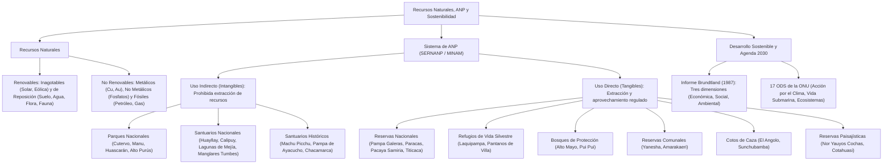

# TEMA 10: Recursos Naturales, Áreas Naturales Protegidas (ANP) y Desarrollo Sostenible

---

## 1. FICHA TÉCNICA Y MATRIZ DE COMPETENCIAS

| Parámetro | Detalle |
| :--- | :--- |
| **Área Curricular** | Ciencias Sociales |
| **Eje Temático** | 03. Ciencias Sociales |
| **Asignatura** | Geografía |
| **Tema** | Tema X: Recursos Naturales, ANP y Desarrollo Sostenible |
| **Código del Archivo** | `CS-GEO-10` |
| **Ponderación UNSA** | Sociales: $1.584321000$ \| Biomédicas: $0.942150000$ \| Ingenierías: $0.812450000$ |
| **Nivel de Dificultad** | Intermedio-Avanzado - Legislación Ambiental y Gestión Ecológica |
| **Prerrequisitos** | Ecorregiones del Perú, Biogeografía, Desarrollo Económico |
| **Tiempo de Estudio** | 4.0 horas de sistematización normativa y análisis de ANP |

### Matriz de Aprendizajes Esperados (Estándar UNSA / UNMSM-DECO / UNI)
* **Conceptual:** Clasificar los recursos naturales (renovables inagotables y de reposición; no renovables metálicos, no metálicos y energéticos). Conocer la estructura y competencias del Sistema Nacional de Áreas Naturales Protegidas por el Estado (SINANPE) administrado por el SERNANP (adscrito al MINAM). Diferenciar con rigor legal las áreas de uso indirecto (intangibles: Parques, Santuarios Nacionales y Santuarios Históricos) de las áreas de uso directo (tangibles: Reservas Nacionales, Refugios, Bosques de Protección, Reservas Comunales, etc.).
* **Procedimental:** Localizar geográficamente las ANP emblemáticas del Perú (Cutervo, Manu, Huascarán, Pampa Galeras, Pacaya Samiria, Paracas, Lagunas de Mejía, Salinas y Aguada Blanca, Machu Picchu).
* **Actitudinal / Crítico:** Evaluar las tres dimensiones del Desarrollo Sostenible (Informe Brundtland y ODS 2030) y proponer soluciones frente a la deforestación minera en Madre de Dios y la sobreexplotación de recursos pesqueros e hídricos.

---

## 2. MAPA TAXONÓMICO Y ONTOLOGÍA



---

## 3. DESARROLLO TEÓRICO FORMAL

### 3.1. Los Recursos Naturales: Definición y Tipología

Son todos aquellos elementos materiales y energéticos que la naturaleza brinda de manera espontánea sin intervención previa del ser humano, y que este aprovecha para satisfacer sus necesidades biológicas y económicas:

#### A. Clasificación de los Recursos Naturales
1. **Recursos Naturales Renovables:**
   * **Inagotables o Continuos:** Aquellos cuyo volumen o flujo energético no se altera ni agota con el uso humano a escala temporal planetaria:
     * *Energía solar, energía eólica, energía mareomotriz, energía geotérmica.*
   * **Semirrenovables o de Reposición (Biológicos y Físicos):** Aquellos que poseen ciclos naturales de regeneración y reproducción, pero que **pueden extinguirse o degradarse irreversiblemente si la tasa de extracción supera su tasa natural de regeneración**:
     * *El suelo agrícola (edafológico), el agua dulce superficial y subterránea, los bosques nativos, los pastizales, la fauna silvestre y los recursos ictiológicos.*
2. **Recursos Naturales No Renovables:**
   * Aquellos que existen en cantidades finitas en la geósfera y cuya formación geológica requirió millones de años; su explotación conduce inevitablemente a su agotamiento físico o económico:
     * **Minerales Metálicos:** Cobre ($Cu$), oro ($Au$), plata ($Ag$), hierro ($Fe$), zinc ($Zn$), plomo ($Pb$), litio ($Li$).
     * **Minerales No Metálicos:** Caliza (para cemento), fosfatos (Bayóvar para fertilizantes), yeso, sal gema, arcillas, mármol.
     * **Combustibles Fósiles / Energéticos:** Petróleo (crudo liviano y pesado), gas natural (metano, etano y líquidos de Camisea), carbón mineral (antracita).

---

### 3.2. Marco Institucional de las Áreas Naturales Protegidas en el Perú

* **Definición de ANP (Ley N.° 26834 - Ley de Áreas Naturales Protegidas):**
  Espacios continentales y/o marinos del territorio nacional reconocidos, establecidos y protegidos legalmente por el Estado debido a su importancia para la conservación de la diversidad biológica y demás valores asociados de interés cultural, paisajístico y científico, así como por su contribución al desarrollo sostenible del país.
* **Institucionalidad Ambiental:**
  * **Ministerio del Ambiente (MINAM):** Ente rector del sector ambiental creado en 2008 (D.L. 1013).
  * **SERNANP (Servicio Nacional de Áreas Naturales Protegidas por el Estado):** Organismo público técnico especializado adscrito al MINAM, encargado de dirigir, gestionar y custodiar el **SINANPE**.
  * **SINANPE (Sistema Nacional de Áreas Naturales Protegidas por el Estado):** Conjunto articulado de ANP de administración nacional.

---

### 3.3. Categorías de Áreas Naturales Protegidas (SINANPE)

La legislación peruana clasifica a las ANP en dos grandes grupos según el grado de intervención humana permitido:

```
                            ÁREAS NATURALES PROTEGIDAS (ANP)
                                          |
            +-----------------------------+-----------------------------+
            |                                                           |
   ÁREAS DE USO INDIRECTO                                     ÁREAS DE USO DIRECTO
      (INTANGIBLES)                                              (TANGIBLES)
  Prohibida la extracción de                               Permitido el aprovechamiento
  recursos naturales. Solo                                 sostenible de recursos bajo
  investigación y turismo.                                 estricto plan de manejo SERNANP.
            |                                                           |
  1. Parques Nacionales (PN)                                4. Reservas Nacionales (RN)
  2. Santuarios Nacionales (SN)                             5. Refugios de Vida Silvestre (RVS)
  3. Santuarios Históricos (SH)                             6. Bosques de Protección (BP)
                                                            7. Reservas Comunales (RC)
                                                            8. Cotos de Caza (CC)
                                                            9. Reservas Paisajísticas (RP)
                                                           10. Zonas Reservadas (ZR - transitoria)
```

---

#### A. Áreas de Uso Indirecto (Carácter Intangible Estricto)
No se permite la extracción de recursos naturales ni modificaciones del ambiente natural. Solo se autorizan la investigación científica no manipulativa, la educación ambiental y el turismo controlado:

1. **Parques Nacionales (PN):**
   * Protegen con carácter intangible ecosistemas completos y vastos, asociaciones de flora y fauna silvestre y características paisajísticas y geomorfológicas excepcionales.
   * **Parques Nacionales Notables:**
     * **Cutervo (Cajamarca):** El **primer Parque Nacional del Perú**, creado en **1961** (protege la Cueva de los Guácharos y bosques de neblina).
     * **Tingo María (Huánuco):** Creado en 1965 (protege la Cueva de las Lechuzas y la formación de la Bella Durmiente).
     * **Manu (Cusco y Madre de Dios):** Declarado Patrimonio de la Humanidad por la UNESCO (1987); una de las mayores reservas de biodiversidad del planeta.
     * **Huascarán (Áncash):** Protege la Cordillera Blanca, sus glaciares, lagunas glaciares y rodales de puya de Raimondi.
     * **Cerros de Amotape (Tumbes y Piura):** Protege los bosques secos ecuatoriales y bosques tropicales del Pacífico.
     * **Bahuaja Sonene (Puno y Madre de Dios):** Protege la Sabana de Palmeras del río Heath y fauna exclusiva (lobo de crin).
     * **Alto Purús (Ucayali y Madre de Dios):** El **Parque Nacional más extenso del Perú** ($> 2.5\text{ millones de hectáreas}$).
     * **Yaguas (Loreto) y Sierra del Divisor (Ucayali/Loreto).**
2. **Santuarios Nacionales (SN):**
   * Protegen con carácter intangible una especie o comunidad determinada de flora y/o fauna silvestre, o formaciones naturales de interés paisajístico y geológico:
     * **Huayllay (Pasco):** Protege el colosal **Bosque de Piedras de Huayllay** a más de $4\,000\text{ m s.n.m.}$
     * **Calipuy (La Libertad):** Protege el rodal más denso de **Puya de Raimondi** (*Puya raimondii*).
     * **Lagunas de Mejía (Islay, Arequipa):** Humedal costero vital que sirve de refugio a más de 140 especies de **aves migratorias intercontinentales**.
     * **Manglares de Tumbes (Tumbes):** Protege el ecosistema de manglares, cocodrilo de Tumbes y conchas negras.
     * **Ampay (Apurímac):** Protege el único bosque relicto de **intimpas** o romerillos (*Podocarpus*), la única conífera nativa del Perú.
     * **Megantoni (Cusco) y Tabaconas Namballe (Cajamarca):** Páramos y bosques de neblina con tapir pinchaque.
3. **Santuarios Históricos (SH):**
   * Protegen espacios intangibles que albergan valores naturales de gran relevancia conjuntamente con escenarios donde ocurrieron acontecimientos históricos trascendentales de la patria o que contienen monumentos arqueológicos de valor universal:
     * **Machu Picchu (Cusco):** Patrimonio Cultural y Natural de la Humanidad (UNESCO); ciudadela incaica enclavada en bosques de neblina con orquídeas y oso de anteojos.
     * **Pampa de Ayacucho (Ayacucho):** Escenario de la **Batalla de Ayacucho (9 de diciembre de 1824)** que selló la independencia continental.
     * **Chacamarca (Junín):** Escenario de la gloriosa **Batalla de Junín (6 de agosto de 1824)** librada por los Húsares de Junín.
     * **Bosque de Pómac (Ferreñafe, Lambayeque):** Protege la mayor concentración de pirámides de barro de la cultura Sicán y el bosque seco de algarrobos más denso del país.

---

#### B. Áreas de Uso Directo (Carácter Tangible y Aprovechamiento Regulado)
Permiten el aprovechamiento y extracción de recursos naturales, prioritariamente por las poblaciones locales tradicionales, bajo planes de manejo técnico aprobados y supervisados por el SERNANP:

4. **Reservas Nacionales (RN):**
   * Destinadas a la conservación de la diversidad biológica y la utilización sostenible de especies de flora y fauna silvestre de valor socioeconómico:
     * **Pampa Galeras Bárbara D'Achille (Ayacucho):** Conservación y manejo sostenible de la **vicuña** (*Vicugna vicugna*) mediante la fiesta ancestral del *Chaccu*.
     * **Paracas (Ica):** Ecosistema marino-costero de lobos marinos, pingüinos de Humboldt y aves guaneras.
     * **Pacaya Samiria (Loreto):** La **Reserva Nacional más extensa del Perú** ($> 2.08\text{ millones de ha}$); "selva de los espejos", manejo de **paiches** y tortugas **charapas**.
     * **Titicaca (Puno):** Totoral del lago sagrado e islas flotantes de los Uros.
     * **Salinas y Aguada Blanca (Arequipa y Moquegua):** Bofedales altoandinos, vicuñas, flamencos y volcanes tutelares (Misti, Chachani, Pichu Pichu).
     * **Junín (Junín y Pasco):** Lago Junín y el zambullidor de Junín (*Podiceps taczanowskii*).
     * **Lachay (Lima), Tambopata (Madre de Dios) y San Fernando (Ica).**
5. **Refugios de Vida Silvestre (RVS):**
   * Requieren intervención activa de manejo para garantizar el mantenimiento de hábitats de especies amenazadas o raras:
     * **Laquipampa (Lambayeque):** Creado expresamente para la conservación de la **pava aliblanca**.
     * **Los Pantanos de Villa (Chorrillos, Lima):** Humedal costero para aves migratorias en plena metrópoli.
6. **Bosques de Protección (BP):**
   * Preservan las cuencas altas de los ríos, laderas escarpadas y cabeceras de cuenca contra la erosión, huaicos y deslizamientos para asegurar el agua potable y de riego:
     * **Alto Mayo (San Martín), Pui Pui (Junín), San Matías - San Carlos (Pasco).**
7. **Reservas Comunales (RC):**
   * Áreas destinadas a la conservación de fauna silvestre para el beneficio y sustento tradicional de las comunidades campesinas y nativas vecinas:
     * **Yanesha (Pasco, la primera creada en 1988), Amarakaeri (Madre de Dios), Asháninka (Junín/Cusco), El Sira (Huánuco/Pasco/Ucayali).**
8. **Cotos de Caza (CC):**
   * Áreas destinadas al aprovechamiento de la fauna silvestre mediante la práctica deportiva regulada de la caza:
     * **El Angolo (Piura):** Caza regulada de venado cola blanca.
     * **Sunchubamba (Cajamarca):** Ciervos rojos y venados grises.
9. **Reservas Paisajísticas (RP):**
   * Protegen ambientes donde la armoniosa interacción histórica entre el hombre y la naturaleza ha forjado un paisaje de singular belleza estética y cultural:
     * **Subcuenca del Cotahuasi (La Unión, Arequipa):** La **Reserva Paisajística más extensa del Perú**, protege el Cañón de Cotahuasi y andenerías vivas.
     * **Nor Yauyos Cochas (Lima y Junín):** Cascadas y lagunas esmeralda escalonadas del río Cañete.
10. **Zonas Reservadas (ZR):**
    * Áreas de carácter transitorio que reúnen las condiciones para ser incorporadas al SINANPE pero que requieren estudios de campo complementarios para determinar su categoría y delimitación definitiva (e.g., Chancaybaños, Bosque Zárate).

---

### 3.4. Desarrollo Sostenible y la Agenda 2030

* **Concepto Canónico (Informe Brundtland, 1987):**
  *"El desarrollo que satisface las necesidades de la generación presente sin comprometer la capacidad de las generaciones futuras para satisfacer sus propias necesidades"*.
* **Las Tres Dimensiones del Desarrollo Sostenible:**
  1. **Sostenibilidad Ambiental:** Conservación de la biósfera, uso racional de recursos, descarbonización y protección de la biodiversidad.
  2. **Sostenibilidad Económica:** Crecimiento productivo eficiente, diversificación industrial, economía circular y empleo digno.
  3. **Sostenibilidad Social:** Erradicación de la pobreza, equidad de género, salud, educación de calidad y justicia social.
* **Objetivos de Desarrollo Sostenible (ODS de la ONU - 17 Metas hacia el 2030):**
  * ODS 6: Agua limpia y saneamiento.
  * ODS 7: Energía asequible y no contaminante.
  * ODS 12: Producción y consumo responsables.
  * ODS 13: Acción por el clima (reducción de emisiones de GEI).
  * ODS 14: Vida submarina (protección del mar contra la sobrepesca y plásticos).
  * ODS 15: Vida de ecosistemas terrestres (freno a la deforestación y desertificación).

---

## 4. FORMULARIO MAESTRO / CUADRO SINÓPTICO

### Cuadro Sinóptico de ANP Notables del Perú y Récords

| Categoría | Nombre de la ANP | Ubicación Departamental | Característica / Récord Notable |
| :--- | :--- | :--- | :--- |
| **Parque Nacional** | **Cutervo** | Cajamarca | **El primer Parque Nacional del Perú (1961)**. |
| **Parque Nacional** | **Alto Purús** | Ucayali y Madre de Dios | **El Parque Nacional más extenso del Perú** ($> 2.5\text{ millones de ha}$). |
| **Parque Nacional** | **Huascarán** | Áncash | Protege la Cordillera Blanca y el nevado Huascarán. |
| **Parque Nacional** | **Manu** | Cusco y Madre de Dios | Patrimonio de la Humanidad (UNESCO); megadiverso. |
| **Santuario Nacional**| **Huayllay** | Pasco | **Bosque de piedras más grande del Perú** ($4\,000\text{ m s.n.m.}$). |
| **Santuario Nacional**| **Lagunas de Mejía** | Arequipa (Islay) | Humedal costero para más de 140 aves migratorias. |
| **Santuario Nacional**| **Manglares de Tumbes** | Tumbes | Ecosistema de manglar, conchas negras y cocodrilo. |
| **Santuario Nacional**| **Calipuy** | La Libertad | Rodal más denso de Puya de Raimondi. |
| **Santuario Histórico**| **Machu Picchu** | Cusco | Patrimonio Mixto UNESCO (Arqueológico y Bosque de Neblina). |
| **Santuario Histórico**| **Pampa de Ayacucho** | Ayacucho | Escenario de la Batalla de Ayacucho (1824). |
| **Santuario Histórico**| **Bosque de Pómac** | Lambayeque | Pirámides de Sicán y bosque seco de algarrobales. |
| **Reserva Nacional** | **Pampa Galeras** | Ayacucho | Recuperación y manejo sostenible de la **vicuña**. |
| **Reserva Nacional** | **Pacaya Samiria** | Loreto | **La Reserva Nacional más extensa del Perú** ($> 2.08\text{ millones de ha}$). |
| **Reserva Nacional** | **Salinas y Aguada Blanca**| Arequipa y Moquegua | Volcanes tutelares (Misti), vicuñas y bofedales. |
| **Reserva Paisajística**| **Subcuenca Cotahuasi**| Arequipa (La Unión) | **La Reserva Paisajística más extensa del país**. |
| **Refugio Vida Silv.**| **Laquipampa** | Lambayeque | Conservación de la **pava aliblanca**. |

---

## 5. MNEMOTECNIAS DE COMBATE PREUNIVERSITARIO

### Mnemotecnia 1: Las 3 Áreas de Uso Indirecto (Intangibles)
**"PAR-SAN-HIS" (No se toca nada):**
* **PAR** $\rightarrow$ **PAR**ques Nacionales
* **SAN** $\rightarrow$ **SAN**tuarios Nacionales
* **HIS** $\rightarrow$ Santuarios **HIS**tóricos

*Regla mnemotécnica:* **"En el PARque, los dos SANtos son INTANGIBLES"**.

### Mnemotecnia 2: Récords de Extensión de ANP
* El Parque Nacional más grande: **Alto PURÚS** (Purús = Puro tamaño).
* La Reserva Nacional más grande: **Pacaya SAMIRIA** (Samiria = Selva marina inmensa).
* El Parque Nacional más antiguo: **CUTERVO** (1961).

---

## 6. TÉCNICAS Y ARTIFICIOS DE RESOLUCIÓN (HACKING PREUNIVERSITARIO)

1. **Diferenciación Jurídica Inmediata en Examen:**
   * Si la pregunta dice: *¿En cuál de las siguientes áreas está absolutamente prohibida la extracción comercial de recursos naturales y la tala de madera?*
   * Busca entre las claves un **Parque Nacional, Santuario Nacional o Santuario Histórico** (Uso Indirecto / Intangible).
   * Si dice: *¿En cuál se permite el aprovechamiento tradicional sustentable bajo planes de manejo aprobados por SERNANP?*
   * Busca una **Reserva Nacional, Reserva Comunal o Coto de Caza** (Uso Directo / Tangible).
2. **Identificación de Huayllay vs. Calipuy:**
   * **Huayllay (Pasco):** Piedras / Bosque geológico.
   * **Calipuy (La Libertad):** Dos ANP: el Santuario Nacional protege la *Puya de Raimondi* y la Reserva Nacional protege el *Guanaco*.

---

## 7. ZONA DE TRAMPAS Y DISTRACTORES ("¡PELIGRO EXAMEN!")

* ⚠️ **Trampa 1: Confundir Reserva Nacional con Santuario Nacional:**
  * En una **Reserva Nacional** sí se pueden esquilar vicuñas o pescar paiches de forma regulada (**Uso Directo**).
  * En un **Santuario Nacional** está prohibida toda extracción comercial (**Uso Indirecto / Intangible**).
* ⚠️ **Trampa 2: La autoridad de las ANP no es el Ministerio de Agricultura:**
  * Es el **SERNANP**, organismo adscrito al **MINAM** (Ministerio del Ambiente).
* ⚠️ **Trampa 3: ¿Machu Picchu es solo arqueológico?**
  * ¡Falso! Machu Picchu es un **Santuario Histórico**, lo que significa que protege tanto las ruinas incaicas como la rica flora (orquídeas) y fauna (oso de anteojos) del bosque de neblina circundante.

---

## 8. APLICACIÓN AL MUNDO REAL Y CONTEXTO DECO

### Caso de Estudio DECO: El Éxito Comunitario de Pampa Galeras y la Recuperación de la Vicuña
En la década de 1960, la vicuña (*Vicugna vicugna*) estuvo al borde de la extinción en los Andes peruanos debido a la caza furtiva implacable por su finísima fibra:
1. **Acción Conservacionista:** En 1967 el Estado creó la **Reserva Nacional Pampa Galeras** (Lucanas, Ayacucho), combinando patrullaje de guardaparques con el protagonismo de las comunidades campesinas locales.
2. **Modelo de Uso Directo Sostenible:** Mediante el ancestral *Chaccu* (rodeo incaico), las vicuñas son capturadas vivas, esquiladas pacíficamente sin sacrificarlas y liberadas nuevamente a su hábitat natural. La comercialización legal de la fibra bruta beneficia directamente a las comunidades altoandinas, convirtiendo la conservación biológica en un motor de inclusión socioeconómica y desarrollo rural sostenible.

---

## 9. BANCO DE 5 EJERCICIOS RESUELTOS GRADUADOS

### Ejercicio 1 (Nivel 1 - Básico Formativo: Categorías de ANP)
**Enunciado:**
En el marco de la Ley de Áreas Naturales Protegidas del Perú (Ley N.° 26834), las unidades de conservación categorizadas como de "Uso Indirecto" se distinguen legalmente de las de "Uso Directo" porque en ellas:
* A) Se permite la extracción masiva de minerales metálicos bajo concesión privada.
* B) No se permite la extracción de recursos naturales ni modificaciones al paisaje natural, siendo de carácter intangible.
* C) La custodia y administración recae exclusivamente en comunidades campesinas comunales.
* D) Solo se permite la cacería deportiva de especies cinegéticas introducidas.
* E) El ingreso de visitantes y turistas está penalizado con pena privativa de la libertad.

**Solución Paso a Paso:**
1. La legislación ambiental peruana establece que en las áreas de **Uso Indirecto** (Parques Nacionales, Santuarios Nacionales y Santuarios Históricos) la protección es estricta e intangible.
2. No se permite la extracción de recursos naturales ni la alteración del medio; solo se admite la investigación científica no manipulativa, la educación y el turismo regulado.
* **Respuesta Correcta:** **B**

---

### Ejercicio 2 (Nivel 2 - Intermedio UNSA Ordinario: ANP de Arequipa)
**Enunciado:**
En el departamento de Arequipa se localizan importantes áreas protegidas por el Estado. La unidad de conservación costera situada en la provincia de Islay, categorizada como Santuario Nacional y que constituye un refugio de vital importancia para más de 140 especies de aves migratorias que cruzan el hemisferio, se denomina:
* A) Salinas y Aguada Blanca
* B) Lagunas de Mejía
* C) Subcuenca del Cotahuasi
* D) Lomas de Atiquipa
* E) Manglares de Tumbes

**Solución Paso a Paso:**
1. El Santuario Nacional ubicado en la costa de Islay (Arequipa) que protege humedales costeros y esteros para aves playeras migratorias intercontinentales es el **Santuario Nacional Lagunas de Mejía**.
2. Salinas y Aguada Blanca es una Reserva Nacional (altiplano) y la Subcuenca del Cotahuasi es una Reserva Paisajística.
* **Respuesta Correcta:** **B**

---

### Ejercicio 3 (Nivel 3 - Avanzado UNMSM DECO: Parques Nacionales y Récords)
**Enunciado:**
El Parque Nacional más extenso de todo el territorio peruano, ubicado en los confines amazónicos de los departamentos de Ucayali y Madre de Dios, que protege una vasta extensión de bosques tropicales prístinos y cabeceras de cuenca donde habitan pueblos indígenas en aislamiento voluntario (PIACI), es el:
* A) Parque Nacional del Manu
* B) Parque Nacional Huascarán
* C) Parque Nacional Cutervo
* D) Parque Nacional Alto Purús
* E) Parque Nacional Bahuaja Sonene

**Solución Paso a Paso:**
1. Aunque el Manu es muy famoso, el Parque Nacional de mayor superficie del Perú es el **Parque Nacional Alto Purús**, abarcando más de $2\,510\,000\text{ hectáreas}$.
2. Fue creado en 2004 para resguardar la continuidad de los bosques húmedos del Purús y garantizar el territorio intangible de etnias indígenas no contactadas como los Mashco Piro.
* **Respuesta Correcta:** **D**

---

### Ejercicio 4 (Nivel 4 - Crítico / Interdisciplinario UNI: Recursos No Renovables y Fosfatos)
**Enunciado:**
Los recursos naturales no renovables existen en cantidades finitas en la corteza terrestre. En el departamento de Piura, en el desierto de Sechura, se explota uno de los mayores yacimientos de minerales no metálicos del continente en la depresión de Bayóvar. Dicho recurso es fundamental para la seguridad alimentaria global debido a que se utiliza primordialmente como insumo en la fabricación de:
* A) Combustibles nucleares enriquecidos
* B) Fertilizantes agrícolas a base de fosfatos
* C) Cemento Portland para obras viales
* D) Baterías recargables de litio
* E) Componentes de aleación de bronce y acero

**Solución Paso a Paso:**
1. La depresión de Bayóvar en Sechura (Piura) contiene inmensos depósitos sedimentarios de rocas fosfóricas (fosfatos de calcio).
2. El fósforo ($P$) es un macronutriente vegetal esencial para la agricultura intensiva. Por consiguiente, los fosfatos de Bayóvar se extraen a escala masiva para producir **fertilizantes químicos agrícolas**, exportados a los principales mercados agroalimentarios del mundo.
* **Respuesta Correcta:** **B**

---

### Ejercicio 5 (Nivel 5 - Boss Challenge: Desarrollo Sostenible y Minería Ilegal DECO)
**Enunciado:**
Lea con atención el siguiente reporte sobre la problemática socioambiental en la cuenca del río Madre de Dios:
*"En la zona de amortiguamiento de la Reserva Nacional Tambopata (sector La Pampa), la minería aluvial aurífera ilegal ha destruido más de $30\,000\text{ hectáreas}$ de bosques primarios mediante el empleo de dragas, motores y retroexcavadoras. Dicha actividad vierte toneladas de mercurio líquido a los cursos fluviales, bioacumulándose en la carne de peces carnívoros como el zúngaro y la mota, provocando graves daños neurológicos en las comunidades nativas Esse Ejja que dependen de la pesca tradicional, al tiempo que genera trata de personas y evasión tributaria masiva".*

Desde la perspectiva epistemológica del Desarrollo Sostenible (Informe Brundtland y ODS 2030), este problema evidencia:
I. La vulneración simultánea de las tres dimensiones del desarrollo sostenible: ambiental (ecocidio y contaminación química), social (salud pública y explotación humana) y económica (actividad ilícita sin valor agregado).  
II. Un conflicto directo con el ODS 15 (Vida de ecosistemas terrestres) y el ODS 6 (Agua limpia y saneamiento).  
III. La comprobación de que el aprovechamiento minero informal en zonas de amortiguamiento cumple plenamente con los objetivos de una Reserva Nacional.  
IV. La necesidad imperativa de fortalecer la presencia del Estado, la interdicción policial y la remediación ecológica del suelo amazónico.

Son proposiciones correctas:
* A) I, II y III
* B) I, II y IV
* C) II y IV
* D) Solo I y IV
* E) I, II, III y IV

**Solución Paso a Paso:**
1. **Evaluación de I:** La minería ilegal en La Pampa destruye el bosque y contamina con mercurio (ambiental), enferma y vulnera a las comunidades nativas (social) y genera economía delictiva sin tributación formal (económica). (Verdadero).
2. **Evaluación de II:** Atenta de forma directa contra los ODS 15 (pérdida de biodiversidad terrestre) y ODS 6 (envenenamiento de fuentes de agua potable). (Verdadero).
3. **Evaluación de III:** La minería ilegal viola flagrantemente el plan de manejo y los objetivos de conservación de la Reserva Nacional Tambopata y su zona de amortiguamiento. (Falso).
4. **Evaluación de IV:** La restauración de la legalidad ambiental requiere interdicción y remediación biológica con especies pioneras. (Verdadero).
* Conclusión: Son correctas I, II y IV.
* **Respuesta Correcta:** **B**

---

## 10. GLOSARIO DE 10 TÉRMINOS CLAVE

1. **SINANPE:** Sistema Nacional de Áreas Naturales Protegidas por el Estado, integrado por las ANP de administración nacional.
2. **SERNANP:** Organismo público adscrito al Ministerio del Ambiente (MINAM) rector técnico de la gestión y conservación de las ANP.
3. **Uso Indirecto (Intangible):** Régimen legal de protección estricta donde no se permite la extracción de recursos naturales (Parques y Santuarios).
4. **Uso Directo (Tangible):** Régimen de protección donde se permite el aprovechamiento y extracción sostenible de recursos bajo planes de manejo técnico supervisados (Reservas y Cotos).
5. **Zona de Amortiguamiento:** Faja territorial periférica adyacente a un ANP que requiere un tratamiento especial para garantizar la conservación del área protegida.
6. **Vicuña:** Camélido sudamericano silvestre (*Vicugna vicugna*) cuya finísima fibra es aprovechada sustentablemente en la Reserva Nacional Pampa Galeras.
7. **Poblaciones en Aislamiento (PIACI):** Pueblos indígenas amazónicos que han optado por no mantener contacto con la sociedad mayoritaria, protegidos en Parques Nacionales como Alto Purús.
8. **Informe Brundtland:** Documento de la ONU (1987) titulado *Nuestro Futuro Común* que formalizó la definición canónica del Desarrollo Sostenible.
9. **Biocapacidad:** Capacidad de los ecosistemas del planeta para generar recursos renovables y absorber los desechos producidos por las actividades humanas.
10. **Chaccu:** Práctica comunitaria andina ancestral de rodeo, captura, esquila pacífica y liberación de vicuñas vivas sin sacrificarlas.

---

## 11. BANCO DE FLASHCARDS (Q/A)

* **PREGUNTA:** ¿Cuál es la diferencia jurídica básica entre un Parque Nacional y una Reserva Nacional en el Perú?
  * **RESPUESTA:** El Parque Nacional es de Uso Indirecto (intangible, prohibida la extracción de recursos); la Reserva Nacional es de Uso Directo (aprovechamiento regulado con planes de manejo).
* **PREGUNTA:** ¿Qué organismo técnico administra el SINANPE y a qué ministerio se encuentra adscrito?
  * **RESPUESTA:** El SERNANP (Servicio Nacional de Áreas Naturales Protegidas), adscrito al MINAM.
* **PREGUNTA:** ¿Cuál fue el primer Parque Nacional creado en el Perú y en qué departamento se ubica?
  * **RESPUESTA:** El Parque Nacional de Cutervo (Cajamarca), creado en 1961.
* **PREGUNTA:** ¿Cuál es el Parque Nacional más extenso del territorio peruano?
  * **RESPUESTA:** El Parque Nacional Alto Purús (Ucayali y Madre de Dios), con más de $2.5\text{ millones de hectáreas}$.
* **PREGUNTA:** ¿Qué protege el Santuario Nacional Lagunas de Mejía en el departamento de Arequipa?
  * **RESPUESTA:** Un humedal costero vital que sirve de refugio a más de 140 especies de aves migratorias intercontinentales.
* **PREGUNTA:** ¿Qué especie emblemática se protege y aprovecha mediante el chaccu en la Reserva Nacional Pampa Galeras?
  * **RESPUESTA:** La vicuña (*Vicugna vicugna*).
* **PREGUNTA:** ¿Cuál es la Reserva Nacional más extensa del Perú y qué fauna acuática protege?
  * **RESPUESTA:** Pacaya Samiria (Loreto), con más de 2 millones de hectáreas; protege al paiche y a la tortuga charapa.
* **PREGUNTA:** ¿Qué hechos históricos conmemoran los Santuarios Históricos de Chacamarca y Pampa de Ayacucho?
  * **RESPUESTA:** Las batallas de Junín (6 de agosto de 1824) y de Ayacucho (9 de diciembre de 1824) que sellaron la independencia americana.
* **PREGUNTA:** ¿Qué define el Informe Brundtland (1987) como Desarrollo Sostenible?
  * **RESPUESTA:** Aquel desarrollo que satisface las necesidades del presente sin comprometer la capacidad de las futuras generaciones para satisfacer las suyas.
* **PREGUNTA:** ¿Qué mineral no metálico indispensable para fertilizantes agrícolas se explota en la depresión de Bayóvar?
  * **RESPUESTA:** Los fosfatos de calcio (rocas fosfóricas).

---

## 12. MOTOR DE GAMIFICACIÓN (JSON NATIVO KMP)

```json
{
  "subjectCode": "GEO",
  "subjectName": "Geografía",
  "topicId": "GEO-10",
  "topicTitle": "Recursos Naturales, ANP y Desarrollo Sostenible",
  "totalXP": 300,
  "difficulty": "AVANZADO",
  "unsaWeight": 1.584321,
  "badges": [
    {
      "id": "BADGE_GEO_GUARDAPARQUE_ELITE",
      "title": "Guardaparque Ilustre del SERNANP",
      "description": "Dominas con precisión jurídica las categorías tangibles e intangibles del SINANPE y las ANP del Perú.",
      "icon": "park_ranger_hat_gold"
    },
    {
      "id": "BADGE_GEO_DEFENSOR_SOSTENIBLE",
      "title": "Embajador de la Agenda 2030",
      "description": "Articulas con maestría las tres dimensiones de la sostenibilidad frente a la depredación de recursos.",
      "icon": "sdg_globe_sustainable"
    }
  ],
  "missions": [
    {
      "missionId": "GEO_M1_INTANGIBLE_VS_TANGIBLE",
      "title": "El Muro Legal de la Conservación",
      "requiredPoints": 100,
      "xpReward": 100,
      "task": "Diferenciar sin error 5 unidades entre Uso Indirecto (Parques/Santuarios) y Uso Directo (Reservas/Cotos)."
    },
    {
      "missionId": "GEO_M2_RECORDS_ANP",
      "title": "Expedición a las ANP Emblemáticas",
      "requiredPoints": 100,
      "xpReward": 100,
      "task": "Ubicar geográficamente Cutervo, Alto Purús, Pacaya Samiria, Lagunas de Mejía y Pampa Galeras."
    },
    {
      "missionId": "GEO_M3_SOSTENIBILIDAD",
      "title": "Misión de Rescate en la Amazonía",
      "requiredPoints": 100,
      "xpReward": 100,
      "task": "Analizar la huella ecológica y proponer soluciones a la minería ilegal de oro en Madre de Dios."
    }
  ],
  "questions": [
    {
      "id": "GEO_Q1",
      "type": "SINGLE_CHOICE",
      "question": "En la legislación ambiental peruana, ¿cuál de las siguientes categorías de ANP corresponde a un área de Uso Indirecto (carácter intangible)?",
      "options": [
        "Reserva Nacional",
        "Reserva Comunal",
        "Santuario Nacional",
        "Coto de Caza",
        "Bosque de Protección"
      ],
      "correctIndex": 2,
      "explanation": "Los Santuarios Nacionales son áreas de Uso Indirecto donde está prohibida la extracción de recursos naturales y la modificación del hábitat (intangibilidad estricta)."
    },
    {
      "id": "GEO_Q2",
      "type": "SINGLE_CHOICE",
      "question": "La unidad de conservación creada para el manejo sostenible y la recuperación poblacional de la vicuña mediante el chaccu comunal es la:",
      "options": [
        "Reserva Nacional Pampa Galeras Bárbara D'Achille",
        "Reserva Nacional Pacaya Samiria",
        "Santuario Nacional Calipuy",
        "Parque Nacional Huascarán",
        "Reserva Nacional Salinas y Aguada Blanca"
      ],
      "correctIndex": 0,
      "explanation": "La Reserva Nacional Pampa Galeras Bárbara D'Achille (Ayacucho) fue creada expresamente para la conservación y uso sustentable de la vicuña."
    }
  ]
}
```
