# TEMA 11: Población y Demografía del Perú y el Mundo

---

## 1. FICHA TÉCNICA Y MATRIZ DE COMPETENCIAS

| Parámetro | Detalle |
| :--- | :--- |
| **Área Curricular** | Ciencias Sociales |
| **Eje Temático** | 03. Ciencias Sociales |
| **Asignatura** | Geografía |
| **Tema** | Tema XI: Población y Demografía del Perú y el Mundo |
| **Código del Archivo** | `CS-GEO-11` |
| **Ponderación UNSA** | Sociales: $1.584321000$ \| Biomédicas: $0.942150000$ \| Ingenierías: $0.812450000$ |
| **Nivel de Dificultad** | Intermedio - Analítico, Estadístico y Cuantitativo |
| **Prerrequisitos** | Razonamiento aritmético, tasas porcentuales, geografía humana general |
| **Tiempo de Estudio** | 4.0 horas de análisis estadístico e interpretación piramidal |

### Matriz de Aprendizajes Esperados (Estándar UNSA / UNMSM-DECO / UNI)
* **Conceptual:** Comprender los conceptos demográficos fundamentales (población absoluta, densidad poblacional, TBN, TBM, TGF, esperanza de vida, saldo migratorio y bono demográfico). Analizar las fases de la transición demográfica y la morfología de las pirámides de edades (expansiva, estacionaria y regresiva).
* **Procedimental:** Resolver problemas de cálculo demográfico (densidad y tasas de crecimiento), interpretar la estructura de la Población Económicamente Activa (PEA) e identificar las causas y consecuencias del centralismo y las corrientes migratorias campo-ciudad en el Perú.
* **Actitudinal / Crítico:** Evaluar críticamente el envejecimiento poblacional, la informalidad laboral, la crisis de los servicios públicos en las periferias urbanas y proponer políticas de descentralización territorial efectiva.

---

## 2. MAPA TAXONÓMICO Y ONTOLOGÍA

```mermaid
graph TD
    DEMO["Demografía y Población"] --> FUENTES["Fuentes e Indicadores Básicos"]
    DEMO --> ESTRUC["Estructura Poblacional y Transición"]
    DEMO --> DISTRIB["Distribución Territorial en el Perú"]
    DEMO --> MIGRAC["Dinámica Migratoria y Global"]

    FUENTES --> CENSOS["Censos Nacionales (INEI): De Hecho (Facto) y De Derecho (Jure)"]
    FUENTES --> IND_VOL["Volumen: Población Absoluta y Densidad Poblacional (D = P / S)"]
    FUENTES --> IND_DIN["Dinámica: Natalidad (TBN), Fecundidad (TGF), Mortalidad (TBM), Esperanza de Vida"]

    ESTRUC --> PIRAM["Pirámides de Edades: Expansiva (Joven), Estacionaria y Regresiva (Envejecida)"]
    ESTRUC --> BONO["Bono Demográfico: Mayor PEA productiva respecto a dependientes"]
    ESTRUC --> PEA["Población en Edad de Trabajar (PET) $\to$ PEA (Ocupada/Subempleada/Desempleada)"]

    DISTRIB --> REGIONES["Costa: 58% (Hiperconcentrada) | Sierra: 28% | Selva: 14%"]
    DISTRIB --> URB_RUR["Urbanización Acelerada: 80% Urbano vs. 20% Rural (Macrocéfalo Limeño)"]
    DISTRIB --> DEPTS["Más Poblados: Lima, Piura, La Libertad, Arequipa | Menos: Madre de Dios"]

    MIGRAC --> INTERNA["Migración Interna: Éxodo rural andino a la costa (Barriadas, centralismo)"]
    MIGRAC --> MUNDIAL["Mundo: > 8 000 millones. Países líderes: India, China, EE. UU."]
```



---

## 3. DESARROLLO TEÓRICO FORMAL

### 3.1. Demografía: Definición, Fuentes y Censos

La **Demografía** es la disciplina científica que estudia estadísticamente la estructura, volumen, distribución espacial y evolución dinámica de las poblaciones humanas a lo largo del tiempo.
* **Fuentes Demográficas Principales:**
  1. **Los Censos de Población y Vivienda:** Recuento universal, simultáneo e individualizado de todos los habitantes de un territorio en un momento determinado. En el Perú son ejecutados por el **INEI (Instituto Nacional de Estadística e Informática)**:
     * *Censo de Hecho o de Facto:* Empadrona a las personas en el lugar físico exacto donde pasaron la noche anterior al censo (Día del Censo con inamovilidad ciudadana obligatoria, tradicional en el Perú).
     * *Censo de Derecho o de Jure:* Empadrona a las personas en su lugar de residencia habitual o legal, prolongándose durante varias semanas.
  2. **Registros Civiles:** Estadísticas vitales continuas custodiadas por el RENIEC (nacimientos, defunciones, matrimonios y divorcios).
  3. **Encuestas por Muestreo:** Como la ENAHO (Encuesta Nacional de Hogares) y ENDES (Encuesta Demográfica y de Salud Familiar).

---

### 3.2. Indicadores Demográficos Fundamentales

#### A. Indicadores de Volumen y Ocupación Espacial
1. **Población Absoluta ($P$):**
   * Número total de habitantes que residen en un territorio geográfico determinado.
   * *Perú (Proyecciones INEI 2024-2026):* $\approx \mathbf{34.0\text{ millones de habitantes}}$ (5.° país más poblado de Sudamérica y 8.° de América).
   * *Mundo:* Superó los **$8\,050\text{ millones de personas}$** en 2023.
2. **Población Relativa o Densidad Poblacional ($D$):**
   * Relación matemática entre el número total de habitantes y la superficie territorial en kilómetros cuadrados:
     $$D = \frac{\text{Población Absoluta }(P)}{\text{Superficie en km}^2\text{ }(S)}$$
   * *Densidad Media del Perú:* $D = \frac{34\,000\,000\text{ hab}}{1\,285\,216\text{ km}^2} \approx \mathbf{26.5\text{ hab/km}^2}$.
   * *Contrastes extremos de densidad:*
     * Provincia Constitucional del Callao: $> 7\,000\text{ hab/km}^2$.
     * Departamento de Lima: $> 300\text{ hab/km}^2$.
     * Departamento de Madre de Dios: Apenas $\approx \mathbf{1.8\text{ hab/km}^2}$ (el menos denso del país).

---

#### B. Indicadores de Dinámica Poblacional
1. **Tasa Bruta de Natalidad (TBN):**
   * Número de nacidos vivos registrados por cada $1\,000$ habitantes en un año:
     $$\text{TBN} = \left( \frac{\text{Nacidos Vivos en el año}}{\text{Población Total Media}} \right) \times 1\,000$$
   * En el Perú ha descendido significativamente: de $45‰$ en 1960 a cerca de $\approx 16‰ - 17‰$.
2. **Tasa Global de Fecundidad (TGF):**
   * Promedio de hijos vivos que tendría una mujer al final de su vida reproductiva ($15$ a $49$ años).
   * En el Perú ha experimentado una caída drástica: de $6.8\text{ hijos/mujer}$ en 1965 a **$1.9\text{ hijos/mujer}$** en la actualidad, situándose por debajo de la **tasa de reemplazo generacional ($2.1\text{ hijos/mujer}$)**.
3. **Tasa Bruta de Mortalidad (TBM):**
   * Número de defunciones por cada $1\,000$ habitantes en un año:
     $$\text{TBM} = \left( \frac{\text{Defunciones en el año}}{\text{Población Total Media}} \right) \times 1\,000$$
   * En el Perú se sitúa en torno al $\approx 5.5‰ - 6.0‰$.
4. **Tasa de Mortalidad Infantil (TMI):**
   * Número de niños fallecidos antes de cumplir el primer año de vida por cada $1\,000$ nacidos vivos. Es el indicador por excelencia del nivel de desarrollo sociosanitario y nutricional de un país (en el Perú ronda el $11‰ - 12‰$, aunque en zonas rurales andinas duplica dicha cifra).
5. **Crecimiento Natural o Vegetativo ($CN$):**
   * Balance entre nacimientos y defunciones sin considerar la migración:
     $$\text{Tasa de Crecimiento Natural } (TCN) = \text{TBN} - \text{TBM}$$
6. **Crecimiento Real o Social de la Población ($CR$):**
   * Incorpora el saldo migratorio internacional:
     $$CR = (\text{Nacimientos} - \text{Defunciones}) + (\text{Inmigrantes} - \text{Emigrantes})$$
   * *Tasa anual de crecimiento demográfico del Perú:* $\approx 1.0\% - 1.2\%$ anual.
7. **Esperanza de Vida al Nacer:**
   * Promedio de años que se espera que viva un recién nacido bajo las condiciones de mortalidad vigentes.
   * *Perú:* Promedio nacional de **$\approx 77\text{ años}$** (Mujeres: $\approx 79.5\text{ años}$; Hombres: $\approx 74.5\text{ años}$).

---

### 3.3. Estructura Poblacional: Pirámides de Edades y Bono Demográfico

Las **pirámides poblacionales** son histogramas dobles horizontales que grafican la composición por edad (eje vertical) y sexo (eje horizontal: varones a la izquierda, mujeres a la derecha):

```
       EXPANSIVA (Triangular)                ESTACIONARIA (Campana)                 REGRESIVA (Urna)
         Países Subdesarrollados                En Transición (Perú)                Países Envejecidos
                  /\                                    /\                                 /--\
                 /  \                                  /  \                               /    \
                /    \                                |    |                              |    |
               /      \                               |    |                              |    |
              /        \                              |    |                              \    /
             /__________\                             \____/                               \__/
         Base ancha: Alta natalidad             Base moderada: Caída TBN             Base estrecha: Muy baja TBN
        Cúspide estrecha: Baja esp. vida       Cúspide ensanchándose: Bono          Cúspide ancha: Envejecimiento
```

1. **Tipos de Pirámides:**
   * **Pirámide Progresiva o Expansiva (Forma Triangular):** Base muy ancha y cúspide estrecha. Indica altísima natalidad y elevada mortalidad; población eminentemente joven infantil (África subsahariana; Perú en los años 1960).
   * **Pirámide Estacionaria o de Transición (Forma de Campana):** La base comienza a estrecharse por reducción de la natalidad y se ensancha el cuerpo central. **Estructura actual del Perú**.
   * **Pirámide Regresiva o Constrictiva (Forma de Urna):** Base más angosta que el centro y cúspide ensanchada. Indica bajísima natalidad y envejecimiento poblacional pronunciado (Japón, Italia, España, Alemania).
2. **El Bono Demográfico en el Perú:**
   * Fenómeno demográfico temporal en el cual **el porcentaje de población en edad de trabajar (PET: 15 a 64 años) es significativamente mayor que la población dependiente** (niños menores de 15 años y adultos mayores de 65 años).
   * La relación de dependencia disminuye. Constituye una ventana histórica de oportunidad para elevar el ahorro, la inversión educativa, la industrialización y la productividad antes de que la sociedad envejezca irreversiblemente (hacia el 2045-2050).
3. **Estructura Socioeconómica de la Población (PET y PEA):**
   * **Población en Edad de Trabajar (PET):** Personas de $14\text{ años y más}$ (según estándar oficial OIT/INEI en el Perú).
   * **PEA (Población Económicamente Activa):** Quienes están trabajando o buscando activamente empleo:
     * *PEA Ocupada:* Subdividida en **empleo adecuado** (remuneración por encima del mínimo legal y jornada laboral formal con beneficios) y **subempleo** (por horas o por ingresos insuficientes). En el Perú, la informalidad laboral alcanza al **$72\% - 75\%$ de la PEA**.
     * *PEA Desocupada (Desempleo abierto).*
   * **PEI (Población Económicamente Inactiva / No PEA):** Estudiantes que no trabajan, amas de casa dedicadas exclusivamente al hogar, jubilados, pensionistas y personas con discapacidad permanente para el trabajo.

---

### 3.4. Distribución Territorial de la Población Peruana

Existe una profunda asimetría y desequilibrio geográfico entre la extensión territorial y la concentración humana:

| Región Natural | Porcentaje del Territorio Nacional | Porcentaje de la Población Peruana | Densidad y Realidad Demográfica |
| :--- | :--- | :--- | :--- |
| **Costa** | **$11.7\%$** | **$\approx 58.0\%$** | Hiperconcentrada, densa, urbanizada, déficit de recursos hídricos. |
| **Sierra** | **$28.0\%$** | **$\approx 28.0\%$** | Históricamente la más poblada hasta 1960; hoy expulsora neta de población. |
| **Selva** | **$60.3\%$** | **$\approx 14.0\%$** | Gran vacío demográfico relativo; densidades menores a $3\text{ hab/km}^2$. |

#### A. Proceso de Urbanización Acelerada
* **Transición Urbano-Rural:**
  * En 1940: El $65\%$ de los peruanos vivía en el campo y solo el $35\%$ en ciudades.
  * En la actualidad: **Cerca del $80\%$ es población urbana** y apenas el $20\%$ es población rural.
* **Macrocéfalo Urbano de Lima Metropolitana:**
  * Lima y Callao albergan a más de **$10.5\text{ millones de habitantes}$** (concentrando casi un tercio de la población nacional en menos del $0.3\%$ del territorio), generando saturación del transporte, escasez de agua potable y proliferación de cinturones marginales.

#### B. Departamentos Extremos en Población:
* **Los Más Poblados del Perú:**
  1. **Lima** ($> 10.5\text{ millones}$)
  2. **Piura** ($\approx 2.1\text{ millones}$)
  3. **La Libertad** ($\approx 2.0\text{ millones}$)
  4. **Arequipa** ($\approx 1.5\text{ millones}$)
  5. **Cajamarca** ($\approx 1.4\text{ millones}$)
* **Los Menos Poblados del Perú:**
  1. **Madre de Dios** ($\approx 180\,000\text{ hab.}$)
  2. **Moquegua** ($\approx 195\,000\text{ hab.}$)
  3. **Tumbes** ($\approx 255\,000\text{ hab.}$)
  4. **Pasco** ($\approx 270\,000\text{ hab.}$)

---

### 3.5. Dinámica Migratoria en el Perú y Población Mundial

#### A. Migraciones Internas en el Perú (El Éxodo Rural Andino)
Iniciado a gran escala a partir del decenio de 1950:
* **Causas Expulsoras (Sierra):** Crisis y minifundismo agrario, pobreza extrema, atraso tecnológico rural, escasez de servicios de salud y educación superior, violencia política terrorista (1980-1995).
* **Causas Atractoras (Costa y Lima):** Centralismo estatal, concentración industrial, acceso a empleo formal e informal, mejores hospitales y universidades.
* **Consecuencias Territoriales y Sociales:**
  1. **Desbordamiento popular y formación de barriadas:** Asentamientos humanos y "pueblos jóvenes" en cerros, pampas y arenales periurbanos carentes de saneamiento básico.
  2. **Cholificación y mestizaje cultural:** Transformación de la identidad cultural limeña y costeña por la inserción masiva de tradiciones andinas (música chicha, gastronomía, ferias comerciales).
  3. **Despoblamiento relativo y envejecimiento del agro andino.**

#### B. Migraciones Externas del Perú
* **Emigración de Peruanos al Exterior:** Más de **$3.3\text{ millones de peruanos}$** residen en el extranjero (principales destinos: Estados Unidos, España, Argentina, Chile, Italia y Japón). Envían anualmente miles de millones de dólares en **remesas familiares** que representan una inyección clave de divisas.
* **Inmigración Extranjera en el Perú:** Recepción histórica (italianos, chinos culíes, japoneses, alemanes en Pozuzo) y contemporánea (más de **$1.5\text{ millones de ciudadanos venezolanos}$** asentados principalmente en Lima, Arequipa y Trujillo).

---

#### C. Demografía Mundial y Récords Globales
* **Población Mundial:** $> 8\,050\text{ millones de personas}$.
* **Hito Histórico (2023):** **India** superó a la **República Popular China** como el país más poblado de la Tierra ($> 1\,430\text{ millones}$ frente a $1\,410\text{ millones}$).
* **Los 10 Países Más Poblados del Planeta:**
  1. **India** ($\approx 1\,435\text{ millones}$)
  2. **China** ($\approx 1\,410\text{ millones}$)
  3. **Estados Unidos** ($\approx 340\text{ millones}$)
  4. **Indonesia** ($\approx 280\text{ millones}$)
  5. **Pakistán** ($\approx 245\text{ millones}$)
  6. **Nigeria** ($\approx 225\text{ millones}$)
  7. **Brasil** ($\approx 216\text{ millones}$)
  8. **Bangladés** ($\approx 175\text{ millones}$)
  9. **Rusia** ($\approx 144\text{ millones}$)
  10. **Etiopía / México** ($\approx 128\text{ millones}$)

---

## 4. FORMULARIO MAESTRO / CUADRO SINÓPTICO

### Fórmulas Matemáticas de la Demografía

| Concepto | Fórmula Matemática | Variables y Unidades |
| :--- | :--- | :--- |
| **Densidad Poblacional** | $D = \frac{P}{S}$ | $P = \text{habitantes}$, $S = \text{superficie en km}^2$ ($\text{hab/km}^2$). |
| **Tasa Bruta de Natalidad** | $\text{TBN} = \left( \frac{B}{P} \right) \cdot 1\,000$ | $B = \text{nacidos vivos en el año}$, $P = \text{población total}$ (‰). |
| **Tasa Bruta de Mortalidad**| $\text{TBM} = \left( \frac{M}{P} \right) \cdot 1\,000$ | $M = \text{fallecidos en el año}$, $P = \text{población total}$ (‰). |
| **Crecimiento Natural** | $TCN = \text{TBN} - \text{TBM}$ | Resultado en tantos por mil (‰) o dividiendo entre 10 en $\%$. |
| **Saldo Migratorio** | $SM = I - E$ | $I = \text{Inmigrantes}$, $E = \text{Emigrantes}$. |
| **Tasa de Crecimiento Real**| $TCR = \frac{(B - M) + (I - E)}{P} \cdot 100$ | Porcentaje anual de incremento demográfico ($\%/\text{año}$). |
| **Razón de Dependencia** | $RD = \frac{P_{0-14} + P_{65+}}{P_{15-64}} \cdot 100$ | Número de dependientes por cada 100 personas en edad de trabajar. |

---

## 5. MNEMOTECNIAS DE COMBATE PREUNIVERSITARIO

### Mnemotecnia 1: Los 4 Departamentos Más Poblados del Perú
**"LI-PI-LA-ARE"**
* **LI** $\rightarrow$ **LI**ma
* **PI** $\rightarrow$ **PI**ura
* **LA** $\rightarrow$ **LA** Libertad
* **ARE** $\rightarrow$ **ARE**quipa

*Frase clave:* **"LIsta de PIlares LArga de AREquipa"**.

### Mnemotecnia 2: Crecimiento Natural vs. Real
* **Natural $\rightarrow$ Biológico:** Nacimientos menos Muertes.
* **Real $\rightarrow$ Social:** (Nacimientos $-$ Muertes) $+$ (Entran $-$ Salen).

---

## 6. TÉCNICAS Y ARTIFICIOS DE RESOLUCIÓN (HACKING PREUNIVERSITARIO)

1. **Cálculo de Densidad sin Calculadora:**
   * Si en el examen te piden la densidad de una región de $150\,000\text{ habitantes}$ y $5\,000\text{ km}^2$:
   * Cancela ceros: $\frac{150\,\cancel{000}}{5\,\cancel{000}} = \frac{150}{5} = \mathbf{30\text{ hab/km}^2}$.
2. **El "País Más Poblado del Mundo":**
   * ⚠️ ¡Cuidado con libros antiguos! Desde el 2023 el país más poblado de la Tierra es **India**, habiendo superado oficialmente a China.
3. **El Bono Demográfico en Preguntas DECO:**
   * Si un reactivo menciona *mayor cantidad de jóvenes y adultos en edad productiva respecto a ancianos y niños* $\to$ La respuesta clave es **Bono Demográfico** (o ventana de oportunidad demográfica).

---

## 7. ZONA DE TRAMPAS Y DISTRACTORES ("¡PELIGRO EXAMEN!")

* ⚠️ **Trampa 1: Confundir Población Absoluta con Población Relativa:**
  * Loreto tiene mayor población absoluta que Madre de Dios, pero por su gigantesco tamaño su densidad es bajísima.
  * El Callao tiene menor población que Loreto, pero su densidad es la más alta del Perú ($> 7\,000\text{ hab/km}^2$).
* ⚠️ **Trampa 2: Crecimiento Vegetativo no incluye migraciones:**
  * El crecimiento vegetativo o natural es estrictamente biológico ($\text{Nacimientos} - \text{Defunciones}$). El crecimiento real o social sí incluye la migración neta.
* ⚠️ **Trampa 3: ¿La Sierra sigue siendo la región más poblada?**
  * ¡No! Lo fue hasta el censo de 1960. Hoy la **Costa alberga a cerca del $58\%$ de la población**.

---

## 8. APLICACIÓN AL MUNDO REAL Y CONTEXTO DECO

### Caso de Estudio DECO: El Bono Demográfico y el Reto Previsional en el Perú
El Perú se encuentra en plena fase de **bono demográfico**, con más del $65\%$ de sus habitantes en edad de trabajar (15 a 64 años):
1. **La Paradoja de la Informalidad:** En teoría económica, el bono demográfico debiera acelerar el PBI per cápita; no obstante, en el Perú más del $70\%$ de la PEA labora en el sector informal (sin aportes a fondos previsionales como ONP o AFP, ni seguro de salud ESSALUD).
2. **El Riesgo Futuro:** Hacia el año 2050, la tasa de fecundidad seguirá cayendo y la pirámide poblacional se invertirá. La sociedad peruana envejecerá rápidamente sin haber alcanzado niveles de ahorro suficientes, generando una crisis fiscal en el sistema público de pensiones y en la atención geriátrica.

---

## 9. BANCO DE 5 EJERCICIOS RESUELTOS GRADUADOS

### Ejercicio 1 (Nivel 1 - Básico Formativo: Cálculo de Densidad Poblacional)
**Enunciado:**
Un departamento del sur peruano cuenta con una población absoluta empadronada de $1\,200\,000\text{ habitantes}$ y abarca una superficie territorial total de $60\,000\text{ km}^2$. ¿Cuál es su densidad poblacional o población relativa?
* A) $50\text{ hab/km}^2$
* B) $20\text{ hab/km}^2$
* C) $200\text{ hab/km}^2$
* D) $12\text{ hab/km}^2$
* E) $2\text{ hab/km}^2$

**Solución Paso a Paso:**
1. Aplicamos la fórmula fundamental de la densidad demográfica:
   $$D = \frac{\text{Población Absoluta }(P)}{\text{Superficie }(S)}$$
2. Reemplazamos los valores dados:
   $$D = \frac{1\,200\,000\text{ hab}}{60\,000\text{ km}^2}$$
3. Simplificamos cancelando cuatro ceros en el numerador y denominador:
   $$D = \frac{120}{6} = 20\text{ hab/km}^2$$
* **Respuesta Correcta:** **B**

---

### Ejercicio 2 (Nivel 2 - Intermedio UNSA Ordinario: Pirámides de Población)
**Enunciado:**
Una pirámide poblacional que presenta una base visiblemente estrecha, un ensanchamiento en las edades intermedias y adultas y una cúspide ancha que evidencia una elevada esperanza de vida y un porcentaje significativo de adultos mayores, corresponde morfológicamente a una pirámide de tipo:
* A) Progresiva o expansiva
* B) Regresiva o constrictiva
* C) Estacionaria o campana
* D) Triangular primitiva
* E) Lineal divergente

**Solución Paso a Paso:**
1. La pirámide con base estrecha indica un descenso sostenido de la natalidad y fecundidad.
2. La cúspide ensanchada refleja una baja mortalidad y alta longevidad de la población anciana.
3. Este perfil describe a una **pirámide regresiva (o en forma de urna)**, característica de sociedades industrializadas con envejecimiento demográfico (como Japón, España o Italia).
* **Respuesta Correcta:** **B**

---

### Ejercicio 3 (Nivel 3 - Avanzado UNMSM DECO: Distribución Espacial en el Perú)
**Enunciado:**
En el censo nacional de 1940, la región andina albergaba a cerca del $65\%$ de la población peruana, mientras que la costa representaba menos de un tercio. Ochenta años después, la costa alberga a cerca del $58\%$ de los habitantes en apenas el $11.7\%$ del territorio nacional. ¿Cuál fue el proceso sociodemográfico determinante que transformó radicalmente este mapa poblacional?
* A) La repatriación de colonos extranjeros en la selva central.
* B) El éxodo rural masivo y la migración interna andina hacia las urbes costeras desde 1950.
* C) La erradicación total de las enfermedades infectocontagiosas en la sierra alta.
* D) La construcción de ferrocarriles transandinos financiados por el contrato Grace.
* E) La caída abrupta de la fecundidad en los valles costeros del norte.

**Solución Paso a Paso:**
1. A partir de 1950, la crisis agraria, el minifundismo y la falta de oportunidades en el campo provocaron una gigantesca corriente de migración interna del campo a la ciudad (**éxodo rural andino**).
2. Millones de familias campesinas se trasladaron hacia Lima y las grandes ciudades costeras (Arequipa, Trujillo, Chiclayo, Piura), invirtiendo la distribución espacial y convirtiendo a la costa en la región hiperconcentrada y urbana del Perú.
* **Respuesta Correcta:** **B**

---

### Ejercicio 4 (Nivel 4 - Crítico / Interdisciplinario UNI: Tasa de Crecimiento Natural)
**Enunciado:**
En un determinado país en desarrollo, durante el transcurso de un año civil se registran los siguientes indicadores demográficos oficiales:
* Tasa Bruta de Natalidad: $24‰$
* Tasa Bruta de Mortalidad: $6‰$
* Número de inmigrantes anuales: $30\,000$
* Número de emigrantes anuales: $10\,000$

Sabiendo que su población total media es de $10\text{ millones de habitantes}$, determine respectivamente la **Tasa de Crecimiento Natural** (en porcentaje) y la **Tasa de Crecimiento Real**:
* A) $1.8\%$ y $2.0\%$
* B) $3.0\%$ y $3.5\%$
* C) $1.8\%$ y $1.6\%$
* D) $2.4\%$ y $2.8\%$
* E) $0.18\%$ y $0.20\%$

**Solución Paso a Paso:**
1. **Calcular la Tasa de Crecimiento Natural ($TCN$):**
   $$TCN = \text{TBN} - \text{TBM} = 24‰ - 6‰ = 18‰$$
   Para expresarlo en porcentaje: $\frac{18}{1\,000} \times 100 = \mathbf{1.8\%}$.
2. **Calcular el Saldo Migratorio Neto ($SM$):**
   $$SM = \text{Inmigrantes} - \text{Emigrantes} = 30\,000 - 10\,000 = +20\,000\text{ personas}$$
3. **Calcular la Tasa Neta de Migración ($TM$):**
   $$TM = \left( \frac{20\,000}{10\,000\,000} \right) \times 100 = 0.2\%$$
4. **Calcular la Tasa de Crecimiento Real ($TCR$):**
   $$TCR = TCN + TM = 1.8\% + 0.2\% = \mathbf{2.0\%}$$
* **Respuesta Correcta:** **A**

---

### Ejercicio 5 (Nivel 5 - Boss Challenge: Transición Demográfica y Fecundidad DECO)
**Enunciado:**
Lea con atención el siguiente fragmento del informe sobre tendencias demográficas en el Perú:
*"En las últimas cinco décadas, el Perú ha transitado de un régimen demográfico tradicional caracterizado por altas tasas de natalidad y mortalidad hacia un régimen demográfico moderno. En este proceso, la Tasa Global de Fecundidad (TGF) se ha desplomado de $6.8\text{ hijos por mujer}$ en 1965 a $1.9\text{ hijos por mujer}$ en la actualidad. Simultáneamente, la proporción de menores de 15 años ha descendido mientras que la población en edad productiva (15 a 64 años) alcanza su máximo histórico relativo".*

A partir de la lectura y la teoría demográfica formal, se infiere válidamente que:
I. El Perú se encuentra actualmente en la fase del bono demográfico, con una baja razón de dependencia.  
II. La tasa global de fecundidad actual de $1.9$ se sitúa por debajo del nivel de reemplazo poblacional generacional fijado en $2.1\text{ hijos por mujer}$.  
III. La pirámide demográfica del Perú es estrictamente expansiva de base ancha, idéntica a la de los países más pobres de África subsahariana.  
IV. El descenso de la fecundidad se vincula con la urbanización, el mayor acceso a métodos anticonceptivos y la incorporación laboral de la mujer.

* A) I, II y IV
* B) I y II
* C) II, III y IV
* D) Solo I y IV
* E) I, II, III y IV

**Solución Paso a Paso:**
1. **Evaluación de I:** Con la mayor proporción histórica de población entre 15 y 64 años, la carga de dependientes disminuye, configurando el **bono demográfico**. (Verdadero).
2. **Evaluación de II:** El nivel de reemplazo poblacional demográfico canónico es de $2.1\text{ hijos por mujer}$; un valor de $1.9$ está formalmente por debajo de dicho umbral. (Verdadero).
3. **Evaluación de III:** La pirámide del Perú ya no es expansiva tradicional; se encuentra en fase estacionaria o de campana con la base en contracción. (Falso).
4. **Evaluación de IV:** El cambio sociocultural, la educación y la vida urbana moderna han reducido la tasa de natalidad en todos los estratos socioeconómicos. (Verdadero).
* Conclusión: Son correctas I, II y IV.
* **Respuesta Correcta:** **A**

---

## 10. GLOSARIO DE 10 TÉRMINOS CLAVE

1. **Población Absoluta:** Conteo total de personas que habitan en un territorio determinado en un momento específico.
2. **Densidad Demográfica:** Número promedio de habitantes que residen por cada kilómetro cuadrado de superficie.
3. **Tasa de Fecundidad:** Número promedio de hijos que alumbraría una mujer durante su periodo reproductivo fértil (15 a 49 años).
4. **Tasa de Reemplazo:** Nivel mínimo de fecundidad ($2.1\text{ hijos por mujer}$) necesario para que una población mantenga su volumen numérico sin decrecer.
5. **Bono Demográfico:** Periodo histórico en el que la proporción de personas en edad productiva (PEA) supera con creces a la población dependiente.
6. **PEA (Población Económicamente Activa):** Conjunto de personas en edad de trabajar que aportan su fuerza de trabajo o buscan activamente hacerlo.
7. **Subempleo:** Condición laboral de precariedad donde el trabajador percibe ingresos por debajo del mínimo legal o labora menos horas de las deseadas involuntariamente.
8. **Censo de Facto:** Empadronamiento censal que registra a los habitantes en el lugar exacto donde pernoctaron la víspera del censo.
9. **Crecimiento Vegetativo:** Incremento numérico natural de la población resultante de la diferencia matemática entre nacimientos y defunciones.
10. **Éxodo Rural:** Movimiento migratorio masivo y definitivo de poblaciones campesinas desde el campo hacia los centros urbanos.

---

## 11. BANCO DE FLASHCARDS (Q/A)

* **PREGUNTA:** ¿Cuál es la población absoluta proyectada del Perú y cuál su densidad demográfica media?
  * **RESPUESTA:** Población: $\approx 34\text{ millones de habitantes}$; Densidad: $\approx 26.5\text{ hab/km}^2$.
* **PREGUNTA:** ¿Qué institución oficial realiza los censos de población y vivienda en el Perú?
  * **RESPUESTA:** El Instituto Nacional de Estadística e Informática (INEI).
* **PREGUNTA:** ¿Cuál es el departamento más poblado y cuál el menos poblado del Perú?
  * **RESPUESTA:** El más poblado es Lima; el menos poblado es Madre de Dios.
* **PREGUNTA:** ¿Qué porcentaje aproximado de la población peruana reside en la Costa, en la Sierra y en la Selva?
  * **RESPUESTA:** Costa: $\approx 58\%$; Sierra: $\approx 28\%$; Selva: $\approx 14\%$.
* **PREGUNTA:** ¿Qué porcentaje de la población del Perú vive en el área urbana y cuánto en el área rural?
  * **RESPUESTA:** Aproximadamente $80\%$ urbana y $20\%$ rural.
* **PREGUNTA:** ¿En qué consiste el "Bono Demográfico"?
  * **RESPUESTA:** Es la ventana temporal en la cual la población en edad productiva (15 a 64 años) es significativamente mayor que los dependientes (niños y ancianos).
* **PREGUNTA:** ¿Cuál es la Tasa Global de Fecundidad actual en el Perú y por qué es relevante?
  * **RESPUESTA:** Es de $\approx 1.9\text{ hijos/mujer}$, situándose por debajo de la tasa de reemplazo generacional ($2.1$).
* **PREGUNTA:** ¿Qué diferencia existe entre la PEA y la PEI?
  * **RESPUESTA:** La PEA trabaja o busca activamente empleo; la PEI está inactiva laboralmente (estudiantes, amas de casa exclusivas, jubilados).
* **PREGUNTA:** ¿Cuál es el país más poblado de la Tierra desde el año 2023?
  * **RESPUESTA:** La República de la India (superó a China con más de $1\,430\text{ millones de habitantes}$).
* **PREGUNTA:** ¿Cuál es el porcentaje aproximado de informalidad laboral en la PEA del Perú?
  * **RESPUESTA:** Alrededor del $72\%$ al $75\%$.

---

## 12. MOTOR DE GAMIFICACIÓN (JSON NATIVO KMP)

```json
{
  "subjectCode": "GEO",
  "subjectName": "Geografía",
  "topicId": "GEO-11",
  "topicTitle": "Población y Demografía del Perú y el Mundo",
  "totalXP": 300,
  "difficulty": "INTERMEDIO",
  "unsaWeight": 1.584321,
  "badges": [
    {
      "id": "BADGE_GEO_DEMOGRAFO_INEI",
      "title": "Científico Demógrafo del INEI",
      "description": "Calculas con precisión tasas de natalidad, mortalidad, densidades y analizas pirámides de edades.",
      "icon": "census_clipboard_gold"
    },
    {
      "id": "BADGE_GEO_ANALISTA_BONO",
      "title": "Estratega del Bono Demográfico",
      "description": "Dominas con rigor las tendencias de urbanización, migración rural y fecundidad generacional.",
      "icon": "population_pyramid_trend"
    }
  ],
  "missions": [
    {
      "missionId": "GEO_M1_CALC_DEMO",
      "title": "Operación Cálculo Poblacional",
      "requiredPoints": 100,
      "xpReward": 100,
      "task": "Calcular correctamente la densidad poblacional y la tasa de crecimiento natural a partir de censos hipotéticos."
    },
    {
      "missionId": "GEO_M2_PIRAMIDES",
      "title": "El Laboratorio de Pirámides",
      "requiredPoints": 100,
      "xpReward": 100,
      "task": "Diferenciar la pirámide expansiva de países pobres, la de transición del Perú y la regresiva europea."
    },
    {
      "missionId": "GEO_M3_MIGRACION_PERU",
      "title": "El Éxodo del Campo a la Costa",
      "requiredPoints": 100,
      "xpReward": 100,
      "task": "Explicar las causas y consecuencias del centralismo limeño y la asimetría demográfica Costa-Sierra-Selva."
    }
  ],
  "questions": [
    {
      "id": "GEO_Q1",
      "type": "SINGLE_CHOICE",
      "question": "En el Perú actual, la mayor concentración de la población se localiza en la región natural de la Costa, albergando aproximadamente al:",
      "options": [
        "28% de la población nacional",
        "58% de la población nacional",
        "14% de la población nacional",
        "85% de la población nacional",
        "42% de la población nacional"
      ],
      "correctIndex": 1,
      "explanation": "La Costa peruana concentra aproximadamente al 58% de los habitantes del país en tan solo el 11.7% de la superficie territorial nacional."
    },
    {
      "id": "GEO_Q2",
      "type": "SINGLE_CHOICE",
      "question": "El fenómeno demográfico caracterizado por un periodo histórico donde el porcentaje de personas en edad de trabajar (15 a 64 años) supera con creces a la población dependiente se denomina:",
      "options": [
        "Transición regresiva",
        "Tasa de reemplazo",
        "Bono demográfico",
        "Densidad de saturación",
        "Censo de facto"
      ],
      "correctIndex": 2,
      "explanation": "El bono demográfico es la ventana de oportunidad económica en la cual la proporción de personas en edad productiva es máxima en relación con niños y adultos mayores dependientes."
    }
  ]
}
```
