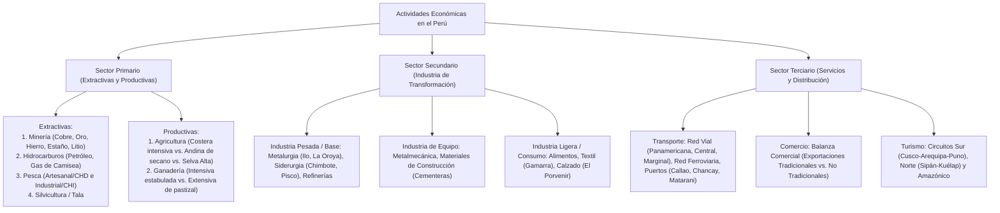

# TEMA 12: Actividades Económicas en el Perú

---

## 1. FICHA TÉCNICA Y MATRIZ DE COMPETENCIAS

| Parámetro | Detalle |
| :--- | :--- |
| **Área Curricular** | Ciencias Sociales |
| **Eje Temático** | 03. Ciencias Sociales |
| **Asignatura** | Geografía |
| **Tema** | Tema XII: Actividades Económicas en el Perú |
| **Código del Archivo** | `CS-GEO-12` |
| **Ponderación UNSA** | Sociales: $1.584321000$ \| Biomédicas: $0.942150000$ \| Ingenierías: $0.812450000$ |
| **Nivel de Dificultad** | Avanzado - Geoeconómico, Productivo y Comercial |
| **Prerrequisitos** | Geomorfología peruana, Cuencas hidrográficas, Demografía económica |
| **Tiempo de Estudio** | 4.0 horas de sistematización productiva e infraestructura |

### Matriz de Aprendizajes Esperados (Estándar UNSA / UNMSM-DECO / UNI)
* **Conceptual:** Clasificar las actividades económicas del Perú en los sectores Primario (extractivas: minería, petróleo, pesca, tala; productivas: agricultura y ganadería), Secundario (industria pesada, de equipo y ligera) y Terciario (transporte vial, ferroviario, marítimo/portuario; comercio exterior y turismo).
* **Procedimental:** Localizar en el mapa económico los principales centros mineros (Cerro Verde, Antamina, Las Bambas, Quellaveco, Yanacocha, Marcona, San Rafael), refinerías, cuencas gasíferas (Camisea), puertos mayores (Callao, Chancay, Matarani) y las redes viales longitudinales y de penetración.
* **Actitudinal / Crítico:** Evaluar el impacto ambiental de las actividades extractivas frente a la generación de divisas, debatir sobre la diversificación productiva y el valor agregado, y ponderar el papel geoestratégico del Megapuerto de Chancay para la inserción del Perú en la Cuenca del Pacífico.

---

## 2. MAPA TAXONÓMICO Y ONTOLOGÍA



---

## 3. DESARROLLO TEÓRICO FORMAL

### 3.1. Sector Primario: Actividades Extractivas

Son aquellas actividades que obtienen materias primas directamente de la naturaleza sin transformar su estructura física ni química.

#### A. La Minería en el Perú
Es la actividad económica que genera la mayor cantidad de divisas para el Estado peruano (**más del $60\%$ de las exportaciones totales**) y un aporte sustancial al Producto Bruto Interno (PBI) y al canon minero:
* **Características:**
  * El Perú es un país polimetálico.
  * **Posición Mundial del Perú:** 2.° productor mundial de **Cobre ($Cu$)** y **Plata ($Ag$)**; 3.° en **Zinc ($Zn$)**; líder latinoamericano en **Oro ($Au$)**, Estaño ($Sn$) y Plomo ($Pb$).
  * Modalidades: Minería de tajo abierto (a cielo abierto, gran escala mecanizada) y minería subterránea (socavón).

##### Principales Yacimientos y Asientos Mineros del Perú:
1. **Cobre ($Cu$):**
   * **Cerro Verde (Uchumayo, Arequipa):** Una de las mayores minas de cobre y molibdeno a cielo abierto del mundo.
   * **Antamina (Huari, Áncash):** Complejo polimetálico líder nacional en cobre y zinc.
   * **Las Bambas (Cotabambas, Apurímac):** Megayacimiento cuprífero de gran escala.
   * **Cuajone (Moquegua) y Toquepala (Tacna):** Operadas por Southern Perú Copper Corporation.
   * **Quellaveco (Moquegua):** Mina digital de cobre 100% automatizada (Anglo American).
   * **Toromocho (Morococha, Junín):** Operada por Chinalco.
2. **Oro ($Au$):**
   * **Yanacocha (Cajamarca):** Mina a cielo abierto que fue la mayor productora de oro de Latinoamérica.
   * **Lagunas del Norte / Alto Chicama (La Libertad):** Minera Barrick Misquichilca.
   * **Retamas y Poderosa (Pataz, La Libertad).**
   * **Minería Aluvial de Oro:** Cuenca de Madre de Dios (La Pampa, ríos Inambari y Madre de Dios), con gravísimos pasivos de minería ilegal y contaminación por mercurio.
3. **Hierro ($Fe$):**
   * **Marcona (Nazca, Ica):** Único yacimiento de hierro en explotación a gran escala del Perú (operado por Shougang Hierro Perú).
4. **Estaño ($Sn$):**
   * **San Rafael (Antauta, Melgar, Puno):** Operada por Minsur; una de las minas subterráneas de estaño más ricas y de mayor ley mineral del planeta.
5. **Plata ($Ag$), Zinc ($Zn$) y Plomo ($Pb$):**
   * **Uchucchacua (Oyón, Lima), Casapalca (Huarochirí, Lima), Atacocha y Milpo (Pasco).**
6. **Litio ($Li$):**
   * **Falchani (Macusani, Carabaya, Puno):** Yacimiento de litio en roca y uranio de clase mundial en fase de desarrollo.

---

#### B. Explotación de Hidrocarburos (Petróleo y Gas Natural)
1. **Petróleo:**
   * *Zonas de Extracción:*
     * **Zócalo Continental y Costa Norte (Piura y Tumbes):** Yacimientos antiguos de Talara, Zorritos, Lobitos, El Alto, La Brea y Pariñas.
     * **Selva Norte (Loreto):** Cuenca de los ríos Marañón, Tigre, Pastaza y Corrientes (Lotes 192 y 95 en Bretaña).
   * **El Oleoducto Norperuano (ONP):**
     * Obra de ingeniería colosal de $1\,106\text{ km}$ construida entre 1974 y 1977.
     * Parte desde la Estación 1 en **San José de Saramuro (Loreto)**, cruza la Cordillera de los Andes por el **Paso de Porculla ($2\,144\text{ m s.n.m.}$)** y desemboca en el Terminal Marítimo de **Bayóvar (Piura)** en el Océano Pacífico.
   * *Refinerías de Petróleo:* Refinería de Talara (Petroperú, modernizada) y Refinería La Pampilla (Ventanilla, Repsol).
2. **Gas Natural:**
   * **Megayacimiento de Camisea (Cusco):**
     * Ubicado en el Bajo Urubamba (La Convención, Cusco), en los Lotes 88 (consumo nacional) y 56 (exportación).
     * El gas natural seco (metano) y los líquidos de gas natural (propano, butano, condensados) son separados en la Planta de Malvinas (Cusco) y transportados a través del **Gasoducto de Camisea** hacia la Planta de Fraccionamiento de Pisco (Ica) y Lima Metropolitana.

---

#### C. La Pesca en el Perú
Aprovecha la inmensa biomasa del Mar de Grau generada por la Corriente de Humboldt y el afloramiento:

| Tipo de Pesca | Ámbito de Operación | Embarcaciones y Tecnología | Destino de la Captura | Impacto Socioeconómico |
| :--- | :--- | :--- | :--- | :--- |
| **Pesca Artesanal (de Bajura)** | De $0$ a las **$5\text{ millas marinas}$** y caletas litorales. | Botes pequeños, chalanas, caballitos de totora, redes de cortina manuales sin refrigeración industrial. | **Consumo Humano Directo (CHD):** Pescado fresco para mercados locales, mesas familiares y restaurantes. | Genera abundante empleo local descentralizado; preserva especies costeras (corvina, lenguado, pejerrey). |
| **Pesca Industrial (de Altura)** | **Más allá de las $5\text{ millas marinas}$** hasta las 200 millas. | Bolicheras modernas de gran tonelaje, barcos factoría con sonar, redes de cerco y bodegas frigoríficas. | **Consumo Humano Indirecto (CHI):** Harina y aceite de pescado para la exportación agropecuaria global. | Genera colosales divisas de exportación (Perú es el 1.° exportador de harina de anchoveta); controlada por grandes corporaciones pesqueras. |

* **Puertos Pesqueros Notables:** **Chimbote (Áncash)**, considerado la capital pesquera del país; Paita (Piura), Coishco (Áncash), Callao, Pisco (Ica) e Ilo (Moquegua).

---

### 3.2. Sector Primario: Actividades Productivas

Aquellas que multiplican y crían los recursos biológicos mediante el trabajo planificado del suelo y los animales.

#### A. La Agricultura en el Perú
Presenta tres realidades geográficas marcadamente divergentes:

```
                            AGRICULTURA EN EL PERÚ
                                      |
         +----------------------------+----------------------------+
         |                                                         |
  AGRICULTURA COSTERA                   AGRICULTURA ANDINA                AGRICULTURA AMAZÓNICA
  - Intensiva y altamente tecnificada   - Tradicional y extensiva         - Selva Alta: Valles longitudinales
  - Riego por goteo / aspersión         - Depende del secano (lluvias)    - Café, cacao, palma aceitera, frutas
  - Agroexportación: Arándano, palta,   - Minifundista, baja inversión    - Selva Baja: Estacional en restingas
    uva, espárrago, caña de azúcar      - Despensa: Papa, maíz, quinua    - Roza y quema migratoria
```

1. **Agricultura Costera:**
   * **Intensiva, tecnificada y empresarial:** Uso de fertilizantes químicos, semillas certificadas, maquinaria pesada y riego presurizado.
   * Gran valor de **agroexportación**: El Perú se ha consolidado como el **1.° exportador mundial de arándanos frescos** y espárragos, y líder en uvas de mesa, paltas Hass y mangos.
2. **Agricultura Andina:**
   * Predominantemente **extensiva y tradicional**: Depende del régimen de lluvias estivales (**secano**); expuesta a heladas, granizadas y sequías.
   * Minifundista, con escasa asistencia crediticia y tecnología rudimentaria (chakitaclla, tracción animal).
   * **Rol Estratégico:** Constituye la despensa de seguridad alimentaria interna del país (tubérculos, cereales andinos, legumbres). Valles tecnificados: Valle del Mantaro (Junín), Valle de Urubamba (Cusco).
3. **Agricultura Amazónica:**
   * **Selva Alta:** Valles longitudinales fértiles especializados en cultivos industriales de exportación: **Café** (Chanchamayo, Quillabamba, Jaén), **Cacao**, palma aceitera, té y frutas tropicales.
   * **Selva Baja:** Agricultura migratoria de roza y quema en laderas, y agricultura estacional en restingas y barrizales (yuca, plátano, arroz).

---

#### B. La Ganadería en el Perú
1. **Ganadería Costera:** Intensiva, en establos tecnificados. Crianza de vacunos de alta calidad genética lechera (**Holstein y Brown Swiss**), avicultura a gran escala (Lima, La Libertad) y porcicultura. Cuencas lecheras destacadas: **Arequipa** (Complejo Gloria), Lima y Trujillo.
2. **Ganadería Andina:** Extensiva sobre pastizales naturales (ichu) en la región Puna: camélidos sudamericanos (**alpacas y llamas** en Puno, Cusco, Arequipa y Huancavelica) y ovinos de lana (Corriedale y Junín). Ganadería vacuna de leche en los valles de Cajamarca, Junín y Arequipa.
3. **Ganadería Amazónica:** Crianza de ganado cebú (*Bos indicus*) y ganado de doble propósito adaptado al trópico (cruces de **Amazonas** y Brown Swiss) en Pucallpa, Oxapampa, Jaén y Bagua.

---

### 3.3. Sector Secundario: La Industria Peruana

Actividad que transforma las materias primas en bienes semielaborados o manufacturas terminadas mediante el uso de energía y maquinaria.
* **Tipología Industrial en el Perú:**
  1. **Industria Pesada o de Base:** Transforma materias primas brutas en insumos industriales pesados:
     * *Metalurgia:* Fundiciones que refinan concentrados metálicos: **Ilo (Moquegua)** para el cobre de Cuajone y Toquepala; **Complejo Metalúrgico de La Oroya (Junín)**.
     * *Siderurgia:* Transforma el hierro en acero: **Siderperú (Chimbote)** y **Corporación Aceros Arequipa (Pisco)**.
     * *Refinación Petroquímica:* Refinería de Talara y La Pampilla.
  2. **Industria de Equipo o de Bienes de Capital:** Maquinaria, carrocerías, materiales de construcción:
     * *Industria Cementera:* **Yura (Arequipa)**, Cementos Pacasmayo (La Libertad), UNACEM (Lima).
  3. **Industria Ligera o de Consumo:** Elabora bienes directamente destinados al consumidor final:
     * *Industria Textil y Confecciones:* Emplazada en Lima (Emporio Comercial de **Gamarra** en La Victoria) utilizando algodón Pima y Tangüis.
     * *Industria de Alimentos y Bebidas:* Harinera, azucarera (valles de La Libertad y Lambayeque), láctea, cervecera y enlatados.
     * *Industria del Calzado:* Distrito de **El Porvenir (Trujillo)**.
* **Problema Estructural:** Fuerte **centralismo industrial**: más del $60\%$ del parque fabril se concentra en el eje Lima-Callao.

---

### 3.4. Sector Terciario: Transporte, Comercio Exterior y Megapuerto de Chancay

#### A. Redes de Transporte en el Perú
1. **Transporte Terrestre (Ejes Viales):**
   * **Carreteras Longitudinales:** Recorren el país de norte a sur:
     * **Carretera Panamericana (Ruta 001):** La arteria vital del país; recorre toda la costa desde Tumbes hasta Tacna.
     * **Longitudinal de la Sierra (Ruta 003):** Une las capitales andinas desde Huancabamba hasta Desaguadero.
     * **Longitudinal de la Selva (Marginal de la Selva / Fernando Belaúnde Terry - Ruta 005):** Conecta la selva norte y central.
   * **Carreteras de Penetración o Transversales:** Cortan la cordillera comunicando costa, sierra y selva:
     * **Carretera Central (Federico Basadre):** Lima $\to$ La Oroya $\to$ Cerro de Pasco $\to$ Tingo María $\to$ Pucallpa.
     * **Corredor Vial Interoceánico del Sur (IIRSA Sur):** Matarani/Ilo $\to$ Arequipa/Puno $\to$ Cusco $\to$ Puerto Maldonado $\to$ Iñapari (frontera con Brasil).
     * **IIRSA Norte:** Paita $\to$ Olmos $\to$ Bagua $\to$ Yurimaguas.
2. **Transporte Ferroviario:**
   * **Ferrocarril Central:** Callao $\to$ Lima $\to$ Ticlio ($4\,818\text{ m}$) $\to$ La Oroya $\to$ Huancayo / Cerro de Pasco (el ferrocarril estándar más alto de América).
   * **Ferrocarril del Sur:** Matarani / Mollendo $\to$ Arequipa $\to$ Juliaca $\to$ Puno $\to$ Cusco.
   * **Ferrocarril Tacna-Arica:** Línea binacional histórica de soberanía nacional.
3. **Transporte Acuático y Puertos:**
   * **Terminal Portuario del Callao:** Principal puerto marítimo comercial del Perú (mueve más del $70\%$ de los contenedores).
   * **El Megapuerto Multipropósito de Chancay (Huaral, Lima):**
     * Obra de infraestructura geoeconómica trascendental (Cosco Shipping). Puerto *hub* de aguas profundas ($17.8\text{ m}$ de calado) capaz de recibir buques portacontenedores gigantes Triple E de $24\,000\text{ TEU}$.
     * **Impacto Geopolítico:** Conecta de forma directa a Sudamérica con Shanghái y el Asia-Pacífico, reduciendo el tiempo de travesía de 35 a 23 días, convirtiendo al Perú en el epicentro logístico bioceánico del Pacífico sur.
   * Otros puertos mayores: Paita, Matarani (Arequipa, salida del cobre del sur), Salaverry (La Libertad), Pisco e Ilo.
   * Puertos fluviales amazónicos: Iquitos (Loreto), Pucallpa (Ucayali), Yurimaguas (Loreto).

---

### 3.5. Comercio Exterior y Balanza Comercial

* **Balanza Comercial:** Saldo neto entre el valor monetario de las exportaciones ($X$) y las importaciones ($M$):
  $$\text{Balanza Comercial} = \text{Exportaciones } (X) - \text{Importaciones } (M)$$
  * Si $X > M \implies$ **Superávit Comercial** (situación típica del Perú en años de altos precios de minerales).
  * Si $X < M \implies$ **Déficit Comercial**.
* **Estructura de las Exportaciones Peruanas:**
  * **Exportaciones Tradicionales ($\approx 70\% - 75\%$):** Productos primarios con escaso o nulo valor agregado:
    * *Minerales:* Cobre, oro, zinc, plomo, plata, estaño, hierro.
    * *Petróleo y derivados; gas natural de Camisea.*
    * *Harina y aceite de pescado.*
    * *Café verde y azúcar.*
  * **Exportaciones No Tradicionales ($\approx 25\% - 30\%$):** Productos manufacturados con mayor valor agregado:
    * *Agroindustriales:* Arándanos, uvas, paltas, espárragos frescos y en conserva, cacao fino, mangos.
    * *Textiles y confecciones:* Prendas de algodón Pima y fibra de alpaca.
    * *Pesqueros congelados:* Calamar gigante (pota), langostinos, perico congelado.
    * *Químicos, metalmecánicos y siderúrgicos.*
* **Principales Socios Comerciales del Perú:**
  1. **China:** Primer destino de exportaciones (principal comprador de concentrados de cobre y harina de pescado).
  2. **Estados Unidos:** Segundo socio comercial y principal comprador de productos agroindustriales y textiles no tradicionales.
  3. **Unión Europea, Japón, Corea del Sur y la Alianza del Pacífico.**

---

## 4. FORMULARIO MAESTRO / CUADRO SINÓPTICO

### Matriz Maestra de Actividades Económicas y Centros Productivos

| Sector Económico | Actividad | Centros / Yacimientos Líderes | Región / Departamentos | Producto / Récord Notable |
| :--- | :--- | :--- | :--- | :--- |
| **Primario Extractivo** | **Minería Cuprífera** | Cerro Verde, Antamina, Las Bambas, Quellaveco | Arequipa, Áncash, Apurímac, Moquegua | Perú: 2.° productor mundial de Cobre. |
| **Primario Extractivo** | **Minería Aurífera** | Yanacocha, Poderosa, Retamas | Cajamarca, La Libertad | 1.° productor de Oro de Sudamérica. |
| **Primario Extractivo** | **Hierro** | Marcona | Ica (Nazca) | Único yacimiento de hierro en explotación. |
| **Primario Extractivo** | **Estaño** | San Rafael (Antauta) | Puno (Melgar) | Mina subterránea de estaño más rica del mundo. |
| **Primario Extractivo** | **Gas Natural** | Camisea (Lotes 88 y 56) | Cusco (Bajo Urubamba) | Matriz energética eléctrica nacional ($> 40\%$). |
| **Primario Extractivo** | **Pesca Industrial** | Chimbote, Paita, Callao, Pisco | Áncash, Piura, Lima, Ica | 1.° exportador mundial de harina de pescado. |
| **Primario Productivo** | **Agroexportación** | Valles de Ica, Chavimochic, Olmos, Majes | Ica, La Libertad, Lambayeque, Arequipa | 1.° exportador mundial de arándanos frescos. |
| **Secundario** | **Siderurgia** | Siderperú y Aceros Arequipa | Áncash (Chimbote) e Ica (Pisco) | Barras de construcción y perfiles de acero. |
| **Secundario** | **Metalurgia** | Fundición de Ilo y La Oroya | Moquegua y Junín | Cátodos de cobre refinado de alta pureza. |
| **Terciario** | **Megapuerto Hub** | Puerto de Chancay | Lima (Huaral) | Calado de $17.8\text{ m}$, buques Triple E hacia Asia. |

---

## 5. MNEMOTECNIAS DE COMBATE PREUNIVERSITARIO

### Mnemotecnia 1: Los Gigantes del Cobre Peruano
**"CERRO-ANTA-BAMBAS-QUELLA"**
* **CERRO** $\rightarrow$ **Cerro** Verde (Arequipa)
* **ANTA** $\rightarrow$ **Anta**mina (Áncash)
* **BAMBAS** $\rightarrow$ Las **Bambas** (Apurímac)
* **QUELLA** $\rightarrow$ **Quella**veco (Moquegua)

### Mnemotecnia 2: Destino de la Pesca
* **Pesca Artesanal $\rightarrow$ CHD (Come el Hombre Directo)**.
* **Pesca Industrial $\rightarrow$ CHI (Harina para la Industria de chancho/pollo)**.

---

## 6. TÉCNICAS Y ARTIFICIOS DE RESOLUCIÓN (HACKING PREUNIVERSITARIO)

1. **Diferenciación Minera por Departamentos en Admisión:**
   * ¿Dónde se ubica Marcona (hierro)? $\to$ **Ica** (Nazca).
   * ¿Dónde se ubica Yanacocha (oro)? $\to$ **Cajamarca**.
   * ¿Dónde se ubica San Rafael (estaño)? $\to$ **Puno**.
   * ¿Dónde se ubica Cerro Verde (cobre)? $\to$ **Arequipa**.
   * ¿Dónde se ubica Antamina (cobre/zinc)? $\to$ **Áncash**.
2. **Diferencia entre Exportación Tradicional y No Tradicional:**
   * Minerales en bruto, harina de pescado, café en grano, petróleo crudo $\to$ **Tradicionales** (poco valor agregado, precios fijados en bolsas internacionales).
   * Arándanos empaquetados, conservas de espárrago, polos de algodón peinado, pota congelada $\to$ **No Tradicionales** (incorporan mano de obra y tecnología).

---

## 7. ZONA DE TRAMPAS Y DISTRACTORES ("¡PELIGRO EXAMEN!")

* ⚠️ **Trampa 1: El yacimiento de gas de Camisea no está en Ica:**
  * Camisea se extrae en el departamento del **Cusco** (La Convención). En Pisco (Ica) solo opera la planta de fraccionamiento donde se licúan los líquidos de gas.
* ⚠️ **Trampa 2: Chimbote no es solo puerto pesquero:**
  * Chimbote es el puerto pesquero histórico, pero también es la sede de la primera planta siderúrgica del Perú (**Siderperú**).
* ⚠️ **Trampa 3: ¿Dónde termina el Oleoducto Norperuano?**
  * Empieza en **San José de Saramuro (Loreto)** y termina en **Bayóvar (Piura)** en la costa del Pacífico. No termina en Talara ni en Paita.

---

## 8. APLICACIÓN AL MUNDO REAL Y CONTEXTO DECO

### Caso de Estudio DECO: El Megapuerto de Chancay y la Redefinición Geopolítica Sudamericana
Inaugurado como puerto multipropósito hub, el Megapuerto de Chancay (Huaral, Lima) transforma la logística de Sudamérica:
1. **La Ruta Transpacífica Directa:** Tradicionalmente, la carga marítima sudamericana debía realizar transbordo en puertos de México o California para llegar a Asia, demorando entre 35 y 40 días. Chancay permite la conexión directa **Chancay - Shanghái** en tan solo **23 días**.
2. **Articulación de la Cuenca del Pacífico:** Conectado mediante la carretera Panamericana y futuros ejes ferroviarios con el interior del país y Brasil (salida de la soya y carne del Mato Grosso), convierte al Perú en la puerta de entrada y salida bioceánica de Sudamérica hacia la Cuenca del Asia-Pacífico, fortaleciendo el comercio del bloque APEC.

---

## 9. BANCO DE 5 EJERCICIOS RESUELTOS GRADUADOS

### Ejercicio 1 (Nivel 1 - Básico Formativo: Minería Metálica)
**Enunciado:**
El Perú es uno de los líderes mundiales en producción y reservas de minerales metálicos. En este contexto, el único yacimiento en explotación a gran escala de mineral de hierro en el territorio nacional se ubica en el distrito de Marcona, perteneciente al departamento de:
* A) Arequipa
* B) Moquegua
* C) Ica
* D) Áncash
* E) Tacna

**Solución Paso a Paso:**
1. El hierro es el insumo mineral indispensable para la industria siderúrgica del acero.
2. En el Perú, la totalidad de la producción industrial de hierro proviene de las minas a cielo abierto de **Marcona**, ubicadas en la provincia de Nazca, departamento de **Ica** (operadas por la empresa Shougang Hierro Perú).
* **Respuesta Correcta:** **C**

---

### Ejercicio 2 (Nivel 2 - Intermedio UNSA Ordinario: Gas de Camisea e Infraestructura)
**Enunciado:**
El proyecto energético de explotación de gas natural de Camisea, que provee el insumo fundamental para la generación de más del $40\%$ de la electricidad que consume el país, extrae el hidrocarburo de los lotes 88 y 56 situados en la cuenca del Bajo Urubamba, departamento de:
* A) Loreto
* B) Cusco
* C) Ucayali
* D) Madre de Dios
* E) Puno

**Solución Paso a Paso:**
1. Los yacimientos gasíferos de Camisea se ubican en la selva del departamento del **Cusco**, en la provincia de La Convención (distritos de Megantoni y Echarati).
2. Desde la planta de separación de Malvinas en Cusco, el gasoducto transporta el gas a través de los Andes hacia la costa peruana.
* **Respuesta Correcta:** **B**

---

### Ejercicio 3 (Nivel 3 - Avanzado UNMSM DECO: Diferenciación Pesquera)
**Enunciado:**
Una empresa pesquera opera con una moderna flota de embarcaciones de acero equipadas con ecosondas satelitales y bodegas con sistema de refrigeración por agua de mar fría (RSW), capturando cardúmenes de anchoveta a 25 millas náuticas del litoral para abastecer a plantas industriales harineras destinadas al mercado de exportación de China. Según la legislación y la geografía económica del Perú, dicha faena corresponde a la:
* A) Pesca artesanal para Consumo Humano Directo.
* B) Acuicultura continental intensiva.
* C) Pesca industrial para Consumo Humano Indirecto.
* D) Pesca científica no extractiva.
* E) Maricultura de orilla de playa.

**Solución Paso a Paso:**
1. La captura se realiza más allá de las 5 millas marinas, con barcos de gran tonelaje y tecnología avanzada.
2. El destino del recurso (anchoveta) no es la mesa familiar, sino la transformación en harina y aceite de pescado para nutrición animal (exportación).
3. Esta actividad corresponde formalmente a la **Pesca Industrial para Consumo Humano Indirecto (CHI)**.
* **Respuesta Correcta:** **C**

---

### Ejercicio 4 (Nivel 4 - Crítico / Interdisciplinario UNI: Infraestructura Portuaria y Logística)
**Enunciado:**
El Megapuerto Multipropósito de Chancay representa una revolución en la geografía del transporte marítimo sudamericano debido principalmente a que:
* A) Es el único puerto fluvial del Perú conectado directamente con el río Amazonas.
* B) Posee un calado natural de $17.8\text{ metros}$ que permite el atraque directo de buques portacontenedores Ultra Large Container Vessels (Triple E), reduciendo el flete hacia Asia a 23 días.
* C) Fue diseñado con el propósito exclusivo de exportar gas licuado de petróleo desde los yacimientos de Talara.
* D) Reemplaza de forma definitiva todas las operaciones de cabotaje de los puertos de Paita y Matarani.
* E) Funciona enteramente con energía geotérmica proveniente del volcán Sabancaya.

**Solución Paso a Paso:**
1. El puerto de Chancay fue concebido con un calado de $17.8\text{ metros}$, apto para buques de más de $18\,000\text{ a }24\,000\text{ TEU}$ (Triple E) que antes no podían atracar en la costa del Pacífico sur por falta de profundidad.
2. Al evitar el transbordo en puertos de Centroamérica o Norteamérica, establece una ruta transpacífica directa reduciendo el tiempo de navegación hacia Asia a solo 23 días, convirtiéndose en el **hub marítimo principal de Sudamérica**.
* **Respuesta Correcta:** **B**

---

### Ejercicio 5 (Nivel 5 - Boss Challenge: Geoeconomía y Estructura Exportadora DECO)
**Enunciado:**
Lea con detenimiento el siguiente análisis sobre el comercio exterior peruano:
*"Durante el último ejercicio fiscal, las exportaciones peruanas registraron un récord histórico superior a los $65\,000\text{ millones de dólares}$, impulsadas por la cotización internacional del cobre producido en minas como Cerro Verde, Las Bambas y Antamina, así como por las ventas de gas natural y harina de pescado. Simultáneamente, el sector agroexportador no tradicional mostró un dinamismo sin precedentes, liderado por los envíos de arándanos frescos de los valles de La Libertad e Ica, paltas Hass y uvas de mesa hacia los mercados de Norteamérica y la Unión Europea".*

A partir de la lectura y los fundamentos de la geografía económica nacional, indique las proposiciones verdaderas (V) o falsas (F):
I. El cobre, el gas natural y la harina de pescado constituyen exportaciones de carácter tradicional con bajo valor agregado manufacturero.  
II. El Perú mantiene un modelo exportador donde los productos no tradicionales superan en volumen de divisas al sector minero primario.  
III. La expansión del arándano y la palta evidencia el éxito de la agricultura intensiva tecnificada bajo riego en la costa peruana.  
IV. Los altos ingresos de divisas por exportaciones mineras generan un superávit en la balanza comercial del país.

* A) V - F - V - V
* B) V - V - F - V
* C) F - V - V - F
* D) V - F - F - V
* E) F - F - V - V

**Solución Paso a Paso:**
1. **Evaluación de I:** Los minerales, el gas y la harina de pescado son bienes primarios exportados con mínimo procesamiento, tipificados legal y económicamente como **exportaciones tradicionales**. (Verdadero).
2. **Evaluación de II:** Las exportaciones no tradicionales representan solo entre el $25\%$ y $30\%$ de las divisas; el sector minero tradicional sigue generando más del $60\%$ del total de exportaciones del país. (Falso).
3. **Evaluación de III:** El auge agroexportador de arándanos, uvas y paltas es producto directo de la agricultura de irrigación tecnificada en los valles costeros (Chavimochic, Olmos, Ica). (Verdadero).
4. **Evaluación de IV:** Cuando el valor de las exportaciones ($X$) supera al de las importaciones ($M$), la balanza comercial registra formalmente un **superávit comercial**. (Verdadero).
* Conclusión: V - F - V - V.
* **Respuesta Correcta:** **A**

---

## 10. GLOSARIO DE 10 TÉRMINOS CLAVE

1. **Canon Minero:** Porcentaje del impuesto a la renta (actualmente el $50\%$) que el Estado transfiere a los gobiernos locales y regionales donde se explotan yacimientos mineros.
2. **Pesca de Consumo Humano Directo (CHD):** Captura de recursos hidrobiológicos destinada al consumo alimentario fresco, congelado o enlatado de la población.
3. **Pesca de Consumo Humano Indirecto (CHI):** Captura masiva de especies marinas (principalmente anchoveta) destinada a la producción industrial de harina y aceite de pescado.
4. **Agroexportación:** Producción agrícola orientada al abastecimiento de mercados internacionales de alta demanda bajo estrictos estándares fitosanitarios y de calidad.
5. **Oleoducto Norperuano:** Tubería troncal que transporta el petróleo crudo desde la selva norte de Loreto a través de la Cordillera de los Andes hasta el puerto de Bayóvar en Piura.
6. **Balanza Comercial:** Cuenta macroeconómica que registra la diferencia neta entre el valor monetario de las exportaciones e importaciones de mercancías de un país.
7. **Puerto Hub:** Puerto marítimo central o concentrador de gran calado que redistribuye cargas de contenedores hacia puertos menores de una región geográfica.
8. **Exportaciones Tradicionales:** Bienes primarios exportados con escaso valor agregado cuyos precios son determinados por la oferta y demanda en mercados bursátiles internacionales.
9. **Exportaciones No Tradicionales:** Manufacturas y productos agroindustriales con valor agregado, diseño o procesamiento tecnológico que gozan de mayor estabilidad de precios.
10. **Tajo Abierto (Cielo Abierto):** Método de explotación minera superficial mecanizada a gran escala mediante terrazas concéntricas escalonadas.

---

## 11. BANCO DE FLASHCARDS (Q/A)

* **PREGUNTA:** ¿Qué porcentaje aproximado de las exportaciones totales del Perú corresponde al sector minero?
  * **RESPUESTA:** Más del $60\%$ del valor total exportado.
* **PREGUNTA:** ¿Cuáles son las cuatro mayores minas productoras de cobre en el Perú actual?
  * **RESPUESTA:** Cerro Verde (Arequipa), Antamina (Áncash), Las Bambas (Apurímac) y Quellaveco (Moquegua).
* **PREGUNTA:** ¿Cuál es el único yacimiento de hierro en explotación a gran escala en el Perú y dónde se ubica?
  * **RESPUESTA:** Marcona, ubicado en la provincia de Nazca, departamento de Ica.
* **PREGUNTA:** ¿En qué departamento se ubica la mina San Rafael, una de las mayores productoras de estaño del mundo?
  * **RESPUESTA:** En el departamento de Puno (provincia de Melgar, distrito de Antauta).
* **PREGUNTA:** ¿Dónde inicia y dónde termina el recorrido del Oleoducto Norperuano?
  * **RESPUESTA:** Inicia en San José de Saramuro (Loreto) y termina en el puerto de Bayóvar (Piura).
* **PREGUNTA:** ¿Cuál es la diferencia fundamental entre la pesca para CHD y la pesca para CHI?
  * **RESPUESTA:** La pesca para CHD se destina al consumo alimenticio humano directo (fresco/enlatado); la de CHI se procesa industrialmente como harina y aceite de pescado.
* **PREGUNTA:** ¿Qué productos agrícolas lideran actualmente las agroexportaciones no tradicionales del Perú a nivel mundial?
  * **RESPUESTA:** Los arándanos frescos (Perú es 1.° exportador mundial), uvas de mesa, paltas Hass y espárragos.
* **PREGUNTA:** ¿Dónde se ubica el yacimiento de gas natural de Camisea y qué lotes comprende?
  * **RESPUESTA:** En el Bajo Urubamba, provincia de La Convención, Cusco; comprende los Lotes 88 y 56.
* **PREGUNTA:** ¿Qué ventaja técnica y logística ofrece el Megapuerto de Chancay para el comercio con Asia?
  * **RESPUESTA:** Calado de $17.8\text{ m}$ para buques Triple E y reducción del tiempo de travesía directa a China de 35 a 23 días.
* **PREGUNTA:** ¿Quiénes son los dos principales socios comerciales del Perú en la actualidad?
  * **RESPUESTA:** La República Popular China (1.°) y los Estados Unidos de América (2.°).

---

## 12. MOTOR DE GAMIFICACIÓN (JSON NATIVO KMP)

```json
{
  "subjectCode": "GEO",
  "subjectName": "Geografía",
  "topicId": "GEO-12",
  "topicTitle": "Actividades Económicas en el Perú",
  "totalXP": 300,
  "difficulty": "AVANZADO",
  "unsaWeight": 1.584321,
  "badges": [
    {
      "id": "BADGE_GEO_MAGNATE_MINERO",
      "title": "Titán de la Minería y Energía",
      "description": "Dominas con precisión cartográfica los yacimientos de cobre, oro, hierro, estaño y el gas de Camisea.",
      "icon": "mining_pick_golden"
    },
    {
      "id": "BADGE_GEO_LOGISTICA_GLOBAL",
      "title": "Estratega Logístico del Megapuerto",
      "description": "Comprendes el impacto geoeconómico del puerto de Chancay y la balanza comercial de exportación.",
      "icon": "container_ship_crane"
    }
  ],
  "missions": [
    {
      "missionId": "GEO_M1_MAPA_MINERO",
      "title": "El Tesoro Subterráneo del Perú",
      "requiredPoints": 100,
      "xpReward": 100,
      "task": "Ubicar correctamente en el mapa departamental Cerro Verde, Antamina, Las Bambas, Marcona y San Rafael."
    },
    {
      "missionId": "GEO_M2_PESCA_AGRO",
      "title": "Duelo Productivo: Mar y Tierra",
      "requiredPoints": 100,
      "xpReward": 100,
      "task": "Diferenciar la pesca artesanal (CHD) de la industrial (CHI) y la agricultura de agroexportación frente a la andina de secano."
    },
    {
      "missionId": "GEO_M3_CHANCAY_COMERCIO",
      "title": "La Nueva Ruta de la Seda del Pacífico",
      "requiredPoints": 100,
      "xpReward": 100,
      "task": "Analizar la reducción de tiempos logísticos del Megapuerto de Chancay y el superávit comercial peruano."
    }
  ],
  "questions": [
    {
      "id": "GEO_Q1",
      "type": "SINGLE_CHOICE",
      "question": "¿Cuál es la principal mina productora de estaño en el Perú, considerada una de las más ricas del mundo, ubicada en el departamento de Puno?",
      "options": [
        "Antamina",
        "San Rafael",
        "Marcona",
        "Tintaya",
        "Cuajone"
      ],
      "correctIndex": 1,
      "explanation": "La mina San Rafael, operada por Minsur en la provincia de Melgar (Puno), es la principal productora de estaño del Perú y una de las mayores del planeta."
    },
    {
      "id": "GEO_Q2",
      "type": "SINGLE_CHOICE",
      "question": "El proyecto energético de Camisea, que provee gas natural para la generación termoeléctrica del país, extrae el hidrocarburo de yacimientos ubicados en el departamento de:",
      "options": [
        "Loreto",
        "Ucayali",
        "Cusco",
        "Madre de Dios",
        "Huánuco"
      ],
      "correctIndex": 2,
      "explanation": "Los yacimientos de gas natural de Camisea (Lotes 88 y 56) se ubican en la provincia de La Convención, departamento del Cusco."
    }
  ]
}
```
