# TEMA 13: Geopolítica, Fronteras y Tratados del Perú

---

## 1. FICHA TÉCNICA Y MATRIZ DE COMPETENCIAS

| Parámetro | Detalle |
| :--- | :--- |
| **Área Curricular** | Ciencias Sociales |
| **Eje Temático** | 03. Ciencias Sociales |
| **Asignatura** | Geografía |
| **Tema** | Tema XIII: Geopolítica, Fronteras y Tratados del Perú |
| **Código del Archivo** | `CS-GEO-13` |
| **Ponderación UNSA** | Sociales: $1.584321000$ \| Biomédicas: $0.942150000$ \| Ingenierías: $0.812450000$ |
| **Nivel de Dificultad** | Avanzado - Geopolítico, Jurídico-Diplomático y Estratégico |
| **Prerrequisitos** | Historia del Perú republicano, Geodesia y Coordenadas, Derecho Internacional |
| **Tiempo de Estudio** | 4.0 horas de sistematización limítrofe y análisis estratégico |

### Matriz de Aprendizajes Esperados (Estándar UNSA / UNMSM-DECO / UNI)
* **Conceptual:** Dominar los conceptos geopolíticos canónicos (Rudolf Kjellén, Friedrich Ratzel, Mackinder y Spykman) y los elementos del Estado desde la óptica geopolítica (Realidad Nacional, Poder Nacional, Potencial Nacional y Política Nacional). Conocer las partes constitutivas del Estado: Núcleo Vital (Heartland), Núcleos Secundarios, Espacio de Crecimiento (Hinterland), Fronteras (Borderland) y Vías de Comunicación.
* **Procedimental:** Localizar los cuatro puntos extremos del territorio peruano e identificar con rigor cronológico y diplomático todos los tratados de límites internacionales suscritos con los cinco países limítrofes (Ecuador, Colombia, Brasil, Bolivia y Chile), así como la delimitación marítima de La Haya (2014) y la presencia científica en la Antártida (B.A.P. Carrasco y Estación Machu Picchu).
* **Actitudinal / Crítico:** Evaluar la condición del Perú como país marítimo, andino, amazónico, bioceánico y con proyección antártica, proponiendo políticas de integración fronteriza y soberanía territorial efectiva.

---

## 2. MAPA TAXONÓMICO Y ONTOLOGÍA

```mermaid
graph TD
    GEOPOL["Geopolítica, Fronteras y Soberanía del Perú"] --> TEOR_GEOP["Doctrina y Partes Geopolíticas del Estado"]
    GEOPOL --> PTOS_EXTR["Puntos Extremos y Dimensiones"]
    GEOPOL --> TRAT_FRONT["Tratados de Límites Internacionales"]
    GEOPOL --> PROY_ESTR["Proyección Estratégica: Antártida y Cuenca del Pacífico"]

    TEOR_GEOP --> ELEM_EST["Elementos: Realidad Nacional, Potencial Nacional, Poder Nacional, Política Nacional"]
    TEOR_GEOP --> PART_EST["Estructura: Núcleo Vital (Heartland: Lima), Núcleos Secundarios, Hinterland, Borderland, Comunicaciones"]

    PTOS_EXTR --> NORTE["Norte: Güepí / Río Putumayo (00°01'48'' S, Colombia)"]
    PTOS_EXTR --> SUR["Sur: Punto Concordia / Hito N.° 1 (18°21'08'' S, Chile)"]
    PTOS_EXTR --> ESTE["Este: Confluencia Heath - Madre de Dios (68°39'27'' W, Bolivia)"]
    PTOS_EXTR --> OESTE["Oeste: Punta Balcones / Talara (81°19'34.5'' W)"]

    TRAT_FRONT --> ECU["Ecuador (1 528.5 km): Protocolo de Río (1942) y Acta de Brasilia (1998)"]
    TRAT_FRONT --> COL["Colombia (1 506 km): Tratado Salomón-Lozano (1922 / Río Putumayo)"]
    TRAT_FRONT --> BRA["Brasil (2 822.5 km - La más larga): Velarde-Río Branco (1909)"]
    TRAT_FRONT --> BOL["Bolivia (1 047 km): Tratado Polo-Bustamante (1909 / Titicaca)"]
    TRAT_FRONT --> CHI["Chile (169 km): Tratado de Lima (1929) y Fallo de La Haya (2014)"]

    PROY_ESTR --> ANTAR["Tratado Antártico (1981): Estación Científica Machu Picchu e Isla Rey Jorge (B.A.P. Carrasco)"]
    PROY_ESTR --> PACIF["Cuenca del Asia-Pacífico: APEC y Megapuerto de Chancay"]
```



---

## 3. DESARROLLO TEÓRICO FORMAL

### 3.1. Fundamentos Epistemológicos de la Geopolítica

La **Geopolítica** es la ciencia que estudia la influencia de los factores geográficos en la vida, evolución, seguridad y desarrollo político de los Estados.
* **Orígenes Doctrinales:**
  * **Rudolf Kjellén (1864–1922):** Politólogo sueco que **acuñó el término "Geopolítica"** en 1899 en su obra *Las grandes potencias*.
  * **Friedrich Ratzel (1844–1904):** Formuló la concepción del **"Estado como un organismo vivo"** que nace, crece, se expande y muere, requiriendo un **espacio vital (*Lebensraum*)** territorial para nutrirse y subsistir.
  * **Halford Mackinder (1861–1947):** Formuló la **Teoría del Heartland (Corazón Continental)**: *"Quien domine Europa del Este controlará el Heartland; quien domine el Heartland controlará la Isla Mundial (Eurasia-África); quien domine la Isla Mundial controlará el destino del mundo"*.
  * **Nicholas Spykman (1893–1943):** Formuló la **Teoría del Rimland (Creciente Marginal Costera)**: Quien domine los bordes marítimos de Eurasia controlará el Heartland y el mundo.

#### A. Los Cuatro Elementos Constitutivos del Estado en Geopolítica
1. **Realidad Nacional:** Es la totalidad de situaciones, recursos, problemas, potencialidades y capacidades que tiene un Estado en un momento histórico concreto (en lo político, social, económico y militar).
2. **Potencial Nacional:** Conjunto de recursos materiales y humanos **latentes, disponibles y susceptibles de ser movilizados e industrializados** en el futuro para alcanzar los fines del Estado.
3. **Poder Nacional:** Es la capacidad actual, concreta y efectiva que tiene el Estado para imponer su voluntad política, vencer resistencias, defender su soberanía y alcanzar sus objetivos estratégicos.
4. **Política Nacional:** Conjunto de directrices, estrategias, planes y acciones trazados por el Estado para transformar el Potencial Nacional en Poder Nacional a fin de alcanzar el Bien Común y la Seguridad Integral.

---

#### B. Estructura y Partes Geopolíticas del Estado

```
                         FRONTERA O BORDERLAND (Órgano respiratorio y defensivo)
                      +-----------------------------------------------------------+
                      |                                                           |
                      |                 HINTERLAND O ESPACIO DE CRECIMIENTO       |
                      |                (Recursos mineros, cuencas, agricultura)   |
                      |                                                           |
                      |            [NÚCLEO SECUNDARIO]             [NÚCLEO SECUNDARIO]
                      |                (Arequipa)                      (Trujillo) |
                      |                       \                      /            |
                      |                        \   VÍAS DE          /             |
                      |                         \  COMUNICACIÓN    /              |
                      |                          \                /               |
                      |                    [NÚCLEO VITAL O HEARTLAND]             |
                      |                      (Lima Metropolitana-Callao)          |
                      |                                                           |
                      +-----------------------------------------------------------+
```

1. **Núcleo Vital o Heartland:**
   * Es el centro nervioso, político, administrativo, demográfico y económico donde se toman las decisiones de gobierno y radica el poder del Estado.
   * En el Perú: **El eje Lima Metropolitana - Callao**.
2. **Núcleos Secundarios:**
   * Polos de desarrollo regionales que equilibran el territorio y descongestionan al núcleo vital:
     * *Sur:* **Arequipa** y Cusco.
     * *Norte:* **Trujillo**, Chiclayo y Piura.
     * *Centro:* Huancayo.
     * *Oriente:* Iquitos y Pucallpa.
3. **Hinterland o Espacio de Crecimiento:**
   * Es el espacio geográfico intermedio situado entre el núcleo vital y las fronteras. Alimenta al núcleo vital con alimentos, minerales, agua y energía; hacia él se expande el Estado.
4. **Frontera o Borderland:**
   * Periferia territorial exterior que delimita la soberanía del Estado; actúa como órgano de defensa y membrana de intercambio comercial y cultural.
5. **Vías de Comunicación:**
   * Redes de carreteras, ferrocarriles, rutas marítimas, fluviales, aéreas y telecomunicaciones que articulan y cohesionan los núcleos con el hinterland y las fronteras.

---

### 3.2. Puntos Extremos y Dimensiones del Territorio Peruano

* **Superficie Continental:** $1\,285\,215.60\text{ km}^2$ (3.° más extenso de Sudamérica y 19.° del mundo).
* **Perímetro Fronterizo Total:** $\approx \mathbf{10\,153\text{ km}}$ (Fronteras terrestres: $\approx 7\,073\text{ km}$; Litoral marítimo: $\approx 3\,080\text{ km}$).

#### Los Cuatro Puntos Extremos de la República del Perú:

| Punto Extremo | Coordenadas Geográficas | Hito / Accidente Geográfico | Límite Internacional / Departamento |
| :--- | :--- | :--- | :--- |
| **Norte (Septentrional)**| **$00^\circ 01' 48''\text{ S}$** y $75^\circ 10' 29''\text{ W}$ | Confluencia del río Güepí con el **río Putumayo** | Frontera con **Colombia** (Loreto, provincia de Maynas). |
| **Sur (Meridional)** | **$18^\circ 21' 08''\text{ S}$** y $70^\circ 22' 39''\text{ W}$ | **Punto Concordia** / Paralelo del Hito N.° 1 | Frontera con **Chile** (Tacna, provincia de Tacna). |
| **Este (Oriental)** | $12^\circ 30' 11''\text{ S}$ y **$68^\circ 39' 27''\text{ W}$** | Confluencia del **río Heath con el río Madre de Dios** | Frontera con **Bolivia** (Madre de Dios, Tambopata). |
| **Oeste (Occidental)** | $04^\circ 40' 45''\text{ S}$ y **$81^\circ 19' 34.5''\text{ W}$** | **Punta Balcones** (La Brea) | Litoral del Océano Pacífico (Piura, Talara). |

---

### 3.3. Las Fronteras del Perú y Tratados Limítrofes Internacionales

La delimitación definitiva de las fronteras de la República del Perú se consolidó a lo largo de los siglos XIX y XX mediante tratados diplomáticos bilaterales y laudos arbitrales:

```
                                  [COLOMBIA] (1 506 km)
                                  Tratado Salomón-Lozano (1922)
                                       /              \
           [ECUADOR] (1 528.5 km)     /                \    [BRASIL] (2 822.5 km - LA MÁS EXTENSA)
     Protocolo de Río de Janeiro (1942)                 \   Tratado Velarde-Río Branco (1909)
     Acta Presidencial de Brasilia (1998)                \
                         \                                |
                          \          REPÚBLICA           |
                           \          DEL PERÚ           /
                            \                           /   [BOLIVIA] (1 047 km)
                             \                         /    Tratado Polo-Bustamante (1909)
                              \                       /
                               \                     /
                                [CHILE] (169 km)
                                Tratado de Lima (1929)
                                Fallo de La Haya (2014)
```

---

#### 1. Frontera con la República del Ecuador ($1\,528.5\text{ km}$)
* **Tratados Fundamentales:**
  * **Protocolo de Paz, Amistad y Límites de Río de Janeiro (29 de enero de 1942):**
    * Suscrito por Alfredo Solf y Muro (Perú) y Julio Tobar Donoso (Ecuador), con la garantía de Argentina, Brasil, Chile y los Estados Unidos de América, tras la victoria militar peruana en la Batalla de Zarumilla (1941).
  * **El Impasse de la Cordillera del Cóndor y el Cenepa (1995):**
    * Ecuador declaró unilateralmente el protocolo "inejecutable" en un tramo de $78\text{ km}$ donde no coincidía la divisoria de aguas del río Cenepa con el río Zamora. Tras el conflicto bélico del Alto Cenepa (1995), se sometió la controversia al peritaje técnico de los países garantes.
  * **Acta Presidencial de Brasilia (26 de octubre de 1998):**
    * Firmada por los presidentes **Alberto Fujimori** (Perú) y **Jamil Mahuad** (Ecuador). Ratificó la plena validez y cierre definitivo del Protocolo de Río de Janeiro a lo largo de las altas cumbres de la **Cordillera del Cóndor**, concediendo a Ecuador en propiedad privada (sin soberanía) un kilómetro cuadrado en Tiwinza.

---

#### 2. Frontera con la República de Colombia ($1\,506.0\text{ km}$)
* **Tratado Salomón-Lozano (24 de marzo de 1922):**
  * Firmado en secreto en Lima por Alberto Salomón (canciller de Augusto B. Leguía) y Fabio Lozano Torrijos (ministro plenipotenciario de Colombia). Fue aprobado por el Congreso peruano en 1927.
  * **Límites acordados:** La línea fronteriza se fijó a lo largo del **río Putumayo** hasta la desembocadura del río Yaguas, y desde allí una línea geodésica rectilínea hacia el sur hasta el río Amazonas.
  * **Cesión Territorial:** El Perú cedió a Colombia el denominado **Trapecio Amazónico**, otorgándole a Colombia riberas sobre el río Amazonas y la posesión de la ciudad portuaria de **Leticia**.
* **El Conflicto de Leticia (1932-1933) y el Protocolo de Río de Janeiro (1934):**
  * Pobladores peruanos recuperaron Leticia en 1932. Tras el asesinato de Sánchez Cerro, el presidente Óscar R. Benavides firmó en 1934 el Protocolo de Río de Janeiro que ratificó definitivamente el Tratado de 1922.

---

#### 3. Frontera con la República Federativa del Brasil ($2\,822.5\text{ km}$ - La más extensa)
* **Tratados Fundamentales:**
  * **Convención Fluvial Herrera - Da Ponte Ribeiro (23 de octubre de 1851):**
    * Firmada durante el gobierno de José Rufino Echenique por Bartolomé Herrera. Reconoció la posesión brasileña sobre extensos territorios amazónicos a cambio de consagrar la **libre navegación peruana por el río Amazonas** hacia el Océano Atlántico.
  * **Tratado Definitivo Velarde - Río Branco (8 de setiembre de 1909):**
    * Suscrito en Río de Janeiro durante el primer gobierno de Augusto B. Leguía por el plenipotenciario peruano **Hernán Velarde** y el canciller brasileño **Barón de Río Branco**.
    * Fijó la demarcación definitiva de la frontera en los ríos Yuruá, Purús, Yavarí y la naciente del río Breu, consolidando la frontera más larga del Perú.

---

#### 4. Frontera con el Estado Plurinacional de Bolivia ($1\,047.2\text{ km}$)
* **Tratado de Demarcación de Fronteras Polo - Bustamante (17 de setiembre de 1909):**
  * Firmado en La Paz durante el gobierno de Leguía por el canciller peruano **Solón Polo** y el ministro boliviano **Daniel Sánchez Bustamante**.
  * **Límites:** Delimitó la frontera terrestre y fluvial desde la boca del río Yaverija en el norte, cruzando el río Madre de Dios, el río Heath, la Cordillera de Carabaya, el río Suches, y **dividió en dos partes el Lago Titicaca** (correspondiendo al Perú el $56\%$ de sus aguas y a Bolivia el $44\%$), siguiendo por el río Desaguadero hasta el cerro Zapaleri en la frontera tripartita.

---

#### 5. Frontera con la República de Chile ($169.1\text{ km}$)
* **Tratados Terrestres y Fallo Marítimo:**
  * **Tratado de Ancón (20 de octubre de 1883):**
    * Puso fin formal a la Guerra del Guano y del Salitre. El Perú cedió a perpetuidad la provincia litoral de **Tarapacá** y entregó las provincias de **Tacna y Arica** bajo administración chilena durante diez años, tras los cuales debía realizarse un plebiscito popular que Chile postergó sistemáticamente.
  * **Tratado de Lima (Tratado Rada y Gamio - Figueroa Larraín, 3 de junio de 1929):**
    * Firmado durante el Oncenio de Leguía. Resolvió la cuestión de Tacna y Arica dividiendo el territorio: **"Tacna para el Perú y Arica para Chile"**.
    * Fijó el límite terrestre en la **Línea de la Concordia**, que parte diez kilómetros al norte del puente del río Lluta y alcanza el mar en el **Punto Concordia**. Chile cedió al Perú un muelle propio en la bahía de Arica, una estación aduanera y el ferrocarril Tacna-Arica.
  * **Fallo de la Corte Internacional de Justicia de La Haya (27 de enero de 2014):**
    * Delimitó la frontera marítima definitiva: confirmó la línea del paralelo del Hito N.° 1 hasta las **$80\text{ millas náuticas}$**, a partir de la cual trazó una línea equidistante suroeste hasta las $200\text{ millas}$, recuperando para la soberanía del Perú más de **$50\,000\text{ km}^2$ de espacio marítimo**.

---

### 3.4. Proyección Geopolítica del Perú: Presencia en la Antártida y la Cuenca del Pacífico

#### A. La Presencia Antártica Peruana
* **Marco Jurídico Internacional:**
  * El Perú se adhirió al **Tratado Antártico** en **1981** (aprobado por Resolución Legislativa N.° 23254) y fue aceptado formalmente como **Miembro Consultivo en 1989**, con voz y voto en la toma de decisiones sobre el continente blanco.
* **La Estación Científica Antártica "Machu Picchu":**
  * Emplazada en la **Isla Rey Jorge (Península Antártica)**, en la ensenada Mackellar de la bahía Almirante Brown.
  * Centro científico permanente operado por el Instituto Antártico Peruano (INANPE) y el Ministerio de Relaciones Exteriores.
* **Buque Oceanográfico Polar B.A.P. Carrasco (BOP-171):**
  * Considerado uno de los buques de investigación polar más avanzados del mundo; ejecuta las expediciones científicas anuales **ANTAR**, monitoreando el krill antártico, el cambio climático global y las teleconexiones oceánicas con la Corriente de Humboldt.

#### B. La Inserción Estratégica en la Cuenca del Asia-Pacífico
* El Perú es miembro de pleno derecho del **Foro de Cooperación Económica Asia-Pacífico (APEC)** desde 1998, habiendo sido anfitrión de las cumbres mundiales de líderes en Lima (2008, 2016 y 2024).
* La articulación bioceánica del territorio peruano mediante el **Megapuerto de Chancay**, el Puerto del Callao y los corredores viales bioceánicos consolida al Perú como el **eje gozne y puente comercial bioceánico insustituible** entre Sudamérica (Mercosur/Brasil) y las potencias económicas del Asia-Pacífico (China, Japón, Corea del Sur).

---

## 4. FORMULARIO MAESTRO / CUADRO SINÓPTICO

### Matriz Maestra de Tratados de Límites Internacionales del Perú

| País Limítrofe | Tratado Definitivo Vigente | Fecha de Suscripción | Representantes / Presidentes | Límites / Hitos Fundamentales |
| :--- | :--- | :--- | :--- | :--- |
| **Brasil** | **Tratado Velarde - Río Branco** | 8 de setiembre de 1909 | Hernán Velarde y Barón de Río Branco (Gobierno de Leguía) | Ríos Yavarí, Yuruá, Purús y nacientes del río Breu ($2\,822.5\text{ km}$). |
| **Bolivia** | **Tratado Polo - Bustamante** | 17 de setiembre de 1909 | Solón Polo y Daniel Sánchez Bustamante (Gobierno de Leguía) | División del Lago Titicaca, ríos Suches, Desaguadero y Heath ($1\,047.2\text{ km}$). |
| **Colombia** | **Tratado Salomón - Lozano** | 24 de marzo de 1922 | Alberto Salomón y Fabio Lozano Torrijos (Gobierno de Leguía) | Río Putumayo y cesión del Trapecio Amazónico con Leticia ($1\,506\text{ km}$). |
| **Chile** | **Tratado de Lima** (1929) y **Fallo de La Haya** (2014) | 3 de junio de 1929 / 27 de enero de 2014 | Pedro José Rada y Gamio y Emiliano Figueroa / Corte de La Haya | Tacna al Perú, Arica a Chile; frontera marítima equidistante ($169\text{ km}$ tierra). |
| **Ecuador** | **Protocolo de Río de Janeiro** y **Acta de Brasilia** | 29 de enero de 1942 / 26 de octubre de 1998 | Alfredo Solf y Julio Tobar / Alberto Fujimori y Jamil Mahuad | Cumbres de la Cordillera del Cóndor y 1 km² privado en Tiwinza ($1\,528.5\text{ km}$). |

---

## 5. MNEMOTECNIAS DE COMBATE PREUNIVERSITARIO

### Mnemotecnia 1: Orden de Extensión de las Fronteras Terrestres (de Mayor a Menor)
**"BRAS-E-CO-BO-CHI"**
* **BRAS** $\rightarrow$ **Bras**il ($2\,822.5\text{ km}$ - La más extensa)
* **E** $\rightarrow$ **E**cuador ($1\,528.5\text{ km}$)
* **CO** $\rightarrow$ **Co**lombia ($1\,506.0\text{ km}$)
* **BO** $\rightarrow$ **Bo**livia ($1\,047.2\text{ km}$)
* **CHI** $\rightarrow$ **Chi**le ($169.1\text{ km}$ - La más corta)

*Frase clave:* **"BRASIleños y Ecuatorianos COmen BOlitas CHIlenas"**.

### Mnemotecnia 2: Puntos Extremos del Perú
* **Norte:** Güepí (Putumayo) $\to$ **G**üepí.
* **Sur:** Concordia (Hito 1) $\to$ **C**oncordia.
* **Este:** Heath (Madre de Dios) $\to$ **H**eath.
* **Oeste:** Balcones (Piura) $\to$ **B**alcones.
* *Acrónimo de combate:* **"G-C-H-B"**.

---

## 6. TÉCNICAS Y ARTIFICIOS DE RESOLUCIÓN (HACKING PREUNIVERSITARIO)

1. **La Firma de Tratados en el Gobierno de Leguía:**
   * En preguntas de admisión sobre presidentes y tratados limítrofes:
   * **Augusto B. Leguía cerró 3 de los 5 tratados:**
     * Con Brasil (1909: Velarde-Río Branco).
     * Con Bolivia (1909: Polo-Bustamante).
     * Con Colombia (1922: Salomón-Lozano).
     * Con Chile (1929: Tratado de Lima).
   * Solo el Protocolo de Río de Janeiro con Ecuador (1942, Manuel Prado Ugarteche) y el Acta de Brasilia (1998, Fujimori) no fueron obra de Leguía.
2. **Identificación de la Estación Antártica:**
   * Pregunta típica: *¿Cómo se llama la base científica del Perú en la Antártida y en qué isla se encuentra?*
   * **Respuesta:** Estación Científica **Machu Picchu**, ubicada en la **Isla Rey Jorge**.

---

## 7. ZONA DE TRAMPAS Y DISTRACTORES ("¡PELIGRO EXAMEN!")

* ⚠️ **Trampa 1: El Punto Extremo Occidental no es Paita ni Paracas:**
  * El punto más occidental del territorio peruano y de Sudamérica continental es **Punta Balcones ($81^\circ 19' 34.5''\text{ W}$)** en la provincia de Talara, departamento de Piura.
* ⚠️ **Trampa 2: La frontera más larga del Perú no es con Ecuador ni con Colombia:**
  * La frontera más larga es con **Brasil** ($2\,822.5\text{ km}$), abarcando ríos y selvas de Loreto, Ucayali y Madre de Dios.
* ⚠️ **Trampa 3: ¿Perú tiene soberanía territorial exclusiva en la Antártida?**
  * ¡Falso! El Tratado Antártico de 1959 **congeló todos los reclamos territoriales soberanos**. En la Antártida rige un régimen internacional para la paz, la desnuclearización y la investigación científica compartida.

---

## 8. APLICACIÓN AL MUNDO REAL Y CONTEXTO DECO

### Caso de Estudio DECO: El B.A.P. Carrasco y el Monitoreo del Fenómeno de El Niño desde la Antártida
El Buque Oceanográfico Polar **B.A.P. Carrasco (BOP-171)** de la Marina de Guerra del Perú zarpa periódicamente en las expediciones científicas ANTAR hacia la Ensenada Mackellar:
1. **La Teleconexión Antártica-Humboldt:** Las investigaciones geofísicas ejecutadas por los científicos del IMARPE y de la Dirección de Hidrografía y Navegación demuestran que las corrientes marinas polares antárticas alimentan y modulan la intensidad de la Corriente de Humboldt.
2. **Relevancia Prospectiva:** El deshielo y las anomalías de salinidad en el Océano Austral detectadas por el B.A.P. Carrasco proporcionan alertas tempranas con meses de anticipación sobre la formación de eventos climáticos anómalos (ENOS o El Niño Costero) en el litoral peruano, validando el valor geopolítico de la presencia científica del Perú en el continente blanco.

---

## 9. BANCO DE 5 EJERCICIOS RESUELTOS GRADUADOS

### Ejercicio 1 (Nivel 1 - Básico Formativo: Puntos Extremos)
**Enunciado:**
El punto extremo septentrional (más al norte) de la República del Perú se ubica a los $00^\circ 01' 48''$ de latitud sur, en la confluencia del río Güepí con el río Putumayo en el departamento de Loreto, en la frontera internacional con:
* A) Ecuador
* B) Brasil
* C) Colombia
* D) Venezuela
* E) Bolivia

**Solución Paso a Paso:**
1. El punto extremo norte de la geografía peruana se encuentra en Güepí ($00^\circ 01' 48''\text{ S}$).
2. Dicho accidente hidrográfico se sitúa a orillas del río Putumayo, el cual fue consagrado como línea divisoria internacional con la **República de Colombia** mediante el Tratado Salomón-Lozano de 1922.
* **Respuesta Correcta:** **C**

---

### Ejercicio 2 (Nivel 2 - Intermedio UNSA Ordinario: Geopolítica de Kjellén y Ratzel)
**Enunciado:**
Desde la perspectiva de la doctrina geopolítica clásica formulada por Friedrich Ratzel y Rudolf Kjellén, el espacio geográfico intermedio situado entre el Núcleo Vital (Heartland) y las fronteras (Borderland), que actúa como área de alimentación de recursos agrícolas, mineros y energéticos hacia donde se proyecta la expansión territorial del Estado, se denomina:
* A) Núcleo Secundario
* B) Espacio Vital o Hinterland
* C) Fosa Tectónica
* D) Cuenca Exorreica
* E) Polo de Saturación

**Solución Paso a Paso:**
1. En la anatomía geopolítica del Estado:
   * El Núcleo Vital es el centro de poder (Lima).
   * Las Fronteras son el límite exterior defensivo.
2. El espacio geográfico comprendido entre ambos, dotado de recursos naturales que nutren y expanden la capacidad económica del núcleo vital, se denomina formalmente **Hinterland o Espacio de Crecimiento**.
* **Respuesta Correcta:** **B**

---

### Ejercicio 3 (Nivel 3 - Avanzado UNMSM DECO: Tratados de Límites con Ecuador)
**Enunciado:**
Tras el cese de hostilidades bélicas en el Alto Cenepa (1995), el Perú y Ecuador suscribieron el 26 de octubre de 1998 el histórico **Acta Presidencial de Brasilia**, firmada por los mandatarios Alberto Fujimori y Jamil Mahuad. Dicho instrumento diplomático resolvió de manera definitiva la controversia territorial al dictaminar:
* A) La entrega de la provincia de Maynas y el puerto de Iquitos a la soberanía ecuatoriana.
* B) La plena ratificación del Protocolo de Río de Janeiro de 1942 y el cierre de la demarcación en las altas cumbres de la Cordillera del Cóndor.
* C) La cesión del Trapecio Amazónico y la libre navegación por el río Putumayo.
* D) El traspaso de las islas guaneras de Lobitos hacia la administración conjunta de los países garantes.
* E) La anulación de la línea de la Concordia en el Hito N.° 1.

**Solución Paso a Paso:**
1. El Acta Presidencial de Brasilia de 1998 ratificó formalmente que el **Protocolo de Paz, Amistad y Límites de Río de Janeiro de 1942 era plenamente válido y vinculante**.
2. Con el informe pericial técnico de los países garantes, se colocaron los hitos faltantes a lo largo de las altas cumbres de la **Cordillera del Cóndor**, sellando la paz definitiva y reconociendo a Ecuador un predio de $1\text{ km}^2$ en Tiwinza como propiedad privada sin soberanía.
* **Respuesta Correcta:** **B**

---

### Ejercicio 4 (Nivel 4 - Crítico / Interdisciplinario UNI: Presencia Antártica Peruana)
**Enunciado:**
El Perú es miembro consultivo del Tratado Antártico desde el año 1989, lo que le otorga derecho a voz y voto en la administración científica y ecológica del continente antártico. Al respecto, determine la secuencia de verdad (V) o falsedad (F) de las siguientes aseveraciones:
I. La estación científica permanente del Perú en la Antártida se denomina "Machu Picchu" y se emplaza en la Isla Rey Jorge.  
II. El Tratado Antártico consagra la ocupación militar y la explotación irrestricta de minerales estratégicos y petróleo en el lecho polar.  
III. El buque oceanográfico polar de la Marina de Guerra del Perú asignado a las misiones científicas ANTAR es el B.A.P. Carrasco.  
IV. El interés peruano en la Antártida reside fundamentalmente en la investigación del cambio climático, el krill y su teleconexión con la Corriente de Humboldt.

* A) V - F - V - V
* B) V - V - F - V
* C) F - V - V - F
* D) V - F - F - V
* E) F - F - V - V

**Solución Paso a Paso:**
1. **Evaluación de I:** La base científica se llama Machu Picchu y se ubica en la Ensenada Mackellar de la Isla Rey Jorge. (Verdadero).
2. **Evaluación de II:** El Tratado Antártico prohíbe taxativamente las actividades militares, ensayos nucleares y la explotación comercial minera; reserva el continente exclusivamente para la investigación pacífica. (Falso).
3. **Evaluación de III:** El buque insignia asignado a las campañas polares es el B.A.P. Carrasco (BOP-171). (Verdadero).
4. **Evaluación de IV:** Las masas de agua polar y la biomasa de krill tienen una relación funcional directa con el mar peruano y el balance climático del país. (Verdadero).
* Conclusión: V - F - V - V.
* **Respuesta Correcta:** **A**

---

### Ejercicio 5 (Nivel 5 - Boss Challenge: Geopolítica de Fronteras y Tratado de 1929 DECO)
**Enunciado:**
Lea con atención el siguiente extracto histórico-diplomático:
*"El Tratado de Lima, suscrito el 3 de junio de 1929 entre los plenipotenciarios Pedro José Rada y Gamio (Perú) y Emiliano Figueroa Larraín (Chile), clausuró el prolongado contencioso derivado de la Guerra del Pacífico y el incumplimiento del plebiscito previsto en el Tratado de Ancón de 1883. El acuerdo dividió el territorio disputado otorgando Tacna al Perú y Arica a Chile, fijando la línea de frontera terrestre a diez kilómetros al norte del ferrocarril de Arica a La Paz hasta el mar en el Punto Concordia".*

A partir de la lectura y el análisis geopolítico contemporáneo, determine qué proposiciones son correctas:
I. El tratado consagró la reincorporación formal de la provincia de Tacna al suelo patrio el 28 de agosto de 1929.  
II. Chile otorgó al Perú servidumbres diplomáticas que incluyen un muelle propio en el puerto de Arica y el control del Ferrocarril Tacna-Arica.  
III. El punto de inicio de la frontera terrestre pactado en 1929 fue el Punto Concordia en la orilla del mar, ratificado como límite territorial soberano.  
IV. El fallo de la Corte de La Haya de 2014 modificó el límite terrestre de 1929 trasladando la frontera hasta la ciudad de Ilo.

* A) I, II y III
* B) I y II
* C) II, III y IV
* D) Solo I y III
* E) I, II, III y IV

**Solución Paso a Paso:**
1. **Evaluación de I:** Tacna retornó a la heredad nacional el 28 de agosto de 1929 tras casi medio siglo de cautiverio. (Verdadero).
2. **Evaluación de II:** El tratado otorgó a perpetuidad al Perú un malecón y muelle de atraque en Arica, aduana propia y la propiedad del Ferrocarril Tacna-Arica. (Verdadero).
3. **Evaluación de III:** El artículo 2.° del Tratado de 1929 fijó claramente que la frontera terrestre llega al mar en el **Punto Concordia**. (Verdadero).
4. **Evaluación de IV:** La Corte de La Haya solo se pronunció sobre el límite **marítimo** y no modificó en absoluto el límite terrestre intangible establecido en el Tratado de Lima de 1929. (Falso).
* Conclusión: Son correctas I, II y III.
* **Respuesta Correcta:** **A**

---

## 10. GLOSARIO DE 10 TÉRMINOS CLAVE

1. **Heartland:** Núcleo vital o corazón geográfico y político del Estado donde se concentran el poder, las instituciones y la toma de decisiones.
2. **Hinterland:** Espacio de crecimiento interior que rodea al núcleo vital, dotado de recursos que alimentan la economía del Estado.
3. **Borderland:** Frontera o periferia territorial soberana que rodea y protege al Estado, actuando como zona de contacto internacional.
4. **Poder Nacional:** Capacidad actual y efectiva de una nación para imponer sus objetivos y salvaguardar su integridad territorial frente a amenazas internas o externas.
5. **Potencial Nacional:** Totalidad de recursos naturales, demográficos y energéticos disponibles susceptibles de ser transformados en riqueza y poder.
6. **Línea de la Concordia:** Línea divisoria terrestre internacional fijada por el Tratado de Lima de 1929 entre Perú y Chile.
7. **Punto Concordia:** Punto de intersección de la frontera terrestre entre Perú y Chile con el Océano Pacífico a nivel de la línea de baja marea.
8. **Tratado Antártico:** Instrumento jurídico internacional suscrito en 1959 que congela reclamaciones territoriales y consagra la Antártida a fines exclusivamente pacíficos y científicos.
9. **Cuenca del Pacífico:** Espacio geoeconómico integrado por los países ribereños del Océano Pacífico (APEC), motor del comercio marítimo mundial.
10. **Acta de Brasilia:** Acuerdo diplomático de paz definitiva suscrito el 26 de octubre de 1998 que cerró la demarcación limítrofe entre Perú y Ecuador.

---

## 11. BANCO DE FLASHCARDS (Q/A)

* **PREGUNTA:** ¿Quién acuñó el término "Geopolítica" en 1899 y qué autor formuló la teoría del "Estado como organismo vivo"?
  * **RESPUESTA:** Rudolf Kjellén acuñó el término; Friedrich Ratzel formuló la concepción del Estado como organismo vivo.
* **PREGUNTA:** ¿Cuál es la diferencia entre Poder Nacional y Potencial Nacional en geopolítica?
  * **RESPUESTA:** El Poder Nacional es la capacidad actual y efectiva del Estado; el Potencial Nacional son los recursos latentes susceptibles de ser aprovechados en el futuro.
* **PREGUNTA:** ¿Cuál es el punto extremo más occidental del Perú y de Sudamérica continental?
  * **RESPUESTA:** Punta Balcones ($81^\circ 19' 34.5''\text{ W}$), en la provincia de Talara, departamento de Piura.
* **PREGUNTA:** ¿Con qué país limítrofe comparte el Perú su frontera terrestre más extensa y mediante qué tratado se delimitó?
  * **RESPUESTA:** Con Brasil ($2\,822.5\text{ km}$), delimitada por el Tratado Velarde-Río Branco de 1909.
* **PREGUNTA:** ¿Qué tratado fijó la frontera con Colombia en 1922 y qué territorio cedió el Perú?
  * **RESPUESTA:** El Tratado Salomón-Lozano; el Perú cedió el Trapecio Amazónico y la ciudad de Leticia a orillas del río Amazonas.
* **PREGUNTA:** ¿Qué tratado selló la paz definitiva con Ecuador en 1998 tras el conflicto del Cenepa?
  * **RESPUESTA:** El Acta Presidencial de Brasilia del 26 de octubre de 1998, firmada por Alberto Fujimori y Jamil Mahuad.
* **PREGUNTA:** ¿Qué fórmula adoptó el Tratado de Lima de 1929 para resolver la controversia con Chile?
  * **RESPUESTA:** "Tacna para el Perú y Arica para Chile", fijando el límite en la Línea de la Concordia.
* **PREGUNTA:** ¿En qué año se adhirió el Perú al Tratado Antártico y cuándo fue admitido como Miembro Consultivo?
  * **RESPUESTA:** Se adhirió en 1981 y fue admitido como Miembro Consultivo con derecho a voto en 1989.
* **PREGUNTA:** ¿Cómo se llama la base científica del Perú en la Antártida y en qué isla se emplaza?
  * **RESPUESTA:** Estación Científica "Machu Picchu", ubicada en la Isla Rey Jorge.
* **PREGUNTA:** ¿Cuál es el moderno buque oceanográfico polar del Perú asignado a las misiones científicas antárticas ANTAR?
  * **RESPUESTA:** El B.A.P. Carrasco (BOP-171).

---

## 12. MOTOR DE GAMIFICACIÓN (JSON NATIVO KMP)

```json
{
  "subjectCode": "GEO",
  "subjectName": "Geografía",
  "topicId": "GEO-13",
  "topicTitle": "Geopolítica, Fronteras y Tratados del Perú",
  "totalXP": 300,
  "difficulty": "AVANZADO",
  "unsaWeight": 1.584321,
  "badges": [
    {
      "id": "BADGE_GEO_DIPLOMATICO_ELITE",
      "title": "Canciller Geopolítico del Perú",
      "description": "Dominas con precisión histórica los tratados de límites con los cinco países limítrofes y la doctrina de Ratzel y Mackinder.",
      "icon": "treaty_scroll_gold"
    },
    {
      "id": "BADGE_GEO_EXPLORADOR_ANTARTICO",
      "title": "Comandante de la Antártida",
      "description": "Conoces en detalle la misión de la Estación Machu Picchu, el B.A.P. Carrasco y los cuatro puntos extremos del Perú.",
      "icon": "iceberg_antarctic_compass"
    }
  ],
  "missions": [
    {
      "missionId": "GEO_M1_PUNTOS_EXTREMOS",
      "title": "Las Cuatro Esquinas de la Patria",
      "requiredPoints": 100,
      "xpReward": 100,
      "task": "Identificar sin errores Güepí (Norte), Punto Concordia (Sur), Confluencia Heath-Madre de Dios (Este) y Punta Balcones (Oeste)."
    },
    {
      "missionId": "GEO_M2_TRATADOS_FRONTERA",
      "title": "Misión Diplomática de Límites",
      "requiredPoints": 100,
      "xpReward": 100,
      "task": "Asociar correctamente los tratados Velarde-Río Branco, Polo-Bustamante, Salomón-Lozano, Tratado de Lima y Acta de Brasilia."
    },
    {
      "missionId": "GEO_M3_GEOPOLITICA_ESTADO",
      "title": "Estrategia del Heartland y la Antártida",
      "requiredPoints": 100,
      "xpReward": 100,
      "task": "Diferenciar el Núcleo Vital, Hinterland y Borderland, y explicar la presencia científica en la Isla Rey Jorge."
    }
  ],
  "questions": [
    {
      "id": "GEO_Q1",
      "type": "SINGLE_CHOICE",
      "question": "El punto más occidental (extremo oeste) de la República del Perú y de todo el continente sudamericano es:",
      "options": [
        "Punta Coles en Moquegua",
        "Península de Paracas en Ica",
        "Punta Balcones en Piura",
        "Cabo Blanco en Tumbes",
        "Punta de Bombón en Arequipa"
      ],
      "correctIndex": 2,
      "explanation": "Punta Balcones (04° 40' 45'' S, 81° 19' 34.5'' W), ubicada en la provincia de Talara (Piura), es el punto continental más occidental del Perú y de Sudamérica."
    },
    {
      "id": "GEO_Q2",
      "type": "SINGLE_CHOICE",
      "question": "Tratado limítrofe suscrito en 1922 mediante el cual el Perú cedió a Colombia el Trapecio Amazónico y la salida al río Amazonas con la ciudad de Leticia:",
      "options": [
        "Tratado Polo-Bustamante",
        "Tratado Velarde-Río Branco",
        "Tratado Salomón-Lozano",
        "Protocolo de Río de Janeiro",
        "Tratado de Ancón"
      ],
      "correctIndex": 2,
      "explanation": "El Tratado Salomón-Lozano, firmado el 24 de marzo de 1922 durante el Oncenio de Leguía, fijó la frontera en el río Putumayo y cedió el Trapecio Amazónico a Colombia."
    }
  ]
}
```
