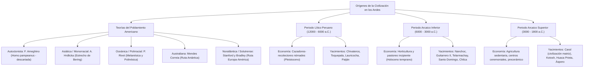

# TEMA 01: POBLAMIENTO AMERICANO, PERIODO LÍTICO Y ARCAICO

---

## 1. FICHA TÉCNICA Y MATRIZ DE COMPETENCIAS

| Parámetro | Especificación Oficial UNSA / UNMSM / UNI |
| :--- | :--- |
| **Eje Curricular** | Eje 03: Ciencias Sociales / Historia del Perú |
| **Nivel de Dificultad** | Nivel Intermedio-Avanzado - Arqueología Andina y Secuencia Precerámica |
| **Ponderación UNSA** | Sociales: 1.584321000 pts \| Biomédicas: 0.942150000 pts \| Ingenierías: 0.812450000 pts |
| **Tiempo Estándar de Respuesta** | 1.5 a 2.0 minutos por reactivo DECO |
| **Prerrequisitos Cognitivos** | Glaciación de Wisconsin, transición Pleistoceno-Holoceno, paleolítico americano, horticultura y revolución agropecuaria andina, fechado radiocarbónico. |
| **Competencia Cardinal** | Examina rigurosamente las hipótesis científicas sobre las rutas migratorias del poblamiento de América y analiza la evolución socioeconómica y tecnológica de las sociedades andinas precerámicas a través de la secuencia Lítico, Arcaico Inferior y Arcaico Superior (con énfasis en Caral y los centros ceremoniales tempranos). |

---

## 2. MAPA TAXONÓMICO Y ONTOLOGÍA



---

## 3. DESARROLLO TEÓRICO FORMAL

### 3.1. Teorías Científicas sobre el Poblamiento Americano
El ser humano no es originario del continente americano; todos los restos arqueológicos pertenecen biológicamente a la subespecie **Homo sapiens** que arribó durante el Pleistoceno tardío (última glaciación de **Wisconsin**, entre $40\,000$ y $12\,000$ a.C.).

```
+---------------------------------------------------------------------------------------------------+
|                        CUADRO COMPARATIVO DE LAS TEORÍAS DEL POBLAMIENTO                          |
+-------------------+-------------------+-------------------+---------------------------------------+
| TEORÍA            | AUTOR             | RUTA POSTULADA    | FUNDAMENTOS Y PRUEBAS CIENTÍFICAS     |
+-------------------+-------------------+-------------------+---------------------------------------+
| 1. Autoctonista   | Florentino        | Origen local en   | - Fósiles atribuidos al "Homo         |
|    (Descartada)   | Ameghino (Arg.)   | las Pampas        |   pampeanus" en la Era Terciaria.     |
|                   |                   | argentinas        | - REFUTACIÓN: Hrdlicka demostró que   |
|                   |                   |                   |   eran de monos platirrinos y huesos  |
|                   |                   |                   |   humanos modernos del Cuaternario.   |
+-------------------+-------------------+-------------------+---------------------------------------+
| 2. Asiática       | Alex Hrdlicka     | Estrecho de       | - Geográficas: Proximidad de 90 km    |
|    (Monorracial / | (Checo-EE.UU.)    | Beringia (puente  |   por el mar de Bering.               |
|     Principal)    |                   | terrestre por     | - Antropológicas: Mancha mongólica    |
|                   |                   | eustasia glacial) |   lumbar, cabello lisótrico, pómulos  |
|                   |                   |                   |   prominentes, pliegue mongólico.     |
+-------------------+-------------------+-------------------+---------------------------------------+
| 3. Oceánica       | Paul Rivet        | Océano Pacífico   | a) Melanésica: Corriente transpacífica|
|    (Polirracial)  | (Francés)         | en canoas con     |    cráneos de Lagoa Santa, cerbatana. |
|                   |                   | balancín          | b) Polinésica: De Tahití a Pascua;    |
|                   |                   |                   |    horno de tierra (pachamanca), camote|
|                   |                   |                   |    (*kumara*), macana de madera.      |
+-------------------+-------------------+-------------------+---------------------------------------+
| 4. Australiana    | Antonio Mendes    | Australia, islas  | - Etnológicas y Lingüísticas: Choza en|
|                   | Correia (Port.)   | Auckland, la      |   colmena, zumbador ceremonial,       |
|                   |                   | Antártida hasta   |   palabras comunes (onan, yagán).     |
|                   |                   | Tierra del Fuego  | - Clima: *Optimun climaticum* polar.  |
+-------------------+-------------------+-------------------+---------------------------------------+
| 5. Noratlántica   | Dennis Stanford y | Atlántico Norte   | - Líticas: Sorprendente parecido entre|
|    (Solutrense)   | Bruce Bradley     | bordeando glacia- |   las puntas bifaciales Solutrenses   |
|                   |                   | res desde Europa  |   (Francia/España) y las puntas Clovis|
|                   |                   | a Norteamérica    |   de Norteamérica.                    |
+-------------------+-------------------+-------------------+---------------------------------------+
```

---

### 3.2. El Periodo Lítico Peruano (12 000 - 6 000 a.C.)
- **Medio Geográfico:** Finales del Pleistoceno andino. Clima más frío y húmedo que el actual; costa más ancha por el descenso del nivel marino (*eustasia glacial*) con abundantes lomas vegetadas y manglares; sierra con glaciares a menor altitud habitada por la **megafauna pleistocénica** (smilodonte o tigre dientes de sable, megaterio, mastodonte o gonfoterio, paleollama).
- **Modo de Vida y Economía:** Economía **depredadora o parasitaria** (caza indiscriminada de megafauna y luego selectiva de camélidos y cérvidos, pesca y marisqueo litoral, recolección de raíces y frutos). Organización social en **bandas nómades** patriarcales (20 a 30 individuos) que habitaban abrigos rocosos naturales. División sexual del trabajo: los varones cazaban; las mujeres y niños recolectaban.

#### Principales Yacimientos del Periodo Lítico:
1. **Pacaicasa / Cueva de Piquimachay (Ayacucho, Richard MacNeish):** Antiguamente considerado el vestigio instrumental humano más remoto del Perú ($\sim 18\,000$ a.C.); hoy la arqueología científica ha demostrado que sus supuestas herramientas líticas son simples fracturas naturales de roca desprendida del techo de la cueva (**geofactos**), sin intervención antrópica probada.
2. **Chivateros o Río Chillón (Lima, Edward Lanning):** Gran cantera y taller lítico a orillas del río Chillón. Se hallaron preformas bifaciales y lascas toscas que los cazadores desbastaban para luego terminarlas en otros campamentos.
3. **Toquepala / Cueva del Diablo (Tacna, Miomir Bojovich y Emilio González):** Yacimiento célebre por contener las **primeras pinturas rupestres parietales del Perú** ($\sim 7600$ a.C.). Representan escenas de caza colectiva o rodeo de guanacos salvajes (**chaco**), pintadas con tintes minerales (rojo, ocre, negro) con una finalidad **mágico-propiciatoria** para asegurar el éxito en la cacería.
4. **Lauricocha (Huánuco, Augusto Cardich):** Abrigo rocoso en la cabecera del río Marañón ($\sim 7500$ a.C.).
   - Contiene los **primeros restos óseos humanos incompletos de la sierra peruana** (11 esqueletos con deformaciones craneanas intencionales de tipo tabular erecto).
   - Evidencias de los primeros enterramientos rituales con ofrendas (cuentas de collar, turquesas, ocre rojo) y pinturas rupestres estilizadas.
5. **Paiján (La Libertad, Rafael Larco Hoyle y Claude Chauchat):** Valle de Chicama ($\sim 8000$ a.C.).
   - Hallazgo de los **restos óseos humanos completos más antiguos del Perú** (esqueletos completos de una mujer adulta y un niño colocados en posición flexionada ritual).
   - Tradición lítica paijanense: confección de **puntas líticas pedunculares bifaciales** (con una prolongación o pedúnculo basal para ser atadas a un vástago de madera), empleadas como arpones para la pesca marina y caza de presas menores.

---

### 3.3. El Periodo Arcaico Inferior o Temprano (6 000 - 3 000 a.C.)
- **Transformación Climática del Holoceno:** Retiro definitivo de los hielos glaciares e instauración de un clima templado y cálido similar al actual. Extinción masiva de la megafauna pleistocénica y repliegue de los camélidos y cérvidos a las mesetas altoandinas. La costa se desértica progresivamente al contraerse las lomas.
- **Modo de Vida y Revolución Agropecuaria Incipiente:** Transición de la economía depredadora a una economía mixta productora basada en la **horticultura incipiente** (cultivo en huertos o laderas sin irrigación canalizada) y el **pastoreo/domesticación selectiva de camélidos y cuyes**.
- **Organización Social:** Bandas seminómades o semisedentarias que se agrupan en **aldeas estacionales** de chozas rústicas cónicas hechas de caña, esteras y costillas de ballena cerca del mar y los valles aluviales.

#### Principales Yacimientos del Arcaico Inferior:
1. **Nanchoc (Valle del Alto Zaña, Cajamarca, Tom Dillehay):**
   - Considerado científicamente el **primer horticultor del Perú y de toda América** ($\sim 8000 - 6000$ a.C.).
   - Evidencias botánicas de domesticación temprana de **calabazas (moschata), maní, quinua y tubérculos**.
2. **Guitarrero II (Callejón de Huaylas, Áncash, Thomas Lynch):**
   - Tradicionalmente citado en la historiografía como horticultor temprano de **frijoles, pallares, ají y ocas** en estratos fechados hacia el $6000$ a.C.
3. **Telarmachay (San Pedro de Cajas, Junín, Danièle Lavallée):**
   - **Primer domesticador de camélidos sudamericanos (alpacas y llamas)** en el mundo andino ($\sim 4500$ a.C.).
   - Evidencias de corrales para ganado, incremento porcentual masivo de huesos de fetos y crías de camélidos sacrificados (evidencia zoopaleontológica de domesticación y encierro forzado).
4. **Jayhuamachay y Piquimachay II (Ayacucho, Richard MacNeish):**
   - *Jayhuamachay:* Corrales y coprolitos de camélidos domesticados.
   - *Piquimachay II:* Evidencias del **primer domesticador del cuy** (*Cavia porcellus*).
5. **Santo Domingo o Pampa de Paracas (Ica, Frédéric Engel):**
   - Aldea de pescadores y mariscadores semisedentarios ($\sim 5000$ a.C.).
   - Fabricación de la **red de pescar más antigua del Perú** (elaborada con fibras vegetales de cactus).
   - Hallazgo de la **flauta ósea ceremonial más antigua** (primer instrumento musical documentado en los Andes).
6. **Chilca (Lima, Frédéric Engel):**
   - Aldea de chozas cónicas seminómades construidas con junco y estacas de madera.
   - Pescadores, mariscadores y horticultores de calabazas y camote; domesticación temprana del perro. Práctica de complejos entierros rituales amarrados a postes para evitar el retorno de los espíritus.

---

### 3.4. El Periodo Arcaico Superior o Tardío (3 000 - 1 800 a.C.)
Llamado también **Precerámico Tardío**. Periodo cumbre de la civilización andina primitiva caracterizado por:
1. **Agricultura Desarrollada y Sedentarismo Pleno:** Cultivo intensivo con canales de regadío incipientes de plantas industriales como el **algodón** (*Gossypium barbadense*, que revolucionó la textilería y las redes pesqueras) y el **maíz** (*Zea mays*).
2. **Revolución Urbana y Teocracia Sacerdotal:** Surgimiento de las primeras ciudades sagradas y centros ceremoniales monumentales dirigidos por **sacerdotes-astrónomos**, quienes controlaban los excedentes de producción y predecían los ciclos agrícolas midiendo la posición de los astros.
3. **Arquitectura Monumental Pública:** Pirámides truncas, plazas circulares hundidas, fogones rituales con conductos subterráneos de ventilación para ofrendas quemadas.
4. **Textilería Precerámica:** Elaboración de tejidos sin telar mediante la técnica del anillado y entrelazado.
5. **Rasgo Crítico:** **NO CONOCÍAN LA CERÁMICA** (los alimentos se asaban en piedras calientes como la pachamanca o se hervían depositando piedras ardientes dentro de calabazas o mates secos pirograbados).

#### Principales Centros del Arcaico Superior:
1. **Caral (Valle de Supe, Barranca, Lima, Ruth Shady):**
   - Considerada la **Civilización Matriz y Ciudad Sagrada más antigua de América** ($\sim 3000 - 1800$ a.C., contemporánea a las pirámides de Egipto y la civilización de Sumeria en Mesopotamia).
   - Complejo urbano monumental de $66\text{ hectáreas}$ que alberga 32 estructuras públicas: pirámides truncas escalonadas (como la Pirámide Mayor), anfiteatros, plazas circulares hundidas y conjuntos residenciales diferenciados por estamentos sociales.
   - *Hallazgos Trascendentales:*
     - **El Quipu más antiguo:** Sistema nemotécnico de registro contable textil de cuerdas con nudos.
     - Instrumentos musicales: Colección de 32 flautas traversas hechas de huesos de pelícano y cóndor con grabados zoomorfos, y 38 cornetas de hueso de camélido.
     - Estatuillas antropomorfas de arcilla cruda no cocida (para fines de diagnóstico ritual).
     - Economía mixta complementaria basada en el intercambio (*trueque*) a larga distancia entre pescadores del litoral (pescado seco y moluscos) y agricultores del valle (algodón, zapallo, frijol), extendiendo redes comerciales hasta la selva (plumas de guacamayo y semillas de huayruro) y Ecuador (*Spondylus*).
2. **Kotosh (Huánuco, Seichi Izumi - Misión Arqueológica Japonesa):**
   - Templo ceremonial en la sierra central famoso por albergar el **Templo de las Manos Cruzadas** ($\sim 2200$ a.C.), considerado la **primera escultura en altorrelieve de barro de América**.
   - Presencia de un fogón central ceremonial en el piso con conducto subterráneo de tiro para incinerar ofrendas alimenticias a los dioses.
3. **Huaca Prieta (Valle de Chicama, La Libertad, Junius Bird):**
   - Yacimiento costero precerámico donde se descubrieron los **primeros tejidos de algodón del Perú**, ornamentados con iconografía compleja entrelazada (figuras estilizadas del primer cóndor andino con una serpiente en el vientre).
   - Hallazgo de los primeros **mates pirograbados** (calabazas secas grabadas al fuego con rostros felínicos antropomorfos).
4. **Áspero y Bandurria (Costa Central de Lima):**
   - *Áspero:* Centro pesquero satélite de Caral; destacan la Huaca de los Ídolos y la Huaca de los Sacrificios.
   - *Bandurria (Huacho):* Aldea monumental y centro ceremonial marítimo muy temprano ($\sim 3200$ a.C.).
5. **Sechín Bajo (Valle de Casma, Áncash, Peter Fuchs):**
   - Centro ceremonial con una plaza circular hundida construida con adobes cónicos y piedras labradas fechada en $\sim 3500$ a.C., una de las estructuras arquitectónicas más antiguas de la costa peruana.

---

## 4. CUADRO SINÓPTICO COMPARATIVO

$$\begin{array}{|l|l|l|l|l|}
\hline
\textbf{Periodo} & \textbf{Cronología} & \textbf{Clima / Época} & \textbf{Economía y Hábitat} & \textbf{Yacimientos Emblemáticos} \\ \hline
\text{Lítico} & 12000 - 6000\text{ a.C.} & \text{Pleistoceno frío} & \text{Depredadora, caza-recolección, nómade} & \text{Paiján, Lauricocha, Toquepala, Chivateros} \\ \hline
\text{Arcaico Inf.} & 6000 - 3000\text{ a.C.} & \text{Holoceno temprano} & \text{Horticultura y pastoreo, seminómade} & \text{Nanchoc, Guitarrero II, Telarmachay, Chilca} \\ \hline
\text{Arcaico Sup.} & 3000 - 1800\text{ a.C.} & \text{Holoceno pleno} & \text{Agricultura, teocracia, sedentarismo} & \text{Caral, Kotosh, Huaca Prieta, Áspero} \\ \hline
\end{array}$$

---

## 5. MNEMOTECNIAS DE COMBATE PREUNIVERSITARIO

### Mnemotecnia 1: "P-A-I-J-A-N" para los Restos Óseos y el Lítico
- **P**: **P**aiján = Restos humanos completos más antiguos del Perú.
- **L**: **L**auricocha = Primeros restos humanos de la sierra y deformación craneana.
- **T**: **T**oquepala = Pinturas rupestres de la cacería de guanacos (*chaco*).
- **C**: **C**hivateros = Cantera y taller lítico preforma.

### Mnemotecnia 2: "N-T-G" para los Primeros Productores
- **N**: **N**anchoc = Primer horticultor de América (calabaza y maní).
- **T**: **T**elarmachay = Primer domesticador de camélidos (alpacas y llamas).
- **G**: **G**uitarrero II = Horticultor de frijoles y ají.

---

## 6. TÉCNICAS Y ARTIFICIOS DE RESOLUCIÓN (HACKING PREUNIVERSITARIO)

### Hack 1: Los Fósiles Humanos más Antiguos del Perú
- Si la pregunta pide: *restos óseos humanos más antiguos e incompletos de la sierra* $\implies$ Marca **Lauricocha** (Augusto Cardich).
- Si la pregunta pide: *restos óseos humanos más antiguos, completos y articulados del Perú (costa)* $\implies$ Marca **Paiján** (Claude Chauchat / Larco Hoyle).
*¡Nunca los confundas en la hoja óptica!*

### Hack 2: Descarte en el Arcaico Superior
Si una opción dice "cerámica", "alfarería", "fundición de metales" o "Chavín", **DESCÁRTALA DE INMEDIATO**. El Arcaico Superior es estrictamente **Precerámico** (tienen templos colosales, quipus y tejidos, pero hervían con piedras calientes porque carecían de ollas de barro cocido).

---

## 7. ZONA DE TRAMPAS Y DISTRACTORES ("¡PELIGRO EXAMEN!")

> [!WARNING]
> **Trampa 1: El estatus de Pacaicasa en la arqueología contemporánea**
> Durante décadas los libros escolares repitieron que Pacaicasa era el primer habitante del Perú (20 000 a.C.). Hoy en exámenes rigurosos de admisión (UNMSM, UNI, UNSA), **Pacaicasa está desestimado científicamente** porque los supuestos artefactos líticos eran rocas fracturadas por causas geológicas naturales (**geofactos**).

> [!CAUTION]
> **Trampa 2: Suponer que Caral tenía murallas militares**
> En Caral **NO se han encontrado armas de guerra, murallas defensivas ni restos de violencia militar**. Fue una teocracia pacífica sustentada en el comercio, la ideología religiosa astronómica y la música ceremonial.

> [!WARNING]
> **Trampa 3: La escultura de Kotosh no es de piedra tallada**
> Las "Manos Cruzadas" de Kotosh fueron modeladas en **barro arcilloso crudo en altorrelieve** sobre la pared del templo, no esculpidas en piedra de cantería.

---

## 8. APLICACIÓN AL MUNDO REAL Y CONTEXTO DECO

### Caso 1: Sismorresistencia Milenaria de la Civilización Caral
Los arquitectos e ingenieros de Caral utilizaron hace 5000 años las **shicras** (bolsas tejidas de fibra vegetal de junco rellenas de piedras de canto rodado) colocadas en las bases de sus pirámides monumentales. Ante un terremoto de gran magnitud, las piedras se disipan y acomodan libremente dentro de la red vegetal amortiguando las ondas sísmicas, tecnología sismorresistente que la ingeniería moderna ha redescubierto como aisladores de base flexibles.

### Caso 2: El Quipu como Primer Sistema de Información de América
El hallazgo de un quipu arcaico en las excavaciones de la Pirámide de la Galería en Caral demostró que la administración contable y estadística mediante cuerdas anudadas tiene una antigüedad de 5000 años en los Andes peruanos, desvirtuando la tesis de que los quipus fueron una invención tardía de los incas.

---

## 9. BANCO DE 5 EJERCICIOS RESUELTOS GRADUADOS

### Ejercicio 1 (Nivel 1 - Acceso Inmediato): Fósiles del Lítico
**Enunciado (UNSA):** En el valle de Chicama (La Libertad), las excavaciones dirigidas por Claude Chauchat sacaron a la luz entierros rituales correspondientes a una mujer adulta y a un niño acompañados de artefactos líticos bifaciales con pedúnculo. Dichos hallazgos corresponden al hombre de:
A) Lauricocha  
B) Paiján  
C) Toquepala  
D) Chivateros  
E) Guitarrero

**Solución paso a paso:**
1. Los restos fósiles humanos más antiguos y completos del Perú fueron hallados en el yacimiento de **Paiján** en la costa norte (La Libertad).
2. Se caracterizan además por la famosa tradición de puntas líticas pedunculares utilizadas para la pesca y caza menor.
**Respuesta:** **B) Paiján**.

---

### Ejercicio 2 (Nivel 2 - Intermedio Operativo): Los Inicios de la Horticultura
**Enunciado (UNMSM DECO):** Las investigaciones arqueológicas dirigidas por Tom Dillehay en el valle del Alto Zaña (Cajamarca) revolucionaron la cronología agropecuaria americana al descubrir restos fosilizados de calabazas, maní y quinua con una antigüedad superior a los $6000$ a.C. Dichas evidencias corresponden al hombre de:
A) Telarmachay  
B) Santo Domingo  
C) Nanchoc  
D) Huaca Prieta  
E) Kotosh

**Solución paso a paso:**
1. Tom Dillehay descubrió en **Nanchoc** (Cajamarca) las evidencias más tempranas de domesticación botánica en huertos controlados.
2. Por esta razón, el hombre de Nanchoc ostenta el título científico de **primer horticultor del Perú y de América**.
**Respuesta:** **C) Nanchoc**.

---

### Ejercicio 3 (Nivel 3 - Contexto DECO Avanzado): Trascendencia Universal de Caral
**Enunciado (UNMSM DECO / UNSA):** La doctora Ruth Shady sostiene que la Ciudad Sagrada de Caral (Valle de Supe) representa la civilización más antigua de América. Entre las características sociopolíticas y materiales que respaldan su estatus de civilización en el Arcaico Superior destaca:
A) El uso generalizado de armas de bronce y murallas fortificadas de asedio.  
B) La presencia de una arquitectura pública ceremonial monumental, diferenciación social y una teocracia estatal basada en el intercambio a larga distancia.  
C) El monopolio de la alfarería policroma vidriada y el pastoreo masivo de caballos.  
D) La invención de la escritura fonética alfabética grabada en láminas de oro.  
E) La organización social en bandas nómades trogloditas sin división del trabajo.

**Solución paso a paso:**
1. Caral ostenta una complejidad urbana monumental (pirámides, plazas circulares hundidas) y una élite sacerdotal que gobernaba sin recurrir a la coerción militar abierta.
2. Contaba con una economía de trueque interregional y sistemas de registro como el quipu, todo dentro de una etapa precerámica ($\sim 3000\text{ a.C.}$).
**Respuesta:** **B) La presencia de una arquitectura pública ceremonial monumental, diferenciación social y una teocracia estatal basada en el intercambio a larga distancia.**

---

### Ejercicio 4 (Nivel 4 - Análisis Crítico / UNI CEPRE): Teorías del Poblamiento
**Enunciado (UNI):** Paul Rivet formuló la teoría oceánica del poblamiento americano, postulando que grupos humanos procedentes de Melanesia y Polinesia arribaron a América a través del océano Pacífico. Señale la alternativa que contiene pruebas antropológicas y culturales que sustentan la migración polinésica:
A) La mancha mongólica en recién nacidos y los cabellos lisótricos.  
B) El parecido biomecánico entre las puntas Solutrenses y las puntas Clovis.  
C) El uso del horno de tierra (pachamanca), el cultivo del camote (*kumara*) y la macana de madera.  
D) El empleo exclusivo de bumeranes y chozas en forma de colmena.  
E) La presencia de cráneos dolicocéfalos fósiles en las pampas argentinas.

**Solución paso a paso:**
1. Rivet dividió la corriente oceánica en dos ramas: melanésica y polinésica.
2. Los polinesios, grandes navegantes de canoas con balancín, aportaron elementos etnoculturales indudables: el horno subterráneo de piedras calientes (la *pachamanca* andina o *umu* polinésico), vocablos comunes como *kumara* para el camote y armas de combate como la macana de madera.
**Respuesta:** **C) El uso del horno de tierra (pachamanca), el cultivo del camote (*kumara*) y la macana de madera.**

---

### Ejercicio 5 (Nivel 5 - Reto Titán / Examen de Excelencia): Secuencia Arqueológica Precerámica
**Enunciado (Reto Historiográfico Élite):** Determine la veracidad ($V$) o falsedad ($F$) de las siguientes proposiciones sobre los periodos Lítico y Arcaico del Perú antiguo:
I. En el yacimiento de Toquepala se encontraron los esqueletos completos más antiguos de la sierra peruana junto a cerámicas ceremoniales de camélidos.  
II. El Templo de las Manos Cruzadas de Kotosh pertenece cronológicamente al periodo Arcaico Superior y carece totalmente de cerámica.  
III. El hombre de Telarmachay en Junín es reconocido como el primer domesticador de camélidos sudamericanos a partir de corrales y restos fósiles óseos.  
IV. La teoría autoctonista de Florentino Ameghino fue ratificada mediante modernos exámenes de ADN mitocondrial practicados a fósiles del Mioceno.

A) F - V - V - F  
B) V - V - F - F  
C) F - F - V - V  
D) V - F - V - F  
E) F - V - F - V  

**Solución paso a paso:**
- **Afirmación I (FALSA):** En Toquepala se descubrieron **pinturas rupestres**, no esqueletos humanos completos; además, no existía la cerámica en el Periodo Lítico.
- **Afirmación II (VERDADERA):** El Templo de las Manos Cruzadas pertenece al Arcaico Superior o Precerámico Tardío (hacia el 2200 a.C.) y sus constructores no conocían la alfarería.
- **Afirmación III (VERDADERA):** Danièle Lavallée demostró en Telarmachay la domesticación de alpacas y llamas hacia el 4500 a.C.
- **Afirmación IV (FALSA):** La teoría autoctonista fue científicamente descartada y refutada desde inicios del siglo XX por Alex Hrdlicka; los fósiles pertenecían a estratos modernos cuaternarios y restos óseos de monos.
- Secuencia: $F - V - V - F$.
**Respuesta:** **A) F - V - V - F**.

---

## 10. GLOSARIO DE 10 TÉRMINOS CLAVE

1. **Eustasia Glacial:** Descenso del nivel del mar a escala planetaria producido por la acumulación masiva de agua congelada en los casquetes polares durante las glaciaciones.
2. **Geofacto:** Fragmento rocoso fracturado por agentes climáticos y geológicos naturales que simula erróneamente haber sido tallado por manos humanas.
3. **Punta Peduncular:** Instrumento lítico con una espiga o prolongación en su base para ser encastrado y atado a mangos de madera o astiles de proyectil (típico de Paiján).
4. **Chaco:** Práctica colectiva ancestral de cacería andina consistente en rodear en círculos a manadas de camélidos silvestres (guanacos y vicuñas) para capturarlos selectivamente.
5. **Horticultura:** Agricultura incipiente y de baja escala practicada en huertos o laderas húmedas sin empleo de canales hidráulicos de regadío artificial.
6. **Precerámico:** Etapa del desarrollo arqueológico andino que comprende el Lítico y el Arcaico, caracterizada por la total ausencia de manufactura de recipientes de arcilla cocida.
7. **Shicra:** Bolsa o red tejida con fibras de junco o totora rellena de piedras de canto rodado, empleada en Caral como cimiento antisísmico de las plataformas piramidales.
8. **Plaza Circular Hundida:** Estructura arquitectónica ceremonial subterránea de planta circular típica de los centros sagrados del Arcaico Superior (Caral, Sechín Bajo).
9. **Pirograbado:** Técnica artística decorativa consistente en grabar diseños iconográficos sobre la corteza seca de calabazas o mates mediante el uso de brasas incandescentes.
10. **Beringia:** Puente de tierra emergido de más de $1500\text{ km}$ de ancho que unió Siberia y Alaska durante la glaciación de Wisconsin debido a la regresión marina.

---

## 11. BANCO DE FLASHCARDS (Q/A)

- **P:** ¿Quién refutó científicamente la hipótesis autoctonista de Florentino Ameghino sobre el origen del hombre americano?
  - **R:** El antropólogo físico checo-norteamericano Alex Hrdlicka.
- **P:** ¿Cuál es la ruta principal que postula la teoría asiática de Alex Hrdlicka para el poblamiento de América?
  - **R:** El puente terrestre del Estrecho de Bering (Beringia) durante la glaciación de Wisconsin.
- **P:** ¿Qué yacimiento del Lítico peruano contiene las primeras pinturas rupestres con escenas de caza colectiva o chaco?
  - **R:** La cueva de Toquepala (Tacna).
- **P:** ¿Dónde se hallaron los restos óseos humanos completos y articulados más antiguos del Perú?
  - **R:** En el yacimiento de Paiján (Valle de Chicama, La Libertad).
- **P:** ¿Qué arqueólogo descubrió en Nanchoc (Cajamarca) al primer horticultor de América?
  - **R:** Tom Dillehay.
- **P:** ¿En qué yacimiento de Junín se descubrieron las primeras evidencias de domesticación de alpacas y llamas en los Andes?
  - **R:** En Telarmachay (investigado por Danièle Lavallée).
- **P:** ¿Quién lideró las investigaciones arqueológicas que consagraron a Caral como la civilización más antigua de América?
  - **R:** La arqueóloga peruana Ruth Shady Solís.
- **P:** ¿Qué escultura en altorrelieve de barro del Arcaico Superior fue hallada en Huánuco por la expedición de Seichi Izumi?
  - **R:** Las Manos Cruzadas de Kotosh.

---

## 12. MOTOR DE GAMIFICACIÓN (JSON NATIVO PARA KOTLIN MULTIPLATFORM)

```json
{
  "subject_id": "HISTORIA_DEL_PERU",
  "topic_id": "TEMA_01_POBLAMIENTO_AMERICANO_LITICO_ARCAICO",
  "title": "Poblamiento Americano, Periodo Lítico y Arcaico",
  "level": "Intermedio-Avanzado",
  "total_xp": 230,
  "skills": ["Teorías de Inmigración", "Periodo Lítico Andino", "Arcaico y Horticultura", "Civilización Caral"],
  "challenges": [
    {
      "id": "HIST_PER_01",
      "type": "MULTIPLE_CHOICE",
      "question": "Los restos óseos humanos más antiguos e incompletos de la sierra peruana, correspondientes a 11 esqueletos con deformaciones craneanas, fueron descubiertos por Augusto Cardich en:",
      "options": [
        "Paiján",
        "Lauricocha",
        "Chivateros",
        "Toquepala"
      ],
      "correct_index": 1,
      "explanation": "Augusto Cardich descubrió en 1958 en las cuevas de Lauricocha (Huánuco) los restos humanos fósiles más antiguos de la sierra peruana, evidenciando ritos funerarios y deformación craneana.",
      "xp_reward": 50
    },
    {
      "id": "HIST_PER_02",
      "type": "MULTIPLE_CHOICE",
      "question": "¿Cuál es la característica arquitectónica e ingenieril fundamental de las pirámides de Caral que demostró su avanzado conocimiento sismorresistente?",
      "options": [
        "El uso de columnas dóricas de granito",
        "El empleo de shicras (bolsas de fibra vegetal con piedras de río en los cimientos)",
        "Muros de adobe con cemento puzolánico romano",
        "Fosos de agua defensivos alrededor de los templos"
      ],
      "correct_index": 1,
      "explanation": "Las shicras eran bolsas de fibra vegetal rellenas de cantos rodados que actuaban como disipadores de energía sísmica, evitando el colapso de las monumentales pirámides de Caral ante terremotos.",
      "xp_reward": 60
    },
    {
      "id": "HIST_PER_03",
      "type": "BOSS_CHALLENGE",
      "question": "Ordene cronológicamente la secuencia cultural andina precerámica: (1) Primera escultura de barro de las Manos Cruzadas de Kotosh, (2) Pinturas rupestres de la cacería de camélidos en Toquepala, (3) Domesticación temprana de calabazas por el hombre de Nanchoc, (4) Construcción de la ciudad sagrada de Caral.",
      "options": [
        "2 - 3 - 4 - 1",
        "3 - 2 - 4 - 1",
        "2 - 4 - 3 - 1",
        "1 - 2 - 3 - 4"
      ],
      "correct_index": 0,
      "explanation": "La secuencia correcta es: 2 (Toquepala, Lítico, ~7600 a.C.) -> 3 (Nanchoc, Arcaico Inferior, ~6000 a.C.) -> 4 (Caral, Arcaico Superior, ~3000 a.C.) -> 1 (Kotosh Manos Cruzadas, Arcaico Superior tardío, ~2200 a.C.).",
      "xp_reward": 120
    }
  ]
}
```
