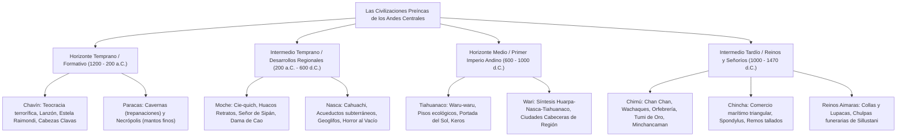

# TEMA 02: ALTAS CULTURAS PREÍNCAS (HORIZONTES E INTERMEDIOS CULTURALES)

---

## 1. FICHA TÉCNICA Y MATRIZ DE COMPETENCIAS

| Parámetro | Especificación Oficial UNSA / UNMSM / UNI |
| :--- | :--- |
| **Eje Curricular** | Eje 03: Ciencias Sociales / Historia del Perú |
| **Nivel de Dificultad** | Nivel Avanzado - Alta Complejidad Arqueológica, Iconográfica y Cronológica |
| **Ponderación UNSA** | Sociales: 1.584321000 pts \| Biomédicas: 0.942150000 pts \| Ingenierías: 0.812450000 pts |
| **Tiempo Estándar de Respuesta** | 1.5 a 2.0 minutos por reactivo DECO |
| **Prerrequisitos Cognitivos** | Periodizaciones de John Rowe (alfarera) y Luis G. Lumbreras (socioeconómica), teocracias formativas, señoríos regionales, tecnologías hidráulicas y primer imperio andino (Wari). |
| **Competencia Cardinal** | Clasifica, compara y explica los procesos de integración panandina (Horizontes) y de diferenciación artesanal y política (Intermedios) del Perú prehispánico, analizando el legado de Chavín, Paracas, Moche, Nasca, Tiahuanaco, Wari, Chimú y Chincha. |

---

## 2. MAPA TAXONÓMICO Y ONTOLOGÍA



---

## 3. DESARROLLO TEÓRICO FORMAL

### 3.1. Modelos Teóricos de Periodización Prehispánica

```
+---------------------------------------------------------------------------------------------------+
|                            COMPARATIVA DE LAS DOS PERIODIZACIONES MAESTRAS                        |
+-----------------------------------+---------------------------------------------------------------+
| CRITERIO DE JOHN H. ROWE (1962)   | CRITERIO DE LUIS G. LUMBRERAS (1969)                          |
+-----------------------------------+---------------------------------------------------------------+
| - Criterio: Estilístico y         | - Criterio: Económico-Social y Fuerzas Productivas            |
|   evolución de la alfarería       |   (Materialismo Histórico aplicado a los Andes)               |
|   (Secuencia estratigráfica Ica)  |                                                               |
+-----------------------------------+---------------------------------------------------------------+
| 1. Periodo Precerámico            | 1. Periodo Lítico y Arcaico (Comunidad Primitiva)             |
| 2. Periodo Inicial                | 2. Formativo (Inferior, Medio y Superior)                     |
| 3. Horizonte Temprano             | 3. Desarrollos Regionales (Maestros Artesanos)                |
| 4. Intermedio Temprano            | 4. Imperio Wari (Revolución Urbana)                           |
| 5. Horizonte Medio                | 5. Reinos y Señoríos (Estados Regionales)                    |
| 6. Intermedio Tardío              | 6. Imperio del Tawantinsuyu                                   |
| 7. Horizonte Tardío               |                                                               |
+-----------------------------------+---------------------------------------------------------------+
| * Horizonte: Época de unificación | * Formativo: Consolidación de la agricultura y el Estado.     |
|   cultural y difusión panandina.  | * Desarrollos Regionales: Florecimiento artesanal y militar.  |
| * Intermedio: Época de floreci-   | * Wari: Primer Estado imperial urbano centralizado.           |
|   miento local y fragmentación.   |                                                               |
+-----------------------------------+---------------------------------------------------------------+
```

---

### 3.2. Horizonte Temprano o Periodo Formativo (1200 - 200 a.C.)

#### A. Cultura Chavín (Áncash, Callejón de Conchucos):
Descubierta por **Julio C. Tello**, quien la bautizó como la *"Cultura Matriz del Perú Antiguo"* (tesis autoctonista).
- **Naturaleza del Estado:** Teocracia sacerdotal represiva. Los sacerdotes controlaban a la masa campesina a través del conocimiento astronómico del calendario agrícola y la manipulación ideológica del terror religioso.
- **Panteón Divino Terrorífico:** Tríada sagrada de la selva y la sierra: el **Jaguar o Felino**, el **Cóndor o Harpía** y la **Serpiente**. Consumían sustancias psicotrópicas alucinógenas (el cactus San Pedro o *huachuma*) para entrar en trance chamánico.
- **Centro Ceremonial de Chavín de Huántar:** Ubicado en la confluencia estratégica de los ríos Mosna y Huachecsa. Dividido en Templo Viejo y Templo Nuevo (o "Castillo"). Compleja red de galerías subterráneas laberínticas y acueductos acústicos que imitaban el bramido estruendoso del felino subterráneo.
- **Escultura Lítica Monumental:**
  1. *El Lanzón Monolítico:* Esculpido en granito de $4.53\text{ m}$ empotrado en el cruce de las galerías del Templo Viejo; representa al "Dios Jaguar Sonriente" con colmillos cruzados y cabellos de serpiente.
  2. *La Estela de Raimondi:* Representa al **Dios de las Varas o de los Báculos** (antepasado de Wiracocha). Muestra el principio de **poliscopia** (diseños ópticos reversibles según el ángulo visual).
  3. *El Obelisco Tello:* Escultura prismática de $2.52\text{ m}$ que representa a un caimán hermafrodita cósmico provisto de plantas domesticadas (ají, yuca, maní).
  4. *Las Cabezas Clavas:* Esculturas antropomorfas y zoomorfas empotradas en los muros exteriores del Templo Nuevo; representaban a los sacerdotes en proceso de metamorfosis chamánica hacia el jaguar.
- **Cerámica:** Monocroma (negro, gris o parduzco que imitaba la piedra), forma globular, base plana, gollete estribo grueso con reborde pronunciado e incisiones con motivos felínicos.

#### B. Cultura Paracas (Ica, Península de Paracas):
Descubierta por **Julio C. Tello** y Toribio Mejía Xesspe en 1925.

```
+---------------------------------------------------------------------------------------------------+
|                            PARACAS CAVERNAS VS. PARACAS NECRÓPOLIS                                |
+-------------------+-----------------------------------+-------------------------------------------+
| CRITERIO          | PARACAS CAVERNAS                  | PARACAS NECRÓPOLIS                        |
+-------------------+-----------------------------------+-------------------------------------------+
| Cronología        | 700 - 500 a.C.                    | 500 - 200 a.C.                            |
| Yacimiento Clave  | Tajahuana (Ica)                   | Warikayan / Topará                        |
| Tumbas            | Forma subterránea de COPA         | Cementerios rectangulares colectivos      |
|                   | INVERTIDA o botella (fosa común)  | subterráneos ("ciudades de los muertos")  |
| Cerámica          | POLÍCROMA, pintura POST-COCCIÓN   | MONOCROMA (crema/rojizo), pintura PRE-    |
|                   | (fugitiva, se borra al frotar)    | COCCIÓN resistente y acabado fino         |
| Influencia        | Muy fuerte influencia de Chavín   | Autonomía estilística (antecedente Nasca) |
| Logro Cumbre      | CIRUGÍA Y TREPANACIONES           | TEXTILERÍA DE ÉLITE (MANTOS               |
|                   | CRANEANAS (Tumi de obsidiana,     | PARACAS: hilos de algodón, lana de alpaca,|
|                   | placas de oro y anestésicos)      | tintes naturales, Ser Oculado)            |
+-------------------+-----------------------------------+-------------------------------------------+
```

---

### 3.3. Intermedio Temprano o Desarrollos Regionales (200 a.C. - 600 d.C.)
Periodo de los **Maestros Artesanos** y de las **Teocracias Militares**.

#### A. Cultura Moche o Mochica (Costa Norte: valles de Lambayeque, Chicama, Moche, Virú):
Descubierta por **Max Uhle** (la denominó *Proto-Chimú*).
- **Estructura Sociopolítica:** Confederación de valles gobernada por teocracias militares.
  - *Cie-quich:* Rey o gobernante supremo del reino moche.
  - *Alaec:* Señor subordinado gobernante de un valle local.
  - *Sacerdotes / Sacerdotisas:* Casta dirigente con funciones mágicas y judiciales.
  - *Pueblo:* Pescadores y agricultores obligados al tributo en trabajo.
  - *Divinidad Suprema:* **Aia Paec** ("el Hacedor" o el "Dios Degollador").
- **Cerámica Excepcional:**
  - Bícroma (uso exclusivo del **rojo ocre y crema/blanco marfil**), base plana y gollete estribo fino.
  - Escultórica y realista: Los célebres **Huacos Retratos** (plasmaban con exactitud psicológica estados de ánimo, dignatarios y enfermedades), huacos eróticos (culto a la fertilidad) y huacos patológicos (labio leporino, ceguera, bocio).
- **Yacimientos Arqueológicos Estelares:**
  1. *El Señor de Sipán (Huaca Rajada, Lambayeque, Walter Alva, 1987):* Máxima tumba intacta de un monarca teocrático-militar de América precolombina, sepultado con ornamentos de oro, plata, cobre dorado, pectorales de *Spondylus* y acompañado por ocho servidores y animales sacrificados.
  2. *La Dama de Cao (Huaca Cao Viejo, Complejo El Brujo, Chicama, Régulo Franco, 2006):* Descubrimiento de una mujer momificada perteneciente a la más alta jerarquía militar-sacerdotal, con los brazos tatuados de serpientes y arañas, enterrada con porras de combate y coronas, probando el liderazgo político femenino en los Andes.
  3. *Huacas del Sol y de la Luna (Moche, Trujillo):* Huaca del Sol (centro administrativo piramidal de adobe) y Huaca de la Luna (templo ceremonial con murales polícromos en relieve: la *Rebelión de los Artefactos* y el dios *Aia Paec*).
- **Metalurgia y Escritura:** Dominio de la **tumbaga** (aleación de cobre y oro), dorado y plateado químico de metales. Rafael Larco Hoyle propuso la existencia de un sistema mnemotécnico o ideográfico en semillas: la **escritura pallariforme**.

#### B. Cultura Nasca (Costa Sur: valles de Chincha, Pisco, Ica, Grande):
Descubierta por **Max Uhle**.
- **Medio Geográfico Desértico e Ingeniería Hidráulica:** Zona árida con escasas lluvias; diseñaron una asombrosa red de **acueductos subterráneos y galerías filtrantes** (como Cantalloc) con respiraderos circulares u "ojos de agua" para captar aguas subterráneas de la napa freática y transportarlas a reservorios (*cochas*).
- **Centro Urbano-Ceremonial:** **Cahuachi** (en el valle del río Grande), la urbe ceremonial de adobe más grande del sur andino.
- **Cerámica Pictórica Cumbre:**
  - La **más polícroma de América precolombina** (utilizaron entre 11 y 16 colores minerales cocidos al horno).
  - Técnica de la pintura **pre-cocción**.
  - Fenómeno estético del **"Horror al Vacío"** (*horror vacui*): no dejaban ningún milímetro de la superficie sin pintar.
  - Forma globular, asa puente con dos picos divergentes e iconografía del Dios Kon (felino volador antropomorfo).
- **Los Geoglifos y Líneas de Nasca:**
  - Gigantescos trazos zoomorfos (el colibrí, el mono, la araña, el pelícano) y geométricos en las pampas de Palpa, Nasca y Socos.
  - *Estudios:* Toribio Mejía Xesspe (1927) las interpretó como caminos sagrados (*ceques*); Paul Kosok (1939) propuso la tesis de un "calendario astronómico con fines agrícolas"; **María Reiche** dedicó su vida a medirlos y conservarlos como calendario solar y lunar. Investigaciones recientes (Markus Reindel e Isla) concluyen que fueron **rutas procesionales ceremoniales vinculadas al culto al agua y la fecundidad**.
- **Cabezas Trofeo:** Costumbre militar de decapitar a los guerreros enemigos, extrayéndoles el encéfalo por el foramen magnum y sellándoles la boca con espinas de cactus para colgarlas de la cintura como símbolos mágicos de poder bélico.

---

### 3.4. Horizonte Medio o Primer Imperio Andino (600 - 1000 d.C.)

#### A. Cultura Tiahuanaco (Altiplano del Collao, cuenca del lago Titicaca):
- **Clima de Puna y Estrategias Ecológicas:**
  1. *Waru-Waru o Camellones:* Terrazas agrícolas elevadas rodeadas de zanjas de agua que absorbían el calor solar durante el día y lo emitían durante la gélida noche, evitando las heladas y proporcionando abundante humedad y peces.
  2. *Control Vertical de Pisos Ecológicos (Archipiélagos Ecológicos):* Tesis formulada por **John Murra**. Consistía en enviar colonos (*mitmaq*) a enclaves productivos en la costa (sal, maíz, ají, pescado seco) y en la selva alta (coca, plumas, madera) para abastecer a la metrópoli del altiplano sin intermediarios comerciales.
  3. *Conservación de Alimentos:* Deshidratación de la papa (**chuño**) y de la carne de llama (**charqui**).
- **Arquitectura y Escultura Megalítica:** Uso de grapas de cobre y bronce para ensamblar enormes bloques de piedra andesita.
  - Complejo de **Kalasasaya** y Templete Semisubterráneo.
  - **La Portada del Sol (*Intipunku*):** Monolito de piedra andesita de $10\text{ toneladas}$ con el friso central del **Dios de las Varas o de los Báculos** (el "Dios Llorón" por los lagrimones que descienden de sus ojos).
  - Esculturas gigantes: Monolito Bennett ($7.30\text{ m}$) y Monolito Ponce.
- **Cerámica:** Los **Keros** (vasos ceremoniales policromos de madera o arcilla con boca ensanchada) y pebeteros zoomorfos.

#### B. El Imperio Wari (Ayacucho, Huanta):
Descubierto por **Julio C. Tello** y teorizado por **Luis Guillermo Lumbreras** como el **Primer Imperio Panandino**.
- **Orígenes y Matriz Cultural Tríadica:** Wari surgió de la fusión dialéctica de tres culturas previas:
  1. *Huarpa (Ayacucho):* La base demográfica y tecnológica local.
  2. *Nasca (Ica):* La tradición urbanística, la cerámica policroma brillante y la técnica textil.
  3. *Tiahuanaco (Altiplano):* La religión, el culto al Dios de las Varas y los modelos iconográficos.
- **Urbanismo Militar Centralizado (Revolución Urbana):**
  - Para controlar los inmensos territorios anexados desde Cajamarca y Lambayeque hasta Arequipa y Cusco, Wari fundó una extensa red de **ciudades cabeceras de región (*llaqtas*)** amuralladas, ortogonales y con grandes plazas de acopio:
    - *Piquillacta* (Cusco)
    - *Huiracochapampa* (La Libertad)
    - *Cajamarquilla* y *Pachacámac* (Lima)
    - *Wariwillca* (Junín)
    - *Cerro Baúl* (Moquegua)
  - Construyeron la primera gran red de caminos andinos planificada que sirvió de base al posterior *Qhapaq Ñan* incaico.
- **Decadencia:** Hacia el año 1000 d.C., la autonomía creciente y rebelión de las élites provinciales de las cabeceras de región, sumadas a una prolongada sequía climatológica, provocaron el colapso y abandono de la metrópoli central de **Viñaque** (Ayacucho).

---

### 3.5. Intermedio Tardío o Reinos y Señoríos (1000 - 1470 d.C.)

#### A. Cultura Chimú (Costa Norte: desde Tumbes hasta Carabayllo en Lima):
- **Origen Mítico Dinástico:** El mito de **Tacaynamo**, héroe civilizador que llegó navegando en una balsa por el mar al valle de Moche para fundar el reino chimú. Su último gobernante fue **Minchancaman**.
- **Capital:** **Chan Chan** ("Sol Sol"), la ciudad de barro más extensa de la América prehispánica ($20\text{ km}^2$), conformada por nueve grandes palacios o ciudadelas amuralladas pertenecientes a cada gobernante difunto.
- **Ingeniería Hidráulica y Agrícola:** Canales de derivación intercuencas (como el Canal La Cumbre de $84\text{ km}$ que unía los ríos Chicama y Moche) y los **Wachaques** (chacras hundidas excavadas en el desierto para aprovechar el agua salobre subterránea y sembrar totora).
- **Metalurgia Cumbre de los Andes:** Herederos directos de la cultura Sicán o Lambayeque. Emplearon el martillado, vaciado, soldadura, filigrana y repujado. Fabricaron los célebres **Tumis de oro** (cuchillos ceremoniales semilunares con la figura del dios Naylamp con ojos alados e incrustaciones de turquesas) y vasos de plata con motivos antropomorfos.
- **Cerámica:** Monocroma (color negro azabache brillante obtenido mediante la técnica de ahumado y reducción de oxígeno en el horno), moldeada en serie y con gollete estribo coronado por un pequeño monito o figura zoomorfa en la base del arco.
- **Conquista Inca:** Fueron vencidos hacia 1470 por el auqui **Túpac Inca Yupanqui** bajo el reinado de Pachacútec, quien cortó los acueductos que abastecían de agua potable a Chan Chan; Minchancaman fue llevado cautivo al Cusco y los orfebres chimúes fueron trasladados a la capital incaica como artesanos del Estado.

#### B. Cultura Chincha (Costa Sur: valles de Chincha, Pisco, Ica, Nazca):
Investigada profundamente por la etnohistoriadora **María Rostworowski**.
- **La Sociedad Mercantil Marítima:** Desarrollaron el **comercio triangular a larga distancia**:
  1. *Ruta Marina:* Flotas de cientos de balsas de totora y madera que navegaban hacia las costas del actual Ecuador (Guayaquil, Manta) para recolectar el **Spondylus princeps (*mullu*)**, concha sagrada considerada el manjar predilecto de los dioses y anuncio de lluvias.
  2. *Ruta Terrestre:* Recuas de miles de llamas que cruzaban los Andes hacia el Collao y el Cusco llevando pescado seco salado, guano de las islas y calabazas para intercambiar por charqui, cobre, estaño y oro.
  3. *Unidad de Cambio:* El *mullu* y pequeñas hachitas ceremoniales de cobre sin filo que operaban como moneda premonetaria de trueque.
- **Xilografía y Cerámica:** Maestros del tallado artístico en madera de horcones ceremoniales, remos de balsas y timones con calados de aves guaneras. Cerámica polícroma utilitaria decorada con motivos textiles geométricos.
- **Integración al Tawantinsuyu:** Ante el avance expansivo de Pachacútec, el soberano de Chincha (*Chinchay Cápac*) pactó una alianza subordinada pacífica; el rey chincha fue el único noble del imperio autorizado a trasladarse en litera junto al Sapa Inca en las ceremonias cusqueñas del Inti Raymi.

#### C. Los Reinos Aimaras o Lacustres (Altiplano del Collao):
Surgieron tras la disolución de Tiahuanaco; confederaciones rivales destacando los **Collas** y los **Lupacas**.
- Destacaron por la construcción de las **Chulpas de Sillustani** (pampa de Puno), colosales torres funerarias cilíndricas construidas con grandes bloques de piedra volcánica labrada almohadillada, destinadas a albergar las momias de los nobles o *mallquis*.

---

## 4. CUADRO SINÓPTICO COMPARATIVO

$$\begin{array}{|l|l|l|l|l|}
\hline
\textbf{Cultura} & \textbf{Periodo} & \textbf{Ubicación} & \textbf{Aporte / Rasgo Estelar} & \textbf{Descubridor / Investigador} \\ \hline
\text{Chavín} & \text{Horiz. Temprano} & \text{Áncash (Callejón Conchucos)} & \text{Litoescultura religiosa (Lanzón, Raimondi)} & \text{Julio C. Tello (1919)} \\ \hline
\text{Paracas} & \text{Horiz. Temprano} & \text{Península de Paracas (Ica)} & \text{Cirugía craneana y mantos textiles finos} & \text{Julio C. Tello (1925)} \\ \hline
\text{Moche} & \text{Interm. Temprano} & \text{Costa Norte (Moche, Chicama)} & \text{Huacos Retratos, Señor de Sipán, metal} & \text{Max Uhle / Walter Alva} \\ \hline
\text{Nasca} & \text{Interm. Temprano} & \text{Costa Sur (Ica, Río Grande)} & \text{Geoglifos, acueductos, cerámica polícroma} & \text{Max Uhle / María Reiche} \\ \hline
\text{Tiahuanaco} & \text{Horizonte Medio} & \text{Altiplano del Collao (Titicaca)} & \text{Waru-waru, archipiélagos, Portada del Sol} & \text{Pedro Cieza de León / Murra} \\ \hline
\text{Wari} & \text{Horizonte Medio} & \text{Ayacucho (Viñaque)} & \text{Primer Imperio Andino y urbanismo (llaqtas)} & \text{Julio C. Tello / Lumbreras} \\ \hline
\text{Chimú} & \text{Interm. Tardío} & \text{Costa Norte (Chan Chan, Moche)} & \text{Orfebrería en oro, Tumi, ciudadelas barro} & \text{Max Uhle} \\ \hline
\text{Chincha} & \text{Interm. Tardío} & \text{Costa Sur (Valles de Chincha)} & \text{Comercio marítimo triangular y Spondylus} & \text{María Rostworowski} \\ \hline
\end{array}$$

---

## 5. MNEMOTECNIAS DE COMBATE PREUNIVERSITARIO

### Mnemotecnia 1: "C-T-M-N-T-W-C-C" para la Secuencia Andina
- **C**: **C**havín (Formativo / Horizonte Temprano).
- **T**: Paracas **T**repanaciones / Necrópolis.
- **M**: **M**oche (Intermedio Temprano - Norte).
- **N**: **N**asca (Intermedio Temprano - Sur).
- **T**: **T**iahuanaco (Altiplano / Horizonte Medio).
- **W**: **W**ari (Primer Imperio Andino).
- **C**: **C**himú (Costa Norte - Intermedio Tardío).
- **C**: **C**hincha (Comercio marítimo - Intermedio Tardío).

### Mnemotecnia 2: "H-N-T" para el Origen de Wari
- **H**: **H**uarpa (Aporte de la población ayacuchana).
- **N**: **N**asca (Aporte del trazo urbano y la policromía alfarera).
- **T**: **T**iahuanaco (Aporte del Dios de las Varas y religión de puna).

---

## 6. TÉCNICAS Y ARTIFICIOS DE RESOLUCIÓN (HACKING PREUNIVERSITARIO)

### Hack 1: Identificación de la Cerámica por dos variables
- ¿Monocroma, globular, asa estribo gruesa, incisa? $\implies$ **Chavín**.
- ¿Bícroma (rojo y crema), escultórica, realista? $\implies$ **Moche**.
- ¿Polícroma (11-16 colores), pictórica, "horror al vacío", asa puente? $\implies$ **Nasca**.
- ¿Monocroma negra brillante, moldeada con monito en el asa? $\implies$ **Chimú**.
- ¿Vasos de madera o arcilla de boca acampanada? $\implies$ **Tiahuanaco (Kero)**.

### Hack 2: Diferenciación de Tumbas Paracas
- Fosa en forma de **copa o botella invertida**, cerámica post-cocción $\implies$ **Cavernas**.
- Fosas **rectangulares colectivas**, fardos funerarios con mantos $\implies$ **Necrópolis**.

---

## 7. ZONA DE TRAMPAS Y DISTRACTORES ("¡PELIGRO EXAMEN!")

> [!WARNING]
> **Trampa 1: El Tumi de Oro NO es de Chavín ni de los Incas**
> El famoso cuchillo ceremonial de oro (*Tumi de Íllimo o Lambayeque*) pertenece a la cultura **Sicán o Lambayeque**, y fue posteriormente incorporado por la cultura **Chimú**. Nunca fue incaico ni chavín.

> [!CAUTION]
> **Trampa 2: Cuidado con confundir la Estela de Raimondi con la Portada del Sol**
> - La **Estela de Raimondi** pertenece a **Chavín** (piedra granítica alargada con el Dios de las Varas felínico).
> - La **Portada del Sol** pertenece a **Tiahuanaco** (monolito andesítico de una sola pieza con el Dios de las Varas llorón antropomorfo).

> [!WARNING]
> **Trampa 3: Los mantos de Paracas Necrópolis no son de origen plebeyo**
> Los mantos funerarios hallados en Warikayan eran exclusivos de la **nobleza sacerdotal y militar teocrática**; el pueblo común era enterrado con telas toscas de algodón sin policromía ni bordados de lana de vicuña.

---

## 8. APLICACIÓN AL MUNDO REAL Y CONTEXTO DECO

### Caso 1: Los Waru-Waru Frente a las Heladas en el Puno Moderno
En la actualidad, las comunidades campesinas de la meseta del Collao (Puno) sufren periódicamente pérdidas multimillonarias por olas de frío y heladas nocturnas que destruyen cultivos de papa y quinua. El Ministerio de Desarrollo Agrario y diversas ONG agronómicas han rescatado con éxito masivo la ancestral tecnología tiahuanaco de los **Waru-Waru (camellones)**, demostrando que este sistema microclimático preincaico incrementa la temperatura de los campos hasta en $3^\circ\text{C}$, blindando los cultivos contra las heladas sin requerir costosos invernaderos artificiales.

### Caso 2: El Rol del Poder Femenino en el Antiguo Perú
El descubrimiento de la momia de la **Dama de Cao** (2006) en el valle de Chicama y de las sacerdotisas de San José de Moro desbarató el paradigma historiográfico tradicional que asumía que el poder político y militar en el Perú antiguo era privativo de los varones. Demostró que en la sociedad mochica las mujeres desempeñaron funciones de mando supremo, oficiando sacrificios humanos y gobernando señoríos confederados.

---

## 9. BANCO DE 5 EJERCICIOS RESUELTOS GRADUADOS

### Ejercicio 1 (Nivel 1 - Acceso Inmediato): Iconografía Chavín
**Enunciado (UNSA):** La escultura monumental en piedra de la cultura Chavín se caracterizó por la representación antropomorfa de deidades terroríficas destinadas a la dominación ideológica campesina. La divinidad representada en la Estela de Raimondi, portando dos báculos ceremoniales y coronada con un imponente tocado de serpientes, es conocida arqueológicamente como el:
A) Dios Degollador o Aia Paec  
B) Dios de las Varas o de los Báculos  
C) Dios Sol o Inti  
D) Dios de los Vientos o Kon  
E) Dios del Mar o Ni

**Solución paso a paso:**
1. La Estela de Raimondi, descubierta por Timoteo Espinoza y estudiada por Antonio Raimondi, es una losa de granito finamente labrada.
2. Muestra a un personaje antropomorfo con colmillos felínicos que sostiene dos báculos o cetros rituales en sus manos, antecedente iconográfico directo del Wiracocha andino.
**Respuesta:** **B) Dios de las Varas o de los Báculos**.

---

### Ejercicio 2 (Nivel 2 - Intermedio Operativo): Periodización de Paracas
**Enunciado (UNMSM DECO):** Al estudiar los cementerios de la cultura Paracas en la península homónima, Julio C. Tello identificó dos fases culturales netamente diferenciadas por la forma arquitectónica de las tumbas y sus técnicas artesanales. En la fase conocida como Paracas Necrópolis, el rasgo cultural más sobresaliente fue:
A) La construcción de tumbas subterráneas en forma de botella o copa invertida.  
B) La elaboración de cerámica polícroma post-cocción con motivos felínicos chavinoides.  
C) La textilería funeraria de alta calidad estética confeccionada con hilos de algodón y lana de camélidos (Mantos Paracas).  
D) La invención de la metalurgia del bronce para confeccionar armaduras.  
E) La edificación de grandes templos de adobe con frisos de barro del dios degollador.

**Solución paso a paso:**
1. Paracas Necrópolis (o fase Topará) se caracteriza por cementerios rectangulares colectivos.
2. Su máxima cumbre artesanal a nivel universal fueron los **fardos y mantos funerarios**, bordados con extraordinaria pericia y policromía representando al "Ser Oculado".
**Respuesta:** **C) La textilería funeraria de alta calidad estética confeccionada con hilos de algodón y lana de camélidos (Mantos Paracas).**

---

### Ejercicio 3 (Nivel 3 - Contexto DECO Avanzado): Adaptación Ecológica en Tiahuanaco
**Enunciado (UNMSM DECO / UNSA):** La civilización de Tiahuanaco floreció en la rigurosa meseta del Collao, a más de 3800 metros de altitud, donde las heladas nocturnas y la aridez amenazaban constantemente la producción de alimentos. Para superar este desafío ecológico extremo y sostener a una densa población urbana, los tiahuanacotas implementaron:
A) La perforación de acueductos subterráneos de filtración llamados puquios.  
B) La tecnología de los camellones o waru-waru junto al control vertical de pisos ecológicos mediante colonias o archipiélagos.  
C) El monocultivo extensivo de caña de azúcar en las riberas del lago Titicaca.  
D) La importación exclusiva de cereales europeos mediante rutas marítimas.  
E) La construcción de gigantescos wachaques o chacras hundidas costeras.

**Solución paso a paso:**
1. Los camellones o waru-waru permitían mitigar las heladas mediante la acumulación térmica del agua durante el día.
2. Paralelamente, el modelo de **control vertical de pisos ecológicos** (analizado por John Murra) les permitió enviar colonos a la costa y la ceja de selva para proveerse de recursos complementarios (maíz, coca, ají, pescado salado).
**Respuesta:** **B) La tecnología de los camellones o waru-waru junto al control vertical de pisos ecológicos mediante colonias o archipiélagos.**

---

### Ejercicio 4 (Nivel 4 - Análisis Crítico / UNI CEPRE): El Imperio Wari y el Urbanismo
**Enunciado (UNI):** El arqueólogo Luis Guillermo Lumbreras define a Wari como el primer imperio panandino del Perú antiguo. La estrategia estatal fundamental que implementó la élite wari para consolidar la dominación territorial, administrativa y tributaria sobre los pueblos sometidos a lo largo de los Andes fue:
A) La imposición obligatoria del culto politeísta al dios sol Inti y el quechua como lengua única.  
B) El establecimiento de una red planificada de centros urbanos administrativos llamados cabeceras de región (*llaqtas*) articuladas por caminos.  
C) La sustitución total de las faenas agrícolas por el comercio marítimo de conchas de *Spondylus*.  
D) La dispersión de la población en aldeas agrícolas nómades sin autoridades jerárquicas.  
E) La cesión del poder a los curacas locales sin exigencia de excedentes de producción.

**Solución paso a paso:**
1. Wari fue una sociedad imperial eminentemente urbana y planificada.
2. Fundó centros urbanos amurallados ortogonales en puntos neurálgicos de los Andes (Piquillacta, Huiracochapampa, Cajamarquilla), llamadas **cabeceras de región**, desde donde controlaba el trabajo campesino y almacenaba los excedentes tributarios.
**Respuesta:** **B) El establecimiento de una red planificada de centros urbanos administrativos llamados cabeceras de región (*llaqtas*) articuladas por caminos.**

---

### Ejercicio 5 (Nivel 5 - Reto Titán / Examen de Excelencia): Contrastación de Culturas Preíncas
**Enunciado (Reto Historiográfico Élite):** Determine la veracidad ($V$) o falsedad ($F$) de las siguientes proposiciones sobre las culturas preíncas:
I. Los geoglifos de Nasca fueron identificados por María Reiche como pistas de aterrizaje para naves espaciales extraterrestres.  
II. La cultura Chimú construyó la ciudadela de Chan Chan y desarrolló la técnica de los wachaques para el cultivo de totora en el desierto costero.  
III. La tumba intacta del Señor de Sipán evidenció que en la sociedad mochica el poder político, militar y sacerdotal se encontraba concentrado en la misma élite teocrática.  
IV. La cultura Chincha basó su hegemonía en una poderosa infantería de choque que conquistó militarmente el altiplano boliviano.

A) F - V - V - F  
B) V - V - F - F  
C) F - F - V - V  
D) V - F - V - F  
E) F - V - F - V  

**Solución paso a paso:**
- **Afirmación I (FALSA):** María Reiche defendió la hipótesis científica de que las líneas eran un **gigantesco calendario astronómico** con fines agrícolas, nunca postuló la tesis pseudocientífica de pistas extraterrestres (teoría fabulada por Erich von Däniken).
- **Afirmación II (VERDADERA):** Chan Chan fue la capital de barro de Chimú y los wachaques fueron pozas hundidas excavadas para aprovechar el agua subterránea.
- **Afirmación III (VERDADERA):** El ajuar funerario y los cetros del Señor de Sipán demostraron la unificación de los roles de jefe militar supremo y sumo sacerdote en la élite gobernante moche.
- **Afirmación IV (FALSA):** La cultura Chincha fue un señorío esencialmente **mercantil y comercial** (terrestre y marítimo), no un imperio militar conquistador; se integró pacíficamente al Tawantinsuyu.
- Secuencia: $F - V - V - F$.
**Respuesta:** **A) F - V - V - F**.

---

## 10. GLOSARIO DE 10 TÉRMINOS CLAVE

1. **Horizonte Cultural:** Periodo arqueológico panandino en el que una cultura o estilo artístico logra expandir su influencia sobre la mayor parte del territorio de los Andes Centrales.
2. **Intermedio Cultural:** Periodo de fragmentación política regional y aislamiento geográfico en el que florecen estilos artísticos autónomos y originales.
3. **Cie-quich:** Título supremo del monarca o gobernante de varios valles confederados en la sociedad militarista mochica.
4. **Waru-Waru (Camellones):** Plataformas elevadas artificiales de tierra rodeadas de canales de agua empleadas en el Altiplano para contrarrestar los efectos térmicos de las heladas.
5. **Archipiélago Ecológico:** Sistema económico andino prehispánico consistente en el control vertical de enclaves en diversos pisos ecológicos para garantizar la autosuficiencia de recursos.
6. **Llaqta:** Ciudad o centro administrativo provincial de diseño ortogonal fundado por el Imperio Wari para recaudar tributos y administrar regiones sometidas.
7. **Wachaque:** Chacra o huerto hundido excavado en la arena del desierto costero hasta alcanzar la humedad de la napa freática, característico de la cultura Chimú.
8. **Mullu (*Spondylus princeps*):** Molusco bivalvo de color rojo espinoso de las aguas cálidas del Ecuador, considerado sagrado por los pueblos andinos como alimento de los dioses y anuncio de lluvias.
9. **Horror al Vacío (*Horror Vacui*):** Rasgo estilístico pictórico de la cerámica Nasca consistente en cubrir enteramente la superficie del ceramio con dibujos y policromía sin dejar áreas en blanco.
10. **Tumi:** Cuchillo ceremonial metálico semilunar provisto de una empuñadura decorada con la figura del dios Naylamp, típico de las culturas Sicán y Chimú.

---

## 11. BANCO DE FLASHCARDS (Q/A)

- **P:** ¿Cómo se llama el arqueólogo norteamericano que propuso la periodización de los Andes en Horizontes e Intermedios?
  - **R:** John Howland Rowe.
- **P:** ¿Qué deidades integraban la tríada religiosa terrorífica de la cultura Chavín?
  - **R:** El Jaguar (felino), el Cóndor o Harpía (ave de rapiña) y la Serpiente.
- **P:** ¿Cuál es la diferencia fundamental en la técnica de pintado de la cerámica entre Paracas Cavernas y Paracas Necrópolis?
  - **R:** Cavernas usó pintura post-cocción (fugitiva); Necrópolis usó pintura pre-cocción (resistente e indeleble).
- **P:** ¿Quién descubrió la tumba real del Señor de Sipán en Huaca Rajada en 1987?
  - **R:** El arqueólogo peruano Walter Alva.
- **P:** ¿Qué cultura de la costa sur destacó por la construcción de los acueductos subterráneos de Cantalloc?
  - **R:** La cultura Nasca.
- **P:** ¿Qué tres culturas confluyeron dialécticamente para dar origen al Imperio Wari?
  - **R:** Huarpa (matriz ayacuchana), Nasca (urbanismo y policromía) y Tiahuanaco (religión y tecnología de puna).
- **P:** ¿Cuál era la capital de barro de la cultura Chimú gobernada por reyes descendientes de Tacaynamo?
  - **R:** La ciudadela de Chan Chan.
- **P:** ¿Qué concha marina de origen ecuatoriano comercializaban activamente los mercaderes de la cultura Chincha?
  - **R:** El *Spondylus princeps* o *mullu*.

---

## 12. MOTOR DE GAMIFICACIÓN (JSON NATIVO PARA KOTLIN MULTIPLATFORM)

```json
{
  "subject_id": "HISTORIA_DEL_PERU",
  "topic_id": "TEMA_02_ALTAS_CULTURAS_PREINCAS_HORIZONTES_INTERMEDIOS",
  "title": "Altas Culturas Preíncas: Horizontes e Intermedios",
  "level": "Avanzado",
  "total_xp": 240,
  "skills": ["Chavín y Paracas", "Moche y Nasca", "Tiahuanaco y Wari", "Chimú y Chincha"],
  "challenges": [
    {
      "id": "HIST_PRE_01",
      "type": "MULTIPLE_CHOICE",
      "question": "¿Cuál es la característica central del modelo económico de 'archipiélagos ecológicos' de Tiahuanaco formulado por John Murra?",
      "options": [
        "La navegación transoceánica hacia las islas de la Polinesia",
        "El control vertical de colonias agrícolas en diversos pisos ecológicos para autosuficiencia sin comercio",
        "La exportación de lana de vicuña a cambio de metales preciosos europeos",
        "La concentración de toda la mano de obra exclusivamente en la cuenca del lago Titicaca"
      ],
      "correct_index": 1,
      "explanation": "El control vertical de pisos ecológicos permitía a las comunidades tiahuanacotas enviar colonos a pisos ecológicos cálidos de la costa y selva para obtener ají, maíz y coca, abasteciendo directamente a la metrópoli.",
      "xp_reward": 50
    },
    {
      "id": "HIST_PRE_02",
      "type": "MULTIPLE_CHOICE",
      "question": "Los artesanos de la cultura Nasca destacaron en el panorama andino por elaborar la cerámica más polícroma del Perú antiguo. Su estilo se definió por el 'horror al vacío', el cual consistía en:",
      "options": [
        "Eludir pintar figuras antropomorfas por temor a los dioses",
        "Pintar enteramente la superficie del ceramio sin dejar ningún espacio en blanco",
        "Dejar las vasijas totalmente desnudas en arcilla cruda",
        "Emplear exclusivamente tintes negros y grises que imitan la piedra"
      ],
      "correct_index": 1,
      "explanation": "El 'horror al vacío' (horror vacui) era la técnica pictórica de los ceramistas nascas consistente en saturar de color y motivos zoomorfos y geométricos la totalidad de la vasija.",
      "xp_reward": 60
    },
    {
      "id": "HIST_PRE_03",
      "type": "BOSS_CHALLENGE",
      "question": "Identifique la correspondencia correcta entre la manifestación arqueológica y la cultura preínca a la que pertenece:\nI. Dama de Cao y Huacos Retratos\nII. Portada del Sol y Camellones Waru-Waru\nIII. Ciudadela de Chan Chan y canal La Cumbre\nIV. Escultura del Lanzón Monolítico y Obelisco Tello\n\n1. Tiahuanaco\n2. Moche\n3. Chavín\n4. Chimú",
      "options": [
        "I-2, II-1, III-4, IV-3",
        "I-1, II-2, III-4, IV-3",
        "I-2, II-4, III-1, IV-3",
        "I-4, II-1, III-2, IV-3"
      ],
      "correct_index": 0,
      "explanation": "Dama de Cao pertenece a Moche (I-2); Portada del Sol a Tiahuanaco (II-1); Chan Chan a Chimú (III-4); Lanzón a Chavín (IV-3).",
      "xp_reward": 130
    }
  ]
}
```
