# TEMA 04: EL VIRREINATO DEL PERÚ (POLÍTICA, ECONOMÍA, SOCIEDAD Y REFORMAS BORBÓNICAS)

---

## 1. FICHA TÉCNICA Y MATRIZ DE COMPETENCIAS

| Parámetro | Especificación Oficial UNSA / UNMSM / UNI |
| :--- | :--- |
| **Eje Curricular** | Eje 03: Ciencias Sociales / Historia del Perú |
| **Nivel de Dificultad** | Nivel Avanzado - Análisis Institucional, Estamental y Geopolítico Colonial |
| **Ponderación UNSA** | Sociales: 1.584321000 pts \| Biomédicas: 0.942150000 pts \| Ingenierías: 0.812450000 pts |
| **Tiempo Estándar de Respuesta** | 1.5 a 2.0 minutos por reactivo DECO |
| **Prerrequisitos Cognitivos** | Invasión del Tawantinsuyu, Capitulación de Toledo, resistencia de Vilcabamba, reformas toledanas, mercantilismo colonial y reformas borbónicas del siglo XVIII. |
| **Competencia Cardinal** | Examina de forma crítica las instituciones políticas, el régimen monopólico mercantil, la explotación de la mita minera, el sistema estamental de castas y la trascendencia de las reformas borbónicas y las rebeliones indígenas de Juan Santos Atahualpa y Túpac Amaru II. |

---

## 2. MAPA TAXONÓMICO Y ONTOLOGÍA

```mermaid
graph TD
    A["El Virreinato del Perú (1542 - 1824)"] --> B["Invasión, Conquista y Guerras Civiles"]
    A --> C["Resistencia Andina e Incas de Vilcabamba"]
    A --> D["Organización Toledana e Institucional"]
    A --> E["Economía: Minería, Monopolio y Tributación"]
    A --> F["Sociedad Colonial de Castas y Religión"]
    A --> G["Reformas Borbónicas y Rebeliones Indígenas"]

    B --> B1["Capitulación de Toledo (1529), Cajamarca y Muerte de Atahualpa"]
    B --> B2["Leyes Nuevas (1542) y Rebelión de Encomenderos (Gonzalo Pizarro)"]

    C --> C1["Manco Inca (Cerco de Lima y Cusco, 1536)"]
    C --> C2["Vilcabamba: Sayri Túpac, Titu Cusi Yupanqui, Túpac Amaru I (1572)"]
    C --> C3["Taki Onqoy (1565: Movimiento milenarista de retorno de las huacas)"]

    D --> D1["Virrey Toledo: Reducciones, Mita Minera, Censo y Tributo en Moneda"]
    D --> D2["Autoridades: Rey, Consejo de Indias, Virrey, Audiencias, Corregidores, Cabildos"]

    E --> E1["Potosí (Plata) y Huancavelica (Azogue), Quinto Real, Alcabala"]
    E --> E2["Monopolio: Flotas y Galeones, Tribunal del Consulado de Lima"]

    F --> F1["República de Españoles vs. República de Indios; Curacas y Esclavitud"]
    F --> F2["Tribunal del Santo Oficio de la Inquisición y Extirpación de Idolatrías"]

    G --> G1["Carlos III: Desmembramiento territorial, Libre Comercio (1778), Intendencias"]
    G --> G2["Rebeliones: Juan Santos Atahualpa (1742) y Túpac Amaru II (1780)"]
```



---

## 3. DESARROLLO TEÓRICO FORMAL

### 3.1. Invasión, Resistencia Andina y Guerras Civiles

#### A. La Empresa Invasora y la Conquista del Tawantinsuyu:
- **Pacto de Panamá (1526):** Empresa privada de Levante formada por **Francisco Pizarro** (líder militar), **Diego de Almagro** (logística) y **Hernando de Luque** (testaferro y financista del banquero Gaspar de Espinoza).
- **Capitulación de Toledo (26 de julio de 1529):** Firmada entre Pizarro e Isabel de Portugal (esposa de Carlos I de España). Consagró una profunda desigualdad económica y de títulos nobiliarios que incubó el resentimiento almagrista:
  - Pizarro fue nombrado Gobernador, Capitán General, Adelantado y Alguacil Mayor de Nueva Castilla con un sueldo de $725\,000$ maravedíes anuales.
  - Almagro solo recibió la gobernación de la precaria fortaleza de Tumbes con $300\,000$ maravedíes y el título de hidalgo.
- **Captura y Ejecución de Atahualpa:** En Cajamarca (16 de noviembre de 1532), tras la lectura del **Requerimiento** por el fraile dominico Vicente de Valverde. Pese a pagar el rescate de dos cuartos de plata y uno de oro, Atahualpa fue juzgado sumariamente y ejecutado mediante el garrote vil el 26 de julio de 1533.

#### B. La Resistencia Andina y los Incas de Vilcabamba (1536 - 1572):
1. **Manco Inca:** Coronado por Pizarro en el Cusco, comprendió su rol de títere y lideró la gran rebelión en 1536. Sitió el Cusco durante diez meses (hazaña militar de Cahuide en la fortaleza de Sacsayhuamán) y envió a Kisu Yupanqui a cercar Lima, siendo derrotado por la alianza hispano-huaylas. Se replegó a las selvas de **Vilcabamba**, fundando el reducto de la resistencia incaica.
2. **Sayri Túpac:** Hijo de Manco Inca; en 1557 negoció con el virrey Andrés Hurtado de Mendoza, abandonando Vilcabamba a cambio del rico marquesado de Oropesa y ricas encomiendas en Yucay.
3. **Titu Cusi Yupanqui:** Reanudó la resistencia guerrillera; dictó la *Instrucción a Lope García de Castro* y suscribió el **Tratado de Acobamba (1566)**, autorizando la entrada de misioneros agustinos a Vilcabamba.
4. **Túpac Amaru I:** Último inca de Vilcabamba. Rechazó todo pacto con los españoles. Fue capturado por el capitán Martín García Óñez de Loyola y decapitado en la plaza mayor del Cusco en **1572** por orden implacable del virrey **Francisco de Toledo**, liquidando el linaje imperial directo y dando origen al mito mesiánico de *Inkarri*.
5. **El Taki Onqoy ("La Enfermedad del Baile", 1565):** Movimiento de resistencia ideológico-religioso milenarista surgido en Ayacucho y predicado por **Juan Chocne**. Proclamaba la resurrección de las huacas andinas ancestrales (Pachacámac y el Titicaca) unidas en una confederación cósmica para derrotar al Dios cristiano y castigar a los indígenas bautizados que colaboraban con los invasores. Fue ferozmente reprimido mediante la **extirpación de idolatrías** dirigida por el clérigo Cristóbal de Albornoz.

#### C. Las Guerras Civiles entre los Conquistadores (1537 - 1554):
- **Guerra entre Pizarristas y Almagristas (1537 - 1542):** Disputa limítrofe por la posesión de la rica ciudad del Cusco.
  - Batalla de las Salinas (1538): Hernando Pizarro derrota y manda a ejecutar a Diego de Almagro el Viejo.
  - Venganza almagrista (1541): Los "Caballeros de la Capa" asaltan el palacio de Lima y asesinan a Francisco Pizarro, nombrando gobernador a Diego de Almagro el Mozo.
  - Batalla de Chupas (1542): El comisionado real Cristóbal Vaca de Castro vence y ejecuta a Almagro el Mozo.
- **Creación del Virreinato y Rebelión de los Grandes Encomenderos (1544 - 1548):**
  - La Corona española promulgó las **Leyes Nuevas de Indias (1542)** en Barcelona, creando el **Virreinato del Perú** y la Real Audiencia de Lima, a la vez que prohibía la perpetuidad de las encomiendas para frenar el poder feudal de los conquistadores.
  - Los encomenderos se levantaron en armas bajo el mando de **Gonzalo Pizarro** y su maestre de campo Francisco de Carvajal ("el Demonio de los Andes"). En la Batalla de Añaquito (1546) decapitaron al primer virrey, **Blasco Núñez Vela**.
  - La Corona envió al clérigo pacificador **Pedro de la Gasca**, quien ofreció perdón real a los rebeldes que depusieran las armas, venciendo a Gonzalo Pizarro en la **Batalla de Jaquijahuana (1548)**.

---

### 3.2. La Organización Institucional del Virreinato
El virrey **Francisco de Toledo** (1569 - 1581), llamado el *"Solón del Perú"*, consolidó el aparato colonial español a través de la Visita General, la reglamentación de la mita minera, el tributo indígena y las reducciones.

```
+---------------------------------------------------------------------------------------------------+
|                            ESTRUCTURA POLÍTICA DEL ESTADO VIRREINAL                               |
+-------------------+-------------------------------------------------------------------------------+
| INSTITUCIÓN       | COMPETENCIAS Y CARACTERÍSTICAS                                                |
+-------------------+-------------------------------------------------------------------------------+
| 1. El Rey         | Máxima autoridad absolutista. Dinastías: Habsburgo o Austria (S. XVI-XVII) y |
|                   | Borbones (S. XVIII-XIX). Promulgaba las Reales Cédulas.                       |
| 2. Consejo de     | Organismo metropolitano supremo en Madrid. Diseñaba leyes para las Indias,     |
|    Indias         | proponía nombramientos de virreyes y sometía a juicio de residencia.          |
| 3. Casa de        | Con sede en Sevilla (luego Cádiz). Controlaba el monopolio comercial náutico, |
|    Contratación   | aduanero y la Escuela Náutica de pilotos de ultramar.                         |
| 4. El Virrey      | Representante directo y personal del monarca en el Virreinato. Mandato de     |
|                   | 5 años; dictaba Reales Órdenes y era Capitán General militar.                 |
| 5. Real Audiencia | Máximo tribunal de justicia en América presidido por oidores. Asumía el mando |
|                   | político provisional en caso de muerte o vacancia del virrey.                 |
| 6. Corregimientos | Provincias virreinales a cargo del Corregidor. La autoridad más abusiva y     |
|                   | corrupta: cobraba el tributo, reclutaba mitayos y forzaba el Reparto Mercantil|
| 7. Intendencias   | Creadas en 1784 para reemplazar a los corregimientos extinguidos tras la      |
|                   | rebelión de Túpac Amaru II. Fueron 8: Lima, Trujillo, Tarma, Huancavelica,    |
|                   | Huamanga, Cusco, Arequipa y Puno.                                             |
| 8. Cabildos       | Gobiernos locales municipales de ciudades dirigidos por alcaldes y regidores. |
| 9. El Cacique     | Autoridad indígena tradicional (curaca) cooptada por la corona; cobraba el    |
|    colonial       | tributo y enviaba a los indios a la mita a cambio de privilegios nobiliarios. |
+-------------------+-------------------------------------------------------------------------------+
```

---

### 3.3. Organización Económica Colonial: Minería, Monopolio y Cargas Fiscales
La economía virreinal fue un sistema extractivo subordinado a las necesidades de la metrópoli, fundado en el **mercantilismo metalista**, el **monopolio comercial** y la explotación servil indígena.

#### A. La Minería: El Eje Articulador Colonial:
- **Potosí (Alto Perú, actual Bolivia):** Descubierto en 1545 en el Cerro Rico; fue el yacimiento de plata más rico y colosal del planeta, en torno al cual giró todo el comercio sudamericano.
- **Huancavelica (Mina Santa Bárbara, "La Mina de la Muerte"):** Descubierta en 1564; productora de **azogue (mercurio)**, insumo químico indispensable para amalgamar y purificar la plata mediante el método ideado por Bartolomé de Medina.
- **La Mita Minera:** Trabajo forzado, masivo, obligatorio y rotativo impuesto a los indígenas varones de 18 a 50 años (*indios de cédula o mitayos*). Miles perecían por derrumbes, intoxicación por vapores de mercurio en Huancavelica (*enfermedad de los mineros*) o neumonía en los gélidos socavones de Potosí.

#### B. El Monopolio Comercial y el Sistema de Flotas:
- España prohibió a sus colonias comerciar con cualquier otra potencia extranjera y entre sí sin autorización.
- **Ruta Oficial y Flotas:** Dos flotas anuales partían de Sevilla protegidas por galeones de guerra:
  - *La Flota de Nueva España:* Rumbo al puerto de Veracruz (México).
  - *Los Galeones de Tierra Firme:* Rumbo a Portobelo (Panamá), donde se celebraba la famosa feria mercantil internacional. Desde allí las mercaderías se trasladaban a lomo de mula por el istmo y se embarcaban en la Armada del Mar del Sur hacia el **Callao**.
- **El Tribunal del Consulado de Lima:** Poderosa corporación mercantil que agrupaba a los grandes comerciantes importadores criollos de Lima, monopolizadores del crédito y la distribución comercial en toda Sudamérica.

#### C. Sistema Tributario Colonial:
- **Quinto Real:** Impuesto del $20\%$ sobre todos los metales preciosos extraídos que ingresaba directamente a las arcas de la Corona española.
- **Tributo Indígena:** Impuesto personal obligatorio pagado dos veces al año en moneda de plata por todos los indios del común entre 18 y 50 años como señal de vasallaje.
- **Alcabala:** Impuesto a la compra y venta de bienes muebles, inmuebles y mercaderías locales ($2\%$ al $6\%$).
- **Almojarifazgo:** Impuesto aduanero de importación y exportación cobrado en los puertos coloniales.
- **Avería:** Impuesto destinado a solventar los gastos de defensa y mantenimiento de la armada de galeones contra corsarios y piratas (Francis Drake, Thomas Cavendish).
- **Diezmo:** Impuesto del $10\%$ sobre la producción agropecuaria destinado al sostenimiento de la Iglesia Católica.
- **Media Anata:** Impuesto que gravaba el primer año de sueldo de funcionarios reales y títulos de nobleza.
- **Los Obrajes:** Centros manufactureros textiles de paños, bayetas y sayales donde los indígenas eran encerrados en condiciones infrahumanas cumpliendo la mita obrajera.

---

### 3.4. La Sociedad Colonial: Régimen Estamental de Castas
Sociedad jerarquizada rígidamente por criterios jurídicos, étnicos y socioeconómicos, dividida en dos repúblicas estamentales:
1. **República de Españoles:**
   - *Peninsulares o Chapetones:* Nacidos en España; monopolizaban los más altos cargos burocráticos, militares y eclesiásticos (virreyes, oidores, arzobispos).
   - *Criollos:* Hijos de españoles nacidos en América; poseedores de grandes haciendas, minas y títulos nobiliarios, pero relegados sistemáticamente de los altos puestos de gobierno virreinal.
2. **República de Indios:**
   - *Nobleza Indígena:* Descendientes de las panacas incaicas y los **Caciques coloniales**; gozaban de fuero especial, exoneración de tributo y mita, vestían a la usanza hispana y se educaban en colegios de caciques (Príncipe en Lima, San Francisco de Borja en Cusco).
   - *Indios del Común:* La inmensa mayoría de campesinos recluidos en las **Reducciones**, obligados a pagar el tributo indígena y cumplir la mita minera y obrajera.
3. **Las Castas del Mestizaje:** Mezclas raciales marginadas sin estatus corporativo:
   - *Mestizo:* Unión de español + india.
   - *Mulato:* Unión de español + negra.
   - *Zambo:* Unión de indio + negra.
4. **La Población Afrodescendiente y la Esclavitud:**
   - Traídos en condición de mercancía desde África en barcos negreros para suplir la mortandad indígena en las haciendas costeñas (algodón, caña de azúcar, viñedos) y en el servicio doméstico.
   - *Categorías:* Bozal (no hablaba español), Ladino (aculturado en español), Cimarrón (esclavo fugitivo que vivía en comunidades libres llamadas **Palenques**) y Liberto (esclavo que compró su carta de manumisión).

---

### 3.5. Las Reformas Borbónicas y las Rebeliones Indígenas (Siglo XVIII)

#### A. Las Reformas Borbónicas (Impulsadas por Carlos III, 1759 - 1788):
Programa integral modernizador del Despotismo Ilustrado para recuperar la hegemonía imperial española y extraer mayores rentas coloniales:
1. **Reformas Territoriales y Administrativas:** Desmembraron territorialmente el virreinato peruano para mejorar el control fronterizo:
   - Creación del **Virreinato de Nueva Granada (1717 / 1739)**: Se le amputaron al Perú las audiencias de Santa Fe, Quito y Panamá.
   - Creación del **Virreinato del Río de la Plata (1776)**: Se le arrebataron al Perú las ricas provincias de Charcas y las minas de plata de **Potosí**, orientando su comercio hacia el puerto de Buenos Aires y asestando un golpe demoledor a la economía de Lima.
   - Supresión de los corregimientos y creación de las **8 Intendencias (1784)**.
2. **Reformas Comerciales:**
   - Promulgación del **Reglamento de Libre Comercio de 1778**: Permitió el comercio entre 13 puertos de España y 24 de América. Rompió el secular monopolio del puerto del Callao y arruinó a la oligarquía comercial del Tribunal del Consulado de Lima ante el auge vertiginoso de los puertos de Buenos Aires y Valparaíso.
3. **Reformas Religiosas:**
   - La **Expulsión de la Compañía de Jesús (1767)** de todos los dominios hispanos por orden de Carlos III (acusados de instigar el motín de Esquilache y sostener la obediencia ciega al Papa por encima del Rey). La Corona confiscó sus prósperas haciendas a través de la Junta de Temporalidades y reorganizó la educación superior secular creando el **Real Convictorio de San Carlos**.
4. **Reformas Fiscales:**
   - Elevación de la tasa de la **Alcabala del 4% al 6%**, establecimiento de aduanas internas terrestres para gravar los productos nativos (coca, aguardiente, textiles) y legalización forzosa del abusivo **Reparto Mercantil** de los corregidores (venta forzada a precios inflados de productos inservibles a los indígenas).

#### B. Las Rebeliones Indígenas Anticoloniales del Siglo XVIII:
1. **Rebelión de Juan Santos Atahualpa (1742 - 1756):**
   - Estalló en la selva central (**Gran Pajonal**, valles de Chanchamayo, Perené y Cerro de la Sal).
   - Agrupó a etnias amazónicas (asháninkas, yáneshas, shipibos) hastiadas de los abusos y epidemias traídas por las misiones franciscanas.
   - Aplicó una brillante táctica de guerra de guerrillas selváticas, destruyendo los fortines españoles; **jamás fue derrotado militarmente** por las tropas virreinales y desapareció misteriosamente hacia 1756.
2. **La Gran Rebelión de Túpac Amaru II (1780 - 1781):**
   - Encabezada por **José Gabriel Condorcanqui Noguera**, curaca de Surimana, Tungasuca y Pampamarca, noble descendiente directo de Túpac Amaru I y próspero arriero dueño de 350 mulas.
   - *Detonante:* El ahorcamiento público del tiránico corregidor de Tinta, **Antonio de Arriaga**, el 10 de noviembre de 1780.
   - *Fase Quechua o Cusqueña:*
     - Victoria militar indígena en la **Batalla de Sangarará (18 de noviembre de 1780)**.
     - Túpac Amaru II proclamó un programa revolucionario avanzado: **abolición de la mita minera y obrajera, supresión de los corregimientos, aduanas y alcabalas, y la histórica abolición de la esclavitud de los negros**.
     - *Error Táctico Fatal:* Desoyendo el consejo de su lugarteniente y esposa **Micaela Bastidas**, no tomó por asalto el Cusco desguarnecido y se retiró al Collao a reclutar tropas.
     - Las tropas coloniales se reforzaron desde Lima y con el auxilio decisivo de curacas leales al rey (como **Mateo Pumacahua**), derrotaron a los rebeldes en Checacupe y Combapata (abril de 1781).
     - Traicionado por su compadre Francisco Santa Cruz, fue capturado y sometido a un brutal suplicio y descuartizamiento en la Plaza de Armas del Cusco el **18 de mayo de 1781** junto a su esposa Micaela Bastidas, sus hijos y allegados.
   - *Fase Aimara (1781):* Continuada en el Altiplano con extrema radicalidad por **Túpac Katari** (Julián Apaza, quien sitió en dos ocasiones la ciudad de La Paz) y Diego Cristóbal Túpac Amaru; concluida con la firma del Tratado de Paz de Sicuani y la posterior ejecución a traición de sus caudillos.
   - *Consecuencias Trascendentales:*
     - Supresión definitiva de los corregimientos y repartos mercantiles; creación de las **Intendencias en 1784**.
     - Creación de la **Real Audiencia del Cusco en 1787** para administrar justicia en el sur andino.
     - Prohibición de la nobleza indígena curacal tradicional, prohibición de las vestimentas incaicas, despojo de los títulos nobiliarios cusqueños y requisa y quema de los ejemplares de los *Comentarios Reales de los Incas* del Inca Garcilaso de la Vega.

---

## 4. CUADRO SINÓPTICO COMPARATIVO

$$\begin{array}{|l|l|l|l|}
\hline
\textbf{Materia} & \textbf{Periodo Habsburgo (S. XVI - XVII)} & \textbf{Periodo Borbón (S. XVIII)} & \textbf{Impacto Histórico} \\ \hline
\text{Comercio} & \text{Monopolio estricto (Sevilla y Callao)} & \text{Libre Comercio de 1778} & \text{Auge de Buenos Aires y decadencia limeña} \\ \hline
\text{Territorio} & \text{Virreinato sudamericano unificado} & \text{Partición (N. Granada y Río Plata)} & \text{Pérdida de Potosí y aduanas internas} \\ \hline
\text{Administración} & \text{Corregimientos abusivos} & \text{Intendencias (1784)} & \text{Mayor control fiscal y centralismo borbónico} \\ \hline
\text{Iglesia} & \text{Poderío y misiones de los Jesuitas} & \text{Expulsión de los Jesuitas (1767)} & \text{Secularización y Convictorio de San Carlos} \\ \hline
\text{Resistencia} & \text{Incas de Vilcabamba (1572)} & \text{Rebelión de Túpac Amaru II (1780)} & \text{Abolición de curacazgos e inicio del separatismo} \\ \hline
\end{array}$$

---

## 5. MNEMOTECNIAS DE COMBATE PREUNIVERSITARIO

### Mnemotecnia 1: "S-A-T-T" de los Incas de Vilcabamba
- **S**: **S**ayri Túpac (Acepta encomienda en Yucay).
- **A**: Manco Inca (**A**sedio a Lima y Cusco).
- **T**: **T**itu Cusi Yupanqui (Tratado de Acobamba).
- **T**: **T**úpac Amaru I (Decapitado por Toledo en 1572).

### Mnemotecnia 2: "Q-A-A-D-M" de los Impuestos Coloniales
- **Q**: **Q**uinto Real (20% del metal a la Corona).
- **A**: **A**lcabala (compra y venta interna).
- **A**: **A**lmojarifazgo (aduanas marítimas).
- **D**: **D**iezmo (10% agropecuario a la Iglesia).
- **M**: **M**edia Anata (impuesto al primer sueldo de cargos públicos).

---

## 6. TÉCNICAS Y ARTIFICIOS DE RESOLUCIÓN (HACKING PREUNIVERSITARIO)

### Hack 1: Causa Determinante de la Rebelión de Túpac Amaru II
Si te preguntan por las causas de la rebelión de 1780:
- Causa socioeconómica popular $\implies$ **La mita de Potosí y los repartos mercantiles forzosos del corregidor**.
- Causa socioeconómica particular de Túpac Amaru $\implies$ **El desmembramiento del Alto Perú al virreinato de Buenos Aires (1776) y la creación de aduanas internas**, arruinando su negocio de transporte de arrieraje con mulas.

### Hack 2: La Consecuencia Institucional Inmediata tras la Rebelión de 1780
- ¿Qué reemplazó a los corregimientos? $\implies$ Las **Intendencias (1784)**.
- ¿Qué tribunal judicial se creó en el sur andino para descentralizar a Lima? $\implies$ La **Real Audiencia del Cusco (1787)**.

---

## 7. ZONA DE TRAMPAS Y DISTRACTORES ("¡PELIGRO EXAMEN!")

> [!WARNING]
> **Trampa 1: La Inquisición y los indígenas**
> El Tribunal del Santo Oficio de la Inquisición instaurado en Lima en 1570 **NO tenía jurisdicción ni competencia sobre los indígenas**. Los indios eran considerados jurídicamente "neófitos en la fe" (menores de edad espirituales). Los delitos de idolatría indígena eran juzgados y castigados por los tribunales episcopales ordinarios mediante las **campañas de Extirpación de Idolatrías**.

> [!CAUTION]
> **Trampa 2: El Libre Comercio de 1778 no benefició a Lima**
> Aunque el nombre suene a bonanza comercial, el Reglamento de Libre Comercio de 1778 **arruinó económicamente a la oligarquía mercantil limeña del Callao**, pues las mercaderías comenzaron a ingresar masiva y directamente por los puertos atlánticos de Buenos Aires y Valparaíso a mucho menor costo.

> [!WARNING]
> **Trampa 3: Túpac Amaru II no luchaba contra el Rey de España en su fase inicial**
> En los primeros meses de su insurrección, Túpac Amaru II invocaba la consigna de fidelidad monárquica: *"¡Viva el Rey, muera el mal gobierno!"*, proclamando que su lucha no era contra la Corona, sino contra los abusos tiránicos de los corregidores subordinados.

---

## 8. APLICACIÓN AL MUNDO REAL Y CONTEXTO DECO

### Caso 1: El Pasivo Ambiental del Mercurio en Huancavelica
Los estudios geoquímicos contemporáneos realizados en la ciudad de Huancavelica han demostrado que los suelos, adobes de viviendas y aguas subterráneas aún conservan altísimas concentraciones de mercurio y metales pesados volátiles procedentes de los hornos coloniales de beneficio de la mina Santa Bárbara de los siglos XVI al XVIII, representando una amenaza tóxica de salud pública que se remonta a la mita minera toledana.

### Caso 2: El Precedente Abolicionista de Túpac Amaru II
El bando promulgado por Túpac Amaru II el 16 de noviembre de 1780 en el santuario de Tungasuca decretó por primera vez en la historia del continente americano la **libertad absoluta de todos los esclavos negros** que se sumaran a sus filas revolucionarias. Este decreto antecedió en más de setenta años a las leyes de abolición formal de la esclavitud republicana en América Latina y en los Estados Unidos.

---

## 9. BANCO DE 5 EJERCICIOS RESUELTOS GRADUADOS

### Ejercicio 1 (Nivel 1 - Acceso Inmediato): Reformas Toledanas
**Enunciado (UNSA):** El virrey Francisco de Toledo (1569 - 1581) es considerado por la historiografía como el gran organizador del Virreinato del Perú. Una de sus medidas más trascendentales en materia sociopolítica y laboral fue la creación de las **Reducciones de Indios**, las cuales tuvieron como propósito fundamental:
A) Otorgar la independencia territorial y autogobierno a las etnias andinas.  
B) Concentrar y reasentar a la dispersa población campesina nativa en pueblos de trazo hispano para facilitar el cobro del tributo, la evangelización y el reclutamiento de mitayos.  
C) Prohibir el trabajo indígena en los yacimientos mineros de Potosí.  
D) Convertir a los caciques locales en presidentes de la Real Audiencia.  
E) Fomentar el mestizaje biológico entre españoles y mujeres indígenas.

**Solución paso a paso:**
1. Los indígenas andinos vivían tradicionalmente dispersos en sus ayllus y valles según el modelo de archipiélago vertical.
2. Toledo ordenó concentrarlos forzosamente en pueblos planificados llamados **reducciones**, lo que permitió a la burocracia colonial empadronarlos, cobrar el tributo en moneda y organizar las levas forzadas de mitayos para Potosí y Huancavelica.
**Respuesta:** **B) Concentrar y reasentar a la dispersa población campesina nativa en pueblos de trazo hispano para facilitar el cobro del tributo, la evangelización y el reclutamiento de mitayos.**

---

### Ejercicio 2 (Nivel 2 - Intermedio Operativo): Impuestos Virreinales
**Enunciado (UNMSM DECO):** Durante el periodo virreinal, la Real Hacienda española implementó una rigurosa estructura impositiva para canalizar las riquezas coloniales hacia la metrópoli. Aquel tributo que gravaba con el $20\%$ toda la producción de metales preciosos (oro y plata) extraída en los asientos mineros se denominaba:
A) Almojarifazgo  
B) Alcabala  
C) Quinto Real  
D) Media Anata  
E) Avería

**Solución paso a paso:**
1. El Quinto Real (o *quinto del rey*) era el derecho impositivo tradicional de la corona castellana sobre el beneficio de metales preciosos.
2. Todo lingote de plata u oro fundido debía llevar el sello de la Corona tras descontarse el $20\%$ correspondiente al Fisco real.
**Respuesta:** **C) Quinto Real**.

---

### Ejercicio 3 (Nivel 3 - Contexto DECO Avanzado): Consecuencias de las Reformas Borbónicas
**Enunciado (UNMSM DECO / UNSA):** En el siglo XVIII, las Reformas Borbónicas implementadas bajo el reinado de Carlos III desarticularon la hegemonía geopolítica y económica que el Virreinato del Perú había ejercido en Sudamérica. Un impacto demoledor para el comercio limeño y la economía altoperuana fue:
A) La restitución de las encomiendas a los descendientes de los conquistadores.  
B) La segregación de la provincia minera de Potosí y la audiencia de Charcas para incorporarlas al recién fundado Virreinato del Río de la Plata en 1776.  
C) La prohibición de navegar por el océano Pacífico y el cierre definitivo del puerto del Callao.  
D) La entrega de la administración de la mina de Huancavelica a la Corona británica.  
E) La obligatoriedad del uso exclusivo de la moneda papel en todos los intercambios.

**Solución paso a paso:**
1. Al fundar el Virreinato del Río de la Plata en 1776 con capital en Buenos Aires, la Corona española desmembró el Alto Perú del virreinato peruano.
2. Con ello, las fabulosas minas de plata de **Potosí** pasaron a tributar a Buenos Aires, provocando una grave crisis financiera en Lima y cortando los circuitos comerciales tradicionales del sur andino peruano.
**Respuesta:** **B) La segregación de la provincia minera de Potosí y la audiencia de Charcas para incorporarlas al recién fundado Virreinato del Río de la Plata en 1776.**

---

### Ejercicio 4 (Nivel 4 - Análisis Crítico / UNI CEPRE): El Movimiento del Taki Onqoy
**Enunciado (UNI):** En la década de 1560, en la región de Huamanga (Ayacucho), surgió el movimiento milenarista conocido como Taki Onqoy ("la enfermedad del baile"), liderado por el predicador Juan Chocne. La esencia ideológica y política de esta insurrección radicaba en:
A) Una propuesta de asimilación voluntaria a la fe católica a cambio de armas de fuego.  
B) El rechazo radical a la cultura, religión y dominación hispana, profetizando la resurrección victoriosa de las huacas andinas ancestrales para expulsar a los españoles.  
C) La proclamación de Felipe II como emperador supremo del Tawantinsuyu.  
D) Una alianza militar con los corsarios ingleses para invadir la costa de Lima.  
E) La abolición del tributo indígena mediante la negociación diplomática en Madrid.

**Solución paso a paso:**
1. El Taki Onqoy fue una rebelión espiritual y religiosa autóctona.
2. Afirmaba que las huacas andinas (como Pachacámac y Titicaca), tras superar la derrota de 1532, volvían a poseer a los indígenas mediante bailes frenéticos y cantos para limpiar a los Andes del cristianismo y los invasores hispanos.
**Respuesta:** **B) El rechazo radical a la cultura, religión y dominación hispana, profetizando la resurrección victoriosa de las huacas andinas ancestrales para expulsar a los españoles.**

---

### Ejercicio 5 (Nivel 5 - Reto Titán / Examen de Excelencia): Consecuencias de la Rebelión de Túpac Amaru II
**Enunciado (Reto Historiográfico Élite):** Determine la veracidad ($V$) o falsedad ($F$) de las siguientes proposiciones sobre la rebelión de Túpac Amaru II y el orden borbónico:
I. Tras la derrota y ejecución de Túpac Amaru II en 1781, la Corona abolió los corregimientos e implementó el sistema de Intendencias en 1784.  
II. La Real Audiencia del Cusco fue fundada en 1787 con el propósito expreso de acercar la administración de justicia al convulsionado sur andino.  
III. La rebelión de Juan Santos Atahualpa en el Gran Pajonal concluyó con la captura y ejecución del caudillo en la plaza de Tarma por tropas virreinales.  
IV. Como represalia cultural por el levantamiento tupacamarista, las autoridades virreinales prohibieron la circulación y lectura de los *Comentarios Reales de los Incas* del Inca Garcilaso de la Vega.

A) V - V - F - V  
B) V - V - F - F  
C) F - F - V - V  
D) V - F - V - V  
E) F - V - V - F  

**Solución paso a paso:**
- **Afirmación I (VERDADERA):** La monarquía reconoció el abuso de los corregidores como chispa de la sublevación; en 1784 sustituyó los corregimientos por 8 Intendencias.
- **Afirmación II (VERDADERA):** Para evitar que los pobladores del sur tuvieran que viajar hasta Lima para litigar y atender prontamente los reclamos judiciales, se creó la Audiencia del Cusco en 1787.
- **Afirmación III (FALSA):** Juan Santos Atahualpa jamás fue capturado ni derrotado; expulsó a las tropas virreinales de la selva central y su muerte ocurrió en circunstancias no documentadas hacia 1756.
- **Afirmación IV (VERDADERA):** La Corona prohibió los *Comentarios Reales* por considerar que su lectura alimentaba el orgullo nacional incaico y la nostalgia subversiva entre las élites indígenas letradas.
- Secuencia: $V - V - F - V$.
**Respuesta:** **A) V - V - F - V**.

---

## 10. GLOSARIO DE 10 TÉRMINOS CLAVE

1. **Requerimiento:** Texto legal y teológico leído en latín o castellano a los pueblos indígenas antes de la conquista, exigiéndoles someterse a la autoridad del Papa y de la Corona española bajo amenaza de guerra justa.
2. **Capitulación de Toledo:** Documento jurídico suscrito en 1529 entre Francisco Pizarro y la reina Isabel de Portugal que facultó legalmente la invasión del Tawantinsuyu.
3. **Encomienda:** Merced real otorgada a un conquistador (*encomendero*) que le confería el derecho de percibir el tributo de una comunidad indígena a cambio de su evangelización y defensa militar.
4. **Reducción:** Asentamiento forzoso y nucleado de indígenas organizado por el virrey Toledo para concentrar a la población dispersa del ayllu y facilitar la recaudación tributaria y la mita.
5. **Mita Minera:** Trabajo forzado obligatorio y por turnos que los indígenas varones debían prestar en las minas coloniales de Potosí y Huancavelica.
6. **Reparto Mercantil:** Distribución forzosa y monopólica de mercaderías importadas a precios exorbitantes que los corregidores imponían a los indígenas de su jurisdicción.
7. **Intendencia:** Jurisdicción política, administrativa y militar creada en el siglo XVIII por los Borbones para descentralizar el poder y erradicar la corrupción de los corregimientos.
8. **Tribunal del Consulado:** Corporación judicial y gremio de los grandes comerciantes importadores de Lima que monopolizaba el tráfico marítimo y la recaudación aduanera del Virreinato.
9. **Cimarrón:** Esclavo afrodescendiente que escapaba de las haciendas coloniales buscando su libertad, refugiándose en asentamientos amurallados clandestinos llamados palenques.
10. **Extirpación de Idolatrías:** Campañas eclesiásticas sistemáticas de persecución religiosa emprendidas en el siglo XVII para destruir las huacas, momias (*mallquis*) y amuletos sagrados andinos.

---

## 11. BANCO DE FLASHCARDS (Q/A)

- **P:** ¿Quién lideró la resistencia andina en 1536 cercando el Cusco y la recién fundada ciudad de Lima?
  - **R:** Manco Inca.
- **P:** ¿Cómo se llamó el último inca de Vilcabamba decapitado en el Cusco en 1572 por orden del virrey Francisco de Toledo?
  - **R:** Túpac Amaru I.
- **P:** ¿Qué batalla puso fin a la Rebelión de los Encomenderos liderada por Gonzalo Pizarro en 1548?
  - **R:** La Batalla de Jaquijahuana (ante el pacificador Pedro de la Gasca).
- **P:** ¿Cuáles fueron los dos centros mineros que articularon la economía virreinal peruana?
  - **R:** Potosí (plata) y Huancavelica (azogue o mercurio).
- **P:** ¿Qué puerto colonial en Centroamérica celebraba la gran feria mercantil donde atracaban los Galeones procedentes de Lima?
  - **R:** Portobelo (Panamá).
- **P:** ¿En qué año y bajo qué monarca borbón se promulgó el Decreto de Libre Comercio que debilitó el monopolio del Callao?
  - **R:** En 1778, bajo el rey Carlos III.
- **P:** ¿En qué región lideró Juan Santos Atahualpa su invencible rebelión amazónica entre 1742 y 1756?
  - **R:** En el Gran Pajonal (selva central: Junín, Pasco, Huánuco).
- **P:** ¿Qué corregidor de Tinta fue capturado y ejecutado por Túpac Amaru II dando inicio a la gran rebelión de 1780?
  - **R:** El corregidor Antonio de Arriaga.

---

## 12. MOTOR DE GAMIFICACIÓN (JSON NATIVO PARA KOTLIN MULTIPLATFORM)

```json
{
  "subject_id": "HISTORIA_DEL_PERU",
  "topic_id": "TEMA_04_VIRREINATO_POLITICA_ECONOMIA_REFORMAS",
  "title": "El Virreinato del Perú: Política, Economía, Sociedad y Reformas Borbónicas",
  "level": "Avanzado",
  "total_xp": 250,
  "skills": ["Conquista y Guerras Civiles", "Instituciones Virreinales", "Minería y Monopolio", "Reformas Borbónicas y Rebeliones"],
  "challenges": [
    {
      "id": "HIST_VIR_01",
      "type": "MULTIPLE_CHOICE",
      "question": "En la organización socioeconómica virreinal, el infame mecanismo mediante el cual el Corregidor obligaba a los indígenas a comprar mercaderías a precios abusivos se denominaba:",
      "options": [
        "Quinto Real",
        "Reparto Mercantil forzoso",
        "Media Anata",
        "Alcabala de cabotaje"
      ],
      "correct_index": 1,
      "explanation": "El Reparto Mercantil forzoso era el monopolio abusivo del corregidor consistente en obligar a las comunidades indígenas a adquirir productos innecesarios a precios inflados, endeudándolos perpetuamente.",
      "xp_reward": 50
    },
    {
      "id": "HIST_VIR_02",
      "type": "MULTIPLE_CHOICE",
      "question": "La creación del Virreinato del Río de la Plata en 1776 perjudicó económicamente al Virreinato del Perú debido a que:",
      "options": [
        "Clausuró las universidades e iglesias del Cusco",
        "Desmembró la región del Alto Perú y las ricas minas de plata de Potosí, derivando su comercio hacia Buenos Aires",
        "Prohibió la extracción de oro en Carabaya",
        "Obligó a los barcos peruanos a pagar el tributo indígena en Montevideo"
      ],
      "correct_index": 1,
      "explanation": "La pérdida de Charcas y las colosales minas de plata de Potosí cercenó los ingresos tributarios y el circuito mercantil tradicional articulado con Lima, trasladando la riqueza hacia Buenos Aires.",
      "xp_reward": 60
    },
    {
      "id": "HIST_VIR_03",
      "type": "BOSS_CHALLENGE",
      "question": "Ordene cronológicamente los siguientes acontecimientos de la historia virreinal peruana: (1) Ejecución de Túpac Amaru II en el Cusco, (2) Llegada del virrey Francisco de Toledo y ejecución de Túpac Amaru I, (3) Promulgación de las Leyes Nuevas de Indias, (4) Expulsión de la orden de los Jesuitas por Carlos III, (5) Rebelión de Juan Santos Atahualpa en el Gran Pajonal.",
      "options": [
        "3 - 2 - 5 - 4 - 1",
        "3 - 5 - 2 - 4 - 1",
        "2 - 3 - 5 - 1 - 4",
        "3 - 2 - 4 - 5 - 1"
      ],
      "correct_index": 0,
      "explanation": "La secuencia correcta es: 3 (Leyes Nuevas, 1542) -> 2 (Toledo y Túpac Amaru I, 1572) -> 5 (Juan Santos Atahualpa, 1742) -> 4 (Expulsión jesuita, 1767) -> 1 (Túpac Amaru II, 1781).",
      "xp_reward": 140
    }
  ]
}
```
