# TEMA 05: LA REPÚBLICA DEL PERÚ (INDEPENDENCIA, SIGLOS XIX, XX Y RETOS DEL SIGLO XXI)

---

## 1. FICHA TÉCNICA Y MATRIZ DE COMPETENCIAS

| Parámetro | Especificación Oficial UNSA / UNMSM / UNI |
| :--- | :--- |
| **Eje Curricular** | Eje 03: Ciencias Sociales / Historia del Perú |
| **Nivel de Dificultad** | Nivel Avanzado - Alta Densidad Política, Económica y Geopolítica Contemporánea |
| **Ponderación UNSA** | Sociales: 1.584321000 pts \| Biomédicas: 0.942150000 pts \| Ingenierías: 0.812450000 pts |
| **Tiempo Estándar de Respuesta** | 1.5 a 2.0 minutos por reactivo DECO |
| **Prerrequisitos Cognitivos** | Corrientes Libertadoras del Sur y Norte, caudillismo militar, Era del Guano, Guerra del Pacífico, República Aristocrática, reformas de Velasco y proceso post-1990. |
| **Competencia Cardinal** | Analiza críticamente los procesos económicos, sociales y políticos que modelaron la República del Perú desde la gesta emancipadora hasta la actualidad, evaluando el impacto del guano, la guerra del salitre, los modelos de desarrollo y las transformaciones ciudadanas contemporáneas. |

---

## 2. MAPA TAXONÓMICO Y ONTOLOGÍA

```mermaid
graph TD
    A["La República del Perú (1821 - Presente)"] --> B["Proceso de la Independencia (1820 - 1824)"]
    A --> C["Primer Militarismo y Era del Guano (1827 - 1879)"]
    A --> D["La Guerra del Pacífico y Reconstrucción Nacional (1879 - 1895)"]
    A --> E["República Aristocrática y Oncenio de Leguía (1895 - 1930)"]
    A --> F["Crisis Política, Reformas Militares y Siglo XXI (1930 - 2026)"]

    B --> B1["San Martín: Protectorado, Debate Político y Conferencia de Guayaquil"]
    B --> B2["Simón Bolívar: Dictadura, Junín, Ayacucho y Capitulación de 1824"]

    C --> C1["Confederación Perú-Boliviana (Santa Cruz, Yungay)"]
    C --> C2["Prosperidad Falaz: Ramón Castilla, Contrato Dreyfus, Combate 2 de Mayo"]

    D --> D1["Guerra con Chile: Angamos (Grau), Arica (Bolognesi), La Breña (Cáceres), Ancón"]
    D --> D2["Reconstrucción: Contrato Grace (1889) y Piérola (1895)"]

    E --> E1["República Aristocrática: Civilismo, Enganche, Jornada de 8 Horas (1919)"]
    E --> E2["Oncenio de Leguía: Enclave norteamericano, Tratados con Colombia y Chile, APRA y Socialismo"]

    F --> F1["Gobernantes Militares: Odría (Ochenio), Velasco (Reforma Agraria 1969)"]
    F --> F2["Retorno Democrático: Terrorismo de Sendero Luminoso, Hiperinflación"]
    F --> F3["Década del 90: Fujishock, Constitución 1993, Pacificación y Siglo XXI"]
```



---

## 3. DESARROLLO TEÓRICO FORMAL

### 3.1. El Proceso de la Independencia del Perú (1820 - 1824)

#### A. Precursores y Rebeliones Criollas:
- **Precursores Reformistas:** Buscaban reformas administrativas y mayor representación criolla sin romper con la monarquía española.
  - *José Baquíjano y Carrillo:* Leyó el célebre *Elogio al virrey Jáuregui* (1781), advirtiendo los peligros del despotismo colonial.
  - *Toribio Rodríguez de Mendoza:* Rector del **Real Convictorio de San Carlos**, formador ideológico de la juventud patriota.
  - *Hipólito Unanue:* Secretario de la *Sociedad Amantes del País* y redactor del periódico ilustrado *Mercurio Peruano*.
- **Precursores Separatistas:** Exigían la ruptura armada y definitiva con España.
  - *Juan Pablo Viscardo y Guzmán:* Jesuita arequipeño expulsado en 1767; escribió en Londres la célebre **Carta a los Españoles Americanos (1792)**, primer manifiesto separatista continental.
  - *José de la Riva Agüero:* Autor del *Manifiesto de las 28 causas* para la independencia de América.
- **Rebeliones Criollas Provinciales:**
  - Francisco Antonio de Zela (Tacna, 1811: el primer grito libertario).
  - Juan José Crespo y Castillo (Huánuco, 1812).
  - Enrique Paillardelle (Tacna, 1813).
  - **Rebelión de los Hermanos Angulo y Mateo Pumacahua (Cusco, 1814 - 1815):** Levantamiento más extenso del sur andino; contó con la adhesión del poeta arequipeño **Mariano Melgar**, fusilado en Umachiri a los 24 años.

#### B. La Corriente Libertadora del Sur:
- Comandada por el general argentino **Don José de San Martín**, quien tras cruzar la cordillera de los Andes e independizar Chile (batallas de Chacabuco y Maipú), zarpó de Valparaíso rumbo al Perú.
- Desembarcó en la bahía de Paracas en septiembre de 1820; estableció su cuartel general en Huaura.
- **El Motín de Aznapuquio (1821):** Los generales realistas derrocaron al virrey Joaquín de la Pezuela y proclamaron al general **José de la Serna** como último virrey del Perú.
- La Serna abandonó Lima hacia la sierra central; San Martín ingresó a la capital y proclamó solemnemente la **Independencia del Perú el 28 de julio de 1821**.
- **El Protectorado de San Martín (1821 - 1822):**
  - Creó la primera bandera y el Escudo Nacional; oficializó el Himno Nacional (letra de José de la Torre Ugarte, música de José Bernardo Alcedo, cantado por Rosa Merino).
  - Decretó la **Ley de Vientres Libres** (nadie nacía esclavo a partir del 28 de julio de 1821) y abolió el tributo indígena.
  - Fundó la Biblioteca Nacional del Perú (nombrando a Mariano José de Arce como primer director).
  - *El Gran Debate Político doctrinario:* Monarquía Constitucional (defendida por San Martín y su ministro Bernardo de Monteagudo) frente a la República Democrática (defendida por el clérigo liberal **Faustino Sánchez Carrión**, "El Solitario de Sayán", en *El Correo Mercantil Político y Literario*).
  - *Conferencia de Guayaquil (julio de 1822):* Entrevista secreta entre San Martín y Simón Bolívar. Ante la negativa de Bolívar de unir ejércitos bajo un mando compartido, San Martín renunció al poder y convocó al **Primer Congreso Constituyente del Perú (1822)**, presidido por Francisco Javier de Luna Pizarro.

#### C. La Corriente Libertadora del Norte:
- Ante los fracasos militares de las expediciones de los puertos intermedios y el golpe de Estado del Motín de Balconcillo (donde Riva Agüero se convirtió en el primer presidente de facto del Perú), el Congreso entregó la dictadura y plenos poderes militares a **Simón Bolívar** en 1823.
- **Campaña Final de 1824:**
  1. *Batalla de Junín (6 de agosto de 1824):* La "batalla de las armas blancas" (no se disparó un solo tiro). Las fuerzas de caballería de Canterac parecían vencer, pero la genial y desobediente carga de los **Húsares del Perú** (rebautizados **Húsares de Junín**) ordenadapor el comandante Isidoro Suárez gracias a la falsa orden transmitida por el mayor **Andrés Rázuri**, convirtió la derrota en una fulminante victoria patriota.
  2. *Batalla de Ayacucho (9 de diciembre de 1824):* En la pampa de la Quinua. El ejército unido libertador comandado por el general venezolano **Antonio José de Sucre** derrotó al ejército realista del virrey La Serna.
  3. **Capitulación de Ayacucho:** Firmada entre el general Sucre y el teniente general José de Canterac; consagró la retirada definitiva de las tropas españolas del territorio peruano y el reconocimiento internacional de la independencia sudamericana (aunque comprometió al naciente Estado peruano a pagar una indemnización de guerra a España).

---

### 3.2. Caudillismo Militar y la Era del Guano (1827 - 1872)

#### A. El Primer Militarismo y la Confederación Perú-Boliviana:
- Décadas de anarquía caudillista y guerras civiles entre generales de la independencia: José de La Mar, Agustín Gamarra, Luis José de Orbegoso y Felipe Santiago Salaverry.
- **La Confederación Perú-Boliviana (1836 - 1839):**
  - Creada por el mariscal boliviano **Andrés de Santa Cruz**. Dividió el territorio en tres Estados: Nor-Peruano, Sur-Peruano y Bolivia, formalizada en el Congreso de Tacna.
  - Decretó la Ley de Puertos Libres (Paita, Callao, Arica y Cobija) para quebrar el monopolio chileno de Valparaíso.
  - Chile, guiado por la doctrina geopolítica de su ministro **Diego Portales** (quien postulaba que la confederación amenazaba la supervivencia de Chile), declaró la guerra enviando dos "Campañas Restauradoras".
  - En la **Batalla de Yungay (1839)**, el ejército restaurador chileno-peruano de Manuel Bulnes y Ramón Castilla derrotó a Santa Cruz, disolviendo la confederación y restaurando la república unitaria bajo Agustín Gamarra.

#### B. La Era del Guano y la Prosperidad Falaz (1845 - 1872):
Término acuñado por el historiador **Jorge Basadre** para describir la inmensa riqueza pública generada por la exportación de excremento de aves marinas de las islas de Chincha (fertilizante indispensable para la agricultura europea), dilapidada por la corrupción burocrática y préstamos externos improductivos.
- **Modalidades de Venta:**
  1. *Arriendo:* Francisco Quirós (1840).
  2. *Consignación:* El Estado entregaba el guano a casas comerciales extranjeras (Casa Gibbs) y luego a empresarios criollos nacionales ("los hijos del país").
  3. *Monopolio directo (Contrato Dreyfus, 1869):* Suscrito por el ministro de hacienda **Nicolás de Piérola** con la casa judío-francesa Dreyfus Hermanos, arrebatándole el negocio a los consignatarios nacionales a cambio de cancelar la deuda externa.
- **Los Gobiernos de Ramón Castilla (1845-1851 / 1855-1862):**
  - *Apogeo económico:* Elaboró el **primer presupuesto fiscal de la República** (1845).
  - *Consolidación de la Deuda Interna:* Pago e indemnización a terratenientes criollos por daños de la independencia (escándalo de corrupción y falsificación de pagarés).
  - *Medidas Sociales de 1854:* Abolió el **tributo indígena** en Ayacucho y decretó la **abolición de la esclavitud negra** en Huancayo indemnizando a los hacendados esclavistas con 300 pesos por esclavo.
  - *Infraestructura:* Primer ferrocarril de Sudamérica (Lima-Callao, 1851), alumbrado de gas y agua potable en Lima; adquisición de la fragata blindada *Amazonas* (primer buque de guerra sudamericano en dar la vuelta al mundo).
  - *Constituciones:* Constitución Liberal de 1856 y la Constitución Moderada de 1860 (la más longeva de la historia del Perú, vigente hasta 1920).
- **La Guerra contra España (1866):**
  - Intento de la corona borbónica de reconquistar colonias enviando la "Expedición Científica" del almirante Luis Hernández-Pinzón, que ocupó militarmente las ricas islas de Chincha.
  - El presidente Juan Antonio Pezet firmó el humillante **Tratado Vivanco-Pareja (1865)**.
  - El coronel Mariano Ignacio Prado lideró una revolución nacionalista derrocando a Pezet, forjó la **Cuádruple Alianza** (Perú, Chile, Bolivia y Ecuador) y derrotó a la escuadra española de Casto Méndez Núñez en el glorioso **Combate del Dos de Mayo de 1866** en el Callao, donde se inmoló el ministro de guerra **José Gálvez Egúsquiza** en la torre de la Merced.

---

### 3.3. La Guerra del Guano y del Salitre (1879 - 1883)
El mayor conflicto bélico de la historia republicana del Perú.
- **Causas Reales y Estructurales:**
  - El afán expansionista de la burguesía chilena respaldada financieramente por el **capitalismo imperialista británico**, ávido por monopolizar los ricos yacimientos de **salitre** (utilizado como fertilizante agrícola y materia prima para fabricar pólvora militar) ubicados en el desierto boliviano de Atacama y la provincia peruana de Tarapacá.
  - La bancarrota fiscal del Estado peruano tras el despilfarro del guano y la firma del **Tratado Secreto de Alianza Defensiva con Bolivia (1873)** suscrito por el presidente civilista Manuel Pardo y Lavalle.
  - *Pretexto:* El cobro del impuesto boliviano de los **10 centavos** por quintal de salitre a la compañía anglo-chilena de Antofagasta; Chile invade Antofagasta el 14 de febrero de 1879 y declara formalmente la guerra al Perú el **5 de abril de 1879**.

```
+---------------------------------------------------------------------------------------------------+
|                            FASES DE LA GUERRA DEL GUANO Y DEL SALITRE                             |
+-------------------+-------------------+-----------------------------------------------------------+
| FASE              | PRINCIPALES HITOS | ACCIONES MILITARES Y EPOMEYAS                             |
+-------------------+-------------------+-----------------------------------------------------------+
| 1. MARÍTIMA       | - Desbalance naval| - Combate de Iquique (21 de mayo de 1879): Pérdida trágica|
|    (1879)         | - Hazaña del      |   del mejor acorazado peruano (*Independencia*) al encallar|
|                   |   monitor Huáscar |   persiguiendo a la *Covadonga*. Grau salva náufragos.    |
|                   |                   | - Correrías heroicas del Huáscar durante 5 meses.         |
|                   |                   | - COMBATE DE ANGAMOS (8 de octubre de 1879): Inmolación   |
|                   |                   |   gloriosa del Almirante MIGUEL GRAU SEMINARIO y captura  |
|                   |                   |   del Huáscar ante la flota enemiga superior (*Cochrane*).|
+-------------------+-------------------+-----------------------------------------------------------+
| 2. TERRESTRE      | - Campaña de      | - Batalla de Tarapacá (27 nov 1879): Brillante victoria   |
|    DEL SUR        |   Tarapacá        |   peruana sin caballería con Cáceres y Bolognesi.         |
|    (1879 - 1880)  | - Campaña de Tacna| - Alto de la Alianza (mayo 1880): Bolivia abandona guerra.|
|                   |   y Arica         | - BATALLA DE ARICA (7 de junio de 1880): Inmolación del   |
|                   |                   |   coronel FRANCISCO BOLOGNESI ("hasta quemar el último    |
|                   |                   |   cartucho") y salto al vacío de Alfonso Ugarte en morro. |
+-------------------+-------------------+-----------------------------------------------------------+
| 3. OCUPACIÓN      | - Campaña de Lima | - Batallas de San Juan y Chorrillos (13 enero 1881) y     |
|    DE LIMA        | - Saqueo de la    |   Miraflores (15 enero 1881): Defensas heroicas en reductos|
|    (1881 - 1883)  |   capital         | - Ocupación chilena de Lima al mando de Patricio Lynch;    |
|                   |                   |   saqueo de la Biblioteca Nacional y Palacio de Gobierno. |
|                   |                   | - Gobierno de la Magdalena: Francisco García Calderón se  |
|                   |                   |   niega a ceder territorio con soberanía; es apresado.    |
+-------------------+-------------------+-----------------------------------------------------------+
| 4. RESISTENCIA    | - Campaña de      | - Liderada por el general ANDRÉS AVELINO CÁCERES ("El     |
|    DE LA BREÑA    |   La Breña        |   Brujo de los Andes") apoyado por los campesinos indios. |
|    (1881 - 1883)  |   (Sierra Central)| - Victorias en Pucará, Marcavalle y Concepción (1882).    |
|                   |                   | - Derrota trágica en Huamachuco (1883: muerte de L. Prado)|
|                   |                   | - Grito de Montán (1882): Miguel Iglesias capitula.       |
+-------------------+-------------------+-----------------------------------------------------------+
```

- **El Tratado de Ancón (20 de octubre de 1883):**
  - Firmado por José Antonio de Lavalle (Perú) y Jovino Novoa (Chile) bajo el gobierno de Miguel Iglesias.
  - *Cláusula Territorial:* El Perú cedió a Chile de forma **perpetua e incondicional** la rica provincia salitrera de **Tarapacá**.
  - Las provincias de **Tacna y Arica** quedaron retenidas en posesión chilena durante el término de **10 años**, al cabo de los cuales un plebiscito popular decidiría su destino final (plebiscito que Chile postergó dolosamente durante casi 50 años mediante la violenta política de "chilenización").

---

### 3.4. La Reconstrucción Nacional y la República Aristocrática (1883 - 1919)

#### A. La Reconstrucción Nacional y el Segundo Militarismo:
- País en ruinas físicas y morales tras la desastrosa guerra.
- Gobierno del general **Andrés Avelino Cáceres (1886 - 1890):**
  - Firma del polémico **Contrato Grace (1889):** Para liquidar la asfixiante deuda externa de 51 millones de libras esterlinas contraída para los ferrocarriles de Balta, el Perú entregó en concesión todos los ferrocarriles estatales por 66 años al comité de acreedores ingleses (*Peruvian Corporation*), además de tres millones de toneladas de guano y libre navegación en el lago Titicaca.
- **Gobierno de Nicolás de Piérola (1895 - 1899):** Sentó las bases económicas institucionales de la modernización: instauró el patrón de oro creando la **Libra Peruana de Oro**, fundó el Banco del Perú y Londres y el Banco Italiano (hoy BCP), contrató la Misión Militar Francesa del coronel Paul Clement y creó la Sociedad Recaudadora de Impuestos.

#### B. La República Aristocrática (1899 - 1919):
Periodo de hegemonía sociopolítica monopolizada por la oligarquía terrateniente, minera y agroexportadora articulada en el **Partido Civil**.
- **Rasgos Económicos:** Auge de exportaciones primarias de azúcar y algodón en la costa norte (grandes barones del azúcar como los Gildemeister, Pardo y Larco), cobre en la sierra central (Cerro de Pasco Mining Company) y caucho en la selva amazónica (Carlos Fermín Fitzcarrald).
- **Mecanismos de Explotación Social:**
  - *El Enganche:* Sistema de reclutamiento de mano de obra campesina indígena endeudada por adelantos monetarios forzados en las minas y haciendas.
  - *El Yanaconaje:* Régimen de servidumbre agraria en haciendas.
  - *Las Correrías:* Cacería violenta y masacre de comunidades nativas amazónicas para obligarlas a extraer caucho en condiciones de esclavitud (escándalo de la *Peruvian Amazon Company* de Julio C. Arana en el Putumayo).
- **El Movimiento Obrero y la Conquista de las 8 Horas:**
  - Influenciado por el **anarcosindicalismo** encabezado por intelectuales como **Manuel González Prada** (*"¡Los viejos a la tumba, los jóvenes a la obra!"* en su *Discurso en el Politeama*).
  - Tras sucesivas huelgas combativas (panaderos Estrella del Perú, obreros textiles de Vitarte y jornaleros del muelle del Callao), en **enero de 1919**, bajo el gobierno de José Pardo y Barreda, se promulgó la ley histórica de la **Jornada Laboral de las 8 Horas Diarias para todos los trabajadores del Perú**.

---

### 3.5. El Siglo XX: Del Oncenio de Leguía a la Transición Democrática

#### A. El Oncenio de Augusto B. Leguía (1919 - 1930):
Dictadura civil modernizadora que liquidó a la vieja oligarquía civilista proclamando la "Patria Nueva".
- Desplazó la dependencia económica británica hacia el **capitalismo estadounidense** mediante empréstitos colosales de Wall Street.
- Promulgó la abusiva **Ley de Conscripción Vial (1920)**: trabajo obligatorio no remunerado de campesinos indígenas en la apertura de carreteras.
- **Tratados Limítrofes Lesivos:**
  - *Tratado Salomón-Lozano (1922) con Colombia:* Cedió en secreto el Trapecio Amazónico y la población de Leticia, otorgándole a Colombia acceso soberano al río Amazonas.
  - *Tratado de Lima (1929) con Chile:* Cerró el diferendo del Tratado de Ancón: **Tacna retornó soberanamente al Perú** y **Arica quedó cautiva definitivamente en Chile**.
- **Surgimiento de los Partidos Políticos de Masas:**
  - *El APRA (Alianza Popular Revolucionaria Americana):* Fundado en México en 1924 por **Víctor Raúl Haya de la Torre**. Planteaba una alianza antiimperialista de clases medias y trabajadoras para nacionalizar tierras e industrias y unificar a "Indoamérica".
  - *El Partido Socialista Peruano:* Fundado en 1928 por **José Carlos Mariátegui**, autor de *7 ensayos de interpretación de la realidad peruana*, aplicando el marxismo científico a la estructura semifeudal andina y proclamando que el problema del indio es el problema de la tierra.

#### B. El Militarismo y los Gobiernos de la Segunda Mitad del Siglo XX:
- **El Ochenio de Manuel A. Odría (1948 - 1956):** Dictadura militar populista y represiva (*"Hechos y no palabras"*). Bonanza por exportaciones durante la Guerra de Corea; grandes obras públicas (Grandes Unidades Escolares, Estadio Nacional); promulgación del **Voto Femenino en 1955** (las mujeres peruanas votaron por primera vez en las elecciones de 1956).
- **El Gobierno Revolucionario de las Fuerzas Armadas (1968 - 1980):**
  - *Fase Juan Velasco Alvarado (1968 - 1975):* Golpe militar institucional de corte nacionalista y antiimperialista.
    - Ocupación militar de la refinería petrolífera de Talara (Día de la Dignidad Nacional, 9 de octubre de 1968).
    - **Reforma Agraria de 1969 (D.L. 17716):** Liquidó el régimen de latifundio y servidumbre tradicional bajo el lema: *"¡Campesino, el patrón ya no comerá más de tu pobreza!"*. Expropió haciendas azucareras y ganaderas entregándolas a cooperativas campesinas (CAPS y SAIS).
    - Estatización de sectores estratégicos (Petroperú, Centromin, MineroPerú, PescaPerú, SiderPerú) y promoción del quechua como idioma oficial.
  - *Fase Francisco Morales Bermúdez (1975 - 1980):* El "Tacnazo" militar rectificó el rumbo económico ante la crisis. El histórico **Paro Nacional del 19 de julio de 1977** forzó a los militares a convocar a elecciones para la Asamblea Constituyente de 1978 (presidida por Haya de la Torre) que redactó la **Constitución de 1979** (que reconoció por primera vez el derecho al voto universal a los ciudadanos analfabetos).

#### C. Crisis, Violencia Terrorista y Régimen Fujimorista (1980 - 2000):
- **Retorno Democrático y Violencia Armada (1980 - 1990):**
  - En mayo de 1980, mientras el Perú retornaba a las urnas con el segundo gobierno de Fernando Belaúnde Terry, el grupo terrorista maoísta **Sendero Luminoso** (encabezado por Abimael Guzmán) inició la lucha armada en el pueblo de Chuschi (Ayacucho), desatando dos décadas de violencia fratricida, masacres (Lucanamarca, Uchuraccay) y destrucción económica, a la que se sumó el terrorismo del MRTA (Víctor Polay).
  - *Primer Gobierno de Alan García Pérez (1985 - 1990):* Política heterodoxa de subsidios y congelamiento de precios; limitación del pago de la deuda externa al $10\%$ del valor de las exportaciones (provocando el aislamiento financiero internacional); intento de estatización de la banca privada (1987). Desembocó en la mayor **hiperinflación descontrolada de la historia republicana** ($2\,178\,482\%$), desabastecimiento crónico de víveres, colapso del inti y recrudecimiento de atentados terroristas (coche-bombas).
- **El Decenio de Alberto Fujimori (1990 - 2000):**
  - Aplicó el traumático programa de estabilización y shock económico neoliberal (**"Fujishock"**, agosto de 1990: *"Que Dios nos ayude"*).
  - **Autogolpe del 5 de abril de 1992:** Clausura del Congreso de la República e intervención judicial con apoyo militar. Convocó al Congreso Constituyente Democrático (CCD) que aprobó la **Constitución Política de 1993** (que instauró el modelo económico de economía social de mercado y apertura a privatizaciones).
  - *Pacificación Nacional:* Captura histórica del cabecilla terrorista de Sendero Luminoso, **Abimael Guzmán Reynoso ("Presidente Gonzalo")**, el **12 de septiembre de 1992** por los agentes del **GEIN** (Grupo Especial de Inteligencia de la Policía Nacional) en la Operación Victoria; toma de la residencia del embajador de Japón por el MRTA (1996) y exitoso rescate militar en la **Operación Chavín de Huántar (1997)**.
  - Firma del **Acta Presidencial de Brasilia (1998)** con Ecuador tras la Guerra del Cenepa (1995), sellando la paz y demarcación territorial definitiva.
  - *Colapso Moral y Político:* En septiembre del 2000, la difusión del primer "Vladivideo" (soborno del asesor Vladimiro Montesinos al congresista Alberto Kouri) destapó una descomunal red mafiosa de corrupción estatal. Fujimori fugó del país y renunció a la presidencia mediante fax desde Japón.
  - Asumió la presidencia de transición el jurista **Valentín Paniagua (2000 - 2001)**, instalando la Comisión de la Verdad y Reconciliación (CVR).

---

## 4. CUADRO COMPARATIVO DE CONSTITUCIONES HISTÓRICAS

$$\begin{array}{|l|l|l|l|}
\hline
\textbf{Constitución} & \textbf{Gobierno / Promulgación} & \textbf{Carácter Doctrinal} & \textbf{Innovación / Hito Trascendental} \\ \hline
\text{1823} & \text{Primer Congreso Constituyente} & \text{Liberal estricta} & \text{Primera Carta Magna republicana del Perú} \\ \hline
\text{1860} & \text{Ramón Castilla} & \text{Moderada transaccional} & \text{La más longeva de la historia (vigente 60 años)} \\ \hline
\text{1920} & \text{Augusto B. Leguía (Oncenio)} & \text{Progresista / Presidencialista} & \text{Reconoce personería legal a comunidades indígenas} \\ \hline
\text{1979} & \text{Asamblea Constituyente (Haya)} & \text{Social y democrática} & \text{Consagra el voto universal para los analfabetos} \\ \hline
\text{1993} & \text{CCD / Alberto Fujimori} & \text{Neoliberal y de libre mercado} & \text{Rol subsidiario del Estado y reelección inmediata} \\ \hline
\end{array}$$

---

## 5. MNEMOTECNIAS DE COMBATE PREUNIVERSITARIO

### Mnemotecnia 1: "S-A-C" para las Batallas de la Guerra del Pacífico
- **S**: **S**an Juan y Chorrillos (Defensa heroica de Lima).
- **A**: **A**ngamos (Miguel Grau en el mar) / **A**rica (Bolognesi en tierra).
- **C**: **C**oncepción y Marcavalle (Victorias de Cáceres en La Breña).

### Mnemotecnia 2: "F-A-C-E" de la Corriente Libertadora del Norte
- **F**: **F**austino Sánchez Carrión (Secretario general de Bolívar).
- **A**: **A**yacucho (Sucre vence a La Serna en la pampa de la Quinua).
- **C**: **C**apitulación de Ayacucho (Fin del dominio español en América).
- **E**: **E**jército Unido Libertador (Perú, Colombia, Chile, Argentina).

---

## 6. TÉCNICAS Y ARTIFICIOS DE RESOLUCIÓN (HACKING PREUNIVERSITARIO)

### Hack 1: Distinción entre las 8 Horas en el Perú
- 1913 $\implies$ Jornada de 8 horas **exclusivamente para los jornaleros del Muelle y Dársena del Callao** (Gobierno de Guillermo Billinghurst).
- 1919 $\implies$ Jornada de 8 horas **a nivel nacional para todos los trabajadores y obreros del Perú** (Gobierno de José Pardo y Barreda tras huelga general).

### Hack 2: La Captura de Abimael Guzmán en 1992
Si el reactivo pregunta por la captura de Abimael Guzmán (12 de septiembre de 1992):
- **DESCARTA:** "Operación Chavín de Huántar" (eso fue el rescate de rehenes del MRTA en 1997) o "Ataque militar con aviones".
- **MARCA SIN DUDAR:** La **Operación Victoria** ejecutada con inteligencia táctica y paciencia policial por el **GEIN (Grupo Especial de Inteligencia de la Policía Nacional)** dirigido por Benedicto Jiménez y Marco Miyashiro.

---

## 7. ZONA DE TRAMPAS Y DISTRACTORES ("¡PELIGRO EXAMEN!")

> [!WARNING]
> **Trampa 1: El impuesto de los 10 centavos no era peruano**
> El famoso impuesto de los 10 centavos al quintal de salitre fue decretado por el presidente Hilarión Daza de **Bolivia**, no por el Perú. El Perú se vio arrastrado a la guerra por haber firmado el Tratado Secreto de Alianza Defensiva de 1873 con Bolivia.

> [!CAUTION]
> **Trampa 2: El voto de los analfabetos no comenzó con San Martín**
> Aunque la independencia proclamó la igualdad de los ciudadanos, los analfabetos (en su inmensa mayoría campesinos quechuahablantes e indígenas) estuvieron **excluidos del voto durante más de 150 años**. El voto para los analfabetos recién se consagró en la **Constitución de 1979**.

> [!WARNING]
> **Trampa 3: Los recursos del Contrato Grace**
> En el Contrato Grace de 1889, el Perú **no vendió** los ferrocarriles; los **entregó en concesión administrativa de usufructo temporal por 66 años** al comité inglés de tenedores de bonos (*Peruvian Corporation*).

---

## 8. APLICACIÓN AL MUNDO REAL Y CONTEXTO DECO

### Caso 1: El Fallo de la Corte Internacional de Justicia de La Haya (2014)
El 27 de enero de 2014, la Corte de La Haya emitió su sentencia histórica e inapelable sobre la delimitación de la frontera marítima entre Perú y Chile (demanda interpuesta durante el gobierno peruano de 2008). El fallo ratificó el paralelo geográfico hasta la milla 80 y a partir de allí trazó una línea equidistante suroeste, incorporando a la soberanía marítima del Perú más de $50\,000\text{ km}^2$ de mar de Grau que estaban en posesión chilena, cerrando el último litigio limítrofe derivado de la Guerra del Pacífico.

### Caso 2: El Debate Económico sobre la Constitución de 1993
El régimen económico consagrado en el Capítulo I del Título III de la Constitución de 1993 (que establece el rol subsidiario del Estado, la libre iniciativa privada, la igualdad de trato a la inversión nacional y extranjera y la prohibición de monopolios estatales) es el eje central de las controversias políticas y proyectos de asamblea constituyente en el debate ciudadano contemporáneo del Perú.

---

## 9. BANCO DE 5 EJERCICIOS RESUELTOS GRADUADOS

### Ejercicio 1 (Nivel 1 - Acceso Inmediato): Batallas de la Independencia
**Enunciado (UNSA):** El 9 de diciembre de 1824, en la pampa de la Quinua, se libró la batalla decisiva que selló militarmente la independencia del Perú y de toda América del Sur, culminando con la rendición incondicional del virrey José de la Serna y la firma de una histórica capitulación. Dicho enfrentamiento fue la:
A) Batalla de Junín  
B) Batalla de Ayacucho  
C) Batalla de Pichincha  
D) Batalla de Maipú  
E) Batalla de Matará

**Solución paso a paso:**
1. La Batalla de Ayacucho fue la contienda bélica cumbre de la gesta emancipadora americana.
2. Comandada por el mariscal Antonio José de Sucre al frente del Ejército Unido Libertador, forzó a las tropas realistas a rendirse mediante la firma de la **Capitulación de Ayacucho**.
**Respuesta:** **B) Batalla de Ayacucho**.

---

### Ejercicio 2 (Nivel 2 - Intermedio Operativo): Historia Laboral Peruana
**Enunciado (UNMSM DECO):** A inicios del siglo XX, las luchas reivindicativas de los gremios obreros de la costa central y Lima, bajo la conducción de líderes anarcosindicalistas y apoyadas por el movimiento estudiantil universitario, alcanzaron su mayor conquista social en enero de 1919 con la promulgación del decreto supremo que estableció:
A) El derecho al voto universal para los campesinos analfabetos.  
B) La implantación de la jornada laboral general de las 8 horas diarias en todo el Perú.  
C) La estatización inmediata de los ferrocarriles británicos.  
D) El reparto gratuito de las tierras de los hacendados azucareros.  
E) La creación del seguro social obligatorio obrero y campesino.

**Solución paso a paso:**
1. Tras una masiva huelga general de tres días que paralizó la capital y el Callao, el presidente **José Pardo y Barreda** promulgó el 15 de enero de 1919 el decreto supremo que generalizó la **jornada laboral de 8 horas** a todos los talleres, fábricas, minas y obras del país.
**Respuesta:** **B) La implantación de la jornada laboral general de las 8 horas diarias en todo el Perú.**

---

### Ejercicio 3 (Nivel 3 - Contexto DECO Avanzado): Consecuencias de la Guerra del Salitre
**Enunciado (UNMSM DECO / UNSA):** El Tratado de Ancón, suscrito el 20 de octubre de 1883 por los diplomáticos José Antonio de Lavalle y Jovino Novoa bajo el gobierno de Miguel Iglesias, puso fin formal a la Guerra del Pacífico. En el ámbito territorial, este tratado estipuló:
A) La entrega inmediata y perpetua de Tacna y Arica a Bolivia.  
B) La cesión perpetua e incondicional de Tarapacá a Chile, y la posesión temporal de Tacna y Arica por diez años sujeta a plebiscito.  
C) La partición de la provincia de Iquique entre Argentina y Chile.  
D) La desmilitarización absoluta del puerto del Callao por medio siglo.  
E) La entrega de la riqueza salitrera a un fideicomiso británico.

**Solución paso a paso:**
1. El artículo 2.° del Tratado de Ancón decretó que el Perú cedía a perpetuidad el territorio de la provincia litoral de **Tarapacá**.
2. El artículo 3.° estableció que las provincias de **Tacna y Arica** quedarían en posesión de Chile por diez años, tras los cuales se celebraría un plebiscito para determinar su soberanía definitiva.
**Respuesta:** **B) La cesión perpetua e incondicional de Tarapacá a Chile, y la posesión temporal de Tacna y Arica por diez años sujeta a plebiscito.**

---

### Ejercicio 4 (Nivel 4 - Análisis Crítico / UNI CEPRE): Las Reformas del Gobierno Militar
**Enunciado (UNI):** El gobierno militar presidido por el general Juan Velasco Alvarado (1968 - 1975) implementó una serie de reformas estructurales de corte nacionalista. La medida socioeconómica más radical de este periodo, plasmada a través del Decreto Ley 17716, consistió en:
A) La venta de todas las empresas estatales a consorcios multinacionales norteamericanos.  
B) La Reforma Agraria que expropió los latifundios tradicionales y haciendas agroindustriales transfiriéndolas a cooperativas campesinas.  
C) La firma de tratados de libre comercio con los países del bloque occidental.  
D) La dolarización completa del sistema financiero nacional.  
E) La restitución de las tierras a los descendientes de los encomenderos coloniales.

**Solución paso a paso:**
1. El 24 de junio de 1969, Velasco Alvarado promulgó la **Ley de Reforma Agraria (D.L. 17716)**.
2. Desmanteló el poder de la oligarquía terrateniente tradicional expropiando más de 9 millones de hectáreas para crear cooperativas agrarias de producción (CAPS y SAIS).
**Respuesta:** **B) La Reforma Agraria que expropió los latifundios tradicionales y haciendas agroindustriales transfiriéndolas a cooperativas campesinas.**

---

### Ejercicio 5 (Nivel 5 - Reto Titán / Examen de Excelencia): Historia Política y Diplomática
**Enunciado (Reto Historiográfico Élite):** Determine la veracidad ($V$) o falsedad ($F$) de las siguientes proposiciones sobre la historia republicana del Perú:
I. La abolición definitiva del tributo indígena y de la esclavitud negra fue decretada por el mariscal Ramón Castilla en 1854 en el marco de la guerra civil contra Echenique.  
II. Durante la Guerra del Pacífico, la Campaña de la Breña en la sierra central fue encabezada por el general Nicolás de Piérola al mando del monitor Huáscar.  
III. El Tratado Salomón-Lozano suscrito durante el Oncenio de Leguía cedió a Colombia el Trapecio Amazónico, otorgándole soberanía ribereña sobre el río Amazonas.  
IV. La Constitución Política de 1979 consagró por primera vez en la historia republicana del Perú el derecho al sufragio electoral universal para los ciudadanos analfabetos.

A) V - F - V - V  
B) V - V - F - F  
C) F - F - V - V  
D) V - F - V - F  
E) F - V - V - F  

**Solución paso a paso:**
- **Afirmación I (VERDADERA):** Castilla abolió el tributo indígena en Ayacucho (julio de 1854) y la esclavitud negra en Huancayo (diciembre de 1854) para ganarse el apoyo popular frente a Echenique.
- **Afirmación II (FALSA):** La Campaña de la Breña fue liderada en tierra por el general **Andrés Avelino Cáceres** con guerrillas campesinas indígenas; el monitor *Huáscar* ya había sido capturado en 1879 en Angamos.
- **Afirmación III (VERDADERA):** El Tratado Salomón-Lozano (1922) cedió el Trapecio Amazónico y el poblado de Leticia a Colombia.
- **Afirmación IV (VERDADERA):** La Constitución de 1979 reconoció el voto de los analfabetos, cerrando más de un siglo de exclusión política a las mayorías campesinas.
- Secuencia: $V - F - V - V$.
**Respuesta:** **A) V - F - V - V**.

---

## 10. GLOSARIO DE 10 TÉRMINOS CLAVE

1. **Protectorado:** Régimen político de gobierno provisional asumido por don José de San Martín en el Perú entre agosto de 1821 y septiembre de 1822.
2. **Capitulación de Ayacucho:** Tratado suscrito el 9 de diciembre de 1824 entre Antonio José de Sucre y José de Canterac que selló la independencia del Perú y Sudamérica.
3. **Consignación:** Sistema contractual implementado durante la Era del Guano por el cual el Estado delegaba la extracción y venta del fertilizante a particulares a cambio de una comisión.
4. **Tratado de Ancón:** Acuerdo de paz firmado en 1883 que puso fin a la Guerra del Pacífico, estipulando la pérdida de Tarapacá para el Perú y la retención temporal de Tacna y Arica.
5. **Enganche:** Mecanismo abusivo de endeudamiento forzoso utilizado durante la República Aristocrática para reclutar peones campesinos andinos en las haciendas y minas.
6. **Contrato Grace:** Acuerdo económico de 1889 mediante el cual el gobierno de Cáceres entregó en concesión los ferrocarriles estatales a acreedores ingleses para extinguir la deuda externa.
7. **Patria Nueva:** Proyecto político y eslogan de gobierno de Augusto B. Leguía (Oncenio, 1919-1930) caracterizado por la modernización urbana y el autoritarismo civil.
8. **Reforma Agraria:** Transformación de la estructura de tenencia de la tierra decretada por Velasco Alvarado en 1969 que liquidó el latifundismo y entregó parcelas a cooperativas campesinas.
9. **Fujishock:** Severo y drástico plan de ajuste macroeconómico ortodoxo implementado el 8 de agosto de 1990 para frenar la hiperinflación y liberalizar los precios de mercado.
10. **Operación Victoria:** Operativo encubierto de inteligencia policial ejecutado por el GEIN el 12 de septiembre de 1992 que logró la captura del cabecilla terrorista Abimael Guzmán.

---

## 11. BANCO DE FLASHCARDS (Q/A)

- **P:** ¿Quién escribió la célebre *Carta a los Españoles Americanos* en 1792 proclamando la necesidad de la independencia continental?
  - **R:** El jesuita arequipeño Juan Pablo Viscardo y Guzmán.
- **P:** ¿En qué batalla de 1824 los Húsares de Junín decidieron la victoria patriota con una célebre carga de caballería?
  - **R:** La Batalla de Junín (6 de agosto de 1824).
- **P:** ¿Qué presidente peruano abolió el tributo indígena y la esclavitud de los negros en el año 1854?
  - **R:** El mariscal Ramón Castilla.
- **P:** ¿Quién fue el héroe naval peruano conocido como "El Caballero de los Mares" que se inmoló a bordo del monitor Huáscar en el Combate de Angamos?
  - **R:** El Almirante Miguel Grau Seminario.
- **P:** ¿Qué caudillo militar lideró la heroica resistencia de La Breña en la sierra central durante la Guerra del Pacífico?
  - **R:** El general Andrés Avelino Cáceres ("El Brujo de los Andes").
- **P:** ¿En qué año se decretó la jornada general de 8 horas de trabajo a nivel nacional en el Perú?
  - **R:** En enero de 1919 (gobierno de José Pardo y Barreda).
- **P:** ¿Qué intelectual fundó la Alianza Popular Revolucionaria Americana (APRA) en México en 1924?
  - **R:** Víctor Raúl Haya de la Torre.
- **P:** ¿Bajo qué gobierno se reconoció por primera vez el derecho al sufragio electoral a las mujeres en el Perú?
  - **R:** Bajo el gobierno de Manuel A. Odría (1955).

---

## 12. MOTOR DE GAMIFICACIÓN (JSON NATIVO PARA KOTLIN MULTIPLATFORM)

```json
{
  "subject_id": "HISTORIA_DEL_PERU",
  "topic_id": "TEMA_05_INDEPENDENCIA_Y_REPUBLICA",
  "title": "La República del Perú: Independencia, Siglos XIX, XX y XXI",
  "level": "Avanzado",
  "total_xp": 260,
  "skills": ["Independencia y Caudillismo", "Era del Guano y Guerra del Pacífico", "República Aristocrática", "Historia Peruana Reciente"],
  "challenges": [
    {
      "id": "HIST_REP_01",
      "type": "MULTIPLE_CHOICE",
      "question": "En el debate doctrinal sobre la forma de gobierno durante el Protectorado de San Martín, la postura republicana fue defendida apasionadamente por:",
      "options": [
        "Bernardo de Monteagudo",
        "José Faustino Sánchez Carrión ('El Solitario de Sayán')",
        "Hipólito Unanue",
        "José de la Riva Agüero"
      ],
      "correct_index": 1,
      "explanation": "Faustino Sánchez Carrión, escribiendo bajo el seudónimo de 'El Solitario de Sayán', refutó con vigor las tesis monárquicas de San Martín y Monteagudo, exigiendo la instauración inmediata de una república democrática representativa.",
      "xp_reward": 50
    },
    {
      "id": "HIST_REP_02",
      "type": "MULTIPLE_CHOICE",
      "question": "El Contrato Grace, suscrito durante el gobierno de Andrés A. Cáceres en 1889 para cancelar la abrumadora deuda externa, estipuló fundamentalmente:",
      "options": [
        "La cesión absoluta y definitiva de los puertos de Arequipa a Chile",
        "La entrega en concesión temporal de los ferrocarriles estatales por 66 años a los acreedores británicos",
        "La venta de las islas guaneras a los Estados Unidos",
        "La nacionalización forzosa de la banca extranjera"
      ],
      "correct_index": 1,
      "explanation": "El Contrato Grace entregó la administración y usufructo de todos los ferrocarriles del Estado a la compañía británica Peruvian Corporation durante 66 años a cambio de la cancelación total de la deuda externa peruana.",
      "xp_reward": 60
    },
    {
      "id": "HIST_REP_03",
      "type": "BOSS_CHALLENGE",
      "question": "Ordene cronológicamente los siguientes acontecimientos de la historia republicana del Perú: (1) Promulgación de la Constitución de 1979 con el voto para analfabetos, (2) Batalla de Ayacucho y Capitulación de 1824, (3) Abolición de la esclavitud negra por Ramón Castilla, (4) Combate de Angamos e inmolación de Miguel Grau, (5) Captura del líder terrorista Abimael Guzmán por el GEIN.",
      "options": [
        "2 - 3 - 4 - 1 - 5",
        "2 - 4 - 3 - 1 - 5",
        "3 - 2 - 4 - 1 - 5",
        "2 - 3 - 4 - 5 - 1"
      ],
      "correct_index": 0,
      "explanation": "La secuencia correcta es: 2 (Ayacucho, 1824) -> 3 (Castilla y esclavitud, 1854) -> 4 (Angamos, 1879) -> 1 (Constitución de 1979) -> 5 (Captura de Guzmán, 1992).",
      "xp_reward": 150
    }
  ]
}
```
