# TEMA 01: HOMINIZACIÓN Y PREHISTORIA

---

## 1. FICHA TÉCNICA Y MATRIZ DE COMPETENCIAS

| Parámetro | Especificación Oficial UNSA / UNMSM / UNI |
| :--- | :--- |
| **Eje Curricular** | Eje 03: Ciencias Sociales / Historia Universal |
| **Nivel de Dificultad** | Nivel Intermedio - Rigor Historiográfico y Antropológico |
| **Ponderación UNSA** | Sociales: 1.584321000 pts \| Biomédicas: 0.942150000 pts \| Ingenierías: 0.812450000 pts |
| **Tiempo Estándar de Respuesta** | 1.5 a 2.0 minutos por reactivo contextualizado (modelo DECO) |
| **Prerrequisitos Cognitivos** | Concepto de evolución biológica y cultural, eras geológicas (Cenozoico, Cuaternario: Pleistoceno y Holoceno), fechado radiocarbónico ($^{14}\text{C}$ y Potasio-Argón). |
| **Competencia Cardinal** | Analiza de manera crítica el proceso evolutivo bio-psico-social de los homínidos y distingue con precisión las transformaciones socioeconómicas, técnicas y artísticas entre el Paleolítico, Mesolítico, Neolítico y la Edad de los Metales. |

---

## 2. MAPA TAXONÓMICO Y ONTOLOGÍA

```mermaid
graph TD
    A["Proceso de Hominización y Prehistoria"] --> B["Factores de Hominización"]
    A --> C["Línea Filogenética de los Homínidos"]
    A --> D["Edades Arqueológicas de la Prehistoria (C.J. Thomsen)"]

    B --> B1["Bipedismo / Marcha Bípeda (Columna en 'S', Pelvis ancha)"]
    B --> B2["Cerebralización y Encefalización creciente"]
    B --> B3["Pulgar Oponible y Pinza de Precisión"]
    B --> B4["Lenguaje Articulado y Aparición del Hioides"]

    C --> C1["Austrolopitecinos (A. anamensis, A. afarensis 'Lucy', A. africanus)"]
    C --> C2["Homo habilis (Garganta de Olduvai, industria pebble culture)"]
    C --> C3["Homo ergaster / erectus (Uso del fuego, hacha de mano bifaz)"]
    C --> C4["Homo antecessor (Atapuerca, pionero en Europa)"]
    C --> C5["Homo neanderthalensis (Entierros religiosos, lenguaje articulado)"]
    C --> C6["Homo sapiens (Hombre de Cromañón, arte rupestre y mobiliar)"]

    D --> D1["Edad de Piedra"]
    D --> D2["Edad de los Metales"]

    D1 --> D1A["Paleolítico (Inferior, Medio, Superior) - Pleistoceno"]
    D1 --> D1B["Mesolítico (Transición climática, microlitos, horticultura)"]
    D1 --> D1C["Neolítico (Revolución Neolítica de Childe, Holoceno)"]

    D2 --> D2A["Edad del Cobre / Calcolítico (Transición)"]
    D2 --> D2B["Edad del Bronce (Ciudades-Estado, escritura cuneiforme)"]
    D2 --> D2C["Edad del Hierro (Hititas, expansión imperial, metalurgia pesada)"]
```



---

## 3. DESARROLLO TEÓRICO FORMAL

### 3.1. El Concepto y los Motores de la Hominización
La **hominización** es el complejo proceso evolutivo biológico, conductual y cultural que determinó la diferenciación progresiva del linaje humano a partir de un ancestro común primate compartido con los chimpancés (*Pan troglodytes*) durante el Plioceno tardío (África Oriental, falla del Rift Valley).

#### Factores Biológicos y Ecológicos Determinantes:
1. **El Cambio Ecológico del Valle del Rift:** La desecación de África Oriental transformó el bosque denso en sabana abierta, obligando a los primeros homininos a descender de los árboles.
2. **Bipedismo (Posición erecta):** Modificación del foramen magnum (centralizado en la base del cráneo), curvatura en "S" de la columna vertebral, pelvis más corta y acampanada, y alineación del pulgar del pie (pérdida del carácter prensil).
3. **Liberación de las Extremidades Superiores:** El pulgar oponible perfeccionado permitió la **pinza de precisión**, posibilitando la manufactura sistemática de herramientas.
4. **Cerebralización y Encefalización:** Aumento progresivo de la capacidad craneana (desde $\sim 400\text{ cm}^3$ en australopitecos hasta $\sim 1500\text{ cm}^3$ en neandertales y sapiens).
5. **Aparato Fonador y Lenguaje Articulado:** Descenso de la laringe, consolidación del hueso hioides y desarrollo de las áreas cerebrales de Broca y Wernicke.

---

### 3.2. Filogenia Comparada de los Homínidos

| Especie | Cronología Aprox. | Yacimientos Clave | Capacidad Craneana | Logro Cultural / Tecnológico Trascendental |
| :--- | :--- | :--- | :--- | :--- |
| *Australopithecus afarensis* | $3.9 - 2.9\text{ Ma}$ | Hadar (Etiopía: "Lucy"), Laetoli (Tanzania: pisadas bípedas) | $380 - 450\text{ cm}^3$ | Bipedismo comprobado sin industria lítica formal. |
| *Homo habilis* | $2.4 - 1.4\text{ Ma}$ | Garganta de Olduvai (Tanzania), Koobi Fora (Kenia) | $600 - 750\text{ cm}^3$ | Primer fabricante de herramientas. Industria **Olduvayense** (*pebble culture* o cantos rodados trabajados). |
| *Homo erectus / ergaster* | $1.9\text{ Ma} - 100\text{ ka}$ | Lago Turkana (*ergaster*), Java (*Pithecanthropus*), Zhoukoudian (*Sinanthropus*) | $850 - 1100\text{ cm}^3$ | **Primer homínido en salir de África**. Dominio y producción artificial del **fuego**. Industria **Achelense** (hachas de mano bifaces). Cacería mayor organizada. |
| *Homo antecessor* | $1.2\text{ Ma} - 800\text{ ka}$ | Gran Dolina en Atapuerca (Burgos, España) | $\sim 1000\text{ cm}^3$ | Restos humanos más antiguos del continente europeo occidental. Práctica de canibalismo gastronómico o ritual. |
| *Homo neanderthalensis* | $230 - 30\text{ ka}$ | Valle de Neander (Alemania), Shanidar (Irak), La Chapelle-aux-Saints | $1400 - 1600\text{ cm}^3$ | **Primeros entierros ceremoniales** (pensamiento mágico-religioso). Industria **Musteriense** (técnica Levallois). Lenguaje articulado básico comprobado (hueso hioides de Kebara). Adaptación anatómica al frío glaciar (Würm). |
| *Homo sapiens* | $300\text{ ka}$ - Presente | Jebel Irhoud (Marruecos), Cro-Magnon (Francia) | $1300 - 1500\text{ cm}^3$ | **Arte rupestre parietal** (Altamira, Lascaux) y **arte mobiliar** (Venus paleolíticas esteatopígicas: Willendorf, Lespugue). Industria ósea fina (arpones, agujas). Poblamiento global de todos los continentes (llegada a América y Oceanía). |

---

### 3.3. Las Edades Arqueológicas de la Prehistoria

```
+---------------------------------------------------------------------------------------+
|                                    LA EDAD DE PIEDRA                                   |
+------------------------------------+--------------------------+-----------------------+
| PALEOLÍTICO (Pleistoceno / Glaciar)| MESOLÍTICO (Transición)  | NEOLÍTICO (Holoceno)  |
| - Economía depredadora / parasitaria| - Crisis climática       | - Economía productora |
| - Nomadismo, bandas en cavernas     | - Microlitos geométricos | - Sedentarismo, aldeas|
| - Tipos: Inferior, Medio, Superior | - Horticultura incipiente| - Agricultura/Ganadería|
+------------------------------------+--------------------------+-----------------------+
|                                  EDAD DE LOS METALES                                  |
+------------------------------------+--------------------------+-----------------------+
| COBRE (Calcolítico/Eneolítico)     | BRONCE (Cu + Sn)         | HIERRO                |
| - Transición piedra-metal          | - Revolución urbana      | - Armamento pesado    |
| - Vasos campaniformes              | - Invención de escritura | - Expansión imperial  |
| - Fundición laminar elemental      | - Primeros Estados       | - Metalurgia de hornos|
+------------------------------------+--------------------------+-----------------------+
```

#### A. El Paleolítico (2.5 Ma - 10 000 a.C.)
- **Pleistoceno Geológico:** Marcado por alternancia de glaciaciones (Günz, Mindel, Riss, Würm) y periodos interglaciares.
- **Paleolítico Inferior:** Aparición de *H. habilis* y *H. erectus*. Canto rodado (Olduvayense) y bifaz (Achelense). Nomadismo en hordas/bandas patriarcales.
- **Paleolítico Medio:** Predominio del Hombre de Neandertal. Industria Musteriense. Uso sistemático de abrigos rocosos. Primeros enterramientos con ofrendas (aparición de la espiritualidad y culto al oso cavernario).
- **Paleolítico Superior:** Dominio absoluto de *Homo sapiens* (Hombre de Cromañón). Invención del arco y la flecha, el propulsor y las agujas de hueso. Desarrollo de la **simbología abstracta**:
  - *Arte Parietal o Rupestre:* Pinturas polícromas zoomorfas (bisontes, ciervos, mamuts) con sentido mágico-propiciatorio de la cacería (Altamira en España, Lascaux en Francia).
  - *Arte Mobiliar:* Esculturas portátiles de bulto redondo. Destacan las **Venus Esteatopígicas** (senos, caderas y vientres hipertrofiados, rostros anónimos) vinculadas al culto de la fertilidad y la reproducción de la banda.

#### B. El Mesolítico (10 000 - 8 000 a.C.)
- **Fase de Transición Climática:** Retiro de los glaciares (inicios del Holoceno), extinción o migración hacia el norte de la megafauna pleistocénica (mamuts, rinocerontes lanudos).
- **Tecnología Lítica:** Los **microlitos** (pequeñas lascas geométricas de sílex engastadas en madera o hueso para arpones, anzuelos y flechas).
- **Modo de Vida:** Semisedentarismo estacionario en litorales y cuencas fluviales. Recolección intensiva, pesca con canoas y redes, domesticación del perro (*Canis lupus familiaris*) y aparición de la **horticultura incipiente**.

#### C. El Neolítico y la Revolución Neolítica (8 000 - 3 000 a.C.)
- **Concepto acuñado por Vere Gordon Childe:** Transformación radical de la humanidad que pasó de una economía parasitaria/depredadora a una **economía autosuficiente y productora de alimentos** (agricultura y ganadería).
- **Foco Originario Primario:** La **Media Luna Fértil** o Creciente Fértil (valle de los ríos Tigris, Éufrates, Jordán y Nilo).
- **Consecuencias Estructurales:**
  1. **Sedentarización Absoluta:** Construcción de las primeras aldeas estables (Jericó en Palestina, Çatalhöyük en Turquía).
  2. **Explosión Demográfica y División Social del Trabajo:** Especialización en artesanos, alfareros (cerámica para almacenar grano), tejedores y agricultores.
  3. **Aparición de la Propiedad Privada y Clases Sociales:** Aparición de excedentes de producción controlados por élites teocráticas incipientes.
  4. **Arquitectura Megalítica:** Monumentos con fines funerarios, astronómicos o territoriales:
     - *Menhir:* Piedra alargada vertical clavada en el suelo.
     - *Dolmen:* Varias piedras verticales que sostienen una gran losa horizontal (tumba colectiva).
     - *Crómlech:* Alineamiento circular de menhires y dólmenes (Stonehenge en Inglaterra).

#### D. La Edad de los Metales (4 000 - 1 000 a.C.)
1. **Edad del Cobre (Calcolítico o Eneolítico):** Primera etapa metalúrgica. El cobre no reemplazó a la piedra por su excesiva maleabilidad y ductilidad. Surge la cerámica del **vaso campaniforme** y los primeros centros metalúrgicos en los Balcanes y Anatolia.
2. **Edad del Bronce:** Aleación de **Cobre ($90\%$) + Estaño ($10\%$)**, logrando mayor dureza y punto de fusión accesible.
   - **Revolución Urbana:** Consolidación de las primeras Ciudades-Estado teocráticas en Mesopotamia (Sumeria) y Egipto.
   - **Invención de la Escritura:** Escritura cuneiforme (Uruk, $\sim 3300\text{ a.C.}$) y jeroglífica egipcia, marcando el fin de la Prehistoria y el nacimiento de la Historia formal.
   - Invención de la rueda, el arado de tiro, el torno del alfarero y el comercio a larga distancia.
3. **Edad del Hierro:** Metal de altísima resistencia que requiere hornos de combustión a más de $1538^\circ\text{C}$.
   - **Difusión militar inicial:** Descubierto y monopolizado celosamente por los **hititas** en la península de Anatolia hacia el $1400\text{ a.C.}$
   - Su masificación democratizó el armamento y facilitó la expansión de los grandes imperios guerreros de la Antigüedad (Asirios, Persas, Dorios en Grecia, Roma).

---

## 4. CUADRO SINÓPTICO COMPARATIVO

$$\begin{array}{|l|l|l|l|l|}
\hline
\textbf{Periodo} & \textbf{Clima / Época} & \textbf{Modo Económico} & \textbf{Organización Social} & \textbf{Elemento Distintivo} \\ \hline
\text{Paleolítico Inf.} & \text{Pleistoceno} & \text{Carroñeo y recolección} & \text{Horda nómade} & \text{Pebble culture y fuego} \\ \hline
\text{Paleolítico Med.} & \text{Pleistoceno (Glaciar)} & \text{Cacería selectiva} & \text{Banda troglodita} & \text{Primeros entierros humanos} \\ \hline
\text{Paleolítico Sup.} & \text{Pleistoceno final} & \text{Caza especializada} & \text{Clan y gens exogámica} & \text{Arte rupestre y Venus móvil} \\ \hline
\text{Mesolítico} & \text{Transición (Retiro Würm)} & \text{Pesca / Horticultura} & \text{Semisedentarismo aldeano} & \text{Microlitos e inicio del pastoreo} \\ \hline
\text{Neolítico} & \text{Holoceno pleno} & \text{Agricultura y Ganadería} & \text{Tribus sedentarias} & \text{Revolución Neolítica y megalitos} \\ \hline
\text{Edad del Bronce} & \text{Holoceno} & \text{Comercio y tributación} & \text{Sociedad estamental / Ciudades} & \text{Escritura y metalurgia dura} \\ \hline
\text{Edad del Hierro} & \text{Holoceno} & \text{Excedente masivo / Esclavismo} & \text{Imperios centralizados} & \text{Monopolio hitita y espada pesada} \\ \hline
\end{array}$$

---

## 5. MNEMOTECNIAS DE COMBATE PREUNIVERSITARIO

### Mnemotecnia 1: "H-E-N-S" para la Cronología Directa de Homo
Para recordar el orden estricto de aparición del género humano:
- **H**: *Homo* **H**abilis (Herramientas - Guijarros).
- **E**: *Homo* **E**rectus (**E**xtensión fuera de África + Fuego).
- **N**: *Homo* **N**eanderthalensis (**N**ecrópolis / Entierros religiosos).
- **S**: *Homo* **S**apiens (**S**imbología artística: Altamira y Venus).

### Mnemotecnia 2: "CHIL-DE" para los 5 Efectos de la Revolución Neolítica
- **C**: **C**erámica y alfarería de almacenamiento.
- **H**: **H**abitación sedentaria permanente (aldeas).
- **I**: **I**gualdad rota (nacen las clases sociales y propiedad privada).
- **L**: **L**abranza sistemática (agricultura hidráulica).
- **D-E**: **D**ivisión y **E**specialización del trabajo social.

---

## 6. TÉCNICAS Y ARTIFICIOS DE RESOLUCIÓN (HACKING PREUNIVERSITARIO)

### Hack 1: Regla de los "Enterramientos vs. Arte"
- Si la pregunta de admisión menciona: **espiritualidad, culto fúnebre, ofrendas florales, pensamiento mágico de ultratumba, o técnica Levallois** $\implies$ La clave fija es **Homo neanderthalensis** (Paleolítico Medio).
- Si menciona: **arte parietal, pinturas rupestres, Venus esteatopígicas, culto a la fertilidad o arco y flecha** $\implies$ La clave fija es **Homo sapiens / Hombre de Cromañón** (Paleolítico Superior).

### Hack 2: Descarte Rápido entre Mesolítico y Neolítico
- Si el reactivo dice "horticultura", "domesticación del perro" o "microlitos" $\implies$ Marca **Mesolítico**.
- Si el reactivo dice "agricultura a gran escala", "domesticación de cereales (trigo, cebada)", "cerámica", "tejido" o "monumentos megalíticos" $\implies$ Marca **Neolítico**.

---

## 7. ZONA DE TRAMPAS Y DISTRACTORES ("¡PELIGRO EXAMEN!")

> [!WARNING]
> **Trampa 1: Creer que Lucy hacía herramientas de piedra**
> *Australopithecus afarensis* ("Lucy") era bípedo, pero **NO perteneció al género Homo** y no fabricó herramientas líticas formales. El primer artífice tecnológico fue *Homo habilis*.

> [!CAUTION]
> **Trampa 2: Suponer que el Arte Rupestre tenía función ornamental o decorativa**
> Las pinturas rupestres de Altamira o Lascaux se encuentran en las profundidades más oscuras e inaccesibles de las cavernas, jamás en las zonas residenciales iluminadas. Esto demuestra que su propósito era **mágico-religioso propiciatorio** (atrapar el espíritu del animal para garantizar la caza exitosa), NO estético ni de adorno del hogar.

> [!WARNING]
> **Trampa 3: Los descubridores del Hierro vs. los mayores difusores**
> Los primeros en fundir el hierro de manera experimental fueron tribus de los montes Cáucaso y Anatolia, pero quienes lograron el **monopolio militar y la metalurgia industrial de forja** fueron los **hititas**. Los distractores de examen suelen colocar fenicios o egipcios.

---

## 8. APLICACIÓN AL MUNDO REAL Y CONTEXTO DECO

### Caso 1: Arqueogenética y ADN Neandertal en la Población Humana Actual
Los análisis genómicos dirigidos por Svante Pääbo (Premio Nobel de Medicina 2022) demostraron que los humanos modernos de ascendencia euroasiática portan entre el $1\%$ y el $2\%$ de genes de *Homo neanderthalensis*. Este mestizaje ocurrió en el Próximo Oriente hace unos $60\,000$ años y dotó a los ancestros de adaptaciones inmunitarias contra patógenos boreales y respuestas biológicas de coagulación.

### Caso 2: El Origen de las Pandemias y Zoonosis en el Neolítico
La convivencia estrecha y permanente entre humanos y animales domésticos (vacas, cerdos, ovejas) en las primeras aldeas sedentarias neolíticas generó el salto interespecífico de patógenos (zoonosis), dando origen a enfermedades históricas como la viruela, el sarampión, la gripe y la tuberculosis.

---

## 9. BANCO DE 5 EJERCICIOS RESUELTOS GRADUADOS

### Ejercicio 1 (Nivel 1 - Acceso Inmediato): Logro Cultural de Neandertal
**Enunciado (UNSA):** El surgimiento de las primeras creencias religiosas y la concepción de una vida post mortem se evidenciaron arqueológicamente a través de los primeros enterramientos humanos con ofrendas durante el Paleolítico Medio. Dicho hito cultural fue protagonizado por:
A) *Homo erectus*  
B) *Homo habilis*  
C) *Homo neanderthalensis*  
D) *Australopithecus africanus*  
E) *Homo antecessor*

**Solución paso a paso:**
1. Analizamos la competencia del reactivo: relacionar el homínido con su manifestación cultural cumbre.
2. Los primeros enterramientos intencionales con ofrendas (polen de flores, cornamentas de animales, instrumentos líticos) se hallaron en yacimientos como Shanidar (Irak) y La Chapelle-aux-Saints (Francia).
3. Dichos restos corresponden al Paleolítico Medio y fueron realizados por el *Homo neanderthalensis*, evidenciando conciencia de la muerte y pensamiento mágico-religioso.
**Respuesta:** **C) *Homo neanderthalensis***.

---

### Ejercicio 2 (Nivel 2 - Intermedio Operativo): Tipología del Arte Paleolítico
**Enunciado (UNMSM DECO):** Durante el Paleolítico Superior, el *Homo sapiens* desarrolló dos formas principales de manifestación artística: el arte mobiliar y el arte parietal. Con respecto a las denominadas "Venus esteatopígicas", es correcto afirmar que:
A) Eran representaciones monumentales erigidas en las plazas de las aldeas neolíticas.  
B) Tenían un fin estrictamente decorativo para adornar las vestimentas de los cazadores.  
C) Eran esculturas portátiles femeninas con rasgos hipertrofiados vinculadas al culto de la fertilidad.  
D) Servían como instrumentos de trueque monetario entre clanes distantes.  
E) Representaban a sacerdotisas gobernantes de los primeros imperios teocráticos.

**Solución paso a paso:**
1. Las Venus paleolíticas (como las de Willendorf, Lespugue o Brassempouy) pertenecen al **arte mobiliar** (objetos portátiles tallados en piedra, hueso o marfil).
2. Morfológicamente, presentan hipertrofia en senos, caderas, glúteos y vientre, mientras que los rostros carecen de facciones individualizadas.
3. La antropología concluye que simbolizaban la fecundidad de la mujer y la multiplicación de los recursos biológicos de la banda nómade.
**Respuesta:** **C) Eran esculturas portátiles femeninas con rasgos hipertrofiados vinculadas al culto de la fertilidad.**

---

### Ejercicio 3 (Nivel 3 - Contexto DECO Avanzado): La Revolución Neolítica
**Enunciado (UNMSM DECO / UNSA):** El arqueólogo australiano Vere Gordon Childe acuñó el término "Revolución Neolítica" para describir el cambio más trascendental en la historia socioeconómica de la humanidad. A diferencia del modo de vida paleolítico, el hombre neolítico logró:
A) Desarrollar la caza indiscriminada de grandes mamíferos gracias a las armas de hierro.  
B) Establecer una economía de autosuficiencia basada en la producción activa de alimentos mediante la agricultura y ganadería.  
C) Disolver las jerarquías sociales para consolidar una sociedad totalmente igualitaria y nómade.  
D) Inventar el alfabeto fonético y la moneda acuñada para comerciar a larga distancia.  
E) Abandonar el uso de la piedra para depender exclusivamente de herramientas de bronce pulido.

**Solución paso a paso:**
1. El Paleolítico se caracterizó por una economía depredadora (caza, pesca, recolección) en la que el ser humano no producía lo que consumía.
2. En el Neolítico (iniciado hace $\sim 10\,000$ años en el Creciente Fértil), la domesticación sistemática de plantas (trigo, cebada) y animales (ovejas, cabras, cerdos) convirtió a la economía en **productora de alimentos**.
3. Esto generó excedentes económicos, sedentarismo y la subsecuente división social del trabajo.
**Respuesta:** **B) Establecer una economía de autosuficiencia basada en la producción activa de alimentos mediante la agricultura y ganadería.**

---

### Ejercicio 4 (Nivel 4 - Análisis Crítico / UNI CEPRE): Filogenia y Bipedismo
**Enunciado (UNI):** El proceso de hominización implicó una serie de adaptaciones morfológicas y biomecánicas concatenadas. Señale la proposición correcta que describe la secuencia anatómica que posibilitó la confección instrumental:
A) El aumento de la masa encefálica forzó el descenso del foramen magnum hacia la región occipital posterior.  
B) La adopción de la postura bípeda y la liberación de los miembros superiores permitieron el desarrollo de la pinza de precisión manual y la fabricación lítica.  
C) La pérdida del lenguaje articulado obligó a los homínidos a comunicarse mediante grabados líticos abstractos.  
D) La reducción del aparato masticador impidió la digestión de carne, obligando al consumo exclusivo de raíces y frutos secos.  
E) La curvatura rectilínea de la columna vertebral permitió soportar la marcha cuadrúpeda en la llanura de la sabana.

**Solución paso a paso:**
1. En la hominización, el cambio motor primario fue el **bipedismo** (fruto de la presión adaptativa en la sabana abierta).
2. Al marchar erguidos, los miembros anteriores se liberaron definitivamente de la función locomotora.
3. Esto propició la especialización de la mano, con un **pulgar divergente y oponible** capaz de ejecutar presión y pinza fina.
4. Con las manos libres y el soporte de una corteza cerebral en expansión, *Homo habilis* pudo golpear sistemáticamente cantos rodados para crear filos cortantes intencionales.
**Respuesta:** **B) La adopción de la postura bípeda y la liberación de los miembros superiores permitieron el desarrollo de la pinza de precisión manual y la fabricación lítica.**

---

### Ejercicio 5 (Nivel 5 - Reto Titán / Examen de Excelencia): Secuencia y Trascendencia Metalúrgica
**Enunciado (Reto Historiográfico Élite):** Analice las siguientes afirmaciones sobre la Edad de los Metales y determine el valor de verdad ($V$ o $F$) de cada una:
I. La invención de la rueda, el torno de alfarero y los primeros sistemas de escritura coincidieron temporalmente con el apogeo de la Edad del Bronce.  
II. El cobre puro desplazó de forma fulminante y definitiva el uso de la piedra debido a su superior dureza y resistencia mecánica para las faenas agrícolas.  
III. El secreto de la fundición y forja del hierro fue celosamente monopolizado durante siglos por el Imperio Hitita antes de su masificación en el Próximo Oriente.  
IV. Las construcciones megalíticas como dólmenes y crómlechs surgieron exclusivamente en la Edad del Hierro para servir como fortines militares de asedio.

A) V - F - V - F  
B) V - V - F - F  
C) F - F - V - V  
D) V - F - F - V  
E) F - V - V - F  

**Solución paso a paso:**
- **Afirmación I (VERDADERA):** En la Edad del Bronce ($\sim 3000\text{ a.C.}$) se gestó la Revolución Urbana, apareciendo la escritura cuneiforme en Súmer, el torno, el carro de combate con ruedas y los códigos de leyes.
- **Afirmación II (FALSA):** El cobre es un metal sumamente blando y maleable; por ello coexistió con la piedra (de allí el nombre de Calcolítico o Eneolítico) y jamás la desplazó en faenas agrícolas duras hasta la llegada del bronce y el hierro.
- **Afirmación III (VERDADERA):** Los hititas de Anatolia mantuvieron el secreto de la metalurgia del hierro como ventaja bélica estratégica entre el $1400$ y el $1200\text{ a.C.}$, hasta el colapso del Bronce Tardío provocado por los Pueblos del Mar.
- **Afirmación IV (FALSA):** Los monumentos megalíticos surgieron en el **Neolítico tardío** y Calcolítico (ej. Stonehenge se inició hacia el $3100\text{ a.C.}$), y tenían fines astronómicos, mágico-religiosos y funerarios, no de fortificaciones militares de asedio de la Edad del Hierro.
- Secuencia: $V - F - V - F$.
**Respuesta:** **A) V - F - V - F**.

---

## 10. GLOSARIO DE 10 TÉRMINOS CLAVE

1. **Hominización:** Proceso biológico y sociocultural que condujo a la evolución de los seres humanos actuales a partir de ancestros primates homininos.
2. **Bipedismo:** Modalidad de locomoción sobre dos extremidades inferiores que provocó la reestructuración del esqueleto y la liberación funcional de las manos.
3. **Pebble Culture:** Industria lítica más antigua de la humanidad (Olduvayense), consistente en cantos rodados o guijarros fracturados mediante percusión simple para obtener bordes afilados.
4. **Bifaz:** Herramienta lítica tallada simétricamente por ambas caras en forma almendrada o triangular, característica de la industria Achelense de *Homo erectus*.
5. **Técnica Levallois:** Método avanzado de talla del sílex en el Paleolítico Medio donde el núcleo lítico es preparado previamente para obtener lascas de forma y tamaño predeterminados.
6. **Microlito:** Pequeña pieza lítica retocada de dimensiones centimétricas (geométrica) típica del Mesolítico, diseñada para ser engastada en mangos de hueso o madera.
7. **Revolución Neolítica:** Transformación civilizatoria trascendental caracterizada por el advenimiento de la agricultura, el pastoreo, el sedentarismo y la domesticación de especies.
8. **Megalito:** Monumento prehistórico construido con grandes bloques de piedra sin labrar o toscamente desbastados (menhires, dólmenes, crómlechs).
9. **Esteatopigia:** Acumulación conspicua de tejido adiposo en las caderas y glúteos, rasgo anatómico destacado en las esculturas de fertilidad del Paleolítico Superior (Venus prehistóricas).
10. **Calcolítico:** Periodo de transición entre la Edad de Piedra pulida y la Edad de los Metales, durante el cual se utilizó el cobre martillado y fundido en convivencia con el utillaje lítico.

---

## 11. BANCO DE FLASHCARDS (Q/A)

- **P:** ¿Qué homínido fue el primero en fabricar herramientas líticas de manera intencionada?
  - **R:** *Homo habilis* (Garganta de Olduvai, industria pebble culture / cantos rodados).
- **P:** ¿Cuál fue el primer homínido en dominar el fuego y emigrar fuera del continente africano?
  - **R:** *Homo erectus* (u *Homo ergaster* en África).
- **P:** ¿A qué especie de homínido se atribuyen los primeros enterramientos con intención religiosa y funeraria?
  - **R:** Al *Homo neanderthalensis* durante el Paleolítico Medio.
- **P:** ¿Qué yacimiento en España contiene los restos del homínido más antiguo de Europa occidental?
  - **R:** Gran Dolina en la Sierra de Atapuerca (*Homo antecessor*).
- **P:** ¿Cuál es el significado antropológico predominante del arte rupestre parietal de Altamira y Lascaux?
  - **R:** Magia propiciatoria o simpatética para garantizar el éxito en la cacería de la megafauna.
- **P:** ¿En qué periodo prehistórico se inventaron los microlitos y se domesticó al perro?
  - **R:** En el Mesolítico (periodo de transición climática al Holoceno).
- **P:** ¿Qué metales componen la aleación del Bronce y en qué proporción aproximada?
  - **R:** Cobre ($90\%$) y Estaño ($10\%$).
- **P:** ¿Qué civilización antigua monopolizó por primera vez la tecnología del Hierro para uso militar?
  - **R:** Los Hititas en la península de Anatolia.

---

## 12. MOTOR DE GAMIFICACIÓN (JSON NATIVO PARA KOTLIN MULTIPLATFORM)

```json
{
  "subject_id": "HISTORIA_UNIVERSAL",
  "topic_id": "TEMA_01_HOMINIZACION_PREHISTORIA",
  "title": "Hominización y Prehistoria",
  "level": "Intermedio",
  "total_xp": 200,
  "skills": ["Filogenia Humana", "Paleolítico", "Revolución Neolítica", "Edad de los Metales"],
  "challenges": [
    {
      "id": "HIST_UNI_01",
      "type": "MULTIPLE_CHOICE",
      "question": "El término 'Revolución Neolítica' acuñado por Gordon Childe alude fundamentalmente al paso de:",
      "options": [
        "Una economía productora a una depredadora",
        "Una economía parasitaria o depredadora a una economía autosuficiente y productora de alimentos",
        "El uso del bronce al uso generalizado del hierro",
        "La vida urbana mercantil a la vida nómade cavernaria"
      ],
      "correct_index": 1,
      "explanation": "La Revolución Neolítica supuso el abandono de la caza-recolección parasitaria en favor de la agricultura y la domesticación ganadera, provocando el sedentarismo y la vida aldeana.",
      "xp_reward": 40
    },
    {
      "id": "HIST_UNI_02",
      "type": "MULTIPLE_CHOICE",
      "question": "Las famosas pinturas rupestres halladas en las cavernas de Altamira (España) y Lascaux (Francia) fueron obra del:",
      "options": [
        "Homo habilis",
        "Homo erectus",
        "Homo neanderthalensis",
        "Homo sapiens (Hombre de Cromañón)"
      ],
      "correct_index": 3,
      "explanation": "El arte parietal polícromo con representaciones zoomorfas de bisontes y ciervos con fines mágico-propiciatorios es exclusivo del Homo sapiens en el Paleolítico Superior.",
      "xp_reward": 50
    },
    {
      "id": "HIST_UNI_03",
      "type": "BOSS_CHALLENGE",
      "question": "Ordene cronológicamente los siguientes acontecimientos de la prehistoria: (1) Monopolio metalúrgico hitita del hierro, (2) Primeros enterramientos del hombre de Neandertal, (3) Revolución Neolítica y primeras aldeas sedentarias, (4) Fabricación de la primera industria olduvayense por Homo habilis.",
      "options": [
        "4 - 2 - 3 - 1",
        "2 - 4 - 3 - 1",
        "4 - 3 - 2 - 1",
        "1 - 2 - 3 - 4"
      ],
      "correct_index": 0,
      "explanation": "El orden cronológico correcto es: 4 (H. habilis, ~2.4 Ma) -> 2 (Neandertal, Paleolítico Medio, ~100 ka) -> 3 (Revolución Neolítica, ~8000 a.C.) -> 1 (Hierro hitita, ~1400 a.C.).",
      "xp_reward": 110
    }
  ]
}
```
