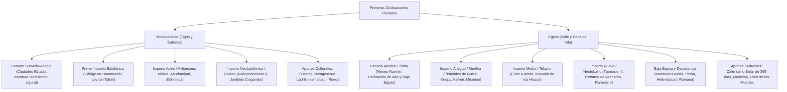

# TEMA 02: PRIMERAS CIVILIZACIONES DE LA ANTIGÜEDAD (MESOPOTAMIA Y EGIPTO)

---

## 1. FICHA TÉCNICA Y MATRIZ DE COMPETENCIAS

| Parámetro | Especificación Oficial UNSA / UNMSM / UNI |
| :--- | :--- |
| **Eje Curricular** | Eje 03: Ciencias Sociales / Historia Universal |
| **Nivel de Dificultad** | Nivel Intermedio-Avanzado (Análisis Geopolítico, Jurídico y Cultural) |
| **Ponderación UNSA** | Sociales: 1.584321000 pts \| Biomédicas: 0.942150000 pts \| Ingenierías: 0.812450000 pts |
| **Tiempo Estándar de Respuesta** | 1.5 a 2.0 minutos por reactivo DECO |
| **Prerrequisitos Cognitivos** | Revolución Urbana del Bronce, sociedades hidráulicas tributarias, teocracia y centralización política, paleografía básica (cuneiforme y jeroglífica). |
| **Competencia Cardinal** | Compara sincrónica y diacrónicamente los procesos de centralización sociopolítica, estratificación de clases, cosmovisión religiosa y aportes científicos de Mesopotamia y el Antiguo Egipto, reconociendo su impacto en el desarrollo del derecho y las instituciones contemporáneas. |

---

## 2. MAPA TAXONÓMICO Y ONTOLOGÍA



---

## 3. DESARROLLO TEÓRICO FORMAL

### 3.1. Las Sociedades Fluviales e Hidráulicas
Tanto Mesopotamia como Egipto fueron calificadas por Karl Wittfogel como **sociedades hidráulicas** o del **Modo de Producción Asiático (tributario)**. El control de las crecidas impredecibles (Tigris y Éufrates) o regulares (el Nilo) exigió una masiva movilización social colectiva y una administración centralizada y burocrática encabezada por reyes-sacerdotes (teocracias).

---

### 3.2. Mesopotamia: "Tierra entre dos ríos"
Ubicada en el valle aluvial regado por los ríos **Tigris y Éufrates** (actual Irak y Siria). Región abierta sin defensas geográficas naturales, lo que propició constantes invasiones de pueblos semitas, indoeuropeos y asiánicos.

```
+---------------------------------------------------------------------------------------------------+
|                              PERIODIZACIÓN HISTÓRICA DE MESOPOTAMIA                                |
+-----------------------------+-----------------------------+---------------------------------------+
| FASE HISTÓRICA              | HITOS Y GOBERNANTES         | CARACTERÍSTICAS / LOGROS CULTURALES   |
+-----------------------------+-----------------------------+---------------------------------------+
| 1. Sumerio-Acadio           | - Ciudades-Estado sumerias  | - Invención de la escritura cuneiforme|
|    (3500 - 2150 a.C.)       |   (Ur, Uruk, Kish, Lagash)  | - Construcción de templos Zigurats    |
|                             | - Sargón I de Acad          | - Primer imperio unificado de la      |
|                             |                             |   historia (Acadio)                   |
+-----------------------------+-----------------------------+---------------------------------------+
| 2. Primer Imperio Babilónico| - Hammurabi (1792-1750 a.C.)| - Unificación jurídica: Código de     |
|    (1800 - 1595 a.C.)       | - Invasión Hitita y Casita  |   Hammurabi (Ley del Talión)          |
|                             |                             | - Culto supremo al dios Marduk        |
+-----------------------------+-----------------------------+---------------------------------------+
| 3. Imperio Asirio           | - Tiglatpileser III         | - Ejército profesional sanguinario    |
|    (1350 - 612 a.C.)        | - Sargón II                 | - Armas de hierro y carros de guerra  |
|                             | - Senaquerib (Nínive)       | - Primera gran biblioteca del mundo   |
|                             | - Asurbanipal               |   antiguo (Asurbanipal en Nínive)     |
+-----------------------------+-----------------------------+---------------------------------------+
| 4. Segundo Imperio          | - Nabopolasar               | - Renacimiento comercial babilónico   |
|    Babilónico (Neobabilónico| - Nabucodonosor II          | - Cautiverio judío de Babilonia       |
|    612 - 539 a.C.)          |                             | - Jardines Colgantes y Puerta Ishtar  |
|                             |                             | - Conquista persa por Ciro el Grande  |
+-----------------------------+-----------------------------+---------------------------------------+
```

#### Aportes Científicos y Culturales de Mesopotamia:
1. **La Escritura Cuneiforme:** Surgida en Uruk ($\sim 3300\text{ a.C.}$) con fines contables en tablillas de arcilla blanda grabadas con estiletes en forma de cuña. Descifrada en el siglo XIX por **Henry Rawlinson** mediante la inscripción trilingüe de Behistún.
2. **El Código de Hammurabi:** Primer gran corpus legislativo unificado grabado en una estela de diorita negra. Sintetiza 282 artículos basados en la **Ley del Talión** (*"Ojo por ojo, diente por diente"*), aunque con marcada diferenciación según la casta social (hombres libres o *awilum*, dependientes o *mushkenum*, y esclavos o *wardum*).
3. **Astronomía y Matemáticas:**
   - Creación del **sistema sexagesimal** (división del círculo en $360^\circ$, la hora en $60$ minutos y el minuto en $60$ segundos).
   - Identificación de los 12 signos del Zodiaco y predicción de eclipses.
4. **Arquitectura y Arte:** Invención de la **bóveda**, el **arco** y la cúpula utilizando ladrillos de barro cocido y esmaltado (cerámica vidriada). Los **Zigurats** servían como observatorios astronómicos, centros de culto y silos graneros estatales.
5. **Literatura Épica:** El *Poema de Gilgamesh*, primera gran epopeya de la humanidad, que narra la búsqueda de la inmortalidad y relata el mito universal del Diluvio.

---

### 3.3. Egipto: "El Don del Nilo"
Civilización desarrollada en el extremo nororiental de África, aislada y protegida por los desiertos de Libia y Nubia, y el mar Rojo. Como afirmó el historiador griego Heródoto: *"Egipto es un don del Nilo"*, pues las crecidas anuales (julio-octubre) depositaban una capa de limo fertilizante o cieno (*kemet* o tierra negra) que posibilitaba hasta tres cosechas al año.

```
+---------------------------------------------------------------------------------------------------+
|                                 PERIODIZACIÓN HISTÓRICA DE EGIPTO                                 |
+-----------------------------+-----------------------------+---------------------------------------+
| PERIODO HISTÓRICO           | FARAONES / PERSONAJES CLAVE | ACONTECIMIENTOS TRASCENDENTALES       |
+-----------------------------+-----------------------------+---------------------------------------+
| 1. Periodo Tinita / Arcaico | - Menes (Narmer)            | - Unificación de los nomos del Alto y |
|    (3100 - 2686 a.C.)       |                             |   Bajo Egipto (Doble Corona Pschent)  |
|                             |                             | - Capital: Tinis                      |
+-----------------------------+-----------------------------+---------------------------------------+
| 2. Imperio Antiguo / Menfita| - Zoser (Imhotep: Saqqara)  | - Época de las grandes pirámides de   |
|    (2686 - 2181 a.C.)       | - Keops, Kefrén y Micerino  |   Guiza (IV Dinastía)                 |
|                             |                             | - Centralismo teocrático absoluto     |
|                             |                             | - Capital: Menfis                     |
+-----------------------------+-----------------------------+---------------------------------------+
| 3. Imperio Medio / Tebano   | - Mentuhotep II             | - Centralización con capital en Tebas |
|    (2055 - 1650 a.C.)       | - Amenemhat I               | - Culto nacional al dios Amón-Ra      |
|                             |                             | - Invasión extranjera de los HICSOS   |
|                             |                             |   (introducen el caballo y el hierro) |
+-----------------------------+-----------------------------+---------------------------------------+
| 4. Imperio Nuevo / Neotebano| - Amosis I (expulsa hicsos) | - Época de MÁXIMA EXPANSIÓN IMPERIAL: |
|    (1550 - 1069 a.C.)       | - Hatshepsut (reina-faraón) |   Tutmosis III llega hasta el Éufrates|
|                             | - Tutmosis III ("Napoleón") | - Cisma de Amarna: Akenatón instaura  |
|                             | - Akenatón (Amenofis IV)    |   el monoteísmo al dios solar Atón    |
|                             | - Tutankamón                | - Restauración politeísta (Tutankamón)|
|                             | - Ramsés II                 | - Batalla de Qadesh contra hititas y  |
|                             |                             |   firma del Tratado de Paz de Qadesh  |
+-----------------------------+-----------------------------+---------------------------------------+
| 5. Baja Época / Decadencia  | - Psamético I (Saíta)       | - Sucesivas invasiones imperiales:    |
|    (664 - 30 a.C.)          | - Cleopatra VII (Tolomeos)  |   Asirios (Asurbanipal), Persas       |
|                             |                             |   (Cambises II), Griegos (Alejandro)  |
|                             |                             |   y anexión romana (Octavio, Actium)  |
+-----------------------------+-----------------------------+---------------------------------------+
```

#### Cosmovisión, Religión y Funeraria Egipcia:
- **Politeísmo Zoomorfo:** Deidades híbridas con cuerpo humano y cabeza animal (Horus = halcón, Anubis = chacal, Hathor = vaca, Thot = ibis).
- **Culto a los Muertos y el Juicio de Osiris:** Creencia en la inmortalidad del alma (*Ka* y *Ba*). Para alcanzar los campos de Aaru, el difunto debía superar el **pesaje del corazón (*Psicostasis*)**, presidido por Osiris y Anubis, confrontando el corazón con la pluma de la verdad (*Maat*).
- **El Libro de los Muertos:** Fórmulas mágicas e instrucciones enterradas junto a la momia para sortear los peligros del inframundo (*Duat*).
- **Tipos de Arquitectura Funeraria:**
  - *Mastaba:* Tumba troncopiramidal para nobles del Imperio Antiguo.
  - *Pirámide:* Tumbas colosales escalonadas (Saqqara) o geométricas (Guiza).
  - *Hipogeo:* Tumbas excavadas subterráneamente en acantilados rocosos para evitar el saqueo (Valle de los Reyes y Valle de las Reinas, en Tebas).

#### Escritura y Ciencias Egipcias:
- **Tipos de Escritura:**
  1. *Jeroglífica:* Sagrada, monumental y pictográfica; plasmada en templos y pirámides. Descifrada en 1822 por **Jean-François Champollion** usando la **Piedra de Rosetta** (texto en jeroglífico, demótico y griego antiguo).
  2. *Hierática:* Cursiva simplificada empleada por sacerdotes y escribas sobre papiro.
  3. *Demótica:* Escritura popular y administrativa de uso cotidiano en el periodo tardío.
- **Ciencias:** Invención del **calendario solar de 365 días** (dividido en 12 meses de 30 días más 5 días epagómenos festivos), geometría para la delimitación predial y técnicas avanzadas de medicina y anatomía derivadas de la momificación.

---

## 4. CUADRO SINÓPTICO COMPARATIVO: MESOPOTAMIA VS. EGIPTO

$$\begin{array}{|l|l|l|}
\hline
\textbf{Criterio Comparativo} & \textbf{Mesopotamia} & \textbf{Antiguo Egipto} \\ \hline
\text{Eje Hidrográfico} & \text{Ríos Tigris y Éufrates (crecidas violentas)} & \text{Río Nilo (crecidas predecibles y regulares)} \\ \hline
\text{Geografía y Defensas} & \text{Llanura abierta (altamente vulnerable a invasiones)} & \text{Aislado por desiertos y mares (fronteras naturales)} \\ \hline
\text{Organización Política} & \text{Predominio de Ciudades-Estado independientes} & \text{Estado unificado centralizado desde el inicio} \\ \hline
\text{Carácter del Monarca} & \text{Rey como vicario o siervo del dios (Patesi/Ensi)} & \text{El Faraón es un dios viviente en la Tierra (Horus)} \\ \hline
\text{Material de Construcción} & \text{Adobe y ladrillo cocido esmaltado (carecían de piedra)} & \text{Piedra sillar, caliza y granito (arquitectura monumental)} \\ \hline
\text{Soporte de Escritura} & \text{Tablillas de arcilla blanda con estilete (Cuneiforme)} & \text{Papiro con tinta y paredes de roca (Jeroglífica)} \\ \hline
\text{Sistema Numérico} & \text{Sexagesimal (base 60)} & \text{Decimal (base 10)} \\ \hline
\text{Visión de Ultratumba} & \text{Pesimista (morada sombría de sombras, Polvo)} & \text{Optimista (inmortalidad gloriosa en el reino de Osiris)} \\ \hline
\end{array}$$

---

## 5. MNEMOTECNIAS DE COMBATE PREUNIVERSITARIO

### Mnemotecnia 1: "S-B-A-N" para Mesopotamia
Para recordar el orden de los imperios mesopotámicos:
- **S**: **S**umerio-Acadio (Sargón y cuneiforme).
- **B**: **B**abilónico (Hammurabi y su código).
- **A**: **A**sirio (Asurbanipal, crueldad bélica y Nínive).
- **N**: **N**eobabilónico (Nabucodonosor II y jardines colgantes).

### Mnemotecnia 2: "A-M-O-R" de los Grandes Faraones del Imperio Nuevo
- **A**: **A**kenatón (Monoteísmo al sol Atón).
- **M**: **M**áxima expansión con Tut**M**osis III.
- **O**: **O**sirificación restaurada por Tutankamón.
- **R**: **R**amsés II (Tratado de Qadesh y Abu Simbel).

---

## 6. TÉCNICAS Y ARTIFICIOS DE RESOLUCIÓN (HACKING PREUNIVERSITARIO)

### Hack 1: Desciframiento de las Escrituras Clave
- Piedra de **Behistún** (Persia) = Escritura **Cuneiforme** (Rawlinson).
- Piedra de **Rosetta** (Egipto) = Escritura **Jeroglífica** (Champollion).
*¡Nunca confundas los soportes!: Tablillas de barro = Mesopotamia; Papiro = Egipto.*

### Hack 2: Identificación del "Primer Tratado Internacional de la Historia"
Si el reactivo menciona: *primer acuerdo diplomático formal de paz y no agresión mutua de la antigüedad*, la respuesta es categórica: el **Tratado de Qadesh** (o Tratado de la Plata), suscrito entre el faraón **Ramsés II** de Egipto y el rey **Hattusili III** de los hititas ($\sim 1259\text{ a.C.}$).

---

## 7. ZONA DE TRAMPAS Y DISTRACTORES ("¡PELIGRO EXAMEN!")

> [!WARNING]
> **Trampa 1: El estatus divino del monarca**
> En Egipto el faraón **ERA** un dios encarnado (el dios Horus en vida y Osiris tras la muerte). En cambio, en Mesopotamia, el gobernante (Patesi, Ensi o Lugal) **NO** era un dios, sino el **vicario o representante terrenal** del dios protector de la ciudad (Shamash, Marduk o Enlil).

> [!CAUTION]
> **Trampa 2: La igualdad ante la Ley en el Código de Hammurabi**
> El Código de Hammurabi consagró la Ley del Talión (*"ojo por ojo"*), pero **NO fue una ley igualitaria ni democrática**. Las sanciones dependían estrictamente del estatus social de la víctima y del agresor: si un noble cegaba el ojo de un esclavo, solo pagaba la mitad del valor del esclavo; si cegaba el de otro noble, se le vaciaba el ojo propio.

> [!WARNING]
> **Trampa 3: Keops, Kefrén y Micerino NO pertenecen al Imperio Nuevo**
> Las tres grandes pirámides de Guiza se construyeron en el **Imperio Antiguo (Menfita)**, durante la IV Dinastía. En el Imperio Nuevo los faraones ya no construyeron pirámides, sino **hipogeos** (tumbas subterráneas) en el Valle de los Reyes.

---

## 8. APLICACIÓN AL MUNDO REAL Y CONTEXTO DECO

### Caso 1: La Huella del Sistema Sexagesimal en la Era Digital
Cuando miramos un reloj digital y contamos 60 segundos por minuto y 60 minutos por hora, o cuando un algoritmo de geolocalización GPS triangula coordenadas angulares dividiendo el ecuador en $360^\circ$, estamos utilizando de forma directa la aritmética babilónica formulada en las orillas del Éufrates hace más de 4000 años.

### Caso 2: El Derecho Positivo y la Publicidad de las Leyes
El principio de **seguridad jurídica** que rige el derecho moderno (las normas deben estar escritas, ser públicas e irrevocables al arbitrio subjetivo de los jueces) tiene su génesis en la colocación de la estela de Hammurabi en la plaza pública de Babilonia para que cualquier ciudadano alfabetizado pudiera conocer sus derechos y sanciones.

---

## 9. BANCO DE 5 EJERCICIOS RESUELTOS GRADUADOS

### Ejercicio 1 (Nivel 1 - Acceso Inmediato): Legislación Babilónica
**Enunciado (UNSA):** El Código de Hammurabi, promulgado durante el Primer Imperio Babilónico y grabado en una estela de diorita negra, representó uno de los primeros intentos sistemáticos por codificar el derecho. Su principio fundamental de penalización se basó en:
A) La presunción de inocencia absoluta del procesado.  
B) La Ley del Talión ("ojo por ojo, diente por diente").  
C) El perdón absoluto mediante compensaciones monetarias estatales.  
D) El arbitrio teocrático inapelable del sumo sacerdote de Marduk.  
E) La abolición de las castas y la igualdad jurídica de todos los súbditos.

**Solución paso a paso:**
1. El Código de Hammurabi rigió el Primer Imperio Babilónico y se fundamentó en la fórmula taliónica: retribución de un daño idéntico al infligido.
2. Dicho principio se expresaba bajo la consigna clásica de la Ley del Talión, aunque con distinciones jerárquicas según la condición social (hombres libres, siervos o esclavos).
**Respuesta:** **B) La Ley del Talión ("ojo por ojo, diente por diente")**.

---

### Ejercicio 2 (Nivel 2 - Intermedio Operativo): Periodización Egipcia
**Enunciado (UNMSM DECO):** Durante el desarrollo del Antiguo Egipto, el periodo conocido como Imperio Nuevo o Neotebano se destacó por profundas transformaciones militares, políticas y religiosas. Entre sus hitos más relevantes se encuentra la llamada "reforma monoteísta o amarniana", la cual fue liderada por:
A) Tutmosis III, quien impuso el culto exclusivo a Amón-Ra en toda Asia Menor.  
B) Ramsés II, tras expulsar a los asirios y firmar la paz con los persas.  
C) Amenofis IV (Akenatón), quien clausuró los templos tradicionales e instauró el culto exclusivo al dios solar Atón.  
D) Menes, al fundar la primera dinastía tras fusionar el Alto y el Bajo Egipto.  
E) Zoser, guiado por su arquitecto Imhotep en la necrópolis de Saqqara.

**Solución paso a paso:**
1. Hacia el 1350 a.C., el faraón Amenofis IV buscó restar el inmenso poder político y económico a los sacerdotes de Tebas (devotos de Amón).
2. Para ello cambió su nombre a **Akenatón** ("aquel que agrada a Atón"), trasladó la capital a Aketatón (Amarna) y proclamó a **Atón** (disco solar viviente) como deidad suprema única.
**Respuesta:** **C) Amenofis IV (Akenatón), quien clausuró los templos tradicionales e instauró el culto exclusivo al dios solar Atón.**

---

### Ejercicio 3 (Nivel 3 - Contexto DECO Avanzado): Función Social del Zigurat
**Enunciado (UNMSM DECO / UNSA):** En las ciudades-estado sumerias y babilónicas de la antigua Mesopotamia, el zigurat constituía la edificación arquitectónica más imponente. A diferencia de las pirámides egipcias, cuya finalidad era fundamentalmente funeraria, el zigurat cumplía una función múltiple, entre las cuales destacaba:
A) Servir exclusivamente como fortaleza militar de refugio en caso de invasiones nómades.  
B) Funcionar como templo religioso, observatorio astronómico y centro de recaudación y almacenamiento de granos administrado por la casta sacerdotal.  
C) Actuar como coliseo público para la celebración de espectáculos gladiatorios y sacrificios humanos masivos.  
D) Operar como mausoleo subterráneo inviolable para albergar los sarcófagos de los reyes acadios.  
E) Servir como residencia palaciega privada y exclusiva para los esclavos emancipados.

**Solución paso a paso:**
1. Los zigurats eran torres escalonadas construidas con ladrillos de adobe cocido.
2. En la cima se ubicaba el santuario de la divinidad tutelar de la ciudad, desde donde los sacerdotes observaban las estrellas y los planetas para diseñar el calendario agrícola.
3. Además, en sus terrazas y dependencias basales funcionaban los graneros y depósitos de tributos y excedentes de la economía teocrática mesopotámica.
**Respuesta:** **B) Funcionar como templo religioso, observatorio astronómico y centro de recaudación y almacenamiento de granos administrado por la casta sacerdotal.**

---

### Ejercicio 4 (Nivel 4 - Análisis Crítico / UNI CEPRE): Diplomacia y Geopolítica Antigua
**Enunciado (UNI):** En el año 1259 a.C., tras décadas de encarnizada disputa por el control de las ricas rutas comerciales de Siria y Canaán, el Imperio Egipcio y el Imperio Hitita libraron la célebre Batalla de Qadesh. La trascendencia histórica posterior de este enfrentamiento radicó en que:
A) Provocó la aniquilación demográfica total de la civilización hitita a manos de Ramsés II.  
B) Marcó la invención de la rueda y el carro de combate por parte de los faraones tebanos.  
C) Desembocó en la firma del Tratado de Qadesh, considerado el primer tratado formal de paz, no agresión y asistencia mutua documentado en la historia humana.  
D) Supuso la conquista y saqueo definitivo de Tebas por los Pueblos del Mar.  
E) Significó la anexión de Egipto al Imperio Persa Aqueménida como satrapía vasalla.

**Solución paso a paso:**
1. La batalla de Qadesh concluyó militarmente en un empate táctico entre las fuerzas de Ramsés II y Muwatalli II.
2. Años después, Ramsés II y el nuevo rey hitita Hattusili III rubricaron el **Tratado de Qadesh** (grabado en tablillas de plata y muros de Karnak).
3. Este acuerdo estipuló el cese de hostilidades, una alianza defensiva mutua ante terceros agresores y la repatriación recíproca de refugiados políticos.
**Respuesta:** **C) Desembocó en la firma del Tratado de Qadesh, considerado el primer tratado formal de paz, no agresión y asistencia mutua documentado en la historia humana.**

---

### Ejercicio 5 (Nivel 5 - Reto Titán / Examen de Excelencia): Epigrafía y Escritura
**Enunciado (Reto Historiográfico Élite):** El desciframiento científico de las escrituras de la Antigüedad durante el siglo XIX revolucionó el conocimiento del Cercano Oriente. Relacione correctamente el monumento epigráfico con el investigador responsable de su lectura y la civilización correspondiente:
I. Inscripción de Behistún  
II. Piedra de Rosetta  

a. Jean-François Champollion  
b. Henry Creswicke Rawlinson  

1. Escritura Cuneiforme (Persa antiguo, Elamita y Babilonio)  
2. Escritura Jeroglífica, Demótica y Griega antigua (Egipto)  

A) I-b-1, II-a-2  
B) I-a-2, II-b-1  
C) I-b-2, II-a-1  
D) I-a-1, II-b-2  
E) I-b-1, II-b-2  

**Solución paso a paso:**
1. La **Inscripción de Behistún** fue grabada en un acantilado por orden de Darío I de Persia en tres escrituras cuneiformes distintas (persa, elamita y babilónico). Fue descifrada por el diplomático y orientalista británico **Henry Rawlinson** (I - b - 1).
2. La **Piedra de Rosetta**, descubierta durante la expedición napoleónica en Egipto (1799), presentaba un decreto sacerdotal en jeroglífico, demótico y griego antiguo. Fue descifrada en 1822 por el filólogo francés **Jean-François Champollion** (II - a - 2).
**Respuesta:** **A) I-b-1, II-a-2**.

---

## 10. GLOSARIO DE 10 TÉRMINOS CLAVE

1. **Zigurat:** Torre escalonada y piramidal de adobe y ladrillo característica de Mesopotamia, utilizada como templo, observatorio y centro administrativo.
2. **Cuneiforme:** Sistema de escritura inventado por los sumerios cuyos trazos tienen forma de cuña o clavo hendidos sobre tabletas de arcilla húmeda.
3. **Patesi / Ensi:** Título del sumo sacerdote y gobernante supremo teocrático en las primeras ciudades-estado sumerias.
4. **Ley del Talión:** Principio penal retributivo premoderno que impone al agresor un castigo idéntico en gravedad al perjuicio causado (*lex talionis*).
5. **Kemet:** Término con el que los antiguos egipcios denominaban a su tierra natal ("la tierra negra"), en alusión al rico limo fertilizante dejado por las crecidas del Nilo.
6. **Hipogeo:** Recinto funerario monumental excavado en las laderas subterráneas de las montañas para proteger las tumbas faraónicas de la expoliación.
7. **Psicostasis:** Ritual mitológico del pesaje del alma en la balanza de Osiris para dictaminar si el difunto era digno de la vida eterna.
8. **Papiro:** Soporte vegetal flexible para la escritura obtenido a partir de la médula de la planta acuática *Cyperus papyrus*, típica de los pantanos del delta del Nilo.
9. **Monoteísmo Amarniano:** Cisma religioso promovido por el faraón Akenatón que prohibió el culto a los dioses tradicionales para venerar exclusivamente a Atón.
10. **Pschent:** Doble corona ceremonial portada por los faraones que simbolizaba la unión política del Alto Egipto (corona blanca mitrada) y del Bajo Egipto (corona roja plana).

---

## 11. BANCO DE FLASHCARDS (Q/A)

- **P:** ¿Quién fue el primer gobernante en lograr la unificación territorial de las ciudades sumerias fundando el primer imperio mesopotámico?
  - **R:** Sargón I de Acad (Imperio Acadio, $\sim 2334\text{ a.C.}$).
- **P:** ¿En qué consistía la Ley del Talión consagrada en el Código de Hammurabi?
  - **R:** En infligir al victimario un castigo equivalente al daño causado, mediado por la condición social de las partes.
- **P:** ¿Qué rey asirio fundó la célebre biblioteca de Nínive?
  - **R:** El rey Asurbanipal.
- **P:** ¿Quién fue el legendario artífice de la primera unificación del Alto y Bajo Egipto portando la corona Pschent?
  - **R:** Menes (también identificado como el rey Narmer).
- **P:** ¿En qué periodo de la historia egipcia se edificaron las pirámides de Guiza (Keops, Kefrén y Micerino)?
  - **R:** En el Imperio Antiguo o Menfita (IV Dinastía).
- **P:** ¿Qué pueblo extranjero invadió Egipto en el Imperio Medio introduciendo el carro de combate y los caballos?
  - **R:** Los Hicsos (pueblo pastor procedente del Cercano Oriente).
- **P:** ¿Cuál fue la capital fundada por Akenatón para consagrar la reforma monoteísta a Atón?
  - **R:** Aketatón (actual Tell el-Amarna).
- **P:** ¿Qué hallazgo arqueológico permitió a Jean-François Champollion descifrar la escritura jeroglífica egipcia?
  - **R:** La Piedra de Rosetta.

---

## 12. MOTOR DE GAMIFICACIÓN (JSON NATIVO PARA KOTLIN MULTIPLATFORM)

```json
{
  "subject_id": "HISTORIA_UNIVERSAL",
  "topic_id": "TEMA_02_PRIMERAS_CIVILIZACIONES_MESOPOTAMIA_EGIPTO",
  "title": "Primeras Civilizaciones: Mesopotamia y Egipto",
  "level": "Intermedio-Avanzado",
  "total_xp": 220,
  "skills": ["Mesopotamia y Derecho Babilónico", "Egipto Faraónico y Dinastías", "Arquitectura Funeraria", "Epigrafía Comparada"],
  "challenges": [
    {
      "id": "HIST_CIV_01",
      "type": "MULTIPLE_CHOICE",
      "question": "¿Cuál fue el aporte científico más representativo de la astronomía y matemática mesopotámica que aún estructura la medición del tiempo moderno?",
      "options": [
        "El sistema decimal y el cero",
        "El sistema sexagesimal de división temporal y angular (60 minutos, 360 grados)",
        "El calendario solar exacto de 365 días y un cuarto",
        "El cálculo trigonométrico diferencial"
      ],
      "correct_index": 1,
      "explanation": "Los astrónomos y matemáticos de Mesopotamia desarrollaron el sistema sexagesimal con base en el 60, dividiendo la hora en 60 minutos y la circunferencia en 360 grados.",
      "xp_reward": 50
    },
    {
      "id": "HIST_CIV_02",
      "type": "MULTIPLE_CHOICE",
      "question": "El célebre tratado diplomático suscrito entre el faraón Ramsés II y el rey hitita Hattusili III tras la batalla de Qadesh es relevante porque:",
      "options": [
        "Decretó la entrega incondicional de Egipto al imperio hitita",
        "Es el primer tratado internacional de paz y asistencia mutua documentado en la historia",
        "Instauró el monoteísmo en todo el Cercano Oriente",
        "Permitió a Egipto el monopolio exclusivo del hierro en el Mediterráneo"
      ],
      "correct_index": 1,
      "explanation": "El Tratado de Qadesh (o de la Plata) firmado hacia el 1259 a.C. es universalmente reconocido como el primer tratado formal de paz y no agresión mutua de la historia humana.",
      "xp_reward": 60
    },
    {
      "id": "HIST_CIV_03",
      "type": "BOSS_CHALLENGE",
      "question": "Identifique la correspondencia correcta entre gobernante antiguo y su obra emblemática:\nI. Hammurabi\nII. Asurbanipal\nIII. Menes\nIV. Akenatón\n\n1. Biblioteca real en Nínive con miles de tablillas cuneiformes\n2. Cisma monoteísta consagrado al disco solar Atón\n3. Primer código legal unificado con base en la Ley del Talión\n4. Unificación de los nomos del Alto y Bajo Egipto",
      "options": [
        "I-3, II-1, III-4, IV-2",
        "I-1, II-3, III-2, IV-4",
        "I-3, II-4, III-1, IV-2",
        "I-2, II-1, III-4, IV-3"
      ],
      "correct_index": 0,
      "explanation": "Hammurabi promulgó el código del talión (I-3); Asurbanipal fundó la biblioteca de Nínive (II-1); Menes unificó Egipto con la doble corona (III-4); Akenatón implantó la reforma de Atón (IV-2).",
      "xp_reward": 110
    }
  ]
}
```
