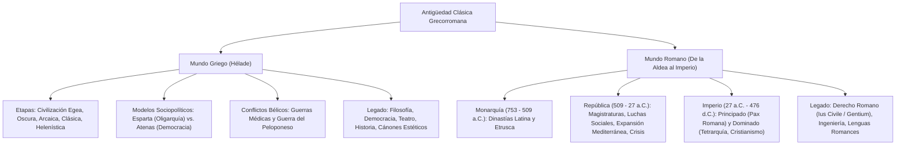

# TEMA 03: ANTIGÜEDAD CLÁSICA (GRECIA Y ROMA)

---

## 1. FICHA TÉCNICA Y MATRIZ DE COMPETENCIAS

| Parámetro | Especificación Oficial UNSA / UNMSM / UNI |
| :--- | :--- |
| **Eje Curricular** | Eje 03: Ciencias Sociales / Historia Universal |
| **Nivel de Dificultad** | Nivel Avanzado - Alta Densidad Conceptual y Análisis Institucional |
| **Ponderación UNSA** | Sociales: 1.584321000 pts \| Biomédicas: 0.942150000 pts \| Ingenierías: 0.812450000 pts |
| **Tiempo Estándar de Respuesta** | 1.5 a 2.0 minutos por reactivo DECO |
| **Prerrequisitos Cognitivos** | Concepto de polis y ciudadanía, instituciones republicanas, evolución jurídica (de la costumbre a la ley escrita), expansión mediterránea y sincretismo helenístico-romano. |
| **Competencia Cardinal** | Evalúa rigurosamente los modelos políticos de Esparta y Atenas, la transición republicana e imperial romana, y pondera el legado clásico de la democracia directa, el Derecho Romano, la filosofía y la ingeniería en la conformación de la civilización occidental moderna. |

---

## 2. MAPA TAXONÓMICO Y ONTOLOGÍA



---

## 3. DESARROLLO TEÓRICO FORMAL

### 3.1. Grecia Antigua: La Matriz Democrática y Cultural de Occidente
El espacio geográfico griego (la Hélade) abarcó el sur de la península Balcánica, las islas del mar Egeo y las costas de Asia Menor (Jonia). Su relieve montuoso y fragmentado impidió la formación de un Estado unificado centralizado, propiciando el desarrollo de ciudades-estado independientes (**Polis**).

#### A. Periodización Histórica de Grecia:
1. **Civilización Egea (3000 - 1150 a.C.):**
   - *Minoica o Cretense:* Capital Cnosos. **Talasocracia** (dominio marítimo pacífico). Escritura Lineal A (no descifrada). El mito del Minotauro y el palacio laberíntico.
   - *Micénica:* Fundada por los aqueos en el Peloponeso. Ciudades fortificadas (Micenas, Tirinto). Guerra de Troya. Escritura **Lineal B** (forma arcaica de griego, descifrada por Michael Ventris).
2. **Época Oscura (1150 - 800 a.C.):** Invasión de pueblos indoeuropeos (dorios con armas de hierro, jonios y eolios). Colapso del mundo micénico y retroceso cultural.
3. **Época Arcaica (800 - 500 a.C.):** Consolidación de la Polis. Sobrepoblación y escasez de tierras que motivaron la **gran colonización griega** por el mar Mediterráneo y el mar Negro (fundación de colonias o *apoikias*, como Bizancio, Siracusa, Massalia). Reaparición de la escritura con el alfabeto fenicio adaptado.
4. **Época Clásica (500 - 323 a.C.):** Apogeo de Atenas y Esparta.
   - **Guerras Médicas (492 - 449 a.C.):** Enfrentamiento entre las polis griegas y el Imperio Persa (Aqueménida). Victorias atenienses en Maratón (Milcíades) y Salamina (Temístocles), y coaligada en Platea. Culmina con la **Paz de Calias** (los persas reconocen la autonomía griega en el Egeo).
   - **Siglo de Pericles:** Época dorada de Atenas. Reconstrucción de la Acrópolis (el Partenón, bajo supervisión de Fidias). Instauración de la **mistoforia** (pago a los ciudadanos por ejercer cargos públicos, garantizando el acceso real de las clases humildes al poder).
   - **Guerra del Peloponeso (431 - 404 a.C.):** Enfrentamiento civil hegemónico entre la **Liga de Delos** (Atenas, marítima y democrática) y la **Liga del Peloponeso** (Esparta, terrestre y oligárquica). Culmina con la victoria espartana, la instauración de la tiranía de los Treinta Tiranos y la decadencia general de las polis.
5. **Época Helenística (323 - 30 a.C.):** Filipo II de Macedonia somete a las polis (Batalla de Queronea, 338 a.C.). Su hijo **Alejandro Magno** forja un imperio colosal desde Grecia hasta el río Indo en la India. Tras su muerte, surge el **helenismo**: fusión sincretista de la cultura clásica griega con las tradiciones de Oriente Próximo.

---

### 3.2. Esparta y Atenas: Modelos Sociopolíticos Antagónicos

```
+---------------------------------------------------------------------------------------------------+
|                            COMPARATIVA INSTITUCIONAL: ESPARTA VS. ATENAS                           |
+-----------------------------+-----------------------------+---------------------------------------+
| CRITERIO                    | ESPARTA (Lacedemonia)       | ATENAS (Ática)                        |
+-----------------------------+-----------------------------+---------------------------------------+
| Origen Étnico               | Dorios invasores            | Jonios autóctonos                     |
| Vocación Geopolítica        | Militarista continental     | Marítima, mercantil y cosmopolita     |
| Legislador Fundamental      | Licurgo (La Gran Retra)     | Dracón, Solón, Clístenes, Pericles    |
+-----------------------------+-----------------------------+---------------------------------------+
| Estructura Social           | 1. Espartiatas u Homoioi    | 1. Ciudadanos (varones atenienses)    |
|                             |    (ciudadanos guerreros)   | 2. Metecos (extranjeros libres)       |
|                             | 2. Periecos (libres sin     | 3. Esclavos (mercancías humanas sin   |
|                             |    derechos políticos)      |    derecho civil)                     |
|                             | 3. Ilotas (siervos del      |                                       |
|                             |    Estado, atados a tierra) |                                       |
+-----------------------------+-----------------------------+---------------------------------------+
| Órganos de Gobierno         | - Diarquía (dos reyes)      | - Ekklesía (asamblea soberana de      |
|                             | - Éforos (5 magistrados)    |   todos los ciudadanos)               |
|                             | - Gerusía (consejo de 28    | - Bulé (consejo de los 500)           |
|                             |   ancianos de +60 años)     | - Heliea (tribunal popular)           |
|                             | - Apella (asamblea popular) | - Estrategas (10 jefes militares)     |
+-----------------------------+-----------------------------+---------------------------------------+
| Régimen Político            | Oligarquía aristocrática    | Democracia directa (isegoría e        |
|                             | y totalitaria               | isonomía)                             |
+-----------------------------+-----------------------------+---------------------------------------+
```

#### Evolución Histórica de la Democracia Ateniense:
1. **Dracón (621 a.C.):** Primer código de leyes escritas, caracterizado por su severidad implacable ("leyes draconianas"), buscando frenar la venganza privada entre clanes nobles (eupátridas).
2. **Solón (594 a.C.):** Abolió la esclavitud por deudas (*seisajtheia*), liberó a los siervos de la tierra (*hectemoroi*) e instauró una **timocracia** o plutocracia (división censitaria en 4 clases según la renta anual agrícola: pentacosiomedimnos, hippeis, zeugitas y thetes). Creó el Consejo de la Bulé de los 400 y el Tribunal de la Heliea.
3. **Pisístrato (561 - 527 a.C.):** Tirano que impulsó la agricultura campesina con créditos estatales, fomentó las obras públicas y fijó por escrito las epopeyas homéricas (*Ilíada* y *Odisea*).
4. **Clístenes (508 a.C.):** Considerado el **Padre de la Democracia**. Desarticuló el poder de los clanes aristocráticos al reorganizar el Ática en **10 tribus territoriales** (combinando demos de la costa, el interior y la ciudad). Creó la Bulé de los 500 y el **ostracismo** (destierro político por 10 años mediante votación popular en trozos de cerámica u *ostraka* para neutralizar a quienes conspiraban contra la democracia).
5. **Pericles (461 - 429 a.C.):** Consolidó el sistema democrático al implementar la **mistoforia** (estipendio o sueldo para los jurados y magistrados populares), garantizando que la pobreza no fuera obstáculo para gobernar.

---

### 3.3. Roma Antigua: Monarquía, República e Imperio

#### A. La Monarquía Romana (753 - 509 a.C.)
Fundada legendariamente por Rómulo y Remo a orillas del río Tíber. Dividida en dos periodos dinásticos:
- **Dinastía Latina (Agrícola y Religiosa):** Rómulo (creador del Senado), Numa Pompilio (organizador de la religión y el calendario de 12 meses), Tulio Hostilio (conquista de Alba Longa) y Anco Marcio (fundación del puerto de Ostia).
- **Dinastía Etrusca (Comercial y Urbana):** Tarquino el Antiguo (construcción de la Cloaca Máxima y el Circo Máximo), Servio Tulio (reforma censitaria militar y muralla serviana) y Tarquino el Soberbio (tirano despótico derrocado en 509 a.C. tras el ultraje y suicidio de Lucrecia).

#### B. La República Romana (509 - 27 a.C.)
Régimen oligárquico aristocrático donde el poder ejecutivo fue depositado en magistraturas colegiadas y electivas.

```
+---------------------------------------------------------------------------------------+
|                         ESTRUCTURA INSTITUCIONAL DE LA REPÚBLICA                      |
+-------------------+-------------------------------------------------------------------+
| ÓRGANO            | FUNCIONES Y CARACTERÍSTICAS                                       |
+-------------------+-------------------------------------------------------------------+
| 1. El Senado      | Órgano supremo tutelar de patricios vitalicios (300 senadores).   |
|                   | Dirigía la política exterior, el tesoro y aprobaba las leyes.     |
| 2. Magistraturas  | Colegiadas, temporales (1 año), electivas y gratuitas (ad honorem)|
|    - Cónsules     | Dos magistrados supremos con poder militar (*imperium*) y civil.  |
|    - Pretores     | Administraban justicia civil y militar.                           |
|    - Censores     | Elaboraban el censo cada 5 años y velaban por la moral pública.   |
|    - Ediles       | Seguridad ciudadana, abasto de granos y juegos públicos.          |
|    - Cuestores    | Recaudación fiscal, contabilidad pública y administración aduanera|
|    - Tribunos de  | Defensores de la plebe; portaban el derecho a veto (*veto/        |
|      la Plebe     | intercessio*) y gozaban de inmunidad sacrosanta inviolable.       |
| 3. Asambleas o    | Curiados (asuntos religiosos), Centuriados (militares, eligen     |
|    Comicios       | cónsules), Tributos (eligen ediles y tribunos de la plebe).       |
+-------------------+-------------------------------------------------------------------+
```

#### Las Conquistas Plebeyas (Lucha Patricio-Plebeya):
1. **Secesión del Monte Sacro (494 a.C.):** Huelga militar plebeya que forzó la creación del **Tribunado de la Plebe** y los Comicios de la Plebe.
2. **Ley de las Doce Tablas (450 a.C.):** Primer código legislativo escrito romano redactado por los decenviros; consagró la igualdad procesal civil.
3. **Ley Canuleya (445 a.C.):** Autorizó el matrimonio mixto legal entre patricios y plebeyos (*conubium*).
4. **Leyes Licinias-Sextias (367 a.C.):** Estableció que uno de los dos cónsules anuales debía ser obligatoriamente plebeyo y reguló la tenencia máxima de tierras públicas (*ager publicus*).
5. **Ley Ogulnia (300 a.C.):** Acceso plebeyo a los colegios sacerdotales (pontífices y augures).
6. **Ley Hortensia (287 a.C.):** Otorgó a los **Plebiscitos** (acuerdos de los comicios populares plebeyos) fuerza de ley general vinculante para toda Roma.

#### La Expansión Mediterránea y las Guerras Púnicas (264 - 146 a.C.):
- Enfrentamiento entre Roma y **Cartago** por el control económico y marítimo del Mediterráneo occidental:
  - *Primera Guerra Púnica:* Roma arrebata a Cartago el dominio de Sicilia, Córcega y Cerdeña.
  - *Segunda Guerra Púnica:* Gran campaña militar de **Aníbal Barca**, quien cruzó los Alpes con elefantes e infligió a Roma la humillante masacre de **Cannas** (216 a.C.). Roma reacciona bajo el mando de **Publio Cornelio Escipión "el Africano"**, derrotando a Aníbal en la **Batalla de Zama** (202 a.C.).
  - *Tercera Guerra Púnica:* Destrucción total y siembra de sal en Cartago por Escipión Emiliano (146 a.C.).
- Consecuencias: Roma se convierte en dueña absoluta del Mediterráneo (*Mare Nostrum*), pero el influjo masivo de prisioneros esclavos arruinó a los campesinos plebeyos, concentrando la propiedad en **latifundios** aristocráticos.

#### Crisis y Colapso de la República:
- **Reformas agrarias de los Hermanos Graco (133 - 121 a.C.):** Tiberio Graco (ley de reparto de tierras públicas a los desposeídos) y Cayo Graco (ley frumentaria de subsidio del trigo) fueron violentamente asesinados por la oligarquía senatorial.
- **Guerras Civiles:** Enfrentamiento fratricida entre facciones políticas:
  - *Mario (populares, reforma militar y profesionalización del ejército) vs. Sila (optimates / aristocráticos; dictadura y proscripciones).*
- **Primer Triunvirato (60 a.C.):** Alianza privada extralegal entre **Julio César, Pompeyo Magno y Marco Licinio Craso**. Tras la muerte de Craso en Carras contra los partos, César cruza el río Rubicón (*Alea iacta est*), derrota a Pompeyo en Farsalia y asume la dictadura perpetua, hasta ser asesinado en los Idus de Marzo (44 a.C.) por Bruto y Casio.
- **Segundo Triunvirato (43 a.C.):** Magistratura legal ratificada por el Senado entre **Octavio, Marco Antonio y Lépido**. Tras vencer a los asesinos de César en Filipos, Octavio derrota a la flota de Marco Antonio y Cleopatra VII en la **Batalla de Actium** (31 a.C.), proclamando el fin de la República.

---

### 3.4. El Imperio Romano (27 a.C. - 476 d.C.)

#### A. El Alto Imperio o Principado (27 a.C. - 284 d.C.):
- **Octavio Augusto (27 a.C. - 14 d.C.):** Primer emperador (*Princeps*, *Imperator*, *Augustus*). Inauguró la **Pax Romana**, pacificación interna y florecimiento cultural (Siglo de Augusto: Virgilio, Horacio, Tito Livio; mecenazgo cultural promovido por Cayo Mecenas).
- **Dinastías Principales:**
  - *Julio-Claudia:* Tiberio (muerte de Jesús), Calígula (demencia cortesana), Claudio (conquista de Britania) y Nerón (incendio de Roma y primera persecución a cristianos).
  - *Flavia:* Vespasiano, Tito (erupción del Vesubio que destruyó Pompeya y toma de Jerusalén con la Diáspora judía en el 70 d.C.) y edificación del **Coliseo Romano**.
  - *Antoninos (Siglo de Oro de Roma):* Trajano (llevó al Imperio a su **máxima extensión territorial**, desde Escocia hasta Mesopotamia), Adriano (Muro de Adriano en Britania y codificación jurídica por Salvio Juliano) y Marco Aurelio (emperador filósofo estoico).
  - *Severos:* Caracalla promulgó en 212 d.C. el **Edicto de Caracalla** (o *Constitutio Antoniniana*), concediendo la **ciudadanía romana a todos los hombres libres del Imperio** con fines recaudatorios fiscales y de reclutamiento.

#### B. El Bajo Imperio o Dominado (284 - 476 d.C.):
- **Diocleciano (284 - 305 d.C.):** Superó la crisis del siglo III y el anarquismo militar instaurando la **Tetrarquía** (división del gobierno entre dos emperadores mayores o *Augustos* y dos menores o *Césares*). Desató la más sanguinaria persecución sistemática contra los cristianos.
- **Constantino I el Grande (306 - 337 d.C.):**
  - Promulgó el **Edicto de Milán (313 d.C.)**, decretando la **tolerancia religiosa y libertad de culto** para el cristianismo.
  - Convocó el Concilio de Nicea (325 d.C.) para combatir la herejía arriana.
  - Fundó una nueva capital imperial estratégica: **Constantinopla** (antigua Bizancio) en el año 330 d.C.
- **Teodosio I el Grande (379 - 395 d.C.):**
  - Promulgó el **Edicto de Tesalónica (380 d.C.)**, proclamando al cristianismo niceno como la **religión oficial y obligatoria del Imperio Romano**.
  - A su muerte en 395 d.C., dividió formal e irrevocablemente el Imperio entre sus dos hijos:
    - **Imperio Romano de Occidente:** Capital en Milán/Rávena, entregado a **Honorio**.
    - **Imperio Romano de Oriente:** Capital en Constantinopla, entregado a **Arcadio**.

#### C. La Caída del Imperio Romano de Occidente (476 d.C.):
Las incursiones masivas de los pueblos bárbaros germanos (visigodos saquean Roma en 410 con Alarico; vándalos la saquean en 455 con Genserico) colapsaron la precaria economía occidental. En el año **476 d.C.**, el caudillo de los hérulos, **Odoacro**, derroca al último emperador títere de Occidente, el infante **Rómulo Augústulo**, enviando las insignias imperiales a Constantinopla. Este hito marca el fin de la Edad Antigua y el inicio de la Edad Media.

---

## 4. CUADRO COMPARATIVO DEL DERECHO Y LAS INSTITUCIONES

$$\begin{array}{|l|l|l|l|}
\hline
\textbf{Norma / Hito} & \textbf{Cronología} & \textbf{Autor / Impulsor} & \textbf{Efecto Sociopolítico Trascendental} \\ \hline
\text{Reforma de Clístenes} & 508\text{ a.C.} & \text{Clístenes (Atenas)} & \text{Democracia: 10 tribus y ostracismo protector} \\ \hline
\text{Mistoforia de Pericles} & 450\text{ a.C.} & \text{Pericles (Atenas)} & \text{Sueldo público para la participación política del pobre} \\ \hline
\text{Ley de las XII Tablas} & 450\text{ a.C.} & \text{Decenviros (Roma)} & \text{Fin del monopolio judicial patricio consuetudinario} \\ \hline
\text{Ley Canuleya} & 445\text{ a.C.} & \text{Cayo Canuleyo (Roma)} & \text{Matrimonio civil mixto patricio-plebeyo} \\ \hline
\text{Ley Hortensia} & 287\text{ a.C.} & \text{Quinto Hortensio (Roma)} & \text{Plebiscitos tienen valor de ley vinculante general} \\ \hline
\text{Edicto de Caracalla} & 212\text{ d.C.} & \text{Caracalla (Roma)} & \text{Ciudadanía universal a todos los hombres libres del imperio} \\ \hline
\text{Edicto de Milán} & 313\text{ d.C.} & \text{Constantino (Roma)} & \text{Libertad de cultos y cese de persecución cristiana} \\ \hline
\text{Edicto de Tesalónica} & 380\text{ d.C.} & \text{Teodosio (Roma)} & \text{Cristianismo como religión oficial única del Estado} \\ \hline
\end{array}$$

---

## 5. MNEMOTECNIAS DE COMBATE PREUNIVERSITARIO

### Mnemotecnia 1: "DRA-SO-CLI-PE" para la Evolución Ateniense
- **DRA**: **Dra**cón (Leyes sangrientas escritas).
- **SO**: **So**lón (Abolió esclavitud por deudas y timocracia).
- **CLI**: **Clí**stenes (Padre de la democracia y ostracismo).
- **PE**: **Pe**ricles (Mistoforia y siglo de oro cultural).

### Mnemotecnia 2: "CA-VE-TE" para los Tres Edictos Religiosos de Roma
- **CA**: **Ca**racalla (Edicto del 212: **C**iudadanía para todos).
- **MI**: **Mi**lán (Edicto del 313: **M**itigación y libertad de culto cristiano).
- **TE**: **Te**salónica (Edicto del 380: **T**odos al cristianismo oficial).

---

## 6. TÉCNICAS Y ARTIFICIOS DE RESOLUCIÓN (HACKING PREUNIVERSITARIO)

### Hack 1: Distinción entre Guerras Médicas y Guerra del Peloponeso
- Si el choque es **Griegos vs. Persas** (bárbaros orientales) $\implies$ **Guerras Médicas** (Victoria griega, salva la democracia naciente).
- Si el choque es **Griegos vs. Griegos** (Atenas vs. Esparta) $\implies$ **Guerra del Peloponeso** (Hegemonía espartana, suicidio militar de las polis).

### Hack 2: La Causa Real del Edicto de Caracalla
Si te preguntan por qué Caracalla otorgó la ciudadanía romana en el 212 d.C., descarta inmediatamente las opciones moralistas o filantrópicas ("amor a la igualdad humana"). La motivación real de Caracalla fue **fiscal y militar**: los ciudadanos romanos pagaban impuestos especiales sobre herencias y manumisiones y podían ser reclutados directamente en las legiones.

---

## 7. ZONA DE TRAMPAS Y DISTRACTORES ("¡PELIGRO EXAMEN!")

> [!WARNING]
> **Trampa 1: El significado del Ostracismo**
> El ostracismo ateniense **NO era una pena penal por cometer delitos comunes** (asesinato o robo), sino una **medida preventiva puramente política**. Al desterrado no se le confiscaban sus bienes ni perdía sus derechos de propiedad; simplemente se le alejaba del Ática durante 10 años para neutralizar su excesiva popularidad o ambición de tiranía.

> [!CAUTION]
> **Trampa 2: La "Democracia" ateniense no incluía a la mayoría**
> En la Atenas de Pericles solo participaban en el gobierno los **ciudadanos varones mayores de edad**. Quedaban totalmente excluidos de los derechos políticos: las **mujeres**, los **metecos** (extranjeros) y los **esclavos** (que constituían cerca del $60\%$ de la población total).

> [!WARNING]
> **Trampa 3: Edicto de Milán vs. Edicto de Tesalónica**
> Gran distractor recurrente: Constantino decretó la **tolerancia religiosa** (Edicto de Milán, 313 d.C.), permitiendo al cristianismo existir sin persecución. Quien convirtió al cristianismo en la **religión oficial única y obligatoria** persiguiendo el paganismo fue **Teodosio** (Edicto de Tesalónica, 380 d.C.).

---

## 8. APLICACIÓN AL MUNDO REAL Y CONTEXTO DECO

### Caso 1: Los Pilares del Constitucionalismo y el Veto Presidencial
La figura moderna del **veto presidencial** consagrado en las constituciones republicanas contemporáneas deriva del poder de *intercessio* de los Tribunos de la Plebe romanos, quienes al pronunciar la palabra latina *"Veto"* ("prohíbo") paralizaban instantáneamente la ejecución de una ley senatorial lesiva para los derechos del pueblo llano.

### Caso 2: El Juicio por Jurados y la Participación Ciudadana
El tribunal ateniense de la **Heliea**, integrado por 6000 ciudadanos sorteados anualmente que deliberaban y votaban en masa de forma secreta mediante fichas de bronce sobre la culpabilidad o inocencia de sus pares, es el antecedente histórico directo del sistema anglosajón y penal acusatorio de juicio por jurados populares vigente en el mundo democrático.

---

## 9. BANCO DE 5 EJERCICIOS RESUELTOS GRADUADOS

### Ejercicio 1 (Nivel 1 - Acceso Inmediato): Legislación de Solón
**Enunciado (UNSA):** En la antigua Atenas, las agudas contradicciones sociales entre la aristocracia eupátrida y los campesinos endeudados amenazaban con una sangrienta guerra civil. Para solucionar esta crisis, el arconte Solón implementó la llamada *seisajtheia*, consistente fundamentalmente en:
A) La ejecución sumaria de todos los terratenientes nobles.  
B) La abolición de las deudas campesinas y la supresión de la esclavitud por deudas.  
C) La prohibición de las naves comerciales en el puerto del Pireo.  
D) El reparto obligatorio de las riquezas de los metecos extranjeros.  
E) La instauración de la monarquía vitalicia hereditaria.

**Solución paso a paso:**
1. Solón fue nombrado árbitro y legislador en el 594 a.C.
2. Su medida social cumbre fue la *seisajtheia* o "descarga de fardos", mediante la cual canceló las deudas hipotecarias agrarias.
3. Prohibió de forma perpetua que una persona libre pudiera empeñar su propio cuerpo o el de sus familiares como garantía de pago financiero.
**Respuesta:** **B) La abolición de las deudas campesinas y la supresión de la esclavitud por deudas.**

---

### Ejercicio 2 (Nivel 2 - Intermedio Operativo): Instituciones Políticas Romanas
**Enunciado (UNMSM DECO):** Durante la República Romana, las tensiones entre patricios y plebeyos desembocaron en la creación de magistraturas específicas para garantizar la defensa de las libertades populares. Aquella magistratura cuyos titulares gozaban de sacrosantidad inviolable y poseían el derecho de oponerse mediante el veto a las resoluciones del Senado se denominaba:
A) Cuestura  
B) Tribunado de la Plebe  
C) Censura  
D) Consulado  
E) Pretura

**Solución paso a paso:**
1. Tras la rebelión del Monte Sacro (494 a.C.), los plebeyos conquistaron el derecho a elegir a sus propios representantes protectores.
2. Estos eran los **Tribunos de la Plebe**, cuya persona era sagrada e inviolable (*sacrosanctitas*).
3. Disponían del poder del *veto* para frenar mandatos dictatoriales o leyes aristocráticas contrarias a los intereses de la masa plebeya.
**Respuesta:** **B) Tribunado de la Plebe.**

---

### Ejercicio 3 (Nivel 3 - Contexto DECO Avanzado): Guerras Púnicas y Transformación Agraria
**Enunciado (UNMSM DECO / UNSA):** La victoria de Roma sobre Cartago en las Guerras Púnicas otorgó a la República el dominio indiscutible del Mediterráneo (*Mare Nostrum*). Sin embargo, al interior de la sociedad romana, este triunfo desencadenó una profunda crisis socioeconómica que se manifestó en:
A) La liquidación total de la esclavitud en todo el territorio itálico.  
B) La ruina masiva del campesinado plebeyo y la concentración de tierras en latifundios trabajados por prisioneros de guerra esclavizados.  
C) El retorno inmediato a la monarquía teocrática etrusca.  
D) La desmilitarización absoluta del ejército romano y el abandono de las calzadas.  
E) La pérdida definitiva de los derechos políticos conquistados por los plebeyos.

**Solución paso a paso:**
1. Los campesinos romanos debieron servir en legiones ultramarinas durante años, abandonando sus parcelas agrícolas.
2. Al retornar, sus campos estaban devastados y no podían competir contra la producción de grano barato y mano de obra esclava masiva traída de las conquistas.
3. Los senadores y patricios acapararon las tierras formando gigantescos **latifundios**, forzando al campesinado arruinado a migrar como proletariado urbano desocupado hacia Roma.
**Respuesta:** **B) La ruina masiva del campesinado plebeyo y la concentración de tierras en latifundios trabajados por prisioneros de guerra esclavizados.**

---

### Ejercicio 4 (Nivel 4 - Análisis Crítico / UNI CEPRE): El Cristianismo y el Estado Romano
**Enunciado (UNI):** Durante el Bajo Imperio Romano, la relación entre el poder estatal imperial y la creciente comunidad cristiana experimentó un cambio radical a lo largo del siglo IV d.C. Identifique la alternativa que describe correctamente la secuencia y contenido jurídico de dicho proceso:
A) Constantino decretó el cristianismo como religión oficial única en Tesalónica y Teodosio proclamó la libertad de culto en Milán.  
B) Diocleciano adoptó el cristianismo como ideología de la Tetrarquía y Constantino restauró el culto a Júpiter.  
C) Constantino garantizó la tolerancia y el cese de persecuciones mediante el Edicto de Milán (313 d.C.), mientras que Teodosio lo consagró como la religión oficial exclusiva a través del Edicto de Tesalónica (380 d.C.).  
D) Trajano persiguió el culto en Nicea y Caracalla concedió el sacerdocio a todos los cristianos bautizados.  
E) Rómulo Augústulo abolió el cristianismo antes de entregar el poder al caudillo Odoacro.

**Solución paso a paso:**
1. En el 313 d.C., Constantino promulgó el **Edicto de Milán**, concediendo la libertad de culto en todo el imperio.
2. Décadas más tarde, en el 380 d.C., el emperador hispano Teodosio I promulgó el **Edicto de Tesalónica**, clausurando los cultos paganos y convirtiendo formalmente al cristianismo católico niceno en la fe oficial del Imperio.
**Respuesta:** **C) Constantino garantizó la tolerancia y el cese de persecuciones mediante el Edicto de Milán (313 d.C.), mientras que Teodosio lo consagró como la religión oficial exclusiva a través del Edicto de Tesalónica (380 d.C.).**

---

### Ejercicio 5 (Nivel 5 - Reto Titán / Examen de Excelencia): Epigrafía Constitucional Clásica
**Enunciado (Reto Historiográfico Élite):** Determine la veracidad ($V$) o falsedad ($F$) de las siguientes proposiciones sobre la civilización clásica:
I. El ostracismo ateniense era dictaminado por los jueces del Areópago con confiscación irrevocable de bienes para el ciudadano condenado.  
II. La Ley de las Doce Tablas significó la consagración de la igualdad formal ante la ley civil escrita para patricios y plebeyos, aunque aún prohibía el matrimonio mixto entre ambos estamentos.  
III. La Paz de Calias puso fin a la Guerra del Peloponeso reconociendo la victoria marítima de Esparta sobre los atenienses.  
IV. La batalla de Actium (31 a.C.) consolidó el ascenso político de Octavio y significó el inicio formal de la transición hacia el régimen imperial romano.

A) F - V - F - V  
B) V - V - F - F  
C) F - F - V - V  
D) V - F - V - F  
E) F - V - V - F  

**Solución paso a paso:**
- **Afirmación I (FALSA):** El ostracismo era votado democráticamente por la **Ekklesía** en la plaza pública sobre trozos de barro (*ostrakon*), y **no** conllevaba la confiscación de tierras ni pérdida de patrimonio, sino únicamente el alejamiento geográfico por diez años.
- **Afirmación II (VERDADERA):** La Ley de las XII Tablas (450 a.C.) fijó el derecho por escrito garantizando certeza procesal, pero la Tabla XI ratificaba expresamente la prohibición del matrimonio mixto entre patricios y plebeyos (dicha prohibición recién cayó 5 años después con la Ley Canuleya).
- **Afirmación III (FALSA):** La Paz de Calias (449 a.C.) puso fin a las **Guerras Médicas** entre griegos y persas, no a la Guerra del Peloponeso (esta terminó con la toma de Atenas por Lisandro en 404 a.C.).
- **Afirmación IV (VERDADERA):** La victoria naval de Octavio y Agripa en Actium frente a Marco Antonio y Cleopatra liquidó el último vestigio de la República e inauguró el Principado de Augusto.
- Secuencia: $F - V - F - V$.
**Respuesta:** **A) F - V - F - V**.

---

## 10. GLOSARIO DE 10 TÉRMINOS CLAVE

1. **Polis:** Ciudad-estado independiente de la antigua Grecia compuesta por un núcleo urbano (*asty*) y su territorio agrícola circundante (*chora*).
2. **Ostracismo:** Mecanismo institucional ateniense consistente en el destierro político preventivo por diez años para conjurar el peligro de una tiranía.
3. **Mistoforia:** Remuneración económica o dieta diaria creada por Pericles para compensar a los ciudadanos atenienses por el ejercicio de funciones públicas.
4. **Homoioi:** Denominación dada a los espartiatas o ciudadanos de pleno derecho ("los iguales"), dedicados con exclusividad a la instrucción militar y la guerra.
5. **Ilotas:** Población autóctona de Laconia y Mesenia reducida a servidumbre estatal por los dorios en Esparta, obligada a cultivar la tierra ajena.
6. **Patricios:** Miembros de las familias fundadoras de Roma descendientes de los primeros *patres* senatoriales que monopolizaron la tierra y el poder político.
7. **Plebeyos:** Masa popular libre de Roma (campesinos, artesanos, comerciantes) que inicialmente carecía de derechos políticos y acceso al sacerdocio.
8. **Ius Civile:** Conjunto de leyes consuetudinarias y escritas privativas y exclusivas que regían para los ciudadanos romanos en sus relaciones jurídicas.
9. **Pax Romana:** Periodo de estabilidad política, prosperidad mercantil y florecimiento urbano que experimentó el Imperio bajo el Principado (siglos I y II d.C.).
10. **Tetrarquía:** Sistema de gobierno ideado por Diocleciano en el 293 d.C., basado en el mando simultáneo de dos Augustos y dos Césares para administrar las cuatro prefecturas del Imperio.

---

## 11. BANCO DE FLASHCARDS (Q/A)

- **P:** ¿Quién es considerado el Padre de la Democracia ateniense por crear las diez tribus territoriales y el ostracismo?
  - **R:** Clístenes (508 a.C.).
- **P:** ¿Qué conflicto bélico enfrentó a las polis griegas de la Liga de Delos contra la Liga del Peloponeso?
  - **R:** La Guerra del Peloponeso (431 - 404 a.C.).
- **P:** ¿Cómo se denominó la ley romana que legalizó los matrimonios mixtos entre patricios y plebeyos?
  - **R:** Ley Canuleya (445 a.C.).
- **P:** ¿En qué célebre batalla de la Segunda Guerra Púnica el general romano Escipión el Africano derrotó a Aníbal Barca?
  - **R:** Batalla de Zama (202 a.C.).
- **P:** ¿Qué emperador romano otorgó la ciudadanía a todos los hombres libres del Imperio mediante una famosa constitución en el 212 d.C.?
  - **R:** El emperador Caracalla (*Constitutio Antoniniana*).
- **P:** ¿Qué emperador legalizó el cristianismo y decretó la libertad de culto a través del Edicto de Milán?
  - **R:** Constantino I el Grande (313 d.C.).
- **P:** ¿Quién dividió definitivamente el Imperio Romano en el año 395 d.C. entre sus hijos Arcadio y Honorio?
  - **R:** El emperador Teodosio I el Grande.
- **P:** ¿En qué año y por obra de quién cayó el Imperio Romano de Occidente?
  - **R:** En el año 476 d.C., cuando el líder germano Odoacro derrocó a Rómulo Augústulo.

---

## 12. MOTOR DE GAMIFICACIÓN (JSON NATIVO PARA KOTLIN MULTIPLATFORM)

```json
{
  "subject_id": "HISTORIA_UNIVERSAL",
  "topic_id": "TEMA_03_ANTIGUEDAD_CLASICA_GRECIA_ROMA",
  "title": "Antigüedad Clásica: Grecia y Roma",
  "level": "Avanzado",
  "total_xp": 240,
  "skills": ["Democracia Ateniense", "Instituciones Romanas", "Guerras Púnicas", "Imperio y Cristianismo"],
  "challenges": [
    {
      "id": "HIST_CLAS_01",
      "type": "MULTIPLE_CHOICE",
      "question": "¿Qué innovación institucional introdujo Pericles en Atenas para que los ciudadanos pobres pudieran ejercer efectivamente cargos de gobierno?",
      "options": [
        "El ostracismo militar",
        "La mistoforia (retribución económica por desempeñar funciones públicas)",
        "La abolición del consejo de la Bulé",
        "La expulsión definitiva de los metecos"
      ],
      "correct_index": 1,
      "explanation": "La mistoforia instituida por Pericles consistió en un sueldo pagado por el Estado a jueces populares y magistrados, garantizando que los ciudadanos humildes pudieran participar en política sin perder sus ingresos de subsistencia.",
      "xp_reward": 50
    },
    {
      "id": "HIST_CLAS_02",
      "type": "MULTIPLE_CHOICE",
      "question": "La Ley Hortensia (287 a.C.) constituyó una victoria plebeya histórica en la República Romana porque estableció que:",
      "options": [
        "Los patricios debían entregar la mitad de sus esclavos al Estado",
        "Los plebiscitos tenían fuerza de ley vinculante para toda la población romana",
        "Se restauraba la monarquía etrusca con reyes plebeyos",
        "El Senado romano quedaba abolido permanentemente"
      ],
      "correct_index": 1,
      "explanation": "La Lex Hortensia de 287 a.C. equiparó los plebiscitos (resoluciones de la asamblea de la plebe) a las leyes comiciales generales, siendo obligatorios para todos los ciudadanos romanos (tanto patricios como plebeyos).",
      "xp_reward": 60
    },
    {
      "id": "HIST_CLAS_03",
      "type": "BOSS_CHALLENGE",
      "question": "Ordene cronológicamente los siguientes acontecimientos de la historia romana: (1) Asesinato de Julio César en los Idus de Marzo, (2) Promulgación del Edicto de Tesalónica por Teodosio, (3) Promulgación de la Ley de las Doce Tablas, (4) Destitución de Rómulo Augústulo por Odoacro, (5) Batalla de Zama en la Segunda Guerra Púnica.",
      "options": [
        "3 - 5 - 1 - 2 - 4",
        "3 - 1 - 5 - 2 - 4",
        "5 - 3 - 1 - 4 - 2",
        "1 - 3 - 5 - 2 - 4"
      ],
      "correct_index": 0,
      "explanation": "La secuencia correcta es: 3 (Doce Tablas, 450 a.C.) -> 5 (Zama, 202 a.C.) -> 1 (Muerte de César, 44 a.C.) -> 2 (Edicto de Tesalónica, 380 d.C.) -> 4 (Caída de Roma de Occidente, 476 d.C.).",
      "xp_reward": 130
    }
  ]
}
```
