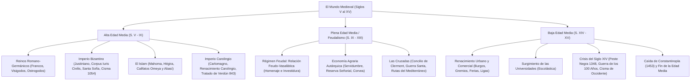

# TEMA 04: LA EDAD MEDIA, EL FEUDALISMO, EL ISLAM Y LAS CRUZADAS

---

## 1. FICHA TÉCNICA Y MATRIZ DE COMPETENCIAS

| Parámetro | Especificación Oficial UNSA / UNMSM / UNI |
| :--- | :--- |
| **Eje Curricular** | Eje 03: Ciencias Sociales / Historia Universal |
| **Nivel de Dificultad** | Nivel Avanzado - Análisis Socioeconómico y Geopolítica Medieval |
| **Ponderación UNSA** | Sociales: 1.584321000 pts \| Biomédicas: 0.942150000 pts \| Ingenierías: 0.812450000 pts |
| **Tiempo Estándar de Respuesta** | 1.5 a 2.0 minutos por reactivo DECO |
| **Prerrequisitos Cognitivos** | Caída de Roma de Occidente, reinos romano-germánicos, derecho canónico y teocentrismo cristiano, relaciones feudo-vasalláticas, expansión islámica mediterránea. |
| **Competencia Cardinal** | Explica de manera integral las dinámicas del mundo medieval europeo e islámico, distinguiendo la estructura estamental y económica del régimen feudal, la trascendencia de los imperios Bizantino y Carolingio, y el impacto de las Cruzadas en el renacimiento comercial y urbano de la Baja Edad Media. |

---

## 2. MAPA TAXONÓMICO Y ONTOLOGÍA



---

## 3. DESARROLLO TEÓRICO FORMAL

### 3.1. Reinos Romano-Germánicos e Invasiones Bárbaras
Tras el colapso del Imperio de Occidente (476 d.C.), las tribus germanas consolidaron monarquías que fusionaron el derecho romano, el cristianismo y las costumbres consuetudinarias germanas (*Wergeld* o precio del hombre, ordalías o juicios de Dios).
- **Reino Franco:** Fundado por Clodoveo (Dinastía Merovingia), quien se convirtió al catolicismo. Su mayordomo de palacio, **Carlos Martel**, frenó el avance musulmán en Europa occidental en la **Batalla de Poitiers (732 d.C.)**. Su hijo, **Pipino el Breve**, derrocó al último rey holgazán y fundó la Dinastía Carolingia.
- **Reino Visigodo (Hispania):** Capital en Toledo. El rey Recaredo se convirtió al catolicismo en el III Concilio de Toledo (589 d.C.). Recesvinto promulgó el *Liber Iudiciorum* (Fuero Juzgo). Fueron aniquilados por los musulmanes en la Batalla de Guadalete (711 d.C.).

---

### 3.2. El Imperio Bizantino (Imperio Romano de Oriente)
Con capital en **Constantinopla** (antigua Bizancio), resistió mil años gracias a sus formidables murallas teodosianas, el comercio marítimo y el "fuego griego".
1. **El Siglo de Oro de Justiniano I (527 - 565 d.C.):**
   - *Renovatio Imperii:* Con sus generales Belisario y Narsés reconquistó Italia (a los ostrogodos), el norte de África (a los vándalos) y el sur de Hispania.
   - *Corpus Iuris Civilis:* Monumental codificación del derecho romano dirigida por el jurista Triboniano (dividido en: Código, Digesto o Pandectas, Institutas y Novelas). Base jurídica de todo el derecho continental moderno.
   - *Arquitectura:* Construcción de la Basílica de **Santa Sofía (*Hagia Sophia*)**.
2. **Conflictos Religiosos y Cisma:**
   - *Querella de los Iconoclastas (Siglo VIII):* El emperador León III el Isáurico prohibió el culto a las imágenes sagradas (iconos).
   - **El Cisma de Oriente (1054 d.C.):** Ruptura teológica y política definitiva entre la **Iglesia Católica Apostólica Romana** (encabezada por el Papa en Roma) y la **Iglesia Ortodoxa Griega** (encabezada por el Patriarca de Constantinopla Miguel Cerulario).
3. **Caída de Constantinopla (1453 d.C.):** Asediada y tomada por las tropas turcas otomanas del sultán **Mehmed II**, marcando el fin de la Edad Media.

---

### 3.3. El Islam y la Civilización Musulmana
Nacido en la península Arábiga en el siglo VII bajo la predicación del profeta **Mahoma**.
- **La Hégira (622 d.C.):** Huida de Mahoma desde La Meca hacia Medina (*Yatrib*); marca el inicio oficial del calendario musulmán.
- **Los Cinco Pilares del Islam:**
  1. *Shahada:* Profesión de fe (*"No hay más dios que Alá y Mahoma es su profeta"*).
  2. *Salat:* Oración ritual cinco veces al día mirando hacia La Meca.
  3. *Zakat:* Limosna obligatoria a los necesitados.
  4. *Sawm:* Ayuno diurno riguroso durante el mes sagrado del Ramadán.
  5. *Hajj:* Peregrinación obligatoria al menos una vez en la vida a la Kaaba en La Meca.
- **Evolución Histórica:**
  - *Califato Ortodoxo (632 - 661 d.C.):* Conquista de Siria, Palestina, Egipto y el Imperio Persa Sasánida.
  - *Califato Omeya (661 - 750 d.C.):* Capital en Damasco. Máxima expansión territorial (conquista de la península ibérica en 711 d.C., Al-Ándalus).
  - *Califato Abasí (750 - 1258 d.C.):* Capital en Bagdad. Época dorada cultural y científica. Destacaron Al-Jwarizmi (Álgebra y algoritmos), Avicena (Medicina, *Canon de la Medicina*) y Averroes (Filosofía aristotélica). Destruido por los mongoles de Hulagu en 1258.

---

### 3.4. El Imperio Carolingio
Intento de reconstitución imperial en Europa occidental liderado por **Carlomagno**, coronado emperador por el Papa León III en Roma en la Navidad del año **800 d.C.**

```
+---------------------------------------------------------------------------------------------------+
|                            ORGANIZACIÓN DEL IMPERIO CAROLINGIO                                    |
+-----------------------------+---------------------------------------------------------------------+
| DIVISIÓN TERRITORIAL        | CARACTERÍSTICAS Y AUTORIDADES                                       |
+-----------------------------+---------------------------------------------------------------------+
| Condados                    | Provincias interiores gobernadas por un Conde (administración civil)|
| Marcas                      | Provincias fronterizas militarizadas gobernadas por un Marqués      |
| Ducados                     | Grandes circunscripciones de frontera integradas por varios condados|
| Missi Dominici              | "Enviados del Señor": Inspectores imperiales en pareja (un noble y   |
|                             | un obispo) que vigilaban la lealtad y recaudación provincial.       |
+-----------------------------+---------------------------------------------------------------------+
```

- **El Renacimiento Carolingio:** Fomento de la educación bajo la dirección del monje **Alcuino de York**. Se establecieron las Escuelas Palatinas (para la nobleza en Aquisgrán), Conventuales y Parroquiales. Se fijaron las siete artes liberales divididas en:
  - **Trivium (letras):** Gramática, Retórica y Dialéctica.
  - **Quadrivium (ciencias):** Aritmética, Geometría, Astronomía y Música.
- **Desintegración y Tratado de Verdún (843 d.C.):** Tras la muerte de Ludovico Pío, sus tres hijos suscribieron el **Tratado de Verdún**, fragmentando el imperio y sentando las bases geopolíticas de la Europa moderna:
  - *Carlos el Calvo:* Francia occidental (germen de Francia).
  - *Luis el Germánico:* Francia oriental o Germania (germen de Alemania y el Sacro Imperio Romano Germánico).
  - *Lotario I:* Lotaringia e Italia (franja central con el título imperial).

---

### 3.5. El Feudalismo (Siglos IX al XIII)
Sistema socioeconómico, político y militar predominante en Europa occidental caracterizado por la **descentralización del poder político**, la primacía de la **propiedad agraria** y la servidumbre.

#### A. Factores que Desencadenaron el Feudalismo:
1. Fragmentación del Imperio Carolingio tras el Tratado de Verdún.
2. La **Segunda Oleada de Invasiones Bárbaras (siglos IX y X):** Incursiones de vikingos (normandos), sarracenos (piratas musulmanes) y magiares (húngaros). Los monarcas, impotentes para defender a la población, delegaron la protección territorial a los señores feudales locales, quienes fortificaron sus tierras construyendo **castillos**.
3. Consolidación de la herencia de los feudos con el **Capitular de Quierzy (877 d.C.)**.

#### B. El Contrato Feudo-Vasallático (Relación entre Nobles):
Pacto bilateral sinalagmático de lealtad militar y auxilio mutuo celebrado mediante una ceremonia solemne:
1. **Homenaje:** El vasallo se arrodilla ante el señor, coloca sus manos entre las de este e intercambian el beso de la paz (*osculum*), jurando fidelidad.
2. **Investidura:** El señor entrega al vasallo un objeto simbólico (espada, anillo, cetro o un terrón de tierra) que representa la concesión del **Feudo o Beneficio**.

#### C. Estructura Social Estamental Tripartita:
- **Bellatores ("los que combaten"):** La nobleza feudal (reyes, duques, marqueses, condes, barones y caballeros). Propietarios de la tierra y monopolizadores de las armas.
- **Oratores ("los que rezan"):** El clero católico (alto clero: obispos y abades; bajo clero: sacerdotes y monjes). Ejercían el control ideológico e imponían la "Paz de Dios" y la "Tregua de Dios".
- **Laboratores ("los que trabajan"):** Los campesinos y siervos. Constituían la base productiva desprovista de privilegios.
  - *Siervos de la gleba:* Adscritos a la tierra de por vida; no podían abandonar el feudo sin permiso del señor.

#### D. La Economía Feudal y las Obligaciones Serviles:
- **Reserva Señorial:** Tierras de uso exclusivo del señor feudal cultivadas por los siervos.
- **Mansos:** Parcelas entregadas por el señor a las familias campesinas para su subsistencia a cambio de tributos.
- **Cargas Tributarias Serviles:**
  - *Corvea:* Trabajo gratuito obligatorio de varios días a la semana en la reserva señorial.
  - *Banalidades:* Pago forzoso por utilizar el molino, el horno o el lagar del señor.
  - *Censo:* Renta anual pagada en especie (grano, vino, ganado) o en moneda por ocupar los mansos.
  - *Terno y Pernada:* Derecho abusivo del señor sobre las tierras o la vida doméstica del siervo.
  - *Diezmo:* Entrega obligatoria del $10\%$ de la producción agropecuaria a la Iglesia Católica.

---

### 3.6. Las Cruzadas (1095 - 1270 d.C.)
Expediciones militares y religiosas convocadas por el Papado bajo el lema de "Guerra Santa" para recuperar los Santos Lugares (Jerusalén) del dominio musulmán (turcos selyúcidas).
- **Convocatoria:** El Papa **Urbano II** en el **Concilio de Clermont (1095 d.C.)** bajo el grito *"Deus vult"* ("¡Dios lo quiere!").
- **Causas Profundas:** Canalizar la belicosidad de los caballeros feudales fuera de Europa, frenar la expansión turca hacia Bizancio y abrir las ricas rutas comerciales del Mediterráneo oriental a los mercaderes italianos (Venecia, Génova).

```
+---------------------------------------------------------------------------------------------------+
|                                 SÍNTESIS DE LAS PRINCIPALES CRUZADAS                              |
+-------------------+-------------------+-----------------------------------------------------------+
| CRUZADA           | LÍDERES           | DESENLACE Y HECHOS TRASCENDENTALES                        |
+-------------------+-------------------+-----------------------------------------------------------+
| 1.ª Cruzada       | - Pedro el Ermitaño| - Fase Popular: Masacrada en Anatolia.                   |
|    (1096 - 1099)  |   (Popular)       | - Fase Señorial: Liderada por Godofredo de Bouillón.      |
|                   | - Godofredo de    | - ÚNICA CRUZADA EXITOSA MILITARMENTE: Conquistan          |
|                   |   Bouillón        |   Jerusalén (1099) y fundan los Estados Latinos de Oriente.|
+-------------------+-------------------+-----------------------------------------------------------+
| 3.ª Cruzada       | - Ricardo Corazón | - Motivada por la reconquista de Jerusalén por SALADINO   |
|    "De los Reyes" |   de León (Ing.)  |   (Batalla de Hattin, 1187).                              |
|    (1189 - 1192)  | - Felipe Augusto  | - Muere Federico Barbarroja ahogado en Cilicia.           |
|                   | - Federico I      | - Ricardo I firma un pacto con Saladino permitiendo el    |
|                   |   Barbarroja      |   acceso de peregrinos desarmados a Jerusalén.            |
+-------------------+-------------------+-----------------------------------------------------------+
| 4.ª Cruzada       | - Balduino de     | - Cruzada desvirtuada por intereses mercantiles venecianos|
|    "Comercial"    |   Flandes         |   (Dux Enrico Dandolo).                                   |
|    (1202 - 1204)  | - Dux Dandolo     | - Atacan y saquean Constantinopla (1204), instaurando el  |
|                   |                   |   efímero Imperio Latino de Constantinopla.               |
+-------------------+-------------------+-----------------------------------------------------------+
```

#### Consecuencias Históricas de las Cruzadas:
1. **Decadencia del Feudalismo:** Muerte masiva y endeudamiento de la nobleza señorial; fortalecimiento del poder de las monarquías autoritarias.
2. **Renacimiento Urbano y Comercial:** Reapertura del mar Mediterráneo; enriquecimiento de las ciudades mercantiles italianas (Venecia, Génova, Pisa) y auge de la nueva clase social: **la burguesía**.
3. **Intercambio Cultural:** Difusión en Europa de la filosofía clásica preservada por los árabes, la pólvora, el papel, la brújula y la numeración arábiga.

---

### 3.7. La Baja Edad Media y el Renacimiento Urbano
- **Los Burgos y la Burguesía:** Ciudades amuralladas donde resurgió la economía monetaria y manufacturera. Los burgueses obtuvieron de los reyes cartas de franquicia o fueros para liberarse de la servidumbre feudal.
- **Gremios o Corporaciones de Oficio:** Asociaciones de artesanos que monopolizaban la producción y controlaban precios y calidades. Jerarquía: *Maestro* (dueño del taller), *Oficial* (asalariado) y *Aprendiz* (joven sin sueldo).
- **Ligas Comerciales:** La **Liga Hanseática** (mar Báltico y del Norte) y la **Liga Lombarda** (norte de Italia).
- **Las Universidades Medievales:** Corporaciones autónomas de maestros y estudiantes surgidas en los siglos XII y XIII (Bolonia, París, Oxford, Salamanca). Método pedagógico: la **Escolástica** (Santo Tomás de Aquino, *Summa Theologiae*, armonización entre fe y razón aristotélica).
- **La Crisis del Siglo XIV:**
  1. *La Peste Negra (1348 d.C.):* Peste bubónica transmitida por pulgas de ratas en barcos comerciales genoveses procedentes de Crimea; aniquiló a un tercio de la población europea.
  2. *Guerra de los Cien Años (1337 - 1453 d.C.):* Enfrentamiento entre Francia e Inglaterra por la corona gala y los feudos de Guyena y Flandes. Hito nacional: **Juana de Arco** (sitio de Orleans). Culmina con la victoria de Francia y consolidación de la monarquía nacional.
  3. *Cisma de Occidente (1378 - 1417 d.C.):* División del papado católico con papas simultáneos en Roma y Aviñón; resuelto en el Concilio de Constanza.

---

## 4. CUADRO SINÓPTICO COMPARATIVO

$$\begin{array}{|l|l|l|l|}
\hline
\textbf{Eje Temático} & \textbf{Pilar Institucional} & \textbf{Carácter Político} & \textbf{Efecto Histórico Clave} \\ \hline
\text{Imperio Bizantino} & \text{Corpus Iuris Civilis} & \text{Monarquía teocrática absolutista} & \text{Preservación del legado romano y Cisma de 1054} \\ \hline
\text{Imperio Carolingio} & \text{Missi Dominici y Escuelas} & \text{Alianza Altar-Trono (Imperio cristiano)} & \text{Génesis de Francia y Alemania (Verdún 843)} \\ \hline
\text{El Islam Clásico} & \text{Cinco Pilares y El Corán} & \text{Califato teocrático expansivo} & \text{Ruptura del eje mediterráneo y puente cultural} \\ \hline
\text{Régimen Feudal} & \text{Homenaje e Investidura} & \text{Poder fragmentado y privatizado} & \text{Servidumbre y economía cerrada de subsistencia} \\ \hline
\text{Las Cruzadas} & \text{Llamado papal (Guerra Santa)} & \text{Empresa militar caballeresca} & \text{Debilitamiento feudal y auge de la burguesía} \\ \hline
\end{array}$$

---

## 5. MNEMOTECNIAS DE COMBATE PREUNIVERSITARIO

### Mnemotecnia 1: "T-Q-V" de la Desintegración Carolingia
- **T**: **T**ratado de Verdún (843).
- **Q**: **Q**uierzy (Capitular del 877 que hace los feudos hereditarios).
- **V**: **V**erdún dividió entre Carlos el Calvo, Luis el Germánico y Lotario.

### Mnemotecnia 2: "C-O-B-I" para las Obligaciones Serviles Feudales
- **C**: **C**orvea (trabajo físico gratis en la reserva).
- **O**: **O**rdalías / Diezmo.
- **B**: **B**analidades (pago por usar molino u horno).
- **I**: **I**nvestidura (el feudo que da el señor).

---

## 6. TÉCNICAS Y ARTIFICIOS DE RESOLUCIÓN (HACKING PREUNIVERSITARIO)

### Hack 1: Identificación Rápida de las Cruzadas
- ¿Recuperó Jerusalén y fundó los reinos latinos? $\implies$ **1.ª Cruzada (Señorial)**.
- ¿Pelearon Saladino vs. Ricardo Corazón de León? $\implies$ **3.ª Cruzada (De los Reyes)**.
- ¿Desviada por Venecia a saquear Constantinopla? $\implies$ **4.ª Cruzada (Comercial)**.

### Hack 2: Descarte en el Tratado de Verdún
Si te preguntan por las entidades territoriales surgidas de Verdún (843):
- Carlos el Calvo $\implies$ Francia.
- Luis el Germánico $\implies$ Germania (Sacro Imperio).
- Lotario $\implies$ Lotaringia e Italia.
¡Cualquier otra asociación es un distractor de examen!

---

## 7. ZONA DE TRAMPAS Y DISTRACTORES ("¡PELIGRO EXAMEN!")

> [!WARNING]
> **Trampa 1: El vasallo NO era un siervo**
> El vasallaje era una relación honorable celebrada **exclusivamente entre nobles** (hombres libres de la clase dominante mediante el Homenaje e Investidura). Los campesinos y siervos no tenían vasallaje, sino relaciones de **servidumbre** frente al señor feudal.

> [!CAUTION]
> **Trampa 2: Las causas religiosas de las Cruzadas como única explicación**
> Aunque el discurso público del Papa Urbano II fue la recuperación del Santo Sepulcro, las causas determinantes para los historiadores fueron **económicas y sociales**: la necesidad de tierras de los señores feudales segundones, el alivio de la sobrepoblación europea y la ambición de Venecia y Génova por controlar el comercio con Oriente.

> [!WARNING]
> **Trampa 3: La Peste Negra no fue provocada por castigo divino o brujería**
> En preguntas DECO de contexto científico, recuerda que la Peste Negra fue causada por la bacteria *Yersinia pestis*, transportada por las pulgas (*Xenopsylla cheopis*) que parasitaban a las ratas negras a bordo de naves mercantes.

---

## 8. APLICACIÓN AL MUNDO REAL Y CONTEXTO DECO

### Caso 1: La Estructura Universitaria y los Grados Académicos
El modelo universitario actual (facultades, rectores, decanos, defensa de tesis, grados de bachiller y doctor) proviene intacto de las corporaciones gremiales universitarias de París y Bolonia del siglo XIII, donde los estudiantes y profesores se agremiaron jurídicamente para protegerse de los abusos de los señores feudales y obispos locales.

### Caso 2: El Derecho Notarial y la Transmisión de Inmuebles
La protocolización formal de los contratos de compraventa de tierras mediante escritura pública y testigos juramentados deriva de los rituales del contrato feudo-vasallático de investidura, donde la entrega física de la posesión requería fe pública para tener validez erga omnes.

---

## 9. BANCO DE 5 EJERCICIOS RESUELTOS GRADUADOS

### Ejercicio 1 (Nivel 1 - Acceso Inmediato): Legislación de Justiniano
**Enunciado (UNSA):** El emperador bizantino Justiniano I destacó en el siglo VI por su ambiciosa política de restauración del esplendor de la antigua Roma. En el plano jurídico, su mayor contribución fue la recopilación de todo el derecho romano histórico en la obra denominada:
A) Las Siete Partidas  
B) El Edicto de Milán  
C) El Corpus Iuris Civilis  
D) El Fuero Juzgo  
E) El Código Napoleónico

**Solución paso a paso:**
1. Justiniano encomendó a una comisión de juristas liderada por Triboniano la unificación y actualización sistemática de las leyes romanas clásicas.
2. Dicha compilación magna se tituló **Corpus Iuris Civilis** (Cuerpo de Derecho Civil), estructurada en Código, Digesto, Institutas y Novelas.
**Respuesta:** **C) El Corpus Iuris Civilis**.

---

### Ejercicio 2 (Nivel 2 - Intermedio Operativo): Descentralización Carolingia
**Enunciado (UNMSM DECO):** Tras la muerte de Ludovico Pío, los nietos de Carlomagno se disputaron agriamente la corona imperial. Finalmente, en el año 843 d.C., suscribieron un trascendental acuerdo que fragmentó el Imperio Carolingio y sentó los orígenes territoriales de Francia y Alemania. Dicho acuerdo se conoce como:
A) Capitular de Quierzy  
B) Concordato de Worms  
C) Tratado de Verdún  
D) Paz de Constanza  
E) Concilio de Clermont

**Solución paso a paso:**
1. El conflicto sucesorio carolingio se zanjó mediante el **Tratado de Verdún (843 d.C.)**.
2. Carlos el Calvo recibió Francia Occidental; Luis el Germánico, Francia Oriental (Germania); y Lotario I, la franja central de Lotaringia e Italia con el título honorífico de emperador.
**Respuesta:** **C) Tratado de Verdún**.

---

### Ejercicio 3 (Nivel 3 - Contexto DECO Avanzado): Dinámica Feudo-Vasallática
**Enunciado (UNMSM DECO / UNSA):** En el régimen feudal de la Plena Edad Media, las relaciones feudo-vasalláticas constituían el tejido político fundamental de la clase dominante. Al respecto, el acto del *homenaje* consistía específicamente en:
A) La entrega obligatoria del diezmo eclesiástico al obispado local.  
B) La concesión de un lote de tierra por parte del señor a los campesinos siervos.  
C) La ceremonia en la cual el vasallo juraba sumisión, fidelidad y auxilio militar ante su señor de rodillas y uniendo sus manos.  
D) El pago de la corvea en los campos comunales de la aldea.  
E) La emancipación legal de los siervos de la gleba a cambio de metálico.

**Solución paso a paso:**
1. El contrato feudo-vasallático constaba de dos fases solemnes: el Homenaje y la Investidura.
2. En el **Homenaje** (*homagium*), el noble menor se declaraba "hombre" del señor mediante juramento de lealtad arrodillado (*inmixtio manuum* y beso de paz).
3. En la Investidura, el señor correspondía entregándole el feudo o beneficio.
**Respuesta:** **C) La ceremonia en la cual el vasallo juraba sumisión, fidelidad y auxilio militar ante su señor de rodillas y uniendo sus manos.**

---

### Ejercicio 4 (Nivel 4 - Análisis Crítico / UNI CEPRE): Consecuencias de las Cruzadas
**Enunciado (UNI):** Si bien las Cruzadas fueron convocadas formalmente como empresas de carácter religioso para liberar el Santo Sepulcro en Jerusalén, su repercusión más trascendental en la estructura socioeconómica europea fue:
A) La consolidación irreversible del sistema feudal y el aislamiento agrario de los reinos occidentales.  
B) El decaimiento del comercio transmediterráneo en favor de las rutas atlánticas hacia América.  
C) El debilitamiento del poder señorial militar y el resurgimiento urbano y comercial del Mediterráneo que potenció a la burguesía naciente.  
D) La extinción definitiva del Imperio Bizantino durante la Primera Cruzada.  
E) La conversión total y pacífica de los pueblos musulmanes al cristianismo católico.

**Solución paso a paso:**
1. Los señores feudales se endeudaron fuertemente y sufrieron cuantiosas bajas en Oriente, permitiendo a los reyes recentralizar el poder.
2. La reapertura de las rutas comerciales marítimas en el Mediterráneo enriqueció a puertos italianos como Venecia y Génova, expandiendo la economía dineraria y favoreciendo el auge de los burgueses frente a la vieja nobleza terrateniente.
**Respuesta:** **C) El debilitamiento del poder señorial militar y el resurgimiento urbano y comercial del Mediterráneo que potenció a la burguesía naciente.**

---

### Ejercicio 5 (Nivel 5 - Reto Titán / Examen de Excelencia): Geopolítica y Religión Medieval
**Enunciado (Reto Historiográfico Élite):** Determine la veracidad ($V$) o falsedad ($F$) de las siguientes proposiciones relativas al medioevo universal:
I. La Batalla de Poitiers (732 d.C.) detuvo la penetración árabe musulmana en Europa occidental gracias a las huestes comandadas por Carlos Martel.  
II. El Cisma de Oriente acaecido en 1054 d.C. representó la ruptura irreconciliable entre los papas de Aviñón y Roma.  
III. La Cuarta Cruzada se desvió de su objetivo original por instigación de la oligarquía comercial de Venecia, culminando en la toma y saqueo cristiano de Constantinopla en 1204 d.C.  
IV. La peste negra de 1348 se originó biológicamente por el consumo masivo de agua contaminada con sales de plomo en las minas de carbón inglesas.

A) V - F - V - F  
B) V - V - F - F  
C) F - F - V - V  
D) V - F - F - V  
E) F - V - V - F  

**Solución paso a paso:**
- **Afirmación I (VERDADERA):** Carlos Martel, mayordomo franco, derrotó al valí Abderramán en Poitiers en el 732, impidiendo la expansión islámica más allá de los Pirineos.
- **Afirmación II (FALSA):** El Cisma de 1054 fue entre la Iglesia Católica de Roma y la Iglesia Ortodoxa de Constantinopla. El enfrentamiento entre Roma y Aviñón fue el **Cisma de Occidente** (1378 - 1417).
- **Afirmación III (VERDADERA):** La Cuarta Cruzada fue financiada por Venecia (Dux Dandolo) para destruir a su rival comercial Bizancio; los cruzados saquearon Constantinopla en 1204 y fundaron el Imperio Latino.
- **Afirmación IV (FALSA):** La peste negra fue causada por la bacteria *Yersinia pestis*, transmitida por pulgas de ratas negras procedentes de Asia y el mar Negro, no por contaminación con plomo.
- Secuencia: $V - F - V - F$.
**Respuesta:** **A) V - F - V - F**.

---

## 10. GLOSARIO DE 10 TÉRMINOS CLAVE

1. **Feudo:** Unidad territorial, económica y jurisdiccional otorgada por un señor a su vasallo en el régimen feudal a cambio de servicio y auxilio militar.
2. **Siervo de la Gleba:** Campesino no libre jurídicamente adscrito de forma perpetua y hereditaria a la tierra que cultiva en el feudo señorial.
3. **Corvea:** Prestación personal obligatoria de trabajo gratuito que el siervo debía ejecutar en la reserva señorial durante determinados días de la semana.
4. **Banalidad:** Impuesto o tasa en especie impuesta por el señor feudal a los campesinos por la utilización forzosa de sus instalaciones monopolizadas (molino, horno, lagar).
5. **Missi Dominici:** Inspectores oficiales de la corte de Carlomagno enviados de dos en dos (un conde laico y un obispo) para fiscalizar las provincias imperiales.
6. **Hégira:** Migración o huida de Mahoma y sus seguidores desde La Meca hacia la ciudad de Medina en el año 622 d.C., punto de partida de la era musulmana.
7. **Trivium:** Rama humanística de las siete artes liberales medievales conformada por la Gramática, la Retórica y la Dialéctica.
8. **Quadrivium:** Rama científica de las artes liberales medievales integrada por la Aritmética, la Geometría, la Astronomía y la Música.
9. **Gremio:** Corporación medieval que agrupaba a los artesanos de un mismo oficio en una ciudad para reglamentar la producción, precios y aprendizaje laboral.
10. **Escolástica:** Corriente teológica y filosófica medieval dominante que utilizó la lógica y filosofía aristotélica para fundamentar racionalmente los dogmas cristianos.

---

## 11. BANCO DE FLASHCARDS (Q/A)

- **P:** ¿Qué caudillo franco detuvo el avance musulmán en Europa occidental en la Batalla de Poitiers (732 d.C.)?
  - **R:** Carlos Martel (mayordomo de palacio de los merovingios).
- **P:** ¿Cómo se denominó la monumental recopilación de leyes romanas promulgada por el emperador bizantino Justiniano I?
  - **R:** El *Corpus Iuris Civilis*.
- **P:** ¿En qué año y mediante qué tratado se dividió formalmente el Imperio Carolingio entre los tres nietos de Carlomagno?
  - **R:** En el año 843 d.C., mediante el Tratado de Verdún.
- **P:** ¿Cuáles son las dos partes fundamentales del contrato feudo-vasallático?
  - **R:** El Homenaje (juramento de lealtad) y la Investidura (entrega del beneficio o feudo).
- **P:** ¿Qué papa convocó la Primera Cruzada en el Concilio de Clermont en 1095?
  - **R:** El Papa Urbano II.
- **P:** ¿Cuál fue la única de las ocho Cruzadas que logró conquistar Jerusalén y expulsar momentáneamente a los musulmanes?
  - **R:** La Primera Cruzada (Fase Señorial, liderada por Godofredo de Bouillón en 1099).
- **P:** ¿Qué nombre recibían las tres categorías o jerarquías laborales dentro de un gremio medieval?
  - **R:** Maestro, Oficial y Aprendiz.
- **P:** ¿Qué acontecimiento en el año 1453 se considera el hito de culminación de la Edad Media?
  - **R:** La toma de Constantinopla por los turcos otomanos comandados por Mehmed II.

---

## 12. MOTOR DE GAMIFICACIÓN (JSON NATIVO PARA KOTLIN MULTIPLATFORM)

```json
{
  "subject_id": "HISTORIA_UNIVERSAL",
  "topic_id": "TEMA_04_EDAD_MEDIA_FEUDALISMO_ISLAM_CRUZADAS",
  "title": "La Edad Media, el Feudalismo, el Islam y las Cruzadas",
  "level": "Avanzado",
  "total_xp": 230,
  "skills": ["Imperio Bizantino y Carolingio", "Instituciones Feudales", "Expansión Islámica", "Cruzadas y Renacimiento Urbano"],
  "challenges": [
    {
      "id": "HIST_MED_01",
      "type": "MULTIPLE_CHOICE",
      "question": "El Tratado de Verdún suscrito en el 843 d.C. reviste enorme trascendencia histórica porque:",
      "options": [
        "Unificó a toda Europa bajo el mando supremo del Papa",
        "Dividió el Imperio Carolingio entre los hijos de Ludovico Pío, sentando las bases de Francia y Alemania",
        "Puso fin a las Cruzadas autorizando las peregrinaciones a Jerusalén",
        "Prohibió de forma definitiva el vasallaje en Inglaterra"
      ],
      "correct_index": 1,
      "explanation": "El Tratado de Verdún (843 d.C.) particionó el Imperio Carolingio entre Carlos el Calvo (Francia Occidental), Luis el Germánico (Germania) y Lotario (Lotaringia), disolviendo la unidad imperial carolingia.",
      "xp_reward": 50
    },
    {
      "id": "HIST_MED_02",
      "type": "MULTIPLE_CHOICE",
      "question": "En la economía feudal medieval, el tributo consistente en trabajo físico obligatorio y no remunerado que el siervo prestaba en la reserva señorial se denominaba:",
      "options": [
        "Diezmo",
        "Corvea",
        "Banalidad",
        "Censo"
      ],
      "correct_index": 1,
      "explanation": "La corvea era la obligación servil del campesino de trabajar gratuitamente determinados días de la semana en la reserva señorial (tierras exclusivas del señor).",
      "xp_reward": 50
    },
    {
      "id": "HIST_MED_03",
      "type": "BOSS_CHALLENGE",
      "question": "Relacione correctamente el hecho histórico medieval con su protagonista:\nI. Frenó a los musulmanes en la Batalla de Poitiers\nII. Reconquistó Jerusalén para el Islam en la Batalla de Hattin\nIII. Promulgó el Corpus Iuris Civilis en Bizancio\nIV. Convocó la Primera Cruzada en Clermont\n\n1. Saladino\n2. Justiniano I\n3. Carlos Martel\n4. Urbano II",
      "options": [
        "I-3, II-1, III-2, IV-4",
        "I-1, II-3, III-2, IV-4",
        "I-3, II-2, III-1, IV-4",
        "I-2, II-1, III-3, IV-4"
      ],
      "correct_index": 0,
      "explanation": "Carlos Martel venció en Poitiers (I-3); Saladino recuperó Jerusalén (II-1); Justiniano recopiló el derecho romano (III-2); Urbano II llamó a las Cruzadas (IV-4).",
      "xp_reward": 130
    }
  ]
}
```
