# TEMA 05: LA EDAD MODERNA (HUMANISMO, RENACIMIENTO, REFORMA Y LA ILUSTRACIÓN)

---

## 1. FICHA TÉCNICA Y MATRIZ DE COMPETENCIAS

| Parámetro | Especificación Oficial UNSA / UNMSM / UNI |
| :--- | :--- |
| **Eje Curricular** | Eje 03: Ciencias Sociales / Historia Universal |
| **Nivel de Dificultad** | Nivel Avanzado - Historia de las Ideas, Geopolítica y Revoluciones del Pensamiento |
| **Ponderación UNSA** | Sociales: 1.584321000 pts \| Biomédicas: 0.942150000 pts \| Ingenierías: 0.812450000 pts |
| **Tiempo Estándar de Respuesta** | 1.5 a 2.0 minutos por reactivo DECO |
| **Prerrequisitos Cognitivos** | Caída de Constantinopla, crisis del feudalismo, imprenta de Gutenberg, teocentrismo vs. antropocentrismo, mercantilismo, cisma luterano y doctrina de la soberanía popular. |
| **Competencia Cardinal** | Analiza críticamente las grandes transformaciones ideológicas, estéticas, religiosas y políticas de la Edad Moderna (Humanismo, Renacimiento, Reforma, Absolutismo e Ilustración), contrastando sus postulados con la gestación del mundo burgués contemporáneo y los derechos ciudadanos. |

---

## 2. MAPA TAXONÓMICO Y ONTOLOGÍA

```mermaid
graph TD
    A["La Edad Moderna (1453 / 1492 - 1789)"] --> B["Humanismo y Renacimiento (S. XV - XVI)"]
    A --> C["Expansión Ultramarina y Descubrimientos"]
    A --> D["Reforma Protestante y Contrarreforma"]
    A --> E["Monarquías Absolutistas y Parlamentarismo"]
    A --> F["La Ilustración y Despotismo Ilustrado (S. XVIII)"]

    B --> B1["Humanismo: Antropocentrismo, Petrarca, Erasmo de Rotterdam"]
    B --> B2["Renacimiento Artístico: Quattrocento (Florencia) y Cinquecento (Roma)"]

    C --> C1["Bloqueo turco de Constantinopla (1453) y brújula/carabela"]
    C --> C2["Ruta portuguesa (África / India) y Ruta española (Colón / Tordesillas 1494)"]

    D --> D1["Luteranismo (Alemania: 95 Tesis, Sola Fide, Paz de Augsburgo 1555)"]
    D --> D2["Calvinismo (Predestinación) y Anglicanismo (Enrique VIII, Acta Supremacía)"]
    D --> D3["Contrarreforma Católica: Concilio de Trento y Compañía de Jesús"]

    E --> E1["Absolutismo de Derecho Divino: Luis XIV de Francia ('El Rey Sol')"]
    E --> E2["Revolución Gloriosa Inglesa (1688): Bill of Rights y Monarquía Parlamentaria"]
    E --> E3["Paz de Westfalia (1648): Nacimiento de los Estados-Nación Soberanos"]

    F --> F1["Filósofos Ilustrados: Montesquieu (Poderes), Voltaire, Rousseau (Soberanía)"]
    F --> F2["La Enciclopedia (Diderot y D'Alembert) y el Despotismo Ilustrado"]
```



---

## 3. DESARROLLO TEÓRICO FORMAL

### 3.1. El Humanismo: Revolución Filosófica Antropocéntrica
Movimiento intelectual surgido en las ricas ciudades mercantiles de Italia (Florencia, Venecia, Roma) entre los siglos XIV y XV.
- **Ruptura Epistemológica:** Reemplazó el **teocentrismo** dogmático medieval por el **antropocentrismo** ("el ser humano es el centro, artífice y medida de todas las cosas").
- **Revaloración de la Antigüedad Clásica:** Estudio filológico directo del griego y latín clásicos, rescatando a Platón y Cicerón tras la llegada de sabios bizantinos exiliados tras la caída de Constantinopla (1453).
- **Vehículo Material:** La invención de la **imprenta de tipos móviles metálicos** perfeccionada por **Johannes Gutenberg** en Maguncia ($\sim 1450$, la *Biblia de 42 líneas*), que permitió la multiplicación y abaratamiento masivo de los libros.

#### Precursores y Representantes Cumbres del Humanismo:
1. **Precursores Italianos (Trecento, siglo XIV):**
   - *Dante Alighieri (1265 - 1321):* *La Divina Comedia* (redactada en toscano vernáculo, puente entre el medievo y la modernidad).
   - *Francesco Petrarca (1304 - 1374):* Considerado el **Padre del Humanismo**. Autor de *Cancionero*, revalorizó la lírica clásica y el individualismo interior.
   - *Giovanni Boccaccio (1313 - 1375):* *Decamerón* (crítica satírica mordaz a la hipocresía eclesiástica y celebración terrenal de la vida).
2. **Representantes Universales (Siglo XVI):**
   - *Desiderio Erasmo de Rotterdam (1466 - 1536):* El **"Príncipe del Humanismo"**. En *Elogio de la locura* censuró con ironía la corrupción papal y la ignorancia teológica, promoviendo una religiosidad pura e intimista basada en los Evangelios.
   - *Tomás Moro (1478 - 1535):* Canciller de Inglaterra y autor de *Utopía*, donde diseñó una sociedad ideal comunitaria sin propiedad privada ni guerras; fue decapitado por Enrique VIII al negarse a avalar el cisma anglicano.
   - *Nicolás Maquiavelo (1469 - 1527):* Padre de la **Ciencia Política moderna**. En *El Príncipe* secularizó la política separándola de la moral religiosa (*"el fin justifica los medios"* o realismo político del Estado).

---

### 3.2. El Renacimiento: Renovación Plástica y Científica
Movimiento artístico y cultural que tradujo los ideales humanistas en las artes plásticas (pintura, escultura, arquitectura), caracterizado por el uso de la perspectiva lineal, el claroscuro, el estudio de la anatomía humana y el naturalismo.
- **Los Mecenas:** Banqueros y aristócratas que financiaron a los artistas (los **Médici** en Florencia, y los Papas **Julio II** y **León X** en Roma).

```
+---------------------------------------------------------------------------------------------------+
|                              LAS DOS ETAPAS DEL RENACIMIENTO ITALIANO                             |
+-------------------+-------------------+-----------------------------------------------------------+
| FASE              | FOCO Y MECENAS    | ARTISTAS Y OBRAS EMBLEMÁTICAS                             |
+-------------------+-------------------+-----------------------------------------------------------+
| QUATTROCENTO      | Florencia         | - Filippo Brunelleschi: Cúpula de Santa María del Fiore.  |
| (Siglo XV)        | (Familia Médici:  | - Donatello: Escultura del *David* en bronce juvenil.    |
|                   | Cosme y Lorenzo)  | - Sandro Botticelli: *El nacimiento de Venus*, *La        |
|                   |                   |   Primavera* (mitología clásica, figuras vaporosas).      |
+-------------------+-------------------+-----------------------------------------------------------+
| CINQUECENTO       | Roma              | - Leonardo da Vinci: *La Gioconda*, *La Última Cena*.     |
| (Siglo XVI)       | (El Papado:       | - Miguel Ángel Buonarroti: Frescos de la Capilla Sixtina, |
|                   | Julio II, León X) |   esculturas del *David*, *Moisés* y *La Piedad*.         |
|                   |                   | - Rafael Sanzio: *La escuela de Atenas*, Madonnas.        |
+-------------------+-------------------+-----------------------------------------------------------+
```

---

### 3.3. Los Grandes Descubrimientos Geográficos
1. **Causas Fundamentales:** La toma de Constantinopla por los turcos otomanos (1453) clausuró las rutas de las especias hacia las Indias (la Ruta de la Seda). Surgió la imperiosa necesidad económica de hallar una vía marítima directa alternativa.
2. **Avances Científico-Técnicos:** La brújula, el astrolabio, el cuadrante, los mapas portulanos y la invención de la **carabela** (embarcación ligera con velas cuadradas y triangulares latinas para navegar contra el viento mediante bolina).
3. **Las Rutas de Exploración:**
   - **Proyecto Portugués (Circunnavegación Africana):** Impulsado por la Escuela Náutica de Sagres de Enrique el Navegante.
     - *Bartolomé Díaz (1488):* Dobla el Cabo de las Tormentas (Cabo de Buena Esperanza).
     - *Vasco da Gama (1498):* Llega a Calicut (India), abriendo la ruta marítima a Oriente.
     - *Pedro Álvares Cabral (1500):* Toca las costas de Brasil.
   - **Proyecto Español (Ruta Occidental Transatlántica):** Cristóbal Colón (respaldado por los Reyes Católicos en la Capitulación de Santa Fe) llega a la isla de Guanahaní (San Salvador) el **12 de octubre de 1492**.
4. **Tratados de Reparto Colonial:**
   - **Bula Inter Caetera (1493):** Emitida por el papa Alejandro VI (Borgia); concedía a España las tierras a 100 leguas al oeste de las islas Azores.
   - **Tratado de Tordesillas (1494):** Suscrito directamente entre España y Portugal; desplazó la línea divisoria a **370 leguas al oeste de Cabo Verde**, permitiendo a Portugal reclamar formalmente Brasil.
5. **Primera Vuelta al Mundo (1519 - 1522):** Iniciada por **Hernando de Magallanes** (quien cruzó el estrecho austral y murió en Filipinas) y culminada por **Juan Sebastián Elcano** a bordo de la nao *Victoria*, demostrando empíricamente la esfericidad terrestre.

---

### 3.4. La Reforma Protestante y la Contrarreforma Católica

#### A. Causas de la Reforma Protestante:
- Corrupción moral generalizada de la jerarquía católica: **simonía** (compraventa de cargos eclesiásticos), **nicolaísmo** (ruptura del celibato sacerdotal) y **nepotismo**.
- El detonante inmediato: La **Venta de Indulgencias** promulgada por el Papa **León X** en 1515 para costear la edificación de la Basílica de San Pedro en Roma, administrada en Alemania por los frailes dominicos (Johann Tetzel).

#### B. Las Vertientes Protestantes:
1. **Luteranismo (Alemania):**
   - El monje agustino **Martín Lutero** clavó sus **95 Tesis** contra las indulgencias en la puerta de la iglesia del castillo de Wittenberg (31 de octubre de 1517).
   - *Pilares Doctrinales:* **Sola Fide** (la justificación y salvación se alcanza exclusivamente por la fe, no por las buenas obras ni compra de bulas), **Sola Scriptura** (la Biblia es la única fuente de verdad dogmática y debe interpretarse por libre examen), reducción a **dos sacramentos** (Bautismo y Eucaristía) y abolición del celibato y culto a los santos y a la Virgen.
   - *Hitos Políticos:* Dieta de Worms (1521, Carlos V condena a Lutero), Dieta de Spira (1529, los príncipes protestan formalmente contra el emperador), y la **Paz de Augsburgo (1555)**, que reconoció la libertad religiosa a los príncipes alemanes (*Cuius regio, eius religio*: la religión del príncipe es la religión de sus súbditos).
2. **Calvinismo (Suiza y Francia):**
   - Impulsado por **Juan Calvino** desde Ginebra.
   - *Doctrina de la Predestinación Absoluta:* Desde el inicio de la Creación, Dios ya determinó quiénes se salvan y quiénes se condenan eternamente; el éxito material, la disciplina laboral austera y la prosperidad económica son signos terrenales de la gracia divina (tesis analizada por Max Weber en *La ética protestante y el espíritu del capitalismo*).
   - Difusión: En Francia se llamaron **Hugonotes**; en Inglaterra, **Puritanos**; y en Escocia, **Presbiterianos** (John Knox).
3. **Anglicanismo (Inglaterra):**
   - Cisma de origen dinástico-político encabezado por el rey **Enrique VIII**.
   - Ante la negativa del Papa Clemente VII a concederle el divorcio de Catalina de Aragón para desposar a Ana Bolena, el monarca promulgó el **Acta de Supremacía (1534)**, convirtiéndose en el Jefe Supremo indiscutible de la Iglesia de Inglaterra.

#### C. La Contrarreforma o Reforma Católica:
Reacción defensiva y modernizadora de la Iglesia Católica para frenar el avance del protestantismo.
1. **El Concilio de Trento (1545 - 1563):** Convocado por el Papa **Paulo III**.
   - *Ratificación Dogmática:* Reafirmó los siete sacramentos, la autoridad suprema del Papa, el libre albedrío humano complementado con las buenas obras para la salvación, la veneración de la Virgen y santos, y el valor normativo de la tradición eclesiástica junto a la Biblia Vulgata.
   - *Medidas Disciplinarias:* Supresión de la venta de indulgencias, mantenimiento estricto del celibato eclesiástico y creación obligatoria de seminarios diocesanos para la rigurosa instrucción moral del clero.
2. **La Compañía de Jesús (1534):** Orden religiosa de corte militar fundada por **San Ignacio de Loyola**. Se rigió por el voto de obediencia absoluta y directa al Papa (*perinde ac cadaver*), destacando por sus misiones evangelizadoras globales (Asia y América) y su sólida red de colegios humanistas.
3. **El Tribunal del Santo Oficio de la Inquisición y el Index:** Reorganización del tribunal inquisitorial para reprimir la herejía y publicación del *Index Librorum Prohibitorum* (catálogo oficial de libros prohibidos para los católicos).

---

### 3.5. El Absolutismo Monárquico y el Nacimiento del Estado Moderno
Sistema de gobierno imperante en los siglos XVII y XVIII donde el monarca concentraba todos los poderes del Estado sin contrapeso institucional.
- **Teóricos del Absolutismo:**
  - *Jacques Bossuet:* Teoría del **Derecho Divino de los Reyes** (*Política deducida de las Sagradas Escrituras*): el poder emana directamente de Dios hacia el rey, rindiendo cuentas solo ante el Creador.
  - *Jean Bodin:* Teoría de la soberanía indivisible e incondicional del monarca.
  - *Thomas Hobbes:* En *Leviatán*, sostiene que el hombre es un ser egoísta (*"homo homini lupus"*) que para escapar de la anarquía salvaje debe ceder voluntariamente su libertad absoluta a un gobernante supremo autoritario.
- **Máximo Exponente:** **Luis XIV de Francia**, el "Rey Sol" (*"L'État, c'est moi"* / *"El Estado soy yo"*), quien construyó el opulento Palacio de Versalles para domesticar a la nobleza cortesana y aplicó el mercantilismo estatal bajo su ministro Jean-Baptiste Colbert.
- **La Excepción Inglesa (Monarquía Parlamentaria):**
  - Tras la Guerra Civil y la dictadura puritana de Oliver Cromwell, estalla la **Revolución Gloriosa de 1688**, derrocando al absolutista católico Jacobo II.
  - Los nuevos monarcas Guillermo de Orange y María Stuart juraron la **Declaración de Derechos (*Bill of Rights*, 1689)**, naciendo la primera monarquía parlamentaria constitucional del mundo (*"el rey reina, pero no gobierna"*).
- **La Paz de Westfalia (1648):** Puso fin a la sangrienta **Guerra de los Treinta Años**. Consagró el principio de **soberanía estatal territorial**, el equilibrio de poder en Europa y el fin definitivo de las pretensiones de hegemonía católica universal de los Habsburgo.

---

### 3.6. La Ilustración: "El Siglo de las Luces" (Siglo XVIII)
Movimiento intelectual y filosófico burgués que propugnó el uso de la **Razón crítica** como el instrumento soberano para disipar las tinieblas de la ignorancia, la superstición religiosa y el absolutismo tiránico del Antiguo Régimen.

#### A. Filósofos Políticos Clave:
1. **John Locke (1632 - 1704):** Precursor de la Ilustración y padre del liberalismo político. Sostuvo que todo ser humano posee por naturaleza derechos inalienables fundamentales: **vida, libertad y propiedad privada**. El Estado surge de un contrato social para proteger dichos derechos; si el gobernante los vulnera, el pueblo tiene el legítimo **derecho a la rebelión**.
2. **Montesquieu (1689 - 1755):** En *El espíritu de las leyes*, formuló el principio de la **separación de poderes** del Estado en **Ejecutivo, Legislativo y Judicial**, garantizando un sistema de frenos y contrapesos que impida la tiranía absolutista.
3. **Voltaire (1694 - 1778):** En *Cartas filosóficas*, defendió de forma intransigente la **libertad de pensamiento y expresión** y la tolerancia religiosa, combatiendo agriamente el fanatismo del clero católico.
4. **Jean-Jacques Rousseau (1712 - 1778):** En *El contrato social*, formuló el principio de la **soberanía popular** y la voluntad general. Postuló que el hombre nace libre y bondadoso por naturaleza, pero la sociedad y la propiedad privada lo corrompen (*"El hombre nace bueno, la sociedad lo corrompe"*).

#### B. La Enciclopedia (*L'Encyclopédie*, 1751 - 1772):
Empresa intelectual monumental dirigida por **Denis Diderot** y el matemático **Jean d'Alembert** (compuesta por 28 volúmenes). Reunió los conocimientos científicos, técnicos, económicos y filosóficos de la época bajo un prisma racionalista, convirtiéndose en el ariete ideológico de la burguesía contra la monarquía absoluta y la Iglesia.

#### C. El Despotismo Ilustrado:
Fórmula política asumida por varios monarcas absolutos del siglo XVIII para modernizar la economía, la ciencia y la administración de sus reinos adoptando reformas ilustradas, pero manteniendo incólume el monopolio autoritario del poder:
$$\text{"Todo para el pueblo, pero sin el pueblo"}$$
- **Principales Déspotas Ilustrados:**
  - *Federico II el Grande de Prusia:* Amigo de Voltaire, abolió la tortura e implantó la educación primaria obligatoria.
  - *Catalina II la Grande de Rusia:* Fomentó las artes y la colonización territorial.
  - *Carlos III de España:* Expulsó a los jesuitas (1767) y aplicó las Reformas Borbónicas comerciales y fiscales en América.
  - *José II de Austria:* Abolió la servidumbre de la gleba y decretó la tolerancia religiosa.

---

## 4. CUADRO COMPARATIVO DEL PENSAMIENTO MODERNO

$$\begin{array}{|l|l|l|l|}
\hline
\textbf{Corriente / Movimiento} & \textbf{Centro de Atención} & \textbf{Oponentes Ideológicos} & \textbf{Impacto Histórico Definitivo} \\ \hline
\text{Humanismo} & \text{El Ser Humano (Antropocentrismo)} & \text{Escolástica y dogmatismo medieval} & \text{Génesis del espíritu crítico y la ciencia moderna} \\ \hline
\text{Reforma Protestante} & \text{La Fe y la Biblia (Libre Examen)} & \text{Jerarquía papal e indulgencias} & \text{Quiebre de la unidad cristiana y auge capitalista} \\ \hline
\text{Absolutismo Clásico} & \text{El Monarca y la Razón de Estado} & \text{Feudalismo y asambleas estamentales} & \text{Nacimiento del Estado moderno centralizado} \\ \hline
\text{La Ilustración} & \text{La Razón crítica y la Libertad} & \text{El Antiguo Régimen y la superstición} & \text{Fundamento ideológico de la Rev. Francesa} \\ \hline
\end{array}$$

---

## 5. MNEMOTECNIAS DE COMBATE PREUNIVERSITARIO

### Mnemotecnia 1: "L-C-A" para las Tres Corrientes Reformistas
- **L**: **L**utero (Alemania, salvación por la fe y 95 tesis).
- **C**: **C**alvino (Ginebra, **c**ondena/predestinación del éxito).
- **A**: **A**nglicano (Inglaterra, **A**cta de supremacía con Enrique VIII).

### Mnemotecnia 2: "M-V-R" de la Tríada de la Ilustración Francesa
- **M**: **M**ontesquieu (**M**últiples poderes: división legislativo/ejecutivo/judicial).
- **V**: **V**oltaire (**V**oz libre y tolerancia a ultranza).
- **R**: **R**ousseau (**R**adical soberanía del pueblo y contrato social).

---

## 6. TÉCNICAS Y ARTIFICIOS DE RESOLUCIÓN (HACKING PREUNIVERSITARIO)

### Hack 1: Diferenciación entre Humanismo y Renacimiento
- Si la pregunta alude a **literatura, filosofía, filología, traducción de manuscritos o antropocentrismo teórico** $\implies$ Marca **Humanismo** (Petrarca, Erasmo, Moro, Maquiavelo).
- Si la pregunta alude a **artes plásticas, pintura, escultura, arquitectura, perspectiva o anatomía** $\implies$ Marca **Renacimiento** (Da Vinci, Miguel Ángel, Rafael, Botticelli).

### Hack 2: La Clave de Calvino en Preguntas de Economía
En cualquier pregunta de examen de admisión donde se vincule la Reforma Religiosa con el **ascenso del capitalismo, la moral del trabajo burgués o el crédito financiero** $\implies$ La respuesta es indudablemente **Juan Calvino** y la doctrina de la **Predestinación**.

---

## 7. ZONA DE TRAMPAS Y DISTRACTORES ("¡PELIGRO EXAMEN!")

> [!WARNING]
> **Trampa 1: Confundir el Acta de Supremacía con el Edicto de Nantes**
> - El **Acta de Supremacía (1534)** fue promulgada por Enrique VIII en Inglaterra para romper con Roma y fundar la Iglesia Anglicana.
> - El **Edicto de Nantes (1598)** fue promulgado por Enrique IV de Francia para conceder libertad religiosa y plazas militares de seguridad a los hugonotes (calvinistas franceses).

> [!CAUTION]
> **Trampa 2: La posición de los déspotas ilustrados ante la democracia**
> Los monarcas del Despotismo Ilustrado promovían la ciencia y la economía, pero **odiaban la democracia y la soberanía popular**. Su lema era *"Todo para el pueblo, pero SIN el pueblo"*. Jamás aceptaron elecciones ni división de poderes.

> [!WARNING]
> **Trampa 3: La firma del Tratado de Tordesillas**
> El Tratado de Tordesillas (1494) fue suscrito exclusivamente entre **España y Portugal**. El Papa Alejandro VI emitió las bulas *Inter Caetera* un año antes (1493), pero en Tordesillas los monarcas negociaron bilateralmente sin presencia del pontífice.

---

## 8. APLICACIÓN AL MUNDO REAL Y CONTEXTO DECO

### Caso 1: La División de Poderes en la Constitución Peruana
El artículo 43.° de la Constitución Política del Perú consagra que la República es democrática, social, independiente y soberana, y su gobierno es unitario, representativo y descentralizado, y se organiza según el principio de la **separación de poderes**. Esta columna vertebral de la democracia peruana emana directamente de la obra *El espíritu de las leyes* (1748) del barón de Montesquieu.

### Caso 2: La Revolución de las Redes Sociales y la Imprenta de Gutenberg
Sociólogos de la era digital comparan la irrupción de internet y las redes sociales contemporáneas con la imprenta de tipos móviles del siglo XV: ambas tecnologías descentralizaron el monopolio clerical/estatal de la información, permitiendo la democratización del conocimiento y desatando revoluciones políticas globales.

---

## 9. BANCO DE 5 EJERCICIOS RESUELTOS GRADUADOS

### Ejercicio 1 (Nivel 1 - Acceso Inmediato): Filosofía de la Ilustración
**Enunciado (UNSA):** En su obra cumbre *El espíritu de las leyes* (1748), el pensador ilustrado Charles-Louis de Secondat, barón de Montesquieu, planteó un principio político fundamental que estructuró los sistemas democráticos y constitucionales del mundo moderno. Dicho postulado es:
A) La concentración absoluta de la soberanía en la figura del monarca hereditario.  
B) La supresión de la propiedad privada y la abolición del Estado.  
C) La separación y equilibrio de los poderes del Estado en Ejecutivo, Legislativo y Judicial.  
D) El derecho exclusivo de los sacerdotes para promulgar ordenanzas civiles.  
E) La primacía de la monarquía teocrática basada en el derecho divino.

**Solución paso a paso:**
1. Montesquieu analizó la constitución inglesa para plantear un mecanismo contra el despotismo.
2. Formuló la teoría de la **separación de poderes** (ejecutivo, legislativo y judicial) para que el poder frene al poder, garantizando la libertad civil.
**Respuesta:** **C) La separación y equilibrio de los poderes del Estado en Ejecutivo, Legislativo y Judicial.**

---

### Ejercicio 2 (Nivel 2 - Intermedio Operativo): Teología Calvinista
**Enunciado (UNMSM DECO):** A diferencia de la doctrina luterana, la vertiente reformista impulsada por Juan Calvino desde Ginebra adquirió una enorme fuerza entre los sectores burgueses de Europa occidental debido a su postulado dogmático de la:
A) Salvación colectiva a través de la adquisición de bulas papales.  
B) Predestinación absoluta, que interpretaba el éxito material y el trabajo honesto como signos de la gracia divina.  
C) Negación total del bautismo en niños y adultos.  
D) Veneración irrestricta a las reliquias de los mártires romanos.  
E) Unificación militar de las iglesias cristianas bajo la corona de Carlos V.

**Solución paso a paso:**
1. Calvino formuló la doctrina de la **predestinación absoluta** (Dios elige previamente a los salvados y a los réprobos).
2. Para la teología calvinista, la disciplina, la laboriosidad incansable y el florecimiento económico individual constituían indicios palpables de pertenecer a los elegidos de Dios, legitimando moralmente el enriquecimiento y el espíritu empresarial burgués.
**Respuesta:** **B) Predestinación absoluta, que interpretaba el éxito material y el trabajo honesto como signos de la gracia divina.**

---

### Ejercicio 3 (Nivel 3 - Contexto DECO Avanzado): Tratados Territoriales de la Conquista
**Enunciado (UNMSM DECO / UNSA):** En 1494, tras el retorno de Cristóbal Colón de su primer viaje a las Antillas, las coronas de España y Portugal entablaron complejas negociaciones diplomáticas para delimitar sus zonas de navegación y dominio ultramarino. Dicho proceso culminó con la firma del Tratado de Tordesillas, el cual modificó las bulas papales alejandrinas al:
A) Otorgar a Portugal el dominio exclusivo sobre todo el continente americano.  
B) Desplazar la línea de demarcación a 370 leguas al oeste de las islas de Cabo Verde, posibilitando a Portugal la posterior posesión de Brasil.  
C) Conceder a los marinos franceses e ingleses el libre tránsito mercantil por el océano Atlántico.  
D) Clausurar definitivamente la ruta marítima hacia la India bordeando el continente africano.  
E) Reconocer la soberanía española sobre las islas de las Molucas y Filipinas de manera perpetua.

**Solución paso a paso:**
1. La Bula *Inter Caetera* de 1493 trazaba la línea a 100 leguas de las islas Azores y Cabo Verde, lo cual fue rechazado por Juan II de Portugal.
2. En el **Tratado de Tordesillas (1494)**, ambas coronas acordaron trasladar el meridiano a **370 leguas al oeste de Cabo Verde**.
3. Este corrimiento geográfico hacia el poniente permitió que en 1500 la expedición de Pedro Álvares Cabral tocara el litoral este sudamericano (Brasil), integrándolo legalmente a la corona lusitana.
**Respuesta:** **B) Desplazar la línea de demarcación a 370 leguas al oeste de las islas de Cabo Verde, posibilitando a Portugal la posterior posesión de Brasil.**

---

### Ejercicio 4 (Nivel 4 - Análisis Crítico / UNI CEPRE): El Despotismo Ilustrado
**Enunciado (UNI):** Durante la segunda mitad del siglo XVIII, monarcas como Federico II de Prusia, Catalina II de Rusia y Carlos III de España promovieron el modelo conocido como Despotismo Ilustrado. La paradoja fundamental de este régimen radicó en que:
A) Promovió la secularización y la libertad religiosa a la vez que entregó el monopolio político al Papa.  
B) Intentó modernizar la economía, la ciencia y la administración aplicando postulados ilustrados, pero rechazó tajantemente la soberanía popular y el fin del absolutismo.  
C) Financió la difusión de la Enciclopedia francesa mientras declaraba la guerra abierta a los filósofos racionalistas.  
D) Fomentó la industrialización masiva prohibiendo al mismo tiempo el comercio exterior.  
E) Abolió totalmente las monarquías para transformarlas en repúblicas parlamentarias burguesas.

**Solución paso a paso:**
1. Los déspotas ilustrados fueron monarcas absolutos seducidos por la eficiencia del pensamiento racionalista y técnico de los ilustrados.
2. Aplicaron reformas administrativas, fundaron academias científicas y estimularon la producción mercantil bajo la consigna paternalista *"Todo para el pueblo, pero sin el pueblo"*.
3. Sin embargo, se negaron rotundamente a ceder el poder supremo o aceptar la separación de poderes y la soberanía popular exigida por Locke, Montesquieu y Rousseau.
**Respuesta:** **B) Intentó modernizar la economía, la ciencia y la administración aplicando postulados ilustrados, pero rechazó tajantemente la soberanía popular y el fin del absolutismo.**

---

### Ejercicio 5 (Nivel 5 - Reto Titán / Examen de Excelencia): Diplomacia y Geopolítica Moderna
**Enunciado (Reto Historiográfico Élite):** Determine el valor de verdad ($V$ o $F$) de las siguientes proposiciones sobre la Edad Moderna:
I. El Concilio de Trento abolió el celibato eclesiástico y reconoció el libre examen de las Sagradas Escrituras en lenguas vernáculas para conciliarse con Lutero.  
II. La Paz de Westfalia (1648) quebró definitivamente la hegemonía de la Casa de Austria (Habsburgo) y consagró el principio de soberanía e igualdad jurídica entre los Estados territoriales europeos.  
III. La Declaración de Derechos (*Bill of Rights*) de 1689 en Inglaterra consagró el principio de la monarquía absoluta de derecho divino representada por Jacobo II.  
IV. La *Encyclopédie* de Diderot y D'Alembert fue concebida como un instrumento de divulgación científica, filosófica y técnica que desafió las bases del Antiguo Régimen absolutista.

A) F - V - F - V  
B) V - V - F - F  
C) F - F - V - V  
D) V - F - V - F  
E) F - V - V - F  

**Solución paso a paso:**
- **Afirmación I (FALSA):** El Concilio de Trento reafirmó con vigor el celibato sacerdotal obligatorio y prohibió el libre examen, ratificando a la Iglesia y a la Vulgata latina como la única intérprete autorizada de la Biblia.
- **Afirmación II (VERDADERA):** La Paz de Westfalia cerró la Guerra de los Treinta Años, debilitó a los Habsburgo del Sacro Imperio y España, y sentó las bases del derecho internacional contemporáneo basado en Estados soberanos.
- **Afirmación III (FALSA):** El *Bill of Rights* de 1689 consagró la **monarquía parlamentaria constitucional**, limitando los poderes del rey y expulsando al absolutista Jacobo II tras la Revolución Gloriosa.
- **Afirmación IV (VERDADERA):** La Enciclopedia fue el mayor vehículo propagandístico de la Ilustración, difundiendo el pensamiento crítico de la burguesía contra los privilegios feudales y el dogma eclesiástico.
- Secuencia: $F - V - F - V$.
**Respuesta:** **A) F - V - F - V**.

---

## 10. GLOSARIO DE 10 TÉRMINOS CLAVE

1. **Antropocentrismo:** Doctrina filosófica y moral humanista que sitúa al ser humano como centro y medida suprema del universo y de la historia.
2. **Mecenas:** Persona noble o acaudalada que tutela, patrocina y sufraga generosamente las actividades de sabios, escritores y artistas.
3. **Perspectiva Lineal:** Técnica pictórica renacentista que permite representar la ilusión de profundidad tridimensional y distancia espacial sobre una superficie plana.
4. **Indulgencia:** Remisión total o parcial ante Dios de las penas temporales debidas por los pecados cometidos, otorgada por la Iglesia y que en el siglo XVI fue objeto de venta monetaria.
5. **Predestinación:** Postulado central del calvinismo según el cual Dios ha decretado desde la eternidad, por Su sola voluntad soberana, el destino final de cada alma hacia la salvación o condenación.
6. **Acta de Supremacía:** Legislación promulgada por el parlamento inglés en 1534 que reconoció al rey Enrique VIII como cabeza suprema de la Iglesia de Inglaterra.
7. **Paz de Augsburgo:** Tratado de 1555 que reconoció el principio jurídico *cuius regio, eius religio*, permitiendo a los príncipes alemanes elegir entre catolicismo o luteranismo.
8. **Derecho Divino:** Justificación ideológica del absolutismo que sostiene que la autoridad monárquica emana directamente de la voluntad de Dios y no responde ante los hombres.
9. **Soberanía Popular:** Principio político formulado por Rousseau que proclama que el poder supremo de una nación reside colectivamente en el conjunto de sus ciudadanos y su voluntad general.
10. **Despotismo Ilustrado:** Sistema político del siglo XVIII que combinó el absolutismo monárquico con las reformas ilustradas de corte científico, económico y educativo.

---

## 11. BANCO DE FLASHCARDS (Q/A)

- **P:** ¿Quién es unánimemente considerado el Padre del Humanismo por su exaltación de la belleza lírica y los autores clásicos en el siglo XIV?
  - **R:** Francesco Petrarca (autor de *Cancionero*).
- **P:** ¿En qué consistió la revolución tecnológica desarrollada por Johannes Gutenberg hacia 1450?
  - **R:** En la invención de la imprenta moderna de tipos móviles metálicos intercambiables.
- **P:** ¿Quién pintó el célebre fresco *La escuela de Atenas* en las estancias papales del Vaticano?
  - **R:** Rafael Sanzio (Renacimiento, Cinquecento).
- **P:** ¿Qué navegante portugués completó la primera travesía marítima europea directa hacia la India al llegar a Calicut en 1498?
  - **R:** Vasco da Gama.
- **P:** ¿Qué documento clavó Martín Lutero en la iglesia de Wittenberg en 1517 desatando la Reforma Protestante?
  - **R:** Las 95 Tesis contra la venta de indulgencias.
- **P:** ¿Qué monarca inglés rompió con Roma y fundó la Iglesia Anglicana a través del Acta de Supremacía en 1534?
  - **R:** El rey Enrique VIII (Dinastía Tudor).
- **P:** ¿Quién fue el principal teórico político que formuló la tesis de la separación de poderes del Estado en el siglo XVIII?
  - **R:** El barón de Montesquieu (*El espíritu de las leyes*).
- **P:** ¿Qué trascendental tratado diplomático de 1648 puso fin a la Guerra de los Treinta Años y consagró el equilibrio de poder en Europa?
  - **R:** La Paz de Westfalia.

---

## 12. MOTOR DE GAMIFICACIÓN (JSON NATIVO PARA KOTLIN MULTIPLATFORM)

```json
{
  "subject_id": "HISTORIA_UNIVERSAL",
  "topic_id": "TEMA_05_EDAD_MODERNA_RENACIMIENTO_REFORMA_ILUSTRACION",
  "title": "La Edad Moderna: Humanismo, Renacimiento, Reforma e Ilustración",
  "level": "Avanzado",
  "total_xp": 240,
  "skills": ["Humanismo y Arte Renacentista", "Reforma y Contrarreforma", "Absolutismo Monárquico", "Pensamiento Ilustrado"],
  "challenges": [
    {
      "id": "HIST_MOD_01",
      "type": "MULTIPLE_CHOICE",
      "question": "El postulado fundamental del movimiento humanista del siglo XV que rompió con la cosmovisión medieval se sintetiza en el paso de:",
      "options": [
        "El heliocentrismo al geocentrismo",
        "El teocentrismo dogmático al antropocentrismo",
        "La economía monetaria a la economía natural feudal",
        "El absolutismo ilustrado al derecho canónico"
      ],
      "correct_index": 1,
      "explanation": "El Humanismo sustituyó el teocentrismo (Dios como única medida y fin) por el antropocentrismo, concibiendo al hombre como centro del conocimiento, la belleza y la acción transformadora.",
      "xp_reward": 50
    },
    {
      "id": "HIST_MOD_02",
      "type": "MULTIPLE_CHOICE",
      "question": "En el contexto de la Reforma Protestante, la Paz de Augsburgo (1555) consagró el principio 'Cuius regio, eius religio', el cual significaba que:",
      "options": [
        "Todos los súbditos europeos tenían libertad individual absoluta de culto",
        "La religión oficial de cada Estado germano era decidida libremente por su príncipe gobernante",
        "La Iglesia Católica quedaba disuelta en todo el continente",
        "El calvinismo era proclamado como fe universal única de Europa"
      ],
      "correct_index": 1,
      "explanation": "La Paz de Augsburgo consagró que el príncipe de cada Estado dentro del Sacro Imperio tenía la potestad legal de fijar la confesión (luterana o católica) obligatoria para sus súbditos.",
      "xp_reward": 60
    },
    {
      "id": "HIST_MOD_03",
      "type": "BOSS_CHALLENGE",
      "question": "Relacione correctamente al pensador con su respectivo postulado filosófico de la Edad Moderna:\nI. Nicolás Maquiavelo\nII. John Locke\nIII. Jean-Jacques Rousseau\nIV. Montesquieu\n\n1. Separación de poderes del Estado para impedir el despotismo\n2. Realismo político y la razón de Estado separada de la moral religiosa\n3. Derechos naturales inalienables (vida, libertad, propiedad) y derecho a rebelión\n4. Soberanía popular fundamentada en el contrato social y la voluntad general",
      "options": [
        "I-2, II-3, III-4, IV-1",
        "I-3, II-2, III-4, IV-1",
        "I-2, II-4, III-3, IV-1",
        "I-1, II-3, III-4, IV-2"
      ],
      "correct_index": 0,
      "explanation": "Maquiavelo formuló la razón de Estado (I-2); Locke los derechos inalienables y contrato liberal (II-3); Rousseau la soberanía popular y voluntad general (III-4); Montesquieu la división de poderes (IV-1).",
      "xp_reward": 130
    }
  ]
}
```
